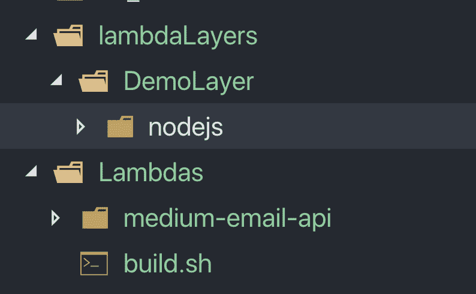
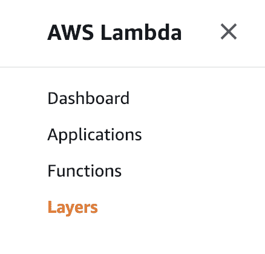
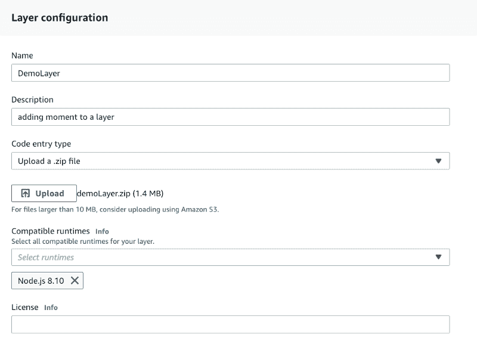
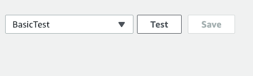
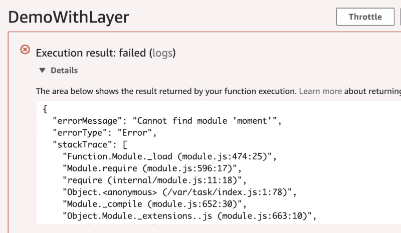
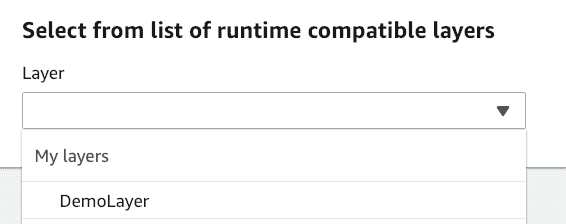
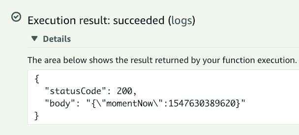

# 如何为您的 AWS Lambdas 构建和使用图层

> 原文：<https://www.freecodecamp.org/news/lambda-layers-2f80b9211318/>

AWS 兰博达太棒了！它们简化了无服务器应用程序的部署。它们让我们能够真正快速地构建原型并自动扩展。将每个函数作为独立实体的一个问题是，您需要将公共代码包含到每个 Lambda 中。

> 如果你不得不以同样的方式做同样的事情三次，那么是时候自动化了——自动化三法则

[https://www.youtube.com/embed/5a2LS7gNECk?feature=oembed](https://www.youtube.com/embed/5a2LS7gNECk?feature=oembed)

### 层

Lambda 层已经被创建来解决这个*重复代码*的问题。它们的工作方式是将您的公共代码部署到一个层中。这可以是您经常使用的公共代码或 NPM 包。当你将这一层连接到你的 Lambda 之一时，你可以从你的 Lambda 内部访问所有的公共代码。

这意味着你不必将同一个文件复制到每个 Lambda 文件夹中，或者创建你自己需要的“公共”repo。

### 设置图层

由于层只是代码的集合，我们可以从为该层创建一个新文件夹开始。我喜欢把我所有的图层放在我的 Lambdas 文件夹旁边的一个文件夹中。我们可以创建一个名为 *DemoLayer* 的新层文件夹，它需要有一个运行时要使用的文件夹。对于这个例子，我们将使用 *nodejs，*来创建这个文件夹。

```
mkdir -p lambdaLayers/DemoLayer/nodejs
```



使用我们的终端，我们可以导航到 *DemoLayer* 文件夹并初始化 NPM。

```
cd lambdaLayers/DemoLayer/nodejs
npm init
```

接受 NPM 设置中的所有默认值，您的文件夹中就会生成 *package.json* 文件。

对于我们的第一层，我们将导入*时刻*库。这与您将任何 NPM 包添加到图层的过程相同。

```
npm install --save moment
```

#### 部署我们的层

既然我们的文件夹中有了公共代码，我们需要部署它。为此，我们需要压缩整个文件夹，然后将其作为 Lambda 层上传。要压缩文件夹内容，您可以导航到 *DemoLayer* 文件夹，并对文件夹内容运行 *zip* 命令。

```
cd ../
zip -r demoLayer.zip ./*
```

现在，您应该会在文件夹中看到一个`demoLayer.zip`文件。我们现在可以去 AWS 控制台创建我们的层。

在 AWS 控制台中，导航到 AWS Lambda，在左侧，我们应该有包括*层的选项。*



在图层菜单中，我们可以选择创建一个新的图层。点击这个打开设置选项，我们可以给层一个名称，一个描述，上传我们刚刚创建的 zip 文件，并选择运行时。



### 测试图层

随着层的创建，我们可以测试它的所有工作。为此，我们可以创建一个运行在节点 8.10 上的名为 *DemoWithLayer* 的新 Lambda。在这个 Lambda 中，我们可以添加以下代码:

```
const moment = require('moment');

exports.handler = async (event) => {
    let momentNow = moment.now();

    const response = {
        statusCode: 200,
        body: JSON.stringify({momentNow}),
    };
    return response;
};
```

我们可以通过创建一个测试事件来测试在没有该层的情况下运行时会发生什么。在 Lambda 控制台的右上角，点击*选择一个测试事件*，然后点击*配置测试事件。*这将打开一个配置窗口，我们在其中创建发送给处理程序的 JSON blob。因为我们不使用 event 对象，所以我们可以传递默认值，给这个测试命名并创建它。



我们现在可以点击*测试*按钮来运行我们的 Lambda。这样做会产生以下消息:



这是因为我们的 Lambda 没有安装*时刻*模块。我们现在可以添加我们的新层到 Lambda 并重新运行测试。

要添加图层，点击*演示图层*按钮下面的*图层*按钮。滚动到页面底部的*参考图层*部分，点击*添加图层*按钮。在弹出菜单中，我们可以从下拉菜单中选择我们的 *DemoLayer* ，并选择最高版本。



将它添加到 Lambda 中，并确保保存 Lambda 更改。当我们重新运行测试时，我们得到一个成功的响应。你可以用这个过程从你的 Lambdas 中删除很多常用的包。

