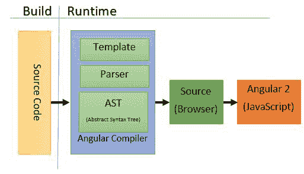
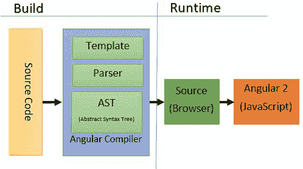

# 如何用 Angular 7 配置 Webpack 4:完整指南

> 原文：<https://www.freecodecamp.org/news/how-to-configure-webpack-4-with-angular-7-a-complete-guide-9a23c879f471/>

塞缪尔·特布尔

# 如何用 Angular 7 配置 Webpack 4:完整指南


Angular & webpack logos

Angular CLI 使得创建开箱即用的应用程序变得容易。它是一个很棒的工具，但是你有没有想过:*“它是如何工作的？没有 CLI，我如何构建应用程序？”*

当 Angular 7 发布时，我想到了这些问题。我开始在网上寻找答案，我发现对我的目的来说，这些答案并不是最新的。事实上，Angular 和 webpack 一直在发展，依赖关系和配置也是如此。

在本文中，您将了解到:

*   如何从头开始设置 Angular 7 基本应用程序
*   如何为开发模式配置 webpack(实时编译)
*   如何为生产模式配置 webpack(提前编译)

### Angular 7:设置一个基本应用程序

创建一个新的`package.json`文件，并添加以下几行来安装 Angular 及其依赖项。

```
"dependencies": 
  "@angular/animations": "~7.0",
  "@angular/common": "~7.0",
  "@angular/compiler": "~7.0",
  "@angular/compiler-cli": "~7.0",
  "@angular/core": "~7.0",
  "@angular/forms": "~7.0",
  "@angular/http": "~7.0",
  "@angular/platform-browser": "~7.0",
  "@angular/platform-browser-dynamic": "~7.0",
  "@angular/platform-server": "~7.0",
  "@angular/router": "~7.0",
  "@angular/upgrade": "~7.0",
  "core-js": "~2.5",
  "rxjs": "~6.3",
  "zone.js": "~0.8"
}
```

我花了很长时间来寻找适合每个 Angular 项目的最佳文件夹结构，尤其是当应用程序变大时。这篇[文章](https://medium.com/@motcowley/angular-folder-structure-d1809be95542)在这个问题上教会了我很多。

创建一个新的`src`文件夹，并在其中创建以下文件夹/文件。我们所有的 Angular app 业务逻辑都会在这个文件夹里。

```
src
|__ app
    |__ modules
        |__ menu
            |__ components
                |__ menu
                    |__ menu.component.html
                    |__ menu.component.scss
                    |__ menu.component.ts
            |__ menu.module.ts
            |__ menu-routing.module.ts
|__ shared
         |__ components
             |__ home
                 |__ home.component.html
                 |__ home.component.scss
                 |__ home.component.ts
|__ app.component.html
        |__ app.component.scss        
        |__ app.component.ts
        |__ app.module.ts
        |__ app-routing.module.ts
|__ index.html
|__ main.ts
```

每个应用程序都至少有一个 Angular 模块，即启动应用程序的*根*模块。按照惯例，通常称为`AppModule`。我创建了另一个模块`MenuModule` ,向您展示如何在您的项目中使用延迟加载，尤其是在生产中。

一些要点:

*   `index.html`

Add `<base href=”/”>`告诉我们的 Angular 路由器如何编写导航 URL。这一行意味着你的应用程序将从根文件夹开始，即在本地它将考虑`localhost:3000/`，在服务器上它将考虑根文件夹。

*   `app-routing.module.ts`

设置延迟加载功能模块有三个主要步骤:

1.  创建特征模块
2.  创建特征模块的路由模块
3.  配置路线

`{path: ‘menu’, loadChildren:’./modules/menu/menu.module#MenuModule’}`告诉 Angular 在用户访问`/menu`路线时延迟加载我们的功能模块`MenuModule`。

### 类型脚本配置

将以下几行添加到您的`package.json`文件中:

```
"devDependencies": {
  "@types/core-js": "~2.5",
  "@types/node": "~10.12",
  "typescript": "~3.1"
}
```

在您的根项目文件夹中创建一个`tsconfig.json`文件:

```
{
  "compilerOptions": {
    "target": "es5",
    "module": "commonjs",
    "moduleResolution": "node",
    "sourceMap": true,
    "emitDecoratorMetadata": true,
    "experimentalDecorators": true,
    "noImplicitAny": true,
    "suppressImplicitAnyIndexErrors": true,
    "lib": ["es6", "dom"],
    "typeRoots": ["node_modules/@types"]
  },
  "exclude": ["node_modules"]
}
```

这是一个基本的 TypeScript 配置文件。必须安装`node`和`core-js`类型定义。没有它，TypeScript 就无法将我们的 Angular 应用程序编译成 JavaScript。

### 开发模式的 Webpack 配置(实时编译)

首先，*编译*是什么意思？并不是说把 TypeScript 文件编译成 JavaScript，这个和 Angular 无关。Angular 本身需要将 HTML 模板编译成 JavaScript，这可能发生在两个不同的时间点:

*   在浏览器中下载应用程序(JiT)后



JiT compilation

*   就在开发之后，在构建时，在浏览器中下载应用程序之前(AoT)



#### 什么是 webpack？

根据维基百科:

> Webpack 是一个开源的 JavaScript 模块捆绑器。它的主要目的是捆绑 JavaScript 文件以便在浏览器中使用，但它也能够转换、捆绑或打包任何资源或资产。Webpack 获取具有依赖关系的模块，并生成表示这些模块的静态资产。它是一个主要针对 JavaScript 的模块捆绑器，但是如果包含相应的插件，它可以转换前端资产，如 HTML、CSS，甚至图像。

为了告诉 webpack 如何捆绑我们的应用程序，我们必须配置我们称之为 *[的核心概念](https://webpack.js.org/concepts/)* :

**入口—** 入口点指示哪个模块 webpack 应该开始构建其内部的[依赖图](https://webpack.js.org/concepts/dependency-graph/)。Webpack 将找出入口点依赖的其他模块和库(直接或间接)。

**输出—** 输出属性告诉 webpack 将它创建的包发送到哪里，以及如何命名这些文件。对于主输出文件，它默认为`./dist/main.js`,对于任何其他生成的文件，它默认为`./dist`文件夹。

**加载器—** 在 webpack 配置中，加载器有两个属性:

*   test 属性标识应该转换哪个或哪些文件。
*   use 属性指示应该使用哪个加载程序来进行转换。

**插件—** 虽然加载器用于转换某些类型的模块，但插件可以用于执行更广泛的任务，如包优化、资产管理和环境变量注入。

所有这些都必须在 webpack 配置文件`webpack.config.js.`中设置

#### 配置 webpack

在`src`文件夹中，我们需要再创建 2 个文件:

*   仅导入应用程序的第三方模块。
*   `polyfills.ts`我们需要 polyfills 在大多数浏览器中运行 Angular 应用程序，详见[浏览器支持](https://v5.angular.io/guide/browser-support)指南。这个包文件将首先加载，因此这是为生产或开发配置浏览器环境的好地方。

创建一个新的`config`文件夹，并在其中包含以下文件:

*   `webpack.config.common.js`:我们将用于开发和生产的配置。

**入口—** 对于这个应用程序(实际上对于大多数应用程序)，我们有 3 个不同的入口点:`vendor.ts` `polyfills.ts`和`main.ts.`

```
entry: {
    vendor: './src/vendor.ts',
    polyfills: './src/polyfills.ts',
    main: './src/main.ts'
}
```

**加载器—** 我们用`html-loader`加载`.html`文件，这是非常标准的。加载`.scss`文件对于一个 Angular 应用来说有点棘手，我花了好几个小时才弄明白怎么做。

首先，我们必须使用两个加载器`sass-loader` 和`css-loader.`来加载 sass 文件，如果你想让调试变得容易，尤其是在开发模式下，添加`sourceMap: **true**` 作为选项真的很重要。在 Angular 应用程序中，我们通过向`styleUrls`数组传递一个文件路径来给组件添加样式，如下所示`styleUrls: ["./path/styles.scss"]`，但是我们需要将样式作为一个字符串，而`to-string-loader`将为我们做这件事，并将输出转换为一个字符串。

```
{
    test: /\.html$/,
    loader: 'html-loader'
},
{
    test: /\.(scss|sass)$/,
    use: [
        'to-string-loader',
        { 
            loader: 'css-loader', 
            options: { 
                sourceMap: true 
            } 
        },
        { 
            loader: 'sass-loader', 
            options: { 
                sourceMap: true 
            } 
        }
    ],
    include: helpers.root('src', 'app')
}
```

**插件—** `CleanWebpackPlugin`将在再次构建之前移除/清理您的构建文件夹。`HtmlWebpackPlugin` plugin 将为您生成一个 HTML5 文件，该文件使用脚本标签将您的所有 webpack 包包含在主体中。它只需要模板的路径。

```
new CleanWebpackPlugin(
    helpers.root('dist'),
    {
        root: helpers.root(),
        verbose: true
    }
),
new HtmlWebpackPlugin({
    template: 'src/index.html'
})
```

*   `webpack.config.dev.js` 是我们的 webpack 配置，仅用于开发模式。

```
mode: "development"
```

在 webpack 4 中，chosen 模式告诉 webpack 相应地使用其内置优化。

```
devtool: 'cheap-module-eval-source-map'
```

该选项控制是否以及如何生成源地图。通过使用`cheap-module-eval-source-map`，来自加载器的源地图被处理以获得更好的结果。但是，加载器源映射被简化为每行一个映射。

```
output: {
    path: helpers.root('dist'),
    publicPath: '/',
    filename: '[name].bundle.js',
    chunkFilename: '[id].chunk.js'
}
```

`output`键包含一组选项，指示 webpack 如何以及在哪里输出您的捆绑包、资产以及您使用 webpack 捆绑或加载的任何其他内容。这里我们告诉 webpack 将我们的包输出到`dist`文件夹。

```
optimization: {
    noEmitOnErrors: true
}
```

每当编译过程中出现错误时，跳过发出阶段。这确保不会发出出错的资产。根据您的 webpack 配置模式(开发/生产)，默认情况下,`optimization`键有许多其他选项。你可以在这里了解更多信息。

```
{
    test: /\.ts$/,
    loaders: [
        'babel-loader',
        {
            loader: 'awesome-typescript-loader',
            options: {
                configFileName: helpers.root('tsconfig.json')
            }
        },
        'angular2-template-loader',
        'angular-router-loader'
    ],
    exclude: [/node_modules/]
}
```

`angular-router-loader`是一个 webpack 加载器，支持使用 Angular 路由器加载基于字符串的模块。

`angular2-template-loader`是一个链到加载器，在 Angular 组件中内嵌所有 html 和样式。

`awesome-typescript-loader`是目前速度更快的 webpack TypeScript 加载器。它使用依赖解析来建立模块依赖图。这相对加快了构建过程。

`babel-loader`允许传输 JavaScript 文件。

```
devServer: {
    historyApiFallback: true,
    stats: 'minimal'
}
```

当使用 [HTML5 历史 API](https://developer.mozilla.org/en-US/docs/Web/API/History) 时，`index.html`页面将可能不得不代替任何`404`响应。为此，我们需要启用`historyApiFallback.`

`stats`选项可让您精确控制显示哪些捆绑信息。如果您想要一些包信息，但不是全部，这可能是一个不错的折中方案。

#### 添加脚本

将以下几行添加到您的`package.json`文件中:

```
"scripts": {
  "build:dev": "webpack-dev-server --inline --hot --progress --port 8080"
}
```

`--hot`启用 webpack 热模块更换(HMR)。它在应用程序运行时交换、添加或删除[模块](https://webpack.js.org/concepts/modules/)，无需完全重装。这可以在几个方面大大加快开发速度:

*   保留在完全重新加载过程中丢失的应用程序状态。
*   通过只更新更改的内容来节省宝贵的开发时间。
*   在源代码中对 CSS/JS 进行的修改会导致即时的浏览器更新，这几乎相当于直接在浏览器的开发工具中更改样式。

现在你已经准备好了！您可以运行`npm run build:dev` 打开浏览器并导航至`localhost:8080.`

### 生产模式的 Webpack 配置(提前编译)

#### AoT 编译的优势

*   使用 AoT，浏览器下载应用程序的预编译版本。浏览器加载可执行代码，因此它可以立即呈现应用程序，而无需等待先编译应用程序。
*   编译器将外部 HTML 模板和 CSS 样式表内联到应用程序 JavaScript 中，消除了对这些源文件的单独 AJAX 请求。
*   如果应用已经编译好了，就不需要下载 Angular 编译器了。编译器大约是 Angular 本身的一半，所以省略它会大大减少应用程序的负载。
*   AoT 编译器在构建步骤中检测并报告模板绑定错误，然后用户才能看到它们。
*   在将 HTML 模板和组件提供给客户机之前，AoT 很久就将它们编译成 JavaScript 文件。由于没有需要读取的模板，也没有危险的客户端 HTML 或 JavaScript 评估，注入攻击的机会就更少了。

#### 配置 webpack

在您的`config`文件夹中创建一个新文件`webpack.config.prod.js`

```
mode: 'production'
```

我们通常在生产模式下进行 AoT 编译，正如我之前所写的，在 webpack 4 中，chosen 模式告诉 webpack 相应地使用它的内置优化。

```
output: {
    path: helpers.root('dist'),
    publicPath: '/',
    filename: '[hash].js',
    chunkFilename: '[id].[hash].chunk.js'
}
```

我们还告诉 webpack 将我们的包输出到`dist` 文件夹。我们在文件名中加入了一个哈希，以有效利用客户端级缓存。通过这种方式，webpack 知道文件是否已经更改。Webpack 为此提供了**占位符**。这些字符串用于将特定信息附加到输出中。最有价值的是:

*   `[id]`返回块 id。
*   `[path]`返回文件路径。
*   `[name]`返回文件名。
*   `[ext]`返回扩展名。`[ext]`适用于大多数可用字段。
*   `[hash]`返回构建哈希。如果构建的任何部分发生变化，它也会发生变化。
*   `[chunkhash]`返回特定于块的条目哈希。配置中定义的每个`entry`都会收到自己的散列。如果条目的任何部分发生变化，哈希也会发生变化。根据定义，`[chunkhash]`比`[hash]`更细粒度。
*   `[contenthash]`返回基于内容生成的哈希。

最好只在生产中使用`hash`和`chunkhash`,因为哈希在开发过程中并不重要。

```
optimization: {
    noEmitOnErrors: true,
    splitChunks: {
        chunks: 'all'
    },
    runtimeChunk: 'single',
    minimizer: [
        new UglifyJsPlugin({
            cache: true,
            parallel: true
        }),

         new OptimizeCSSAssetsPlugin({
             cssProcessor: cssnano,
             cssProcessorOptions: {
                 discardComments: {
                     removeAll: true
                 }
             },
             canPrint: false
         })
    ]
}
```

*   与开发模式一样，每当编译时出现错误，我们都希望跳过发布阶段。这确保不会发出出错的资产。
*   `chunks: ‘all’`表示将选择哪些块进行优化。提供`all`可能特别强大，因为这意味着块甚至可以在异步和非异步块之间共享。
*   为每个运行时块单独初始化导入的模块。正如 [webpack](https://webpack.js.org/configuration/optimization/#optimization-runtimechunk) 所建议的，当处理一个有**多个入口点**的项目时，你希望只有一个运行时实例。为此，您需要将其设置为`‘single’`。
*   `UglifyJsPlugin`使用 [uglify-js](https://github.com/mishoo/UglifyJS2) 来缩小你的 JavaScript 文件。我们将`cache`和`parallel`属性设置为`true`，以便启用文件缓存并使用多进程并行运行来提高构建速度。有更多的选项可用，我邀请你了解更多关于这个插件的信息。
*   `OptimizeCSSAssetsPlugin`将在 webpack 构建过程中搜索 CSS 资产，并将其优化和最小化。用于优化的 CSS 处理器是`cssnano.`,所有的评论都将从我们缩小的 CSS 中删除，不会有任何消息被打印到控制台。

```
module: {
    rules: [
        {
            test: /(?:\.ngfactory\.js|\.ngstyle\.js|\.ts)$/,
            loader: '@ngtools/webpack'
        }
    ]
}

plugins: [
    new ngw.AngularCompilerPlugin({
        tsConfigPath: helpers.root('tsconfig.aot.json'),
        entryModule: helpers.root('src', 'app', 'modules', 'app', 'app.module#AppModule')
    })
]
```

`@ngtools/webpack`是 AoT 编译你的 Angular 组件和模块的官方插件。加载器与 webpack 插件一起编译您的类型脚本。重要的是包含这两者，并且不包含任何其他的 TypeScript 编译器加载器。

#### 添加 main.aot.ts 文件

在`src`文件夹中添加`main.aot.ts`文件:

```
import { enableProdMode } from '@angular/core';
import { platformBrowser } from '@angular/platform-browser';

import { AppModuleNgFactory } from './app/app.module.ngfactory';

enableProdMode();

platformBrowser().bootstrapModuleFactory(AppModuleNgFactory);
```

您的`main`条目在生产模式和 AoT 编译上有些不同:

*   导入`enableProdMode`来禁用 Angular 的开发模式，这将关闭框架内的断言和其他检查。
*   导入`platformBrowser` **而不是** `platformBrowserDynamic`是因为在 AoT 编译中，你的应用程序被运送到已经编译好的浏览器中，而在 JiT 编译中，它发生在浏览器级别。
*   你需要导入`AppModuleFactory`而不是导入`AppModule`，这是我们的 Angular 编译器生成的编译后的应用程序。

#### 添加脚本

将以下脚本添加到您的`package.json`文件中:

```
"webpack-prod": "cross-env NODE_ENV=production webpack --mode production"

"build:prod": "npm run build:clean && ngc && npm run webpack-prod && npm run build:clean"

"build:clean": "del-cli 'src/**/*.js' 'src/**/*.js.map' 'src/**/*.ngsummary.json' 'src/**/*.metadata.json' 'src/**/**/*.ngfactory.ts' 'src/**/*.ngstyle.ts' 'src/**/*.shim.ts'"

"serve": "lite-server"
```

*   为了编译你的应用程序，Angular 编译器会生成很多文件。为了保持项目的整洁，我们在编译前和生成包后删除了所有这些文件。
*   `build:prod`:用`ngc`命令运行 Angular 编译器，然后在生产模式下运行 webpack 来生成您的包。
*   我使用 lite-server 来服务我们的应用程序，看看它是什么样子的。当然，在现实世界的项目中你不需要它，因为你的应用程序将由云提供服务。

现在，您可以运行`npm run build:prod`来编译您的 Angular 应用程序并构建您的包。然后，运行`npm run serve`将您的应用程序提供给浏览器。


Hugh Jackman enjoying the article

我希望你喜欢这篇文章！如果你有任何问题/建议，请在下面的评论中告诉我。

项目文件在我的 GitHub 上:

[**samteb/Angular-7-Webpack-4**](https://github.com/samteb/Angular-7-Webpack-4)
[*通过在 GitHub 上创建账号为 samteb/Angular-7-web pack-4 开发做贡献。*github.co](https://github.com/samteb/Angular-7-Webpack-4)