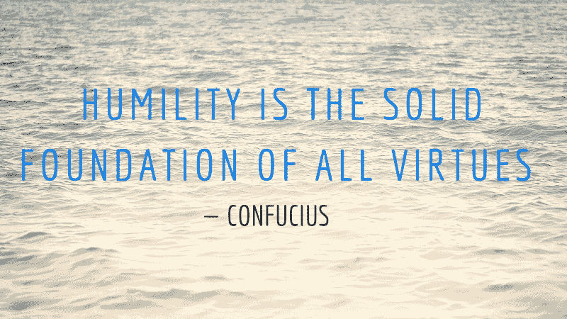

# 为什么谦逊是伟大开发人员最重要的品质

> 原文：<https://www.freecodecamp.org/news/a-first-class-temperament-the-emergence-of-a-star-developer-9321eeb57005/>

由 Semi Koen

# 为什么谦逊是伟大开发人员最重要的品质

#### 把你的自我放在软件开发之外！

Photo by [Shirly Niv Marton](https://unsplash.com/@sniv?utm_source=medium&utm_medium=referral) on [Unsplash](https://unsplash.com?utm_source=medium&utm_medium=referral)

### 一流气质:一个明星开发商的出现

在我最近的工作中，我负责一个由非常有才华的高级开发人员组成的团队，我逐渐意识到，我所面临的最困难的问题不是技术性质的，而是处理人际关系。因此，我得出结论，智力和技术能力是成功的必要条件，但不足以让我们成为伟大的开发人员。

在这里，我将谈论我排在首位的一个价值观，它将一个伟大的开发人员提升为一个公司拥有的最佳资产。这是经理们全心全意为之奋斗的一个价值，在他们的团队中有:**谦逊**！

⚠️澄清:在这篇文章中，我想当然地认为开发者在技术上很有天赋。我不是在争论技术能力和人际交往能力哪个更重要。然而，如果我必须做出选择，作为一个领导，我将永远选择后者！！

> **“二等才学；**
> 一流气质——最高法院大法官奥利佛·文德尔·霍马斯在会见富兰克林·罗斯福时说

所以，让我们探索工作中谦逊的艺术和科学…

### 谦逊不是看轻自己，而是看轻自己

在我作为开发人员的职业生涯中，我对构建高质量软件了解得越多，我就变得越谦虚。最难的事情是接受我不知道所有该知道的事情，并承认这样一个事实，即使我是某个特定领域的专家，知道所有的关键案例和疑难杂症，仍然有很多东西要学。**没事！**

谦逊不是压制我们的意见，保持低调或让别人凌驾于我们之上。简单地说，就是要:

*   意识到我们不是宇宙的中心:团队才是，公司才是；
*   请记住，我们的经理不想每天和一个女主角打交道——做生意是他们的首要任务；
*   认识到没有人是不可替代的——这是保持行业竞争力和专注的所有业务的基础；
*   要意识到那些自大的人不会让我们在软件团队中有任何作为——无论是在小软件公司，大公司银行还是硅谷！

自我是对我们的自我重要性的信念，并且认为世界从我们开始，也从我们结束。是我们**幼稚的内心声音**选择了一直赢，有时是以牺牲他人为代价。

*   当我们被质疑时，它让我们感觉受到了威胁。我们感到暴露和脆弱，因此我们变得具有防御性，在最坏的情况下，我们变得恶意和傲慢。
*   这就是阻止我们**寻求**帮助、合作和学习新东西的原因。
*   它阻止我们从失败的项目中恢复过来，从错误中学习。
*   它让我们**放弃**别人的解决方案，因为它不是我们的。
*   这让我们**吹嘘**我们以前的重要成就，因为我们认为这是我们的队友尊重我们所需要知道的。

…如此多的有害行为不仅影响项目和团队，也影响我们！但是我们太短视了，没有意识到！

Photo by [rawpixel](https://unsplash.com/@rawpixel?utm_source=medium&utm_medium=referral) on [Unsplash](https://unsplash.com?utm_source=medium&utm_medium=referral)

### 成为一名优秀的开发者

这些年来，我观察到，那些真正精通自己技艺的人都知道自己的极限。他们不太倾向于假设他们自动知道一切。他们是与一起工作的**福气！他们的同事爱他们，他们的经理也爱他们。你可以和一个卑微的人做*结对* *编程*。你可以和一个谦逊的人一起做代码*评审*。你可以*教导*一个卑微的人！**

以下是他们行为的一些例子:

*   他们**思想开放**并积极提问，倾听和**相应地调整**他们的观点。
*   他们尊重他人的意见和他们的能力水平——他们的态度是教导而不是冒犯。
*   他们进行代码审查，并提供公正的反馈，他们既关心同事的感受，也关心代码的质量。
*   他们意识到糟糕的代码可能是由于过分的截止日期或对技术债务的疏忽造成的，而不一定是糟糕的开发人员造成的，因此，他们不会**评判**！

### 外卖

不管是好是坏，现在对开发人员的需求越来越大(在可预见的未来也是如此)。我们确实拥有利基知识，并且能够解决问题——这些技能对于非 IT 专业的人来说似乎深不可测。还有一种放大的看法，即**代码**是我们工作中唯一有价值的产出，软技能无关紧要。

这不应该成为傲慢和极端自我主义的理由和借口！

在物理学中有一种叫做熵的东西:**我们要么上升，要么下降**！没有停滞。很容易成功一个星期，或者一个月甚至几年。在某些时候，我们会被自我所困，**人们会看穿我们**，我们会很快失败。我相信真正的成功是可以持续的，只要每天都表现出谦逊！

感谢阅读！

**P.S.** 你有没有看过[埃德格·w·迪克斯特拉](https://en.wikipedia.org/wiki/Edsger_W._Dijkstra)的《[卑微的程序员](https://www.cs.utexas.edu/~EWD/ewd03xx/EWD340.PDF)随笔？太经典了！

> 有能力的程序员充分意识到他的脑壳有严格的大小限制。因此，他以完全谦逊的态度对待编程任务，除了其他事情之外，他还像躲避瘟疫一样躲避聪明的诡计”

我定期撰写关于领导力、技术和数据的文章。如果你想阅读我未来的帖子，请[关注我的媒体](https://medium.com/@semika)！