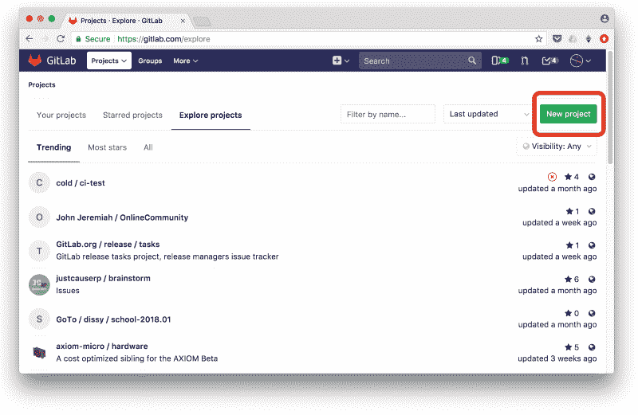
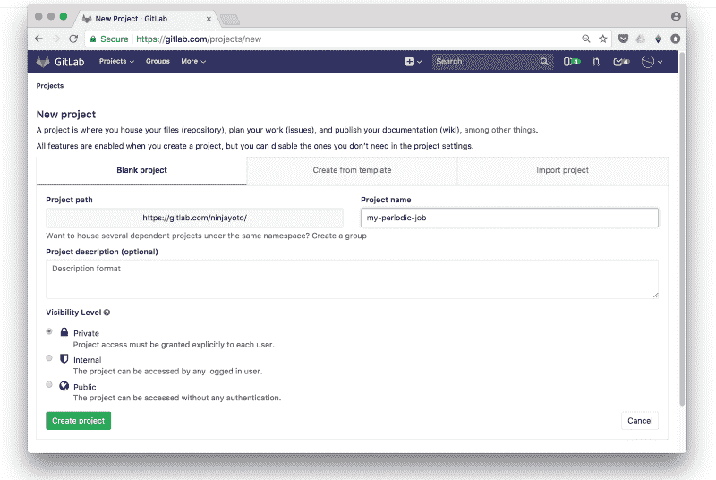
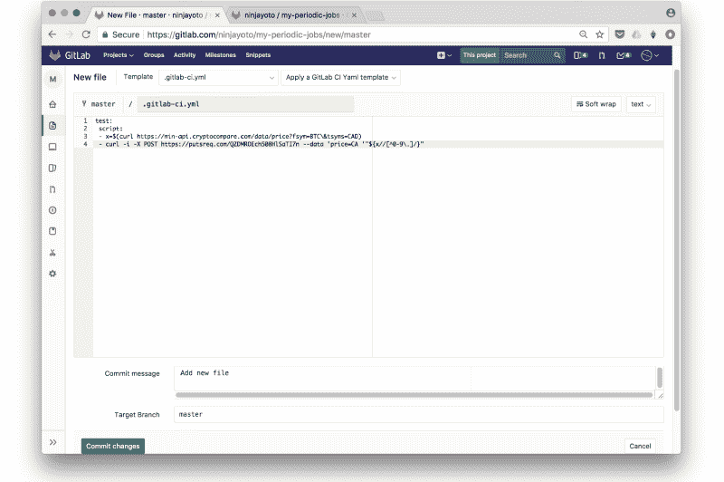
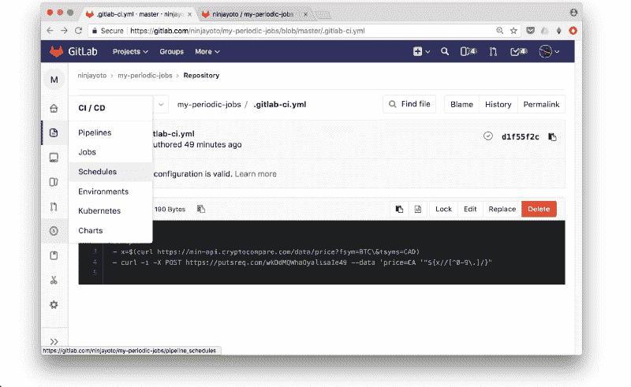
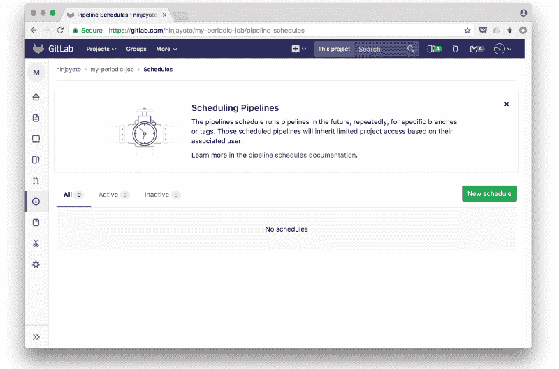
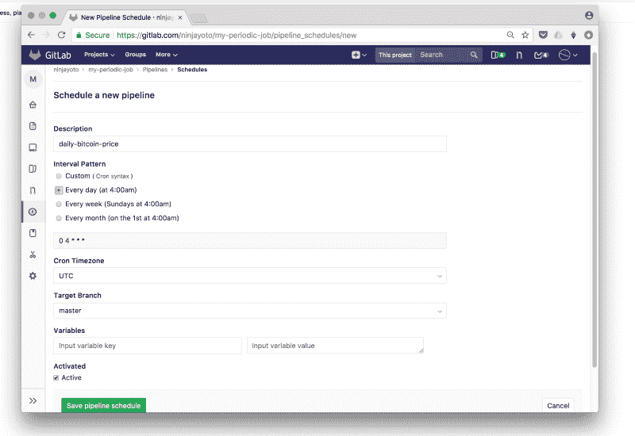
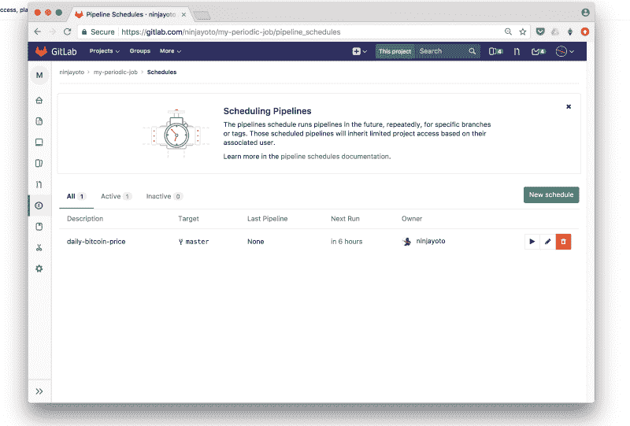
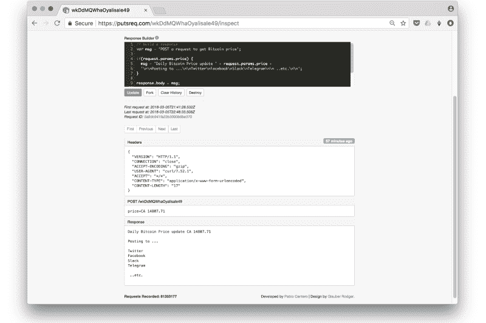

# 如何让 GitLab 在不到一分钟的时间内为你做周期性的工作

> 原文：<https://www.freecodecamp.org/news/56-seconds-to-get-gitlab-to-do-periodic-jobs-for-you-6a731b977559/>

莫伊·易卜拉欣

# 如何让 GitLab 在不到一分钟的时间内为你做周期性的工作


如果没有计算机做周期性的工作，技术会是什么样子？

无论是你的手机不断检查你的收件箱，还是及时收到天气或航班延误的提醒。

一个比特币 vs 加元价格服务怎么样，只需要 56 秒？没有 *IFTTT* ，没有 *Zapier* ，但是也没有编程语言——没有框架，没有服务器或 docker 配置，没有 Raspberry Pi，没有 AWS，没有测试！

为了使示例尽可能通用，我们将只使用两个命令行:

*   一个是从 API 获取比特币价格
*   另一个将它发布到另一个服务。

当然，你可以将价格发布到 Twitter、Twilio、Telegram、Slack 等网站上，让这个功能更加有用。但是这里我们将简单地把它发送到 putsreq.com，这样我们就可以检查 post 请求。

然后我们将使用 GitLab-CI 安排它每天运行。

> **级别**:所有级别

> **需求**:任何网络浏览器

让我们开始吧:

1.  **在 gitlab.com[创建一个免费账户](https://gitlab.com/users/sign_in)**(20 秒)

2.**创建新项目:**点击 ***新建项目*** 按钮创建新的 repo，并在名称字段中键入 *periodic-job* 或任何其他名称。(9 秒)



然后点击 ***创建项目*** 保存(1 秒)。



3.**在这个新项目中创建一个. gitlab-ci.yml 文件:**点击 ***新建文件*** ，将下面的代码片段复制粘贴到。gitlab-ci.yml 文件，然后单击保存(5 秒钟)



```
test:
```

```
 script:
```

```
 - btc=$(curl https://min-api.cryptocompare.com/data/price?fsym=BTC\&tsyms=CAD)
```

```
- curl -i -X POST https://putsreq.com/wkDdMQWhaOyalisaIe49 — data ‘price=CA$ ‘“${btc//[0-9\.]/}”
```

这基本上是两个简单的命令。在这里，我们可以进一步补充

[*if[$ BTC-ge 15000-a $ BTC-lt 7000]；然后*](https://hackernoon.com/71-seconds-to-build-your-free-custom-webhook-illustrated-step-by-step-7a09b9e240ba)

条件，甚至运行完整的 bash 脚本文件，但是让我们保持简单。

点击 ***Commit changes*** 按钮，这将触发它的构建和运行。

4.**安排它每天运行:**单击 CI/CD 图标展开菜单，选择 Schedules 为您要触发的定期作业设置名称和计时器。(11 秒)



click on **New schedule** button



Type in a name for the new schedule **daily-bitcoin-price-job**, select to run it daily then click **Save**



Your scheduled job has been saved

5.恭喜你。你完了。请访问 putsreq.com 的[链接，了解它的实际应用。(10 秒钟)](https://putsreq.com/wkDdMQWhaOyalisaIe49/inspect)



这项工作将每天运行，只要你的免费 2000/月建设分钟没有用完。

我们甚至还没有触及 GitLab-CI 的表面——只是想一想使用它来创建 webhooks 或[将它连接到 IFTTT](https://medium.com/@YYC_Ninja/99-seconds-to-make-bitcoin-call-your-phone-number-a8cbd9740f76) 和 Zapier，从而将它连接到数百个服务的所有可能性。

在下一篇文章中，我们将回顾我们刚刚完成的工作，以及我们如何更上一层楼，创建一个 webhook，并使用它发布到社交媒体上。

你可以在这里找到[示例代码，你可以在这里](https://gitlab.com/ninjayoto/my-periodic-jobs/tree/master)阅读[构建日志。](https://gitlab.com/ninjayoto/my-periodic-jobs/-/jobs)