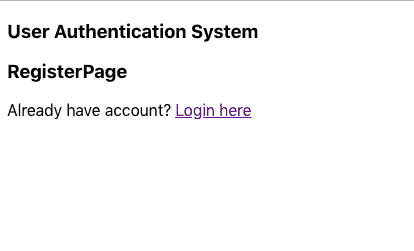
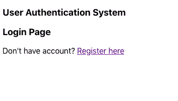
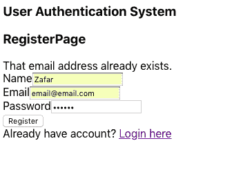
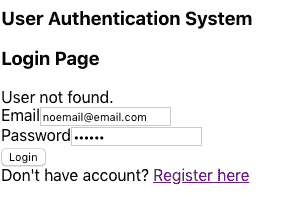
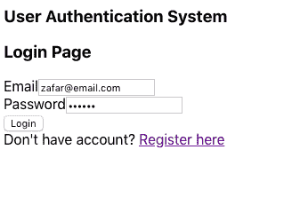
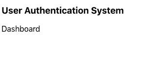

# 如何使用 React、Redux 和 Redux Saga 设置用户认证

> 原文：<https://www.freecodecamp.org/news/login-using-react-redux-redux-saga-86b26c8180e/>

作者:扎法尔·萨利姆

**更新(12.02.2019):我最近用最新的 react 路由器(即版本 4.3.1，react-router-dom)更新了这个项目。请前往其存储库查看更改。**

在我之前的博客中，我写了如何在 Node.js 中编写一个可扩展的架构。因为我使用 postman 来测试该平台的工作，我认为让它在客户端实现是一个好主意。为了编写它的客户端，我决定使用下面的技术栈:

*   反应
*   Redux
*   还原传奇
*   反应路由器

**本帖假设你已经知道 react 以及 Redux 和 Redux-Saga 的基本概念。**

### 入门指南

克隆我以前的博客[仓库](https://github.com/zafar-saleem/NodeScalableArchitecture)。`CD`到它的根文件夹中，运行`npm install` *。*这将安装所有依赖项。

其次，[在你的机器里安装 mongodb](https://docs.mongodb.com/manual/installation/) 。安装完成后，在您的终端中使用`mongod` 命令运行 mongo server，如果它没有在您的机器中作为服务启动的话。

接下来，确保 [nodemon](https://nodemon.io/) 包被安装在你的机器**全局**上。转到服务器端文件夹，运行`nodemon index.js` 运行后端服务器。

既然我们的后端已经启动并运行，是时候进入它的客户端实现了。

如果你还没有安装`create-react-app` ，那么使用下面的命令安装它。

```
npm install create-react-app -g
```

该命令将全局安装`create-react-app`***。***

### ***创建项目***

***现在是创建项目的时候了。使用:***

```
***`create-react-app react-login`***
```

***这会创建一个名为`react-login` *的新项目。*往前走，把`cd`放进那个文件夹。在您喜欢的编辑器中打开您的`package.json` 文件，并添加以下依赖项:***

***在这个`package.json`文件中我们不需要任何额外的属性。我们可以简单地删除它们，但我会让它保持原样，继续前进，以便我们在这个博客中找到有趣的部分。***

***现在只需运行:***

```
***`npm install`***
```

***这将安装我们上面提到的所有依赖项。***

#### ***索引文件***

***首先，打开`index.js` 文件，将下面的代码放到这个文件中。***

***在这段代码中，我们导入了`react`和`react-dom`。然后我们从 T4 进口 T2 和 T3。这些是路由目的所需要的，我将在后面的`routes/index.js` 文件中使用。接下来，我们导入`Provider`，这用于为子组件提供存储。***

***`configureStore`和`routes`是我们接下来要导入的东西，我将马上实现它们。只需按原样导入它们，并在这个文件中使用它们，如上所示。***

***现在我们的索引文件已经设置好了。***

#### ***商店配置***

***在`src` 文件夹内新建一个名为`store` 的文件夹。在这个新文件夹中，创建一个名为`configureStore.js`、的文件，并将下面的代码粘贴到这个文件中。***

***首先，我们从`redux`导入`createStore`，它将被用于`createStore`，以及`applyMiddleware`，它将被用于将中间件应用到我们的商店——在这种情况下是 sagas，但我们将在本博客的稍后部分讨论这个问题。***

***然后我们导入`rootReducer`——我们稍后将创建它。现在，只需导入它并按原样使用它。接下来是函数`configureStore`，它通过调用`createStore`函数并传递`rootReducer`作为参数来返回一个对象。***

***最后，`export configureStore`使`configureStore`在前面构建的`index.js`文件中可用。***

***既然已经不碍事了，继续创建`src/reducers` 文件夹，创建 *index.js* 文件并将下面的代码粘贴到这个文件中。***

***该文件负责导入 reducers 文件夹中的其余 reducers，合并它们，并导出它们，以便在`configureStore.js`中使用。当我们在博客中添加新的 reducers 时，我们会对这个文件进行修改。***

#### ***路由文件***

***路线文件的时间。继续创建`src/routes` 文件夹，并在这个文件夹中创建一个`index.js` 文件。现在打开它并粘贴下面的代码。***

***这个文件的主要目标是处理我们项目中的路由。文件导入`React`、`Route`和`IndexRoute`。之后，我们需要一个容器，在这种情况下，我正在导入`container/App`，我们将很快编写它。下一个是`RegisterPage`，它是一个组件，我们也将写它。***

***在父容器`Route`中，当主路径匹配时，我们简单地渲染我们的`App`容器。在`IndexRoute`上，用户将看到`RegisterPage`，它将被呈现在`App`容器内。***

#### ***容器***

***现在是容器的时间了。继续创建一个名为`container`的新文件夹。在这个文件夹中创建一个名为`App.js`的新文件，并将下面的代码放到这个文件中。***

***这很简单。这个文件的主要目的是渲染其余的组件。`{this.props.children}` 正是为此服务的。***

#### ***登记***

***现在是`registerPage`的时候了。创建一个新的文件夹`src/components` ，并在组件文件夹内创建一个名为`registerPage.js`的组件。将下面的代码粘贴到这个组件中。***

***目前，这是一个非常简单的组件。我们稍后将编辑它，添加一个注册表单，并在其中加入一些功能。***

#### ***输出***

***创建完上面所有的文件夹和文件后，在你的项目中运行`npm start`，在浏览器中打开`http://localhost:3000` 。你应该能看到下面的结果。***

******

***单击此处的登录将**而不是**重定向到我们接下来要修复的登录路径。***

### ***让它工作***

#### ***按指定路线发送***

***为了使路由工作，首先在 components 文件夹中创建一个新组件。将其命名为`loginPage.js`，并将下面的代码放入这个组件中。***

***这个组件非常简单。它呈现基本内容和注册组件的链接。***

***现在打开我们已经在上面创建的`routes.js`文件，并进行如下修改。***

***将索引路径更改为`LoginPage`,因为我们希望用户在访问主页时登陆登录组件。在此之前，从组件文件夹导入它。***

***现在刷新你的浏览器，你应该可以先看到`loginPage`。当您单击“在此注册”链接时，`registerPage`应该会呈现出来。***

************

***现在我们有了基本的工作路线。***

### ***登录和注册***

#### ***登记***

***为了使登录过程有效，我将首先处理注册过程，以便我们在数据库中添加一些用户。所以让我们打开`components/registerPage.js`，用下面的内容更新它。***

***现在这个文件里好像有很多代码，但是都很简单。首先我们导入`connect` 来连接我们的`store`和`registerPage` 组件。然后我们导入接下来要写的`registerUserAction` 。***

***在`render`函数中，首先我检查来自服务器的响应是否存在，然后分配从服务器接收的成功和消息属性。这可以是一个单独的函数，但是为了简单起见，我将它们放在了`render`函数中。***

***接下来是登记表。当用户点击注册按钮时，它触发`onHandleRegistration`函数，从表单中获取用户输入的数据，以及`dispatch registerUserAction` ，将他们的数据作为参数。下一步我们要写动作。***

***为了让上面的代码工作，我们需要`mapStateToProps`，就像我们在组件底部所做的那样，然后在最后将它与`registerPage`组件连接起来。***

*****动作*****

***现在是时候添加动作了。继续创建`src/actions` 文件夹。创建`index.js` 文件，并将下面的代码放入其中。***

***这段代码导出了我们将在整个项目中使用的一些常量。***

***现在继续在同一个文件夹中创建`authenticationActions.js` 文件，并将下面的代码放入其中。***

***在这里，我导入索引文件，该文件导出常量，然后我`export registrationUserAction`返回一个带有动作类型和用户数据的对象。这种情况下的动作类型是`REGISTER_USER`。当用户试图注册时，这个动作将被调度，并且这个动作将在我们的项目中可用，我们将在我们的传奇中听到。***

*****传奇故事*****

***现在我们正处于可以在我们的项目中介绍我们的传奇故事的阶段。如果你是 Redux-Saga 的新手，那么我建议你在继续之前浏览一下[这个博客](https://flaviocopes.com/redux-saga/)。***

***如果你已经知道了一些传奇故事，那么继续创建一个`src/sagas` 文件夹。创建`index.js` 文件，并将下面的代码放到这个文件中。***

***在上面的文件中，首先我从`effects`中导入`fork`，从`watchers`中导入`watchUserAuthentication`*——它还不存在，但我们接下来将创建该文件。然后我简单地导出一个[生成器函数](https://codeburst.io/understanding-generators-in-es6-javascript-with-examples-6728834016d5)并派生出`watchUserAuthentication` *。*****

****现在继续在上面的文件夹中创建一个`watcher.js`文件，并将下面的代码放入这个文件中。****

****同样，我从`redux-saga`导入`takeLatest` 效果，然后从`authenticationSaga.js`导入`registerSaga`，这是我们接下来要创建的。接下来，导入`actions/index.js`作为类型。****

****我正在导出一个生成器函数，它主要监视`REGISTER_USER`动作并调用`registerSaga`。****

****现在让我们在与上面相同的文件夹中创建`authenticatioSaga.js` saga，并将下面的代码放到这个文件中。****

****在这个故事中，我从`redux-saga`引入了更多的效果——T0 和 T1。然后`registerUserService`是从`service/authenticationService.js`进口的。我正在从`actions/index.js`导入所有动作作为类型。然后我在导出生成器函数`registerSaga`。****

****这个函数负责调用`registerUserService`，它向我们的服务器发出 ajax 调用来注册新用户——我将在这一步之后编写。它接收来自`registerUserService`的响应，并执行`REGISTER_USER_SUCCESS`动作。如果有一个错误，那么它将执行`REGISTER_USER_ERROR`操作。****

******导入传奇******

****现在我们有了自己的传奇故事，是时候把它们引入我们的商店了。打开`store/configureStore.js`并用以下内容更新其内容。****

****这里我导入的是`createSagaMiddleware`、`rootReducer`和`rootSaga`。然后，在`configureStore`函数中，我创建了一个新的`sagaMiddleware`，并使用`applyMiddleware`函数将其传递给`createStore`。最后，我正在运行`rootSaga`。****

****现在是时候创建`src/services`文件夹并创建一个新的第一个服务了。将其命名为`authenticationService.js` ，并将下面的代码放入该服务中。****

****这个文件使用 fetch API 通过一些参数和头来执行一个基本的 ajax 请求。这是一个非常简单明了的服务。****

******减速器******

****既然我们向服务器发出了请求，现在是时候在组件中接收响应了。为此，我们需要一个**减速器**。继续创建一个`reducers/registerReducer.js` 文件，并将下面的代码放入其中。****

****这是一个简单的获取状态并返回新状态的 reducer 函数。它检查`REGISTER_USER_SUCCESS`和`REGISTER_USER_ERROR`动作，并将新状态返回给组件。****

****现在打开`src/reducers/index.js` 文件，用以下内容更新它。****

****在此`rootReducer`中，我将导入所有减速器，然后在导出前将它们组合在一起。这正是我正在用`register`做的事情。****

******运行更新后的代码******

****现在我们完成了注册过程。是时候刷新您的浏览器，转到注册路线，并输入一些数据。如果您输入一个现有的电子邮件，那么您应该会看到下面的结果。****

********

****如果您输入新的电子邮件，那么您应该被重定向到`loginPage`，这是我们接下来要实现的。****

### ****注册****

****在用户注册后，是时候让他们登录了。继续打开`components/loginPage.js` 文件，用以下内容更新它。****

****这个组件和`registerPage`差不多。唯一的区别是它发送了我们接下来要写的`loginUserAction` 。另一个区别是，如果服务器的响应成功，我将收到一个`JWT token`。我将该令牌存储在`localStorage`中。您可以使用不同的方法，但对于这个例子，我使用这种方法。****

****继续打开`actions/authenticationActions.js` 并用以下内容更新它。****

****在这里，我用`LOGIN_USER`动作类型和`user payload`T3 导出新的`loginUserAction`函数。****

****在继续之前，打开`actions/index.js`文件，用下面的代码更新它的内容。****

****现在打开`sagas/watchers.js` 文件，用下面的内容更新它的内容。****

****这里我只是简单地导入`loginSaga`并在它接收到`LOGIN_USER` 动作时调用它。****

****我们还没有`loginSaga`。因此，请打开`sagas/authenticationSaga.js` 传奇，用以下内容更新它的内容。****

****在这里，我将导入一个额外的服务— `loginUserService` *、*，这是我接下来要实现的—然后导出名为`loginSaga`的新生成器函数，它做的事情与`registerSaga`非常相似。****

****现在打开`services/authenticationService.js` 服务，用下面的内容更新它的内容。****

****在这里，我添加了 loginUserService，它的功能与 registerUserService 非常相似，即发送一个 ajax 请求让用户登录。****

****既然我们已经成功地向服务器发送了一个请求，现在是时候接收服务器对登录组件的响应了。为此，创建一个新的*reducers/log in reducer . js*reducer，并将下面的代码放入其中。****

****它做的事情和`registerReducer`*——*监听`LOGIN_USER_SUCCESS`和`LOGIN_USER_ERROR`的动作，并返回新的状态差不多。****

****现在打开`reducers/index.js` 文件，用下面的代码更新它的内容。****

****在这里，我导入了`loginReducer`，并在将它作为`rootReducer`返回之前将其与`register`合并。****

****之后，刷新你的浏览器，输入一个还没有注册的邮箱。按下登录按钮后，您应该会看到以下结果。****

********

****如果您输入一个注册的电子邮件，那么请求应该是成功的，但是您应该还看不到任何东西，因为我还没有实现`dashboardPage` 组件。只有在成功认证后才能访问。说了这么多，还是落实一下吧。****

### ****仪表板页面****

****现在创建`components/dashboardPage.js` 组件，并将下面的代码放到这个组件中。****

****这是一个非常简单的组件——它所做的只是返回`Dashboard`文本。****

****现在打开`routes/index.js` 路线，并用以下内容更新其内容。****

****我正在做一些新的东西。首先，我导入一个`dashboardPage`并将其添加到`route`。当进入`dashboard` 路线时，将触发`requireAuth`功能。这个函数检查用户是否是`loggedIn`。为了检查这一点，我在成功登录时存储在`loginPage`组件中的`localStorage` *、*中寻找`token` 。如果它确实存在，那么`dashboardPage`被呈现给用户。****

****现在，当你在浏览器中刷新页面，输入一个注册的电子邮件，并按下回车键，你应该会看到下面的结果。****

****************

****这就是了，这是一个完整的使用 React、Redux 和 Redux-Saga 的登录系统。如果你想看到整个项目，那么[克隆这个库](https://github.com/zafar-saleem/react-login)。****

****我希望你喜欢这篇文章。****