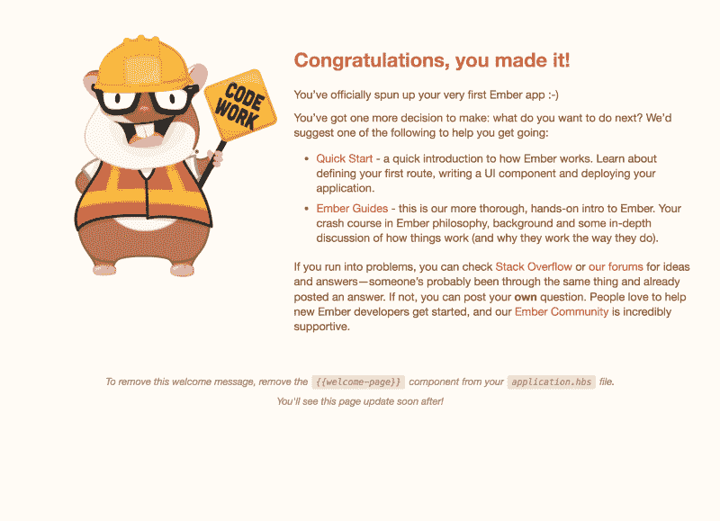

# Ember 快速提示:如何分解和分别导入 SASS/CSS 文件

> 原文：<https://www.freecodecamp.org/news/ember-quicktips-how-to-breakup-and-import-sass-css-files-separately-b0759459027d/>

有时候最好是**将样式表分解成多个文件，然后分别导入到项目中**。这是我最近开始的一个附带项目，我想你们可能会从我提出的解决方案中受益。这是一个快速简单的方法，让我们开始吧？

当您开始一个新的 EmberJS 应用程序时，您会注意到`index.html`文件将主样式表导入到应用程序中，如下所示:

```
<head>
 ...
 <link
  integrity=""
  rel="stylesheet"
  href="{{rootURL}}assets/test-app.css"
 >
 ...
</head>
```

`test-app.css`是直接从你的项目编译的。当我们在`app/styles/app.css`中编写自定义样式时，它们会被放入这个文件中。

现在，如果我们不想将所有的样式作为一个样式表导入到应用程序中，该怎么办呢？如何将我们的风格分开，并将多个样式表导入到应用程序中？类似这样的事情:

```
<head>
 ...
 <link
  integrity=""
  rel="stylesheet"
  href="{{rootURL}}assets/test-app.css"
 >
 <link
  integrity=""
  rel="stylesheet"
  href="{{rootURL}}assets/second-stylesheet.css"
 >
...
</head>
```

可能比你想象的容易？

### 第一步:用 SCSS/SASS 编写样式并编译成 CSS

首先，安装一个 SASS 预处理器，将 SCSS/SASS 样式表编译成 CSS 样式表。对于这个例子，我将使用`ember-cli-sass`:

```
ember install ember-cli-sass
```

现在把`app/styles/app.css`改名为`app/styles/app.scss`。预处理程序会自动处理和编译您的样式表。

如果您运行该应用程序，Ember 欢迎页面应该像往常一样显示:



Nothing has changed. That’s good.

在继续之前，注释掉`app/templates/application.hbs`中的`{{welcome-page}}`。我们现在有一个空白的 DOM 来处理。

### 第二步:创建新的样式表

让我们创建一个名为`app/styles/second-stylesheet.scss`的新样式表，并添加以下样式:

```
body {
 width: 100vw;
 height: 100vh;
 background-color: red;
}
```

耀眼的红色背景会非常明显，但是当你运行服务器时，你看到的只是一片白色的海洋。这是为什么呢？

如果您的直觉是将它导入到上面指定的项目中，那么您将是正确的:

```
<head>
 ...
 <link
  integrity=""
  rel="stylesheet"
  href="{{rootURL}}assets/second-stylesheet.css"
 >
...
</head>
```

然而，它仍然没有出现。为什么？？这是因为构建管道尚未配置为在正确的文件夹中构建该文件。

### 第三步:配置 Ember-CLI-Build

最后一步是告诉 Ember 应用程序，您有一个`css`文件要包含在它的构建管道中。

在`ember-cli-build.js`中添加以下内容:

```
...
module.exports = function(defaults) {
  let app = new EmberApp(defaults, {
    // Add options here
    outputPaths: {
      app: {
        css: {
          'second-stylesheet': '/assets/second-stylesheet.css'
        }
      }
    }

  });
  ...
};
```

**就是这样！**？这告诉 Ember 在哪里输出新的样式表，以便可以在 i `ndex.html` 中正确地访问它？


A Sea of Red. Remember to restart the server when you make configuration changes or you may not see the changes.