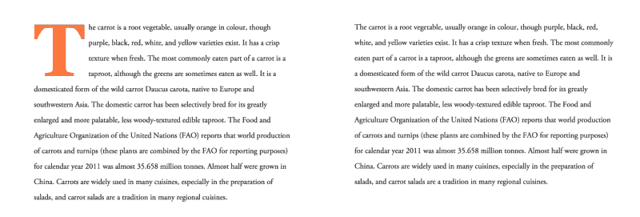
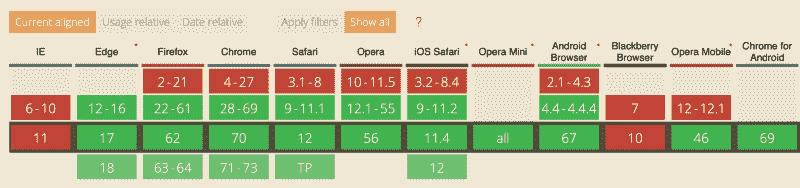
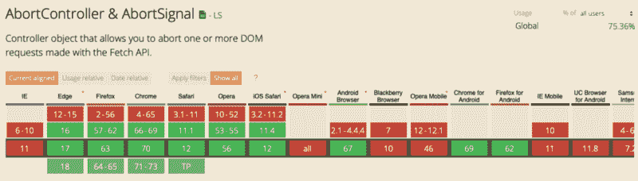

# 为什么您应该关心支持旧的浏览器

> 原文：<https://www.freecodecamp.org/news/why-you-should-care-about-supporting-older-browsers-39bbc28fb7fd/>

作者 Zell Liew

# 为什么您应该关心支持旧的浏览器


[Browsers internet web design](https://pixabay.com/en/browsers-internet-web-design-1273344/) by isromar on pixabay.

### **支持旧浏览器**

如今，您不必太担心对旧浏览器的支持。自从 Internet Explorer 8 去世后，它们一直很不错。

但问题依然存在:你应该如何着手支持 Internet Explorer 9 和其他浏览器？首先，你应该考虑支持 Internet Explorer 9 吗？

我们将会看到一些你需要考虑的事情。

#### 考虑功能，而不是浏览器

假设这个世界只包含两个特性和两个浏览器。

1.  浏览器 A 支持功能 A，不支持功能 b。
2.  浏览器 B 支持功能 B，但不支持功能 a。

可以检测出哪些浏览器支持哪些功能，并据此采取行动。

```
// This is JavaScript
```

```
if (Browser A) {  // Code for A}
```

```
if (Browser B) {  // code for B}
```

但是如果浏览器多了呢？如果世界包含浏览器 C、D、E 会怎样？如果你在考虑浏览器，就很难支持你需要的特性。

有一种更好的方法:您可以检查一个特性是否存在。如果存在，就使用它。如果没有，请提供回退代码。

下面的代码块从浏览器 A 运行到浏览器 z。

```
// This is JavaScript
```

```
if (feature A) {  // Code if browser contains feature A} else {  // Code if browser doesn't contain feature A}
```

现在你不用担心浏览器了。

#### 决定是否使用某个功能

许多人根据支持某个特性的浏览器数量来决定是否使用该特性。但是，正如我上面所说的，浏览器并不重要。

重要的是:你能容易地为特性编写回退代码吗？如果您可以轻松地编写回退代码，请继续使用该功能。如果您无法轻松编写回退代码，请不要使用该功能。

#### 决定支持哪些浏览器

你仍然需要一个截止日期。

你打算支持什么浏览器？

你不打算支持哪些浏览器？如果你不想支持浏览器，那么你为它编写回退代码是没有意义的。

我最好的回答是:观察谁在使用你的网站。他们用什么浏览器？照着做。

是的，在 Internet Explorer 6 上可能会有离群者试图访问您的网站。但是你有时间和精力为一个几乎没人用的浏览器写额外的代码吗？

你的精力用在别的地方会更好吗？

#### 支持的程度

我认为有四个层次的支持:

1.  在所有浏览器中，一切都必须看起来和工作起来一样
2.  网站必须看起来一样，但是不同浏览器的功能可以不同
3.  功能必须相同，但是不同浏览器的外观可以不同
4.  不同浏览器的外观和功能可能会有所不同

你对旧的浏览器提供什么样的支持？为什么？

#### 包扎

想一想:

1.  你为什么要支持你正在努力支持的旧浏览器？
2.  你给予什么程度的支持？
3.  你分配的资源值得吗？

### 支持旧浏览器— CSS

有两种方法可以为 CSS 功能提供后备:

1.  房地产回落
2.  功能查询

#### 房地产回落

如果浏览器无法识别某个属性或其对应的值，浏览器将完全忽略该属性。

发生这种情况时，浏览器会使用或退回到它找到的前一个值。

这是提供后备的最简单的方法。

这里有一个例子:

```
.layout {  display: block;   display: grid; }
```

在这个例子中，支持 CSS Grid 的浏览器将使用`display: grid`。不支持 CSS 网格的浏览器会退到`display: block`。

#### 忽略默认值

如果您使用的元素默认为`display: block`，您可以省略`display: block`声明。这意味着您可以用一行代码支持 CSS Grid:

```
.layout {  display: grid; }
```

支持 CSS Grid 的浏览器将能够像`grid-template-columns`一样读取其他 CSS 属性。不支持 CSS 网格的浏览器不行。

这意味着您可以编写额外的 CSS 网格属性，而不必担心回退值。

```
.layout {  display: grid;   grid-template-columns: 1fr 1fr 1fr 1fr;  grid-gap: 1em; }
```

特性查询，或`@supports`，告诉你一个 CSS 属性或其对应的值是否被浏览器支持。

**你可以把 CSS 特性查询想象成 JavaScript 中的`if/else`语句。**他们长这样:

```
@supports (property: value) {  /* Code when property or value is supported*/}
```

```
@supports not (property: value) {  /* Code when property or value is not supported */}
```

如果你希望浏览器只阅读 CSS **和支持特定属性的**，那么`@supports`是很有帮助的。

对于上面的 CSS 网格示例，您可以这样做:

```
@supports (display: grid) {  .layout {    display: grid;     grid-template-columns: 1fr 1fr 1fr 1fr;    grid-gap: 1em;     padding-left: 1em;    padding-right: 1em;  }}
```

在这个例子中，`padding-left`和`padding-right`只能被同时支持`@supports` **和** CSS 网格的浏览器读取。

珍·西蒙斯在工作中有一个更好的例子。她使用特征查询来检测浏览器是否支持类似于`-webkit-initial-letter`的属性。

```
@supports (initial-letter: 4) or (-webkit-initial-letter: 4) {  p::first-letter {     -webkit-initial-letter: 4;     initial-letter: 4;     color: #FE742F;     font-weight: bold;     margin-right: 0.5em;  }}
```



Jen 的例子给我们带来了一个问题:不同浏览器的网站应该看起来一样吗？我们稍后再看这个。但是首先，更多关于特征查询。

#### 支持功能查询

特色查询获得了[巨大的支持](https://caniuse.com/#search=feature%20queries)。目前所有主流浏览器都支持特征查询。



#### 如果支持某个功能，但不支持功能查询，该怎么办？

这曾经是棘手的部分。珍·西蒙斯和其他专家已经警告过我们这种可能性。你可以在这篇文章中阅读如何处理[。](https://hacks.mozilla.org/2016/08/using-feature-queries-in-css/)

以下是我的看法:我不再支持 IE 11 了，所以我按照上面提到的方式使用特性查询。

#### 同时使用属性回调和功能查询

看看下面的代码。浏览器将应用什么填充值？

```
@supports (display: grid) {  .layout {    display: grid;     grid-template-columns: 1fr 1fr 1fr 1fr;    grid-gap: 1em;     padding-left: 1em;    padding-right: 1em;  }}
```

```
.layout {    padding-left: 2em;   padding-right: 2em; }
```

答案是:所有浏览器都会应用左右填充的`2em`。

为什么？

这是因为`padding-left: 2em`和`padding-right: 2em`后来在 CSS 文件中声明。后来声明的属性会覆盖先前声明的属性。

如果你想将`padding-left: 2em`和`padding-right: 2em`到**只应用**到**不支持**CSS 网格的浏览器，可以互换属性顺序。

```
.layout {    padding-left: 2em;   padding-right: 2em; }
```

```
@supports (display: grid) {  .layout {    display: grid;     grid-template-columns: 1fr 1fr 1fr 1fr;    grid-gap: 1em;     padding-left: 1em;    padding-right: 1em;  }}
```

**注意**:由于它的级联性质，在 CSS 中首先声明回退代码总是一个好的做法。

这也意味着，如果你同时使用了`@supports` **和** `@supports not`，你应该先声明`@supports not`。它使你的代码一致。

```
/* Always write "@supports not" first if you use it */@supports not (display: grid) {  .layout {      padding-left: 2em;     padding-right: 2em;   }}
```

```
@supports (display: grid) {  .layout {    display: grid;     grid-template-columns: 1fr 1fr 1fr 1fr;    grid-gap: 1em;     padding-left: 1em;    padding-right: 1em;  }}
```

现在让我们来讨论一下网站是否应该在不同的浏览器上看起来一样。

#### 不同浏览器的网站应该看起来一样吗？

一些人认为网站应该在不同的浏览器上看起来一样。他们认为品牌是重要的，并强调网站应该保持一致，以维护品牌。

其他人说不。他们认为他们应该接受逐步提高的精神。他们能给用户更好的浏览器更多的爱。

两种观点都是对的，只是角度不同。

**最重要的观点来自用户。**你的网站能够为用户提供他们想要的东西吗？

如果有，就不必对一致性要求太严格。继续前进，给拥有更好浏览器的用户带来更好的体验！

#### 包扎

要提供对 CSS 功能的支持，您可以使用:

1.  房地产回落
2.  功能查询

当你写 CSS 的时候，确保你先声明回退代码，然后再声明对浏览器有更好支持的另一组代码。

### 支持旧浏览器— JavaScript

为旧浏览器提供 JavaScript 支持很容易。大多数情况下，你只需要使用聚脂填料。

但是你可以做更多的事情。

#### 什么是 polyfill？

polyfill 是一段告诉浏览器如何实现 JavaScript 特性的代码。一旦您添加了聚合填充，您就不再需要担心支持问题。会有用的。

聚合填充的工作原理如下:

1.  它检查该功能是否受支持
2.  如果没有，它会添加代码来支持该特性

这是一个多填充物工作的例子。它检查浏览器是否支持`Array.prototype.find`。如果浏览器不支持`Array.prototype.find`，它会告诉浏览器如何支持。

你可以在 [MDN](https://developer.mozilla.org/en-US/docs/Web/JavaScript/Reference/Global_Objects/Array/find) 上找到这个代码。

```
if (!Array.prototype.find) {  Object.defineProperty(Array.prototype, 'find', {    value: function(predicate) {     // 1\. Let O be ? ToObject(this value).      if (this == null) {        throw new TypeError('"this" is null or not defined');      }
```

```
var o = Object(this);
```

```
// 2\. Let len be ? ToLength(? Get(O, "length")).      var len = o.length >>> 0;
```

```
// 3\. If IsCallable(predicate) is false, throw a TypeError exception.      if (typeof predicate !== 'function') {        throw new TypeError('predicate must be a function');      }
```

```
// 4\. If thisArg was supplied, let T be thisArg; else let T be undefined.      var thisArg = arguments[1];
```

```
// 5\. Let k be 0\.      var k = 0;
```

```
// 6\. Repeat, while k < len      while (k < len) {        // a. Let Pk be ! ToString(k).        // b. Let kValue be ? Get(O, Pk).        // c. Let testResult be ToBoolean(? Call(predicate, T, « kValue, k, O »)).        // d. If testResult is true, return kValue.        var kValue = o[k];        if (predicate.call(thisArg, kValue, k, o)) {          return kValue;        }        // e. Increase k by 1\.        k++;      }
```

```
// 7\. Return undefined.      return undefined;    },    configurable: true,    writable: true  });}
```

**注意**:聚合填充是垫片的一个子集。shim 是一个为旧环境带来新 API 的库。

#### 使用聚合填充

使用聚合填充有两种方式:

1.  手动聚合填充，如上例所示
2.  通过库一次添加多个聚合填充

#### 手动聚合填充

首先，你需要**搜索你需要的多填充物**。如果你在谷歌上搜索一下，你应该能找到一个。聪明的开发人员已经为你需要的几乎所有东西创建了 polyfills。

一旦你找到了 polyfill，**使用上面的过程**来创建对老版本浏览器的支持。

#### 一次添加多个聚合填充

一些库包含许多聚合填充。 [ES6-shim](https://github.com/paulmillr/es6-shim) 就是这样一个库的例子。它在旧的浏览器上提供对所有 ES6 特性的支持。

#### 使用尖端的 JavaScript 特性

如果你想使用最前沿的 JavaScript 特性，考虑在你的构建过程中加入 [Babel](https://babeljs.io) 。

Babel 是一个编译 JavaScript 的工具。在此编译过程中，它可以:

1.  添加所需的任何垫片/聚合填充物
2.  将预处理程序编译成 JavaScript

更多关于第二点:

Babel 在你的构建过程中离线工作。它可以读取您传递给它的文件，然后将这些文件转换成浏览器可以读取的 JavaScript。

这意味着你可以使用像 Flow、TypeScript 和其他你听说过的很酷的技术这样的前沿特性。它们都可以在浏览器中工作，只要你先通过巴别塔！

#### 如果 polyfills 不够呢？

如果聚合填充不足以支持该功能，您可能需要重新考虑为有问题的浏览器提供的支持量。

你需要在不同的浏览器上提供相同的功能吗？也许你应该考虑渐进增强。

也许你可以用一种不使用特性的方式编码？

有很多可能，但你明白其中的意思。

#### 如何辨别一个浏览器是否支持该功能？

首先，我检查 caniuse.com 的。写下您想要的 JavaScript 特性的名称，您将能够看到浏览器支持级别。

这里有一个关于[中止控制器](https://caniuse.com/#search=Abort)的例子



如果[caniuse.com](https://caniuse.com/)没有给我任何信息，我会检查 MDN。你会在大多数文章的底部找到浏览器支持。

下面是再次使用[中止控制器](https://developer.mozilla.org/en-US/docs/Web/API/AbortController)的例子:


#### 当心 JavaScript 的成本

使用聚合填充时，会添加更多的 JavaScript 代码。

添加更多 JavaScript 的问题是，嗯，有更多的 JavaScript。JavaScript 越多，问题就越多:

1.  旧浏览器通常存在于旧电脑中。他们可能没有足够的处理能力。
2.  JavaScript 包会延迟站点加载。在 Addy Osmani 的“[JavaScript 的成本](https://medium.com/@addyosmani/the-cost-of-javascript-in-2018-7d8950fbb5d4)”中有更多关于这方面的内容

#### 包扎

很容易添加对 JavaScript 特性的支持。大多数时候，你添加一个 polyfill，然后就收工了。但是当你这样做的时候，要注意 JavaScript 的代价！

有时，完全放弃这个特性可能是好的。

### 为什么支持老版本的浏览器？

为什么你必须关心旧的浏览器？

谁在用旧浏览器？大概，有旧电脑的用户？

如果他们使用旧电脑，也许他们没有钱买一台新的。

如果他们没钱买新电脑，他们可能也不会从你这里买东西。

如果他们不会从你这里购买任何东西，你为什么要关心支持他们的浏览器呢？

对于一个商人来说，这是一个完全合理的思路。但是为什么我们开发者还坚持支持老版本的浏览器呢？

**我们来分解一下**

在最初的思维过程上有这么多层假设。

> “谁在用旧浏览器？大概，有旧电脑的用户？如果他们使用旧电脑，也许他们没有钱买新的”。

虽然人们使用旧浏览器是因为他们使用旧电脑，但我们不能假设人们买不起新电脑。

*   可能他们公司不想给他们买。
*   可能他们对自己的电脑很满意，不想升级。
*   也许他们没有升级电脑的知识。
*   也许他们没有新电脑。
*   也许他们被绑定在没有好浏览器的手机上。

**不要假设。**

> 如果他们没钱买新电脑，他们可能也不会从你这里买东西。如果他们不会从你这里购买任何东西，你为什么要关心支持他们的浏览器呢？

我们不得不缩小到其他领域来谈论这一点。

#### 轮椅无障碍

如果你去过新加坡，你会注意到几乎每个楼梯旁边都有一个坡道或电梯。

但是为什么呢？为什么政府和私人公司要花钱在电梯和坡道上？当楼梯足以将人们从较低的高度带到较高的高度时，为什么还要建造它们呢？

原来有些人不能使用楼梯。他们不能用脚走路。他们不得不坐在轮椅上，他们不能自己推着上楼梯。电梯和坡道为这些人服务。

事实证明，更多的人受益于电梯和坡道。

1.  膝盖较弱的人。
2.  有自行车或踏板车的人。
3.  推着婴儿车的父母。

如果你发现自己推着有轮子的东西，你会不假思索地使用坡道或电梯。你也会受益。

但问题是:没有人从操作坡道或电梯中获得一分钱？那么为什么要建造它们呢？

因为值得。

价值并不总是意味着金钱。

#### 想想全球变暖

你生活在地球上。你对全球变暖有什么看法？

有些人不在乎。如果森林被烧毁也没关系。如果公司污染河流，向空气中排放成吨的二氧化碳，这没关系。这对他们没有影响。

但是有一群人在乎。他们热爱我们生活的星球。他们想给他们的孩子一个更好的生活环境。他们关心的原因有很多。他们可能想尽可能地节约资源。

你站在哪一边？

你会把钱给一个一边运营一边破坏地球的公司吗？

也许你会。也许你不会。也许你不在乎。这三个选项都有效。

再一次，你看，这并不总是为了钱。

#### 网络是为每个人服务的

> 网络背后的梦想是一个共同的信息空间，在这个空间里我们通过分享信息来交流。

> —蒂姆·伯纳斯·李

我们前端开发者是网络的守护者。网络如何发展取决于我们。我们不能强迫每个人都建坡道和电梯，但我们可以确保自己建。

选择权在你，真的。

如果你不想，你不必在意。

我认识的最优秀的前端开发人员？他们在乎。他们选择包容。这是我们成为前端开发者的原因。

我们在乎。

但有时我们也有约束和限制。我们在这些限制下工作。

本文最初发布于[我的博客。](https://zellwk.com/blog/)
如果你想要更多的文章来帮助你成为一个更好的前端开发者，请注册我的[简讯](https://zellwk.com/)。