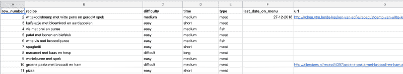
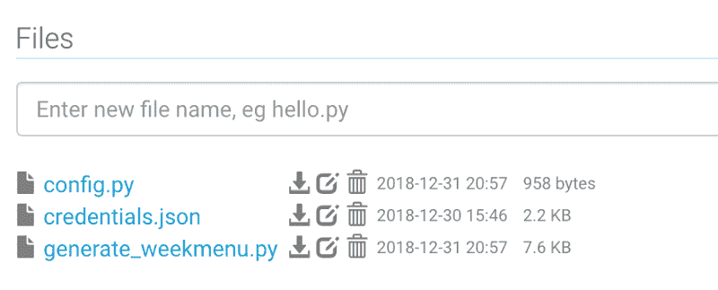
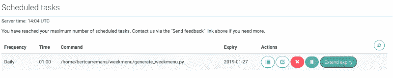
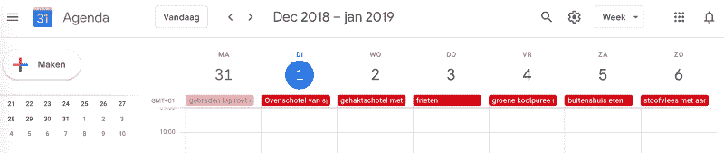

# 如何通过建立一个自动膳食计划来节省时间和金钱

> 原文：<https://www.freecodecamp.org/news/how-to-save-time-and-money-by-building-an-automatic-meal-planner-7c7a9351d124/>

#### 使用 Google Calendar 和 Google Sheets APIs 在正确的日子选择正确的食谱。

当你被问到“今晚吃什么？”时，你也会感到紧张吗？你并不孤单。当下午 4 点的钟声敲响时，我想这是被问得最多的问题。决定吃什么可能是一件乏味的家务。尤其是当你的孩子有各种课外活动的时候。

为了避免每天去超市，我们通常会写一份菜单，上面有下周的食谱。这样我们可以在一次超市购物中买到所有的食品杂货。这为我们节省了很多时间。除此之外，它还为我们省钱。这是因为我们较少接触超市使用的所有销售技巧。

找到整整一周的食谱需要一些思考和计划。我们必须考虑到所有家庭成员的饮食偏好。除此之外，我们每天做饭的时间有限。为了使这变得更容易，我建立了一个自动膳食计划器，它具有以下特性:

*   从我们共享的谷歌日历中提取我和我妻子的工作计划
*   从谷歌电子表格中提取我们喜欢的食谱，
*   每周同一天重复一些食谱
*   在重复其他食谱之前，间隔一周
*   我比我妻子更喜欢烹饪。所以在我不能做饭的日子里，食谱应该是短时间的
*   上传谷歌日历中的周菜单

让我们直接开始吧。

### 使用 Google 日历 API 和 Google 工作表 API

首先，我们需要[创建一个新的谷歌云项目](https://cloud.google.com/resource-manager/docs/creating-managing-projects)。在我们可以在这个项目中使用谷歌日历和工作表之前，我们需要启用 API。这在下面的网页上有很好的解释:

*   [启用谷歌日历 API](https://developers.google.com/calendar/quickstart/python)
*   [启用 Google Sheets API](https://developers.google.com/sheets/api/quickstart/python)

完成后，我们继续导入必要的 Python 包。

```
import config as cfg
import pandas as pd
import numpy as np
from pathlib import Path
from datetime import datetime
from datetime import timedelta
from googleapiclient.discovery import build
from google.oauth2 import service_account
```

### 配置

出于隐私和安全原因，我将一些参数保存在一个单独的 config.py 文件中。我们导入别名为`cfg`的文件。我将在下面用虚拟值进一步讨论这些参数。您可以在自己的应用程序中包含与您的案例相关的值。

#### 领域

通过 scopes，我们定义了 Google 日历和工作表的访问级别。我们需要对[日历](https://developers.google.com/calendar/auth)和[表单](https://developers.google.com/sheets/api/guides/authorizing)的读写权限。因此，我们使用下面的网址。

```
SCOPES = ['https://www.googleapis.com/auth/calendar'
          , 'https://www.googleapis.com/auth/spreadsheets']
```

#### Google 工作表 ID 和范围

```
SPREADSHEET_ID = <Your Google sheet ID>
RANGE = 'recepten!A:G'
```

我们需要指定带有食谱的 Google 工作表的 ID。此外，我们指定包含配方的工作表范围。

您可以在 Google Drive 中右键单击您的 Google sheets 的 ID。然后选择“获取可共享链接”。可以在“https://drive . Google . com/open？ID =”后面找到 ID。

在我的谷歌表单“recepten”中，A 到 G 列包含了每种食谱的信息。下面的截图显示了一些示例内容。所以`RANGE`需要设置为“recepten！答:G" *。*



#### Google 日历 id

```
CALENDARID_1 = <Your Google Calendar ID>
CALENDARID_2 = <Your partner's Google Calendar ID>
CALENDARID_WEEKMENU = <Google Calendar ID for the week menu>
```

我们需要指定从中获取事件的 Google 日历 id。确定您可以访问您想要包括的所有日历。您可以通过从 APIs Explorer 中执行这个[脚本来找到 ID。](https://developers.google.com/apis-explorer/#p/calendar/v3/calendar.calendarList.list)

对于这个项目，我们将只提取两个日历的事件。但是您可以修改代码来循环更多的日历。我还创建了一个单独的日历来上传食谱。

#### 事件标签

```
BUSY_EVENTS = [<Labels of busy calendar events>]
FREE_EVENTS = [<Labels of free calendar events>]
ALL_EVENTS = BUSY_EVENTS + FREE_EVENTS
```

我的妻子轮班工作，并通过使用字母代码将其添加到她的谷歌日历中。比如:“B”代表下午班。这个事件是`BUSY_EVENTS`之一。

当我有一天休息时，我会在日历上加上“假日”。这个事件是`FREE_EVENTS.`之一

所有活动都是谷歌日历中的全天活动。您可以使用自己的事件标签方案。

#### 传统

```
TRADITIONS = {   'Thursday' : 'fries'}
```

我的意思是我们家一周中有几天会准备某种食谱。因为我们来自比利时，这意味着每周吃一次薯条(对我们来说是周四)。是的，在你问之前，那是蛋黄酱薯条。

您可以在字典中指定您自己的传统，将当天的名称作为键，将食谱作为值。

#### 提前计划的天数

有时我们不能在新的一周菜单创建的那天去超市。我们可能需要几天时间来提前计划。我们给自己一些放松。这意味着新的一周菜单将在前一周菜单完成之前的一定天数内生成。

```
NB_DAYS_BEFORE = 3
```

### 使用服务帐户

我们将使用一个[服务帐户](https://developers.google.com/api-client-library/python/auth/service-accounts)来使用项目中的 API。credentials.json 文件是在启用 API 时可以下载的文件。

我们用下面的代码创建凭证`creds`。这些凭证支持 Google 日历和 Google 表单中的身份验证。

```
creds = service_account.Credentials.from_service_account_file("credentials.json", scopes=cfg.SCOPES)
```

### 获取 Google 日历事件

我们从用`build`方法创建服务对象开始。

```
service_cal = build('calendar', 'v3', credentials=creds)
```

我们只对下周的事件感兴趣。为了过滤这些事件，我们指定日期并用`isoformat()`格式化它们。参数`timeMin`和`timeMax`需要这种格式。

```
def format_date(date):
    date_time = datetime.combine(date, datetime.min.time())
    date_time_utc = date_time.isoformat() + 'Z'
    return date_time_utc
```

用方法[事件()。服务对象的列表](https://developers.google.com/calendar/v3/reference/events/list)，我们提取事件。然后对提取的事件进行过滤，找出忙和闲事件。谷歌日历上的所有其他事件都与这个项目无关。我们保留事件的开始和结束日期以及摘要。

```
def get_event_date(event, timepoint):
    return event[timepoint].get('dateTime', event[timepoint].get('date'))

def get_events_by_calendarId(service, calendarId, timeMin, timeMax, allEvents):
    events_result = service.events().list(calendarId=calendarId
                                        , timeMin=timeMin
                                        , timeMax=timeMax
                                        , singleEvents=True
                                        , orderBy='startTime').execute()
    events = events_result.get('items', [])    
    events_list = [(get_event_date(e, 'start'), get_event_date(e, 'end'), e['summary'].upper()) 
                   for e in events 
                   if e['summary'].upper() in allEvents]
    return unfold_events_list(events_list)
```

有些事件持续了不止一天。比如你休假超过一天的时候。我们在未来一周的范围内在日常事件中展开这些多日事件。

```
def unfold_events_list(events_list):
    new_events_list = []
    for e in events_list:
        start = datetime.strptime(e[0], '%Y-%m-%d').date()
        end = datetime.strptime(e[1], '%Y-%m-%d').date()
        delta_days = (end - start).days

        if delta_days > 1:
            for d in range(delta_days):
                unfolded_day = start + timedelta(days=d)
                if unfolded_day >= datetime.now().date() and unfolded_day <= datetime.now().date() + timedelta(days=6):
                    new_events_list.append((unfolded_day, e[2]))
        else:
            new_events_list.append((start, e[2]))
    return new_events_list
```

最后，我们想要一个熊猫数据框架，包含下周两个日历的事件。为了得到这个结果，我们将事件列表转换为数据框，并在日期上进行合并。我们还将工作日添加到合并的数据框中。

```
def create_events_df(events_list_1, events_list_2):
    events_df_1 = pd.DataFrame.from_records(events_list_1, columns=['date', 'events_cal_1'])
    events_df_2 = pd.DataFrame.from_records(events_list_2, columns=['date', 'events_cal_2'])
    events_df = events_df_1.merge(events_df_2, on='date', how='outer')
    events_df.date = pd.to_datetime(events_df.date)
    events_df.set_index('date', inplace=True)
    events_df.sort_index(inplace=True)

    dates = list(pd.period_range(START_DAY, NEXT_WEEK, freq='D').values)
    new_idx = []
    for d in dates:
        new_idx.append(np.datetime64(d))

    events_df = events_df.reindex(new_idx)
    events_df.reset_index(inplace=True)
    events_df['weekday'] = events_df.date.apply(lambda x: x.strftime('%A'))
    events_df.set_index('date', inplace=True)
    return events_df
```

为了确保我们涵盖了下周的所有日期，我们使用了一个`period_range`和`reindex`合并的数据框。

### 从谷歌工作表中获取食谱

此时，我们有了一个数据框架，其中包含了下周的所有日子以及两个日历中发生的事件(如果有的话)。现在，我们可以开始从 Google 工作表中提取食谱，并为每一天分配一个食谱。与 Google Calendar API 一样，让我们从创建 Google Sheets API 的服务对象开始。

```
service_sheet = build('sheets', 'v4', credentials=creds)
```

用[方法制作电子表格()。价值观()。我们可以从谷歌表单中提取食谱。](https://developers.google.com/sheets/api/reference/rest/v4/spreadsheets.values/get)

```
def get_recipes(service, spreadsheetId, range):
    recipes_result = service.spreadsheets().values().get(spreadsheetId=spreadsheetId, range=range).execute()
    recipes = recipes_result.get('values', [])
    recipes_df = pd.DataFrame.from_records(recipes[1:], columns=recipes[0])
    recipes_df.last_date_on_menu = pd.to_datetime(recipes_df.last_date_on_menu, dayfirst=True)
    recipes_df.set_index('row_number', inplace=True)
    eligible_recipes = recipes_df[ (recipes_df.last_date_on_menu < PREV_WEEK) | (np.isnat(recipes_df.last_date_on_menu)) ]
    return recipes_df, eligible_recipes
```

接下来，我们创建一个包含食谱的数据框。我喜欢使用熊猫数据框架，但是你当然也可以使用其他数据结构。

`row_number`是 Google 工作表本身计算的字段。为此，我们使用了 Google Sheet 函数`ROW()`。这将有助于在正确的行中更新字段`last_date_on_menu`。我们将在下周选择食谱时更新日期。

我们需要确保一个食谱只在一周后重复。所以我们用`last_date_on_menu`过滤`recipes_df`。此日期必须为空或在上周之前。

### 生成周菜单

在这一步中，我们将为下周的每一天分配一个合格的食谱。

```
def generate_weekmenu(service, events_df, traditions, free_events):
    weekmenu_df = events_df.copy()

    for i, r in events_df.iterrows():
        if r.weekday in traditions.keys():
            weekmenu_df.loc[i, 'recipe'] = traditions[r.weekday]
            weekmenu_df.loc[i, 'description'] = ''
        else:
            if r.weekday in ['Saturday', 'Sunday']:
                row_number = choose_recipe('difficult', i, weekmenu_df, eligible_recipes)
                update_sheet(service, row_number, i.strftime('%d-%m-%Y'), cfg.SPREADSHEET_ID)
            elif r.events_cal_1 in free_events or r.events_cal_2 in free_events \
            or pd.isnull(r.events_cal_1) or pd.isnull(r.events_cal_2):
                row_number = choose_recipe('medium', i, weekmenu_df, eligible_recipes)
                update_sheet(service, row_number, i.strftime('%d-%m-%Y'), cfg.SPREADSHEET_ID)
            else:
                row_number = choose_recipe('easy', i, weekmenu_df, eligible_recipes)
                update_sheet(service, row_number, i.strftime('%d-%m-%Y'), cfg.SPREADSHEET_ID)
    return weekmenu_df
```

考虑到工作计划(忙和闲事件)，我们将使用每个配方的`difficulty`。首选难度的随机食谱将被添加到`weekmenu_df.`中，最后我们将其从合格食谱中删除，以避免在同一周出现重复的食谱。

```
def choose_recipe(difficulty, idx, weekmenu_df, eligible_recipes):
    choice_idx = np.random.choice(eligible_recipes.query("difficulty == '" + difficulty + "'" ).index.values)
    weekmenu_df.loc[idx, 'recipe'] = eligible_recipes.loc[choice_idx, 'recipe']
    weekmenu_df.loc[idx, 'description'] = eligible_recipes.loc[choice_idx, 'description']
    eligible_recipes.drop(choice_idx, inplace=True)
    return choice_idx
```

[电子表格的方法()。价值观()。更新](https://developers.google.com/sheets/api/reference/rest/v4/spreadsheets.values/update)更新谷歌表单。

```
def update_sheet(service, row_number, date, spreadsheetId):
    range = "recepten!F"  + str(row_number)
    values = [[date]]
    body = {'values' : values}
    result = service.spreadsheets().values().update(spreadsheetId=spreadsheetId
                                                    , range=range
                                                    , valueInputOption='USER_ENTERED'
                                                    , body=body).execute()
```

我们迭代`weekmenu_df`的每一行。如果工作日是传统工作日之一，我们分配相应的食谱。对于其他工作日，我们应用以下逻辑:

*   在周末，选择一个困难的食谱
*   在一周中，当我在家或我的妻子休息时，选择中等难度的食谱
*   在一周中，当我或我的妻子在工作时，选择一个简单的食谱

### 将周菜单添加到 Google 日历

既然我们有了下周的菜单，我们可以将它作为事件添加到 Google 日历中。我为它创建了一个单独的日历。与 credentials.json 中的`client_email`共享此日历。在您日历的设置中，您还需要授予它更改活动的权限。

```
def add_weekmenu_to_calendar(service, weekmenu_df, calendarId):
    for i, r in weekmenu_df.iterrows():
        event = {
        'summary': r.recipe,
        'description': r.description,
        'start': {
            'date': i.date().isoformat(),
            'timeZone': 'Europe/Brussels'
        },
        'end': {
            'date': i.date().isoformat(),
            'timeZone': 'Europe/Brussels'
        }
        }
        event = service.events().insert(calendarId=calendarId, body=event).execute()
```

### 让我们自动化

到目前为止，我们已经考虑了应用程序的所有要求的功能。但是您仍然需要手工运行代码来生成周菜单。

我发现了一个很棒的网站 [PythonAnyWhere](https://www.pythonanywhere.com/) ，你可以在那里安排 Python 程序。免费的初学者帐户允许每天安排一个 Python 程序。这正是我们所需要的。

首先，我们需要将所有的函数缝合在一起，并将它们放在一个 Python 文件中。在这个文件中，我做了额外的检查，看看我们在当前周菜单中的位置。我用`get_date_last_event.`查看谷歌日历中食谱的最后日期

```
def get_date_last_event(service, calendarId):
    events_result = service.events().list(calendarId=calendarId
                                        , singleEvents=True
                                        , orderBy='startTime').execute()
    date_last_event = events_result.get('items', [])[-1]['start']['date'][:10]
    date_last_event = datetime.strptime(date_last_event, '%Y-%m-%d').date()
    return date_last_event
```

该日期存储在`DATE_LAST_RECIPE.`中，如果当前日期在`DATE_LAST_RECIPE`减去`NB_DAYS_BEFORE`之后，我们可以生成一个新的周菜单。

你可以在 Github 上找到完整的脚本。

```
if __name__ == '__main__':
    # Getting credentials from credentials.json
    CREDS_PATH = Path.cwd() / "weekmenu" / "credentials.json"
    creds = service_account.Credentials.from_service_account_file(CREDS_PATH, scopes=cfg.SCOPES)

    # Creating service objects
    service_cal = build('calendar', 'v3', credentials=creds)
    service_sheet = build('sheets', 'v4', credentials=creds)

    # Defining dates
    DATE_LAST_RECIPE = get_date_last_event(service_cal, cfg.CALENDARID_WEEKMENU) 
    START_DAY = DATE_LAST_RECIPE + timedelta(days=1)
    NEXT_WEEK = START_DAY + timedelta(days=6)
    PREV_WEEK = START_DAY + timedelta(days=-7)
    START_DAY = format_date(START_DAY)
    NEXT_WEEK = format_date(NEXT_WEEK)
    PREV_WEEK = format_date(PREV_WEEK)

    # Getting the recipes from the Google Sheet
    recipes_df, eligible_recipes = get_recipes(service_sheet, cfg.SPREADSHEET_ID, cfg.RANGE)

    # Check if the last weekmenu is still active
    if DATE_LAST_RECIPE - timedelta(days=cfg.NB_DAYS_BEFORE) < datetime.now().date():
        # Getting the events from the Google Calendars
        events_list_1 = get_events_by_calendarId(service_cal, cfg.CALENDARID_1, START_DAY, NEXT_WEEK, cfg.ALL_EVENTS)
        events_list_2 = get_events_by_calendarId(service_cal, cfg.CALENDARID_2, START_DAY, NEXT_WEEK, cfg.ALL_EVENTS)

        # Merge the two events lists
        events_df = create_events_df(events_list_1, events_list_2)

        # Generating the weekmenu
        weekmenu_df = generate_weekmenu(service_sheet, events_df, cfg.TRADITIONS, cfg.FREE_EVENTS)

        # Adding the weekmenu to a Google Calendar
        add_weekmenu_to_calendar(service_cal, weekmenu_df, cfg.CALENDARID_WEEKMENU)
        print('Week menu is added to Google Calendar')
    else:
        print('Program stopped. Last week menu is not finished yet.')
```

在 PythonAnyWhere 上，我创建了一个子文件夹 week menu。我已经上传了以下文件 config.py、generate_weekmenu.py 和 credentials.json。



Project files on PythonAnyWhere.com

然后，我安排了一个每日任务，该任务将在 Tasks 部分运行 generate_weekmenu.py 脚本。瞧，我们都准备好了。



### 结果呢

在第一次运行脚本后，我们在共享的 Google 日历中有了一个漂亮的菜单。



Automated week menu in a shared Google Calendar

### 结论

该脚本考虑到了您在 Google 日历上的职业日程。它从谷歌表单中选择你喜欢的食谱。通过安排脚本，食谱会自动出现在你的谷歌日历中。这让你从决定吃什么的烦人琐事中解脱出来。

如果你想更进一步，这里有一些微调脚本的想法:

*   考虑到食谱的烹饪时间
*   允许每周至少吃一顿素食的传统
*   为所选的食谱制作一份食品清单

我希望你喜欢读这个故事。如果你对剧本有问题或建议，你可以在下面写评论。如果你喜欢，请鼓掌。