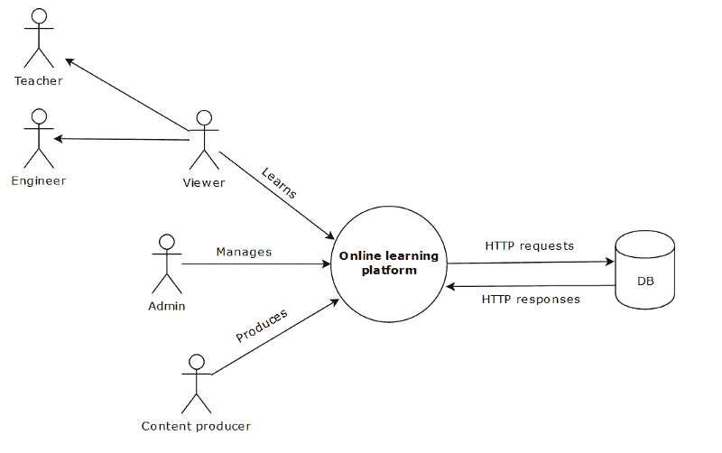
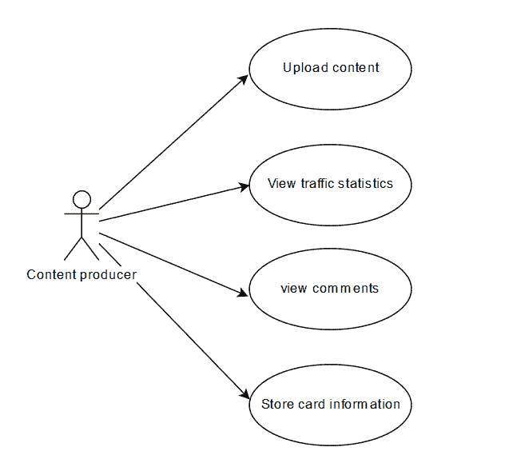
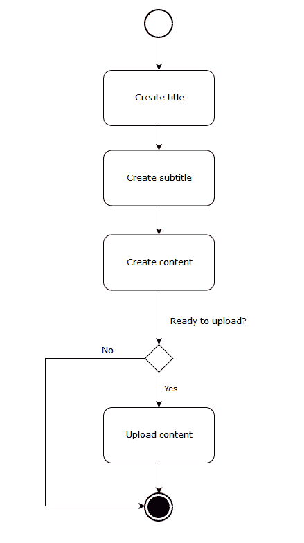
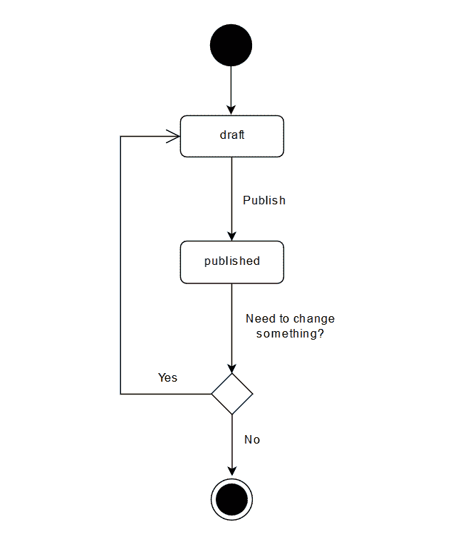

# 如何使用系统工程来构建成功的 web 应用程序

> 原文：<https://www.freecodecamp.org/news/how-to-use-systems-engineering-to-build-a-successful-web-app-6f8bda2f7fc4/>

#### 如果你明白它是如何工作的，那么构建它就更容易了

因此，你终于在 Adobe XD、Figma、Sketch 或 InVision 中完成了你的设计，但仍在纠结如何实现这些功能。别担心，我们已经考虑了一段时间，构建网络应用的唯一方法是从 UI/UX 设计和原型草图开始。

幸运的是，我们可以使用其他更好的技术来描述网络应用，而不必强调页面上的元素需要什么位置、大小或间距。

让我向您介绍一些已经被航空航天、海事、国防、汽车和电信领域的公司用来更好地理解系统如何运行和交互的东西。我不是在谈论如何改进 UI/UX 的技巧和诀窍，而是你可以从**系统工程** (SE)武器库中应用哪些技术来构建成功的网络应用。

这些技术有很多好处，但最重要的是一个人可以多快地表达想法和理解事物如何工作。

到本文结束时，您将能够使用这些 se 技术来构建更好的应用程序。

这里有四个实用且相关的 SE 技巧，你可以应用。

> 如果你想成为一名更好的 web 开发人员，开创自己的事业，教导他人，或者仅仅是提高你的开发技能，我会每周发布高质量的关于市场上最新 web 语言的提示和技巧。

### 一个实例——在线学习平台

为了使例子直观和适用，我们将建立一个虚拟的在线学习平台。一个允许人们发布内容的平台，与 Medium、YouTube、Unsplash 等概念相同。

> 注意:使用这些技术的想法是对其进行足够的描述，以便开发人员可以轻松地实现这些功能，这意味着我们不需要进入细节。

在应用程序的早期阶段，这里有一些需要注意的小技巧。

#### 1.不要从细节设计开始

在早期阶段，大多数开发人员很自然地首先从定义解决方案开始，因此被那些对最终产品并不重要的细节所困扰。它将我们引向错误的方向，我们忘记了应用程序的真正目的。

设计很重要，但不是我们在早期阶段应该关注的东西。它不是固定的(并且经常变化)，例如按钮的颜色、元素的位置、字体等等。不变的是网络应用的底层行为，比如一个人认证的方式，他们在页面上传东西的方式，处理支付的步骤等等。基本部分保持不变。

#### 2.从问题开始

首先确定问题:周围环境，谁是利益相关者，行为，以及应用程序的上下文(范围)。

我们不基于解决方案来构建应用，我们构建应用是因为有一个问题、议题或挑战需要解决。在大多数情况下，客户并不关心解决方案，只关心它是否有效。当开发人员了解应用程序的行为和交互方式时，解决方案就确定了。

例如，问题可能是当前的通信平台太慢，影响了工作流程。另一个问题可能是经理对员工的工作任务等没有清晰的了解。

请记住，问题告诉我们有需要，但没有提供任何解决方案。问题是什么触发了开发过程。所以先从问题开始，再从解决方案开始。

让我们看看可以用什么技术来描述我们的在线学习平台。

### 1.内外关系图

#### 界定界限

上下文图的目的是定义应用程序或应用程序各部分的边界，并提供对它所交互的实体的清晰理解。

如图所示，我们可以看到哪些类型的利益相关者(用户)与应用程序交互，以及他们之间的交互类型。注意，没有提到利益相关者的名字，也没有提到我们正在处理的数据库的类型。我们不想纠缠于将来可能会改变的细节。

#### 阐明复杂的应用

如果你正在处理一个由许多部分组成的相当复杂的应用程序，那么上下文图是一个很好的选择，可以让你简化事情。这也是一个很好的方法来提醒我们自己应用程序的目的是什么，并消除那些对应用程序没有什么价值的东西。这是一种后退的方式，专注于重要的事情。

### 2.用例图

High-level use case diagram

注意，我们没有提到元素的布局、大小或位置。在 SE 中，重要的是事情是模块化的，这意味着我们可以在不影响应用程序的情况下改变事情——我们不希望事情是固定不变的。

> 需要构建工作软件的开发人员应该能够阅读用例，并很好地理解软件需要做什么。[来源](http://www.gatherspace.com/static/use_case_example.html)。

#### 描述互动

用例图的目的是描述用户如何以口头方式与 web 应用程序交互。这是一个很好的工具，可以用来理解客户需要什么，以及开发人员需要实现什么特性。

#### 详述一个用例(动作)

如上所示，用户是内容制作者，执行四个动作。动作是需要实现的特性。用例图没有描述应用程序的行为，除了用户和应用程序之间的交互，或者部分交互。

为了描述行为，我们可以采取一个动作，并通过诸如活动、状态机、序列图等图来详细描述它。

例如，我们可以创建一个活动图来描述完成“上传内容”动作所需的步骤。在第 3 节和第 4 节中有一个这样的例子。

#### 关注不同的用例场景

该应用程序最有可能由不同角色的用户使用，如管理员、内容制作者、编辑、分析师等。每一个角色都有一组独特的需求和不同的用例(交互)。重要的是，我们要涵盖这些交互，否则我们最终会得到一个为特定用户角色定制的静态应用。

### 3.活动图

Activity diagram — upload content

#### 描述行为

活动图的目的是描述完成一个用例所必需的活动序列。从用例图中选择的用例是“上传内容”，如上所示。

您可以自由决定您想要扩展和阐述什么用例——重点不是为每个用例制作活动图，而是那些难以理解或实现的用例。

#### 描述达到目标的步骤

很难预测用户做什么，以及以什么顺序。出于这个原因，活动图可以帮助我们描绘出用户执行的活动，同时也涵盖了我们可能没有意识到的决策。它还可以用来描述非用户的活动，例如应用程序的一部分在执行之前等待某个东西。重点是描述工作流程。

#### 通过设计表达想法

当我在一个团队中工作时，一个高级工程师递给我一个他想要实现的特性的活动图。整个开发过程变得容易多了，因为我不必去猜测应用程序的行为，行为已经通过活动图描述了。

总的来说，它是向人们表达想法和思想的一个很好的工具，而不仅仅是依靠口头交流。

### 4.状态机图

State machine diagram — Content state

#### 定义状态

状态机图的目的是描述应用程序的离散行为。活动图和状态机图的区别在于，前者描述的是完成某件事情的步骤(工作流)，而后者描述的是对象的状态在其生命周期中如何变化。

两者都是描述应用程序行为的有用技术，有助于客户和开发人员对事物如何工作达成共识。

### 最后的想法

在整个开发过程中，设计处于不断的运动、发展和变化之中。如上所述，解决 UI/UX 和原型草图等设计问题很重要，但并不能真正描述应用程序的底层部分如何工作或通信。它还需要受过教育的图形设计师，以及大量的资源。

出于这个原因，我们需要一些不依赖于设计的东西，一些不关注次要细节的东西，比如字体类型、框阴影、颜色等等。

我们需要系统工程技术来描述应用程序的行为和交互，表达想法，简化开发过程，并帮助非技术背景的人掌握应用程序的行为。

> 注意，当创建这样的图时，有一组规则应该被遵循，然而，我工作过的大多数人不理解或者实际上不关心这些规则。因此，我能给出的最好的建议是，确保你遵循了图表的目的，但不要让自己陷入规则中，比如线条是否应该以箭头、菱形等结束。

这里是我写的一些关于网络生态系统的文章以及个人编程技巧和诀窍。

*   [ES6 模块实用指南](https://medium.freecodecamp.org/how-to-use-es6-modules-and-why-theyre-important-a9b20b480773)
*   [如何使用获取 API 执行 HTTP 请求](https://medium.freecodecamp.org/a-practical-es6-guide-on-how-to-perform-http-requests-using-the-fetch-api-594c3d91a547)
*   【Angular 和 React 之间的比较
*   [用这些重要的 JavaScript 方法提升你的技能](https://medium.freecodecamp.org/7-javascript-methods-that-will-boost-your-skills-in-less-than-8-minutes-4cc4c3dca03f)
*   [混乱的头脑导致混乱的代码](https://medium.freecodecamp.org/a-chaotic-mind-leads-to-chaotic-code-e7d6962777c0)
*   [不断想学习新事物的开发人员](https://codeburst.io/developers-that-constantly-want-to-learn-new-things-heres-a-tip-7a16e42302e4)
*   [了解这些核心网络概念](https://medium.freecodecamp.org/learn-these-core-javascript-concepts-in-just-a-few-minutes-f7a16f42c1b0?gi=6274e9c4d599)
*   [通过创建自定义 bash 命令加快编程速度](https://codeburst.io/learn-how-to-create-custom-bash-commands-in-less-than-4-minutes-6d4ceadd9590)

你可以在我每周发表文章的媒体上找到我。或者你可以在 Twitter 上关注我，我会在那里发布相关的 web 开发技巧和诀窍。