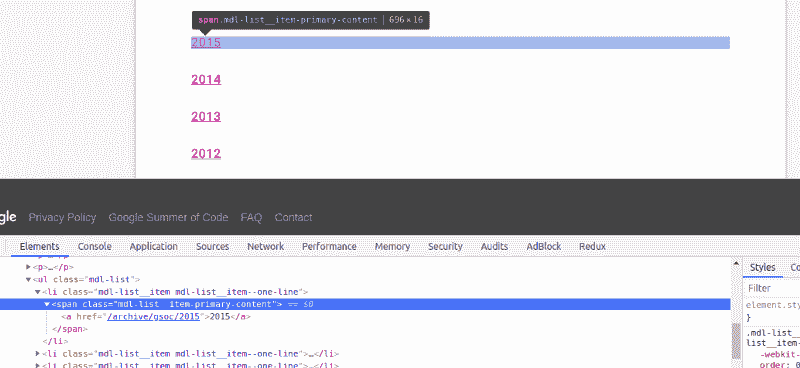
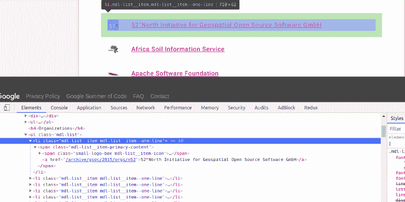
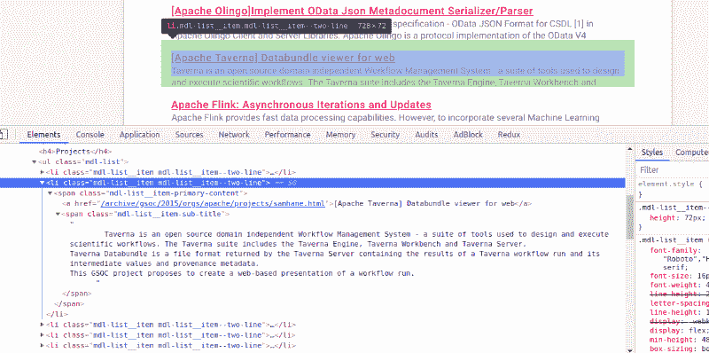

# 我如何使用 Python 来帮助我为谷歌代码之夏 19 选择一个组织

> 原文：<https://www.freecodecamp.org/news/how-i-used-python-to-help-me-chose-an-organisation-for-google-summer-of-code-19-75078de13194/>

瓦伊巴夫·古普塔

# 我如何使用 Python 来帮助我为谷歌代码之夏 19 选择一个组织


Image Credits: [Tarun Kumar](https://medium.com/@meets2tarun)

在本教程中，我将使用 python 从 Google Summer of Code (GSoC)档案中收集 2009 年参与组织的数据。

### 我在这个项目背后的动机

当我在参加 GSoC'18 的庞大组织名单中滚动时，我意识到探索一个组织是一项重复的任务——选择一个，探索它的项目，检查它是否在前几年参加过。但是，有 200 多个组织，逐一查看将花费大量时间。所以，作为一个懒惰的人，我决定使用 python 来减轻我的工作

### 要求

*   *Python(我会用 python3.6，因为 f 串很牛逼？)*
*   *Pipenv(用于虚拟环境)*
*   *请求(获取网页)*
*   *美汤 4(用于从网页中提取数据)*

### 构建我们的脚本

这些是我们要抓取的网页:

1.  对于 2009 年至 2015 年:[链接](https://www.google-melange.com/archive/gsoc)
2.  对于 2015 年至 2018 年:[链接](https://summerofcode.withgoogle.com/archive/)

### 编码部分


[GIF from Giphy](https://giphy.com/gifs/nascar-owen-wilson-daytona-500-xTiN0GMUaOI726QYZa)

#### 步骤 1:设置虚拟环境并安装依赖项

可以使用 *virtualenv* 来创建一个虚拟环境，但是我会推荐使用 *Pipenv* ，因为*T5 最大限度地减少了工作，并且支持 *Pipfile* 和 *Pipfile.lock* 。*

创建一个新文件夹，并在终端中输入以下一系列命令:

```
pip install pipenv
```

然后创建一个虚拟环境，只需一个命令(Pipenv rocks？):

```
pipenv install requests beautifulsoup4 --three
```

上述命令将执行以下任务:

*   创建一个虚拟环境(针对 python3)。
*   安装*请求*和 b *eautifulsoup4。*
*   在同一个文件夹中创建`Pipfile`和`Pipfile.lock`。

现在，激活虚拟环境:

```
pipenv shell
```

注意激活时`$`前的文件夹名称，如下所示:

```
(gsoc19) $
```

#### 步骤 2:收集 2009-2015 年的数据

打开任意代码编辑器，新建一个 python 文件(我将其命名为`2009–2015.py`)。该网页包含每年组织名单的链接。首先，在一个单独的文件`utils.py`中编写一个实用函数，它将为我们获取任何网页，如果出现连接错误，它将引发一个`Exception`。

现在，获取包含每年组织列表的网页链接。


Webpage preview

为此，创建一个函数`get_year_with_link`。在写函数之前，我们需要稍微检查一下这个网页。右击任意年份，点击*检查*。



注意这里有一个`<` ul >标签，在它里面还有`e ar` e < li >标签，每个标签都有一个<span&g`t; tag with class mdl-list__it`em-primary-content，里面是我们的链接和年份。另外，请注意，这种模式每年都是相同的。我们想获取这些数据。

此功能执行的任务顺序如下:

1.  获取`MAIN_PAGE`，如果出现连接错误，则引发异常。
2.  如果响应码为`200 OK`，用 BeautifulSoup 解析抓取的网页。如果响应代码是别的，退出程序。
3.  用`class mdl-list__item mdl-list__item — on` e-line 找到所有的`<` li >标签，并存储返回的 li `st in ye` ars_li。
4.  初始化一个空的`years_dict`字典。
5.  开始遍历`years_li`列表。
6.  获取年份文本(2009，2010，2011，…)，删除所有的`\n`，并将其存储在`year`中。
7.  获取各年份的相对链接(/archive/gsoc/2015，/archive/gsoc/2016，…)并存储在`relative_link`中。
8.  通过将`relative_link`与`HOME_PAGE`链接合并，将`relative_link`转换为完整链接，并存储在`full_link`中。
9.  将这些数据添加到`year_dict`字典中，将年份作为关键字，将`full_link`作为其值。
10.  对所有年份重复此操作。

这将为我们提供一个以年份为关键字、以链接为值的字典，格式如下:

```
{  ...  '2009': 'https://www.google-melange.com/archive/gsoc/2009',  '2010': 'https://www.google-melange.com/archive/gsoc/2010',  ...}
```

现在，我们想访问这些链接，并从这些页面中获取每个组织的名称及其链接。右键单击任何组织名称，然后单击*检查*。



注意，有一个带有 l-list 的 ul 标签，而的 li 标签是单行的。在每个 `th`里面有一个<和一个>标签，上面有链接和组织的名字。我们想抓住它。为此，让我们创建 `another function get_organizatio` ns_list_with_links，它获取包含每年组织列表的网页链接(wh `ich we scraped in` get_year_with_link)。

此功能执行的任务顺序如下:

1.  获取组织列表页面，([https://www.google-melange.com/archive/gsoc/2015](https://www.google-melange.com/archive/gsoc/2015)，[https://www.google-melange.com/archive/gsoc/201](https://www.google-melange.com/archive/gsoc/2015)6，…)，如果有连接错误，则引发异常。
2.  如果响应码为`200 OK`，用 BeautifulSoup 解析抓取的网页。如果响应代码是别的，退出程序。
3.  用`class mdl-list__item mdl-list__item — on` e-line 找到所有的`<` li >标签，并存储返回的 li `st in o` rgs_li。
4.  初始化一个空的`orgs_dict`字典。
5.  开始遍历`orgs_li`列表。
6.  获取组织名，去掉所有的`\n`，存储在`org_name`中。
7.  获取每个组织的相对链接(/archive/gsoc/2015/orgs/n52，/archive/gsoc/2015/orgs/beagle board，…)并存储在`relative_link`中。
8.  通过将`relative_link`与`HOME_PAGE`链接合并，将`relative_link`转换为完整链接，并存储在`full_link`中。
9.  将该数据添加到`orgs_dict`中，以`org_name`为键，以`full_link`为值。
10.  对特定年份的所有组织重复此操作。

这将为我们提供一个字典，其中组织的名称作为键，它们的链接作为值，如下所示:

```
{  ...  'ASCEND': 'https://www.google-melange.com/archive/gsoc/2015/orgs/ascend',
```

```
'Apache Software Foundation': 'https://www.google-melange.com/archive/gsoc/2015/orgs/apache',  ...}
```

接下来，我们希望访问这些链接，并获得每年每个组织的每个项目的标题、描述和链接(？).右键单击任何项目的标题，然后单击 I*inspect。*



同样的模式。有一个带有`class md` l-list 的`<` ul >标签，其中包含`s th` e < li >标签 `with class mdl-list__item mdl-list__ite` m —两行，其中 `there`的一个<span>ch 包含一个< a >标签，其中包含我们项目的 `name.`还有一个`n <span> tag with` 类 mdl-list__item-sub-title，其中包含项目的描述`. For that, create a` 函数 get_org_projects_info 以获取

此功能执行的任务顺序如下:

1.  获取 org 的描述页面，([https://www . Google-melange . com/archive/gsoc/2015/orgs/ascend](https://www.google-melange.com/archive/gsoc/2015/orgs/ascend)，[https://www . Google-melange . com/archive/gsoc/2015/orgs/Apache](https://www.google-melange.com/archive/gsoc/2015/orgs/apache)，…。)，如果有连接错误，则引发异常。
2.  如果响应码为`200 OK`，用 BeautifulSoup 解析抓取的网页。如果响应代码是别的，退出程序。
3.  找到所有带有类 equ `al to mdl-list__item mdl-list__item — tw` o-line 的`<` li >标签，并存储返回的 li `st in proje` cts_li。
4.  初始化一个空的`projects_info`列表。
5.  开始遍历`projects_li`列表。
6.  在每个循环中初始化一个空字典`proj_info`。
7.  获取项目的标题，去掉所有的`\n`，存储在`proj_title`中。
8.  获取各个项目的相对链接([https://www . Google-melange . com/archive/gsoc/2015/orgs/Apache/projects/djkevincr . html](https://www.google-melange.com/archive/gsoc/2015/orgs/apache/projects/djkevincr.html)，…。)并将其存储在`proj_relative_link`中。
9.  通过将`proj_relative_link`与`HOME_PAGE`链接合并，将`proj_relative_link`转换为完整链接，并存储在`proj_full_link`中。
10.  将项目的标题、描述和链接存储在`proj_info`字典中，并将该字典添加到`projects_info`列表中。

这将给我们一个包含字典和项目数据的列表。

```
[  ...  {    'title': 'Project Title 1',    'description': 'Project Description 1',    'link': 'http://project-1-link.com/',  },  {    'title': 'Project Title 2',    'description': 'Project Description 2',    'link': 'http://project-2-link.com/',  }  ...]
```

#### 步骤 3:实现主函数

让我们先看看代码:

此功能执行的任务顺序如下:

1.  我们想要一个`final_dict`字典，这样我们就可以将它保存为`.json`文件。
2.  然后，我们调用我们的函数`get_year_with_link()`，它将返回一个字典，以年份作为关键字，以组织列表的链接作为值，并将其存储在`year_with_link`中。
3.  我们迭代字典`year_with_link`。
4.  对于每一年，我们调用函数`get_organizations_list_with_links()`,将它的链接作为参数，这将返回一个字典，以组织的名称作为键，以包含关于它们的信息的网页链接作为值。我们将返回值存储在`final_dict`中，用`year`作为键。
5.  然后我们迭代每一年的每个组织。
6.  对于每个组织，我们调用函数`get_org_projects_info()`,将组织的链接作为参数，这将返回包含每个项目信息的字典列表。
7.  我们将数据存储在`final_dict`中。
8.  循环结束后，我们将有一个如下的`final_dict`字典:

```
{    "2009": {        "Org 1": [            {                "title": "Project - 1",                "description": "Project-1-Description",                "link": "http://project-1-link.com/"            },            {                "title": "Project - 2",                "description": "Project-2-Description",                "link": "http://project-2-link.com/"            }        ],        "Org 2": [            {                "title": "Project - 1",                "description": "Project-1-Description",                "link": "http://project-1-link.com/"            },            {                "title": "Project - 2",                "description": "Project-2-Description",                "link": "http://project-2-link.com/"            }        ]    },    "2010": {        ...    }}
```

9.然后我们会用`json.dumps`保存为`json`文件。？？

#### 后续步骤

2016-2018 年的数据可以以类似的方式收集。然后可以使用 python(或任何合适的语言)来分析数据。或者，可以做一个 web app。事实上，我已经用 *Django* 、 *Django REST 框架*和 *ReactJS* 制作了我的 webapp 版本。**下面是相同的链接:**[https://gsoc-data-analyzer.netlify.com/](https://gsoc-data-analyzer.netlify.com/)

> 本教程的所有代码都可以在我的 github 上找到。

### 丰富

使用多线程可以提高脚本的运行时间。目前，它一次获取一个链接，也可以同时获取多个链接。

### 关于我

你好。

我是**瓦伊巴夫·古普塔**，勒克瑙**印度信息技术学院**的本科生。我爱 Python 和 JS。

查看我的[作品集](https://dojutsu-user.github.io/)或在[脸书](https://www.facebook.com/vaib79)、 [LinkedIn](https://www.linkedin.com/in/vaibhavgupta79/) 或 [Github](https://github.com/dojutsu-user) 上找到我。