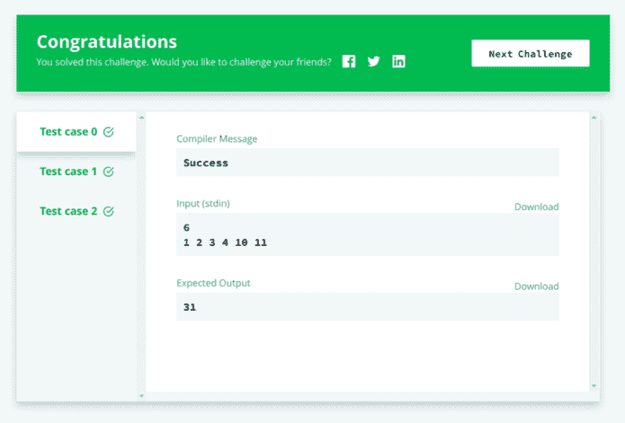

# 如何开始使用 JavaScript 进行竞争性编程

> 原文：<https://www.freecodecamp.org/news/how-to-get-started-with-competitive-programming-in-javascript-76ad2e760efe/>

Priyabrata Biswas

# 如何开始使用 JavaScript 进行竞争性编程


let U = ? => ? ; U(M); /* M → **‘mathbal**l’ */

如果你不熟悉[竞争性编程](https://en.wikipedia.org/wiki/Competitive_programming)，基本上它是一项智力运动，目的是编写代码来解决给定的问题。大一的时候被学长介绍认识的。在我写这篇文章的时候，我仍然不太擅长！也许是因为我不喜欢用 C++编写代码，或者也许我是一个懒惰的人，不会花时间真正学好它。但是，我喜欢算法和数据结构，就像我喜欢 JavaScript 一样！

所以，这个荒谬的想法一次又一次地在我脑海中闪过。如果我们开始在竞争领域使用 JavaScript 会怎么样？事实证明，这似乎不是我想象中的未知领域。像 [HackerRank](https://www.hackerrank.com/) 、 [CodeChef](https://www.codechef.com/) 、 [Codeforces](https://codeforces.com/) 等很多平台都支持 JavaScript。

我知道 C++比 JavaScript 快很多，而且可以动态分配内存。C 和 C++在性能上相当相似，但有竞争力的程序员大多使用 C++是因为它的[标准模板库](https://www.geeksforgeeks.org/the-c-standard-template-library-stl/)(或 STL)。它提供了通用的编程数据结构，如列表、堆栈、数组以及现成的容器类、算法和迭代器。

但是，JavaScript 提供了 C++所缺乏的东西:

> 自由！

作为一种脚本语言，JavaScript 天生就很慢。但是，它仍然是最受欢迎的语言。根据 2018 年的 [Stack Overflow 开发者调查](https://insights.stackoverflow.com/survey/2018/)，69.8%的受访者将 JavaScript 用于他们的开发目的。但是，与此同时，它在竞争性编程的情况下就不那么光彩了。原因是它根本不是为它而建的！

早在 1995 年， [Brendan Eich](https://en.wikipedia.org/wiki/Brendan_Eich) 开发 JavaScript 只是为了给网页增加交互性，比如处理鼠标点击。

今天，我们可以构建服务器、游戏、移动应用、物联网应用，甚至可以通过 JavaScript 在浏览器中进行机器学习。那么，为什么在竞争性编程中使用它时会感到羞愧呢？

> "任何可以用 JavaScript 编写的应用程序，最终都会用 JavaScript 编写."——[杰夫·阿特伍德](https://en.wikipedia.org/wiki/Jeff_Atwood)

还记得我跟你说过的 STL 和它为竞争性编程提供的工具包吗？我心想为什么 [TC 39](https://www.ecma-international.org/memento/tc39.htm) 不为 JavaScript 想出类似的东西呢！


Eventually, I had an idea! ?

您是否听说过“节点包管理器”，也称为“ **npm** ”？

嗯，它是世界上最大的软件注册中心,拥有超过 874，285 个包(在撰写本文时),并且是 Node.js 的默认包管理器。

> 这个想法是开发一个 npm 包，很像 C++的 STL

### 介绍 Mathball

Mathball 是一个用于 JavaScript 竞争性编程的 npm 包，它实现了优化的算法以加快执行速度。好吧，现在我夸张了！事实是，到目前为止，它只支持 16 个实现[强力方法](https://discuss.codechef.com/questions/281/brute-force-approach)的效用函数。我创建了这个小小的助手库来帮助人们进行竞争性编程。


how’s the logo! ?

如果您的计算机上安装了 Node.js 和 npm，那么通过在终端中键入以下命令，您可以很容易地获得这个包:

```
npm install mathball
```

您可以通过一个`mathball` 对象`M`访问所有实用程序，如下所示:

同样，获取一个单独的函数就像这样简单:

哦，现在你一定在想—

> 我应该如何在像 HackerRank 或 CodeChef 这样的平台中使用第三方库？

答案很简单，只需**捆绑**它！？

让我解释一下我的意思！假设你正试图在 HackerRank 上解决这个特殊的问题

[**简单数组求和| HackerRank**](https://www.hackerrank.com/challenges/simple-array-sum/problem)
[*计算数组中整数的和。*www.hackerrank.com](https://www.hackerrank.com/challenges/simple-array-sum/problem)

不要被那些代码弄得不知所措。如果你以前使用过 HackerRank，那么你应该知道它只是用来处理 I/O 的。

首先将以上内容复制粘贴到一个文件中，`index.js`。然后，在同一个目录中，打开终端并键入:

```
npm install mathball
```

接下来，在`index.js`文件中，修改以下内容:

最后，为了将所有内容打包到一个文件中，我使用了 Webpack，但是您可以自由选择任何 CommonJS 模块捆绑器！

因此，让我们在同一个目录中创建一个`webpack.config.js`文件，其中包含以下代码:

如果您还没有安装 Webpack，请按如下方式安装:

```
npm install -g webpack webpack-cli
```

最后，键入以下内容:

```
webpack --config ./webpack.config.js --mode=development
```

现在，上面的命令将在同一个目录下创建一个名为`bundle.js` 的文件。所以，把它的内容复制粘贴到 HackerRank 上，点击* **提交代码** *。就是这样！



Bazinga! ?

### 收场白

仅仅为了计算一个数组的和，而去做那些无意义的事情是没有意义的…对吗？所以我必须承认，竞争性编程的问题要比这复杂得多。

> 我相信竞争性编程更多的是找出解决问题的方法，而不仅仅是解决它们！

一旦你弄清楚你的问题需要什么样的算法或数据结构，如果你有一个像 Mathball 这样的库，编码就变得很容易了。此外，您不必在每次编写代码时都经历所有这些捆绑步骤。这基本上是一个一次性的设置过程。只需编码，并用最后一个命令捆绑您的文件。

有趣的事实 —你也可以在你的项目中使用 Mathball！

我将不断改进 Mathball，并真诚地欢迎您的贡献。一起，我们可以让数学球做得更多！这里是回购的[链接](https://github.com/pbiswas101/Mathball)。

本文的目的是宣传 JavaScript 社区中竞争性编程的重要性。我认为学习算法和数据结构可以让我们更关心代码库的效率和复杂性。一般来说，它使我们对任何内存泄漏都要仔细检查，并帮助我们成为更好的开发人员。

以下是激励我踏上在竞争性编程中支持 JavaScript 之旅的资源列表:

1.  [Pranay Dubey —用于竞争性编程的 JavaScript】](https://www.youtube.com/watch?v=2OUw6jRYSKA)
2.  [用于算法竞争编程的 JavaScript】](https://hackernoon.com/javascript-for-algorithms-competitive-programming-45cf723cd16f)

感谢您的宝贵时间！✌️