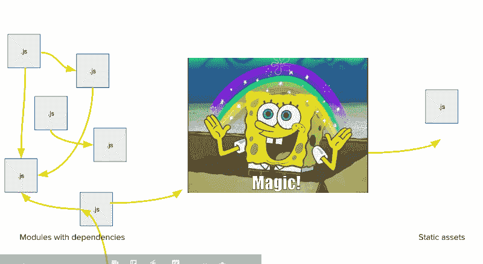
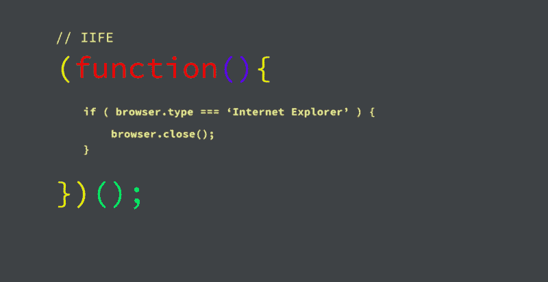
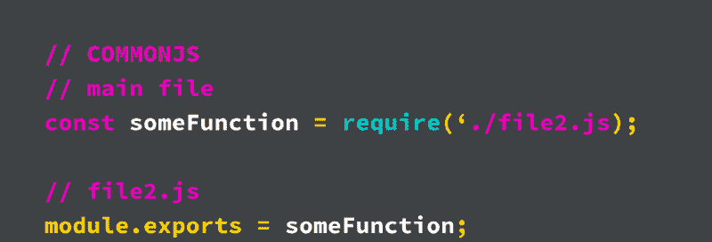
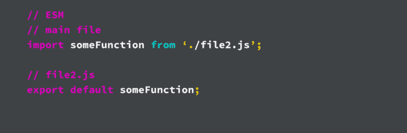
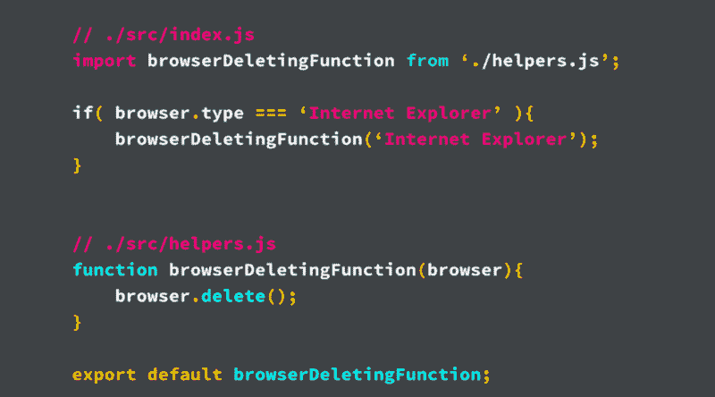
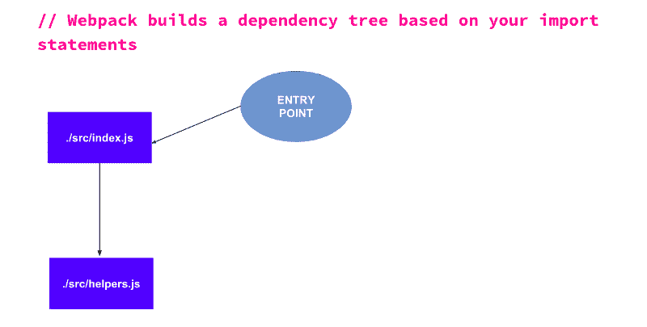
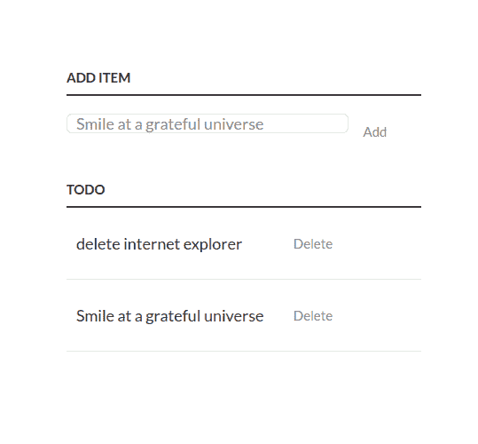
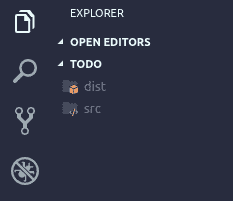
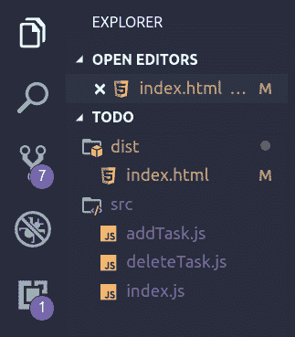
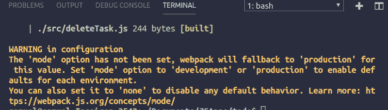

# 如何用 WEBPACK 构建现代应用程序

> 原文：<https://www.freecodecamp.org/news/how-to-build-modern-applications-with-webpack-c81ccf6dd54f/>

Webpack 的默认配置能让我们走多远？

上个月，我有幸在 GDG 开发者大会上做了一次演讲，主题是在现代应用中使用 webpack。你可以在这里查看幻灯片。

每天，我作为一名工程师和/或顾问与令人惊叹的快节奏团队一起工作，webpack 似乎是这些团队中反复出现的因素(我们在大多数应用程序中使用 ReactJs)。最初，我的演讲应该集中在使用 webpack 和前端框架/库，如 ReactJS、Vue、Angular 等。

在提交我的提案之前，我决定进行一次小型调查，以了解人们对 webpack 的看法。令我惊讶的是，许多人将 webpack 标记为“只用于框架”,这与事实相差甚远。还有人说“建立 webpack 让人望而生畏”。这让我更加关注将 webpack 与 Vanilla JS 一起使用，并看看 webpack 的默认配置能走多远。

但是首先:

### 什么是 WEBPACK？



> 我个人将 webpack 定义为一个工具，它将许多 Javascript 模块合并成一个可以发送到浏览器的 Javascript 模块。

我知道，这是对 webpack 功能的过度简化，但人们似乎理解它。再解释一下，webpack 是一个 bundler，它寻找具有依赖关系的 Javascript 模块(基本上，Javascript 文件需要来自其他 Javascript 文件的代码)，将它们挤压在一起，然后生成一个或多个没有依赖关系的 Javascript 文件。这样，它们可以很容易地被发送到浏览器。

### Webpack 的历史

为了理解 webpack 试图解决的问题，我们需要了解一点 webpack 本身的历史。为了使这一部分非常简短，我只概述了两个重要的工具和一个概念:

*   [Google Web Toolkit](http://www.gwtproject.org/) :这是 Google 的一个框架，把 Java 转换成 Javascript(我知道，对吧？).在 webpack 中，有一个特性似乎是我个人最喜欢的，那就是“代码分割”。(我将在后续文章中解释代码分割。)
*   [Modules_Webmake](https://github.com/medikoo/modules-webmake) :这是 webpack 起源的库。它本质上是一个工具，允许我们像组织 NodeJS 一样组织浏览器的 Javascript 文件。
*   IIFE:表示立即调用的函数表达式。这基本上是一个 Javascript 函数，在创建的同时被调用。

#### 立即调用函数表达式

我把它分成单独的部分，因为我需要进一步解释。这是一个生活的例子:



如果我们将这个函数放在脚本标签中，它会立即运行。脚本标签由浏览器加载。这有点类似于给`window.onload`附加一个功能，但是有一个额外的好处。

由于闭包在 Javascript 中的工作方式，在 IIFE 中声明的所有变量都在该函数的范围内。这意味着我的代码库中不会有名称空间冲突之类的问题，但同时，我仍然可以访问 life 公开的函数。

### 为什么选择 Webpack？

那么，webpack 帮助我们解决了我们今天面临的哪些问题呢？

首先，我们有脚本标签的问题。我曾经做过一个代码库，其中每个 HTML 页面至少有 30 个脚本标签，以非常精确的顺序排列。我知道有些人可能会说这不是一个真正的问题，但浏览器将不得不对每个文件发出一个请求，这会影响你的“加载时间”。此外，脚本标签可能会变得难以管理，重新排列一个标签就可能会破坏应用程序(我试过了？).

第二，我们仍然有命名空间的问题，全局命名空间可能会变得混乱。我知道我们是非常有创造力的人，尤其是在给变量命名的时候，但是当你在一个更大的团队中工作时，有时变量名会相互冲突。或者甚至你未来的自己可能会再次想起同样的名字(是的，它发生了)。

我知道一些组织让他们的开发人员习惯于总是将他们的变量保持在他们的功能范围内，但是我们不能总是依赖于此(或者依赖于`*this*` *)。*最终，它只会让关注点的分离变得困难。

第三，记得我提到过 webpack 起源于 modules_webmake。因为 webpack 允许我们像在 NodeJS 中一样(使用 CommonJS)组织我们的文件，所以我们有额外的好处来编写可伸缩性非常好的模块化代码(只要问问使用前端框架的人就知道了)。

### CommonJS



我不会解释太多关于 CJS 的事情，因为这不是本文的重点。但是你可以说是用在 [NodeJS](https://nodejs.org/en/) 的 JS 模块系统。

Webpack 允许我们在浏览器中使用这个模块，甚至是“更好的”ES 模块系统，而没有任何问题(Webpack 以一种聪明的方式处理它)。这有助于我们编写真正模块化和可维护的代码，其中 JS 文件可以处理单一功能(单一责任原则)。

### 是模块(ESM)



这是另一个模块系统，信不信由你，它已经被当前的浏览器实现了。但不幸的是，它有其局限性。Webpack 还允许我们毫无问题地使用这个模块(因为 webpack 最终仍然会转换它)，但是我发现使用 ESM 使得我所处理的大多数代码库更具可读性。我很想更深入地研究这个问题，但这不是本文的目的。为了更好的解释，我推荐这篇惊人的[文章](https://medium.com/webpack/the-state-of-javascript-modules-4636d1774358)。

### Webpack 是如何工作的？

我知道我之前说过 Webpack 很神奇，但我撒谎了。尽可能简单地说:

*   Webpack 获取一个指向单个入口点的路径，该入口点是一个 JS 文件，并查找导入语句(它可以是 ESM 或 CJS)。
*   然后它遍历导入的文件，寻找更多的导入语句，同时在这个过程中创建一个依赖图。

为了更好地解释，请看这张图片:



J.K.

我有两个文件，`index.js` 和`helpers.js`这两个文件执行不同的功能，但是我在 index.js 文件中导入并使用 helpers.js 中的函数。默认情况下，Webpack 的入口点是`./src/index.js`，它试图从那里构建依赖图，如下所示:



### 如何开始

为了更好地理解 webpack 的工作原理，我们将构建一个简单的 TODO 应用程序。它将只有基本的添加和删除功能，我们将使用 Webpack 的默认配置对其进行捆绑(因此没有 webpack 配置文件)。这是应用程序的外观:



J.K.

第一步是创建一个新的项目目录并创建两个文件夹，一个名为`dist`的文件夹和另一个名为`src`的文件夹。默认情况下，Webpack 的入口点是路径`./src/index.js`，它将捆绑的 JS 输出到`./dist/main.js`——这就是我们创建这两个文件夹的原因。

在`dist`文件夹中，您可以创建`index.html`文件。这对于 webpack 是不必要的，因为文件可以放在项目目录中的任何地方，你可以直接引用`main.js`文件。最后，您的项目结构应该如下所示:



在`src`文件夹中，我们将创建`index.html`文件，在这里我们将开始实现我们的待办事项应用程序的功能。但是首先，让我们填充`index.html`文件。因为创建一个待办事项应用程序不是本教程的一部分，所以我只展示下面的代码:

```
<html>
  <head>
    <title>Todo App</title>
  </head>
  <body>
    <div class="container">
      <p>
        <label for="new-task">Add Item</label>
        <input id="new-task" type="text">
        <button id="addTask">Add</button>
      </p>

      <h3>Todo</h3>
      <ul id="tasks">
      </ul>
    </div>
    <script src="main.js"></script>
  </body>
</html>
```

让我们现在使它发挥作用。我们将把两个函数(添加和删除)分解成各自的文件，然后导入到`index.js`中。我们将在我们的`src`文件夹中创建两个文件，分别命名为`addTask.js`和`deleteTask.js`。您的项目结构现在应该如下所示:



我们现在可以开始添加必要的逻辑，所以让我们先实现`deleteTask.js`,因为它没有依赖关系。将此粘贴到您的`deleteTask.js`文件中:

```
const deleteTask = function(e) {
  console.log("Delete Task...", e);
  //Remove the parent list item from the ul
  var listItem = e.target.parentNode;
  var ul = listItem.parentNode;
  ul.removeChild(listItem);
};

export default deleteTask;
```

在该文件中，我们正在创建`deleteTask`函数，然后将其导出为默认导出。

我们现在可以实现`addTask`函数。在`addTask.js`文件中添加以下代码:

```
import deleteTask from "./deleteTask";

const createNewTaskElement = function(taskString) {

  const listItem = document.createElement("li");
  const label = document.createElement("label");
  const deleteButton = document.createElement("button");
deleteButton.innerText = "Delete";
  deleteButton.className = "delete";
  deleteButton.addEventListener("click", deleteTask);

	label.innerText = taskString;
	listItem.appendChild(label);
  	listItem.appendChild(deleteButton);
	return listItem;
};

const addTask = function(e) {
  const taskList = document.getElementById("tasks");
  const task = document.getElementById("new-task");
  if (task.value !== "") {
    const newTaskItem = createNewTaskElement(task.value);
    taskList.appendChild(newTaskItem);
    task.value = "";
  }
};

export default addTask;
```

在这个例子中，我们首先导入`deleteTask.js`文件。默认情况下，如果在导入中没有指定扩展名，webpack 会自动假定它是一个`.js`文件。然后我们有一个函数来创建包含表单中输入的任务的列表项。唯一需要注意的是，我们将删除函数附加到删除按钮的点击处理程序上。然后我们创建实际的 addTask 函数并导出它。

然后我们需要将我们的`addTask`函数导入到`index.js`中。将下面的代码粘贴到您的`index.js`文件中:

```
import addTask from './addTask';

const addTaskButton = document.getElementById("addTask");

addTaskButton.addEventListener("click", addTask);
```

这非常简单:我们导入了`addTask`函数，并将其附加到`addTaskButton`的 click 处理程序。如果你按照上面的步骤去做，你应该会好起来。

最后，为了获得我们的`main.js`文件，我们需要通过我们的代码库运行 Webpack。对于这一步，确保您的系统上安装了 [NodeJS](https://nodejs.org/en/) ，然后我们将使用以下命令全局安装 webpack:

```
npm install -g webpack OR sudo npm install -g webpack
```

安装完成后，运行以下命令:

```
webpack
```

它将成功地捆绑我们的文件，但是我们应该在终端中看到这样的警告:



Webpack 只是警告我们没有指定一个[模式](https://webpack.js.org/concepts/#mode)。我们可以让它保持原样并运行代码，一切都应该工作正常。但是如果你不喜欢这个警告，你可以像这样运行 Webpack:

```
webpack --mode=development
```

你可以走了。

### 包扎

如果你在这个过程中迷路了，你可以随时使用 GitHub [repo](https://github.com/samie820/todo) 作为参考(尽管它有一些 CSS 样式)。

我希望这篇文章能够向您展示 Webpack 提供了什么(只是基本的，没有任何配置)。在随后的文章中，我将尝试展示如何设置各种定制配置，例如[代码分割](https://webpack.js.org/guides/code-splitting/)、[延迟加载](https://webpack.js.org/guides/lazy-loading/)，以及配置 Webpack 与多页面应用程序一起工作。

为了让这篇文章尽可能的简单，我避免了在文章中使用一个`package.json`文件。使用一个`package.json`文件并在本地安装 webpack 是使用 webpack 的最具伸缩性的方式，我将在下一篇关于使用 Webpack 的文章中对此进行深入探讨。

为了帮助浏览接下来的文章，如果您能留下您希望看到的关于 Webpack 的解释或实现的评论，将会非常有帮助。？？

*我要特别感谢[肖恩·t·拉金](https://www.freecodecamp.org/news/how-to-build-modern-applications-with-webpack-c81ccf6dd54f/undefined)、[伊斯雷尔·奥比阿巴](https://www.freecodecamp.org/news/how-to-build-modern-applications-with-webpack-c81ccf6dd54f/undefined)和[哈桑·萨尼](https://www.freecodecamp.org/news/how-to-build-modern-applications-with-webpack-c81ccf6dd54f/undefined)他们的反馈使文章比最初计划的更好。你们都很棒！*