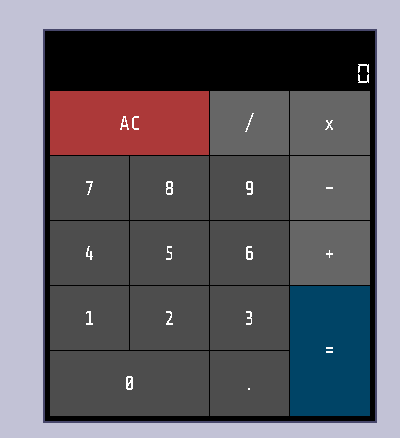
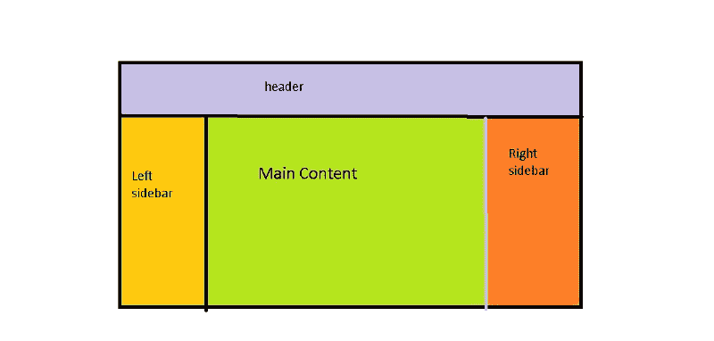
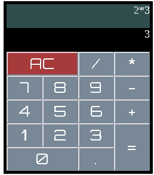

# 如何使用一点 CSS 网格魔法设计一个计算器应用程序

> 原文：<https://www.freecodecamp.org/news/how-to-use-a-little-css-grid-magic-to-design-a-calculator-app-e162afb2fdb4/>

迪皮卡·贡达

# 如何使用一点 CSS 网格魔法设计一个计算器应用程序

这篇文章是对 CSS 网格的一个快速介绍。我们将用它制作一个计算器。

这篇文章对于对 CSS 有基本了解的开发人员和那些想学习 CSS 提供的用于样式化页面的新工具的人来说是很好的。

我从一开始就喜欢 CSS 网格区域模板！网络上的例子可能看起来很复杂，但是相信我，尝试使用它们一次，你就会爱上它们，并在你的许多项目中使用它们。

这个想法是想做出类似下图的东西后开始的。



Calculator

请注意=、0 和 AC 按钮的大小是常规按钮的两倍。起初，我想到使用表格 HTML 元素和 colspan 和 rowspan 来制作这个。但后来我想知道我们是否可以使用 CSS Flexbox 来实现它。在未能放置=和 0 以及之后。在同一排，我开始意识到 CSS 网格的必要性。

这里有完整的代码: [CSS-Grid-Calculator](https://github.com/deepikagunda/CSS-Grid-Calculator) 。

### 什么是 CSS 网格？

> CSS 网格布局模块提供了一个基于网格的布局系统，具有行和列，使得设计网页更加容易，而不必使用浮动和定位。 *—来自我最喜欢的 w3schools.com*

所以我假设主布局和类似表格的内容看起来像网格，所以我们可以使用 CSS Grid 来设置它们的样式。

### 首先要做一个网格

我们必须在任何需要网格的容器上使用 display:grid。如果是网站的整个主页，我们可以这样做:

```
<html>
```

```
<style> #main{       display:grid;     }
```

```
</style>
```

```
<body><div id="main"></div>
```

```
</body></html>
```

### 下一步是什么？

假设你想做一个网站，它有一个导航栏，右边栏，左边栏和中间部分的内容。通常，您希望导航条和侧边栏具有固定的宽度和高度(视区百分比),并且内容部分在任何剩余空间中扩展。

那么我们该怎么做呢？



Layout of a typical website.

```
<style>#main{ display:grid; grid-template-columns: 20vw auto 20vw; grid-template-rows: 15vh auto; grid-template-areas:"header header header"                     "leftSB content rightSB";
```

```
}#header{ grid-area:header;}#leftSB{  grid-area:leftSB;}#rightSB{  grid-area:rightSB;}#content{grid-area:content;}
```

```
</style><body> <div id="main">   <div id="header>header</div>   <div id="rightSB">right sidebar</div>   <div id="leftSB">left sidebar</div>   <div id="content">content</div> </div>
```

```
</body>
```

这就是我们需要的布局。

### 详细说明

在上图中，你可以看到我们只需要创建简单的 div 来保存我们的标题、侧栏和内容，并将它添加到根目录。

在样式部分，我们为主容器添加了“display:grid”。

接下来，我们可以看到我们总共需要 2 行 3 列。这就是为什么我们增加了这一行

```
grid-template-columns: 20vw auto 20vw;
```

我们告诉它，我们需要 3 列，第一列应该占据视图宽度的 20%，下一列是 auto(这是该列可以占据的所有空间)，最后一列也是视图宽度的 20%。

```
grid-template-rows: 15vh auto;
```

我们在这里说，我们总共需要两行。第一行将用于标题，它将是视窗高度的 15%,剩余的空间用于第二行。

现在是网格模板区域。这里我们用简单的名字定义什么将占据网格。假设我们希望标题占据整个第一行，并且不应该有分割。然后，我们使用以下内容:

```
grid-template-areas:"header header header"
```

因为我们有 3 列，所以我们需要提到 header 3 次。通过使用相同的名称，结果将是一个统一的标题区域。

```
grid-template-areas:"header header header"                     "leftSB content rightSB";
```

这是完整的网格模板区域，它使用简单的名称来定义我们的 2 * 3 网格的每个部分。

既然我们已经定义了网格模板，我们将把 div 分配给这些区域。因此，我们使用了 div 的 id，并使用 grid-area 指定了模板区域的名称。

```
#header{ grid-area:header;}#leftSB{  grid-area:leftSB;}
```

就是这样，我们现在已经定义了这些 div 应该如何在所有的视窗尺寸上定位，而不需要在单个项目上使用浮动或宽度，也不需要使用引导等等。

是不是很震撼？在这里看看我们用这几行代码[创造了什么。](https://codepen.io/deepikag/pen/xmLLoE)

### 下一步是什么？

我们现在可以在 div 上添加边栏、导航条等。我将把这个例子留在这里，现在继续看一个使用 CSS Grid 的有点复杂的计算器设计。

### 定义组件

我们有一个公式显示部分，当前显示部分在顶部。其余的是按钮 0-9、AC(清除)按钮和操作按钮+ — * /和=。

因此，让我们为所有组件创建按钮和 div，并将它们保存在一个容器中。

```
<body> <div id="root">  <label id="display"> 0</label>  <label id="cdisplay" >0</label>  <button id="clear">AC </button>  <button id="divide">/</button>  <button id="multiply">*</button>  <button id="seven">7</button>  <button id="eight">8</button>  <button id="nine">9</button>  <button id="minus">-</button>  <button id="four">4</button>  <button id="five">5</button>  <button id="six">6</button>  <button id="plus">+</button>  <button id="one">1</button>  <button id="two">2</button>  <button id="three">3</button>  <button id="zero">0</button>  <button id="dot">.</button>  <button id="equal">=</button>   </div> </body>
```



Our final calculator

让我们看看计算器的图像。你可以看到我们有 4 列 7 行。让我们定义一下我们的网格:

```
#root{ padding:5px; background-color:black; width:240px; height:280px;
```

```
 display:grid;   grid-template-columns: 1fr 1fr 1fr 1fr;   grid-template-rows: 1fr 1fr 1fr 1fr 1fr 1fr 1fr;   grid-gap:0.1px;
```

```
 grid-template-areas:    "display display display display"   "cdisplay cdisplay cdisplay cdisplay"   "clear clear divide multiply"   "seven eight nine minus"   "four five six plus"   "one two three equal"   "zero zero dot equal"; }
```

分解这个…

```
display:grid;   grid-template-columns: 1fr 1fr 1fr 1fr;   grid-template-rows: 1fr 1fr 1fr 1fr 1fr 1fr 1fr;
```

这里我们说我们有 4 列 7 行，网格的每个部分都是相同的大小。注意，模板的列和行使用 1fr。Fr 是一个分数单位， **1fr** 是可用空间的 1 部分。

我已经给了根 div 240 px 的宽度和 280 px 的高度。所以 1 fr 大约是 60px 宽* 40 px 高。

```
grid-template-areas:    "display display display display"   "cdisplay cdisplay cdisplay cdisplay"   "clear clear divide multiply"   "seven eight nine minus"   "four five six plus"   "one two three equal"   "zero zero dot equal"; }
```

这里我们已经定义了网格模板区域。

网格模板区域是一组行*列字符串。您需要添加与网格中的行数一样多的字符串。在每一行字符串中，你需要提到每一列将包含什么。每个字符串中的项数应该与列数相匹配。

请注意显示器是如何占据整个第一行的。因此，它在第一行字符串中被添加了 4 次。

cdisplay，即当前显示，位于第二行，其定义与 display 类似。

接下来是按钮。清除按钮在第三行，第一和第二列放在一起。因此，在行串 3 中提到了两次。

而且还在继续…

既然主要工作已经结束，我们需要将这些网格区域分配给 div。

```
#display{   grid-area:display; }#cdisplay{   grid-area:cdisplay; }#clear {   grid-area:clear; }#divide {   grid-area:divide; } #multiply {   grid-area:multiply; }
```

我已经展示了如何为 4 个分区分配网格区域。

完整的例子可以在[这里](https://codepen.io/deepikag/pen/GPvMgd)找到，我们在这里添加了更多的样式。

#### 包扎

如前所述，这只是对 CSS 网格的介绍，更具体地说是对 CSS 网格模板区域的介绍。我希望这个例子能让你从现在开始看网站的时候想到 CSS Grid，也希望你以后会用到。

如果你喜欢我的文章，请鼓掌。这对我来说是相当鼓舞人心的。

如果你要做同样的任务，你会怎么做？请在评论中告诉我。