# 费希尔线性判别式的说明性介绍

> 原文：<https://www.freecodecamp.org/news/an-illustrative-introduction-to-fishers-linear-discriminant-9484efee15ac/>

泰勒·席尔瓦

# 费希尔线性判别式的说明性介绍


为了处理两个或更多类别的分类问题，大多数机器学习(ML)算法以相同的方式工作。

通常，他们对输入数据应用某种转换，结果是将原始输入维度减少到一个较小的数字。目标是将数据投射到一个新的空间。然后，一旦投影，该算法试图通过找到一个线性分离来分类这些点。

对于输入维数较小的问题，任务稍微容易一些。以下面的数据集为例。

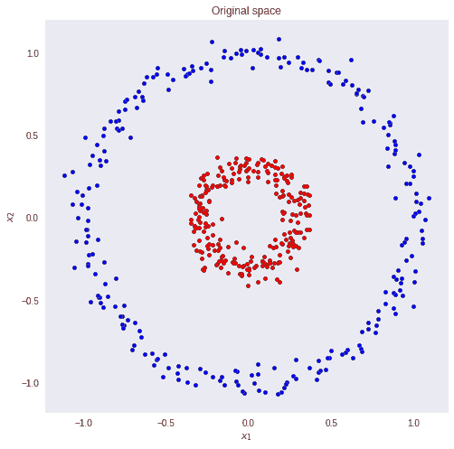

假设我们要对红蓝圈进行正确的分类。

很明显，用简单的线性模型我们不会得到好的结果。没有将输入映射到其正确类别的输入和权重的线性组合。但是，如果我们可以转换数据，这样我们就可以画一条线来区分这两个类，会怎么样呢？

如果我们对两个输入特征向量求平方，就会发生这种情况。现在，一个线性模型将很容易对蓝点和红点进行分类。

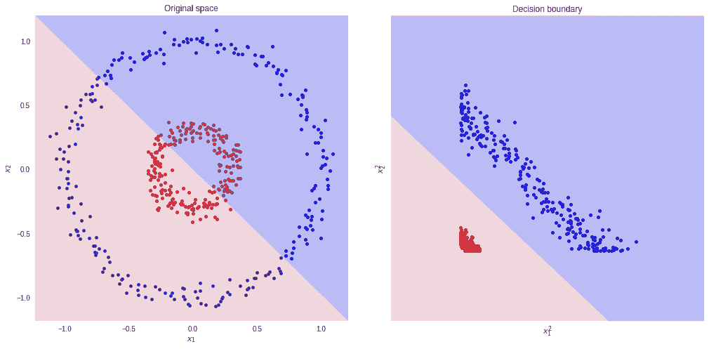

然而，有时我们不知道我们应该使用哪种转换。实际上，找到最佳表示法并不是一个简单的问题。我们可以对数据进行多种转换。同样，它们中的每一个都可能产生不同的分类器(就性能而言)。

这个问题的一个解决方案是学习正确的转换。这被称为 ****表示学习**** ，这正是深度学习算法所做的。

神奇的是，我们不需要“猜测”哪种转换会产生数据的最佳表示。算法会解决的。

但是，请记住，无论是表示学习还是手工转换，模式都是相同的。我们需要以某种方式改变数据，以便它可以很容易地分离。

让我们退一步考虑一个更简单的问题。

我们将探讨 ****费雪线性判别式**** (FLD)如何设法将多维数据分类到多个类别。但是在我们开始之前，请随意打开这个 [Colab 笔记本](https://github.com/sthalles/fishers-linear-discriminant/blob/master/Fishers_Multiclass.ipynb)并跟随。

# 费希尔线性判别式

看待分类问题的一种方式是通过降维的镜头。

首先，考虑两类分类问题的情况( ****K=2**** )。蓝色和红色分在**T5【R】T6**处。一般来说，我们可以取任意一个 D 维输入向量，并将其向下投影到 D '维。这里， ****D**** 代表原始输入尺寸，而****D’****是投影的空间尺寸。纵观本文，认为****D’****小于 ****D**** 。

在投影到一维(数轴)的情况下，即****D’= 1****，我们可以选取一个阈值 ****t**** 在新的空间中进行分类。给定一个输入向量 ****x**** :

*   如果预测值 ****y > = t**** 那么， ****x**** 属于 C1 类(类 1)。
*   否则，它被归类为 C2(2 类)。

注意向量 ****y**** (预测)等于输入量 ****x**** 和权重****w→y****=****w****ᵀ****x .****

以下面的数据集为例。我们要把原来的数据维度从 ****D=2**** 降低到 ****D'=1**** 。换句话说，我们想要一个将二维向量映射到一维向量的变换 t—t(****v****)=ℝ→ℝ。

首先，让我们计算两个类的平均向量****【m1】****和 ****m2**** 。

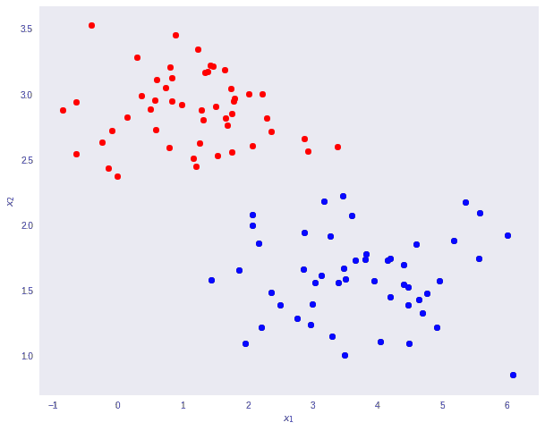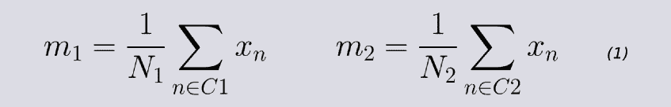

注意，****分别表示 C1 和 C2 的班级点数。现在，考虑使用类均值作为分离的度量。换句话说，我们要将数据投影到向量 ****W**** 上，加入 2 类均值。****

**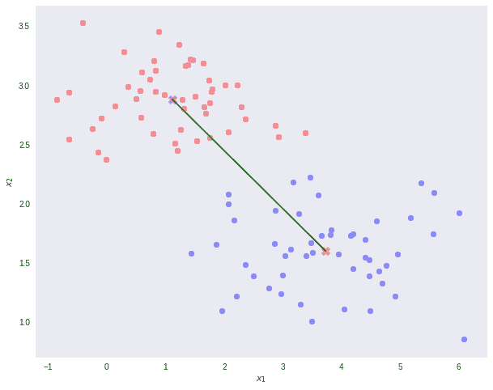**

**值得注意的是，任何一种向更小维度的投影都可能会丢失一些信息。在这个场景中，请注意，这两个类在它们的原始空间中是明显可分的(通过一条线)。**

**但是，在重新投影后，数据会出现某种类别重叠，如图上的黄色椭圆和下面的直方图所示。**

**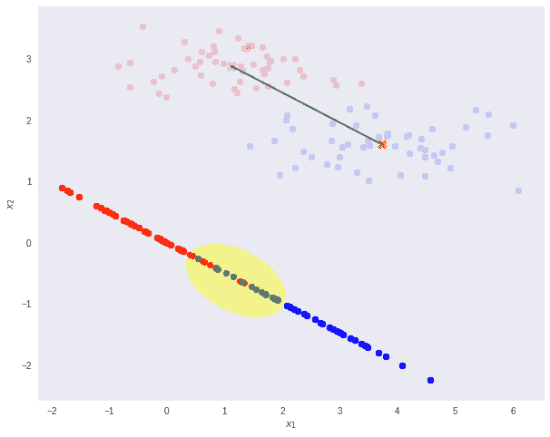****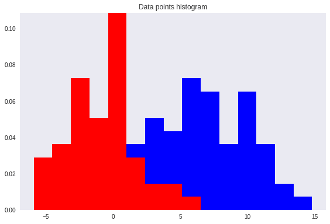**

**这就是费雪线性判别式发挥作用的地方。**

**Fisher 提出的想法是最大化一个函数，该函数将在投影的类均值之间给出一个大的分离，同时在每个类内给出一个小的方差，从而最小化类重叠。**

**换句话说，FLD 选择了最大化类别分离的投影。为此，它最大化类间方差与类内方差之比。**

**简而言之，为了将数据投影到一个更小的维度并避免类重叠，FLD 维护了两个属性。**

*   **数据集类之间的巨大差异。**
*   **每个数据集类中的微小差异。**

**请注意，较大的类间方差意味着预计的类平均值应尽可能远离。相反，小的类内方差具有保持投影数据点彼此更接近的效果。**

**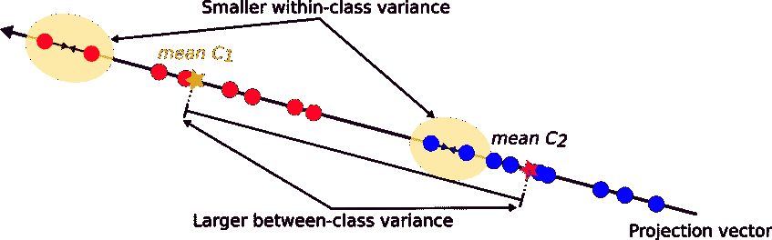**

**为了找到具有以下属性的投影，FLD 学习具有以下标准的权重向量**。****

****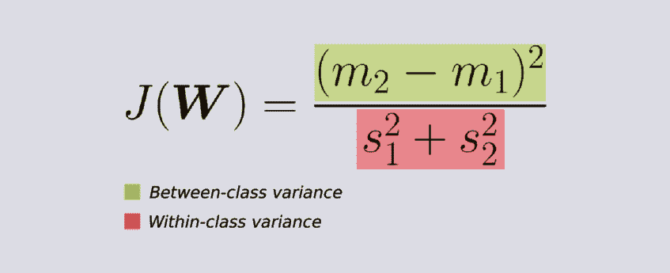****

****如果我们代入等式(1)和(2)给出的平均向量****【m1】****和 ****m2**** 以及方差**，我们得到等式(3)。如果我们对 ****W**** 求(3)的导数(经过一些简化)，就得到 ****W**** 的学习方程(方程 4)。******

**即****W******正比于 ****类内协方差**** 矩阵的倒数乘以类内均值的差。****

**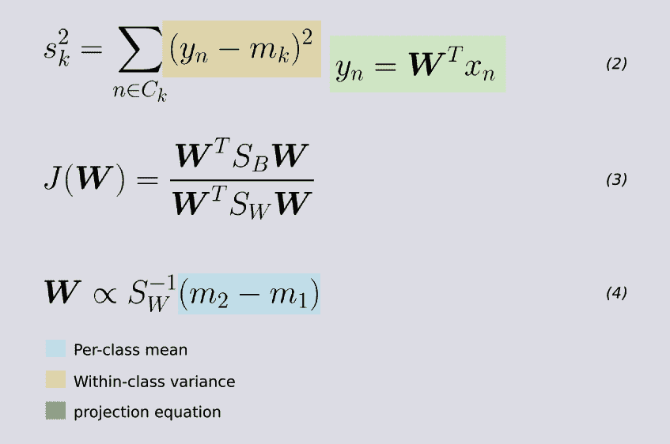**

**正如预期的那样，结果允许用简单的阈值进行完美的分类分离。**

**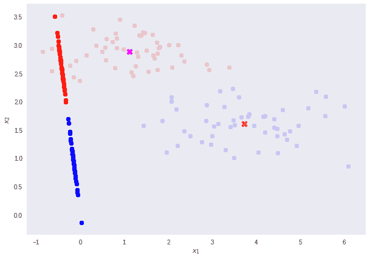****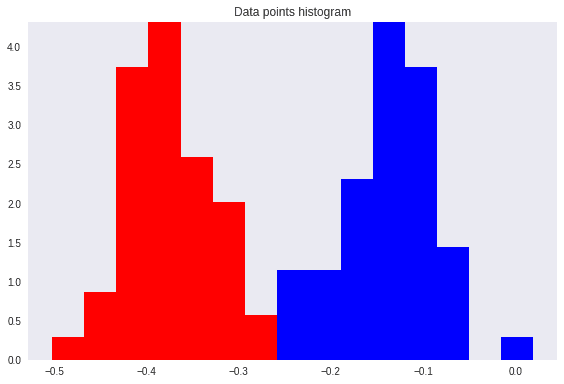**

## **多类 Fisher 线性判别式**

**我们可以将 FLD 推广到超过 ****K > 2**** 类的情况。这里我们需要 ****类内**** 和 ****类间**** 协方差矩阵的推广形式。**

**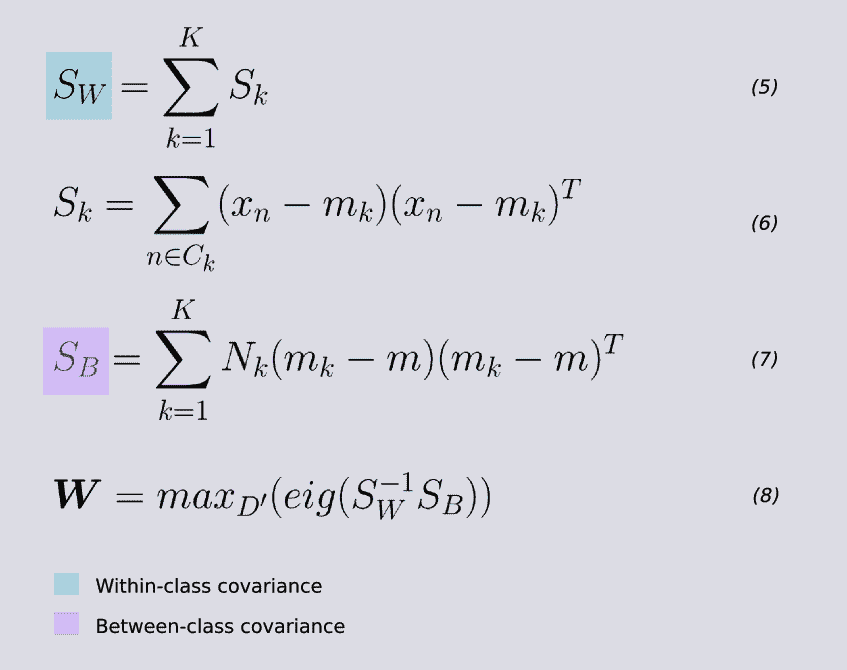**

**对于类内协方差矩阵 ****SW**** ，对于每个类，取集中输入值与其转置值之间的矩阵相乘之和。等式 5 和 6。**

**为了估计类间协方差 ****SB**** ，对于每个类 ****k=1，2，3，…，K**** ，取局部类均值****【MK】****和全局类均值**的 ****外积**，然后用类中记录的数量进行换算******

FLD 准则的最大化通过矩阵的特征分解来解决，即 ****SW**** 和 ****SB**** 的逆之间的乘法。因此，为了找到权重向量 ****W**** ，我们取对应于其最大特征值的****【D’****特征向量(等式 8)。

换句话说，如果我们想将我们的数据维数从 ****D=784**** 降低到 ****D'=2**** ，那么变换向量 ****W**** 就由对应于 ****D'=2**** 最大特征值的 2 个特征向量组成。这给出了 ****W = (N，D’)****的最终形状，其中 ****N**** 是输入记录的数量，****D’****是缩减的特征空间维度。

## 构建线性判别式

到目前为止，我们仅使用 Fisher 线性判别式作为降维方法。为了真正创建判别式，我们可以在 D 维输入向量 ****x**** 上为每个类别 ****K**** 建模一个 ****多元高斯分布**** 如下:

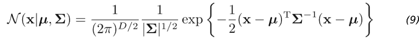

这里******μ******(平均值)是一个 D 维向量。****σ****(sigma)是一个 ****DxD**** 矩阵——协方差矩阵。而|****∑****|是协方差的行列式。行列式是协方差矩阵****σ****拉伸或收缩空间多少的度量。

在 Python 中，看起来是这样的。

```
# Returns the parameters of the Gaussian distributions
def gaussian(self, X):
  means = {}
  covariance = {}
  priors = {}  # p(Ck)
  for class_id, values in X.items():
    proj = np.dot(values, self.W)
    means[class_id] = np.mean(proj, axis=0)
    covariance[class_id] = np.cov(proj, rowvar=False)
    # estimate the priors using fractions of the training set data points in each of the classes.
    priors[class_id] = values.shape[0] / self.N
  return means, covariance, priors

# model a multi-variate Gaussian distribution for each class’ likelihood distribution P(x|Ck)
def gaussian_distribution(self, x, u, cov):
  scalar = (1\. / ((2 * np.pi) ** (x.shape[0] / 2.))) * (1 / np.sqrt(np.linalg.det(cov)))
  x_sub_u = np.subtract(x, u)
  return scalar * np.exp(-np.dot(np.dot(x_sub_u, inv(cov)), x_sub_u.T) / 2.)
```

gaussian_model.py

高斯分布的参数:******【μ】******和*****【σ】******使用投影的输入数据 ****计算每个类别的 k=1，2，3，…，K**** 。 我们可以使用每个类别中的训练集数据点的分数来推断先验 **P(Ck)** 类别概率(第 11 行)。*

*一旦我们有了高斯参数和先验，我们就可以分别为每个类 ****k=1，2，3，…，K****x**| Ck】**计算类条件密度 **。为此，我们首先将 D 维输入向量 ****x**** 投影到新的****D’****空间。记住****D’<D****。然后，我们对每个投影点评估等式 9。最后，我们可以利用等式 10 得到每一类的后验类概率**P(Ck |********x********)******K = 1，2，3，…，K**** 。***


等式 10 在下面的得分函数的第 8 行进行评估。

```
def score(self,X,y):
  proj = self.project(X)
  gaussian_likelihoods = []
  classes = sorted(list(self.g_means.keys()))
  for x in proj:
    row = []
    for c in classes:  # number of classes
      res = self.priors[c] * self.gaussian_distribution(x, self.g_means[c], self.g_covariance[c])  # Compute the posterios P(Ck|x) prob of a class k given a point x
      row.append(res)

    gaussian_likelihoods.append(row)

  gaussian_likelihoods = np.asarray(gaussian_likelihoods)
  # assign x to the class with the largest posterior probability
  predictions = np.argmax(gaussian_likelihoods, axis=1)
  return np.sum(predictions == y) / len(y)
```

score_function.py

然后，我们可以将输入向量 ****x**** 分配给具有最大后验概率的类别 ****k**** 。

## 对 MNIST 进行测试

使用 MNIST 作为玩具测试数据集。如果我们选择将原始输入维度 ****D=784**** 减少到 ****D'=2**** 我们就可以在测试数据上获得大约 **56%** 的准确度。然而，如果我们将投影的空间维度增加到****D’= 3****，我们将达到接近 **74%** 的精确度。这两个投影也使结果特征空间更容易可视化。

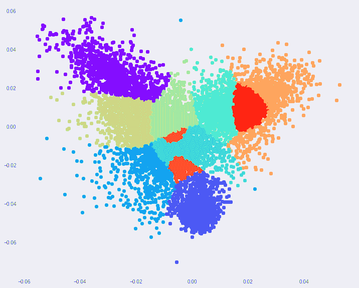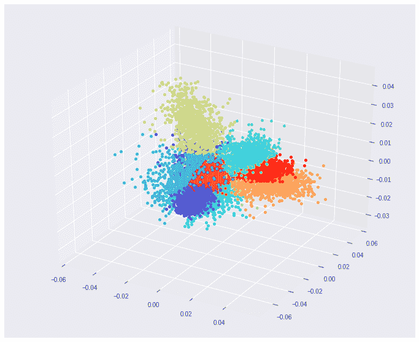

这篇文章的一些要点。

*   Fisher 的线性判别式，本质上是一种降维的技术，而不是判别式。
*   对于二元分类，我们可以找到一个最优的阈值 ****t**** ，并据此对数据进行分类。
*   对于多类数据，我们可以(1)使用高斯分布对类条件分布建模。(2)求先验类概率**P(Ck)**(3)用 ****贝叶斯**** 求后验类概率 **p(Ck|x)** 。
*   为了找到投影输入数据的最佳方向，Fisher 需要监督数据。
*   给定一个维度为****【D】****的数据集，我们最多可以将其向下投影到******D’****等于 ****D-1**** 维度。**

**本文基于[模式识别与机器学习](http://users.isr.ist.utl.pt/~wurmd/Livros/school/Bishop%20-%20Pattern%20Recognition%20And%20Machine%20Learning%20-%20Springer%20%202006.pdf)第 4.1 章的 ****。克里斯托弗·毕晓普的书。******

******感谢阅读。******