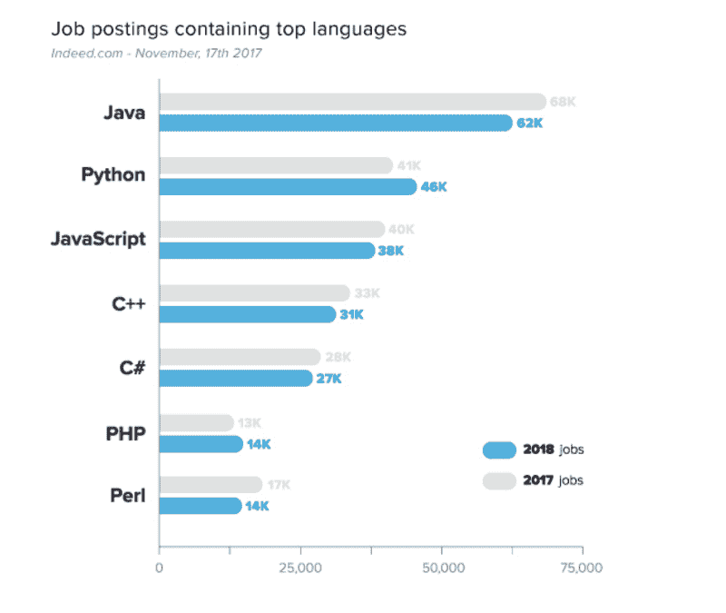

# 接下来应该学习哪种编程语言？

> 原文：<https://www.freecodecamp.org/news/which-programming-language-should-you-learn-next-487d077baa32/>

作者康斯坦丁

# **接下来应该学习哪种编程语言？**

无论你是开发专家还是初学者，学习一门新的编程语言总是一个好主意。

当然，没有一种语言是每个专业人员或有抱负的开发人员都必须学习的。你选择学习的下一门语言将取决于你目前的技能水平和你的整体职业抱负。

不要担心:在本文中，我将对您的选择进行分类，以帮助您确定下一步应该使用哪种编程语言。我将推荐三种语言(一种适用于初学者，一种适用于中级开发人员，一种适用于专家)，以及几种您可能喜欢的替代语言，这取决于您的偏好。

但首先，让我们看看当前的趋势，看看哪些语言越来越受欢迎/越来越不受欢迎。

### 编程语言的趋势

下图显示了与 2017 年相比，2018 年最受欢迎的编程语言。

Source: Data from Indeed.com analyzed by [Coding Dojo](https://www.codingdojo.com/blog/7-most-in-demand-programming-languages-of-2018/).

尽管 Java 已经有 20 多年的历史，但它仍然是最受欢迎的编程语言——尽管自 2017 年以来，它的受欢迎程度有所下降。很长一段时间以来，对 Java 的需求一直很高，可能是因为它可以在任何硬件或操作系统上运行。例如，所有 Android 应用程序都基于 Java，大多数财富 500 强公司都使用它进行后端开发。

广泛用于 web 开发的 Python 在总体受欢迎程度上正迅速赶上 Java。这种语言被广泛用于科学计算、数据挖掘和机器学习——这就是需求增长的来源。

JavaScript 仍然非常流行，这并不奇怪，因为大多数开发人员和几乎所有具有动态逻辑的网站都使用它。此外，React 和 AngularJS 等前端框架正被用于物联网和移动设备集成，因此我们不太可能很快看到 JavaScript 从图表中消失。

C++和 C#，用于视频游戏开发和系统/应用软件(C#用于微软的。NET 平台)，在 2018 年有所下降，但仍保持强劲。PHP 作为一种添加 HTML 或 CSS 不能处理的 web 功能的方法，以及它在 MySQL 数据库中的使用，越来越受欢迎。最后，Perl 作为连接不同软件组件的“粘合语言”,在系统和网络管理员中广受欢迎，因此仍然是顶级语言。

关于上面的图表需要注意的一点是，顶级语言都是基础的。这些语言(下面将进一步讨论)对于初学者来说非常重要。但是专家可能对学习高级语言更感兴趣。

### 基础编程语言与高级编程语言

最受欢迎的语言有时被称为基础编程语言。从早期开始，它们就被用来构建现代计算和网络的基础。

然而，也有很多很多小众语言的开发者社区在不断增长，比如 Haskell(用于 AI 和机器学习)，Scala(Java 的替代品)，ML(一种函数式语言)，Scheme(用于 AI 和基于 web 的编程)，以及数百种其他语言。

这些高级语言对初学者并不友好。然而，如果你计划成为某个特定领域的专家，比如人工智能和机器学习，了解一门像 Haskell 这样的语言可能是一项无价的技能。

一旦你学习了一门或多门基础语言，你应该能够学习任何新的或更高级的编程语言。记住，学习一门新语言几乎从来都不是一个坏主意，因为它将帮助你学会用不同的方式思考问题。

考虑到这一点，下面是不同技能水平(初级、中级和高级)的开发人员必须学习的三种语言，以及一些替代语言。

### 面向初学者的编码语言

对于你的第一门编程语言来说，JavaScript 是个不错的选择。如上所述，JavaScript 几乎无处不在。您可以使用它来开发各种应用程序。你可能每天使用的许多网站[都依赖于 JavaScript](https://generalassemb.ly/blog/learning-to-code-why-you-should-learn-javascript-first/) ，包括 Gmail、脸书、Twitter、Instagram 和 Spotify。

JavaScript 用于 web 应用的前端开发(使用 AngularJS、Ember.js 和 React 等框架)和后端开发(使用 Node.js 框架)。学习这些框架比单独学习 JavaScript 花费更多的时间，但将有助于提高你的就业能力(和薪水)。

也许最好的一点是，JavaScript 实际上是内置在你的浏览器中的，所以你不需要安装任何东西就可以在其中开始编程。这使得它变得非常容易接近。很有可能你会发现基础知识很容易学，但是不要担心，因为有大量的高级概念会让你在很长一段时间内忙于学习。

如果你是一个初学者，你想成为一个专业的开发人员，学习 JavaScript 是一个好主意。也就是说，任何基础语言都是不错的选择。理想情况下，在你的职业生涯中，你应该学习一门以上的基础语言。

#### **初学者的选择**

**Python** 相对来说比较容易学，也比较好玩，很少有严格的语法规则。事实上，它读起来像英语，所以即使是一个纯粹的初学者也能理解代码。Python 被用来建立 [Instagram、YouTube 和 Spotify，](https://makeawebsitehub.com/which-programming-language/)所以它可能是你进入一家顶级公司的入场券。

和 Python 一样， **Ruby** 也是初学者很容易学会的。你不需要记住很多命令或语法规则就可以使用它。初创公司越来越多地使用 Ruby 的全栈框架 Ruby on Rails——它被用于建立像 [Airbnb](https://skillcrush.com/2015/02/02/37-rails-sites/) 、 [Groupon](http://learn.onemonth.com/10-reasons-beginners-should-learn-ruby-on-rails/) 等网站。

### 中级程序员的下一步

一旦你有了一些编程经验，花时间学习 **C** (以及 C#和 C++)是一个好主意。

C 比 JavaScript 更难学，但它是一项有价值的技能，因为大多数编程语言实际上都是用 C 实现的，这是因为 C 是一种“机器级”语言。因此，学习它将教会你计算机是如何工作的，并且实际上会使将来学习新语言变得更容易。

学习 C 语言编程就像在成为医生之前了解基础解剖学一样。如果你想成为一名开发专家，你需要了解计算机和软件是如何协同工作的。学习 C 语言是一次有启发性的经历，它会有教你如何更有效地编码的有益副作用。

C#被广泛用于企业开发。NET 平台，但它也是 Unity 3D 的主要语言，Unity 3D 是一个流行的独立游戏和 VR 游戏引擎。C++通常用于性能密集型桌面应用程序(包括游戏)。它也被微软、甲骨文和 Adobe 等公司用来创建许多大型系统。

#### **中级编码员的替代方案**

Java 是另一个不错的选择，因为它可以在任何设备上编写，可以跨平台使用，这使它成为一种非常通用的语言(记住，它仍然是今天[最受欢迎的](https://www.techrepublic.com/article/the-10-most-in-demand-programming-languages-of-2018/)语言)。

它通常用于创建应用程序，所以如果你的目标是开发移动应用程序，一定要学习 Java。

### 专业开发人员面临的新挑战

如果你已经掌握了基础编程语言，如 Javascript、C#、C++、Java 和 Python，你就准备好迎接新的挑战了。在我看来，那个挑战应该是**生锈**。

根据一项[堆栈溢出调查](https://insights.stackoverflow.com/survey/2018/#most-loved-dreaded-and-wanted)，Rust 连续第三年被评为 2018 年开发者最喜欢的编程语言。这是一种相对较新的语言，由 Mozilla 在 2010 年创建，并在不断改进。

就性能和用途而言，Rust 是一种可与 C 语言媲美的编译语言。然而，与 C 不同，Rust 是内存安全的:悬空指针、缓冲区溢出或其他类型的内存错误不会出现在用 Rust 编写的代码中。在 Rust 中不可能出现这种错误，因为任何错误都是在编译过程中被发现的——在代码被允许运行之前。

这个特性使得 Rust 对于初学者来说很难学，但是有经验的程序员会欣赏其内在的性能改进。自诞生以来，它的受欢迎程度一直在稳步增长，在未来几年里，Rust 很有可能会有很高的需求。根据栈溢出，它是 2017 年[第二高的](https://insights.stackoverflow.com/survey/2017#most-loved-dreaded-and-wanted)付费编码技能，2018 年进入[前 6](https://insights.stackoverflow.com/survey/2018/#top-paying-technologies) 。

#### **专家的替代方案**

如果你已经是一名经验丰富的 Java 程序员，你要学习的下一门语言可能是 **Scala** (可伸缩语言的简称)。

Scala 是对 Java 进行改进的众多尝试之一，可以用来直接替代 Java——事实上，它是为在 Java 虚拟机上运行而编译的。这是一门复杂的语言，但最终非常值得:在 Stack Overflow 的 2017 年[和 2018 年](https://insights.stackoverflow.com/survey/2017#technology-top-paying-technologies-by-region)[调查中，Scala 被评为薪酬最高的技术。](https://insights.stackoverflow.com/survey/2018/#top-paying-technologies)

像 Rust 一样，Scala 在过去的 5 年里越来越受欢迎。像 LinkedIn 和 Twitter 这样的大公司已经在他们的代码库中使用 Scala。

### 结论

最终，你决定下一步学习的编程语言应该取决于你当前的技能水平和你的职业兴趣/抱负。

初学者应该从简单易学的语言开始，比如 JavaScript、Python 或 Ruby，以便熟悉并开始构建应用程序。

有更多经验的程序员会很聪明地掌握一门基础和通用的语言，如 C 或 Java，以更好地理解计算机和软件是如何交互的。这也将教会你如何更有效地编码。

最后，专业程序员可能想学习 Rust 或 Scala 之类的语言，这些语言是对基础语言(如 C 和 Java)的改进。这两种高级语言已经在有经验的开发人员中非常流行，并且随着时间的推移和公司决定构建更新、更有效的应用程序，这两种语言可能会变得更加重要。

#### 寻找一种新的方法来测试您的编程技能？

对自己的现状有一个客观的认识是提高的关键。为了对你的编程技能进行自由公正的评估，只需 [**提交你的代码**](https://indorse.io/claims/new?utm_source=Medium&utm_term=Claim&utm_content=Which_Programming_Language_Next_Claim) 。Indorse 的同行评审评估可以帮助您提高技术技能，让您更上一层楼！

[Python](https://indorse.io/claims/new?skill=python&utm_source=Medium&utm_term=Python&utm_content=Which_Programming_Language_Next_Python)|[c#](https://indorse.io/claims/new?skill=c&utm_source=Medium&utm_term=C&utm_content=Which_Programming_Language_Next_C)|[Java](https://indorse.io/claims/new?skill=java&utm_source=Medium&utm_term=Java&utm_content=Which_Programming_Language_Next_Java)|[PHP](https://indorse.io/claims/new?skill=php&utm_source=Medium&utm_term=PHP&utm_content=Which_Programming_Language_Next_PHP)|[JavaScript](https://indorse.io/claims/new?skill=javascript&utm_source=Medium&utm_term=JS&utm_content=Which_Programming_Language_Next_JS)|[Ruby](https://indorse.io/claims/new?skill=ruby&utm_source=Medium&utm_term=Ruby&utm_content=Which_Programming_Language_Next_Ruby)

