# React 手册——初学者学习 React

> 原文：<https://www.freecodecamp.org/news/the-react-handbook-b71c27b0a795/>

React 手册遵循 80/20 法则:用 20%的时间学习一个主题的 80%。

我发现这种方法给出了一个全面的概述。这本书并不试图涵盖与 React 相关的所有内容，但是它应该为您提供基本的构建模块，让您能够成为一名优秀的 React 开发人员。如果你认为某些特定的主题应该被包括，告诉我。你可以在推特上找到我。

希望这本书的内容能帮你实现你想要的:**学习 React** 的基础知识。

你可以在[reacthandbook.com](https://reacthandbook.com)获得 PDF、ePub 和 Mobi 格式的电子书

### 图书索引

#### 目录

[React 简介](https://www.freecodecamp.org/news/the-react-handbook-b71c27b0a795/#an-introduction-to-the-react-view-library)
[如何使用 create-react-app](https://www.freecodecamp.org/news/the-react-handbook-b71c27b0a795/#how-to-use-create-react-app)

****第一节**** :使用 REACT 需要知道的现代 JAVASCRIPT 核心概念

*   [变量](https://www.freecodecamp.org/news/the-react-handbook-b71c27b0a795/#variables)
*   [箭头功能](https://www.freecodecamp.org/news/the-react-handbook-b71c27b0a795/#arrow-functions)
*   [休息并展开](https://www.freecodecamp.org/news/the-react-handbook-b71c27b0a795/#rest-and-spread)
*   [对象和数组析构](https://www.freecodecamp.org/news/the-react-handbook-b71c27b0a795/#object-and-array-destructuring)
*   [模板文字](https://www.freecodecamp.org/news/the-react-handbook-b71c27b0a795/#template-literals)
*   [类](https://www.freecodecamp.org/news/the-react-handbook-b71c27b0a795/#classes)
*   [回调](https://www.freecodecamp.org/news/the-react-handbook-b71c27b0a795/#callbacks)
*   [承诺](https://www.freecodecamp.org/news/the-react-handbook-b71c27b0a795/#promises)
*   [异步/等待](https://www.freecodecamp.org/news/the-react-handbook-b71c27b0a795/#async-await)
*   [ES 模块](https://www.freecodecamp.org/news/the-react-handbook-b71c27b0a795/#es-modules)

****第二节**** :反应概念

*   [单页应用](https://www.freecodecamp.org/news/the-react-handbook-b71c27b0a795/#single-page-applications)
*   [声明式](https://www.freecodecamp.org/news/the-react-handbook-b71c27b0a795/#declarative)
*   [不变性](https://www.freecodecamp.org/news/the-react-handbook-b71c27b0a795/#immutability)
*   [纯度](https://www.freecodecamp.org/news/the-react-handbook-b71c27b0a795/#purity)
*   [构图](https://www.freecodecamp.org/news/the-react-handbook-b71c27b0a795/#composition)
*   [虚拟 DOM](https://www.freecodecamp.org/news/the-react-handbook-b71c27b0a795/#the-virtual-dom)
*   [单向数据流](https://www.freecodecamp.org/news/the-react-handbook-b71c27b0a795/#unidirectional-data-flow)

****第三节**** :深度反应

*   [JSX](https://www.freecodecamp.org/news/the-react-handbook-b71c27b0a795/#jsx)
*   [组件](https://www.freecodecamp.org/news/the-react-handbook-b71c27b0a795/#components)
*   [状态](https://www.freecodecamp.org/news/the-react-handbook-b71c27b0a795/#state)
*   [道具](https://www.freecodecamp.org/news/the-react-handbook-b71c27b0a795/#props)
*   [表示与容器组件](https://www.freecodecamp.org/news/the-react-handbook-b71c27b0a795/#presentational-vs-container-components)
*   [状态 vs 道具](https://www.freecodecamp.org/news/the-react-handbook-b71c27b0a795/#state-vs-props)
*   [属性类型](https://www.freecodecamp.org/news/the-react-handbook-b71c27b0a795/#proptypes)
*   [反应片段](https://www.freecodecamp.org/news/the-react-handbook-b71c27b0a795/#react-fragment)
*   [事件](https://www.freecodecamp.org/news/the-react-handbook-b71c27b0a795/#events)
*   [生命周期事件](https://www.freecodecamp.org/news/the-react-handbook-b71c27b0a795/#lifecycle-events)
*   [反应中的形式](https://www.freecodecamp.org/news/the-react-handbook-b71c27b0a795/#forms-in-react)
*   [引用一个 DOM 元素](https://www.freecodecamp.org/news/the-react-handbook-b71c27b0a795/#reference-a-dom-element)
*   [服务器端渲染](https://www.freecodecamp.org/news/the-react-handbook-b71c27b0a795/#server-side-rendering)
*   [上下文 API](https://www.freecodecamp.org/news/the-react-handbook-b71c27b0a795/#the-context-api)
*   [高阶组件](https://www.freecodecamp.org/news/the-react-handbook-b71c27b0a795/#higher-order-components)
*   [渲染道具](https://www.freecodecamp.org/news/the-react-handbook-b71c27b0a795/#render-props)
*   [挂钩](https://www.freecodecamp.org/news/the-react-handbook-b71c27b0a795/#hooks)
*   [代码拆分](https://www.freecodecamp.org/news/the-react-handbook-b71c27b0a795/#code-splitting)

****第四节**** :实战范例

*   [建立一个简单的计数器](https://www.freecodecamp.org/news/the-react-handbook-b71c27b0a795/#build-a-simple-counter)
*   [通过 API 获取并显示 GitHub 用户信息](https://www.freecodecamp.org/news/the-react-handbook-b71c27b0a795/#fetch-and-display-github-users-information-via-api)

****第五节**** :造型

*   [CSS in React](https://www.freecodecamp.org/news/the-react-handbook-b71c27b0a795/#css-in-react)
*   [SASS in React](https://www.freecodecamp.org/news/the-react-handbook-b71c27b0a795/#sass-in-react)
*   [样式组件](https://www.freecodecamp.org/news/the-react-handbook-b71c27b0a795/#styled-components)

****第六节**** :工装

*   [巴别塔](https://www.freecodecamp.org/news/the-react-handbook-b71c27b0a795/#babel)
*   [网络包](https://www.freecodecamp.org/news/the-react-handbook-b71c27b0a795/#webpack)

****第七节**** :测试

*   [是](https://www.freecodecamp.org/news/the-react-handbook-b71c27b0a795/#jest)
*   [测试反应成分](https://www.freecodecamp.org/news/the-react-handbook-b71c27b0a795/#testing-react-components)

****第八节****:REACT 生态系统

*   [反应路由器](https://www.freecodecamp.org/news/the-react-handbook-b71c27b0a795/#react-router)
*   [还原](https://www.freecodecamp.org/news/the-react-handbook-b71c27b0a795/#redux)
*   [Next.js](https://www.freecodecamp.org/news/the-react-handbook-b71c27b0a795/#next-js)
*   盖茨比

[结束](https://www.freecodecamp.org/news/the-react-handbook-b71c27b0a795/#wrapping-up)

### React 视图库简介

#### 什么是反应？

React 是一个 JavaScript 库，旨在简化可视化界面的开发。

它由脸书开发，于 2013 年向全世界发布，驱动着一些最广泛使用的应用程序，为脸书和 Instagram 以及无数其他应用程序提供动力。

它的主要目标是通过将 UI 划分为组件的集合，使得在任何时间点推断界面及其状态变得容易。

#### React 为什么这么受欢迎？

React 已经席卷了前端 web 开发世界。为什么？

#### 没有其他选择复杂

在 React 宣布的时候，Ember.js 和 Angular 1.x 是作为框架的主要选择。这两者都在代码上强加了如此多的约定，以至于移植现有的应用程序一点也不方便。

React 选择了非常容易地集成到现有项目中，因为这是他们在脸书必须做的，以便将其引入现有的代码库。此外，这两个框架带来了太多的东西，而 React 只选择实现视图层，而不是完整的 MVC 堆栈。

#### 完美的时机

当时，谷歌宣布了 Angular 2.x，以及向后不兼容和它将带来的重大变化。从 Angular 1 迁移到 Angular 2 就像迁移到一个不同的框架，所以这一点，加上 React 承诺的执行速度的提高，使它成为开发人员渴望尝试的事情。

#### 由脸书支持

当然，如果项目成功，得到脸书的支持将有利于项目。

脸书目前对 React 有浓厚的兴趣，看到了它开源的价值，这对所有在自己项目中使用它的开发者来说都是一个巨大的优势。

#### React 简单易学吗？

尽管我说过 React 比其他框架简单，但是深入 React 仍然很复杂，这主要是因为可以与 React 集成的配套技术，比如 Redux 和 GraphQL。

React 本身有一个非常小的 API，你基本上需要理解 4 个概念来开始:

*   成分
*   JSX
*   状态
*   小道具

所有这些(以及更多)在本手册中都有解释。

#### 如何在开发计算机上安装 React

你如何安装 React？

React 是一个库，所以说 *install* 可能听起来有点奇怪。也许*设置*是一个更好的词，但你得到了概念。

有多种方法可以设置 React，以便在您的应用程序或网站上使用。

#### 直接在网页中加载 React

最简单的方法是将 React JavaScript 文件直接添加到页面中。当 React 应用程序将与单个页面上的元素交互，而不是实际控制整个导航方面时，这是最好的。

在本例中，您在`body`标签的末尾添加了两个脚本标签:

```
<html>
  ...
  <body>
    ...
    <script
      src="https://cdnjs.cloudflare.com/ajax/libs/react/16.8.3/umd/react.development.js"
      crossorigin
    ></script>
    <script
      src="https://cdnjs.cloudflare.com/ajax/libs/react-dom/16.8.3/umd/react-dom.production.min.js"
      crossorigin
    ></script>
  </body>
</html>
```

> *请将版本号更改为 React 可用的最新版本。*

这里我们加载了 React 和 React DOM。为什么是两个图书馆？因为 React 是 100%独立于浏览器的，可以在浏览器之外使用(比如在带有 React Native 的移动设备上)。因此需要 React DOM 来为浏览器添加包装器。

在这些标签之后，您可以加载使用 React 的 JavaScript 文件，甚至在一个`script`标签中内嵌 JavaScript:

```
<script src="app.js"></script>

<!-- or -->

<script>
  //my app
</script>
```

要使用 JSX，你需要一个额外的步骤:加载巴别塔

```
<script src="https://unpkg.com/babel-standalone@6/babel.min.js"></script>
```

并用特殊的`text/babel` MIME 类型加载您的脚本:

```
<script src="app.js" type="text/babel"><;/script>
```

现在，您可以在 app.js 文件中添加 JSX:

```
const Button = () => {
  return <button>Click me!</button>
}

ReactDOM.render(<Button />, document.getElementById('root'))
```

看看这个简单的故障例子:[https://glitch.com/edit/#!/react-example-inline-jsx？path=script.js](https://glitch.com/edit/#!/react-example-inline-jsx?path=script.js)

以这种方式从脚本标签开始有利于构建原型，并且能够快速启动，而不必设置复杂的工作流。

### 如何使用创建-反应-应用程序

`create-react-app`是一个旨在让你快速使用 React 的项目，任何需要超越单个页面的 React 应用程序都会发现`create-react-app`满足了这一需求。

从使用`[npx](https://flaviocopes.com/npx/)`开始，这是一种下载和执行 Node.js 命令的简单方法，无需安装它们。`npx`带有`npm`(从版本 5.2 开始)，如果你还没有安装 npm，现在就从[https://nodejs.org](https://nodejs.org/)安装(npm 随 Node 一起安装)。

如果您不确定您使用的是哪个版本的 npm，运行`npm -v`来检查您是否需要更新。

> *提示:查看我的 [OSX 终端教程](https://flaviocopes.com/macos-terminal/)如果你不熟悉使用终端，它也适用于 Linux 很抱歉，目前我没有 Windows 的教程，但是谷歌是你的朋友。*

当你运行`npx create-react-app <app-name>`，`npx`将会*下载*最新的`create-react-app`版本，运行它，然后从你的系统中移除它。这很好，因为您的系统上永远不会有过时的版本，并且每次运行它时，您都可以获得最新最棒的代码。

那么让我们开始吧:

```
npx create-react-app todolist
```

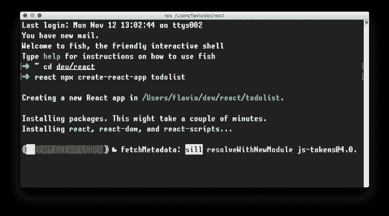

这是它完成运行的时间:

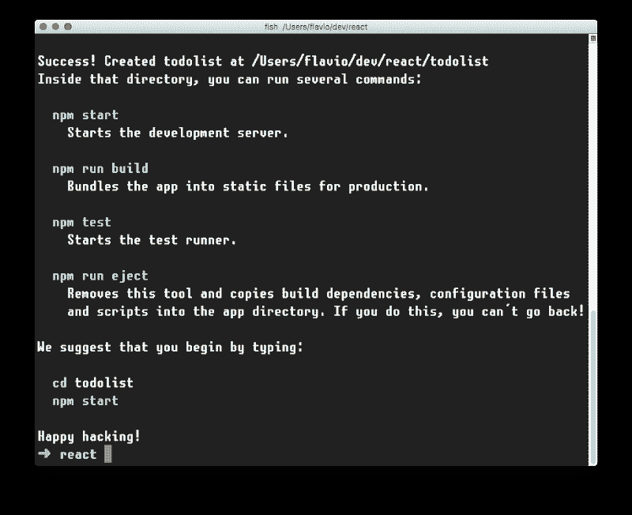

`create-react-app`在您指定的文件夹中创建了一个文件结构(本例中为`todolist`，并初始化了一个 [Git](https://flaviocopes.com/git/) 存储库。

它还在`package.json`文件中添加了一些命令，所以你可以通过进入文件夹并运行`npm start`来立即启动应用程序。

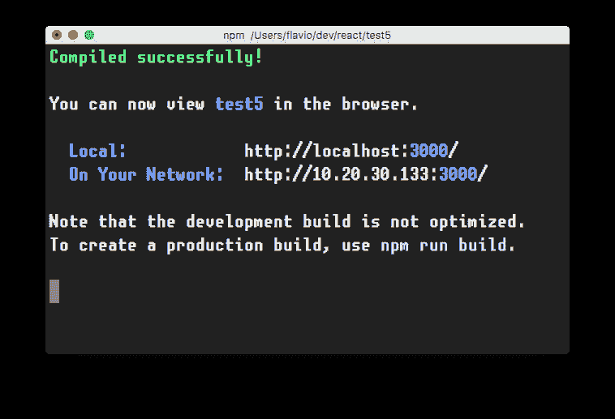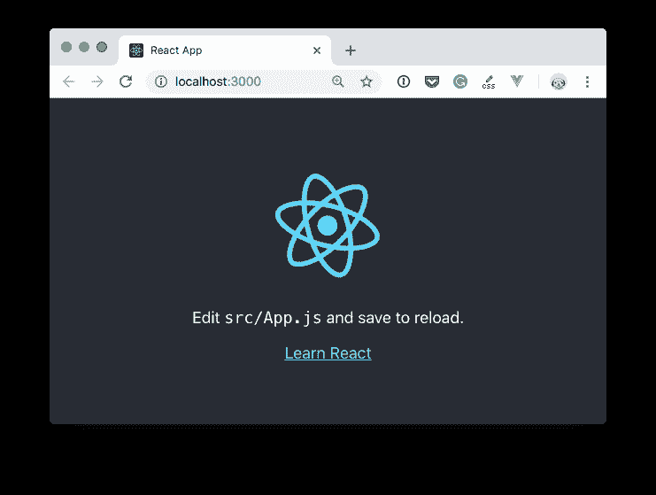

除了`npm start`，`create-react-app`增加了其他几个命令:

*   `npm run build`:在`build`文件夹中构建 React 应用程序文件，准备部署到服务器上
*   `npm test`:使用 [Jest](https://flaviocopes.com/jest/) 运行测试套件
*   `npm eject`:从`create-react-app`弹出

放弃是决定`create-react-app`已经为你做了足够多的事情，但是你想做的比它允许的更多。

由于`create-react-app`是一组公分母约定和有限数量的选项，很可能在某个时候您的需求会要求一些超出`create-react-app`能力的独特东西。

当你弹出时，你失去了自动更新的能力，但是你在 [Babel](https://flaviocopes.com/babel/) 和 [Webpack](https://flaviocopes.com/webpack/) 配置中获得了更多的灵活性。

当你弹出动作是不可逆的。您将在应用程序目录中获得两个新文件夹，`config`和`scripts`。这些包含了配置，现在您可以开始编辑它们了。

> *如果你已经安装了一个使用较旧版本 React 的 React app，首先通过在你的 app 中添加`console.log(React.version)`来检查版本，然后你可以通过运行`yarn add react@16.7`来更新，yarn 会提示你更新(选择可用的最新版本)。对`yarn add react-dom@16.7`重复上述步骤(将“16.7”改为目前 React 的最新版本)*

#### CodeSandbox

拥有`create-react-app`结构的一个简单方法，不需要安装它，就是去[https://codesandbox.io/s](https://codesandbox.io/s)然后选择“反应”。


CodeSandbox 是一种启动 React 项目的好方法，无需在本地安装。

#### 密码笔

另一个很棒的解决方案是 [Codepen](https://codepen.io/) 。

你可以使用这个 Codepen starter 项目，它已经预配置了 React，支持钩子:[https://codepen.io/flaviocopes/pen/VqeaxB](https://codepen.io/flaviocopes/pen/VqeaxB)

codepen“pens”非常适合包含一个 JavaScript 文件的快速项目，而“projects”非常适合包含多个文件的项目，就像我们在构建 React 应用程序时最常用的那些文件。

需要注意的一点是，在 Codepen 中，由于其内部的工作方式，您不使用常规的 ES 模块`import`语法，而是导入例如`useState`，您使用

```
const { useState } = React
```

而不是

```
import { useState } from 'react'
```

### 第 1 部分:使用 REACT 需要知道的现代 JAVASCRIPT 核心概念

#### 在开始学习 React 之前，先弄清楚你是否需要学习一些东西

如果你愿意学习 React，你首先需要掌握一些东西。您必须熟悉一些先决技术，尤其是与您将在 React 中反复使用的一些最新的 JavaScript 特性相关的技术。

有时人们认为 React 提供了一个特殊的特性，但实际上它只是现代的 JavaScript 语法。

立即成为这些主题的专家是没有意义的，但是你越深入 React，你就越需要掌握它们。

我将列举一些事情来帮助你快速掌握。

### 变量

变量是赋给标识符的文字，因此您可以在程序的后面引用和使用它。

JavaScript 中的变量没有附加任何类型。一旦将特定的文字类型分配给变量，以后就可以将该变量重新分配给任何其他类型，而不会出现类型错误或任何问题。

这就是 JavaScript 有时被称为“非类型化”的原因。

变量必须在使用前声明。有三种方法可以做到这一点，使用`var`、`let`或`const`，这三种方法的不同之处在于你稍后如何与变量交互。

#### 使用`var`

在 ES2015 之前，`var`是唯一可用于定义变量的构造。

```
var a = 0
```

如果你忘记添加`var`，你将会给一个未声明的变量赋值，结果可能会不同。

在现代环境中，如果启用了严格模式，您将会得到一个错误。在旧的环境中(或者禁用了严格模式)，这将简单地初始化变量并将其赋给全局对象。

如果您在声明变量时没有初始化它，它将拥有`undefined`值，直到您给它赋值。

```
var a //typeof a === 'undefined'
```

您可以多次重新声明该变量，并覆盖它:

```
var a = 1
var a = 2
```

您也可以在同一语句中一次声明多个变量:

```
var a = 1, b = 2jsx
```

**范围**是变量可见的代码部分。

在任何函数之外用`var`初始化的变量被赋给全局对象，具有全局作用域并且随处可见。在函数内部用`var`初始化的变量被赋给那个函数，它是局部的，并且只在函数内部可见，就像函数参数一样。

在函数中定义的任何与全局变量同名的变量优先于全局变量，并隐藏它。

理解块(由一对花括号标识)并不定义新的作用域，这一点很重要。只有在创建函数时才会创建新的作用域，因为`var`没有块作用域，只有函数作用域。

在函数内部，函数中定义的任何变量在整个函数代码中都是可见的，即使变量是在函数的末尾声明的，它仍然可以在函数的开头被引用，因为 JavaScript 在执行代码之前实际上*将所有变量移动到了*之上(这被称为**提升**)。为了避免混淆，总是在函数的开头声明变量。

#### 使用`let`

`let`是 ES2015 中引入的新功能，本质上是`var`的块范围版本。它的范围仅限于定义它的块、语句或表达式，以及所有包含的内部块。

现代 JavaScript 开发人员可能会选择只使用`let`，而完全放弃使用`var`。

> *如果`let`似乎是一个晦涩的术语，只要把`let color = 'red'`读作*让颜色变成红色*就更有意义了*

在任何函数之外定义`let`——与`var`相反——不会创建全局变量。

#### 使用`const`

用`var`或`let`声明的变量可以在程序的后面被改变，并被重新分配。一旦`const`被初始化，它的值就不能再被改变，也不能被重新赋值。

```
const a = 'test'
```

我们不能给`a`常量赋予不同的文字。然而，如果一个对象提供了改变其内容的方法，我们可以改变`a`。

`const`不提供不变性，只是确保引用不能被改变。

`const`有阻塞范围，同`let`。

现代 JavaScript 开发人员可能会选择总是使用`const`来表示在程序中不需要重新分配的变量。

为什么？因为我们应该总是使用最简单的构造来避免以后出错。

### 箭头功能

箭头函数是在 ES6 / ECMAScript 2015 中引入的，自引入以来，它们永远改变了 JavaScript 代码的外观(和工作方式)。

在我看来，这种变化是如此受欢迎，以至于你现在很少在现代代码库中看到`function`关键字的用法。

从视觉上看，这是一个简单而受欢迎的变化，它允许您用更短的语法编写函数，来自:

```
const myFunction = function() {
  //...
}
```

到

```
const myFunction = () => {
  //...
}
```

如果函数体只包含一条语句，可以省略括号，将所有语句写在一行中:

```
const myFunction = () => doSomething()
```

参数在括号中传递:

```
const myFunction = (param1, param2) => doSomething(param1, param2)
```

如果有一个(且只有一个)参数，可以完全省略括号:

```
const myFunction = param => doSomething(param)
```

由于这个简短的语法，箭头函数**鼓励使用小函数**。

### 隐性回报

箭头函数允许您隐式返回:返回的值不需要使用`return`关键字。

当函数体中有一行语句时，它就工作了:

```
const myFunction = () => 'test'

myFunction() //'test'
```

另一个例子，当返回一个对象时，记得用圆括号将花括号括起来，以避免它被认为是包装函数体括号:

```
const myFunction = () => ({ value: 'test' })

myFunction() //{value: 'test'}
```

### 这在箭头函数中是如何工作的

`this`是一个很难理解的概念，因为它根据上下文变化很大，也根据 JavaScript 的模式而变化(*严格模式*与否)。

澄清这个概念很重要，因为与常规函数相比，箭头函数的行为非常不同。

当定义为一个对象的方法时，在常规函数中`this`指的是这个对象，所以你可以做:

```
const car = {
  model: 'Fiesta',
  manufacturer: 'Ford',
  fullName: function() {
    return `${this.manufacturer} ${this.model}`
  }
}
```

调用`car.fullName()`会返回`"Ford Fiesta"`。

带有箭头函数的`this`作用域是从执行上下文中继承的**。一个箭头函数根本没有绑定`this`，所以它的值会在调用栈中查找，所以在这段代码中`car.fullName()`不会工作，会返回字符串`"undefined undefined"`:**

```
const car = {
  model: 'Fiesta',
  manufacturer: 'Ford',
  fullName: () => {
    return `${this.manufacturer} ${this.model}`
  }
}
```

因此，箭头函数不适合作为对象方法。

箭头函数也不能用作构造函数，当实例化一个对象时会引发一个`TypeError`。

这就是应该使用常规函数的地方，**当不需要动态上下文时**。

这也是处理事件时的问题。DOM 事件侦听器将`this`设置为目标元素，如果您在事件处理程序中依赖于`this`，那么一个常规函数是必要的:

```
const link = document.querySelector('#link')
link.addEventListener('click', () => {
  // this === window
})

const link = document.querySelector('#link')
link.addEventListener('click', function() {
  // this === link
})
```

### 休息和传播

您可以使用扩展操作符`...`扩展一个数组、一个对象或一个字符串。

让我们从一个数组例子开始。考虑到

```
const a = [1, 2, 3]
```

您可以使用创建新的数组

```
const b = [...a, 4, 5, 6]
```

您还可以使用创建数组的副本

```
const c = [...a]
```

这也适用于对象。使用以下内容克隆对象:

```
const newObj = { ...oldObj }
```

使用字符串，spread 运算符创建一个数组，其中包含字符串中的每个字符:

```
const hey = 'hey'
const arrayized = [...hey] // ['h', 'e', 'y']
```

这个运算符有一些非常有用的应用。最重要的一点是能够以非常简单的方式使用数组作为函数参数:

```
const f = (foo, bar) => {}
const a = [1, 2]
f(...a)
```

(在过去，你可以使用`f.apply(null, a)`来做这件事，但是那样不太好，可读性也不好)

当使用**数组析构**时， **rest 元素**很有用:

```
const numbers = [1, 2, 3, 4, 5]
[first, second, ...others] = numbers
```

和**展开元素**:

```
const numbers = [1, 2, 3, 4, 5]
const sum = (a, b, c, d, e) => a + b + c + d + e
const sumOfNumbers = sum(...numbers)
```

ES2018 引入了 rest 属性，除了对象之外，其余都是相同的。

**剩余属性**:

```
const { first, second, ...others } = {
  first: 1,
  second: 2,
  third: 3,
  fourth: 4,
  fifth: 5
}

first // 1
second // 2
others // { third: 3, fourth: 4, fifth: 5 }
```

**扩展属性**允许通过合并扩展操作符后传递的对象属性来创建一个新对象:

```
const items = { first, second, ...others }
items //{ first: 1, second: 2, third: 3, fourth: 4, fifth: 5 }
```

### 对象和数组析构

给定一个对象，使用析构语法，您可以只提取一些值，并将它们放入命名变量中:

```
const person = {
  firstName: 'Tom',
  lastName: 'Cruise',
  actor: true,
  age: 54 //made up
}

const { firstName: name, age } = person //name: Tom, age: 54
```

`name`和`age`包含所需的值。

该语法也适用于数组:

```
const a = [1, 2, 3, 4, 5]
const [first, second] = a
```

该语句通过从数组`a`中获取索引为 0，1，4 的项来创建 3 个新变量:

```
const [first, second, , , fifth] = a
```

### 模板文字

模板文字是 ES2015 / ES6 的一项新功能，与 ES5 及以下版本相比，它允许您以一种全新的方式处理字符串。

乍一看，语法非常简单，只需使用反斜线代替单引号或双引号:

```
const a_string = `something`
```

它们是独一无二的，因为它们提供了许多用引号构建的普通字符串所没有的功能，特别是:

*   它们提供了很好的语法来定义多行字符串
*   它们提供了在字符串中插入变量和表达式的简单方法
*   它们允许你创建带有模板标签的 DSLs 是指领域特定语言，例如在 React by Styled Components 中使用它来定义组件的 CSS)

让我们来详细研究一下这些问题。

#### 多行字符串

在 ES6 之前，要创建跨两行的字符串，必须在行尾使用`\`字符:

```
const string =
  'first part \
second part'
```

这允许在两行上创建一个字符串，但它只在一行上呈现:

`first part second part`

为了在多行上显示字符串，您需要在每行的末尾添加`\n`,就像这样:

```
const string =
  'first line\n \
second line'
```

或者

```
const string = 'first line\n' + 'second line'
```

模板文字使得多行字符串更加简单。

一旦用反勾号打开了模板文字，您只需按 enter 键创建一个新行，不包含特殊字符，它将按原样呈现:

```
const string = `Hey
this
string
is awesome!`
```

请记住，空间是有意义的，所以这样做:

```
const string = `First
                Second`
```

会创建这样一个字符串:

```
First
                Second
```

解决这个问题的一个简单方法是让第一行为空，并在右反勾号后追加 trim()方法，这将消除第一个字符前的任何空格:

```
const string = `
First
Second`.trim()
```

#### 插入文字

模板文字提供了一种将变量和表达式插入字符串的简单方法。

您可以通过使用`${...}`语法来实现:

```
const myVariable = 'test'
const string = `something ${myVariable}` //something test
```

在`${}`中，你可以添加任何东西，甚至是表达式:

```
const string = `something ${1 + 2 + 3}`
const string2 = `something ${foo() ? 'x' : 'y'}`
```

### 班级

2015 年，ECMAScript 6 (ES6)标准引入了类。

JavaScript 有一种很不寻常的方法来实现继承:原型继承。原型继承虽然在我看来很棒，但它不同于大多数其他流行编程语言的继承实现，后者是基于类的。

来自 Java 或 Python 或其他语言的人很难理解原型继承的复杂性，因此 ECMAScript 委员会决定在原型继承的基础上增加语法，以便类似于其他流行实现中基于类的继承的工作方式。

这一点很重要:幕后的 JavaScript 仍然是一样的，您可以用通常的方式访问对象原型。

#### 类别定义

这就是一个类的样子。

```
class Person {
  constructor(name) {
    this.name = name
  }

  hello() {
    return 'Hello, I am ' + this.name + '.'
  }
}
```

一个类有一个标识符，我们可以用这个标识符通过`new ClassIdentifier()`创建新的对象。

当对象初始化时，调用`constructor`方法，并传递任何参数。

一个类需要多少方法就有多少方法。在这种情况下,`hello`是一个方法，可以在从该类派生的所有对象上调用:

```
const flavio = new Person('Flavio')
flavio.hello()
```

#### 类继承

一个类可以扩展另一个类，使用那个类初始化的对象继承两个类的所有方法。

如果继承的类有一个方法与层次结构中较高的类同名，则最接近的方法优先:

```
class Programmer extends Person {
  hello() {
    return super.hello() + ' I am a programmer.'
  }
}

const flavio = new Programmer('Flavio')
flavio.hello()
```

(以上程序打印“*你好，我是 Flavio。我是一名程序员。*))

类没有显式的类变量声明，但是您必须在构造函数中初始化任何变量。

在一个类内部，可以引用父类调用`super()`。

#### 静态方法

通常方法是在实例上定义的，而不是在类上。

静态方法改为在类上执行:

```
class Person {
  static genericHello() {
    return 'Hello'
  }
}

Person.genericHello() //Hello
```

#### 私有方法

JavaScript 没有定义私有或受保护方法的内置方式。

有变通方法，但我不会在这里描述它们。

#### Getters 和 setters

您可以添加以`get`或`set`为前缀的方法来创建 getter 和 setter，这是根据您所做的事情执行的两段不同的代码:访问变量或修改其值。

```
class Person {
  constructor(name) {
    this.name = name
  }

  set name(value) {
    this.name = value
  }

  get name() {
    return this.name
  }
}
```

如果您只有一个 getter，则无法设置属性，任何这样做的尝试都将被忽略:

```
class Person {
  constructor(name) {
    this.name = name
  }

  get name() {
    return this.name
  }
}
```

如果您只有一个 setter，您可以更改该值，但不能从外部访问它:

```
class Person {
  constructor(name) {
    this.name = name
  }

  set name(value) {
    this.name = value
  }
}
```

### 回收

计算机在设计上是异步的。

异步意味着事情可以独立于主程序流发生。

在目前的消费类计算机中，每个程序都运行一个特定的时间段，然后它停止执行，让另一个程序继续执行。这个东西在一个循环中运行得如此之快，以至于不可能注意到，我们认为我们的计算机同时运行许多程序，但这是一种错觉(除了在多处理器机器上)。

程序在内部使用*中断*，这是一个发送给处理器以引起系统注意的信号。

我不会深入探讨这个问题的内部原因，但请记住，程序异步是正常的，在需要关注之前暂停执行，同时计算机可以执行其他事情。当一个程序在等待网络的响应时，它不能停止处理器，直到请求结束。

正常情况下，编程语言是同步的，有些语言通过语言或库提供了管理异步的方法。C，Java，C#，PHP，Go，Ruby，Swift，Python，默认都是同步的。其中一些通过使用线程来处理异步，产生了一个新的进程。

JavaScript 默认是**同步**的，并且是单线程的。这意味着代码不能创建新线程并并行运行。

代码行是连续执行的，一个接一个，例如:

```
const a = 1
const b = 2
const c = a * b
console.log(c)
doSomething()
```

但是 JavaScript 诞生于浏览器内部，它的主要工作，在一开始，是响应用户的动作，比如`onClick`、`onMouseOver`、`onChange`、`onSubmit`等等。它如何用同步编程模型做到这一点呢？

答案就在它的环境中。通过提供一组能够处理这种功能的 API，**浏览器**提供了一种方法。

最近，Node.js 引入了非阻塞 I/O 环境，将这个概念扩展到文件访问、网络调用等等。

你不能知道用户什么时候会点击一个按钮，所以你要做的是，你**为点击事件**定义一个事件处理器。该事件处理程序接受一个函数，该函数将在事件被触发时被调用:

```
document.getElementById('button').addEventListener('click', () => {
  //item clicked
})
```

这就是所谓的**回调**。

回调是一个简单的函数，作为一个值传递给另一个函数，只在事件发生时执行。我们能做到这一点是因为 JavaScript 有一级函数，这些函数可以赋给变量并传递给其他函数(称为**高阶函数**)

通常将所有客户端代码包装在`window`对象的`load`事件监听器中，该监听器仅在页面准备就绪时运行回调函数:

```
window.addEventListener('load', () => {
  //window loaded
  //do what you want
})
```

回调在任何地方都可以使用，而不仅仅是在 DOM 事件中。

一个常见的例子是使用计时器:

```
setTimeout(() => {
  // runs after 2 seconds
}, 2000)
```

XHR 请求也接受回调，在本例中是通过将一个函数分配给一个属性，该函数将在特定事件发生时被调用(在本例中，请求的状态发生了变化):

```
const xhr = new XMLHttpRequest()
xhr.onreadystatechange = () => {
  if (xhr.readyState === 4) {
    xhr.status === 200 ? console.log(xhr.responseText) : console.error('error')
  }
}
xhr.open('GET', 'https://yoursite.com')
xhr.send()
```

#### 处理回调中的错误

你如何处理回调错误？一个非常常见的策略是使用 Node.js 所采用的:任何回调函数中的第一个参数都是错误对象:**错误优先回调**

如果没有错误，对象是`null`。如果有错误，它包含一些错误描述和其他信息。

```
fs.readFile('/file.json', (err, data) => {
  if (err !== null) {
    //handle error
    console.log(err)
    return
  }

  //no errors, process data
  console.log(data)
})
```

#### 回调的问题是

回调对于简单的案例非常有用！

然而，每个回调都增加了一层嵌套，当有很多回调时，代码很快就变得复杂起来:

```
window.addEventListener('load', () => {
  document.getElementById('button').addEventListener('click', () => {
    setTimeout(() => {
      items.forEach(item => {
        //your code here
      })
    }, 2000)
  })
})
```

这只是一个简单的 4 层代码，但我见过更多层的嵌套，这并不有趣。

我们如何解决这个问题？

### 回调的替代方案

从 ES6 开始，JavaScript 引入了几个特性来帮助我们处理不涉及回调的异步代码:

*   承诺(ES6)
*   异步/等待(ES8)

### 承诺

承诺是处理异步代码的一种方式，无需在代码中编写太多回调。

虽然它们已经存在多年，但它们在 ES2015 中被标准化和引入，现在它们在 ES2017 中被异步函数取代。

异步函数使用 promises API 作为它们的构建模块，所以理解它们是基本的，即使在新的代码中你可能会使用异步函数而不是 promises。

#### 简而言之，承诺是如何起作用的

一旦承诺被调用，它将从**未决状态**开始。这意味着调用者函数继续执行，同时等待承诺进行自己的处理，并给调用者函数一些反馈。

此时，调用者函数等待它返回处于**已解决状态**或者处于**已拒绝状态**的承诺，但是如您所知 JavaScript 是异步的，所以*函数继续执行，同时承诺工作*。

#### 哪些 JS API 使用承诺？

除了你自己的代码和库代码，promises 还被标准的现代 Web APIs 使用，如 [Fetch](https://flaviocopes.com/fetch-api/) 或[服务工作者](https://flaviocopes.com/service-workers/)。

在现代 JavaScript 中，你不太可能发现自己*而不是*在使用承诺，所以让我们开始深入了解它们。

#### 创造承诺

Promise API 公开了一个 Promise 构造函数，您可以使用`new Promise()`来初始化它:

```
let done = true

const isItDoneYet = new Promise((resolve, reject) => {
  if (done) {
    const workDone = 'Here is the thing I built'
    resolve(workDone)
  } else {
    const why = 'Still working on something else'
    reject(why)
  }
})
```

正如你所看到的，承诺检查了`done`全局常量，如果这是真的，我们返回一个解析的承诺，否则返回一个拒绝的承诺。

使用`resolve`和`reject`我们可以传递回一个值，在上面的例子中我们只是返回一个字符串，但是它也可以是一个对象。

#### 履行诺言

在上一节中，我们介绍了如何创建承诺。

现在让我们来看看承诺是如何被消费或使用的。

```
const isItDoneYet = new Promise()
//...

const checkIfItsDone = () => {
  isItDoneYet
    .then(ok => {
      console.log(ok)
    })
    .catch(err => {
      console.error(err)
    })
}
```

运行`checkIfItsDone()`将执行`isItDoneYet()`承诺，并等待它解决，使用`then`回调，如果有错误，它将在`catch`回调中处理它。

#### 连锁承诺

一个承诺可以转化为另一个承诺，形成一个承诺链。

链接承诺的一个很好的例子是由 [Fetch API](https://flaviocopes.com/fetch-api/) 给出的，它是 XMLHttpRequest API 之上的一层，我们可以使用它来获取资源，并在获取资源时对要执行的承诺链进行排队。

Fetch API 是一个基于承诺的机制，调用`fetch()`相当于使用`new Promise()`定义我们自己的承诺。

示例:

```
const status = response => {
  if (response.status >= 200 && response.status < 300) {
    return Promise.resolve(response)
  }
  return Promise.reject(new Error(response.statusText))
}

const json = response => response.json()

fetch('/todos.json')
  .then(status)
  .then(json)
  .then(data => {
    console.log('Request succeeded with JSON response', data)
  })
  .catch(error => {
    console.log('Request failed', error)
  })
```

在这个例子中，我们调用`fetch()`从域根中找到的`todos.json`文件中获取 TODO 项的列表，并且我们创建了一个承诺链。

运行`fetch()`返回一个[响应](https://fetch.spec.whatwg.org/#concept-response)，它有许多属性，在我们引用的属性中:

*   `status`，代表 HTTP 状态码的数值
*   `statusText`，状态消息，如果请求成功，则为`OK`

`response`也有一个`json()`方法，它返回一个承诺，这个承诺将通过处理并转换成 JSON 的正文内容来解决。

给定这些前提，事情是这样的:链中的第一个承诺是我们定义的函数，称为`status()`，它检查响应状态，如果不是成功响应(在 200 和 299 之间)，它拒绝这个承诺。

该操作将导致承诺链跳过列出的所有连锁承诺，并将直接跳到底部的`catch()`语句，记录`Request failed`文本和错误消息。

如果成功了，它调用我们定义的 json()函数。因为前一个承诺成功时返回了`response`对象，所以我们将它作为第二个承诺的输入。

在本例中，我们返回 JSON 处理的数据，因此第三个承诺直接接收 JSON:

```
.then((data) => {
  console.log('Request succeeded with JSON response', data)
})
```

我们只需将它记录到控制台。

#### 处理错误

在上面的例子中，在前面的部分中，我们有一个附加到承诺链的`catch`。

当承诺链中的任何一项失败并引发错误或拒绝承诺时，控制权将转移到链中最近的`catch()`语句。

```
new Promise((resolve, reject) => {
  throw new Error('Error')
}).catch(err => {
  console.error(err)
})

// or

new Promise((resolve, reject) => {
  reject('Error')
}).catch(err => {
  console.error(err)
})
```

#### 级联错误

如果在`catch()`中引发了一个错误，可以追加第二个`catch()`来处理它，以此类推。

```
new Promise((resolve, reject) => {
  throw new Error('Error')
})
  .catch(err => {
    throw new Error('Error')
  })
  .catch(err => {
    console.error(err)
  })
```

#### 与`Promise.all()`协调承诺

如果您需要同步不同的承诺，`Promise.all()`帮助您定义一个承诺列表，并在它们都解决后执行一些事情。

示例:

```
const f1 = fetch('/something.json')
const f2 = fetch('/something2.json')

Promise.all([f1, f2])
  .then(res => {
    console.log('Array of results', res)
  })
  .catch(err => {
    console.error(err)
  })
```

ES2015 析构赋值语法还允许您

```
Promise.all([f1, f2]).then(([res1, res2]) => {
  console.log('Results', res1, res2)
})
```

你当然不局限于使用`fetch`，**任何承诺都行**。

#### 与`Promise.race()`协调承诺

当您传递给它的一个承诺解决时，它就运行，并且它只运行一次附加的回调，第一个承诺的结果被解决。

示例:

```
const promiseOne = new Promise((resolve, reject) => {
  setTimeout(resolve, 500, 'one')
})
const promiseTwo = new Promise((resolve, reject) => {
  setTimeout(resolve, 100, 'two')
})

Promise.race([promiseOne, promiseTwo]).then(result => {
  console.log(result) // 'two'
})
```

### 异步/等待

JavaScript 在很短的时间内从回调发展到承诺(ES2015)，自 ES2017 以来，异步 JavaScript 通过 async/await 语法变得更加简单。

异步函数是承诺和生成器的组合，基本上，它们是对承诺的更高层次的抽象。让我重复一遍: **async/await 是建立在承诺之上的**。

#### 为什么引入 async/await？

它们减少了承诺周围的样板文件，以及链接承诺的“不要打破链条”限制。

当 ES2015 中引入承诺时，它们旨在解决异步代码的问题，它们确实解决了，但在 ES2015 和 ES2017 之间的 2 年中，很明显*承诺不可能是最终的解决方案*。

承诺的引入是为了解决著名的*回调地狱*问题，但是它们本身引入了复杂性，以及语法复杂性。

它们是很好的原语，围绕它们可以向开发人员展示更好的语法，所以当时机成熟时，我们得到了**异步函数**。

它们使代码看起来像是同步的，但在幕后却是异步的和非阻塞的。

#### 它是如何工作的

异步函数返回一个承诺，如下例所示:

```
const doSomethingAsync = () => {
  return new Promise(resolve => {
    setTimeout(() => resolve('I did something'), 3000)
  })
}
```

当你想**调用**这个函数时，你预置`await`，**调用代码将停止，直到承诺被解决或拒绝**。一个警告:客户端函数必须定义为`async`。这里有一个例子:

```
const doSomething = async () => {
  console.log(await doSomethingAsync())
}
```

#### 一个简单的例子

这是一个用于异步运行函数的 async/await 的简单示例:

```
const doSomethingAsync = () => {
  return new Promise(resolve => {
    setTimeout(() => resolve('I did something'), 3000)
  })
}

const doSomething = async () => {
  console.log(await doSomethingAsync())
}

console.log('Before')
doSomething()
console.log('After')
```

上述代码会将以下内容打印到浏览器控制台:

```
Before
After
I did something //after 3s
```

#### 答应所有的事情

在任何函数前面加上`async`关键字意味着该函数将返回一个承诺。

即使它没有明确地这样做，它也会在内部让它返回一个承诺。

这就是这段代码有效的原因:

```
const aFunction = async () => {
  return 'test'
}

aFunction().then(alert) // This will alert 'test'
```

这和:

```
const aFunction = async () => {
  return Promise.resolve('test')
}

aFunction().then(alert) // This will alert 'test'
```

#### 代码更容易阅读

正如你在上面的例子中看到的，我们的代码看起来非常简单。与使用简单承诺的代码相比，它具有链接和回调函数。

这是一个非常简单的例子，当代码非常复杂时，主要的好处就会出现。

例如，下面是如何获得一个 JSON 资源，并使用 promises 解析它:

```
const getFirstUserData = () => {
  return fetch('/users.json') // get users list
    .then(response => response.json()) // parse JSON
    .then(users => users[0]) // pick first user
    .then(user => fetch(`/users/${user.name}`)) // get user data
    .then(userResponse => userResponse.json()) // parse JSON
}

getFirstUserData()
```

下面是使用 await/async 提供的相同功能:

```
const getFirstUserData = async () => {
  const response = await fetch('/users.json') // get users list
  const users = await response.json() // parse JSON
  const user = users[0] // pick first user
  const userResponse = await fetch(`/users/${user.name}`) // get user data
  const userData = await userResponse.json() // parse JSON
  return userData
}

getFirstUserData()
```

#### 多个异步函数串联

异步函数可以很容易地链接起来，并且语法比简单的承诺可读性更好:

```
const promiseToDoSomething = () => {
  return new Promise(resolve => {
    setTimeout(() => resolve('I did something'), 10000)
  })
}

const watchOverSomeoneDoingSomething = async () => {
  const something = await promiseToDoSomething()
  return something + ' and I watched'
}

const watchOverSomeoneWatchingSomeoneDoingSomething = async () => {
  const something = await watchOverSomeoneDoingSomething()
  return something + ' and I watched as well'
}

watchOverSomeoneWatchingSomeoneDoingSomething().then(res => {
  console.log(res)
})
```

将打印:

```
I did something and I watched and I watched as well
```

#### 更容易调试

调试承诺是困难的，因为调试器不会跳过异步代码。

Async/await 使这变得非常容易，因为对于编译器来说，它就像同步代码一样。

### ES 模块

ES 模块是使用模块的 ECMAScript 标准。

虽然 Node.js 多年来一直使用 CommonJS 标准，但浏览器从未有过模块系统，因为每个重大决策(如模块系统)都必须首先由 ECMAScript 标准化，然后由浏览器实现。

这一标准化过程随着 ES6 而完成，浏览器开始实施这一标准，试图保持一切协调一致，以相同的方式工作，现在 ES 模块在 Chrome、Safari、Edge 和 Firefox(从版本 60 开始)中得到支持。

模块非常酷，因为它们可以让你封装各种功能，并将这些功能作为库暴露给其他 JavaScript 文件。

#### ES 模块语法

导入模块的语法是:

```
import package from 'module-name'
```

而 commons 使用

```
const package = require('module-name')
```

模块是一个 JavaScript 文件，**使用`export`关键字导出**一个或多个值(对象、函数或变量)。例如，此模块导出一个返回大写字符串的函数:

> *uppercase.js*

```
export default str => str.toUpperCase()
```

在这个例子中，模块定义了一个单独的，**默认导出**，所以它可以是一个匿名函数。否则，它将需要一个名字来区别于其他出口。

现在，**任何其他 JavaScript 模块**都可以通过导入 uppercase.js 提供的功能。

HTML 页面可以通过使用带有 sp`ecial type="m`module "属性的`<scri` pt >标签来添加模块:

```
<script type="module" src="index.js"><;/script>
```

> *注意:这个模块导入的行为类似于`defer`脚本加载。参见[用延迟和异步有效加载 JavaScript](https://flaviocopes.com/javascript-async-defer/)*

需要注意的是，任何用`type="module"`加载的脚本都是以[严格模式](https://flaviocopes.com/javascript-strict-mode/)加载的。

在这个例子中，`uppercase.js`模块定义了一个**默认导出**，所以当我们导入它时，我们可以给它指定一个我们喜欢的名称:

```
import toUpperCase from './uppercase.js'
```

我们可以利用它:

```
toUpperCase('test') //'TEST'
```

还可以使用绝对路径导入模块，以引用在另一个域上定义的模块:

```
import toUpperCase from 'https://flavio-es-modules-example.glitch.me/uppercase.js'
```

这也是有效的导入语法:

```
import { foo } from '/uppercase.js'import { foo } from '../uppercase.js'
```

这不是:

```
import { foo } from 'uppercase.js'
import { foo } from 'utils/uppercase.js'
```

要么是绝对的，要么名字前有个`./`或者`/`。

### 其他导入/导出选项

我们在上面看到了这个例子:

```
export default str => str.toUpperCase()
```

这将创建一个默认导出。但是，在一个文件中，您可以使用以下语法导出多个内容:

```
const a = 1
const b = 2
const c = 3

export { a, b, c }
```

另一个模块可以使用

```
import * from 'module'
```

您可以使用析构赋值来导入这些导出中的一部分:

```
import { a } from 'module'
import { a, b } from 'module'
```

为了方便起见，您可以使用`as`重命名任何导入:

```
import { a, b as two } from 'module'
```

您可以按名称导入默认导出和任何非默认导出，就像下面这个常见的 React 导入一样:

```
import React, { Component } from 'react'
```

你可以在这里看到一个 ES 模块的例子:[https://glitch.com/edit/#!/flavio-es-modules-示例？path=index.html](https://glitch.com/edit/#!/flavio-es-modules-example?path=index.html)

#### 克-奥二氏分级量表

使用 [CORS](https://flaviocopes.com/cors/) 获取模块。这意味着如果你引用来自其他域的脚本，它们必须有一个有效的 CORS 头，允许跨站点加载(像`Access-Control-Allow-Origin: *`)

#### 不支持模块的浏览器怎么办？

使用`type="module"`和`nomodule`的组合:

```
<script type="module" src="module.js"></script>
<script nomodule src="fallback.js"></script>
```

ES 模块是现代浏览器中引入的最大特性之一。它们是 ES6 的一部分，但是实现它们的道路是漫长的。

我们现在可以使用它们了！但是我们也必须记住，拥有过多的模块会影响页面的性能，因为这是浏览器在运行时必须执行的又一个步骤。

即使 ES 模块登陆浏览器，Webpack 可能仍将是一个巨大的参与者，但在语言中直接构建这样一个功能对于统一模块在客户端和 Node.js 上的工作方式来说是巨大的。

### 第 2 部分:反应概念

### 单页应用程序

React 应用程序也称为单页应用程序。这是什么意思？

在过去，浏览器的功能远不如今天，JavaScript 性能也很差，每个页面都来自服务器。每当你点击某个东西时，就会向服务器发出一个新的请求，浏览器随后就会加载新的页面。

只有非常创新的产品才能以不同的方式工作，并尝试新的方法。

如今，由于 React 等现代前端 JavaScript 框架的普及，应用程序通常构建为单页面应用程序:您只需加载一次应用程序代码(HTML、 [CSS](https://flaviocopes.com/css/) 、 [JavaScript](https://flaviocopes.com/javascript/) )，当您与应用程序交互时，通常会发生的情况是 JavaScript 拦截浏览器事件，而不是向服务器发出新的请求，然后返回新的文档，客户端请求一些 JSON 或在服务器上执行操作，但用户看到的页面永远不会被完全清除，其行为更像

单页应用程序是用 JavaScript 构建的(或者至少编译成 JavaScript ),在浏览器中运行。

技术总是相同的，但是哲学和应用程序如何工作的一些关键组件是不同的。

#### 单页应用程序的示例

一些值得注意的例子:

*   谷歌邮箱
*   谷歌地图
*   脸谱网
*   推特
*   Google Drive

#### 水疗的利与弊

对于用户来说，SPA 的速度要快得多，因为现在您可以获得即时反馈，而不是等待客户端-服务器通信的发生，以及等待浏览器重新呈现页面。这是应用程序开发者的责任，但是你可以有转换和微调，以及任何种类的 UX 改进，这肯定比传统的工作流程更好。

除了让用户体验更快之外，服务器将消耗更少的资源，因为您可以专注于提供高效的 API，而不是构建服务器端的布局。

如果您还在 API 之上构建了一个移动应用程序，这是非常理想的，因为您可以完全重用现有的服务器端代码。

单页应用程序很容易转换成渐进式 Web 应用程序，这反过来使您能够提供本地缓存并支持服务的离线体验(或者如果您的用户需要在线，则只是一个更好的错误消息)。

spa 最好用在不需要 SEO(搜索引擎优化)的时候。例如在登录后运行的应用程序。

搜索引擎虽然每天都在改进，但仍然难以索引用 SPA 方法而不是传统的服务器呈现页面构建的站点。博客就是这种情况。如果你打算依赖搜索引擎，甚至不要在没有服务器渲染的情况下创建一个页面应用程序。

在编写 SPA 时，您将会编写大量的 JavaScript。由于应用程序可以长期运行，你需要更加注意可能的内存泄漏——如果过去你的页面的生命周期是以分钟计算的，现在一个 SPA 可能会连续打开几个小时，如果有任何内存问题，将会增加浏览器的内存使用量，如果你不小心处理，将会导致不愉快的缓慢体验。

团队工作时，水疗很棒。后端开发人员可以专注于 API，前端开发人员可以专注于创建最佳用户体验，利用后端内置的 API。

总的来说，单页应用严重依赖 JavaScript。这可能会使在低功耗设备上运行的应用程序在速度方面体验不佳。此外，你的一些访问者可能只是禁用了 JavaScript，你还需要考虑你构建的任何东西的可访问性。

#### 覆盖导航

由于您摆脱了默认的浏览器导航，URL 必须手动管理。

应用程序的这一部分称为路由器。有些框架已经帮你处理好了(比如 Ember)，有些则需要库来完成这项工作(比如 [React Router](https://flaviocopes.com/react-router/) )。

有什么问题？一开始，这是开发人员在构建单页面应用程序时想到的。这导致了常见的“后退按钮损坏”问题:当在应用程序内导航时，URL 没有改变(因为浏览器默认导航被劫持了)，并且点击后退按钮(用户返回上一屏幕的常见操作)可能会转到你很久以前访问的网站。

这个问题现在可以使用浏览器提供的[历史 API](https://flaviocopes.com/history-api/) 来解决，但是大多数时候你会使用一个内部使用该 API 的库，比如 **React Router** 。

### 宣言的

当你读到 React 是声明性的是什么意思？您会看到一些文章将 React 描述为一种构建 ui 的声明性方法。

React 使它的“声明式方法”变得非常流行和直接，所以它和 React 一起渗透到了前端世界。

这真的不是一个新概念，但是 React 用了比 HTML 模板更多的声明性来构建 ui:

*   你甚至不用直接接触 DOM 就可以构建 Web 界面
*   您可以拥有一个事件系统，而不必与实际的 DOM 事件进行交互。

陈述句的反义词是**祈使句**。命令式方法的一个常见例子是使用 jQuery 或 DOM 事件在 DOM 中查找元素。你确切地告诉浏览器做什么，而不是告诉它你需要什么。

React 声明式方法为我们抽象了这一点。我们只需要告诉 React 我们希望一个组件以特定的方式呈现，我们永远不需要与 DOM 交互来引用它。

### 不变

在 React 中编程时，您可能会遇到的一个概念是不变性(以及它的反义词可变性)。

这是一个有争议的话题，但是无论你对不变性的概念有什么想法，React 和它的大部分生态系统都迫使你这样做，所以你至少需要理解为什么它如此重要，以及它的含义。

在编程中，当变量的值在创建后不能改变时，它就是不可变的。

当你操作一个字符串时，你已经在不知不觉中使用了不可变变量。默认情况下，字符串是不可变的，当你在现实中改变它们时，你会创建一个新的字符串，并把它赋给同一个变量名。

不可变的变量永远不能改变。要更新它的值，需要创建一个新变量。

这同样适用于对象和数组。

要添加一个新项，您可以通过连接旧数组和新项来创建一个新数组，而不是更改数组。

对象永远不会被更新，而是在更改之前被复制。

这适用于许多地方的反应。

例如，永远不要直接改变组件的`state`属性，而只能通过`setState()`方法。

在 Redux 中，你永远不会直接改变状态，而只能通过 reducers，也就是函数。

问题是，为什么？

有各种原因，其中最重要的是:

*   变异可以被集中化，就像 Redux 的情况一样，这提高了您的调试能力并减少了错误的来源。
*   代码看起来更干净，更容易理解。你永远不会期望一个函数在你不知道的情况下改变一些值，这给了你**可预测性**。当一个函数不改变对象，而只是返回一个新的对象时，它被称为纯函数。
*   该库可以优化代码，因为例如当用一个全新的对象替换一个旧的对象引用时，JavaScript 比改变一个现有的对象更快。这给了你**性能**。

### 纯洁

在 JavaScript 中，当一个函数不改变对象而只是返回一个新对象时，它被称为纯函数。

一个函数，或者一个方法，为了被调用*纯*不应该引起副作用，并且当用相同的输入调用多次时应该返回相同的输出。

一个纯函数接受一个输入并返回一个输出，而不改变输入或其他任何东西。

它的输出仅由参数决定。你可以调用这个函数一百万次，给定相同的参数集，输出将总是相同的。

React 将这一概念应用于组件。当 React 组件的输出仅依赖于它的 props 时，它就是一个纯组件。

所有功能组件都是纯组件:

```
const Button = props => {
  return <button>{props.message}</button>
}
```

如果类组件的输出仅依赖于道具，则类组件可以是纯的:

```
class Button extends React.Component {
  render() {
    return <button>{this.props.message}</button>
  }
}
```

### 作文

在编程中，组合允许您通过组合小而集中的函数来构建更复杂的功能。

例如，考虑使用`map()`从初始集合创建一个新的数组，然后使用`filter()`过滤结果:

```
const list = ['Apple', 'Orange', 'Egg']
list.map(item => item[0]).filter(item => item === 'A') //'A'
```

在 React 中，合成允许你拥有一些很酷的优势。

您创建小而精简的组件，并使用它们在它们的基础上组成更多的功能。怎么会？

#### 创建组件的专用版本

使用外部组件来扩展和专门化更通用的组件:

```
const Button = props => {
  return <button>{props.text}</button>
}

const SubmitButton = () => {
  return <Button text="Submit" />
}

const LoginButton = () => {
  return <Button text="Login" />
}
```

#### 将方法作为道具传递

例如，一个组件可以专注于跟踪一个点击事件，当点击事件发生时实际发生什么取决于容器组件:

```
const Button = props => {
  return <button onClick={props.onClickHandler}>{props.text}</button>
}

const LoginButton = props => {
  return <Button text="Login" onClickHandler={props.onClickHandler} />
}

const Container = () => {
  const onClickHandler = () => {
    alert('clicked')
  }

  return <LoginButton onClickHandler={onClickHandler} />
}
```

#### 利用儿童

属性允许你在其他组件中注入组件。

组件需要在其 JSX 中输出`props.children`:

```
const Sidebar = props => {
  return <aside>{props.children}</aside>
}
```

你以透明的方式将更多的组件嵌入其中:

```
<Sidebar>
  <Link title="First link" />
  <Link title="Second link" />
</Sidebar>
```

#### 高阶组件

当一个组件接收一个组件作为道具并返回一个组件时，它被称为高阶组件。

我们一会儿就能见到他们。

### 虚拟世界

在 React 出现之前，许多现有的框架在每次修改时都直接操纵 DOM。

首先，什么是 DOM？

DOM ( *文档对象模型*)是页面的树形表示，从`<ht` ml >标签开始，向下到每个子节点，称为节点。

它保存在浏览器内存中，并直接链接到您在页面中看到的内容。DOM 有一个 API，可以用来遍历它，访问每个节点，过滤它们，修改它们。

如果您没有使用 jQuery 和 friends 提供的抽象 API，那么 API 是您可能已经见过很多次的熟悉语法:

```
document.getElementById(id)
document.getElementsByTagName(name)
document.createElement(name)
parentNode.appendChild(node)
element.innerHTML
element.style.left
element.setAttribute()
element.getAttribute()
element.addEventListener()
window.content
window.onload
window.dump()
window.scrollTo()
```

React 保留了 DOM 表示的副本，用于 React 渲染:虚拟 DOM

#### 虚拟 DOM 解释道

每当 DOM 发生变化时，浏览器都要做两项密集的操作:重画(对一个元素的视觉或内容变化不影响相对于其他元素的布局和定位)和重排(重新计算页面一部分的布局—或整个页面布局)。

React 使用虚拟 DOM 来帮助浏览器在需要对页面进行更改时使用更少的资源。

当您在一个组件上调用`setState()`，指定一个不同于前一个的状态时，React 将该组件标记为**脏**。这是关键:React 只在组件显式改变状态时更新。

接下来发生的是:

*   React 更新与标记为脏的组件相关的虚拟 DOM(通过一些额外的检查，比如触发`shouldComponentUpdate()`)
*   运行差异算法来协调更改
*   更新真实的 DOM

#### 为什么虚拟 DOM 有用:批处理

关键是 React 批量处理大部分更改，并通过同时更改所有需要更改的元素来执行对真实 DOM 的唯一更新，因此浏览器为呈现更改而必须执行的重绘和回流只需执行一次。

### 单向数据流

使用 React 时，您可能会遇到术语单向数据流。这是什么意思？单向数据流并不是 React 独有的概念，但是作为一名 JavaScript 开发人员，这可能是您第一次听到这个概念。

一般来说，这个概念意味着数据只有一种方式可以传输到应用程序的其他部分。

在反应中，这意味着:

*   状态被传递给视图和子组件
*   动作由视图触发
*   动作可以更新状态
*   状态更改被传递给视图和子组件

视图是应用程序状态的结果。状态只能在动作发生时改变。当动作发生时，状态被更新。

由于单向绑定，数据不能以相反的方式流动(例如，双向绑定会发生这种情况)，这具有一些关键优势:

*   它不太容易出错，因为您可以更好地控制数据
*   更容易调试，因为你知道*什么*来自*哪里*
*   这更有效率，因为库已经知道系统每个部分的边界是什么

一个状态总是由一个组件拥有。受该状态影响的任何数据只能影响其下的组件:其子组件。

改变一个组件的状态永远不会影响它的父组件、它的兄弟组件或者应用程序中的任何其他组件:只会影响它的子组件。

这就是状态经常在组件树中上移的原因，这样就可以在需要访问它的组件之间共享。

### 第 3 部分:深入反应

### JSX

JSX 是 React 推出的一项技术。

尽管 React 不使用 JSX 也能完全正常工作，但它是使用组件工作的理想技术，因此 React 从 JSX 中受益匪浅。

起初，你可能认为使用 JSX 就像混合 HTML 和 JavaScript(正如你将看到的 CSS)。

但这不是真的，因为当使用 JSX 语法时，你真正做的是编写一个组件 UI 应该是什么的声明性语法。

你描述的 UI 没有使用字符串，而是使用 JavaScript，这允许你做很多好事。

#### JSX 初级读本

下面是如何定义包含字符串的 h1 标记:

```
const element = <h1>Hello, world!</h1>
```

它看起来像 JavaScript 和 HTML 的奇怪混合，但实际上它都是 JavaScript。

看起来像 HTML 的东西，实际上是定义组件及其在标记中的位置的语法糖。

在 JSX 表达式中，可以非常容易地插入属性:

```
const myId = 'test'
const element = <h1 id={myId}>Hello, world!</h1>
```

你只需要注意当一个属性有一个破折号(`-`)时，它会被转换成 camelCase 语法，这两种特殊情况:

*   `class`变成了`className`
*   `for`变成了`htmlFor`

因为它们是 JavaScript 中的保留字。

下面是 JSX 将两个组件包装到一个`div`标签中的片段:

```
<div>
  <BlogPostsList />
  <Sidebar />
</div>
```

标签总是需要关闭，因为这更像是 XML 而不是 HTML(如果您还记得 XHTML 时代，这应该很熟悉，但从那时起 HTML5 宽松的语法就占了上风)。在这种情况下，使用自结束标记。

请注意我是如何将这两个组件包装成一个`div`。为什么？因为**render()函数只能返回单个节点**，所以万一要返回 2 个兄弟节点，只需添加一个父节点即可。可以是任何标签，不仅仅是`div`。

#### 蒸腾 JSX

浏览器不能执行包含 JSX 代码的 JavaScript 文件。必须首先将它们转换成常规的 JS。

怎么会？通过执行一个叫做**传输**的过程。

我们已经说过，JSX 是可选的，因为对于每一个 JSX 代码行，都有一个相应的普通 JavaScript 替代代码可用，这就是 JSX 的目的。

例如，以下两个构造是等效的:

> *普通 JS*

```
ReactDOM.render(
  React.DOM.div(
    { id: 'test' },
    React.DOM.h1(null, 'A title'),
    React.DOM.p(null, 'A paragraph')
  ),
  document.getElementById('myapp')
)
```

> *JSX*

```
ReactDOM.render(
  <div id="test">
    <h1>A title</h1>
    <p>A paragraph</p>
  </div>,
  document.getElementById('myapp')
)
```

这个非常基本的例子只是一个起点，但是您已经可以看到普通的 JS 语法比使用 JSX 要复杂得多。

在撰写本文时，执行**传输**最流行的方式是使用**巴别塔**，这是运行`create-react-app`时的默认选项，所以如果你使用它，你不必担心，一切都会在幕后为你发生。

如果你不使用`create-react-app`你需要自己设置巴贝尔。

#### JS 在 JSX

JSX 接受任何混合的 JavaScript。

每当你需要添加一些 JS 的时候，就把它放在花括号`{}`里面。例如，下面是如何使用在别处定义的常数值:

```
const paragraph = 'A paragraph'
ReactDOM.render(
  <div id="test">
    <h1>A title</h1>
    <p>{paragraph}</p>
  </div>,
  document.getElementById('myapp')
)
```

这是一个基本的例子。花括号接受任何 JS 代码:

```
const paragraph = 'A paragraph'
ReactDOM.render(
  <table>
    {rows.map((row, i) => {
      return <tr>{row.text}</tr>
    })}
  </table>,
  document.getElementById('myapp')
)
```

正如你所看到的*，我们在 JSX 内部嵌套了 JavaScript，在 JSX* 中嵌套了 JavaScript。你可以想去多深就去多深。

#### HTML 在 JSX

JSX 很像 HTML，但它实际上是 XML 语法。

最后你要渲染 HTML，所以你需要知道在 HTML 中如何定义一些东西和在 JSX 中如何定义它们之间的一些区别。

#### 您需要关闭所有标签

就像在 XHTML 中一样，如果您曾经使用过它，您需要关闭所有标签:不再使用`<br>`，而是使用自关闭标签:`<br />`(其他标签也是如此)

#### 骆驼案是新标准

在 HTML 中你会发现没有任何格的属性(例如`onchange`)。在 JSX，它们被重新命名为相应的驼色:

*   `onchange`=>= 
*   `onclick`=>= 
*   `onsubmit`=>= 

#### `class`变成了`className`

由于 JSX 是 JavaScript，而`class`是保留字，所以你不能写

```
<p class="description">
```

但是你需要使用

```
<p className="description">
```

**同样适用于`for`** 翻译成`htmlFor`。

#### React 中的 CSS

JSX 提供了一种定义 CSS 的酷方法。

如果你对 HTML 内联样式有一点经验，乍一看你会发现自己被推回到 10 或 15 年前，回到了内联 CSS 完全正常的世界(现在它被妖魔化了，通常只是一个“快速修复”的解决方案)。

JSX 风格不是一回事:首先，JSX `style`属性只接受一个对象，而不是接受一个包含 CSS 属性的字符串。这意味着您在对象中定义属性:

```
var divStyle = {
  color: 'white'
}

ReactDOM.render(<div style={divStyle}>Hello World!</div>, mountNode)
```

或者

```
ReactDOM.render(<div style={{ color: 'white' }}>Hello World!</div>, mountNode)
```

您在 JSX 编写的 CSS 值与普通 CSS 略有不同:

*   密钥属性名是大小写混合的
*   值只是字符串
*   用逗号分隔每个元组

#### 为什么它比普通的 CSS / SASS / LESS 更受欢迎？

CSS 是一个**未解决的问题**。自诞生以来，围绕它的几十个工具起起落落。JS 的主要问题是没有作用域，很容易编写不以任何方式强制的 CSS，因此“快速修复”会影响不应该接触的元素。

JSX 允许组件(例如在 React 中定义的)完全封装它们的风格。

#### 这是最佳解决方案吗？

JSX 的嵌入式风格很好，除非你需要

1.  编写媒体查询
2.  样式动画
3.  引用伪类(例如`:hover`)
4.  引用伪元素(例如`::first-letter`)

简而言之，它们涵盖了基础，但不是最终的解决方案。

#### JSX 的表单

JSX 对 HTML 表单的工作方式做了一些改变，目的是让开发者更容易操作。

#### `value`和`defaultValue`

`value`属性总是保存字段的当前值。

`defaultValue`属性保存创建字段时设置的默认值。

*这有助于解决常规 [DOM](https://flaviocopes.com/dom/) 交互在检查`input.value`和`input.getAttribute('value')`返回一个当前值和一个原始默认值时的一些奇怪行为。*

这也适用于`textarea`字段，例如

```
<textarea>Some text</textarea>
```

但是相反

```
<textarea defaultValue={'Some text'} />
```

对于`select`字段，不使用

```
<select>
  <option value="x" selected>
    ...
  </option>
</select>
```

使用

```
<select defaultValue="x">
  <option value="x">...</option>
</select>
```

#### 更加一致的变化

将函数传递给`onChange`属性，可以订阅表单字段上的事件。

它跨字段一致地工作，甚至`radio`、`select`和`checkbox`输入字段触发一个`onChange`事件。

在`input`或`textarea`字段中输入字符时`onChange`也会触发。

#### JSX 汽车逃逸

为了减轻一直存在的 XSS 漏洞的风险，JSX 在表达式中强制自动转义。

这意味着在字符串表达式中使用 HTML 实体时可能会遇到问题。

您希望打印以下内容`© 2017`:

```
<p>{'© 2017'}</p>
```

但不是，是打印`© 2017`因为字符串被转义了。

要解决这个问题，您可以将实体移到表达式之外:

```
<p>© 2017</p>
```

或者通过使用一个常量来打印与需要打印的 HTML 实体相对应的 Unicode 表示形式:

```
<p>{'\u00A9 2017'}</p>
```

#### JSX 的白色空间

在 JSX 添加空白有 2 个规则:

**规则 1:水平空白被修剪为 1**

如果同一行中的元素之间有空白，则全部被修剪为 1 个空白。

```
<p>Something       becomes               this</p>
```

成为

```
<p>Something becomes this</p>
```

**规则 2:消除垂直空白**

```
<p>
  Something
  becomes
  this
</p>
```

成为

```
<p>Somethingbecomesthis</p>
```

要解决此问题，您需要通过添加如下所示的空格表达式来显式添加空格:

```
<p>
  Something
  {' '}becomes
  {' '}this
</p>
```

或者通过将字符串嵌入到空间表达式中:

```
<p>
  Something
  {' becomes '}
  this
</p>
```

#### 在 JSX 添加评论

通过在表达式中使用普通的 JavaScript 注释，可以向 JSX 添加注释:

```
<p>
  {/* a comment */}
  {
    //another comment
  }
</p>
```

#### 传播属性

在 JSX，一个常见的操作是给属性赋值。

代替手动操作，例如

```
<div>
  <BlogPost title={data.title} date={data.date} />
</div>
```

你可以通过

```
<div>
  <BlogPost {...data} />
</div>
```

由于有了 *ES6 扩展操作符*,`data`对象的属性将被自动用作属性。

#### 如何在 JSX 循环

如果有一组元素需要循环以生成 JSX 部分，可以创建一个循环，然后将 JSX 添加到数组中:

```
const elements = [] //..some array

const items = []

for (const [index, value] of elements.entries()) {
  items.push(<Element key={index} />)
}
```

现在，当渲染 JSX 时，你可以简单地将`items`数组用花括号括起来:

```
const elements = ['one', 'two', 'three'];

const items = []

for (const [index, value] of elements.entries()) {
  items.push(<li key={index}>{value}</li>)
}

return (
  <div>
    {items}
  </div>
)
```

您可以直接在 JSX 中做同样的事情，使用`map`代替 for-of 循环:

```
const elements = ['one', 'two', 'three'];
return (
  <ul>
    {elements.map((value, index) => {
      return <li key={index}>{value}</li>
    })}
  </ul>
)
```

### 成分

组件是一个独立的接口。例如，在一个典型的博客主页中，你可能会发现边栏组件和博客文章列表组件。它们本身又是由组件组成的，所以你可以有一个博客文章组件的列表，每个组件对应一篇博客文章，每个组件都有自己独特的属性。

React 让它变得非常简单:一切都是组件。

即使普通 HTML 标记本身也是组件，它们是默认添加的。

接下来的两行是等价的，它们做同样的事情。一个有**，一个没有，通过将`<h1>Hello World!</h1>`注入到 id 为`app`的元素中。**

```
`import React from 'react'
import ReactDOM from 'react-dom'

ReactDOM.render(<h1>Hello World!</h1>, document.getElementById('app'))

ReactDOM.render(
  React.DOM.h1(null, 'Hello World!'),
  document.getElementById('app')
)`
```

**看，`React.DOM`给我们曝光了一个`h1`组件。还有哪些 HTML 标签可用？所有人！您可以通过在浏览器控制台中键入来检查`React.DOM`提供了什么:**

**(名单较长)**

**内置的组件很好，但是你很快就会超越它们。React 擅长的是让我们通过组合定制组件来组合 UI。**

#### **定制组件**

**在 React 中有两种定义组件的方法。**

**功能组件:**

```
`const BlogPostExcerpt = () => {
  return (
    <div>
      <h1>Title</h1>
      <p>Description</p>
    </div>
  )
}`
```

**一个类组件:**

```
`import React, { Component } from 'react'

class BlogPostExcerpt extends Component {
  render() {
    return (
      <div>
        <h1>Title</h1>
        <p>Description</p>
      </div>
    )
  }
}`
```

**直到最近，类组件是定义一个有自己状态的组件的唯一方法，并且可以访问生命周期方法，这样你就可以在组件第一次呈现、更新或删除时做一些事情。**

**React Hooks 改变了这一点，所以我们的函数组件现在比以往更加强大，我相信我们将来会看到越来越少的类组件，尽管它仍然是创建组件的完美有效的方法。**

**还有第三种语法，它使用了`ES5`语法，但没有类:**

```
`import React from 'react'

React.createClass({
  render() {
    return (
      <div>
        <h1>Title</h1>
        <p>Description</p>
      </div>
    )
  }
})`
```

**在现代代码库中，你很少会看到这种情况。**

### **状态**

#### **设置组件的默认状态**

**在组件构造器中，初始化`this.state`。例如，BlogPostExcerpt 组件可能有一个`clicked`状态:**

```
`class BlogPostExcerpt extends Component {
  constructor(props) {
    super(props)
    this.state = { clicked: false }
  }

  render() {
    return (
      <div>
        <h1>Title</h1>
        <p>Description</p>
      </div>
    )
  }
}`
```

#### **访问状态**

**点击*的*状态可以参照`this.state.clicked`进入:**

```
`class BlogPostExcerpt extends Component {
  constructor(props) {
    super(props)
    this.state = { clicked: false }
  }

  render() {
    return (
      <div>
        <h1>Title</h1>
        <p>Description</p>
        <p>Clicked: {this.state.clicked}</p>
      </div>
    )
  }
}`
```

#### **改变状态**

**一个状态永远不应该通过使用**

```
`this.state.clicked = true`
```

**相反，你应该总是使用`setState()`来代替，给它传递一个对象:**

```
`this.setState({ clicked: true })`
```

**对象可以包含状态的子集或超集。只有您传递的属性会发生变化，省略的属性将保持当前状态。**

#### **为什么你应该总是使用`setState()`**

**原因是使用这个方法，React 知道状态已经改变。然后，它将启动一系列事件，这些事件将导致组件被重新呈现，以及任何 [DOM](https://flaviocopes.com/dom/) 更新。**

#### **单向数据流**

**一个状态总是由一个组件拥有。受该状态影响的任何数据只能影响其下的组件:其子组件。**

**改变一个组件的状态永远不会影响它的父组件、它的兄弟组件或应用程序中的任何其他组件:只会影响它的子组件。**

**这就是状态经常在组件树中上移的原因。**

#### **在树中向上移动状态**

**由于单向数据流规则，如果两个组件需要共享状态，则状态需要向上移动到一个共同的祖先。**

**很多时候，最近的祖先是管理状态的最佳位置，但这不是一个强制性的规则。**

**状态通过 props 传递给需要该值的组件:**

```
`class Converter extends React.Component {
  constructor(props) {
    super(props)
    this.state = { currency: '€' }
  }

  render() {
    return (
      <div>
        <Display currency={this.state.currency} />
        <CurrencySwitcher currency={this.state.currency} />
      </div>
    )
  }
}`
```

**子组件可以通过将变异函数作为属性向下传递来变异状态:**

```
`class Converter extends React.Component {
  constructor(props) {
    super(props)
    this.state = { currency: '€' }
  }

  handleChangeCurrency = event => {
    this.setState({ currency: this.state.currency === '€' ? '$' : '€' })
  }

  render() {
    return (
      <div>
        <Display currency={this.state.currency} />
        <CurrencySwitcher
          currency={this.state.currency}
          handleChangeCurrency={this.handleChangeCurrency}
        />
      </div>
    )
  }
}

const CurrencySwitcher = props => {
  return (
    <button onClick={props.handleChangeCurrency}>
      Current currency is {props.currency}. Change it!
    </button>
  )
}

const Display = props => {
  return <p>Current currency is {props.currency}.</p>
}`
```

### **小道具**

**Props 是组件获取属性的方式。从顶层组件开始，每个子组件都从父组件获得其道具。在函数组件中，props 是它所传递的全部内容，通过添加`props`作为函数参数，可以使用它们:**

```
`const BlogPostExcerpt = props => {
  return (
    <div>
      <h1>{props.title}</h1>
      <p>{props.description}</p>
    </div>
  )
}`
```

**在类组件中，默认情况下会传递属性。不需要添加任何特殊的东西，它们在组件实例中可以作为`this.props`来访问。**

```
`import React, { Component } from 'react'

class BlogPostExcerpt extends Component {
  render() {
    return (
      <div>
        <h1>{this.props.title}</h1>
        <p>{this.props.description}</p>
      </div>
    )
  }
}`
```

**将道具传递给子组件是在应用程序中传递值的一个好方法。一个组件要么保存数据(有状态)，要么通过它的 props 接收数据。**

**当出现以下情况时，事情会变得复杂:**

*   **您需要从下几层的子组件访问组件的状态(所有前面的子组件都需要充当传递，即使它们不需要知道状态，这使事情变得复杂)**
*   **您需要从一个完全不相关的组件访问一个组件的状态。**

#### **道具的默认值**

**如果某个值不是必需的，我们需要为它指定一个缺省值，如果它在组件初始化时丢失的话。**

```
`BlogPostExcerpt.propTypes = {
  title: PropTypes.string,
  description: PropTypes.string
}

BlogPostExcerpt.defaultProps = {
  title: '',
  description: ''
}`
```

**像 [ESLint](https://flaviocopes.com/eslint/) 这样的工具能够强制为组件定义 defaultProps，并带有一些没有明确要求的属性类型。**

#### **道具是怎么传的**

**初始化组件时，以类似于 HTML 属性的方式传递属性:**

```
`const desc = 'A description'
//...
<BlogPostExcerpt title="A blog post" description={desc} />`
```

**我们以普通字符串的形式传递标题(我们只能用字符串做这件事！)，并将描述作为变量。**

#### **儿童**

**一个特殊的道具是`children`。它包含在组件的`body`中传递的任何值，例如:**

```
`<BlogPostExcerpt title="A blog post" description="{desc}">
  Something
</BlogPostExcerpt>`
```

**在这种情况下，在`BlogPostExcerpt`中，我们可以通过查找`this.props.children`来访问“某物”。**

**虽然 Props 允许组件从其父组件接收属性，例如被“指示”打印一些数据，但是 state 允许组件自己呈现生命，并且独立于周围的环境。**

### **表示组件与容器组件**

**在 React 中，组件通常被分成两大桶:**表示组件**和**容器组件**。**

**每一个都有其独特的特点。**

**表示组件主要关心的是生成一些要输出的标记。**

**它们不管理任何类型的状态，除了与演示相关的状态**

**容器组件主要关注“后端”操作。**

**它们可能处理各种子组件的状态。他们可能包装了几个表示组件。他们可能会与 Redux 接口。**

**为了简化区别，我们可以说**表示组件关注的是外观**，**容器组件关注的是如何工作**。**

**例如，这是一个表示组件。它从它的道具中获取数据，并且只专注于显示一个元素:**

```
`const Users = props => (
  <ul>
    {props.users.map(user => (
      <li>{user}</li>
    ))}
  </ul>
)`
```

**另一方面，这是一个容器组件。它管理和存储自己的数据，并使用表示组件来显示数据。**

```
`class UsersContainer extends React.Component {
  constructor() {
    this.state = {
      users: []
    }
  }

  componentDidMount() {
    axios.get('/users').then(users =>
      this.setState({ users: users }))
    )
  }

  render() {
    return <Users users={this.state.users} />
  }
}`
```

### **状态 vs 道具**

**在 React 组件中， **props** 是由父组件传递给它的变量。**状态**另一方面仍然是变量，但是由组件直接初始化和管理。**

**状态可以由 props 初始化。**

**例如，父组件可能通过调用**

```
`<ChildComponent />`
```

**父节点可以使用以下语法传递属性:**

```
`<ChildComponent color=green />`
```

**在 ChildComponent 构造函数中，我们可以访问属性:**

```
`class ChildComponent extends React.Component {
  constructor(props) {
    super(props)
    console.log(props.color)
  }
}`
```

**而这个类中的其他任何方法都可以使用`this.props`引用 props。**

**Props 可用于根据构造函数中的属性值设置内部状态，如下所示:**

```
`class ChildComponent extends React.Component {
  constructor(props) {
    super(props)
    this.state.colorName = props.color
  }
}`
```

**当然，组件也可以在不查看属性的情况下初始化状态。**

**在这种情况下，没有什么有用的事情发生，但是想象一下基于 prop 值做一些不同的事情，可能设置一个状态值是最好的。**

**子组件中的属性永远不应该改变，所以如果发生了什么改变了某个变量，这个变量应该属于组件状态。**

**Props 还用于允许子组件访问父组件中定义的方法。这是在父组件中集中管理状态的好方法，可以避免子组件需要拥有自己的状态。**

**你的大部分组件只会根据它们收到的道具显示某种信息，并保持无状态。**

### **属性类型**

**由于 JavaScript 是一种动态类型语言，我们实际上没有办法在编译时强制变量的类型，如果我们传递无效类型，它们将在运行时失败，或者如果类型兼容但不是我们所期望的，则会给出奇怪的结果。**

**Flow 和 TypeScript 帮助很大，但 React 有一种方法可以直接帮助处理 props 类型，甚至在运行代码之前，我们的工具(编辑器、linters)就可以检测到我们何时传递了错误的值:**

```
`import PropTypes from 'prop-types'
import React from 'react'

class BlogPostExcerpt extends Component {
  render() {
    return (
      <div>
        <h1>{this.props.title}</h1>
        <p>{this.props.description}</p>
      </div>
    )
  }
}

BlogPostExcerpt.propTypes = {
  title: PropTypes.string,
  description: PropTypes.string
}

export default BlogPostExcerpt`
```

#### **我们可以使用哪些类型**

**这些是我们可以接受的基本类型:**

*   **proptypes . array(属性类型.数组)**
*   **PropTypes.bool**
*   **PropTypes.func**
*   **PropTypes.number**
*   **PropTypes.object**
*   **PropTypes.string**
*   **PropTypes.symbol**

**我们可以接受两种类型之一:**

```
`PropTypes.oneOfType([
  PropTypes.string,
  PropTypes.number
]),`
```

**我们可以接受许多价值观中的一种:**

```
`PropTypes.oneOf(['Test1', 'Test2']),`
```

**我们可以接受一个类的实例:**

```
`PropTypes.instanceOf(Something)`
```

**我们可以接受任何 React 节点:**

```
`PropTypes.node`
```

**或者甚至任何类型:**

```
`PropTypes.any`
```

**数组有一种特殊的语法，我们可以用它来接受特定类型的数组:**

```
`PropTypes.arrayOf(PropTypes.string)`
```

**我们可以通过使用**

```
`PropTypes.shape({
  color: PropTypes.string,
  fontSize: PropTypes.number
})`
```

#### **需要属性**

**将`isRequired`附加到任何 PropTypes 选项将导致 React 在缺少该属性时返回一个错误:**

```
`PropTypes.arrayOf(PropTypes.string).isRequired,
PropTypes.string.isRequired,`
```

### **反应片段**

**注意我是如何在`div`中包装返回值的。这是因为一个组件只能返回一个单独的元素，如果你想要多个元素，你需要用另一个容器标签来包装它。**

**然而，这会导致输出中不必要的`div`。您可以通过使用`React.Fragment`来避免这种情况:**

```
`import React, { Component } from 'react'

class BlogPostExcerpt extends Component {
  render() {
    return (
      <React.Fragment>
        <h1>{this.props.title}</h1>
        <p>{this.props.description}</p>
      </React.Fragment>
    )
  }
}`
```

**它还有一个非常好的速记语法`<></>`，仅在最近的版本(和 Babel 7+)中受支持:**

```
`import React, { Component } from 'react'

class BlogPostExcerpt extends Component {
  render() {
    return (
      <>
        <h1>{this.props.title}</h1>
        <p>{this.props.description}</p>
      </>
    )
  }
}`
```

### **事件**

**React 提供了一种管理事件的简单方法。准备告别`addEventListener`。**

**在上一篇关于状态的文章中，您看到了这个例子:**

```
`const CurrencySwitcher = props => {
  return (
    <button onClick={props.handleChangeCurrency}>
      Current currency is {props.currency}. Change it!
    </button>
  )
}`
```

**如果你已经使用 JavaScript 有一段时间了，这就像普通的旧的 [JavaScript 事件处理程序](https://flaviocopes.com/javascript-events/)，除了这次你在 JavaScript 中定义一切，而不是在你的 HTML 中，并且你传递一个函数，而不是一个字符串。**

**实际的事件名称略有不同，因为在 React 中，您对所有事情都使用 camelCase，所以`onclick`变成了`onClick` , `onsubmit`变成了`onSubmit`。**

**作为参考，这是混合了 JavaScript 事件的老式 HTML:**

```
`<button onclick="handleChangeCurrency()">...<;/button>`
```

#### **事件处理程序**

**将事件处理程序定义为组件类上的方法是一种惯例:**

```
`class Converter extends React.Component {
  handleChangeCurrency = event => {
    this.setState({ currency: this.state.currency === '€' ? '$' : '€' })
  }
}`
```

**所有处理程序都接收一个事件对象，该对象跨浏览器遵循 [W3C UI 事件规范](https://www.w3.org/TR/DOM-Level-3-Events/)。**

#### **在方法中绑定`this`**

**如果使用类组件，不要忘记绑定方法。默认情况下，ES6 类的方法是不绑定的。这意味着`this`没有被定义，除非你将方法定义为箭头函数:**

```
`class Converter extends React.Component {
  handleClick = e => {
    /* ... */
  }
  //...
}`
```

**当使用 Babel 的属性初始值设定项语法时(默认情况下在`create-react-app`中启用)，否则需要在构造函数中手动绑定它:**

```
`class Converter extends React.Component {
  constructor(props) {
    super(props)
    this.handleClick = this.handleClick.bind(this)
  }
  handleClick(e) {}
}`
```

### **事件参考**

**有许多支持的事件，这里有一个摘要列表。**

#### **剪贴板**

*   **onCopy**
*   **onCut**
*   **粘贴时**

#### **作文**

*   **onCompositionEnd**
*   **onCompositionStart**
*   **onCompositionUpdate**

#### **键盘**

*   **onKeyDown**
*   **onKeyPress**
*   **onKeyUp**

#### **焦点**

*   **专注**
*   **onBlur**

#### **形式**

*   **昂哥**
*   **onInput**
*   **昂松宾**

#### **老鼠**

*   **onClick**
*   **onContextMenu**
*   **onDoubleClick**
*   **忍无可忍**
*   **不可忍受**
*   **翁德拉贡特**
*   **onDragExit**
*   **软骨叶**
*   **翁德拉戈弗**
*   **onDragStart**
*   **onDrop**
*   **onMouseDown**
*   **onMouseEnter**
*   **onMouseLeave**
*   **onMouseMove**
*   **onMouseOut**
*   **onMouseOver**
*   **是 MouseUp**

#### **选择**

*   **onSelect**

#### **触控**

*   **onTouchCancel**
*   **onTouchEnd**
*   **onTouchMove**
*   **onTouchStart**

#### **用户界面**

*   **onScroll**

#### **鼠标滚轮**

*   **车轮上**

#### **媒体**

*   **奥纳博特**
*   **在线播放**
*   **在线播放**
*   **老化变化**
*   **一个提示**
*   **非加密的**
*   **统一的**
*   **不良事件**
*   **onLoadedData**
*   **onLoadedMetadata**
*   **onLoadStart**
*   **暂停**
*   **monplay**
*   **播放中**
*   **onProgress**
*   **最新变化**
*   **被发现**
*   **观察**
*   **安装**
*   **暂停**
*   **按时更新**
*   **on volume exchange**
*   **等待中**

#### **图像**

*   **装载**
*   **不良事件**

#### **动画**

*   **onAnimationStart**
*   **onAnimationEnd**
*   **onAnimationIteration**

#### **过渡**

*   **onTransitionEnd**

### **生命周期事件**

**React 类组件可以挂钩几个生命周期事件。**

> **钩子也允许功能组件以不同的方式访问它们。**

**在一个组件的生命周期中，有一系列被调用的事件，对于每个事件，您可以挂钩并提供定制的功能。**

**什么样的钩子最适合什么样的功能，我们将在这里看到。**

**首先，React 组件生命周期有 3 个阶段:**

*   **增加**
*   **更新**
*   **卸载**

**让我们详细看看这三个阶段以及每个阶段调用的方法。**

#### **增加**

**挂载时，在组件被挂载到 DOM 之前，你有 4 种生命周期方法:`constructor`、`getDerivedStateFromProps`、`render`和`componentDidMount`。**

#### **构造器**

**构造函数是安装组件时调用的第一个方法。**

**您通常使用构造函数通过`this.state = ...`来设置初始状态。**

#### **getDerivedStateFromProps()**

**当状态依赖于 props 时，可以使用`getDerivedStateFromProps`根据 props 值更新状态。**

**它是在 React 16.3 中添加的，旨在取代`componentWillReceiveProps`不推荐使用的方法。**

**在这个方法中，你不能访问`this`，因为它是一个静态方法。**

**这是一个纯方法，所以它应该不会产生副作用，并且在使用相同的输入多次调用时应该返回相同的输出。**

**返回一个包含状态的更新元素的对象(如果状态不变，则返回 null)**

#### **渲染()**

**从 render()方法返回构建组件接口的 JSX。**

**这是一个纯方法，所以它应该不会产生副作用，并且在使用相同的输入多次调用时应该返回相同的输出。**

#### **componentDidMount()**

**这个方法是您将用来执行 API 调用或处理 DOM 上的操作的方法。**

#### **更新**

**当更新时，在组件挂载到 DOM 之前，你有 5 个生命周期方法:第`getDerivedStateFromProps`、`shouldComponentUpdate`、`render`、`getSnapshotBeforeUpdate`和`componentDidUpdate`。**

#### **getDerivedStateFromProps()**

**请参见上面对该方法的描述。**

#### **shouldComponentUpdate()**

**这个方法返回一个布尔值，`true`或`false`。您使用这个方法告诉 React 是否应该继续重新渲染，默认为`true`。当重新渲染的代价很高，并且你想对这种情况有更多的控制时，你将返回`false`。**

#### **渲染()**

**请参见上面对该方法的描述。**

#### **getSnapshotBeforeUpdate()**

**在这个方法中，你可以访问先前渲染和当前渲染的属性和状态。**

**它的用例非常小众，可能是你会用得比较少的一个。**

#### **componentDidUpdate()**

**当组件在 DOM 中被更新时，这个方法被调用。使用它运行任何第三方 DOM API 或调用当 DOM 改变时必须更新的 API。**

**它对应于安装阶段的`componentDidMount()`方法。**

#### **卸载**

**在这个阶段我们只有一个方法，`componentWillUnmount`。**

#### **componentWillUnmount()**

**当组件从 DOM 中移除时，调用方法。使用它来做任何你需要做的清理工作。**

#### **遗产**

**如果你正在开发一个使用`componentWillMount`、`componentWillReceiveProps`或`componentWillUpdate`的应用，这些在 React 16.3 中已被否决，你应该迁移到其他生命周期方法。**

### **反应中的形式**

**表单是少数几个默认交互的 HTML 元素之一。**

**它们被设计成允许用户与页面交互。**

**表单的常见用法？**

*   **搜索**
*   **联系方式**
*   **购物车结账**
*   **登录和注册**
*   **还有更多！**

**使用 React，我们可以使我们的表单更具交互性，减少静态性。**

**React 中有两种处理表单的主要方式，它们在基本层面上是不同的:如何管理数据。**

*   **如果数据是由 DOM 处理的，我们称之为**非受控组件****
*   **如果数据由组件处理，我们称之为**受控组件****

**可以想象，受控组件是你大部分时间会用到的。组件状态是事实的唯一来源，而不是 DOM。一些表单字段由于其行为本身是不受控制的，比如`<input type="file">`字段。**

**当由组件管理的表单字段中的元素状态发生变化时，我们使用`onChange`属性来跟踪它。**

```
`class Form extends React.Component {
  constructor(props) {
    super(props)
    this.state = { username: '' }
  }

  handleChange(event) {}

  render() {
    return (
      <form>
        Username:
        <input
          type="text"
          value={this.state.username}
          onChange={this.handleChange}
        />
      </form>
    )
  }
}`
```

**为了设置新的状态，我们必须将`this`绑定到`handleChange`方法，否则不能从该方法中访问`this`:**

```
`class Form extends React.Component {
  constructor(props) {
    super(props)
    this.state = { username: '' }
    this.handleChange = this.handleChange.bind(this)
  }

  handleChange(event) {
    this.setState({ value: event.target.value })
  }

  render() {
    return (
      <form>
        <input
          type="text"
          value={this.state.username}
          onChange={this.handleChange}
        />
      </form>
    )
  }
}`
```

**类似地，我们使用表单上的`onSubmit`属性在表单提交时调用`handleSubmit`方法:**

```
`class Form extends React.Component {
  constructor(props) {
    super(props)
    this.state = { username: '' }
    this.handleChange = this.handleChange.bind(this)
    this.handleSubmit = this.handleSubmit.bind(this)
  }

  handleChange(event) {
    this.setState({ value: event.target.value })
  }

  handleSubmit(event) {
    alert(this.state.username)
    event.preventDefault()
  }

  render() {
    return (
      <form onSubmit={this.handleSubmit}>
        <input
          type="text"
          value={this.state.username}
          onChange={this.handleChange}
        />
        <input type="submit" value="Submit" />
      </form>
    )
  }
}`
```

**表单中的验证可以在`handleChange`方法中处理:您可以访问状态的旧值和新值。您可以检查新值，如果无效，则拒绝更新后的值(并以某种方式将其传达给用户)。**

**HTML 表单不一致。他们有着悠久的历史，这一点显而易见。然而，React 使事情对我们来说更加一致，您可以使用它的`value`属性来获取(和更新)字段。**

**下面举一个`textarea`为例:**

```
`<textarea value={this.state.address} onChange={this.handleChange} />`
```

**对于`select`标签也是如此:**

```
`<select value="{this.state.age}" onChange="{this.handleChange}">
  <option value="teen">Less than 18</option>
  <option value="adult">18+</option>
</select>`
```

**之前我们提到过`<input type="file">`字段。这有点不同。**

**在这种情况下，您需要通过将`ref`属性赋给在构造函数中用`React.createRef()`定义的属性来获取对字段的引用，并使用它在提交处理程序中获取它的值:**

```
`class FileInput extends React.Component {
  constructor(props) {
    super(props)
    this.curriculum = React.createRef()
    this.handleSubmit = this.handleSubmit.bind(this)
  }

  handleSubmit(event) {
    alert(this.curriculum.current.files[0].name)
    event.preventDefault()
  }

  render() {
    return (
      <form onSubmit={this.handleSubmit}>
        <input type="file" ref={this.curriculum} />
        <input type="submit" value="Submit" />
      </form>
    )
  }
}`
```

**这就是**不受控制的部件**的方式。状态存储在 DOM 中，而不是存储在组件状态中(注意，我们使用了`this.curriculum`来访问上传的文件，并没有使用`state`。**

**我知道你在想什么——除了这些基础知识之外，必须有一个库来简化所有这些表单处理工作，并自动化验证、错误处理等等，对吗？有一个很棒的， [Formik](https://github.com/jaredpalmer/formik) 。**

### **引用 DOM 元素**

**React 在构建应用程序时非常善于从你那里抽象出 DOM。**

**但是，如果您想访问 React 组件表示的 DOM 元素，该怎么办呢？**

**也许你必须添加一个像图表库一样直接与 DOM 交互的库，也许你需要调用一些 DOM API，或者在一个元素上添加焦点。**

> **不管原因是什么，一个好的做法是确保除了直接访问 DOM 之外没有其他方法。**

**在组件的 JSX 中，可以使用以下属性将 DOM 元素的引用分配给组件属性:**

```
`ref={el => this.someProperty = el}`
```

**将此放入上下文中，例如使用一个`button`元素:**

```
`<button ref={el => (this.button = el)} />`
```

**`button`指的是组件的一个属性，它可以被组件的生命周期方法(或其他方法)用来与 DOM 交互:**

```
`class SomeComponent extends Component {
  render() {
    return <button ref={el => (this.button = el)} />
  }
}`
```

**在函数组件中，机制是相同的，只是避免使用`this`(因为它不指向组件实例)而使用属性:**

```
`function SomeComponent() {
  let button
  return <button ref={el => (button = el)} />
}`
```

### **服务器端渲染**

****服务器端渲染**，也称为 **SSR** ，是 JavaScript 应用在服务器上而不是在浏览器中渲染的能力。**

**我们为什么要这样做呢？**

*   **它允许你的网站有一个更快的首页加载时间，这是一个好的用户体验的关键**
*   **对于 SEO 来说是必不可少的:搜索引擎还不能(目前？)高效且正确地索引专门呈现客户端的应用程序。尽管谷歌对索引进行了最新的改进，但还有其他搜索引擎，而且谷歌在这方面并不完美。此外，谷歌更喜欢加载速度快的网站，在客户端加载对速度没有好处**
*   **当人们在社交媒体上分享你的网站页面时，这很棒，因为他们可以很容易地收集到很好地分享链接所需的元数据(图片、标题、描述..)**

**如果没有服务器端呈现，您的服务器提供的只是一个没有正文的 HTML 页面，只有一些脚本标签，供浏览器用来呈现应用程序。**

**客户端呈现的应用在第一次页面加载后的任何后续用户交互中都非常棒。服务器端呈现允许我们在客户端呈现的应用程序和后端呈现的应用程序之间找到最佳点:页面是在服务器端生成的，但是一旦页面被加载，所有与页面的交互都在客户端处理。**

**然而，服务器端渲染也有其缺点:**

*   **公平地说，一个简单的 SSR 概念验证是简单的，但是 SSR 的复杂性会随着应用程序的复杂性而增加**
*   **在服务器端渲染一个大的应用程序会消耗大量的资源，在高负载下，它甚至会提供比客户端渲染更慢的体验，因为只有一个瓶颈**

### **一个非常简单的在服务器端渲染 React 应用程序的例子**

**SSR 设置可能会变得非常非常复杂，大多数教程从一开始就会涉及 Redux、React Router 和许多其他概念。**

**为了理解 SSR 是如何工作的，让我们从基础开始实现一个概念验证。**

> ***如果您只是想了解提供 SSR 的库，而不想为基础工作费心，请随意跳过这一段***

**为了实现基本的 SSR，我们将使用 Express。**

> **如果你是快递新手，或者需要一些帮助，请点击这里查看我的免费快递手册:[https://flaviocopes.com/page/ebooks/](https://flaviocopes.com/page/ebooks/)。**

**警告:SSR 的复杂性会随着应用程序的复杂性而增加。这是渲染基本 React 应用程序的最基本设置。对于更复杂的需求，您可能需要做更多的工作，或者查看 React 的 SSR 库。**

**我假设你用`create-react-app`启动了一个 React 应用。如果你只是尝试，现在就用`npx create-react-app ssr`安装一个。**

**使用终端进入主应用程序文件夹，然后运行:**

```
`npm install express`
```

**您的应用程序目录中有一组文件夹。创建一个名为`server`的新文件夹，然后在其中创建一个名为`server.js`的文件。**

**遵循`create-react-app`约定，应用程序存在于`src/App.js`文件中。我们将加载该组件，并使用`react-dom`提供的[reactdomserver . render tostring()](https://reactjs.org/docs/react-dom-server.html)将其呈现为一个字符串。**

**您获取了`./build/index.html`文件的内容，并用``<div id="root">\${ReactDOMServer.renderToString(<App />)}</div>`替换了`<div id="root"></div>`占位符，这是应用程序默认挂接的标签。**

**文件夹中的所有内容都将由 Express 静态地按原样提供。**

```
`import path from 'path'
import fs from 'fs'

import express from 'express'
import React from 'react'
import ReactDOMServer from 'react-dom/server'

import App from '../src/App'

const PORT = 8080
const app = express()

const router = express.Router()

const serverRenderer = (req, res, next) => {
  fs.readFile(path.resolve('./build/index.html'), 'utf8', (err, data) => {
    if (err) {
      console.error(err)
      return res.status(500).send('An error occurred')
    }
    return res.send(
      data.replace(
        '<div id="root"></div>',
        `<div id="root">${ReactDOMServer.renderToString(<App />)}</div>`
      )
    )
  })
}
router.use('^/$', serverRenderer)

router.use(
  express.static(path.resolve(__dirname, '..', 'build'), { maxAge: '30d' })
)

// tell the app to use the above rules
app.use(router)

// app.use(express.static('./build'))
app.listen(PORT, () => {
  console.log(`SSR running on port ${PORT}`)
})`
```

**现在，在客户端应用程序中，在您的`src/index.js`中，而不是调用`ReactDOM.render()`:**

```
`ReactDOM.render(<App />, document.getElementById('root'))`
```

**调用`[ReactDOM.hydrate()](https://reactjs.org/docs/react-dom.html#hydrate)`，这是相同的，但是一旦 React 加载，它具有将事件监听器附加到现有标记的额外能力:**

```
`ReactDOM.hydrate(<App />, document.getElementById('root'))`
```

**所有 Node.js 代码都需要由 Babel 编译，因为服务器端 Node.js 代码不知道任何关于 JSX 的事情，也不知道 es 模块(我们用于`include`语句)。**

**安装这 3 个软件包:**

```
`npm install @babel/register @babel/preset-env @babel/preset-react ignore-styles express`
```

**`[ignore-styles](https://www.npmjs.com/package/ignore-styles)`是一个 Babel 实用程序，它会告诉它忽略使用`import`语法导入的 CSS 文件。**

**我们在`server/index.js`中创建一个入口点:**

```
`require('ignore-styles')

require('@babel/register')({
  ignore: [/(node_modules)/],
  presets: ['@babel/preset-env', '@babel/preset-react']
})

require('./server')`
```

**构建 React 应用程序，以便填充构建/文件夹:**

```
`npm run build`
```

**让我们运行这个:**

```
`node server/index.js`
```

**我说过这是一种简单化的方法，它是:**

*   **当使用导入时，它不能正确处理渲染图像，导入需要 Webpack 才能工作(这使过程变得非常复杂)**
*   **它不处理页面标题元数据，而这对于 SEO 和社交分享是必不可少的**

**因此，虽然这是一个使用`ReactDOMServer.renderToString()`和`ReactDOM.hydrate`获得基本服务器端渲染的好例子，但对于现实世界的使用来说还不够。**

#### **使用库的服务器端渲染**

**SSR 很难做对，React 没有事实上的方法来实现它。**

**它仍然是一个很有争议的问题，如果它值得的麻烦，复杂性和开销来获得好处，而不是使用不同的技术来服务这些页面。Reddit 上的讨论在这方面有很多观点。**

**当服务器端渲染是一件重要的事情时，我的建议是依靠从一开始就有这个目标的预制库和工具。**

**特别是，我建议 **Next.js** 和 **Gatsby** ，这两个项目我们稍后会看到。**

### **上下文 API**

**上下文 API 是在应用程序中传递状态的一种简洁方式，无需使用道具。引入它是为了允许你在应用程序中传递状态(并允许状态更新),而不需要使用道具。**

**React 团队建议，如果你只有几个级别的孩子要通过，就坚持使用 props，因为它仍然是一个比 Context API 简单得多的 API。**

**在许多情况下，它使我们能够避免使用 Redux，大大简化我们的应用程序，并学习如何使用 React。**

**它是如何工作的？**

**您使用`React.createContext()`创建一个上下文，它返回一个上下文对象:**

```
`const { Provider, Consumer } = React.createContext()`
```

**然后创建一个包装器组件，它返回一个**提供者**组件，并添加所有您想从中访问上下文的组件作为子组件:**

```
`class Container extends React.Component {
  constructor(props) {
    super(props)
    this.state = {
      something: 'hey'
    }
  }

  render() {
    return (
      <Provider value={{ state: this.state }}>{this.props.children}</Provider>
    )
  }
}

class HelloWorld extends React.Component {
  render() {
    return (
      <Container>
        <Button />
      </Container>
    )
  }
}`
```

**我使用 Container 作为这个组件的名称，因为这将是一个全局提供者。您还可以创建更小的上下文。**

**在包装在提供者中的组件内部，您使用一个**消费者**组件来利用上下文:**

```
`class Button extends React.Component {
  render() {
    return (
      <Consumer>
        {context => <button>{context.state.something}</button>}
      </Consumer>
    )
  }
}`
```

**您还可以将函数传递给提供者值，消费者将使用这些函数来更新上下文状态:**

```
`<Provider value={{
  state: this.state,
  updateSomething: () => this.setState({something: 'ho!'})
  {this.props.children}
</Provider>

/* ... */
<Consumer>
  {(context) => (
    <button onClick={context.updateSomething}>{context.state.something}</button>
  )}
</Consumer>`
```

**你可以在这个小故障中看到这个动作[。](https://glitch.com/edit/#!/flavio-react-context-api-example?path=app/components/HelloWorld.jsx)**

**您可以创建多个上下文，使您的状态分布在组件中，并公开它，使它可以被您想要的任何组件访问。**

**使用多个文件时，您可以在一个文件中创建内容，并将其导入到您使用它的所有位置:**

```
`//context.js
import React from 'react'
export default React.createContext()

//component1.js
import Context from './context'
//... use Context.Provider

//component2.js
import Context from './context'
//... use Context.Consumer`
```

### **高阶组件**

**您可能熟悉 JavaScript 中的高阶函数。这些函数接受函数作为参数，和/或返回函数。**

**这些功能的两个例子是`Array.map()`或`Array.filter()`。**

**在 React 中，我们将这个概念扩展到组件，因此当组件接受一个组件作为输入并返回一个组件作为输出时，我们有一个**高阶组件(HOC)** 。**

**一般来说，高阶组件允许你创建可组合和可重用的代码，并且封装得更好。**

**我们可以使用一个 HOC 来添加方法或属性到一个组件的状态，或者一个 Redux 存储。**

**当您想要增强现有组件、操作状态或属性或其呈现的标记时，您可能想要使用更高阶的组件。**

**有一个使用`with`字符串前置高阶组件的惯例(这是惯例，所以不是强制性的)，所以如果你有一个`Button`组件，它的对等组件应该被称为`withButton`。**

**让我们创建一个。**

**有史以来最简单的特设例子是简单地返回组件不变:**

```
`const withElement = Element => () => &lt;Element />`
```

**让我们把它变得更有用一点，除了它已经附带的所有属性之外，给那个按钮添加一个属性，颜色:**

```
`const withColor = Element => props => <Element {...props} color="red" />`
```

**我们在组件 JSX 中使用这个 HOC:**

```
`const Button = () => {
  return <button>test</button>
}

const ColoredButton = withColor(Button)`
```

**我们终于可以在我们的应用程序 JSX 中呈现 ColoredButton 组件了:**

```
`function App() {
  return (
    <div className="App">
      <h1>Hello</h1>
      <ColoredButton />
    </div>
  )
}`
```

**这是一个非常简单的例子，但是希望在将这些概念应用到更复杂的场景之前，您能够理解 HOCs 的要点。**

### **渲染道具**

**在组件之间共享状态的一个常见模式是使用`children`属性。**

**在组件 JSX 中，你可以渲染`{this.props.children}`,它会自动将父组件中传递的任何 JSX 作为子组件注入:**

```
`class Parent extends React.Component {
  constructor(props) {
    super(props)
    this.state = {
      /*...*/
    }
  }

  render() {
    return <div>{this.props.children}</div>
  }
}

const Children1 = () => {}

const Children2 = () => {}

const App = () => (
  <Parent>
    <Children1 />
    <Children2 />
  </Parent>
)`
```

**但是，这里有一个问题:不能从子组件访问父组件的状态。**

**为了能够共享状态，您需要使用一个 render prop 组件，而不是将组件作为父组件的子组件来传递，而是传递一个函数，然后在`{this.props.children()}`中执行该函数。该函数可以接受参数:**

```
`class Parent extends React.Component {
  constructor(props) {
    super(props)
    this.state = { name: 'Flavio' }
  }

  render() {
    return <div>{this.props.children(this.state.name)}</div>
  }
}

const Children1 = props => {
  return <p>{props.name}</p>
}

const App = () => <Parent>{name => <Children1 name={name} />}</Parent>`
```

**您可以使用任何属性，而不是使用具有特定含义的`children`属性，因此您可以在同一个组件上多次使用这种模式:**

```
`class Parent extends React.Component {
  constructor(props) {
    super(props)
    this.state = { name: 'Flavio', age: 35 }
  }

  render() {
    return (
      <div>
        <p>Test</p>
        {this.props.someprop1(this.state.name)}
        {this.props.someprop2(this.state.age)}
      </div>
    )
  }
}

const Children1 = props => {
  return <p>{props.name}</p>
}

const Children2 = props => {
  return <p>{props.age}</p>
}

const App = () => (
  <Parent
    someprop1={name => <Children1 name={name} />}
    someprop2={age => <Children2 age={age} />}
  />
)

ReactDOM.render(<App />, document.getElementById('app'))`
```

### **钩住**

**Hooks 是 React 16.7 中即将推出的一个特性，它将改变我们未来编写 React 应用的方式。**

**在钩子出现之前，组件中的一些关键东西只有使用类组件才有可能:拥有自己的状态，以及使用生命周期事件。更轻、更灵活的功能组件在功能上受到限制。**

**钩子允许功能组件拥有状态，也允许对生命周期事件作出响应，并使类组件变得过时。它们还允许功能组件有一个好的方法来处理事件。**

#### **访问状态**

**使用`useState()` API，您可以创建一个新的状态变量，并有办法改变它。`useState()`接受状态项的初始值，并返回一个包含状态变量的数组，以及您调用来改变状态的函数。因为它返回一个数组，我们使用[数组析构](https://flaviocopes.com/es6/#destructuring-assignments)来访问每个单独的条目，就像这样:`const [count, setCount] = useState(0)`**

**这里有一个实际的例子:**

```
`import { useState } from 'react'

const Counter = () => {
  const [count, setCount] = useState(0)

  return (
    <div>
      <p>You clicked {count} times</p>
      <button onClick={() => setCount(count + 1)}>Click me</button>
    </div>
  )
}

ReactDOM.render(<Counter />, document.getElementById('app'))`
```

**您可以添加任意数量的`useState()`调用，创建任意数量的状态变量。只要确保在组件的顶层调用它(而不是在`if`或任何其他块中)。**

**[Codepen 上的示例](https://codepen.io/flaviocopes/pen/maVPKa)**

#### **访问生命周期挂钩**

**钩子的另一个非常重要的特性是允许功能组件访问生命周期钩子。**

**使用类组件，你可以在`componentDidMount`、`componentWillUnmount`和`componentDidUpdate`事件上注册一个函数，这些将服务于许多用例，从变量初始化到 API 调用再到清理。**

**钩子提供了`useEffect()` API。调用接受一个函数作为参数。**

**该函数在组件首次渲染时运行，并在随后的每次重新渲染/更新时运行。React 首先更新 DOM，然后调用传递给`useEffect()`的任何函数。不像旧的`componentDidMount`和`componentDidUpdate`，这使得我们的应用感觉更快。**

**示例:**

```
`const { useEffect, useState } = React

const CounterWithNameAndSideEffect = () => {
  const [count, setCount] = useState(0)
  const [name, setName] = useState('Flavio')

  useEffect(() => {
    console.log(`Hi ${name} you clicked ${count} times`)
  })

  return (
    <div>
      <p>
        Hi {name} you clicked {count} times
      </p>
      <button onClick={() => setCount(count + 1)}>Click me</button>
      <button onClick={() => setName(name === 'Flavio' ? 'Roger' : 'Flavio')}>
        Change name
      </button>
    </div>
  )
}

ReactDOM.render(
  <CounterWithNameAndSideEffect />,
  document.getElementById('app')
)`
```

**同样的`componentWillUnmount`工作可以通过可选的**从我们的`useEffect()`参数返回**一个函数来实现:**

```
`useEffect(() => {
  console.log(`Hi ${name} you clicked ${count} times`)
  return () => {
    console.log(`Unmounted`)
  }
})`
```

**`useEffect()`可以被多次调用，这很好地分离了不相关的逻辑(困扰类组件生命周期事件的东西)。**

**由于`useEffect()`函数在每次重新渲染/更新时都会运行，为了提高性能，我们可以告诉 React 跳过一次运行，方法是添加第二个参数，该参数是一个数组，包含要监视的状态变量列表。React 只会在这个数组中的一个项目改变时重新运行副作用。**

```
`useEffect(
  () => {
    console.log(`Hi ${name} you clicked ${count} times`)
  },
  [name, count]
)`
```

**类似地，您可以通过传递一个空数组来告诉 React 只执行一次副作用(在挂载时):**

```
`useEffect(() => {
  console.log(`Component mounted`)
}, [])`
```

**`useEffect()`非常适合添加日志、访问第三方 API 等等。**

**[Codepen 上的示例](https://codepen.io/flaviocopes/pen/WLrxXp)**

#### **处理函数组件中的事件**

**在 hooks 之前，要么使用类组件，要么使用 props 传递事件处理程序。**

**现在我们可以使用`useCallback()`内置的 API:**

```
`const Button = () => {
  const handleClick = useCallback(() => {
    //...do something
  })
  return <button onClick={handleClick} />
}`
```

**函数中使用的任何参数都必须通过第二个参数传递给数组中的`useCallback()`:**

```
`const Button = () => {
  let name = '' //... add logic
  const handleClick = useCallback(
    () => {
      //...do something
    },
    [name]
  )
  return <button onClick={handleClick} />
}`
```

#### **使用自定义挂钩实现跨组件通信**

**编写自己的钩子的能力将会极大地改变你将来编写 React 应用的方式。**

**使用定制钩子，你有更多的方法在组件之间共享状态和逻辑，对渲染道具和高阶组件的模式增加了显著的改进。这仍然很棒，但是现在使用定制钩子在许多用例中已经不那么重要了。**

**如何创建一个自定义钩子？**

**钩子只是一个通常以`use`开头的函数。它可以接受任意数量的参数，并返回任何它想要的结果。**

**示例:**

```
`const useGetData() {
  //...
  return data
}`
```

**或者**

```
`const useGetUser(username) {
  //...const user = fetch(...)
  //...const userData = ...
  return [user, userData]
}`
```

**在你自己的组件中，你可以像这样使用钩子:**

```
`const MyComponent = () => {
  const data = useGetData()
  const [user, userData] = useGetUser('flavio')
  //...
}`
```

**何时添加钩子而不是常规函数应该根据用例来决定，只有经验能告诉我们。**

### **代码拆分**

**就包的大小而言，现代 JavaScript 应用程序可能非常庞大。你不希望你的用户下载 1MB 的 JavaScript 包(你的代码和你使用的库)只是为了加载第一页，对吗？但这是默认情况下，当你发布一个用 Webpack 捆绑包构建的现代 Web 应用时会发生的事情。**

**该包将包含可能永远不会运行的代码，因为用户只会停留在登录页面，而不会看到应用程序的其他部分。**

**代码分割是只在你需要的时候加载你需要的 JavaScript 的实践。**

**这改善了:**

*   **你的应用的性能**
*   **对内存的影响，以及对移动设备电池使用的影响**
*   **下载的千字节(或兆字节)大小**

**2018 年 10 月发布的 React 16.6.0 引入了一种执行代码拆分的方式，这种方式应该取代以前使用的每一个工具或库: **React.lazy** 和**悬念**。**

**`React.lazy`和`Suspense`形成了延迟加载依赖项的完美方式，只在需要的时候加载。**

**先说`React.lazy`。您可以使用它来导入任何组件:**

```
`import React from 'react'

const TodoList = React.lazy(() => import('./TodoList'))

export default () => {
  return (
    <div>
      <TodoList />
    </div>
  )
}`
```

**TodoList 组件一旦可用就会被动态添加到输出中。Webpack 将为它创建一个单独的包，并在必要时负责加载它。**

**`Suspense`是一个组件，可以用来包装任何延迟加载的组件:**

```
`import React from 'react'

const TodoList = React.lazy(() => import('./TodoList'))

export default () => {
  return (
    <div>
      <React.Suspense>
        <TodoList />
      </React.Suspense>
    </div>
  )
}`
```

**它负责在获取和呈现延迟加载的组件时处理输出。**

**用它的`fallback`道具输出一些 JSX 或者一个分量输出:**

```
`...
      <React.Suspense fallback={<p>Please wait</p>}>
        <TodoList />
      </React.Suspense>
...`
```

**React 路由器可以很好地处理所有这些问题:**

```
`import React from 'react'
import { BrowserRouter as Router, Route, Switch } from 'react-router-dom'

const TodoList = React.lazy(() => import('./routes/TodoList'))
const NewTodo = React.lazy(() => import('./routes/NewTodo'))

const App = () => (
  <Router>
    <React.Suspense fallback={<p>Please wait</p>}>
      <Switch>
        <Route exact path="/" component={TodoList} />
        <Route path="/new" component={NewTodo} />
      </Switch>
    </React.Suspense>
  </Router>
)`
```

### **第 4 部分:实例**

**2 个非常简单的应用程序来解释到目前为止介绍的一些概念。**

### **在 React 中构建计数器的一个非常简单的例子**

**在这个简短的例子中，我们将在 React 中构建一个非常简单的计数器示例，应用前面概述的许多概念和理论。**

**让我们用 Codepen 来做这个。我们从分叉 [React 模板笔](https://codepen.io/flaviocopes/pen/VqeaxB)开始。**

> **在 Codepen 中，我们不需要导入 React 和 ReactDOM，因为它们已经被添加到作用域中了。**

**我们在一个 div 中显示计数，并添加几个按钮来增加计数:**

```
`const Button = ({ increment }) => {
  return <button>+{increment}</button>
}

const App = () => {
  let count = 0

  return (
    <div>
      <Button increment={1} />
      <Button increment={10} />
      <Button increment={100} />
      <Button increment={1000} />
      <span>{count}</span>
    </div>
  )
}

ReactDOM.render(<App />, document.getElementById('app'))`
```

**让我们添加功能，让我们通过点击按钮、添加`onClickFunction`道具来更改计数:**

```
`const Button = ({ increment, onClickFunction }) => {
  const handleClick = () => {
    onClickFunction(increment)
  }
  return <button onClick={handleClick}>+{increment}</button>
}

const App = () => {
  let count = 0

  const incrementCount = increment => {
    //TODO
  }

  return (
    <div>
      <Button increment={1} onClickFunction={incrementCount} />
      <Button increment={10} onClickFunction={incrementCount} />
      <Button increment={100} onClickFunction={incrementCount} />
      <Button increment={1000} onClickFunction={incrementCount} />
      <span>{count}</span>
    </div>
  )
}

ReactDOM.render(<App />, document.getElementById('app'))`
```

**这里，每个按钮元素有两个道具:`increment`和`onClickFunction`。我们创建了 4 个不同的按钮，有 4 个增量值:1，10，100，1000。**

**当按钮组件中的按钮被点击时，调用`incrementCount`函数。**

**该函数必须增加本地计数。我们如何做到这一点？我们可以使用钩子:**

```
`const { useState } = React

const Button = ({ increment, onClickFunction }) => {
  const handleClick = () => {
    onClickFunction(increment)
  }
  return <button onClick={handleClick}>+{increment}</button>
}

const App = () => {
  const [count, setCount] = useState(0)

  const incrementCount = increment => {
    setCount(count + increment)
  }

  return (
    <div>
      <Button increment={1} onClickFunction={incrementCount} />
      <Button increment={10} onClickFunction={incrementCount} />
      <Button increment={100} onClickFunction={incrementCount} />
      <Button increment={1000} onClickFunction={incrementCount} />
      <span>{count}</span>
    </div>
  )
}

ReactDOM.render(<App />, document.getElementById('app'))`
```

**`useState()`将 count 变量初始化为 0，并为我们提供了`setCount()`方法来更新它的值。**

**我们在`incrementCount()`方法实现中使用这两者，该方法调用`setCount()`将值更新为`count`的现有值，加上每个按钮组件传递的增量。**

**完整的示例代码可以在[https://codepen.io/flaviocopes/pen/QzEQPR](https://codepen.io/flaviocopes/pen/QzEQPR)看到**

### **通过 API 获取并显示 GitHub 用户信息**

**一个非常简单的表单例子，它接受 GitHub 用户名，一旦接收到一个`submit`事件，它就向 GitHub API 请求用户信息，并打印出来。**

**这段代码创建了一个可重用的**卡**组件。当您在由**表单**组件管理的`input`字段中输入一个名称时，该名称被*绑定到其状态*。**

**当按下*添加卡*时，通过清除**表单**组件的`userName`状态来清除输入表单。**

**除了 React，这个例子还使用了 [Axios](https://flaviocopes.com/axios/) 库。这是一个非常有用的轻量级库，可以处理网络请求。将其添加到 Codepen 中的笔设置中，或者使用`npm install axios`在本地安装。**

**我们首先创建`Card`组件，它将显示我们从 GitHub 收集的图像和细节。它通过 props 获取数据，使用**

*   **`props.avatar_url`用户头像**
*   **`props.name`用户名**
*   **`props.blog`用户网站网址**

```
`const Card = props => {
  return (
    <div style={{ margin: '1em' }}>
      
      <div>
        <div style={{ fontWeight: 'bold' }}>{props.name}</div>
        <div>{props.blog}</div>
      </div>
    </div>
  )
}`
```

**我们创建了这些组件的列表，它将由`cards` prop 中的一个父组件传递给`CardList`，后者使用`map()`简单地对其进行迭代，并输出一个卡片列表:**

```
`const CardList = props => (
  <div>
    {props.cards.map(card => (
      <Card {...card} />
    ))}
  </div>
)`
```

**父组件是 App，它以自己的状态存储`cards`数组，使用`useState()`钩子进行管理:**

```
`const App = () => {
  const [cards, setCards] = useState([])

  return (
    <div>
      <CardList cards={cards} />
    </div>
  )
}`
```

**酷！我们现在必须有办法向 GitHub 询问单个用户名的详细信息。我们将使用一个`Form`组件来做到这一点，在这里我们管理我们自己的状态(`username`)，我们通过 Axios 向 GitHub 请求关于使用他们的公共 API 的用户的信息:**

```
`const Form = props => {
  const [username, setUsername] = useState('')

  handleSubmit = event => {
    event.preventDefault()

    axios.get(`https://api.github.com/users/${username}`).then(resp => {
      props.onSubmit(resp.data)
      setUsername('')
    })
  }

  return (
    <form onSubmit={handleSubmit}>
      <input
        type="text"
        value={username}
        onChange={event => setUsername(event.target.value)}
        placeholder="GitHub username"
        required
      />
      <button type="submit">Add card</button>
    </form>
  )
}`
```

**当表单被提交时，我们调用`handleSubmit`事件，在网络调用之后，我们调用`props.onSubmit`将我们从 GitHub 获得的数据传递给父节点(`App`)。**

**我们将它添加到`App`，传递一个方法将一张新卡添加到卡列表中，`addNewCard`，作为它的`onSubmit`属性:**

```
`const App = () => {
  const [cards, setCards] = useState([])

  addNewCard = cardInfo => {
    setCards(cards.concat(cardInfo))
  }

  return (
    <div>
      <Form onSubmit={addNewCard} />
      <CardList cards={cards} />
    </div>
  )
}`
```

**最后，我们渲染应用程序:**

```
`ReactDOM.render(<App />, document.getElementById('app'))`
```

**这是我们小小的 React 应用程序的完整源代码:**

```
`const { useState } = React

const Card = props => {
  return (
    <div style={{ margin: '1em' }}>
      
      <div>
        <div style={{ fontWeight: 'bold' }}>{props.name}</div>
        <div>{props.blog}</div>
      </div>
    </div>
  )
}

const CardList = props => <div>{props.cards.map(card => <Card {...card} />)}</div>

const Form = props => {
  const [username, setUsername] = useState('')

  handleSubmit = event => {
    event.preventDefault()

    axios
      .get(`https://api.github.com/users/${username}`)
      .then(resp => {
        props.onSubmit(resp.data)
        setUsername('')
      })
  }

  return (
    <form onSubmit={handleSubmit}>
      <input
        type="text"
        value={username}
        onChange={event => setUsername(event.target.value)}
        placeholder="GitHub username"
        required
      />
      <button type="submit">Add card</button>
    </form>
  )
}

const App = () => {
  const [cards, setCards] = useState([])

  addNewCard = cardInfo => {
    setCards(cards.concat(cardInfo))
  }

  return (
    <div>
      <Form onSubmit={addNewCard} />
      <CardList cards={cards} />
    </div>
  )
}

ReactDOM.render(<App />, document.getElementById('app'))`
```

**这是最后的结果:**

**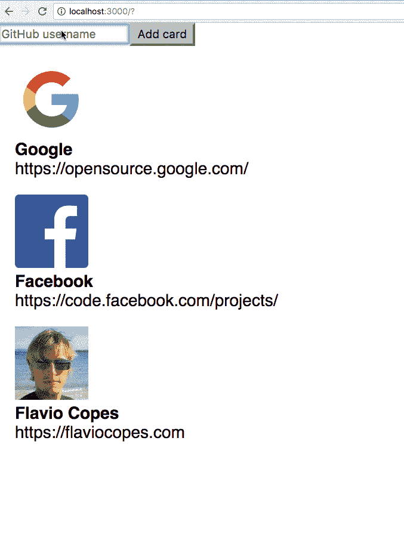**

**在 https://codepen.io/flaviocopes/pen/oJLyeY 的[Codepen 上查看](https://codepen.io/flaviocopes/pen/oJLyeY)**

### **第 5 部分:造型**

### **React 中的 CSS**

**使用 React，您有多种方式向组件添加样式。**

#### **使用类和 CSS**

**第一个也是最简单的方法是使用类，并使用普通的 CSS 文件来定位这些类:**

```
`const Button = () => {
  return <button className="button">A button</button>
}

.button {
  background-color: yellow;
}`
```

**您可以使用 import 语句导入样式表，如下所示:**

```
`import './style.css'`
```

**并且 [Webpack](https://flaviocopes.com/webpack/) 将负责将 CSS 属性添加到包中。**

#### **使用样式属性**

**第二种方法是使用附加到 JSX 元素的`style`属性。使用这种方法，你不需要一个单独的 CSS 文件。**

```
`const Button = () => {
  return <button style={{ backgroundColor: 'yellow' }}>A button</button>
}`
```

**现在，CSS 的定义略有不同。首先，注意双花括号:这是因为`style`接受一个对象。我们传入一个用花括号定义的 JavaScript 对象。我们也可以这样做:**

```
`const buttonStyle = { backgroundColor: 'yellow' }
const Button = () => {
  return <button style={buttonStyle}>A button</button>
}`
```

**当使用`create-react-app`时，由于使用了[自动前缀器](https://github.com/postcss/autoprefixer)，这些样式在默认情况下会自动前缀。**

**此外，现在的样式是驼峰式，而不是使用破折号。每当一个 CSS 属性有破折号，就把它去掉，开始下一个大写的单词。**

**样式的好处是位于组件的本地，它们不能泄漏到应用程序其他部分的其他组件，这是使用类和外部 CSS 文件无法提供的。**

#### **使用 CSS 模块**

**CSS 模块似乎是一个完美的中间点:你使用类，但是 CSS 的作用域是组件，这意味着你添加的任何样式在没有你的允许下都不能应用到其他组件。然而，您的样式是在单独的 CSS 文件中定义的，这比 JavaScript 中的 CSS 更容易维护(并且您可以使用旧的 CSS 属性名称)。**

**首先创建一个以`.module.css`结尾的 CSS 文件，例如`Button.module.css`。一个很好的选择是给它起一个和你要设计的组件一样的名字**

**在这里添加您的 CSS，然后将其导入到您想要设置样式的组件文件中:**

```
`import style from './Button.module.css'`
```

**现在，您可以在您的 JSX 中使用它:**

```
`const Button = () => {
  return <button className={style.content}>A button</button>
}`
```

**就是这样！在生成的标记中，React 将为每个呈现的组件生成一个特定的、唯一的类，并将 CSS 分配给该类，以便 CSS 不会影响其他标记。**

### **在反应中顶嘴**

**当您使用`[create-react-app](https://flaviocopes.com/react-create-react-app/)`构建 React 应用程序时，在样式方面您有许多选择。**

> ***当然，如果不使用`create-react-app`，你有世界上所有的选择，但是我们把讨论限制在`create-react-app`提供的选项上。***

**首先，您可以使用普通类和 CSS 文件，使用 style 属性或 CSS 模块来设置样式。**

**萨斯/SCSS 是一个非常受欢迎的选项，许多开发人员都非常喜欢它。**

**完全不需要任何配置就可以使用，从`create-react-app` 2 开始。**

**您所需要的只是一个`.sass`或`.scss`文件，您只需将它导入到一个组件中:**

```
`import './styles.scss'`
```

**你可以看到它在 https://codesandbox.io/s/18qq31rp3 的一个例子。**

### **样式组件**

**样式化组件是在现代 JavaScript 中使用 CSS 的新方式之一。这意味着它是 CSS 模块的继承者，是一种编写 CSS 的方法，只限于单个组件，不会泄漏到页面中的任何其他元素**

#### **简史**

**曾几何时，Web 真的很简单，CSS 甚至不存在。我们使用**表格**和框架来布置页面。美好时光。**

**然后 **CSS** 出现了，过了一段时间后，很明显框架可以提供很大的帮助，尤其是在构建网格和布局时，Bootstrap 和 Foundation 在其中扮演了重要角色。**

**像 **SASS** 和其他预处理程序帮助减缓了框架的采用，并且更好地组织代码，像 **BEM** 和 **SMACSS** 这样的约定在使用中增长，特别是在团队内部。**

**约定不是解决所有问题的办法，而且它们很难记住，所以在过去几年里，随着越来越多的人在每个前端项目中采用 [JavaScript](https://flaviocopes.com/javascript/) 和构建过程，CSS 找到了进入 JavaScript ( **CSS-in-JS** )的方法。**

**新的工具探索了使用 CSS-in-JS 的新方法，其中一些获得了成功，并越来越受欢迎:**

*   **反应风格**
*   **js 风格**
*   **镭**

**还有更多。**

#### **引入样式组件**

**这些工具中最流行的一个是**风格的组件**。**

**这意味着它将成为 **CSS 模块**的继承者，一种编写单个组件范围内的 CSS 的方法，并且不会泄漏到页面中的任何其他元素。**

**(更多关于 CSS 模块的信息[这里](https://css-tricks.com/css-modules-part-1-need/)和[这里](https://glenmaddern.com/articles/css-modules))**

**样式组件允许您在组件中编写普通的 CSS，而不用担心类名冲突。**

#### **装置**

**使用 [npm](https://flaviocopes.com/npm/) 或[纱线](https://flaviocopes.com/yarn/)简单安装样式组件:**

```
`npm install styled-components
yarn add styled-components`
```

**就是这样！现在您所要做的就是添加这个导入:**

```
`import styled from 'styled-components'`
```

#### **您的第一个样式组件**

**随着`styled`对象的导入，您现在可以开始创建样式化的组件。这是第一个:**

```
`const Button = styled.button`
  font-size: 1.5em;
  background-color: black;
  color: white;
``
```

**现在是 React 的一个重要组成部分。**

**我们使用样式化对象的一个函数来创建它，在本例中称为`button`，并在一个[模板文本](https://flaviocopes.com/ecmascript/#template-literals)中传递一些 CSS 属性。**

**现在，可以使用普通的 React 语法在我们的容器中呈现该组件:**

```
`render(<Button />)`
```

**样式化的组件提供了其他的功能，你可以用来创建其他的组件，而不仅仅是`button`，比如`section`、`h1`、`input`等等。**

**使用的语法，加上反勾号，一开始可能会很奇怪，但它被称为[标记模板](https://developer.mozilla.org/en-US/docs/Web/JavaScript/Reference/Template_literals)，它是普通的 JavaScript，是一种向函数传递参数的方式。**

#### **使用道具定制组件**

**当您将一些道具传递给一个样式化的组件时，它会将它们传递给挂载的 [DOM](https://flaviocopes.com/dom/) 节点。**

**例如，下面是我们如何将`placeholder`和`type`道具传递给`input`组件:**

```
`const Input = styled.input`
  //...
`

render(
  <div>
    <Input placeholder="..." type="text" />
  </div>
)`
```

**这将按照您的想法做，将这些道具作为 HTML 属性插入。**

**道具不仅仅是被盲目地传递给 [DOM](https://flaviocopes.com/dom/) ，还可以被用来基于道具值定制组件。这里有一个例子:**

```
`const Button = styled.button`
  background: ${props => (props.primary ? 'black' : 'white')};
  color: ${props => (props.primary ? 'white' : 'black')};
`

render(
  <div>
    <Button>A normal button</Button>
    <Button>A normal button</Button>
    <Button primary>The primary button</Button>
  </div>
)`
```

**设置`primary`道具会改变按钮的颜色。**

#### **扩展现有的样式组件**

**如果您有一个组件，并且想要创建一个类似的组件，只是样式稍有不同，那么您可以使用`extend`:**

```
`const Button = styled.button`
  color: black;
  //...
`

const WhiteButton = Button.extend`
  color: white;
`

render(
  <div>
    <Button>A black button, like all buttons</Button>
    <WhiteButton>A white button</WhiteButton>
  </div>
)`
```

#### **是普通的 CSS**

**在样式化组件中，你可以使用你已经知道并喜爱的 CSS。只是普通的 CSS。它不是伪 CSS，也不是有局限性的内联 CSS。**

**你可以使用媒体查询、[嵌套](https://tabatkins.github.io/specs/css-nesting/)和任何你可能需要的东西。**

#### **使用供应商前缀**

**样式化的组件会自动添加所有需要的厂商前缀，所以不需要担心这个问题。**

### **第 6 节:工具**

### **巴比伦式的城市**

**Babel 是一个很棒的工具，它已经存在很长时间了，但是现在几乎每个 JavaScript 开发者都依赖它。这个还会继续，因为巴别塔现在已经不可或缺，解决了大家的一个大问题。**

**哪个问题？**

**每个 Web 开发人员肯定都遇到过的问题:JavaScript 的一个特性在最新版本的浏览器中可用，但在旧版本中不可用。也可能 Chrome 或 Firefox 实现了，但 Safari iOS 和 Edge 没有。**

**比如 ES6 引入了**箭头功能**:**

```
`[1, 2, 3].map((n) => n + 1)`
```

**现在所有现代浏览器都支持它。IE11 不支持，Opera Mini 也不支持(我怎么知道？通过检查 [ES6 兼容性表](http://kangax.github.io/compat-table/es6/#test-arrow_functions)。**

**那么你应该如何处理这个问题呢？您应该继续前进，把那些使用旧的/不兼容的浏览器的客户留在后面，还是应该编写旧的 JavaScript 代码来让您的所有用户都满意？**

**进入巴别塔。Babel 是一个**编译器**:它接受用一种标准编写的代码，并将其转换成用另一种标准编写的代码。**

**您可以配置 Babel 将 modern ES2017 JavaScript 转换为 JavaScript ES5 语法:**

```
`[1, 2, 3].map(function(n) {
  return n + 1
})`
```

**这必须在构建时发生，因此您必须设置一个工作流来处理这个问题。Webpack 是一种常见的解决方案。**

**(附:如果所有这些 *ES* 的事情听起来让你感到困惑，请看 ECMAScript 指南中关于 ES 版本[的更多内容)](https://flaviocopes.com/ecmascript/)**

#### **安装 Babel**

**Babel 很容易使用 [npm](https://flaviocopes.com/npm/) 在本地项目中安装:**

```
`npm install --save-dev @babel/core @babel/cli`
```

**由于 npm 现在附带了`[npx](https://flaviocopes.com/node/npx/)`，本地安装的 CLI 包可以通过在项目文件夹中键入命令来运行:**

**所以我们只要跑就能跑巴别塔**

```
`npx babel script.js`
```

#### **巴别塔结构的一个例子**

**开箱即用的 Babel 没有做任何有用的事情，你需要配置它，添加插件。**

> **[*下面是巴别塔外挂列表*](https://babeljs.io/docs/en/plugins)**

**为了解决我们在简介中谈到的问题(在每个浏览器中使用箭头函数)，我们可以运行**

```
`npm install --save-dev \
    @babel/plugin-transform-es2015-arrow-functions`
```

**要下载我们应用程序的`node_modules`文件夹中的包，我们需要添加**

```
`{
  "plugins": ["transform-es2015-arrow-functions"]
}`
```

**应用程序根文件夹中的`.babelrc`文件。如果您还没有该文件，您只需创建一个空白文件，并将内容放入其中。**

> **提示:如果你从未见过点文件(以点开头的文件)，一开始可能会觉得奇怪，因为该文件可能不会出现在你的文件管理器中，因为它是一个隐藏文件。**

**现在，如果我们有一个包含以下内容的`script.js`文件:**

```
`var a = () => {};
var a = (b) => b;

const double = [1,2,3].map((num) => num * 2);
console.log(double); // [2,4,6]

var bob = {
  _name: "Bob",
  _friends: ["Sally", "Tom"],
  printFriends() {
    this._friends.forEach(f =>
      console.log(this._name + " knows " + f));
  }
};
console.log(bob.printFriends());`
```

**运行`babel script.js`会输出如下代码:**

```
`var a = function () {};var a = function (b) {
  return b;
};

const double = [1, 2, 3].map(function (num) {
  return num * 2;
});
console.log(double); // [2,4,6]

var bob = {
  _name: "Bob",
  _friends: ["Sally", "Tom"],
  printFriends() {
    var _this = this;

    this._friends.forEach(function (f) {
      return console.log(_this._name + " knows " + f);
    });
  }
};
console.log(bob.printFriends());`
```

**正如您所看到的，箭头函数都被转换成了 JavaScript ES5 函数。**

#### **巴别塔预设**

**我们在上一篇文章中已经看到了如何配置 Babel 来转换特定的 JavaScript 特性。**

**你可以添加更多的插件，但你不能一个一个地添加配置功能，这不实用。**

**这就是为什么 Babel 提供**预置**的原因。**

**最受欢迎的预设是`env`和`react`。**

> ***提示:巴别塔 7 不赞成(并删除)像`preset-es2017`这样的年度预设，以及舞台预设。用`@babel/preset-env`代替。***

#### **`env`预设**

**`env`预置非常好:你告诉它你想要支持哪些环境，它会为你做一切，**支持所有现代 JavaScript 特性**。**

**例如，“支持每个浏览器的最后 2 个版本，但对于 Safari，让我们支持 Safari 7 以后的所有版本”**

```
`{
  "presets": [
    ["env", {
      "targets": {
        "browsers": ["last 2 versions", "safari >= 7"]
      }
    }]
  ]
}`
```

**或者“我不需要浏览器支持，让我用 [Node.js](https://flaviocopes.com/node/) 6.10 就行了”**

```
`{
  "presets": [
    ["env", {
      "targets": {
        "node": "6.10"
      }
    }]
  ]
}`
```

#### **`react`预设**

**`react`预置在编写 React apps 时非常方便:添加`preset-flow`、`syntax-jsx`、`transform-react-jsx`、`transform-react-display-name`。**

**通过包含它，您已经准备好开发带有 JSX 变换和流支持的 React 应用程序。**

#### **关于预设的更多信息**

**[https://babeljs.io/docs/plugins/](https://babeljs.io/docs/plugins/)**

#### **通过 webpack 使用 Babel**

**如果你想在浏览器中运行现代 JavaScript，Babel 本身是不够的，你还需要捆绑代码。Webpack 是这方面的完美工具。**

**现代 JS 需要两个不同的阶段:编译阶段和运行阶段。这是因为某些 ES6+功能需要 polyfill 或运行时助手。**

**要安装 Babel polyfill 运行时功能，请运行**

```
`npm install @babel/polyfill \
            @babel/runtime \
            @babel/plugin-transform-runtime`
```

**现在在您的`webpack.config.js`文件中添加:**

```
`entry: [
  'babel-polyfill',
  // your app scripts should be here
],

module: {
  loaders: [
    // Babel loader compiles ES2015 into ES5 for
    // complete cross-browser support
    {
      loader: 'babel-loader',
      test: /\.js$/,
      // only include files present in the `src` subdirectory
      include: [path.resolve(__dirname, "src")],
      // exclude node_modules, equivalent to the above line
      exclude: /node_modules/,
      query: {
        // Use the default ES2015 preset
        // to include all ES2015 features
        presets: ['es2015'],
        plugins: ['transform-runtime']
      }
    }
  ]
}`
```

**通过将预置和插件信息保存在`webpack.config.js`文件中，我们可以避免使用`.babelrc`文件。**

### **网络包**

**Webpack 是一个让你编译 JavaScript 模块的工具，也被称为**模块捆绑器**。如果有大量文件，它会生成一个文件(或几个文件)来运行您的应用程序。**

**它可以执行许多操作:**

*   **帮助您整合资源。**
*   **观察变化并重新运行任务。**
*   **可以运行 Babel transpilation 到 ES5，允许您使用最新的 JavaScript 特性，而不用担心浏览器支持。**
*   **可以将 CoffeeScript 转换成 JavaScript**
*   **可以将内嵌图像转换为数据 URIs。**
*   **允许您对 CSS 文件使用 require()。**
*   **可以运行开发 web 服务器。**
*   **可以处理热模块更换。**
*   **可以将输出文件分成多个文件，以避免在第一次页面点击时加载一个巨大的 js 文件。**
*   **可以执行[摇树](https://flaviocopes.com/javascript-glossary/#tree-shaking)。**

**Webpack 不局限于在前端使用，它在后端 Node.js 开发中也很有用。**

**webpack 的前身以及仍然广泛使用的工具包括:**

*   **咕哝**
*   **花椰菜**
*   **吞咽**

**它们和 Webpack 在功能上有很多相似之处，但主要区别在于它们被称为**任务运行器**，而 webpack 是作为模块捆绑器诞生的。**

**这是一个更专注的工具:你指定应用程序的入口点(它甚至可以是一个带有脚本标签的 HTML 文件)，webpack 分析这些文件，并将运行应用程序所需的所有内容打包到一个 JavaScript 输出文件中(如果使用代码拆分，则打包到多个文件中)。**

#### **安装 webpack**

**Webpack 可以为每个项目进行全局或本地安装。**

#### **全局安装**

**下面用[纱](https://flaviocopes.com/yarn/)全球安装:**

```
`yarn global add webpack webpack-cli`
```

**带 [npm](https://flaviocopes.com/npm/) :**

```
`npm i -g webpack webpack-cli`
```

**一旦这样做了，你就可以跑了**

```
`webpack-cli`
```

#### **本地安装**

**Webpack 也可以安装在本地。这是推荐的设置，因为 webpack 可以针对每个项目进行更新，并且您可以轻松地为一个小项目使用最新的功能，而不是更新所有使用 webpack 的项目。**

**用[纱](https://flaviocopes.com/yarn/):**

```
`yarn add webpack webpack-cli -D`
```

**带 [npm](https://flaviocopes.com/npm/) :**

```
`npm i webpack webpack-cli --save-dev`
```

**完成后，将其添加到您的`package.json`文件中:**

```
`{
  //...
  "scripts": {
    "build": "webpack"
  }
}`
```

**完成后，您可以通过键入以下命令运行 webpack**

```
`yarn build`
```

**在项目根目录中。**

#### **Webpack 配置**

**默认情况下，如果您遵守以下约定，webpack(从版本 4 开始)不需要任何配置:**

*   **你的 app 的**入口点**是`./src/index.js`**
*   **输出被放入`./dist/main.js`。**
*   **Webpack 在生产模式下工作**

**当然，当你需要的时候，你可以定制 webpack 的每一个细节。webpack 配置存储在项目根文件夹中的`webpack.config.js`文件中。**

#### **入口点**

**默认情况下，入口点是`./src/index.js`。这个简单的例子使用`./index.js`文件作为起点:**

```
`module.exports = {
  /*...*/
  entry: './index.js'
  /*...*/
}`
```

#### **输出**

**默认情况下，输出在`./dist/main.js`中生成。这个例子将输出包放入`app.js`:**

```
`module.exports = {
  /*...*/
  output: {
    path: path.resolve(__dirname, 'dist'),
    filename: 'app.js'
  }
  /*...*/
}`
```

#### **装载机**

**使用 webpack 允许您在 JavaScript 代码中使用`import`或`require`语句，不仅可以包含其他 JavaScript，还可以包含任何类型的文件，例如 CSS。**

**Webpack 旨在处理我们所有的依赖项，而不仅仅是 JavaScript，加载器是实现这一点的一种方式。**

**例如，您可以在代码中使用:**

```
`import 'style.css'`
```

**通过使用这种加载器配置:**

```
`module.exports = {
  /*...*/
  module: {
    rules: [
      { test: /\.css$/, use: 'css-loader' },
    }]
  }
  /*...*/
}`
```

**[正则表达式](https://flaviocopes.com/javascript-regular-expressions/)以任何 CSS 文件为目标。**

**加载器可以有选项:**

```
`module.exports = {
  /*...*/
  module: {
    rules: [
      {
        test: /\.css$/,
        use: [
          {
            loader: 'css-loader',
            options: {
              modules: true
            }
          }
        ]
      }
    ]
  }
  /*...*/
}`
```

**您可以为每个规则要求多个装入程序:**

```
`module.exports = {
  /*...*/
  module: {
    rules: [
      {
        test: /\.css$/,
        use:
          [
            'style-loader',
            'css-loader',
          ]
      }
    ]
  }
  /*...*/
}`
```

**在这个例子中，`css-loader`解释 CSS 中的`import 'style.css'`指令。然后，`style-loader`负责在 DOM 中注入 CSS，使用一个`<style>`标签。**

**顺序很重要，而且是颠倒的(最后一个先执行)。**

**有哪几种装载机？很多！[你可以在这里找到完整的列表](https://webpack.js.org/loaders/)。**

**一个常用的加载器是 Babel，它用于将现代 JavaScript 转换成 ES5 代码:**

```
`module.exports = {
  /*...*/
  module: {
    rules: [
      {
        test: /\.js$/,
        exclude: /(node_modules|bower_components)/,
        use: {
          loader: 'babel-loader',
          options: {
            presets: ['@babel/preset-env']
          }
        }
      }
    ]
  }
  /*...*/
}`
```

**这个例子让 Babel 预处理我们所有的 React/JSX 文件:**

```
`module.exports = {
  /*...*/
  module: {
    rules: [
      {
        test: /\.(js|jsx)$/,
        exclude: /node_modules/,
        use: 'babel-loader'
      }
    ]
  },
  resolve: {
    extensions: [
      '.js',
      '.jsx'
    ]
  }
  /*...*/
}`
```

**[见`babel-loader`选项此处](https://webpack.js.org/loaders/babel-loader/)。**

#### **插件**

**插件就像是加载器，但却是兴奋剂。它们可以做加载器做不到的事情，是 webpack 的主要构建块。**

**举个例子:**

```
`module.exports = {
  /*...*/
  plugins: [
    new HTMLWebpackPlugin()
  ]
  /*...*/
}`
```

**`HTMLWebpackPlugin`插件的工作是自动创建一个 HTML 文件，添加输出 JS 包路径，这样 JavaScript 就准备好了。**

**有[个插件可用](https://webpack.js.org/plugins/)。**

**一个有用的插件`CleanWebpackPlugin`可以用来在创建任何输出之前清除`dist/`文件夹，这样当您更改输出文件的名称时就不会留下文件:**

```
`module.exports = {
  /*...*/
  plugins: [
    new CleanWebpackPlugin(['dist']),
  ]
  /*...*/
}`
```

#### **网络包模式**

**这种模式(在 webpack 4 中引入)设置 webpack 的工作环境。它可以被设置为`development`或`production`(默认为生产，因此您仅在转移到开发时设置它)**

```
`module.exports = {
  entry: './index.js',
  mode: 'development',
  output: {
    path: path.resolve(__dirname, 'dist'),
    filename: 'app.js'
  }
}`
```

**开发模式:**

*   **构建速度非常快**
*   **不如生产优化**
*   **不删除注释**
*   **提供了更详细的错误消息和建议**
*   **提供更好的调试体验**

**生产模式构建起来比较慢，因为它需要生成一个更加优化的包。生成的 JavaScript 文件更小，因为它删除了许多生产中不需要的东西。**

**我制作了一个示例应用程序，它只打印一条`console.log`语句。**

**这是产品包:**

****

**这是开发包:**

**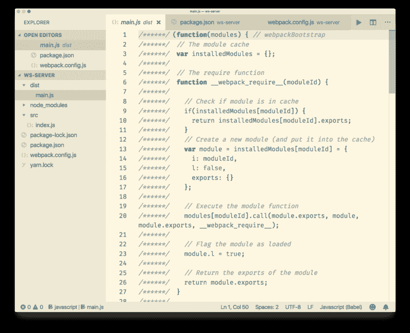**

#### **运行 webpack**

**如果在全球范围内安装，Webpack 可以从命令行手动运行，但是通常你在`package.json`文件中编写一个脚本，然后使用`npm`或`yarn`运行。**

**例如我们之前使用的这个`package.json`脚本定义:**

```
`"scripts": {
  "build": "webpack"
}`
```

**允许我们通过跑步来跑`webpack`**

```
`npm run build`
```

**或者**

```
`yarn run build`
```

**或者只是**

```
`yarn build`
```

#### **观察变化**

**当应用程序发生变化时，Webpack 可以自动重建包，并继续监听下一次变化。**

**只需添加以下脚本:**

```
`"scripts": {
  "watch": "webpack --watch"
}`
```

**然后跑**

```
`npm run watch`
```

**或者**

```
`yarn run watch`
```

**或者只是**

```
`yarn watch`
```

**监视模式的一个很好的特性是，只有在构建没有错误的情况下，包才会被更改。如果有错误，`watch`将继续监听变化，并尝试重新构建包，但是当前的工作包不受这些有问题的构建的影响。**

#### **处理图像**

**Webpack 允许我们以非常方便的方式使用图像，使用`[file-loader](https://webpack.js.org/loaders/file-loader/)`加载器。**

**这种简单的配置:**

```
`module.exports = {
  /*...*/
  module: {
    rules: [
      {
        test: /\.(png|svg|jpg|gif)$/,
        use: [
          'file-loader'
        ]
      }
    ]
  }
  /*...*/
}`
```

**允许您在 JavaScript 中导入图像:**

```
`import Icon from './icon.png'

const img = new Image()
img.src = Icon
element.appendChild(img)`
```

**(`img`是一个 HTMLImageElement。查看[图像文件](https://developer.mozilla.org/en-US/docs/Web/API/HTMLImageElement/Image)**

**也可以处理其他资产类型，如字体、CSV 文件、xml 等。**

**另一个处理图像的好工具是`url-loader`加载器。**

**这个例子加载任何小于 8KB 的 PNG 文件作为[数据 URL](https://flaviocopes.com/data-urls/) 。**

```
`module.exports = {
  /*...*/
  module: {
    rules: [
      {
        test: /\.png$/,
        use: [
          {
            loader: 'url-loader',
            options: {
              limit: 8192
            }
          }
        ]
      }
    ]
  }
  /*...*/
}`
```

#### **处理您的 SASS 代码并将其转换为 CSS**

**使用`sass-loader`、`css-loader`和`style-loader`:**

```
`module.exports = {
  /*...*/
  module: {
    rules: [
      {
        test: /\.scss$/,
        use: [
          'style-loader',
          'css-loader',
          'sass-loader'
        ]
      }
    ]
  }
  /*...*/
}`
```

#### **生成源地图**

**例如，由于 webpack 捆绑了代码，所以源代码映射对于获取对引发错误的原始文件的引用是强制性的。**

**您告诉 webpack 使用配置的`devtool`属性生成源映射:**

```
`module.exports = {
  /*...*/
  devtool: 'inline-source-map',
  /*...*/
}`
```

**`devtool`有[多种可能值](https://webpack.js.org/configuration/devtool/)，使用最多的大概有:**

*   **`none`:不添加源地图**
*   **`source-map`:非常适合生产，提供了一个可以最小化的单独的源映射，并在包中添加了一个引用，因此开发工具知道源映射是可用的。当然，您应该配置服务器以避免发布它，而只是将它用于调试目的**
*   **`inline-source-map`:非常适合开发，将源地图内联为数据 URL**

### **第 7 节:测试**

### **玩笑**

**Jest 是一个用于测试 JavaScript 代码的库。**

**这是一个由脸书维护的开源项目，它特别适合 React 代码测试，尽管不限于此:它可以测试任何 JavaScript 代码。它的优点是:**

*   **它很快**
*   **它可以执行**快照测试****
*   **它固执己见，提供一切现成的东西，不需要你做出选择**

**Jest 是一个非常类似于 Mocha 的工具，尽管它们有所不同:**

*   **摩卡不那么固执己见，而 Jest 有一套特定的惯例**
*   **Mocha 需要更多的配置，而 Jest 通常开箱即用，这要感谢固执己见**
*   **Mocha 历史更悠久，更成熟，有更多的工具集成**

**在我看来，Jest 最大的特点是它是一个开箱即用的解决方案，无需与其他测试库交互就能完成工作。**

#### **装置**

**Jest 是自动安装在`create-react-app`里的，所以如果你用那个，就不需要安装 Jest 了。**

**Jest 可以使用 [Yarn](https://flaviocopes.com/yarn/) 安装在任何其他项目中:**

```
`yarn add --dev jest`
```

**或者 [npm](https://flaviocopes.com/npm/) :**

```
`npm install --save-dev jest`
```

**请注意我们是如何指示两者将 Jest 放在`package.json`文件的`devDependencies`部分的，这样它将只安装在开发环境中，而不是生产环境中。**

**将这一行添加到您的`package.json`文件的脚本部分:**

```
`{
  "scripts": {
    "test": "jest"
  }
}`
```

**以便使用`yarn test`或`npm run test`运行测试。**

**或者，您可以全局安装 Jest:**

```
`yarn global add jest`
```

**并使用`jest`命令行工具运行所有的测试。**

#### **创建第一个 Jest 测试**

**用`create-react-app`创建的项目已经安装并预配置了 Jest，但是向任何项目添加 Jest 就像输入一样简单**

```
`yarn add --dev jest`
```

**给你的`package.json`加上这一行:**

```
`{
  "scripts": {
    "test": "jest"
  }
}`
```

**并通过在 shell 中执行`yarn test`来运行您的测试。**

**现在，这里没有任何测试，所以不会执行任何东西:**

**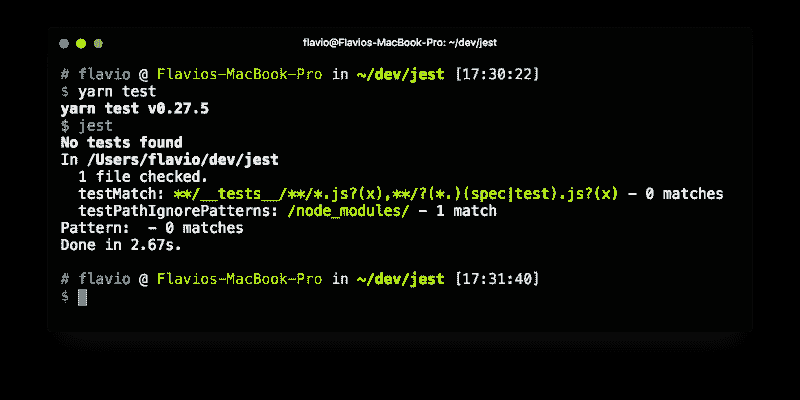**

**让我们创建第一个测试。打开一个`math.js`文件，输入几个函数，我们稍后会测试:**

```
`const sum = (a, b) => a + b
const mul = (a, b) => a * b
const sub = (a, b) => a - b
const div = (a, b) => a / b

export default { sum, mul, sub, div }`
```

**现在在同一个文件夹中创建一个`math.test.js`文件，我们将使用 Jest 来测试在`math.js`中定义的函数:**

```
`const { sum, mul, sub, div } = require('./math')

test('Adding 1 + 1 equals 2', () => {
  expect(sum(1, 1)).toBe(2)
})
test('Multiplying 1 * 1 equals 1', () => {
  expect(mul(1, 1)).toBe(1)
})
test('Subtracting 1 - 1 equals 0', () => {
  expect(sub(1, 1)).toBe(0)
})
test('Dividing 1 / 1 equals 1', () => {
  expect(div(1, 1)).toBe(1)
})`
```

**运行`yarn test`会导致 Jest 在它找到的所有测试文件上运行，并向我们返回最终结果:**

**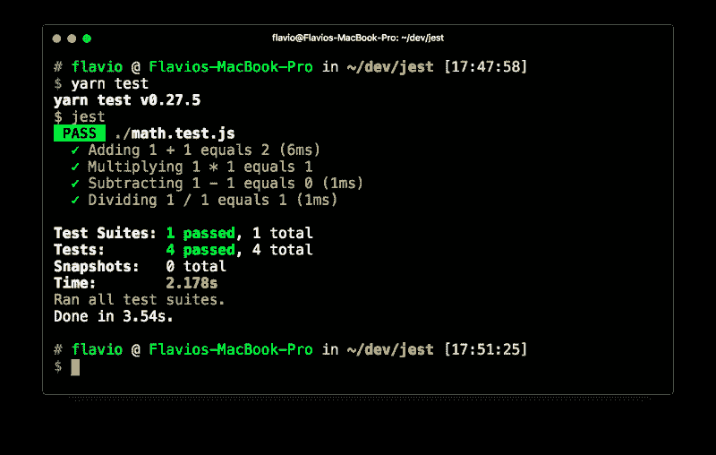**

#### **用 VS 代码运行 Jest**

**Visual Studio 代码是 JavaScript 开发的绝佳编辑器。Jest 扩展为我们的测试提供了顶级的集成。**

**一旦你安装了它，它会自动检测你是否在你的 devDependencies 中安装了 Jest 并运行测试。您也可以通过选择 **Jest: Start Runner** 命令来手动调用测试。它将运行测试，并保持监视模式，以便在您更改某个包含测试的文件(或测试文件)时重新运行测试:**

**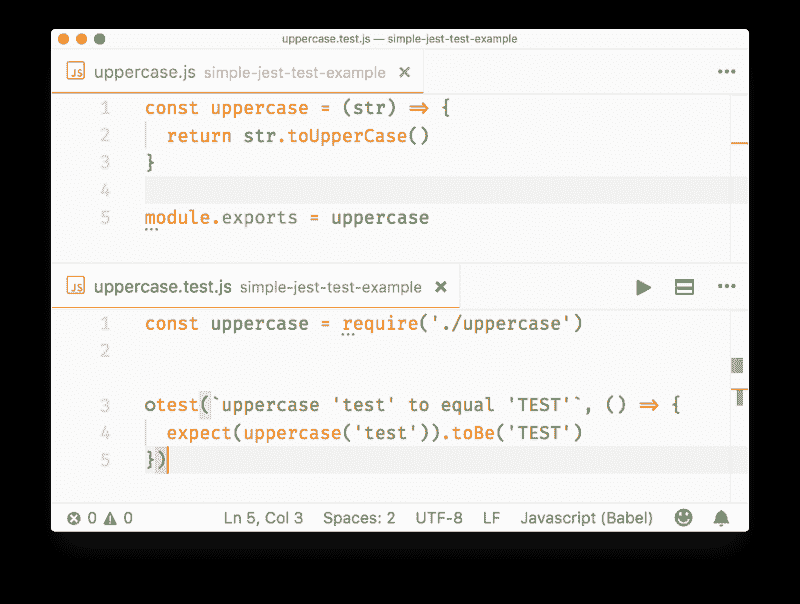**

#### **匹配项**

**在前一篇文章中，我使用`toBe()`作为唯一的**匹配器**:**

```
`test('Adding 1 + 1 equals 2', () => {
  expect(sum(1, 1)).toBe(2)
})`
```

**匹配器是一种让您测试值的方法。**

**将`expect()`的结果值与作为参数传入的值进行比较的最常用匹配器有:**

*   **`toBe`比较严格相等，使用`===`**
*   **`toEqual`比较两个变量的值。如果是一个对象或数组，它会检查所有属性或元素的相等性**
*   **`toBeNull`传递空值时为真**
*   **`toBeDefined`当传递一个定义值时为真(与上述相反)**
*   **当传递未定义的值时,`toBeUndefined`为真**
*   **`toBeCloseTo`用于比较浮点值，避免舍入误差**
*   **`toBeTruthy`如果值被认为是真的，则为真(就像`if`一样)**
*   **`toBeFalsy`如果值被认为是假的，则为真(就像`if`一样)**
*   **`toBeGreaterThan`如果 expect()的结果高于参数，则为 true**
*   **`toBeGreaterThanOrEqual`如果 expect()的结果等于参数，或者高于参数，则为 true**
*   **`toBeLessThan`如果 expect()的结果低于参数，则为 true**
*   **`toBeLessThanOrEqual`如果 expect()的结果等于参数，或者低于参数，则为 true**
*   **`toMatch`用于比较字符串与[正则表达式](https://flaviocopes.com/javascript-regular-expressions/)模式的匹配**
*   **`toContain`在数组中使用，如果期望的数组在其元素集中包含参数，则为 true**
*   **`toHaveLength(number)`:检查数组的长度**
*   **`toHaveProperty(key, value)`:检查对象是否有属性，并可选择检查其值**
*   **检查你传递的函数是抛出一个异常(一般情况下)还是一个特定的异常**
*   **`toBeInstanceOf()`:检查一个对象是否是一个类的实例**

**所有这些匹配器都可以在语句中使用`.not.`来求反，例如:**

```
`test('Adding 1 + 1 does not equal 3', () => {
  expect(sum(1, 1)).not.toBe(3)
})`
```

**与承诺一起使用时，可以使用`.resolves`和`.rejects`:**

```
`expect(Promise.resolve('lemon')).resolves.toBe('lemon')

expect(Promise.reject(new Error('octopus'))).rejects.toThrow('octopus')`
```

#### **设置**

**在运行测试之前，您需要执行一些初始化。**

**要在所有测试运行之前做一次，使用`beforeAll()`函数:**

```
`beforeAll(() => {
  //do something
})`
```

**要在每次测试运行之前执行一些操作，请使用`beforeEach()`:**

```
`beforeEach(() => {
  //do something
})`
```

#### **拆卸**

**正如您对安装程序所做的一样，您也可以在每次测试运行后执行一些操作:**

```
`afterEach(() => {
  //do something
})`
```

**所有测试结束后:**

```
`afterAll(() => {
  //do something
})`
```

#### **使用 describe()进行分组测试**

**您可以在单个文件中创建多组测试，以隔离安装和拆卸功能:**

```
`describe('first set', () => {
  beforeEach(() => {
    //do something
  })
  afterAll(() => {
    //do something
  })
  test(/*...*/)
  test(/*...*/)
})

describe('second set', () => {
  beforeEach(() => {
    //do something
  })
  beforeAll(() => {
    //do something
  })
  test(/*...*/)
  test(/*...*/)
})` 
```

#### **测试异步代码**

**现代 JavaScript 中的异步代码基本上有两种形式:回调和承诺。除了承诺，我们还可以使用 async/await。**

#### **回收**

**您不能在回调中进行测试，因为 Jest 不会执行它——测试文件的执行在回调被调用之前就结束了。要解决这个问题，向测试函数传递一个参数，您可以方便地调用这个函数`done`。Jest 将等到您呼叫`done()`后才结束测试:**

```
`//uppercase.js
function uppercase(str, callback) {
  callback(str.toUpperCase())
}
module.exports = uppercase

//uppercase.test.js
const uppercase = require('./src/uppercase')

test(`uppercase 'test' to equal 'TEST'`, (done) => {
  uppercase('test', (str) => {
    expect(str).toBe('TEST')
    done()
  }
})`
```

**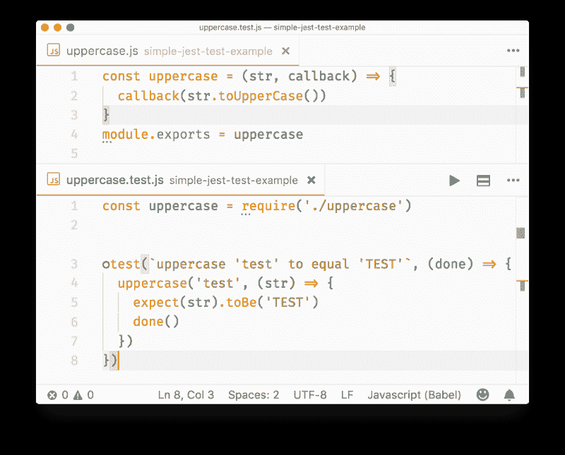**

#### **承诺**

**对于返回承诺的函数，我们简单地从测试中返回一个承诺:**

```
`//uppercase.js
const uppercase = str => {
  return new Promise((resolve, reject) => {
    if (!str) {
      reject('Empty string')
      return
    }
    resolve(str.toUpperCase())
  })
}
module.exports = uppercase

//uppercase.test.js
const uppercase = require('./uppercase')
test(`uppercase 'test' to equal 'TEST'`, () => {
  return uppercase('test').then(str => {
    expect(str).toBe('TEST')
  })
})`
```

**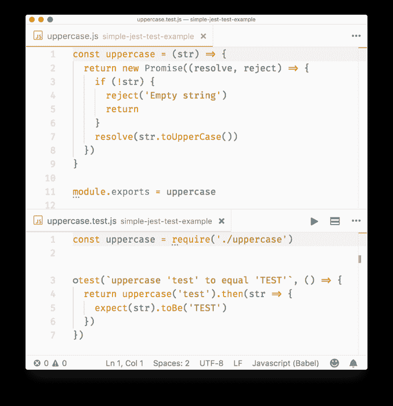**

**被拒绝的承诺可以使用`.catch()`进行测试:**

```
`//uppercase.js
const uppercase = str => {
  return new Promise((resolve, reject) => {
    if (!str) {
      reject('Empty string')
      return
    }
    resolve(str.toUpperCase())
  })
}

module.exports = uppercase

//uppercase.test.js
const uppercase = require('./uppercase')

test(`uppercase 'test' to equal 'TEST'`, () => {
  return uppercase('').catch(e => {
    expect(e).toMatch('Empty string')
  })
})`
```

**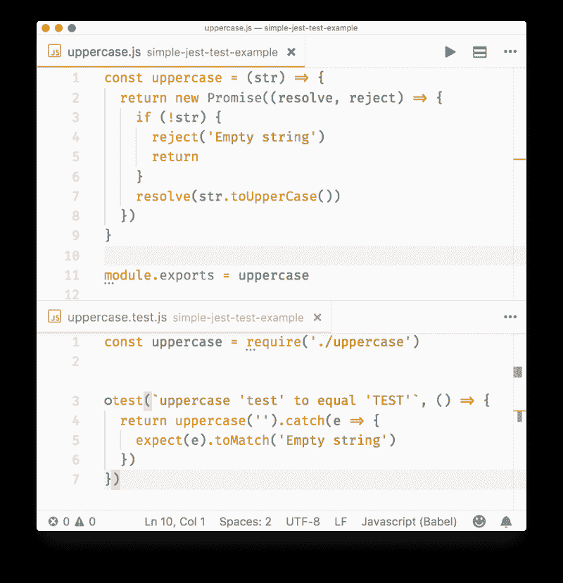**

#### **异步/等待**

**为了测试返回承诺的函数，我们还可以使用 async/await，这使得语法非常简单明了:**

```
`//uppercase.test.js
const uppercase = require('./uppercase')
test(`uppercase 'test' to equal 'TEST'`, async () => {
  const str = await uppercase('test')
  expect(str).toBe('TEST')
})`
```

**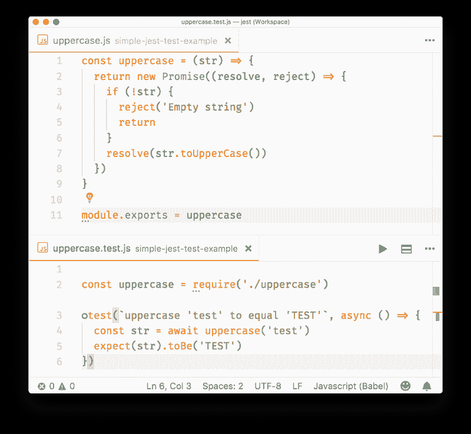**

#### **嘲弄的**

**在测试中， **mocking** 允许您测试依赖于以下内容的功能:**

*   ****数据库****
*   ****网络**请求**
*   **访问**文件****
*   **任何**外部**系统**

**因此:**

1.  **您的测试运行**更快**，在开发过程中提供快速的周转时间**
2.  **您的测试独立于网络条件或数据库状态**
3.  **您的测试不会污染任何数据存储，因为它们不会触及数据库**
4.  **测试中的任何改变都不会改变后续测试的状态，重新运行测试套件应该从一个已知的、可重复的起点开始**
5.  **您不必担心 API 调用和网络请求的速率限制**

**当您想要避免副作用(例如，写入数据库)或者想要跳过代码中较慢的部分(例如网络访问)时，模仿是有用的，并且还可以避免多次运行测试的影响(例如，想象一个发送电子邮件或者调用速率受限的 API 的函数)。**

**更重要的是，如果你正在编写一个**单元测试**，你应该孤立地测试一个函数的功能，而不是测试它所涉及的所有东西。**

**使用模拟，您可以检查是否调用了模块函数，以及使用了哪些参数，使用:**

*   **`expect().toHaveBeenCalled()`:检查是否调用了侦测到的函数**
*   **`expect().toHaveBeenCalledTimes()`:统计被监听的函数被调用的次数**
*   **`expect().toHaveBeenCalledWith()`:检查是否使用一组特定的参数调用了该函数**
*   **`expect().toHaveBeenLastCalledWith()`:检查上次调用该功能时的参数**

#### **不影响功能代码的间谍包**

**当您导入一个包时，您可以告诉 Jest 使用`spyOn()`来“监视”特定函数的执行，而不会影响该方法的工作方式。**

**示例:**

```
`const mathjs = require('mathjs')

test(`The mathjs log function`, () => {
  const spy = jest.spyOn(mathjs, 'log')
  const result = mathjs.log(10000, 10)

  expect(mathjs.log).toHaveBeenCalled()
  expect(mathjs.log).toHaveBeenCalledWith(10000, 10)
})`
```

#### **模仿整个包装**

**Jest 提供了一种方便的方式来模仿整个包。在项目根目录下创建一个`__mocks__`文件夹，在这个文件夹中为您的每个包创建一个 JavaScript 文件。**

**说你进口`mathjs`。在您的项目根目录中创建一个`__mocks__/mathjs.js`文件，并添加以下内容:**

```
`module.exports = {
  log: jest.fn(() => 'test')
}`
```

**这将模仿包的 log()函数。添加尽可能多的函数来模拟:**

```
`const mathjs = require('mathjs')

test(`The mathjs log function`, () => {
  const result = mathjs.log(10000, 10)
  expect(result).toBe('test')
  expect(mathjs.log).toHaveBeenCalled()
  expect(mathjs.log).toHaveBeenCalledWith(10000, 10)
})`
```

#### **模拟单个函数**

**更简单地说，您可以使用`jest.fn()`模拟单个函数:**

```
`const mathjs = require('mathjs')

mathjs.log = jest.fn(() => 'test')
test(`The mathjs log function`, () => {
  const result = mathjs.log(10000, 10)
  expect(result).toBe('test')
  expect(mathjs.log).toHaveBeenCalled()
  expect(mathjs.log).toHaveBeenCalledWith(10000, 10)
})`
```

**您还可以使用`jest.fn().mockReturnValue('test')`来创建一个简单的模拟，它除了返回值之外什么也不做。**

#### **预制模型**

**你可以找到流行图书馆的预制模型。例如，这个包[https://github.com/jefflau/jest-fetch-mock](https://github.com/jefflau/jest-fetch-mock)允许您模拟`fetch()`调用，并提供样本返回值，而无需在测试中与实际的服务器交互。**

#### **快照测试**

**快照测试是 Jest 提供的一个非常酷的特性。它可以记住你的 UI 组件是如何呈现的，并将其与当前测试进行比较，如果不匹配，就会产生错误。**

**这是对一个简单的`create-react-app`应用程序的 App 组件的简单测试(确保您安装了`react-test-renderer`):**

```
`import React from 'react'
import App from './App'
import renderer from 'react-test-renderer'

it('renders correctly', () => {
  const tree = renderer.create(<App />).toJSON()
  expect(tree).toMatchSnapshot()
})`
```

**第一次运行这个测试时，Jest 将快照保存到`__snapshots__`文件夹中。下面是 App.test.js.snap 包含的内容:**

```
`// Jest Snapshot v1, https://goo.gl/fbAQLP

exports[`renders correctly 1`] = `
<div
  className="App"
>
  <header
    className="App-header"
  >
    
    <h1
      className="App-title"
    >
      Welcome to React
    </h1>
  </header>
  <p
    className="App-intro"
  >
    To get started, edit
    <code>
      src/App.js
    </code>
     and save to reload.
  </p>
</div>
``
```

**如您所见，这是应用程序组件呈现的代码，仅此而已。**

**下一次测试将`<App` / >的输出与此进行比较。如果应用程序发生变化，您会得到一个错误:**

**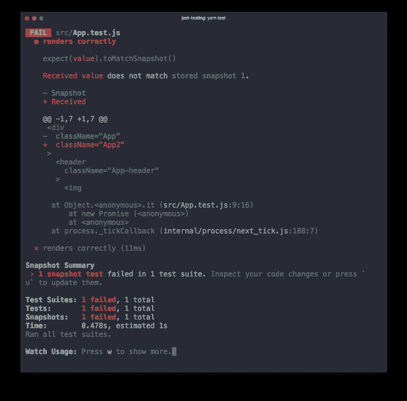**

**在`create-react-app`中使用`yarn test`时，你处于**观看模式**，从那里你可以按下`w`并显示更多选项:**

```
`Watch Usage
 › Press u to update failing snapshots.
 › Press p to filter by a filename regex pattern.
 › Press t to filter by a test name regex pattern.
 › Press q to quit watch mode.
 › Press Enter to trigger a test run.`
```

**如果您的更改是有意的，按`u`将更新失败的快照，并使测试通过。**

**您也可以通过在观察模式之外运行`jest -u`(或`jest --updateSnapshot`)来更新快照。**

### **测试反应组件**

**从测试 React 组件开始，最简单的方法是进行快照测试，这是一种测试技术，可以让您孤立地测试组件。**

**如果你熟悉测试软件，这就像你对类做的单元测试:你测试每个组件的功能。**

**我假设你用`create-react-app`创建了一个 React 应用，它已经安装了 **Jest** ，这是我们需要的测试包。**

**让我们从一个简单的测试开始。CodeSandbox 是一个很好的测试环境。从一个 React 沙箱开始，在一个`components`文件夹中创建一个`App.js`组件，并添加一个`App.test.js`文件。**

```
`import React from 'react'

export default function App() {
  return (
    <div className="App">
      <h1>Hello CodeSandbox</h1>
      <h2>Start editing to see some magic happen!</h2>
    </div>
  )
}`
```

**我们的第一个测试是愚蠢的:**

```
`test('First test', () => {
  expect(true).toBeTruthy()
})`
```

**当 CodeSandbox 检测到测试文件时，它会自动为您运行它们，您可以单击视图底部的 Tests 按钮来显示您的测试结果:**

**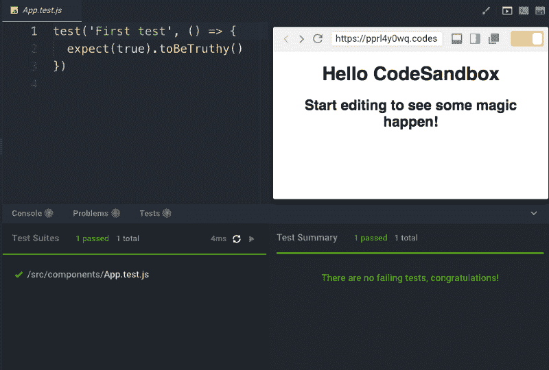**

**一个测试文件可以包含多个测试:**

**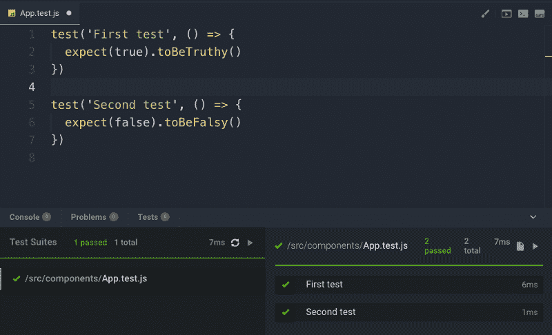**

**现在让我们做一些更有用的事情，实际测试一个 React 组件。我们现在只有 App，它没有做任何真正有用的事情，所以让我们首先用一个功能更多的小应用程序来设置环境:我们之前构建的计数器应用程序。如果你跳过了它，你可以回过头来阅读我们是如何构建它的，但是为了更容易参考，我再次把它添加到这里。**

**它只有两个组件:应用程序和按钮。创建`App.js`文件:**

```
`import React, { useState } from 'react'
import Button from './Button'

const App = () => {
  const [count, setCount] = useState(0)

  const incrementCount = increment => {
    setCount(count + increment)
  }

  return (
    <div>
      <Button increment={1} onClickFunction={incrementCount} />
      <Button increment={10} onClickFunction={incrementCount} />
      <Button increment={100} onClickFunction={incrementCount} />
      <Button increment={1000} onClickFunction={incrementCount} />
      <span>{count}</span>
    </div>
  )
}

export default App`
```

**和`Button.js`文件:**

```
`import React from 'react'

const Button = ({ increment, onClickFunction }) => {
  const handleClick = () => {
    onClickFunction(increment)
  }
  return <button onClick={handleClick}>+{increment}</button>
}

export default Button`
```

**我们将使用`react-testing-library`，这是一个很大的帮助，因为它允许我们检查每个组件的输出，并对它们应用事件。你可以在[https://github.com/kentcdodds/react-testing-library](https://github.com/kentcdodds/react-testing-library)了解更多信息，或者观看[这段视频](https://www.youtube.com/watch?v=JKOwJUM4_RM)。**

**让我们先测试一下按钮组件。**

**我们首先从`react-testing-library`引入`render`和`fireEvent`，两个助手。第一个让我们呈现 JSX。第二个让我们在组件上发出事件。**

**创建一个`Button.test.js`，放在与`Button.js`相同的文件夹中。**

```
`import React from 'react'
import { render, fireEvent } from 'react-testing-library'
import Button from './Button'`
```

**应用程序中使用按钮来接受点击事件，然后调用传递给`onClickFunction` prop 的函数。我们添加了一个`count`变量，并创建了一个函数来递增它:**

```
`let count

const incrementCount = increment => {
  count += increment
}`
```

**现在开始实际测试。我们首先将 count 初始化为 0，然后呈现一个`+1` `Button`组件，将一个`1`传递给`increment`，将我们的`incrementCount`函数传递给`onClickFunction`。**

**然后我们获取组件的第一个子组件的内容，并检查它的输出`+1`。**

**然后，我们继续单击按钮，检查计数是否从 0 变为 1:**

```
`test('+1 Button works', () => {
  count = 0
  const { container } = render(
    <Button increment={1} onClickFunction={incrementCount} />
  )
  const button = container.firstChild
  expect(button.textContent).toBe('+1')
  expect(count).toBe(0)
  fireEvent.click(button)
  expect(count).toBe(1)
})`
```

**类似地，我们测试一个+100 按钮，这次检查输出是`+100`并且按钮点击增加 100 的计数。**

```
`test('+100 Button works', () => {
  count = 0
  const { container } = render(
    <Button increment={100} onClickFunction={incrementCount} />
  )
  const button = container.firstChild
  expect(button.textContent).toBe('+100')
  expect(count).toBe(0)
  fireEvent.click(button)
  expect(count).toBe(100)
})`
```

**现在让我们来测试 App 组件。它在页面中显示 4 个按钮和结果。我们可以检查每个按钮，看看单击它们时结果是否增加，也可以多次单击:**

```
`import React from 'react'
import { render, fireEvent } from 'react-testing-library'
import App from './App'

test('App works', () => {
  const { container } = render(<App />)
  console.log(container)
  const buttons = container.querySelectorAll('button')

  expect(buttons[0].textContent).toBe('+1')
  expect(buttons[1].textContent).toBe('+10')
  expect(buttons[2].textContent).toBe('+100')
  expect(buttons[3].textContent).toBe('+1000')

  const result = container.querySelector('span')
  expect(result.textContent).toBe('0')
  fireEvent.click(buttons[0])
  expect(result.textContent).toBe('1')
  fireEvent.click(buttons[1])
  expect(result.textContent).toBe('11')
  fireEvent.click(buttons[2])
  expect(result.textContent).toBe('111')
  fireEvent.click(buttons[3])
  expect(result.textContent).toBe('1111')
  fireEvent.click(buttons[2])
  expect(result.textContent).toBe('1211')
  fireEvent.click(buttons[1])
  expect(result.textContent).toBe('1221')
  fireEvent.click(buttons[0])
  expect(result.textContent).toBe('1222')
})`
```

**检查代码沙箱中的代码:[https://codesandbox.io/s/pprl4y0wq](https://codesandbox.io/s/pprl4y0wq)**

### **第 8 部分:REACT 生态系统**

**React 周围的生态系统非常庞大。这里我给大家介绍 4 个基于 React 的最流行的项目:React Router、Redux、Next.js、Gatsby。**

### **反应路由器**

**React Router 是事实上的 React 路由库，它是基于 React 构建的最受欢迎的项目之一。**

**React 的核心是一个非常简单的库，它没有规定任何关于路由的事情。**

**在单页应用程序中路由是引入一些通过链接导航应用程序的功能的方式，这在普通的 web 应用程序中是**预期**的:**

1.  **当你导航到不同的屏幕时，浏览器应该**改变 URL****
2.  **深度链接应该可以工作:如果你将浏览器指向一个 URL，应用程序应该重新构建 URL 生成时呈现的视图。**
3.  ****浏览器后退(和前进)按钮**应该像预期的那样工作。**

****Routing 将您的应用程序导航与浏览器**提供的导航功能链接在一起:**地址栏**和**导航按钮**。**

**React Router 提供了一种编写代码的方式，只有当路由与您定义的内容相匹配时，**才会显示应用程序的某些组件。****

### **装置**

**带 [npm](https://flaviocopes.com/npm/) :**

```
`npm install react-router-dom`
```

**用[纱](https://flaviocopes.com/yarn/):**

```
`yarn add react-router-dom`
```

### **路线类型**

**React 路由器提供两种不同类型的路由:**

*   **`BrowserRouter`**
*   **`HashRouter`**

**一个构建经典 URL，另一个构建带有哈希的 URL:**

```
`https://application.com/dashboard   /* BrowserRouter */
https://application.com/#/dashboard /* HashRouter    */`
```

**使用哪种浏览器主要取决于您需要支持的浏览器。`BrowserRouter`使用[历史 API](https://flaviocopes.com/history-api/) ，相对较新，IE9 及以下版本不支持。如果你不用担心老版本的浏览器，这是推荐的选择。**

### **成分**

**使用 React 路由器时，您最常接触的 3 个组件是:**

*   **`BrowserRouter`，通常别名为`Router`**
*   **`Link`**
*   **`Route`**

**`BrowserRouter`包装您的所有路线组件。**

**如你所想，组件被用来生成到你的路线的链接**

**组件负责显示或隐藏它们所包含的组件。**

### **浏览器路由器**

**下面是 BrowserRouter 组件的一个简单示例。您从 react-router-dom 导入它，并使用它来包装所有应用程序:**

```
`import React from 'react'
import ReactDOM from 'react-dom'
import { BrowserRouter as Router } from 'react-router-dom'

ReactDOM.render(
  <Router>
      <div>
        <!-- -->
      </div>
  </Router>,
  document.getElementById('app')
)`
```

**BrowserRouter 组件只能有一个子元素，所以我们将所有要添加的内容包装在一个`div`元素中。**

### **环**

**链路组件用于触发新的路由。您从`react-router-dom`导入它，并且您可以添加链接组件以指向不同的路线，具有`to`属性:**

```
`import React from 'react'
import ReactDOM from 'react-dom'
import { BrowserRouter as Router, Link } from 'react-router-dom'

ReactDOM.render(
  <Router>
      <div>
        <aside>
          <Link to={`/dashboard`}>Dashboard</Link>
          <Link to={`/about`}>About</Link>
        </aside>
        <!-- -->
      </div>
  </Router>,
  document.getElementById('app')
)`
```

### **途径**

**现在，让我们在上面的代码片段中添加 Route 组件，以使事情实际上如我们所愿地工作:**

```
`import React from 'react'
import ReactDOM from 'react-dom'
import { BrowserRouter as Router, Link, Route } from 'react-router-dom'

const Dashboard = () => (
  <div>
    <h2>Dashboard</h2>
    ...
  </div>
)

const About = () => (
  <div>
    <h2>About</h2>
    ...
  </div>
)

ReactDOM.render(
  <Router>
    <div>
      <aside>
        <Link to={`/`}>Dashboard</Link>
        <Link to={`/about`}>About</Link>
      </aside>

      <main>
        <Route exact path="/" component={Dashboard} />
        <Route path="/about" component={About} />
      </main>
    </div>
  </Router>,
  document.getElementById('app')
)`
```

**检查一下这个关于毛刺的例子:[https://flaviocopes-react-router-v4.glitch.me/](https://flaviocopes-react-router-v4.glitch.me/)**

**当路线与`/`匹配时，应用程序显示**仪表板**组件。**

**当通过点击到`/about`的“关于”链接来改变路线时，仪表板组件被移除，关于的**组件被插入到 DOM 中。****

**请注意`exact`属性。如果没有这个，`path="/"`也会匹配`/about`，因为`/`包含在路由中。**

### **匹配多个路径**

**只需使用一个正则表达式就可以让一个路由响应多条路径，因为`path`可以是一个正则表达式字符串:**

```
`<Route path="/(about|who)/" component={Dashboard} />`
```

### **内嵌渲染**

**您可以设置一个`render`属性，而不是在`Route`上指定一个`component`属性:**

```
`<Route
  path="/(about|who)/"
  render={() => (
    <div>
      <h2>About</h2>
      ...
    </div>
  )}
/>`
```

### **匹配动态路由参数**

**您已经看到了如何使用静态路由，例如**

```
`const Posts = () => (
  <div>
    <h2>Posts</h2>
    ...
  </div>
)

//...

<Route exact path="/posts" component={Posts} />`
```

**以下是处理动态路由的方法:**

```
`const Post = ({match}) => (
  <div>
    <h2>Post #{match.params.id}</h2>
    ...
  </div>
)

//...

<Route exact path="/post/:id" component={Post} />`
```

**在您的 Route 组件中，您可以在`match.params`中查找动态参数。**

**`match`在内联呈现的路由中也是可用的，这在这种情况下特别有用，因为我们可以在呈现 post:**

```
`const posts = [
  { id: 1, title: 'First', content: 'Hello world!' },
  { id: 2, title: 'Second', content: 'Hello again!' }
]

const Post = ({post}) => (
  <div>
    <h2>{post.title}</h2>
    {post.content}
  </div>
)

//...

<Route exact path="/post/:id" render={({match}) => (
  <Post post={posts.find(p => p.id === match.params.id)} />
)} />`
```

### **Redux**

**Redux 是一个状态管理器，通常与 React 一起使用，但它并不依赖于那个库——它也可以与其他技术一起使用，但为了便于解释，我们将坚持使用 React..**

**Redux 是一种管理应用程序状态的方法，它将应用程序状态转移到一个外部全局存储库。**

**有几个概念需要理解，但是一旦你理解了，Redux 是解决这个问题的一个非常简单的方法。**

**Redux 在 React 应用程序中非常流行，但它绝不是 React 独有的:几乎所有流行的框架都有绑定。也就是说，我将使用 React 举一些例子，因为这是它的主要用例。**

#### **什么时候应该使用 Redux？**

**Redux 是大中型应用程序的理想选择，只有当您在使用 React 的默认状态管理或您使用的其他库管理状态时遇到困难时，才应该使用它。**

**简单的 app 应该根本不需要(简单的 app 也没什么不好)。**

#### **不可变状态树**

**在 Redux 中，应用的整个状态由**一个** [JavaScript](https://flaviocopes.com/javascript/) 对象来表示，称为**状态**或**状态树**。**

**我们称之为**不可变状态树**，因为它是只读的:不能直接改变。**

**它只能通过分派一个**动作**来改变。**

#### **行动**

**一个**动作**是**，一个以最小方式描述变化的 JavaScript 对象**(只包含需要的信息):**

```
`{
  type: 'CLICKED_SIDEBAR'
}

// e.g. with more data
{
  type: 'SELECTED_USER',
  userId: 232
}`
```

**动作对象的唯一要求是拥有一个`type`属性，它的值通常是一个字符串。**

#### **动作类型应该是常量**

**在一个简单的应用程序中，一个动作类型可以被定义为一个字符串，正如我在上一课的例子中所做的那样。**

**当应用程序增长时，最好使用常量:**

```
`const ADD_ITEM = 'ADD_ITEM'
const action = { type: ADD_ITEM, title: 'Third item' }`
```

**并将动作分离到它们自己的文件中，然后导入它们**

```
`import { ADD_ITEM, REMOVE_ITEM } from './actions'`
```

#### **动作创建者**

****动作创建者**是创建动作的函数。**

```
`function addItem(t) {
  return {
    type: ADD_ITEM,
    title: t
  }
}`
```

**您通常结合触发调度程序来运行操作创建器:**

```
`dispatch(addItem('Milk'))`
```

**或者通过定义动作分派器功能:**

```
`const dispatchAddItem = i => dispatch(addItem(i))
dispatchAddItem('Milk')`
```

#### **还原剂**

**当一个动作被触发时，一定会发生一些事情，应用程序的状态一定会改变。**

**这是**减速器**的工作。**

**一个**缩减器**是一个**纯函数**，它基于前一个状态树计算下一个状态树，并调度动作。**

```
`;(currentState, action) => newState`
```

**一个纯函数接受一个输入并返回一个输出，而不改变输入或其他任何东西。因此，一个缩减器返回一个全新的状态树对象来代替之前的状态树对象。**

#### **减压器不应该做什么**

**缩减器应该是一个纯函数，所以它应该:**

*   **永远不要改变它的论点**
*   **不要改变状态，而是用`Object.assign({}, ...)`创建一个新的状态**
*   **从不产生副作用(没有 API 调用改变任何事情)**
*   **不要调用非纯函数，即根据输入以外的因素改变输出的函数(如`Date.now()`或`Math.random()`)**

**没有强化，但是你要坚持规则。**

#### **多重减速器**

**因为一个复杂的应用程序的状态可能非常广泛，所以对于任何类型的操作，都不是只有一个缩减器，而是有许多缩减器。**

#### **减速器的模拟**

**就其核心而言，Redux 可以通过这个简单的模型进行简化:**

#### **国家**

```
`{
  list: [
    { title: "First item" },
    { title: "Second item" },
  ],
  title: 'Groceries list'
}`
```

#### **行动清单**

```
`{ type: 'ADD_ITEM', title: 'Third item' }
{ type: 'REMOVE_ITEM', index: 1 }
{ type: 'CHANGE_LIST_TITLE', title: 'Road trip list' }`
```

#### **国家每一部分的缩减者**

```
`const title = (state = '', action) => {
    if (action.type === 'CHANGE_LIST_TITLE') {
      return action.title
    } else {
      return state
    }
}

const list = (state = [], action) => {
  switch (action.type) {
    case 'ADD_ITEM':
      return state.concat([{ title: action.title }])
    case 'REMOVE_ITEM':
      return state.map((item, index) =>
        action.index === index
          ? { title: item.title }
          : item
    default:
      return state
  }
}`
```

#### **整个国家的减速器**

```
`const listManager = (state = {}, action) => {
  return {
    title: title(state.title, action),
    list: list(state.list, action)
  }
}`
```

#### **故事**

****存储**是一个对象，它:**

*   ****保存应用程序的状态****
*   ****通过`getState()`暴露状态****
*   **允许我们通过`dispatch()`用**更新状态****
*   **允许我们使用`subscribe()`注册(注销)一个**状态改变监听器****

**一个店铺在 app 中**是唯一的**。**

**下面是 listManager 应用程序商店的创建过程:**

```
`import { createStore } from 'redux'
import listManager from './reducers'
let store = createStore(listManager)`
```

#### **我可以用服务器端数据初始化存储吗？**

**当然，**只是经过一个起始状态**:**

```
`let store = createStore(listManager, preexistingState)`
```

#### **获取状态**

```
`store.getState()`
```

#### **更新状态**

```
`store.dispatch(addItem('Something'))`
```

#### **倾听状态变化**

```
`const unsubscribe = store.subscribe(() =>
  const newState = store.getState()
)

unsubscribe()`
```

#### **数据流**

**Redux 中的数据流总是**单向**。**

**你在商店上调用`dispatch()`，传递一个动作。**

**存储负责将动作传递给缩减器，生成下一个状态。**

**存储更新状态并警告所有侦听器。**

### **Next.js**

**在一个由 [React](https://flaviocopes.com/react/) 支持的现代 [JavaScript](https://flaviocopes.com/javascript/) 应用上工作是很棒的，直到你意识到在客户端呈现所有内容存在一些问题。**

**首先，页面需要更长的时间才能对用户可见，因为在内容加载之前，所有的 JavaScript 都必须加载，并且您的应用程序需要运行以确定在页面上显示什么。**

**第二，如果你正在建立一个公开的网站，你有一个内容搜索引擎优化的问题。搜索引擎在运行和索引 JavaScript 应用程序方面变得越来越好，但如果我们能向它们发送内容而不是让它们自己去解决，那就更好了。**

**这两个问题的解决方案是**服务器渲染**，也称为**静态预渲染**。**

**Next.js 是一个以非常简单的方式完成所有这些工作的 React 框架，但它不限于此。它的创造者宣传它是 React 应用程序的**零配置、单命令工具链。****

**它提供了一个通用的结构，允许您轻松地构建一个前端 React 应用程序，并透明地为您处理服务器端呈现。**

**以下是 Next.js 主要特性的非详尽列表:**

*   ****热代码重新加载** : Next.js 在检测到保存到磁盘的任何更改时重新加载页面。**
*   ****自动路由**:任何 URL 都被映射到文件系统，映射到放在`pages`文件夹中的文件，你不需要任何配置(当然你有定制选项)。**
*   ****单个文件组件**:使用 [styled-jsx](https://github.com/zeit/styled-jsx) ，完全集成为同一个团队构建的，添加组件范围内的样式很简单。**
*   ****服务器呈现**:在将 HTML 发送到客户端之前，您可以(可选地)在服务器端呈现 React 组件。**
*   ****生态系统兼容性** : Next.js 与 JavaScript、Node 和 React 生态系统的其余部分配合良好。**
*   ****自动代码分割**:页面只呈现他们需要的库和 JavaScript，仅此而已。**
*   ****预取**:`Link`组件，用于链接不同的页面，支持`prefetch`道具，在后台自动预取页面资源(包括代码拆分导致的缺码)。**
*   ****动态组件**:可以导入 JavaScript 模块，动态反应组件(【https://github.com/zeit/next.js#dynamic-import】T2)。**
*   ****静态导出**:使用`next export`命令，Next.js 允许你从你的应用程序中导出一个完全静态的站点。**

#### **装置**

**Next.js 支持所有主要平台:Linux、macOS、Windows。**

**使用 npm 可以轻松启动 Next.js 项目:**

```
`npm install next react react-dom`
```

**或者用[纱](https://flaviocopes.com/yarn/):**

```
`yarn add next react react-dom`
```

#### **入门指南**

**创建一个包含以下内容的`package.json`文件:**

```
`{
  "scripts": {
    "dev": "next"
  }
}`
```

**如果您现在运行此命令:**

```
`npm run dev`
```

**该脚本将引发一个错误，抱怨找不到`pages`文件夹。这是 Next.js 唯一需要运行的东西。**

**创建一个空的`pages`文件夹，再次运行该命令，Next.js 将在`localhost:3000`上启动一个服务器。**

**如果你现在去那个网址，你会看到一个友好的 404 页面，有一个漂亮干净的设计。**

**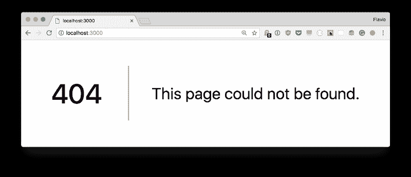**

**js 还处理其他类型的错误，比如 500 个错误。**

#### **创建页面**

**在`pages`文件夹中创建一个带有简单 React 功能组件的`index.js`文件:**

```
`export default () => (
  <div>
    <p>Hello World!</p>
  </div>
)`
```

**如果你访问`localhost:3000`，这个组件会自动渲染。**

**为什么这么简单？**

**Next.js 使用基于文件系统结构的声明性页面结构。**

**简单来说，页面在一个`pages`文件夹里面，页面 URL 由页面文件名决定。文件系统是 pages API。**

#### **服务器端渲染**

**打开页面源码，用 Chrome`View -> Developer -> View` 源码。**

**如您所见，组件生成的 HTML 直接在页面源代码中发送。它不在客户端渲染，而是在服务器端渲染。**

**Next.js 团队希望为服务器呈现的页面创建一种开发人员体验，类似于创建基本 PHP 项目时获得的体验，您只需放下 PHP 文件并调用它们，它们就会显示为页面。当然，从内部来看，这一切都非常不同，但明显的易用性是显而易见的。**

#### **添加第二页**

**让我们在`pages/contact.js`中创建另一个页面**

```
`export default () => (
  <div>
    <p>
      <a href="mailto:my@email.com">Contact us!</a>
    </p>
  </div>
)`
```

**如果你将浏览器指向`localhost:3000/contact`，这个页面就会呈现出来。如你所见，这个页面也是服务器渲染的。**

#### **热重装**

**请注意，您不必重启`npm`进程来加载第二个页面。Next.js 在幕后为您做了这件事。**

#### **客户端渲染**

**出于我们上面看到的所有原因，服务器渲染在你的第一个页面加载中非常方便，但是当涉及到在网站内部导航时，客户端渲染是加速页面加载和改善用户体验的关键。**

**Next.js 提供了一个可以用来构建链接的`Link`组件。试着把上面的两页链接起来。**

**将`index.js`更改为该代码:**

```
`import Link from 'next/link'

export default () => (
  <div>
    <p>Hello World!</p>
    <Link href="/contact">
      <a>Contact me!</a>
    </Link>
  </div>
)`
```

**现在回到浏览器，尝试这个链接。如您所见，Contact 页面会立即加载，无需页面刷新。**

**这是客户端导航工作正常，完全支持 [**历史 API**](https://flaviocopes.com/history-api/) ，这意味着你的用户的后退按钮不会中断。**

**如果你现在`cmd-click`链接，相同的联系页面将在一个新的标签页中打开，现在服务器渲染。**

#### **动态页面**

**Next.js 的一个很好的用例是博客，因为所有开发人员都知道它是如何工作的，并且它非常适合作为如何处理动态页面的简单示例。**

**动态页面是没有固定内容的页面，而是根据一些参数显示一些数据。**

**将`index.js`更改为**

```
`import Link from 'next/link'

const Post = props => (
  <li>
    <Link href={`/post?title=${props.title}`}>
      <a>{props.title}</a>
    </Link>
  </li>
)

export default () => (
  <div>
    <h2>My blog</h2>
    <ul>
      <li>
        <Post title="Yet another post" />
        <Post title="Second post" />
        <Post title="Hello, world!" />
      </li>
    </ul>
  </div>
)`
```

**这将创建一系列文章，并用文章标题填充标题查询参数:**

****

**现在在`pages`文件夹中创建一个`post.js`文件，并添加:**

```
`export default props => <h1>{props.url.query.title}</h1>`
```

**现在点击一篇文章将会在一个`h1`标签中呈现文章标题:**

****

**您可以使用不带查询参数的干净 URL。Next.js 链接组件通过接受一个`as`属性来帮助我们，您可以用它来传递一个 slug:**

```
`import Link from 'next/link'

const Post = props => (
  <li>
    <Link as={`/${props.slug}`} href={`/post?title=${props.title}`}>
      <a>{props.title}</a>
    </Link>
  </li>
)

export default () => (
  <div>
    <h2>My blog</h2>
    <ul>
      <li>
        <Post slug="yet-another-post" title="Yet another post" />
        <Post slug="second-post" title="Second post" />
        <Post slug="hello-world" title="Hello, world!" />
      </li>
    </ul>
  </div>
)`
```

#### **CSS-in-JS**

**Next.js 默认提供对 [styled-jsx](https://github.com/zeit/styled-jsx) 的支持，这是由同一个开发团队提供的 CSS-in-JS 解决方案，但是您可以使用您喜欢的任何库，比如 Styled Components。**

**示例:**

```
`export default () => (
  <div>
    <p>
      <a href="mailto:my@email.com">Contact us!</a>
    </p>
    <style jsx>{`
      p {
        font-family: 'Courier New';
      }
      a {
        text-decoration: none;
        color: black;
      }
      a:hover {
        opacity: 0.8;
      }
    `}</style>
  </div>
)`
```

**样式的作用域是组件，但是您也可以编辑全局样式，将`global`添加到`style`元素:**

```
`export default () => (
  <div>
    <p>
      <a href="mailto:my@email.com">Contact us!</a>
    </p>
    <style jsx global>{`
      body {
        font-family: 'Benton Sans', 'Helvetica Neue';
        margin: 2em;
      }
      h2 {
        font-style: italic;
        color: #373fff;
      }
    `}</style>
  </div>
)`
```

#### **导出静态站点**

**Next.js 应用程序可以很容易地导出为静态站点，可以部署在一个超快速的静态站点主机上，如 [Netlify](https://flaviocopes.com/netlify/) 或 [Firebase Hosting](https://flaviocopes.com/firebase-hosting/) ，而不需要设置节点环境。**

**这个过程要求你声明组成网站的 URL，但这是一个简单的过程。**

#### **部署**

**没有最终版本中不需要的源地图或其他开发工具，创建应用程序的生产就绪副本是很容易的。**

**在本教程开始时，您创建了一个包含以下内容的`package.json`文件:**

```
`{
  "scripts": {
    "dev": "next"
  }
}`
```

**这是使用`npm run dev`启动开发服务器的方法。**

**现在只需将以下内容添加到`package.json`中即可:**

```
`{
  "scripts": {
    "dev": "next",
    "build": "next build",
    "start": "next start"
  }
}`
```

**并通过运行`npm run build`和`npm run start`准备好你的 app。**

#### **现在**

**Next.js 背后的公司为 Node.js 应用提供了一个牛逼的托管服务，叫做 [**现在的**](https://zeit.co/now) 。**

**当然，他们集成了他们的产品，所以你可以无缝地部署 Next.js 应用，[一旦你现在已经安装了](https://zeit.co/download)，通过运行应用文件夹中的`now`命令。**

**幕后现在为您设置了一个服务器，您不需要担心任何事情，只需等待您的应用程序 URL 准备就绪。**

#### **区域**

**您可以设置多个 Next.js 实例来监听不同的 URL，但是对于外部用户来说，这个应用程序看起来就像是由一个服务器驱动的:[https://github.com/zeit/next.js/#multi-zones](https://github.com/zeit/next.js/#multi-zones)**

#### **插件**

**Next.js 在[https://github.com/zeit/next-plugins](https://github.com/zeit/next-plugins)有一个插件列表**

#### **故障启动套件**

**如果你想尝试，我推荐 Glitch。查看我的 [Next.js Glitch Starter Kit](https://glitch.com/edit/#!/flavio-starter-nextjs) 。**

### **盖茨比（姓）**

**Gatsby 是一个使用 React 构建应用和网站的平台。**

**它是一种工具，允许您构建一套技术和实践，统称为 [JAMstack](https://flaviocopes.com/jamstack/) 。**

**Gatsby 是目前前端开发领域中最酷的孩子之一。为什么？我认为原因是:**

*   **构建 Web 应用程序和网站的 JAMstack 方法的激增**
*   **在行业中快速采用[渐进式网络应用](https://flaviocopes.com/progressive-web-apps/)技术，这是 Gatsby 的主要特点之一**
*   **它内置在 React 和 GraphQL 中，这是两种非常流行的新兴技术**
*   **真的很厉害**
*   **它很快**
*   **文档很棒**
*   **网络效应(人们使用它，创建网站，制作教程，人们更多地了解它，形成一个循环)**
*   **一切都是 JavaScript(不需要学习新的模板语言)**
*   **一开始，它隐藏了复杂性，但允许我们进入定制的每一步**

**这些都是很好的观点，盖茨比绝对值得一看。**

#### **它是如何工作的？**

**通过 Gatsby，您的应用程序是使用 React 组件构建的。**

**您将在站点中呈现的内容通常是使用 Markdown 编写的，但您可以使用任何类型的数据源，如 headless CMS 或 Contentful 之类的 web 服务。**

**盖茨比建立了这个网站，它被编译成静态 HTML，可以部署在任何你想要的 Web 服务器上，比如 Netlify、AWS S3、GitHub Pages、常规主机提供商、PAAS 等等。您所需要的只是一个为客户机提供普通 HTTP 页面和资产的地方。**

**我在列表中提到了渐进式网络应用。Gatsby 自动将您的站点生成为 PWA，并有一个服务人员来加速页面加载和资源缓存。**

**你可以通过插件增强 Gatsby 的功能。**

#### **装置**

**您可以通过在您的终端中运行以下命令来安装 Gatsby:**

```
`npm install -g gatsby-cli`
```

**这将安装`gatsby` CLI 实用程序。**

**(当新版本发布时，通过再次调用此命令进行更新)**

**您可以通过运行以下命令创建一个新的“Hello World”站点**

```
`gatsby new mysite https://github.com/gatsbyjs/gatsby-starter-hello-world`
```

**这个命令在`mysite`文件夹中创建一个全新的 Gatsby 站点，使用在[https://github.com/gatsbyjs/gatsby-starter-hello-world](https://github.com/gatsbyjs/gatsby-starter-hello-world)可用的*启动器*。**

**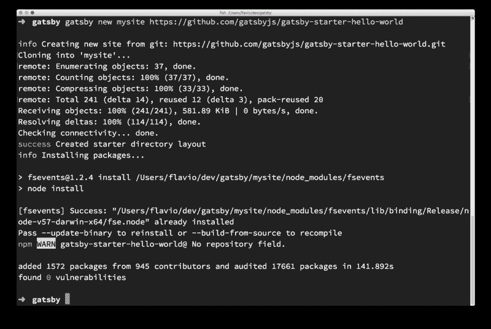**

**一个*启动器*是一个你可以在其上构建的样本站点。另一种常见的开胃菜是`default`，在[https://github.com/gatsbyjs/gatsby-starter-default](https://github.com/gatsbyjs/gatsby-starter-default)有售。**

> **[*在这里你可以找到所有你可以使用的首发名单*](https://www.gatsbyjs.org/docs/gatsby-starters/) *。***

#### **运行盖茨比网站**

**终端安装完启动器后，您可以通过调用**

```
`cd mysite
gatsby develop`
```

**这将启动一个新的 Web 服务器，并在本地主机的端口 8000 上为站点提供服务。**

**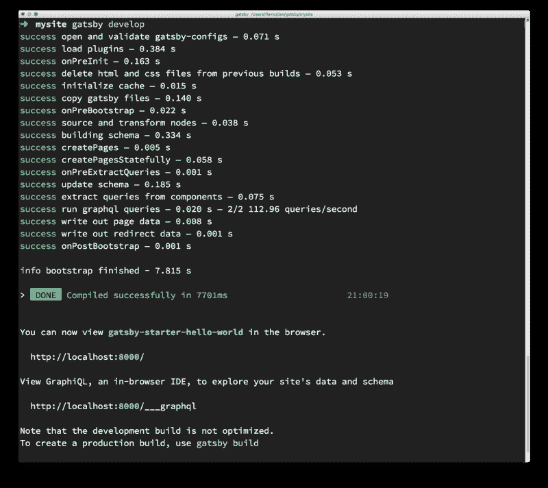**

**这是我们 Hello World 的启动程序:**

**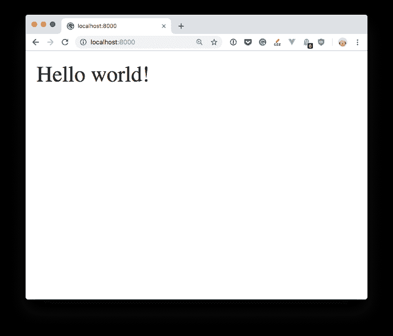**

### **检查现场**

**如果你用你最喜欢的代码编辑器打开你创建的网站(我用 [VS 代码](https://flaviocopes.com/vscode/)，你会发现有 3 个文件夹:**

*   **一个隐藏的文件夹，包含了 Gatsby 的内部信息，你现在不需要修改任何东西**
*   **`public`，它包含了构建后的结果网站**
*   **`src`包含 React 组件，在本例中只有`index`组件**
*   **其中将包含静态资源，如 CSS 和图片**

**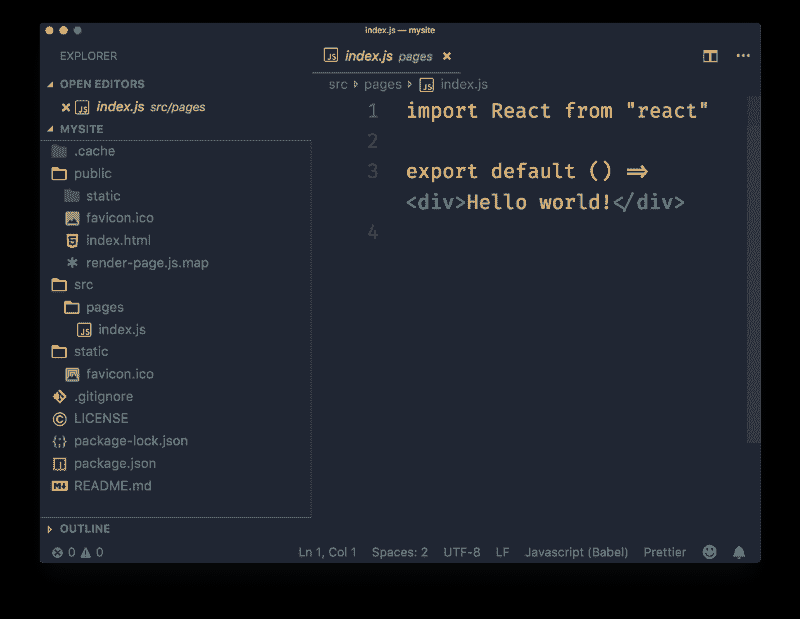**

**现在，对默认页面进行简单的更改很容易，只需打开`src/pages/index.js`并更改“Hello world！”到别的地方，然后保存。浏览器应该立即**热重新加载**组件(这意味着页面实际上没有刷新，但是内容发生了变化——底层技术使这一技巧成为可能)。**

**要添加第二页，只需创建另一页。js 文件，与`index.js`内容相同(调整内容)并保存。**

**例如，我创建了一个包含以下内容的`second.js`文件:**

```
`import React from 'react'

export default () => <div>Second page!</div>`
```

**而我打开浏览器到[http://localhost:8000/秒](http://localhost:8000/second):**

**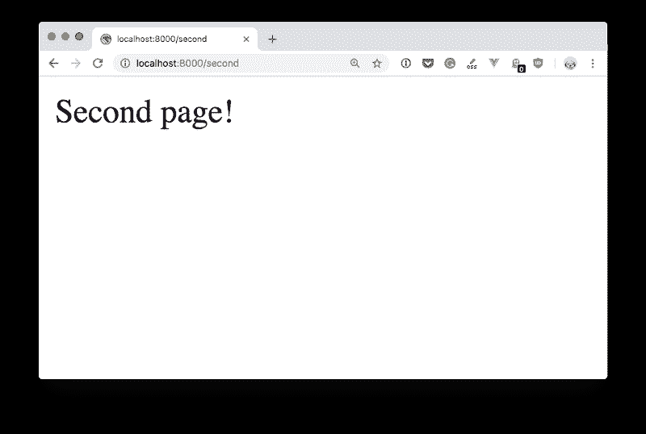**

#### **链接页面**

**您可以通过导入 Gatsby 提供的名为`Link`的 React 组件来链接这些页面:**

```
`import { Link } from "gatsby"`
```

**并在你的组件中使用它 [JSX](https://flaviocopes.com/jsx/) :**

```
`<Link to="/second/">Second&lt;/Link>`
```

#### **添加 CSS**

**您可以使用 JavaScript 导入来导入任何 CSS 文件:**

```
`import './index.css'`
```

**您可以使用 React 样式:**

```
`<p style={{
    margin: '0 auto',
    padding: '20px'
  }}>Hello world</p>`
```

#### **使用插件**

**Gatsby 提供了许多现成的东西，但是许多其他功能是由[插件](https://www.gatsbyjs.org/plugins/)提供的。**

**有 3 种插件:**

*   ****源插件**从源获取数据。创建可以被 transformer 插件过滤的节点**
*   ****transformer plugins** 将源插件提供的数据转换成盖茨比可以使用的东西**
*   **功能插件实现某种功能，比如添加网站地图支持等等**

**一些常用的插件有:**

*   **[盖茨比-插件-反应-头盔](https://www.gatsbyjs.org/packages/gatsby-plugin-react-helmet/)允许编辑`head`标签内容**
*   **[Gatsby-plugin-catch-links](https://www.gatsbyjs.org/packages/gatsby-plugin-catch-links/)使用[历史 API](https://flaviocopes.com/history-api/) 防止浏览器在点击链接时重新加载页面，而是使用 AJAX 加载新内容**

**Gatsby 插件分两步安装。首先使用`npm`安装它，然后在`gatsby-config.js`中将它添加到 Gatsby 配置中。**

**例如，您可以安装捕捉链接插件:**

```
`npm install gatsby-plugin-catch-links`
```

**在`gatsby-config.js`(如果没有，在网站根文件夹中创建)中，将插件添加到`plugins`导出的数组中:**

```
`module.exports = {
  plugins: ['gatsby-plugin-catch-links']
}`
```

**就这样，插件现在会做它的工作。**

#### **构建静态网站**

**一旦您完成了对站点的调整，并且想要生成生产静态站点，您将调用**

```
`gatsby build`
```

**此时，您可以通过使用以下命令启动一个本地 Web 服务器来检查它是否如您所期望的那样工作**

```
`gatsby serve`
```

**这将使网站尽可能接近您在生产中看到的样子。**

#### **部署**

**一旦您使用`gatsby build`构建了站点，您需要做的就是部署包含在`public`文件夹中的结果。**

**根据您选择的解决方案，您将需要不同的步骤，但通常您会推送到 Git 存储库，并让 Git 提交后挂钩完成部署工作。这里有一些关于一些流行的主机平台的很好的指南，你可以在这些平台上部署 Gatsby。**

### **包扎**

**我希望这本书已经帮助你开始使用 React，也许它在探索 React 编程的一些最高级方面给了你一个良好的开端。至少，这是我的希望。**

> **你可以在[reacthandbook.com](https://reacthandbook.com)获得 PDF、ePub 和 Mobi 格式的电子书**