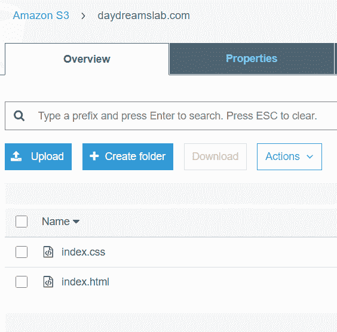
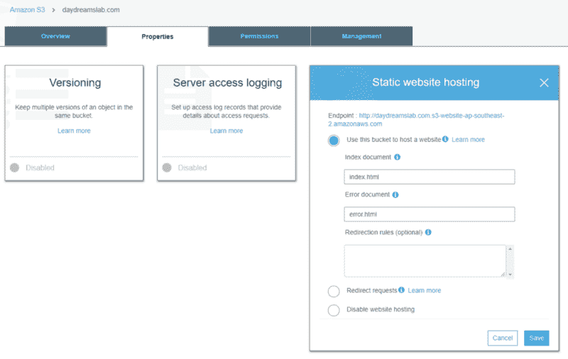
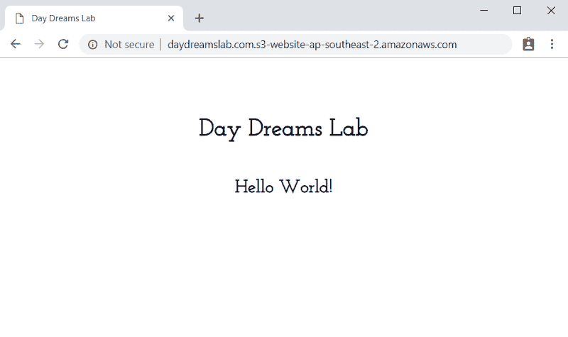
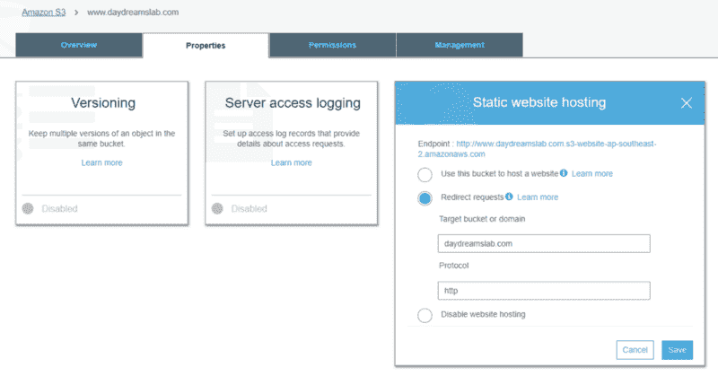
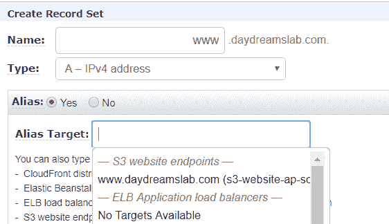
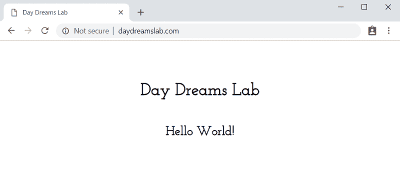
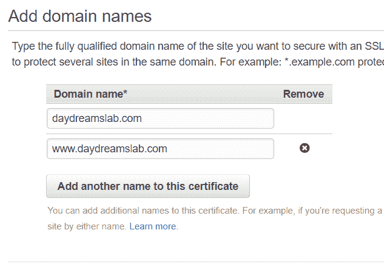
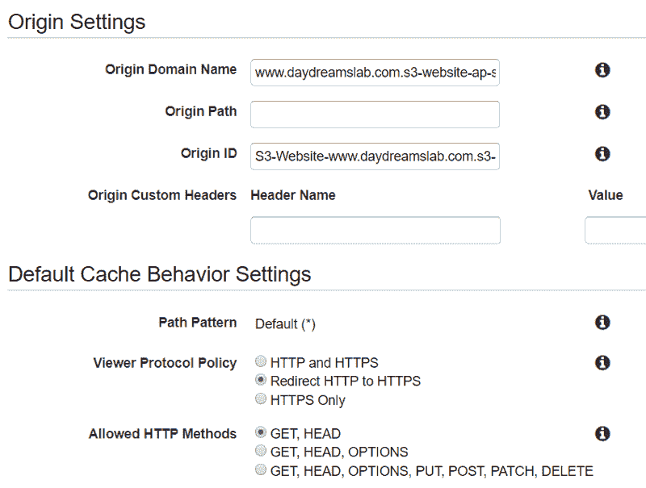
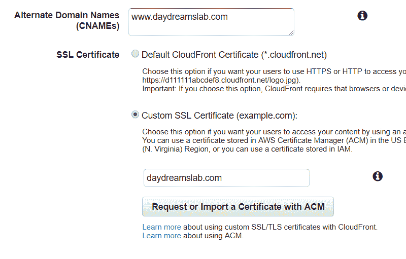
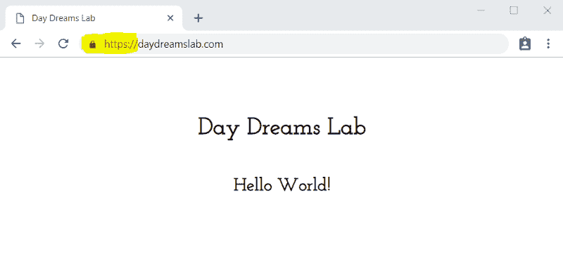

# 简单的网站托管与亚马逊 S3 和 HTTPS

> 原文：<https://www.freecodecamp.org/news/simple-site-hosting-with-amazon-s3-and-https-5e78017f482a/>

作者乔治亚·诺拉

# 简单的网站托管与亚马逊 S3 和 HTTPS


Photo by [Domenico Loia](https://unsplash.com/photos/0m-eVEm7mfo?utm_source=unsplash&utm_medium=referral&utm_content=creditCopyText) on [Unsplash](https://unsplash.com/search/photos/website?utm_source=unsplash&utm_medium=referral&utm_content=creditCopyText)

嗨伙计们！

在本教程中，我将向你展示如何在 AWS 上用 HTTPS 托管一个带有自定义域的静态网站。使用 AWS 免费层，所有这些都是可能的。

然而，我们将要使用的服务确实会产生一些小额费用。一般来说，这些不应该超过 1 美元/月。

我们将使用以下 AWS 服务的组合:
—S3
— Route53
—证书管理器
— CloudFront

让我们开始吧！

### 设置您的 S3 时段

首先，你需要**两个 S3 桶**，两者都应该匹配你的自定义域名，第二个包括 www 子域。

斗一:*mywebsite.com
斗二:*www.mywebsite.com**

**第一个桶(mywebsite.com)是您站点的主桶。这包含您的静态网站的所有文件和资产。**

****

**接下来，我们为静态站点托管设置这个桶。您可以在 bucket 的 Properties 选项卡下找到它，我们将保留这里提供的默认值，将站点索引设置为 index.html。**

****

**我们还需要使这个桶可以公开访问，因为用户的浏览器需要访问桶中的文件，以便呈现网站。我们可以通过在 Permissions 选项卡下设置一个存储桶策略来做到这一点。**

```
**`{       "Version": "2012-10-17",       "Statement": [        {            "Sid": "PublicReadGetObject",            "Effect": "Allow",            "Principal": "*",            "Action": "s3:GetObject",            "Resource": "MY_BUCKET_ARN"        }    ]}`**
```

**这是一个简单的策略，只允许桶中对象的公共读访问。现在，如果您前往 bucket 的静态主机配置中定义的端点，您应该会看到您的网站。**

****

**进步！但是我们可以做得更好。**

**第二个桶(www.mywebsite.com)我们将保留为空，但是配置为使用 HTTP 作为协议重定向到我们的第一个桶(稍后我们将使它成为 HTTPS)。**

**

Redirect requests back to the main bucket using HTTP protocol** 

**您的水桶现在可以使用了！**

### **使用 Route53 配置域**

**因此，您的网站已经启动并运行，但只能通过 bucket 端点访问，而不能通过您的自定义域访问。让我们改变这一点。**

**前往**路线 53** 。如果你已经向亚马逊注册商注册了你的域名，你应该会看到一个托管区已经为你设置了两个记录集。一个用于名称服务器(NS ),一个用于 SOA。**

**我们需要做的就是再创建两个记录集，指向 S3 存储桶端点。**

**对于每个记录集:
—类型:A — IPv4 地址
—别名:是
—别名目标:与您设置的名称相匹配的 S3 网站端点。**

**

Creating a record set for www subdomain** 

**现在我们可以前往自定义网址…瞧！我们就快成功了，但是我们还缺少最后一样东西…**

****

****注意**:如果你的域名注册了另一个域名注册商(不是亚马逊)，你需要按照一些不同的步骤进行设置。通常，您需要添加一个具有主 S3 存储桶端点值的 CNAME 记录。**

****故障排除** :
如果你删除了亚马逊在你第一次注册域名时创建的托管区域(我这样做是因为托管区域会产生一些费用)，你需要从头开始创建一个新的托管区域。**

1.  **选择“创建托管区域”并设置域名，例如“mywebsite.com”**
2.  **这将为 NS 和 SOA 类型生成一些新的记录集。**
3.  **进入您的注册域，将名称服务器的值更新为新的 NS 记录集中生成的值。**

### **请求证书**

**太棒了，该网站现在使用自定义网址托管！然而，我们只能通过 HTTP 协议访问它。我们应该始终使用 HTTPS 协议来确保我们站点的安全。这保护我们的网站和用户免受恶意注入攻击，并保证真实性。**

**前往 AWS 控制台中的**证书管理器**并请求一个新的公共证书(这是免费的)。系统会提示您输入想要保护的域名。**

****

**在颁发证书之前，Amazon 需要能够验证您拥有指定的域名。**

**您可以选择两种验证方法:电子邮件或 DNS。**

**电子邮件通常更简单，但你需要确保你可以访问用于注册域名的电子邮件。或者，如果您使用 Amazon Registrar 和 Route53，您可以选择 DNS 方法。这需要您向托管区域添加一些特定的记录集，但这基本上是自动完成的，所以非常简单。**

**验证后可能需要几分钟才能颁发证书。完成后，我们可以继续最后一步了！**

### **配置 CloudFront**

**最后一步，我们将使用 **CloudFront** ，它允许我们使用新的 SSL 证书为 HTTPS 网站提供服务。CloudFront 还通过将 web 内容存储在多个边缘位置并从最近的边缘位置交付给用户来加速 web 内容的分发。**

**我们需要**两个新的网络分布**，每个 S3 桶一个。在 AWS 控制台中转到 CloudFront，创建第一个 web 发行版。
有很多设置可以用来创建一个网络分销，但是对于基本的，我们只需要改变五个:**

1.  ****源域名**:设置为其中一个桶的 S3 网站端点。**重要提示**:该字段将为您提供一些自动填写 S3 桶名的选项。但是，使用这些会导致重定向到 bucket 端点的问题。因此，请直接使用 bucket 端点。**
2.  ****原点 Id** :输入原点域名时自动填充。**
3.  ****浏览器协议策略**:设置为“重定向 HTTP 到 HTTPS”。**
4.  ****备用域名**:这应该与你所指向的 S3 域名相匹配。例如“mywebsite.com”。**
5.  ****SSL 证书**:选择“自定义 SSL 证书”并从下拉列表中选择您的新证书。**

**对第二个 S3 桶再做一次。**

********

**发行版可能需要一段时间才能启动，所以在我们等待的时候，让我们完成最后的步骤。**

**回到 **S3** ，转到您的二级存储桶(www.mywebsite.com)，在属性选项卡和静态网站托管下，将重定向协议设置为 HTTPS。**

**最后，返回**路线 53** 。我们需要更新我们创建的自定义 A 记录，以现在针对 CloudFront 发行版而不是 S3 存储桶。对于每条记录，更改别名目标并在下拉列表中选择可用的 CloudFront 发行版。**

**注意:同样，如果您使用另一个 DNS 服务，您需要从那里更新 CNAME 记录，以指向 CloudFront 域名。**

**

Huzzah!** 

**现在你知道了！您美丽的网站现在可以在自定义域和 HTTPS 服务！**

**

[From Giphy](https://giphy.com)** 

**感谢阅读！我希望这个指南是有用的和令人愉快的，我想知道你是否觉得它有帮助。**