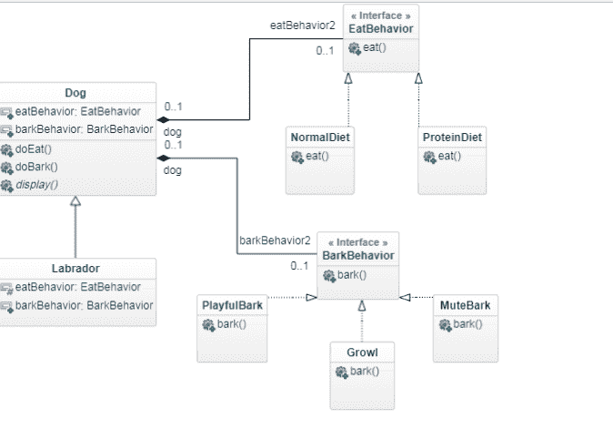

# 用 Java 解释的策略模式

> 原文：<https://www.freecodecamp.org/news/the-strategy-pattern-explained-using-java-bc30542204e0/>

阿卜杜勒·卡迪尔

# 用 Java 解释的策略模式


在这篇文章中，我将谈论一种流行的设计模式——策略模式。如果您还没有意识到，设计模式是由软件行业中的知名人士创建的一系列面向对象编程原则，通常被称为[四人组(GoF)](https://en.wikipedia.org/wiki/Design_Patterns) 。这些设计模式已经对软件生态系统产生了巨大的影响，并被用于解决面向对象编程中面临的常见问题。

让我们正式定义策略模式:

> 策略模式定义了一系列算法，封装了每一个算法，并使它们可以互换。策略让算法独立于使用它的客户端而变化

好了，现在让我们深入一些代码来理解这些单词的真正含义。我们将举一个有潜在陷阱的例子，然后应用策略模式来看看它是如何克服问题的。

我将向你展示如何创建一个 dope dog 模拟器程序来学习策略模式。我们的类看起来是这样的:一个具有公共行为的“Dog”超类，然后通过子类化 Dog 类来创建 Dog 的具体类。

#### 下面是代码的样子

```
public abstract class Dog {
public abstract void display(); //different dogs have different looks!

public void eat(){}
public void bark(){} 
// Other dog-like methods
...
}
```

display()方法是抽象的，因为不同的狗有不同的外观。所有其他子类将继承 eat 和 bark 行为，或者用自己的实现覆盖它。到目前为止一切顺利！

现在，如果你想添加一些新的行为呢？假设你需要一只酷酷的机器狗，它能做各种各样的把戏。没问题，我们只需要在我们的 Dog 超类中添加一个 performTricks()方法就可以了。

但是等一下……机器狗应该不会吃东西吧？无生命的物体当然不能吃东西。好吧，那我们怎么解决这个问题？好吧，我们可以覆盖 eat()方法不做任何事情，它工作得很好！

```
public class RobotDog extends Dog {
@override
public void eat(){} // Do nothing

}
```

做得好！现在机器狗不能吃东西，它们只能叫或者表演戏法。那么橡胶狗呢？他们不能吃东西，也不能表演魔术。木头狗不能吃东西，不能叫，也不能表演戏法。我们不可能总是覆盖方法而什么都不做，这不干净，而且感觉很糟糕。想象一下，在一个设计规范每隔几个月就不断变化的项目中这样做。我们的只是一个天真的例子，但你会明白的。所以，我们需要找到一种更清洁的方法来解决这个问题。

#### 界面能解决我们的问题吗？

界面怎么样？让我们看看他们是否能解决我们的问题。好了，我们创建了一个 CanEat 和一个 CanBark 接口:

```
interface CanEat {
public void eat();

}

interface CanBark {
public void bark();

}
```

我们现在已经从 Dog 超类中移除了 bark()和 eat()方法，并将它们添加到各自的接口中。因此，只有会叫的狗才会实现 can bark 接口，会吃的狗才会实现 can eat 接口。现在，不用再担心狗会遗传它们不该遗传的行为，我们的问题解决了…或者是吗？

当我们不得不改变狗的饮食行为时会发生什么？让我们说，从现在开始，每只狗都必须在它们的食物中加入一定量的蛋白质。您现在必须修改 Dog 的所有子类的 eat()方法。如果有 50 个这样的班级，那该多恐怖啊！

因此，界面只是部分解决了我们的问题，即狗只能做它们有能力做的事情——但它们完全产生了另一个问题。接口没有任何实现代码，所以代码的可重用性为零，并且有可能出现大量重复代码。你会问我们如何解决这个问题？战略模式来拯救！

### 战略模式

所以我们会一步一步来。在我们继续之前，让我向您介绍一个设计原则:

> 找出你程序中变化的部分，并把它们与保持不变的部分分开。

这实际上非常简单——原则是分离和“封装”任何频繁更改的代码，以便所有更改的代码都在一个地方。通过这种方式，改变的代码不会对程序的其余部分产生任何影响，我们的应用程序也更加灵活和健壮。

在我们的例子中,“吠”和“吃”行为可以从 Dog 类中去掉，并可以封装在其他地方。我们知道这些行为在不同的狗之间有所不同，它们必须有自己单独的类别。

除了 Dog 类之外，我们将创建两组类，一组用于定义进食行为，另一组用于定义吠叫行为。我们将利用接口来表示行为，如“EatBehavior”和“BarkBehavior ”,具体的行为类将实现这些接口。所以，Dog 类不再实现接口了。我们正在创建单独的类，它们唯一的工作就是表示特定的行为！

#### 这是 EatBehavior 接口的样子

```
interface EatBehavior {
public void eat();
}
```

#### 和树皮行为

```
interface BarkBehavior {
public void bark();
}
```

所有代表这些行为的类都将实现各自的接口。

#### BarkBehavior 的具体类

```
public class PlayfulBark implements BarkBehavior {
 @override
 public void bark(){
 System.out.println("Bark! Bark!");
 }
}

public class Growl implements BarkBehavior {
 @override
 public void bark(){
  System.out.println("This is a growl");
 }

public class MuteBark implements BarkBehavior {
 @override
 public void bark(){
  System.out.println("This is a mute bark");
 }
```

#### EatBehavior 的具体类

```
public class NormalDiet implements EatBehavior {
@override
 public void eat(){
   System.out.println("This is a normal diet");
 }
}

public class ProteinDiet implements EatBehavior {
@override
 public void eat(){
   System.out.println("This is a protein diet");
 }
}
```

现在，当我们通过子类化“Dog”超类来实现具体的实现时，我们自然希望能够将行为动态地分配给 Dog 的实例。毕竟，是先前代码的不灵活性导致了这个问题。我们可以在 Dog 子类上定义 setter 方法，这将允许我们在运行时设置不同的行为。

这让我们想到了另一个设计原则:

> 编程到一个接口而不是一个实现。

这意味着我们不使用具体的类，而是使用这些类的超类型变量。换句话说，我们使用 EatBehavior 和 BarkBehavior 类型的变量，并将这些变量分配给实现这些行为的类的对象。这样，Dog 类不需要任何关于这些变量的实际对象类型的信息！

为了让这个概念更清晰，这里有一个区分这两种方式的例子——考虑一个抽象的动物类，它有两个具体的实现，狗和猫。

对实现的编程应该是:

```
Dog d = new Dog();
d.bark();
```

下面是界面编程的样子:

```
Animal animal = new Dog();
animal.animalSound();
```

在这里，我们知道 animal 包含一个“Dog”的实例，但是我们可以在代码中的其他任何地方使用这个引用。我们所关心的是 animal 实例能够响应 animalSound()方法，并根据所分配的对象调用适当的方法。

那是很难接受的。没有进一步的解释，让我们看看我们的“狗”超类现在是什么样子:

```
public abstract class Dog {
EatBehavior eatBehavior;
BarkBehaviour barkBehavior;

public Dog(){}

public void doBark() {
 barkBehavior.bark();
 }

public void doEat() {
eatBehavior.eat();
 }
}
```

密切注意这个类的方法。Dog 类现在“委托”了吃和叫的任务，而不是自己实现或继承它(子类)。在 doBark()方法中，我们简单地对 BarkBehavior 引用的对象调用 bark()方法。现在，我们不关心对象的实际类型，我们只关心它是否知道如何吠叫！

现在是关键时刻，让我们创造一只混凝土狗！

```
public class Labrador extends Dog {

public Labrador(){
  barkBehavior = new PlayfulBark();
  eatBehavior = new NormalDiet();
 }

public void display(){
  System.out.println("I'm a playful Labrador");
 } 
...
}
```

Labrador 类的构造函数中发生了什么？我们将具体的实例分配给超类型(记住接口类型是从 Dog 超类继承的)。现在，当我们在 Labrador 实例上调用 doEat()时，责任被移交给 ProteinDiet 类，它执行 Eat()方法。

#### 行动中的战略模式

好吧，让我们看看实际情况。是时候运行我们的 dope Dog 模拟器程序了！

```
public class DogSimulatorApp {
 public static void main(String[] args) {
  Dog lab = new Labrador();

  lab.doEat(); // Prints "This is a normal diet"
  lab.doBark(); // "Bark! Bark!" 
 }
}
```

怎样才能让这个节目更好？通过增加灵活性！让我们在 Dog 类上添加 setter 方法，以便能够在运行时交换行为。让我们给 Dog 超类再添加两个方法:

```
public void setEatBehavior(EatBehavior eb){
 eatBehavior = eb;
}

public void setBarkBehavior(BarkBehavior bb){
 barkBehavior = bb;
}
```

现在我们可以修改我们的程序，并在运行时选择我们喜欢的任何行为！

```
public class DogSimulatorApp {
 public static void main(String[] args){
  Dog lab = new Labrador();

  lab.doEat(); // This is a normal diet
  lab.setEatBehavior(new ProteinDiet());
  lab.doEat(); // This is a protein diet

lab.doBark(); // Bark! Bark!
 }
}
```

让我们来看看大图:



Class Diagram

我们有 Dog 超类和“Labrador”类，它是 Dog 的一个子类。然后，我们将算法(行为)家族与它们各自的行为类型“封装”在一起。

看一下我一开始给出的形式定义:算法不过是行为接口。现在它们不仅可以在这个程序中使用，而且其他程序也可以使用它。注意图中类之间的关系。从图中可以推断出 IS-A 和 HAS-A 的关系。

就是这样！我希望您已经对策略模式有了一个大致的了解。当你的应用程序中有不断变化的行为时，策略模式是非常有用的。

这就把我们带到了 Java 实现的结尾。非常感谢你一直支持我！如果你有兴趣了解 Kotlin 版本，请关注下一篇文章。我谈到了有趣的语言特性，以及如何在一个 Kotlin 文件中减少上述所有代码:)

### 页（page 的缩写）S

我读过 [Head First 设计模式的书](https://www.oreilly.com/library/view/head-first-design/0596007124/)，这篇文章的大部分灵感都来自于它的内容。我强烈推荐这本书给任何正在寻找设计模式的温和介绍的人。