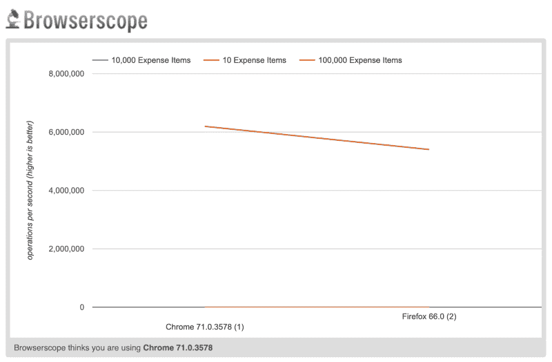
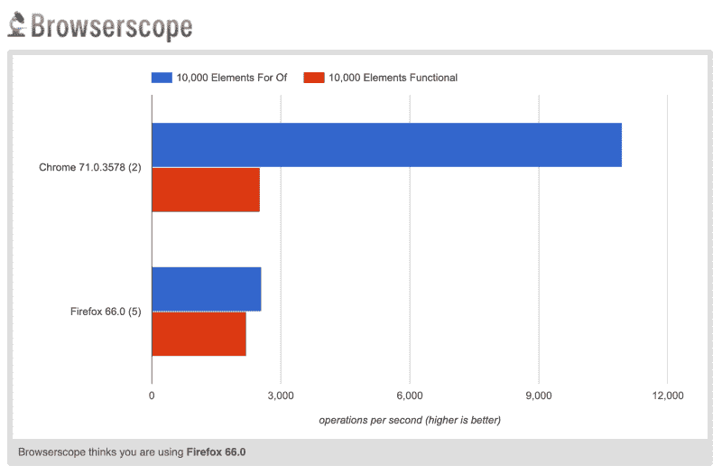

# 小心 JavaScript 中的链式数组方法

> 原文：<https://www.freecodecamp.org/news/beware-of-chaining-array-methods-in-javascript-ef3983b60fbc/>

巴拉加内什·达莫达兰

JavaScript 的 Array 类公开了相当多的方法(filter、map、reduce)，这些方法遍历数组并调用迭代器函数对数组执行操作。将这些方法链接起来，可以让你写出清晰易读的代码。但是这种便利在性能方面让我们付出了什么代价，值得吗？


Javascript 是一种“函数式”语言。这意味着函数是 Javascript 中的第一类对象，因此它们可以作为参数传递给其他函数。Javascript 标准库提供了相当多的内置方法，这些方法利用了这一事实，使我们能够编写干净、易懂、易读的代码。

#### 内置 Javascript 数组方法和链接

一个这样的内置类是`Array`类，它广泛利用了 Javascript 的功能特性。Javascript 中的公开了许多实例方法，它们:

*   接受一个函数作为参数，
*   迭代数组，
*   并调用函数，将数组项作为参数传递给函数。

其中最受欢迎的当然是`forEach`、`filter`、`map`和`reduce`。由于其中一些方法也返回`Array`实例作为方法的返回值，所以它们通常像这样链接在一起:

```
const tripExpenses = [{    amount: 12.07,    currency: 'USD',    paid: true}, {    amount: 1.12,    currency: 'USD',    paid: true}, {    amount: 112.00,    currency: 'INR',    paid: false}, {    amount: 54.17,    currency: 'USD',    paid: true}, {    amount: 16.50,    currency: 'USD',    paid: true}, {    amount: 189.50,    currency: 'INR',    paid: false}];
```

```
const totalPaidExpensesInINR = tripExpenses    .filter(expense => expense.paid)    .map(expense => {        if(expense.currency == 'USD')            return expense.amount * 70;        else            return expense.amount;    })    .reduce((amountA, amountB) => amountA + amountB);
```

在本例中，我们在将美元转换为印度卢比后计算总支付费用。为此，我们:

*   `filter` ing `tripExpenses`只提取已支付的费用，
*   `map` ping 指定货币的费用金额，并将其转换为印度卢比，以及
*   `reduce`计算印度卢比的数量以获得总和。

看起来像是链接数组方法的一个常见的、非常典型的、有效的用例，对吗？当被要求解决这个问题时，许多学习过编写函数式 Javascript 的开发人员会得出类似的结论。

#### 数组方法链接的问题

目前，我们的`tripExpenses`数组只有 6 项，所以这是相对较快的。但是，当我们必须分析，比如说，整个公司的员工在整个财政年度的旅行费用，并且我们的`tripExpenses`数组开始有成千上万的元素时，会发生什么呢？

多亏了 JSPerf，我们可以很容易地将这个成本可视化。因此，让我们对相同的代码运行一个比较测试，其中`tripExpenses`有 10 个元素、10，000 个元素和 100，000 个元素。下面是 [JSPerf 对比](https://jsperf.com/array-operations-builtin-vs-foreach/1)的结果:



图表显示了每秒的操作次数，越高越好。虽然我预计 100，000 个元素的情况会表现不佳，但我真的没有想到 10，000 个元素的情况会表现如此之差。因为在图表上看不出来，所以我们来看看数字:

*   10 个元素—每秒 6，142，739 次运算
*   10，000 个元素—每秒 2，199 次运算
*   100，000 个元素—每秒 223 次运算

呀，真糟糕！虽然处理 100，000 个元素的数组可能不会经常发生，但 10，000 个元素是一个非常合理的用例，我在自己开发的多个应用程序中经常看到这种情况(主要在服务器端)。

这向我们表明，当我们编写——即使是看起来很简单的代码——时，我们真的应该警惕任何可能因为我们编写代码的方式而突然出现的性能问题。

如果我们不把`filter`、`map`和`reduce`方法链接在一起，而是重写代码，让所有的工作都在一个循环中内联完成，我们可以获得明显更好的性能。

```
let totalPaidExpensesInINR = 0;
```

```
for(let expense of tripExpenses){    if(expense.paid){        if(expense.currency == 'USD')            totalPaidExpensesInINR += (expense.amount * 70);        else            totalPaidExpensesInINR += expense.amount;    }}
```

让我们运行另一个 [JSPerf 比较](https://jsperf.com/functional-vs-for-of-array-methods/1),看看在一个 10，000 个元素的测试中，它的表现如何:



如你所见，在 Chrome 上(以及通过扩展节点。JS)，函数示例比 for-of 示例慢了 77%。在 Firefox 上，数字要接近得多，但是函数示例仍然比 for-of 示例慢 16%。

#### 为什么会有如此大的性能差异？

那么，为什么函数示例比 for-of 示例慢这么多呢？这是多种因素的结合，但作为开发商，我们可以从用户土地上控制的主要因素有:

*   多次循环相同的数组元素。
*   函数示例中每次迭代的函数调用开销。

如果您看到 for-of 示例，您将会看到我们只遍历了一次`tripExpenses`数组。此外，我们不从内部调用函数，而是内联执行计算。

现代 Javascript 引擎获得的一大性能“胜利”是通过内联函数调用。这意味着引擎实际上将你的代码编译成一个版本，在这个版本中，编译器用函数本身代替函数调用(即，在你调用函数的地方内联)。这消除了调用函数的开销，并提供了巨大的性能增益。

然而，我们不能总是肯定地说一个 Javascript 引擎是否会选择内联一个函数，所以我们自己做可以确保我们有最好的性能。

### 结论

一些开发人员可能认为 for-of 示例比函数示例可读性更差，更难理解。对于这个特殊的例子，我认为两种风格都同样可读。然而，在函数示例的情况下，方法链接的便利性倾向于对开发人员隐藏多次迭代和函数调用，从而使得没有经验的开发人员很容易编写非性能代码。

我并不是说你应该总是避免函数式方法——我相信有很多有效的例子可以使用函数式方法和链接方法。但是，在 Javascript 中，当涉及到性能和迭代数组时，要记住的一个通用经验法则是，如果您正在链接遍历整个数组的方法，您可能应该在继续之前停下来考虑性能影响。

我很想听听你对我在这篇文章中所写内容的看法。请在下面发表你的评论。

#### [2019 年 2 月 6 日]正如评论者指出的，一些警告和需要记住的事情

正如[由](https://medium.com/@paul.beynon/thanks-for-taking-the-time-to-write-the-article-i-enjoyed-it-db916026647)[保罗 B](https://www.freecodecamp.org/news/beware-of-chaining-array-methods-in-javascript-ef3983b60fbc/undefined)指出的那样，当在浏览器中以透明形式使用‘for…of’时，性能会受到影响，但是你总是可以使用带有迭代器变量的普通 for 循环来解决这个问题。然而，正如 Paul 所说，坚持使用迭代器函数有很多好处。一定要去读读[的评论，](https://medium.com/@paul.beynon/thanks-for-taking-the-time-to-write-the-article-i-enjoyed-it-db916026647)它本身就值得成为一篇文章。

此外，许多人也一直在说这将是过早的优化或微优化，我确实部分同意他们的观点。一般来说，你应该始终优化可读性和可维护性而不是性能，直到糟糕的性能真正开始影响你。一旦你达到这一点，那么你可能要重新考虑你的迭代器。

*最初发布于 2019 年 1 月 8 日[asleepysamurai.com](https://asleepysamurai.com/articles/beware-chaining-array-methods-javascript?ref=medium)。*