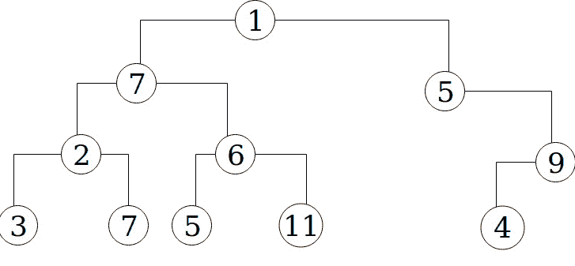

# 如何用递归方法计算二叉树的高度

> 原文：<https://www.freecodecamp.org/news/how-to-calculate-binary-tree-height-with-the-recursive-method-aafc461f2201/>

之前我写了一个使用迭代找出二叉树[高度的算法。虽然这种方法可以完成工作(至少 7 步)，但同样的事情可以用更简单的方法来完成。](https://medium.freecodecamp.org/how-to-calculate-a-binary-trees-height-using-array-iteration-in-ruby-63551c6c65fe)

在我看来，最强大的编程技术之一是递归。对于编程新手来说，这只是一个调用自身的函数或方法。为了使介绍更简单，下面我们有一个调用另一个方法的方法:

```
def outer_method(name)       (R1)
  inner_method + name
end
def inner_method             (R2)
  "Hello "
end
print outer_method("Steve") -> #"Hello Steve"
```

在上面的方法`outer_method`中，它接受一个字符串作为参数，调用`inner_method`，它简单地返回其中的字符串`“Hello “`。递归的相似之处在于，在这种情况下，`outer_method`简单地调用自己:

```
def outer_method(name)              (R3)
  outer_method("hello ") + name
end (R3)
```

不过，对于上面的代码`R3`,有一点需要注意——它将一直运行，直到计算机抱怨资源不足以继续处理该方法。这就像运行一个无限循环，只不过无限循环不一定会引发异常。这是因为代码`R3`没有“终结状态”或不再“递归”的点。

我们可以通过包含一个终止状态来解决这个问题:

```
def outer_method(name)                 (R4)
  return name if name == "hello "
  outer_method("hello ") + name
end
```

方法定义中的第一行简单地声明，如果参数`name`等于`‘hello’`，那么简单地返回`name`。这将忽略它后面的任何一行。因此，在第二行中，代码`outer_method(“hello “)`将简单地给出一个字符串“hello ”,将其添加到主参数中的任何名称上。所以同样的`print outer_method(“Steve”)`也会导致输出`“hello Steve”`。

好吧，这可能不是描述递归的最佳例子(因为在这种情况下，递归版本并没有非递归版本那么大的优势)。但是在二叉树高度问题上，我们会看到递归更容易理解，运行更快。

对于这个讨论，让我再举一个我在上一篇文章中展示过的例子:



Figure 1: Simple binary tree

我们可以用下面的数组来表示:

```
tree = [1, 7, 5, 2, 6, 0, 9, 3, 7, 5, 11, 0, 0, 4, 0] (T0)
```

任何子树的左子树和右子树的索引可以确定如下:

```
left child of tree[i] is at index 2*i + 1 (T1)
right child of tree[i] is at index 2*i + 2 (T2)
```

如果你对上面的图是如何变成它后面的数组感到困惑，我会指引你阅读[上一篇关于迭代方法的文章](https://medium.freecodecamp.org/how-to-calculate-a-binary-trees-height-using-array-iteration-in-ruby-63551c6c65fe)以得到澄清。

同样，计算二叉树高度及其任何子树高度的公式是:

```
height = 1 + max of(left_child_height, right_child_height) (T3) 
```

现在有了这些，我们可以概述开发递归程序的步骤。

**步骤 0:** 设置默认值——为了使最初的方法调用简单，我总是喜欢为每次递归调用期间会改变的参数设置默认值。由于我们将重复计算高度，我们的指数将始终变化。

例如，要找到根的(`tree[0]`)左子节点的高度，我们需要调用左子节点的方法(其索引在`2*(0) + 1`)。因此，我们的方法定义将是:

```
def tree_height_recursive(tree_array,i=0) (S0.1)
```

以表明对于初始调用，我们在根元素上调用它。这将只允许我们通过输入 tree_array 来调用`tree_height_recursive`。然而，这也意味着，正如我们将在后面的模拟中看到的，我们可以通过简单地将它的索引作为方法调用中的第二个参数来找到任何子树的高度。

**步骤 1:** 找到终端状态——此时我们只是返回一个值，而不做任何进一步的递归调用？在我们的二叉树问题中，终端状态是:

```
return 0 if tree[i].nil or tree[i] == 0 (S1.1)
```

它只是说，如果索引`i`处的元素不存在，或者如果它的值为 0，那么简单地返回 0。逻辑上，不存在的子树没有任何高度。

第二步:找出左边孩子的身高——这就是递归的魔力开始让我们受益的地方。我们不需要任何花哨的代码。不再需要声明另一个数组来保存每个元素的高度。高度指数和高度本身不再有多个变量定义，只是:

```
right_child_height = tree_height_recursive(tree_array, 2*i + 2) 
```

我们简单地将左边孩子的索引作为第二个参数传递。你能看出为什么吗？

接下来，我们用同样的方法找到合适的孩子的身高。

**步骤 3:** 找到右孩子的高度——同样，我们简单地对我们的方法进行递归调用，但是将右孩子的索引作为第二个参数传递:

```
right_child_height = tree_height_recursive(tree_array, 2*i + 2) 
```

现在我们有了左右孩子的身高，我们现在可以计算总身高。

**第四步:**计算并返回总身高——正如代码`T3`所述，我们只需将 1 和左右孩子中较高者的身高相加。

```
total_height = 1 + [left_child_height, right_child_height].max (S4.1)
```

因为`S.4`将是我们方法中的最后一条语句，所以计算后的`total_height`将被返回。请记住，如果`S1.1`中的条件为真(我们的终端状态)，那么步骤 2-4 都不会运行，方法将简单地返回 0。

完整的方法如下:

与[迭代方法](https://medium.freecodecamp.org/how-to-calculate-a-binary-trees-height-using-array-iteration-in-ruby-63551c6c65fe)相比，递归版本少了 3 个步骤和 4 个变量定义。代码(不包括空格和注释)也少了 7 行。在此基础上，递归代码的运行速度将提高 2 倍(使用`benchmark`内置的 Ruby 模块)。如果我们在几百层的二叉树上运行这个方法，这是一个很大的优势。

现在让我们做和以前一样的模拟。对于在`T0`的树，我们运行递归方法:

```
tree = [1, 7, 5, 2, 6, 0, 9, 3, 7, 5, 11, 0, 0, 4, 0]
```

```
puts tree_height_recursive(tree_array)-> #should give us 4
```

注意，由于我们在方法定义中有一个默认的`i=0`，我们不需要在这里指定索引，因为我们正在寻找整棵树的高度。为了使这个模拟更加直观，我们将创建一个名为`call_stack`的虚拟数组，在这里将每个调用推送到`tree_height_recursive`。

因此，当我们第一次调用该方法(主调用)时，我们将它存储在一个临时变量`ht_0`中，并将其推送到`call_stack`:

```
ht_0 = height of tree[0] = tree_height_recursive(tree_array,i=0)
```

```
call_stack = [ht_0]
```

然后，我们运行步骤 1:

```
tree[0].nil? -> #falsetree[0] == 0 -> #false, it is 2
```

由于这导致了`false`，我们继续到步骤 2:

```
since i= 0, then 2*i + 1 = 2*0 + 1 = 1:
```

```
left_child_height = tree_height_recursive(tree_array,1)
```

因为我们无法轻易确定这个高度，所以我们再次将其推至`call_stack`:

```
ht_1 = left_child_height = tree_height_recursive(tree_array,1)
```

```
call_stack = [ht_0,ht_1]
```

然后在执行步骤 3 时:

```
ht_2 = right_child_height = left_child_height = tree_height_recursive(tree_array,)
```

```
call_stack = [ht0,ht1,ht2]
```

在我们的程序评估完`call_stack`中的所有项目并从`call_stack`中弹出之前，我们无法进行第 4 步(每次评估每个高度时都会出现这种情况)。

因此，我们也将为每个后续的高度做同样的事情。例如，为了计算`ht1`,我们知道我们也必须计算它自己的左右孩子的身高。这意味着这个方法也会被调用。为了不延长这篇文章，请读者在纸上尝试一下。

最终，该方法将被递归调用，并将`i = 14`作为第二个参数。因此，此时，`call_stack`将是:

```
call_stack = [ht0,ht1,ht2,ht3,ht4,ht5,ht6,ht7,ht8,ht9,ht10,ht11,ht12,ht13,ht14]
```

现在我们将评估每一个。注意从`tree[7]`到`tree[14]`元素没有任何子元素。所以我们可以简单的把它们的高度评价为 1 或者 0(取决于`tree[i]`是否为 0(其中`i ≥ 7`):

```
ht14 = 0
```

```
ht13 = 1
```

```
ht12 = 0
```

```
ht11 = 0
```

```
ht10 = 1
```

```
ht9 = 1
```

```
ht8 = 1
```

```
ht7 = 1
```

同样，当评估这些高度时，我们简单地从`call_stack.`开始连续弹出它们，之后，`call_stack`将如下所示:

```
call_stack = [ht0, ht1, ht2, ht3, ht4, ht5, ht6]
```

现在，为了评估`ht6`，我们必须记住它是对`tree_height_recursive(tree_array, 6)`的调用。在这个调用中，我们还调用了计算`tree[6]`左右孩子身高的方法。这些我们之前已经评估为`ht13`和`ht14`。那么:

```
ht6 = 1 + [ht13, ht14].max = 1 + [1,0] = 1 + 1 = 2
```

所以我们现在评价`ht5`，就是`tree[5]`的高度。我们知道它的孩子的身高是`ht11`和`ht12`

```
ht5 = 1 + [ht11,ht12].max = 1 + [0,0].max = 1 + 0 = 1
```

对`ht4`至`h1`进行同样的操作(再次请读者在纸上确认):

```
ht4 = 1 + [ht9,ht10].max = 1 + [1,1].max = 1 + 1 = 2
```

```
ht3 = 1 + [ht7, ht8].max = 1 + [1, 1].max = 1 + 1 = 2
```

```
ht2 = 1 + [ht5, ht6].max = 1 + [1,2].max = 1 + 2 = 3
```

```
ht1 = 1 + [ht3, ht4].max = 1 + [2,2].max = 1 + 3 = 3
```

同样，我们在评估时从`call_stack`弹出每个高度，因此在评估`ht1`后，`call_stack`如下所示:

```
call_stack = [ht0]
```

现在评估`ht0`是返回到对`tree_height_recursive`的主调用，所以这是剩余的步骤 4:

```
ht0 = 1 + [ht1, ht2].max = 1 + [3, 3].max = 1 + 3 = 4ortotal_height = 1 + [left_child_height, right_child_height].max
```

它将返回`4`作为 main 方法调用的结果。

正如我一直提到的，无论是在算法制定期间还是在仿真期间，在纸上做这些都会对理解它有很大帮助。同样的方法也可以用来确定`tree_array`中任何子树的高度，例如，只确定树的左子树的高度:

```
puts tree_height_recursive(tree_array, 1) -> #will print out 3
```

或任何较低的子树:

```
puts tree_height_recursive(tree_array, 3) -> #will print out 2
```

#### 包扎

在我看来，创建递归算法的关键是设置终端状态。同样，在这种情况下，main 方法不必对自身进行任何递归调用。如果没有这个，这个方法就会一直调用自己，直到计算机崩溃(夸张地说…)。当我们有了终端状态，我们可以很容易地为递归调用设置参数，并且知道我们的方法将安全地返回我们期望的值。

最后，研究算法挑战我们的思维。作为软件工程师，甚至一般意义上的工程师，我们的主要任务是解决问题。因此，我们需要发展我们的批判性思维技能。

如果对于一个问题，我们的第一选择总是“谷歌一下”，在没有完全理解问题和复制的解决方案的情况下复制/粘贴别人的代码，那么我们就是在打败自己。

所以我的建议是，当面临算法挑战时，总是准备好笔和纸，而不是立即键入代码。模拟简单输入的问题，然后在确定步骤后拿出代码(就像我上面概述的那样)。

**关注我**上 [**推特**](https://twitter.com/coachryanv) | [**Github**](https://github.com/rvvergara)