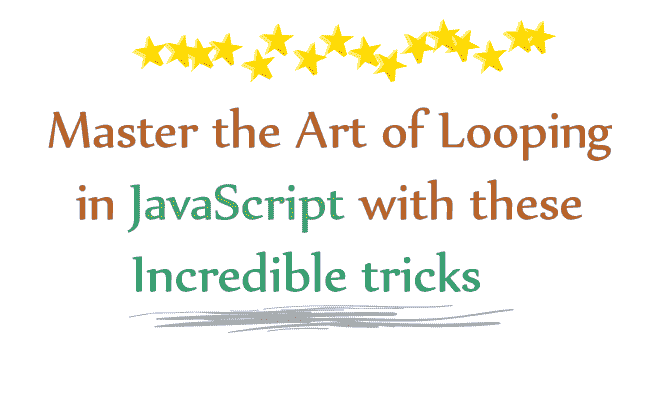
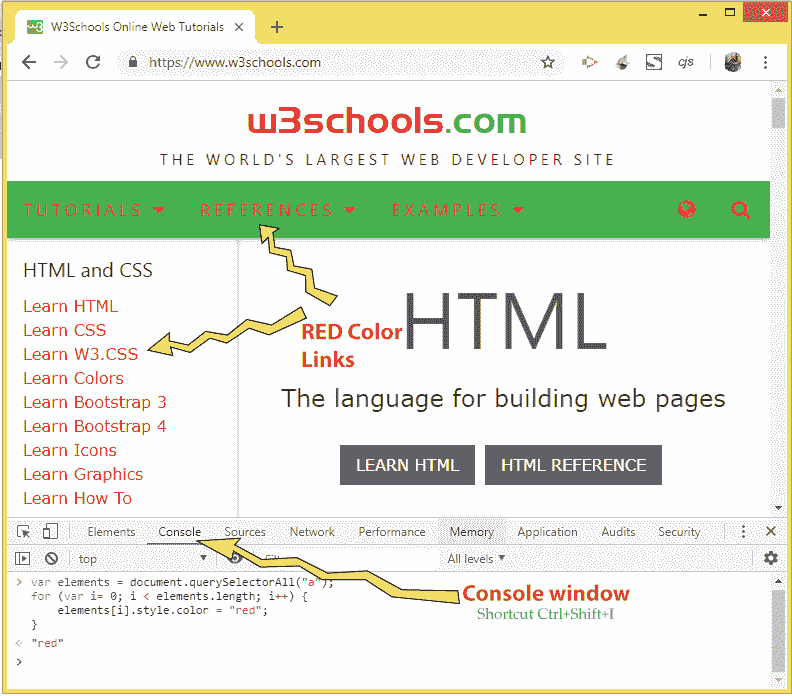
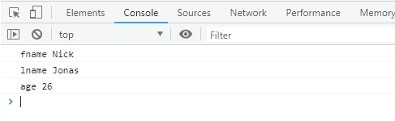
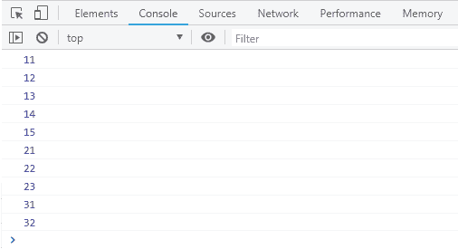
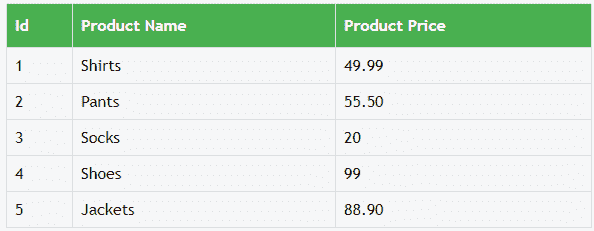
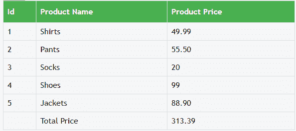
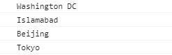

# 用这些不可思议的技巧掌握 JavaScript 的循环艺术

> 原文：<https://www.freecodecamp.org/news/master-the-art-of-looping-in-javascript-with-these-incredible-tricks-a5da1aa1d6c5/>

由瑜伽熊

# 用这些不可思议的技巧掌握 JavaScript 的循环艺术



**Master the art of Looping in JavaScript**

在你的代码中，很多时候你需要遍历一个由数字、字符串或对象组成的数组。有太多的方法可以做到这一点，本教程旨在教你所有的方法，让你成为“JavaScript 循环”的大师。

看看这只忍者猫，它是跳跃的大师。

[https://giphy.com/embed/vhp0BocGjkVjO](https://giphy.com/embed/vhp0BocGjkVjO)

[通过 GIPHY](https://giphy.com/gifs/cat-ninja-parkour-vhp0BocGjkVjO)

像猫一样，你也会成为 JavaScript 循环的大师，在你知道所有的循环技巧之后。

### **1。“For”循环**

循环的**是 JavaScript 代码中最基本的循环方式。多次执行一个代码块非常方便。它使用一个**计数器**，其值首先被初始化，然后指定其最终值。**

每次循环运行时,**计数器增加一个特定值**。for 循环检查计数器是否在限制范围内(初始值到最终值)，当计数器值超过最终值时，循环结束。

让我给你看一些例子。

#### a.遍历一个数组

在下面的代码中，我遍历了数组中的所有**数字，并在控制台窗口中打印出它们中的每一个。**

```
var numbers = [10, 20, 30, 40, 50];
for (var i = 0; i < numbers.length; i++) {
    console.log(numbers[i]);
}
```

同样，你也可以遍历字符串数组。

#### b.遍历 DOM 元素

假设您想要**找到页面中的所有锚**并将其涂成红色。那么在这里，你也可以像这样使用循环的**:**

```
var elements = document.querySelectorAll("a");
for (var i= 0; i < elements.length; i++) {
    elements[i].style.color = "red";
}
```

*解释*:我首先用`**document.querySelectorAll("a")**`得到一个数组中的所有锚点。然后，我简单地循环通过他们，并改变他们的颜色为红色。

我去了 W3Schools 网站，在浏览器控制台上运行了上面的代码，看看它做了什么:



**Changing Color of all Anchors to red**

> 注意: **jQuery** 也有一个非常好的循环方法，叫做 [**jQuery Each method**](http://www.yogihosting.com/jquery-each/) ，它可以帮助你非常容易地循环数组、对象、DOM 元素、JSON & XML。如果你在你的网站上使用 jQuery，那么考虑在循环的时候使用它。

### **2。“For In”循环**

循环中的**用于循环遍历对象/数组**的**属性，而不使用“计数器”。所以它是循环**的**的简化版本。**

循环中的代码块将对每个属性执行一次。

#### a.遍历对象属性

我有一个包含一些属性的对象。我将在循环中使用**来搜索每个属性及其值。**

下面的代码**在控制台窗口中打印所有属性及其值**。

```
var person = { fname: "Nick", lname: "Jonas", age: 26 };
for (var x in person) {
    console.log(x + ": " + person[x])
}
```



**Looping through an object’s property with ‘For In’ loop in JavaScript**

#### b.在 JSON 中循环

JSON 是一种非常流行的格式，用于传输由**属性-值**对和数组数据类型组成的数据对象。网站使用 JSON 与外部网站共享信息。现在我将告诉你如何从 JSON 中提取数据。

假设我有一些包含一些信息的 JSON，如下所示:

```
jsonData: {
one: [11, 12, 13, 14, 15],
two: [21, 22, 23],
three: [31, 32]
}
```

JSON 有一个名为“ *jsonData* 的根节点，它包含 3 个节点——“*一个*”、“*两个*”、“*三个*”。节点也称为键。

下面的代码展示了如何在循环中使用 *For 从 JSON 中提取信息:*

```
var json = {
jsonData: {
one: [11, 12, 13, 14, 15],
two: [21, 22, 23],
three: [31, 32]
}
};

for (var key in json.jsonData) {
    for (var key1 in json.jsonData[key]) {
        console.log(json.jsonData[key][key1])
    }
}
```

*说明*:上述代码中有 **2 用于内循环**——外循环&内循环。

**外循环**运行 3 次，覆盖节点“一”、“二”&“三”。

**内循环**覆盖所选节点内的所有值，即节点“一”、“二”、“T7”、“三”。

在您的网页或浏览器的控制台窗口中运行代码，您将看到打印出的所有节点值，如下图所示:



**‘For In’ loop in JSON**

#### **稍微深入一点 JSON**

相同的 JSON 可以通过放置 **[]** 来表示，以包含 3 个节点“一”、“二”、“三”:

```
jsonData: [{
one: [11, 12, 13, 14, 15]
}, {
two: [21, 22, 23]
}, {
three: [31, 32]
}]
```

现在我将在循环中使用 **For & For 的组合来从这个 JSON 中提取所有信息。下面的代码为我完成了这项工作:**

```
var json = {
jsonData: [{
one: [11, 12, 13, 14, 15]
}, {
two: [21, 22, 23]
}, {
three: [31, 32]
}]
};

for (var i = 0; i < json.jsonData.length; i++) {
    for (var key in json.jsonData[i]) {
        for (var j = 0; j < json.jsonData[i][key].length; j++) {
            console.log(json.jsonData[i][key][j])
        }
    }
}
```

### **3。“While”循环**

**While 循环**中指定了一个条件。只要**条件为真**，它就检查条件并执行代码块。注意，while 循环**不像 for 循环那样有** **计数器**。

#### a.遍历 HTML 表格元素

假设我有一个显示不同产品价格的 HTML 表。该 HTML 表格如下图所示:



**Price Table without Products Total**

你可以看到这个表没有显示所有产品的**总价**。所以如果你需要显示总价，那么你可以**遍历所有的价格**并在表尾显示总价。这就是你要做的。

将 HTML 表格代码添加到网页中:

```
<table id="priceTable">
    <tr>
        <th>Id</th>
        <th>Product Name</th>
        <th>Product Price</th>
    </tr>
    <tr> 
        <td>1</td>
        <td>Shirts</td>
        <td>49.99</td>
    </tr>
    <tr>
        <td>2</td>
        <td>Pants</td>
        <td>55.50</td>
    </tr>
    <tr> 
        <td>3</td>
        <td>Socks</td>
        <td>20</td>
    </tr>
    <tr>
        <td>4</td>
        <td>Shoes</td>
        <td>99</td>
    </tr>
    <tr>
        <td>5</td>
        <td>Jackets</td>
        <td>88.90</td>
    </tr>
</table>
```

接下来，添加 CSS 来为这个 html 表提供适当的设计:

```
<style>
    #priceTable {
       font-family: "Trebuchet MS", Arial, Helvetica, sans-serif;
       border-collapse: collapse;
       width: 100%;
    }

        #priceTable td, #priceTable th {
            border: 1px solid #ddd;
            padding: 8px;
        }

        #priceTable tr {
            background-color: #f2f2f2;
        }

        #priceTable th {
            padding-top: 12px;
            padding-bottom: 12px;
            text-align: left;
            background-color: #4CAF50;
            color: white;
        }
</style>
```

现在用**循环整个表，同时循环**并计算所有产品的总和。因此，将下面的 JavaScript 代码添加到您的网页中来完成这项工作:

```
var table = document.getElementById("priceTable");

var i = 1;
var sum = 0;
while (i < table.rows.length) {
    sum += parseFloat(table.rows[i].cells[2].innerHTML)
    i++;
}

var row = table.insertRow(i);
var cell1 = row.insertCell(0);
var cell2 = row.insertCell(1);
var cell3 = row.insertCell(2);

cell2.innerHTML = "Total Price";
cell3.innerHTML = sum;
```

*说明*:首先我用`**var table = document.getElementById("priceTable")**`得到表格的引用。然后我添加了两个变量，分别叫做“I”和“sum”。变量‘I’是 while 循环的条件变量，而‘sum’会不断把每件产品的价格加进去。

所以我运行了从 1 到(总行数-1)的变量‘I’值的 **while 循环**。我通过 **table.rows.length** 获得表中的总行数，并将其添加到 while 循环的条件中:

```
while (i < table.rows.length) {
  //…
}
```

*注*:表格从索引 0 到 5 有 6 行，每行从索引 0 到 2 有 3 列。我特意从变量值 1 而不是 0 开始运行循环。这是因为在表格行的第 0 个索引中有列名(我不需要)。

在 while 循环中，我继续将每个产品的价格值添加到 sum 变量中，如下所示:`**sum += parseFloat(table.rows[i].cells[2].innerHTML)**`，最后将“I”的值增加 1。

例如，当‘I’值为 1 时，`**table.rows[1]**`给出第一行(第一个‘tr’元素)。类似地，`**table.rows[1].cells[2]**`将给出第一行的价格列(price 'td '元素)的值。

在循环完成后，我在表的最后添加了一个**新行。在这一行中，我添加了 3 列——第 0 个索引、第 1 个索引和第 2 个索引。最后，我在第一列显示字符串“total ”,在第二列**显示包含在“sum”变量中的总价。

添加这一新行的代码是:

```
var row = table.insertRow(i);
var cell1 = row.insertCell(0);
var cell2 = row.insertCell(1);
var cell3 = row.insertCell(2);

cell2.innerHTML = "Total Price";
cell3.innerHTML = sum;
```

`**table.insertRow(i)**`将添加第 6 行，因为在 **While 循环**结束时，变量‘I’的值为 6。

通过`**row.insertCell(0), row.insertCell(1), row.insertCell(2)**`将列(‘TD’元素)添加到这个新行。

我通过以下方式显示列内的值:

```
cell2.innerHTML = "Total Price";
cell3.innerHTML = sum;
```

上面的 JavaScript 代码将创建一个包含产品总价的新行。现在，该表将如下所示:



**Price Table with Products Total**

#### b.无限循环

下面是 While 语句中的无限循环:

```
var infiVal = true;

while (infiVal) {
  // your code
}
```

注意:无限循环会使浏览器挂起，因此需要在几毫秒的间隔内运行循环。您可以使用 **JavaScript setInterval 方法**每隔 1000 毫秒运行一次给定的函数。参见下面的代码:

```
var myVar = setInterval(myTimer, 1000);

function myTimer() {
  // your code
}
```

> 参考教程— [**了解 jQuery/JavaScript**](http://www.yogihosting.com/settimeout-setinterval-functions/) 中的“setTimeout()”和“setInterval()”定时器方法

### **4。“边做边做”循环**

在 **Do While 循环**中，**检查的条件在最后给出，**因此即使条件不为真，循环也至少执行一次。检查下面的代码，该代码将在警告框上给出“Hello”消息，即使条件从一开始就是假的(因为变量“I”的值总是大于 1)。

```
var i = 2;

do {
    alert("Hello");
    i++;
}
while (i < 1);
```

#### a.遍历 XML

现在我将使用 **Do While 循环**来说明如何**循环 XML** 并从中提取数据。我有一个名为“XMLFile1.xml”的 XML 文件，其内容是:

```
<?xml version="1.0" encoding="utf-8" ?>
<cities>
    <city>Washington DC</city>    
    <city>Islamabad</city>
    <city>Beijing</city>
    <city>Tokyo</city>
</cities>
```

我将使用 **AJAX 读取这个 XML 文件**，然后使用 Do While 循环遍历它。以下代码在控制台窗口中打印所有城市的名称(在 XML 文件中给出)。

```
var xhttp = new XMLHttpRequest();
xhttp.onreadystatechange = function () {
    if (this.readyState == 4 && this.status == 200) {
        myFunction(this);
    }
};
xhttp.open("GET", "XMLFile1.xml", true);
xhttp.send();

function myFunction(xml) {
    var xmlDoc = xml.responseXML;
    var cityNames = Array.from(xmlDoc.getElementsByTagName("city"));
    var i = 0;  

    do {
        console.log(cityNames[i].innerHTML);
        i++;
    }
    while (i < cityNames.length);
}
```

*解释*:我创建了一个 **XMLHttpRequest** 对象来进行 AJAX 调用。当 XML 文件被读取时，名为 **onreadystatechange** 的事件被引发，参见下面的代码:

```
xhttp.onreadystatechange = function () {
    if (this.readyState == 4 && this.status == 200) {
        myFunction(this);
    }
};
```

在这个事件中，我调用了名为 **myFunction()** 的自定义函数。在这里，我将 XML 内容存储在一个名为 **xmlDoc** 的变量中:

`var xmlDoc = xml.responseXML;`

然后我将所有的城市名转换成一个**数组**:

`var cityNames = Array.from(xmlDoc.getElementsByTagName("city"));`

最后，我使用 **Do While 循环**遍历这个城市数组，并在控制台窗口中打印每个城市的名称:

```
var i = 0;
do {
    console.log(cityNames[i].innerHTML);
    i++;
}
while (i < cityNames.length);
```

下图显示了控制台上打印的输出:



**Cities values from XML**

### **5。的”。forEach()"方法**

JavaScript 的 ES6 版本引入了一个名为`.forEach()`的新方法，用于遍历数组元素。你会发现它在处理数组时非常方便。

#### a.循环遍历一个数组。forEach()方法:

在这种情况下，我使用**遍历一个数组元素。forEach()** 方法，打印控制台窗口中每个**元素**的**索引**和**值**。参见下面的代码:

```
var names = ["jerry", "tom", "pluto", "micky", "mini"];
names.forEach(Function1);

function Function1(currentValue, index) {
    console.log("Array Current Index is: " + index + " :: Value is: " + currentValue);
}
```

**Function1** 是为数组的每个元素调用的函数名。在我的例子中，它将被调用 5 次。它接受两个参数——当前元素的“索引”和“值”。

**注意**您可以使用 **Array.from()** 方法将对象转换为数组:

```
var linksArr = Array.from(links);
```

### ***结论***

感谢您花时间阅读本教程。我希望它教会了您一些关于处理 JavaScript 循环的新知识。现在你可以在你的 web 项目中应用本教程中描述的任何你喜欢的循环策略。


我每周发表两篇网络开发文章。考虑关注我，每当我在 Medium 上发布新的教程时，您都会收到通知。如果这篇文章是有帮助的，请点击拍手按钮几次，以示你的支持！这会给我带来笑容，激励我为像你这样的读者写更多的东西。

> 我还在 freeCodeCamp 上发布了另一个教程，你可能也想看看——[如何用 Bootstrap Modal 和 jQuery AJAX 创建一个登录特性](https://medium.freecodecamp.org/how-to-create-a-login-feature-with-bootstrap-modal-and-jquery-ajax-53dc0d281609)

谢谢，祝编码愉快！