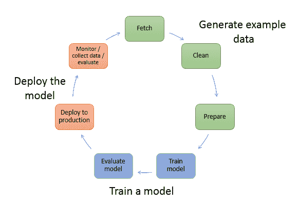
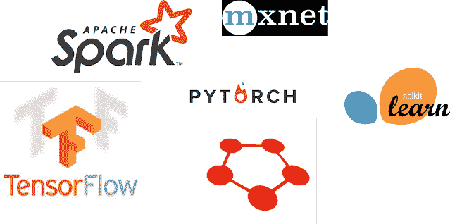
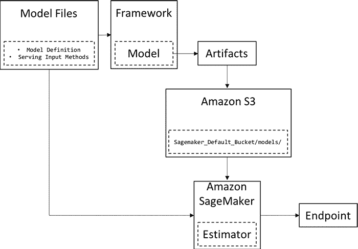
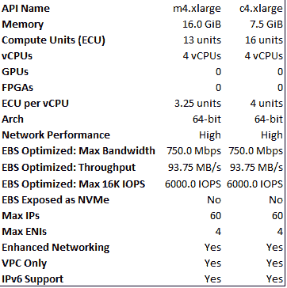
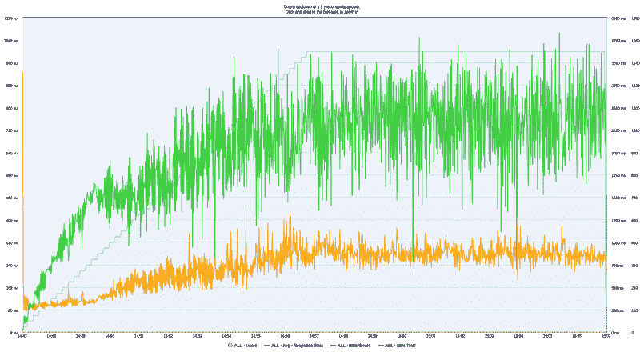
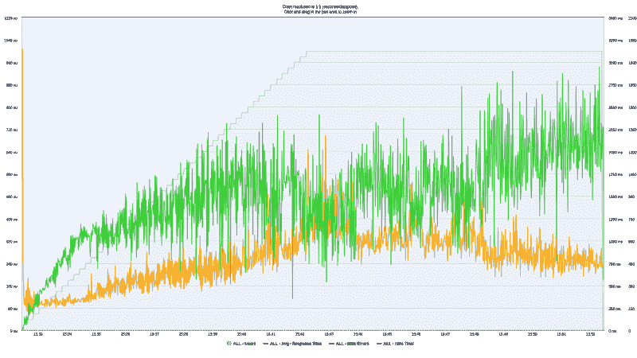
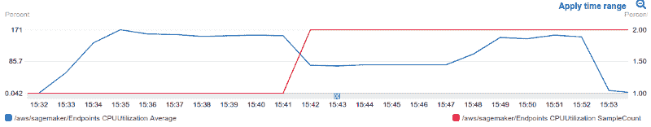
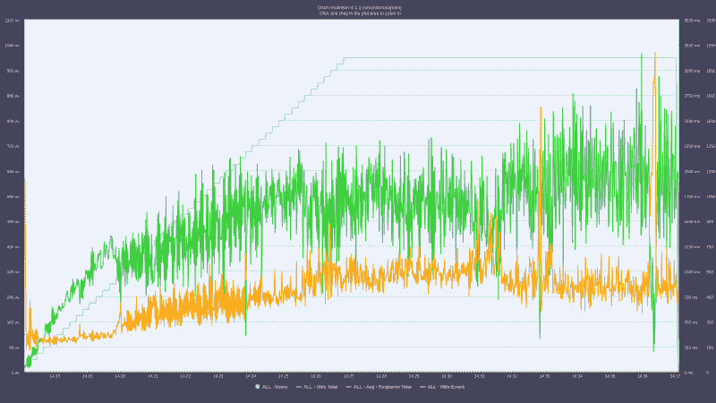
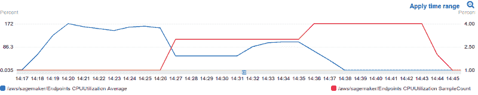

# 我们从亚马逊 SageMaker 大规模服务机器学习模型中学到了什么

> 原文：<https://www.freecodecamp.org/news/what-we-learned-by-serving-machine-learning-models-at-scale-using-amazon-sagemaker-ad1d974d8dca/>

作者:戴坦

# 我们从亚马逊 SageMaker 大规模服务机器学习模型中学到了什么

*布鲁诺·希奥纳托、迭戈·多明戈斯、费尔南多·莫赖斯、古斯塔沃·罗萨托、伊萨克·索萨、马西亚诺·纳尔迪、塔尔斯·席尔瓦— [戴坦集团](http://www.daitangroup.com/)*

上次，我们讨论了如何使用 AWS Lambda 将机器学习(ML)模型部署到生产中。按照我们的计划，我们更进一步，研究更完整的解决方案。在本帖中，我们将注意力转向亚马逊 SageMaker。

SageMaker 是一个开发和部署 ML 模型的平台。它有望简化培训过程，并将模型部署到大规模生产中。

为了实现这一目标，它提供了旨在解决数据科学管道各个阶段的服务，例如:

*   数据收集和存储
*   数据清理和准备
*   训练和调整 ML 模型
*   大规模部署到云

考虑到这一点，SageMaker 将自己定位为完全托管的 ML 服务。

创建 ML 模型的典型工作流程包括许多步骤。在这种背景下，SageMaker 旨在抽象出解决这些阶段中每一个阶段的过程。事实上，正如我们将看到的，通过使用 SageMaker 的内置算法，我们可以用一行简单的代码部署我们的模型。

Image Credits: [SageMaker website.](https://docs.aws.amazon.com/sagemaker/latest/dg/how-it-works-mlconcepts.html)

培训、评估和部署过程全部使用 Jupyter 笔记本电脑完成。Jupyter 笔记本带来很多好处。它为已经习惯了该工具的有经验的数据科学家提供了自由。此外，它还为那些在这方面没有太多经验的人提供了灵活性。

总之，SageMaker 为任何想要培训 ML 模型并将其部署到生产中的人提供了许多好处。然而，价格可能是一个问题。

一般来说，价格取决于你如何以及在哪里使用亚马逊的基础设施。由于显而易见的原因，普通的机器实例比 GPU 支持的实例具有更低的成本。注意，不同地区价格不同。此外，Amazon 根据不同的任务对机器进行分组:构建、培训和部署。你可以在这里找到完整的[价格表](https://aws.amazon.com/sagemaker/pricing/)。

对于训练，SageMaker 提供了许多最流行的内置 ML 算法。其中包括 K-Means、PCA、序列模型、线性学习器和 XGBoost。另外，Amazon 承诺在这些实现上有出色的性能。

此外，如果你想使用像 Keras 这样的第三方库来训练一个模型，SageMaker 也能帮你搞定。事实上，它支持最流行的 ML 框架。其中一些包括:

使用[张量流估算器 API](https://docs.aws.amazon.com/sagemaker/latest/dg/tf-example1.html) 和 [Apache MXNet](https://docs.aws.amazon.com/sagemaker/latest/dg/mxnet-example1.html) 检验这些例子。

### SageMaker —简要概述

为了理解 SageMaker 是如何工作的，请看下图。假设你想用 Tensorflow 训练一个简单的深度卷积神经网络(CNN)。

Image Credits: [SageMaker website](https://aws.amazon.com/blogs/machine-learning/bring-your-own-pre-trained-mxnet-or-tensorflow-models-into-amazon-sagemaker/).

第一个框“模型文件”代表 CNN 定义文件。这是你的模型的架构。例如，回旋、汇集和密集层就在那里。请注意，在这里，它都是使用选择的框架开发的—在这种情况下是 Tensorflow。

其次，我们继续使用该框架训练模型。为此，Amazon 启动了 ML 计算实例，并使用训练代码和数据集来执行训练过程。然后，它将最终的模型工件和其他输出保存在指定的 S3 桶中。请注意，我们可以利用平行培训。这可以通过实例并行或拥有支持 GPU 的机器来实现。

使用模型的工件和一个简单的协议，它创建了一个 SageMaker 模型。最后，可以将这个模型部署到一个端点上，并且可以选择部署模型的实例的数量和类型。

SageMaker 还有一个非常有趣的优化 ML 模型的机制——自动模型优化。通常，调整最大似然模型是一项非常耗时且耗费计算的任务。原因是可用的技术依赖于强力方法，如网格搜索或随机搜索。

举个例子，使用自动模型调整，我们可以选择可能的优化器的子集，比如 Adam 和/或 SGD，以及学习速率的几个值。然后，引擎将处理可能的组合，并关注产生最佳结果的参数集。

此外，这个过程也是可扩展的。我们可以选择并行运行的作业数量以及要运行的最大作业数量。之后，自动调谐将完成工作。此功能可用于第三方库和内置算法。请注意，Amazon 免费提供自动模型调整。

使用 SageMaker 的部署功能来服务一个预先训练好的模型怎么样？没错，你可以使用亚马逊云来训练一个新的模型，或者用它来服务一个已经存在的模型。换句话说，您可以利用 SageMaker 的服务部分来部署在 it 之外训练的模型。

### 在 pagemaker 上培训和部署

众所周知，SageMaker 提供了各种流行的 ML 估计量。它还允许采用预先训练的模型并部署它。然而，根据我们的实验，使用它的内置实现要容易得多。原因是，要使用 SageMaker 的 API 部署第三方模型，需要处理容器管理。

因此，这里我们提出了使用 SageMaker 处理完整 ML 管道的挑战。我们将使用它从最基本的到更高级的 ML 任务。一些任务包括:

*   将数据集上传到 S3 存储桶
*   为训练预处理数据集
*   培训和部署模型

一切都在云端完成。

与前一篇文章一样，我们将使用 KDD99 入侵数据集拟合一个线性模型。您可以在本文的[中找到关于数据集和预处理步骤的更多细节。](https://medium.freecodecamp.org/what-we-learned-by-serving-machine-learning-models-using-aws-lambda-c70b303404a1)

训练和部署模型的所有过程都是使用 SageMaker 的 Jupyter 笔记本界面完成的。它不需要任何配置，笔记本运行在您选择的 EC2 实例上。这里，我们选择了一个 *ml.m4.xlarge* EC2 实例来托管笔记本。我们在使用一个不太强大的实例加载 KDD99 数据集时遇到了问题(由于空间不足)。

看看 EC2 机器的配置:

为了拟合线性模型，SageMaker 有 [**线性学习器**](https://docs.aws.amazon.com/sagemaker/latest/dg/linear-learner.html) 算法。它为分类和回归都提供了解决方案。用很少的几行代码，我们就可以在数据集上定义和拟合模型。

看一下估计器类。它是一个基类，封装了 SageMaker 所有不同的内置算法。在其他参数中，一些最重要的参数包括:

*   image_name:用于训练的容器图像。
*   train_instance_count:用于训练的 EC2 实例数。
*   train_instance_type:用于训练的 EC2 实例的类型。
*   output_path:保存训练结果的 S3 位置。

为了定义我们想要使用哪种模型，我们将“图像名称”参数设置为“线性学习者”。为了执行训练过程，我们挑选了一个 *ml.c4.xlarge* EC2 实例。它有 4 个虚拟 CPU 和 7.5 GB 的内存。

模型的超参数包括:

*   feature_dim:输入尺寸
*   predictor_type:如果分类或回归
*   mini_batch_size:每步使用多少个样本。

最后，SageMaker 提供了一个非常类似于 scikit-learn 的用于培训的 API。只需调用 fit()函数，就可以开始工作了。

现在到了最后一部分——部署。要做到这一点，就像训练时一样，我们只需运行一行代码。

这个例程将负责将训练好的模型部署到 Amazon 端点。注意，我们需要指定我们想要的实例的类型，在本例中，是一个 *ml.m4.xlarge* EC2 实例。此外，我们可以定义最小数量的 EC2 实例来部署我们的模型。为此，我们只需将*初始实例计数*参数设置为大于 1 的值。

### 自动缩放

我们的测试有两个主要目标。

*   评估 pagemaker 提供的完整 ml 管道
*   评估培训和部署的可扩展性。

在所有测试中，我们使用了 SageMaker 自动缩放工具。正如我们将看到的，它有助于控制流量/实例的权衡。

如 AWS 网站所述:

> AWS Auto Scaling 监控您的应用程序并自动调整容量，以尽可能低的成本保持稳定、可预测的性能。

简而言之，SageMaker Auto Scaling 使得跨许多服务为各种资源构建扩展计划变得更加容易。这些服务包括 Amazon EC2、Spot Fleets、Amazon ECS 任务等等。其思想是根据工作负载的变化来调整运行实例的数量。

需要注意的是，自动缩放在某些情况下可能会失败。更具体地说，当您的应用程序遇到某种流量高峰时，自动伸缩可能一点帮助都没有。我们知道，对于新的(EC2)实例，Amazon 需要一些时间来设置和配置机器，然后它才能处理请求。根据我们的实验，这个设置时间可能需要 5 到 7 分钟。如果您的应用程序在传入请求的数量上有小的峰值(比如说 2 到 4 分钟),到 EC2 实例设置时间结束时，对更多计算能力的需求可能已经结束。

为了解决这种情况，Amazon 实现了一个简单的策略来扩展新实例。基本上，在作出缩放决定后，在下一次缩放活动发生之前，必须满足冷却期。换句话说，每个发出新实例的动作都被固定的(可配置的)时间量所交错。这种机制旨在减轻启动新机器的开销。

此外，如果您的应用程序具有定义明确/可预测的用户流量，自动伸缩也可能是一个糟糕的选择。假设，您托管了一个应用程序的网站。你知道在一个特定的时间，应用程序将为数亿用户开放。在这种情况下，正确设置自动缩放所需的时间可能会导致糟糕的用户体验。

### 结果

我们使用肯泰罗和 JMeter 在 Amazon SageMaker 开发的 ML 模型上运行负载测试。

第一种情况定义如下:

*   并发用户数:1000
*   10 分钟的上升时间
*   保持 10 分钟

简单地说，该测试包括从 1000 个并行用户发出请求。在测试的第一部分(前 10 分钟)，用户数量从 0 扩展到 1000(上升)。之后，1000 个用户继续发送 10 分钟以上的并行请求(保持一段时间)。请注意，每个用户都以串行方式发送请求。也就是说，要发出新的请求，用户必须等到当前请求完成。

对于第一次测试，我们决定使用一台机器。因此，我们没有定义任何在达到某个标准时会产生新实例的扩展计划。

在下图中，蓝线(呈阶梯状增加)是并行用户的数量。橙色线表示平均响应时间，绿色线表示请求数量。

一开始，用户数量从 0 扩展到 1000。正如预期的那样，向模型发出的请求数量也以类似的方式增加。

在实验的最后部分(最后 10 分钟)，点击/请求的数量和平均响应时间保持稳定。这表明这台单独的机器似乎有能力处理当前的有效载荷。

此外，这台机器能够处理平均每秒 961.3 次的请求。实际上，在达到最大并发用户数(1000)后，这个平均值接近每秒 1200 个请求。

为了进一步了解我们的假设，我们决定在负载测试中添加一个扩展计划。这里，当每分钟并行请求的数量达到 30k 时，我们指示系统增加运行实例的数量。对于所有测试，最大实例数被设置为 10。然而，在所有情况下，SageMaker 自动缩放并没有使用所有可用的资源。

对于下面的测试，Amazon Auto Scaling 只发布了 1 个实例来帮助处理当前的有效负载。这在下面的 CPU 利用率图中用红线表示。

然而，这个新实例的添加能够增加吞吐量并减少延迟。这在 15:48 的时间标记后很明显。

为了更好地使用自动缩放工具，我们决定在缩放之前降低每分钟请求的阈值数量。现在，建议自动伸缩在吞吐量达到 15k 请求/分钟时启动一个新实例。因此，自动缩放总共使用了 4 个实例来匹配缩放计划。还可以直观地看到，随着实例数量的增长，CPU 使用率会下降。

我们注意到，在所有测试的开始，我们有一个很大的延迟峰值。我们的实验表明，这个高平均值是由测试本身(Taurus/JMeter)预热和准备资源造成的。请注意，在峰值之后，响应时间会迅速下降到正常值。稍后，它会随着虚拟用户数量的增加而增加(正如预期的那样)。此外，在 API 网关或 SageMaker 的延迟统计中没有看到这个初始峰值——这支持了我们最初的想法。

此外，特别是对于这个测试和模型的选择，自动缩放不是很有效。原因是我们对服务器执行的负载量完全由一台机器处理。

#### 结论

以下是我们对 SageMaker 的一些观察:

*   它提供了一个非常干净和易于使用的界面。Jupyter 笔记本提供了许多优势，内置算法易于使用(基于 scikit-learn 的 API)。此外，用于培训的机器仅在培训进行时计费。空闲时间不付费:)
*   它消除了 ML 的许多无聊的任务。自动缩放和自动超参数调整是出色的功能。
*   如果使用内置算法，部署非常简单。只有一行代码。
*   通过 SageMaker 支持第三方 ML 库，我们发现为一个预先训练好的模型服务并不像使用他们的原生 API 那样简单。