# 对 Docker、虚拟机和容器的全面介绍

> 原文：<https://www.freecodecamp.org/news/comprehensive-introductory-guide-to-docker-vms-and-containers-4e42a13ee103/>

由 shota jol borders 提供

Docker 在过去的几年里一直是技术人员的流行语，时间越久，你听到的次数就越多。我们越来越多地在工作要求中看到它，越来越多的公司开始将它纳入其中。如今，感觉这是开发世界中如此基本和普遍的事情，如果你不了解它，你就落后于其他人。

没有，但是说真的，这个“Docker”是什么东西？为什么每个人都对此如此兴奋？这到底是什么？能定义一下吗？这是桌面应用吗？CLI 工具？一个网站？服务？这个东西是生产用的还是开发工具？两者都有？我听说它有像“图像”和“容器”这样的东西，它像一个虚拟机，但不是真正的虚拟机。为什么我需要它，所有这些到底和这条蓝鲸有什么关系？

在本文中，我将尝试解释:

*   “docker”到底是什么
*   为什么你可能需要它
*   它试图解决哪些问题
*   它与虚拟机有何不同
*   何时在虚拟机上使用它，反之亦然
*   通常什么是图像和容器
*   以及它们是如何在 docker 中实现的。

我将按照特定的顺序浏览所有的概念，这样我解释的每个其他主题都需要理解前面的概念。但是，在读这个的同时，如果你没有得到什么，或者有些东西感觉很模糊，只要继续读下去，最后都会有意义的。我对这篇文章的建议是读两遍，让你有“顿悟的时刻”。

够了，让我们开始吧！

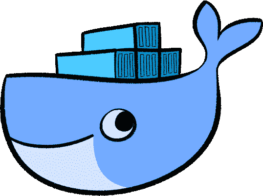

### Docker 是什么？

你可能会在互联网上听到许多“码头工人”的名字，对于一个新手来说，这可能会让人不知所措。让我们花一点时间来定义其中的一些名称，以便至少知道哪个是哪个。

*   多克尔公司
*   docker 引擎(社区/企业)
*   Mac 坞站
*   windows
*   码头客户
*   码头主持人
*   docker 服务器
*   坞站集线器
*   坞站注册表
*   复合坞站
*   码头工人群
*   码头机器
*   docker daemon(坞站守护程序)

这里有很多码头工人，是吧？我将为这里的每个术语给出一个简短的定义，这样你就知道它们是什么了。

#### 码头工人(公司)

**Docker，Inc** 由 Solomon Hykes(首席技术官)于 2010 年在三藩市联合创立，当时它被称为 **dotCloud，Inc** 。他们一直在运营 PaaS(平台即服务)类型的业务，类似于 [Heroku](https://www.heroku.com/) 。为了实现这一点，他们一直在使用 Linux 容器。

在 2013 年 3 月的 PyCon 上，Solomon 展示了一款由 dotCloud，Inc .推出的名为“docker”的新产品。他在他的[演讲](https://www.youtube.com/watch?v=wW9CAH9nSLs)(第一次提到 docker 的演讲)中描述的动机是，人们对 Linux 容器以及如何用它们构建东西非常感兴趣，但问题是 Linux 容器非常复杂。在 **dotCloud，Inc** 他们决定简化 Linux 容器的使用，让每个人都可以访问它们，因此软件“docker”诞生了。

2013 年晚些时候， **dotCloud，Inc** 宣布他们将更名为 **Docker，inc** ，从现在起他们的主要产品将是“Docker”(软件)。他们将 PaaS 业务剥离给另一家公司，剩下的就是历史了。

对我们来说，我们主要对 docker 软件感兴趣，而不是公司本身，但我认为了解一点它背后的历史是有好处的。

#### Docker(软件)

Docker 有两个版本:Docker 社区版(CE)和 Docker 企业版(EE)。对于开发环境和小型团队来说，CE 是必由之路，所以在本文中我们不讨论 EE。CE 是免费的，ee 是 Docker 公司真正赚钱的方式。

Docker 软件由两个独立的程序组成，即 docker 引擎，也称为 docker 守护程序(因为它实际上是一个后台运行的守护程序)和 docker 客户端。

#### 引擎/守护程序

Docker 引擎实际上使 Linux 容器能够工作——可以说是“docker 的大脑”。

Docker 引擎负责在隔离的环境中运行进程。对于每个进程，它生成一个新的 Linux 容器，为它分配一个新的文件系统，分配一个网络接口，为它设置一个 IP，为它设置 NAT，然后在其中运行进程。

它还管理诸如创建、删除图像、从选择的注册表中获取图像、创建、重新启动、删除容器和许多其他事情。Docker 引擎公开了可用于控制守护进程的 rest API。

#### 客户

Docker 客户端提供了 CLI 来控制 docker 守护进程。它只是一个 HTTP API 包装器。基本上，docker 客户端向 docker 引擎发送 API 请求，docker 引擎实际上完成了所有的工作。Docker 客户机和守护进程不必在同一台机器上。您可以从终端使用`docker`命令访问 CLI。

#### 主持

Docker 主机是一台运行 docker 守护程序的计算机。有时候也叫 docker 服务器。

#### 中心

[Docker hub](https://hub.docker.com) 是由 **Docker，Inc** 自己提供的 Docker 图片注册表。它使用户能够将图像推送到他们的存储库，使它们成为公共的或私有的，并提取不同的图像，所有这些都使用 docker 客户端 CLI。

其他人或公司制作的几乎所有东西都有图片，每种语言，每个数据库，每个版本。它就像 docker 图像的 GitHub。还有其他公司提供的 Docker 图片注册中心，比如 [Quay](https://quay.io/) 、 [Google container registry](https://cloud.google.com/container-registry) 、[Amazon Elastic Container Registry](https://aws.amazon.com/ecr/)。或者，您可以托管自己的 docker 注册表。

#### 登记处

Docker registry 是一个服务器端应用程序，允许您托管自己的 Docker 存储库。它以托管在 docker hub 上的图像的形式提供。为了让它工作，你需要从 docker hub 中提取一个名为“registry”的映像，并从中旋转容器。运行“注册”容器的 Docker 主机现在是注册服务器。

#### 对于 Mac

docker for Mac 是一款独立于 Docker 的软件，由 **Docker，Inc .**提供，简化了在 Mac OS 上使用 Docker 的开发。该软件包包括 docker 客户端，在 Mac OS 的本机 HyperKit 虚拟机管理程序上运行的成熟虚拟机，安装在该机器内的 docker 守护程序，docker-compose 和 docker-machine orchestration 工具。容器的公开端口会自动从虚拟机转发到本地主机。

#### 对于 Windows

Docker for Windows 也是专门为 Windows 配置的。它使用 Hyper-v (Windows 10 的原生虚拟化解决方案)作为其虚拟化软件，并让您能够在运行 Linux 容器的同时运行 Windows 容器。

#### 机器

Docker machine 是一个编排工具，允许您管理多个 Docker 主机。它允许您在本地或云上提供多个虚拟 docker 主机，并使用`docker-machine`命令管理它们。您可以启动、重新启动和检查受管主机。您可以将 docker 客户端指向其中一台主机，然后直接管理该主机上的守护程序。有很多方法可以用这个工具管理 docker 主机，只要看看 CLI [参考](https://docs.docker.com/machine/reference/)就知道了。

#### 构成

Docker compose 也是 Docker 的编排工具。它允许您通过`docker-compose` CLI 在一个 docker 主机中轻松管理多个相互依赖的容器。您使用一个 YAML 文件来配置所有容器。只需一个命令，您就可以按正确的顺序启动所有容器，并在它们之间建立网络。这里是[参考](https://docs.docker.com/compose/reference/overview/)。

#### 蜂群

Docker swarm 是另一个旨在管理 Docker 主机集群的编排工具。docker-compose 管理一个 docker 主机内的多个 docker 容器，而 docker swarm 管理管理多个 docker 容器的多个 Docker 主机。

与 docker-compose 和 docker-machine 不同，docker swarm 不是一个独立的编排软件。群模式内置于 docker 引擎，通过 Docker 客户端管理。

为了创建一个蜂群，你需要 ssh 到一个你想要创建蜂群的机器上，然后`docker swarm init --advertise-addr <ip to publi` sh >。该命令将使机器访问`le on <ip to`发布>。其他 docker 主机现在可以在这个 IP 上加入群。

#### 摘要

好吧，那我们现在学到了什么？

Docker 不是一个独立的软件，它是一个管理 Linux 容器的平台。每当有人在软件环境中提到 docker，他们都在谈论 docker CE 或 docker EE。

Docker 是由 Docker 公司开发的，目的是简化 Linux 容器的使用。该平台由多个运行和管理 Linux 容器的工具组成，包括:

*   Docker 守护进程/引擎，负责 Linux 容器的生成和运行。
*   Docker 客户端是一个独立的应用程序，它通过 REST API 控制 docker 守护进程。
*   Docker-compose、docker-machine 和 docker swarm 是编排工具，它们不是在 Linux 容器中运行进程所必需的，但是它们使容器管理变得非常简单。坦率地说，在现实生活中，它们几乎是必不可少的，因为手动管理所有这些容器、主机和主机群集是…好吧，让我们说这是一个糟糕的业务战略。
*   Docker hub 是一项提供 Docker 图像注册的服务。我们可以将自己的图像存储在 docker hub 上，并提取其他人制作的图像供我们使用。
*   Docker registry 允许我们托管自己的私有注册表，以防我们不想使用现有的注册表。
*   Docker for Mac 和 Docker for Windows 是独立的工具，简化了在 Mac 或 Windows 上使用 Docker 的开发。

如果你是一个初学者，以上提到的内容你 100%不理解也是可以的。有些事情可能是模糊的，你可能会有一些问题，这是正常的。我确实多次提到了图像和容器，但是没有解释它们是什么。

这一部分旨在帮助你在所有这些名称之间导航，消除不确定性，并理解什么是什么，这样你就不会在听到所有这些不同类型的标题时不知所措。

带着这份伤感，我想基于我们目前所了解的，你应该能或多或少的理解下面这幅图:

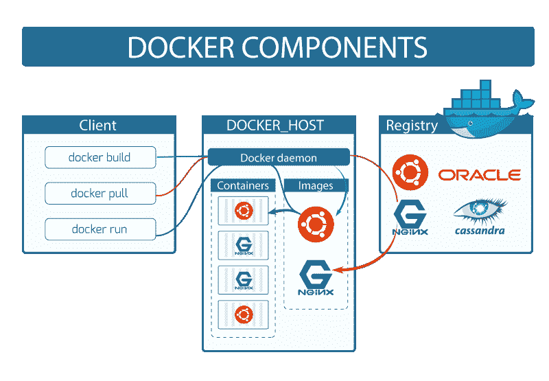

如你所见，docker 客户端和 docker 守护进程在不同的机器上，所以这可能会回答你的一些问题，比如…

*他们为什么要把 docker 拆分成客户端和引擎？为什么他们没有让 CLI 直接控制引擎，而不是 rest API*

因为它允许客户端和引擎在不同的机器上，所以可以从一台计算机管理多个不同的主机。

随着所有这些事情的澄清，我们可以深入研究。

### 虚拟计算机

嘿，嘿，等一下——我们是在谈论 docker 还是什么？

是的，我们是，但是在学习 docker 的某个时候，一个自然的问题会出现:

*虚拟机和容器之间有什么区别，为什么我要使用一个而不是另一个？*

每个学习 docker 的人都会经历这一点，我想我们不妨现在就经历一下，把它解决掉。

有很多关于虚拟机如何在幕后工作的信息。我们不能在这篇文章中讨论所有的细节，但是我会解释的足够多，这样你就能理解 VM 和容器之间的区别。

每台电脑，无论是运行 Linux 的巨型网络服务器还是你的高价 iPhone X，都有 4 个基本的物理组件:

*   处理器(CPU)，
*   存储器(RAM)，
*   存储(硬盘/固态硬盘)，
*   网卡(NIC)。

任何操作系统的主要任务基本上都是管理这四种资源。操作系统中完成这项工作的部分称为内核，也称为核心。

简单地说，内核是控制硬件的操作系统的一部分。内核控制不同 IO 设备的驱动程序，比如鼠标、键盘、耳机、麦克风等等。内核是计算机开机时加载的第一个程序，紧接在引导加载程序之后，然后它处理其余的启动过程。打开计算机所需的绝大多数时间都是由内核造成的。

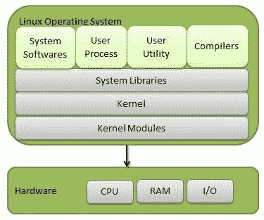

每个操作系统都有自己的内核实现，但事实上它们都做同样的事情:它们控制硬件。

那么，如何在另一个操作系统中运行一个操作系统呢？本质上，我们需要的是一个程序，它能使客户操作系统(在另一个操作系统中运行的操作系统)控制主机操作系统(在其中运行客户操作系统的操作系统)的硬件。

#### 管理程序

虚拟机管理程序也称为虚拟机管理器(VMM)，它支持虚拟化(在一台物理计算机上运行多个操作系统)。它允许主机在虚拟机之间共享资源。

有两种类型的虚拟机管理程序:

**类型 1，也称为“裸机虚拟机管理程序”**

该软件安装在底层机器的硬件之上(因此，在这种情况下，没有主机操作系统，只有客户操作系统)。您可以在一台完全用于运行许多虚拟机的机器上这样做。

与类型 2 虚拟机管理程序不同，类型 1 虚拟机管理程序有自己的设备驱动程序，并直接与硬件交互。这使得它们更快、更简单，因此也更稳定。

**类型 2，也称为“托管的虚拟机管理程序”**

这是一个安装在操作系统之上的程序。你可能更熟悉它，比如 VirtualBox 或者 VMware Workstation。这种类型的管理程序类似于“翻译器”，将客户操作系统的系统调用翻译成主机操作系统的系统调用。

系统调用(syscalls)是程序向内核请求服务的一种方式，内核确实这样做了——还记得吗？它管理底层硬件。

例如，在您的程序中，假设您想要将一个文件的内容复制到另一个文件中。很简单，对吧？为此，您需要从硬盘的一部分取出一些字节，并将其放入另一部分。所以基本上，你是在用一个物理资源做事情，在这个例子中是硬盘，你需要启动一个系统调用来做这件事。当然，在所有的编程语言中，这都是抽象的，但是你明白了。

由于所有的操作系统内核，尽管以不同的方式实现，都做相同的工作(控制硬件)，我们只需要一个程序来“翻译”客户操作系统的系统调用来控制硬件。

类型 2 虚拟机管理程序的一个好处是，在这种情况下，我们不必担心底层硬件及其驱动程序。我们真的只需要将工作委托给主机操作系统，它将为我们管理这些东西。不利的一面是，它会产生资源开销，多个层重叠在一起会使事情变得复杂并降低性能。

### 容器

虚拟机不是唯一的虚拟化技术。在虚拟机的情况下，我们有一个完整的虚拟计算机，它有自己专用的内核。我们为它分配 RAM，我们为它分配内存，我们与它交互，就像它是一台独立的计算机一样。

这有几个问题。首先也是最明显的是低效的资源管理。一旦你为一个虚拟机分配了一些资源，只要它还在运行，它就会占用这些资源。

例如:如果您为一个虚拟机分配了 4 GB 的 RAM 和 40GB 的磁盘内存，那么一旦您运行它，只要该虚拟机还在运行，这些资源就不可用。在某些时候，它可能只需要 1 GB 的 RAM，而对于另一个 VM 或主机中的其他进程，您可能缺少 RAM。但是因为它已经分配了这么多内存，所以它就一直闲置着。

另一个问题是启动时间。由于虚拟机有自己的内核，如果你需要重启你的机器，它将需要启动整个内核。当机器重新启动时，在虚拟机中运行的服务将不可用。

#### 拯救集装箱

简单来说，容器就是一个没有内核的虚拟机。相反，它使用的是主机操作系统的内核。为了使这成为可能，我们需要一套软件和库，允许容器使用底层的操作系统内核，如果你愿意，还可以“链接”它们。例如，“liblxc”和“libcontainer”就是这样的库(最后一个库由 docker 公司开发，并在 Docker 引擎中使用)。

容器有自己分配的文件系统和 IP。库、二进制文件、服务安装在一个容器中，然而，所有的系统调用和内核功能都来自底层的主机操作系统。

容器非常轻便。启动和重启非常快，因为它们不需要每次都启动内核。它们不会浪费物理资源，因为它们不需要为内核分配物理资源，因为它们没有单独的内核。

一个缺点是它只能运行与底层操作系统相同类型的容器。你不能在 Windows 或 Mac 上运行 Linux 容器，因为它们需要 Linux Kennel 来运行。Mac 和 Windows 用户的解决方案是安装第二类虚拟机管理程序，如 VirtualBox 或 WMware Workstation，启动 Linux 机器，然后在其中运行 Linux 容器(事实上这就是 Docker for Mac 和 Docker for Windows 所做的，但它们使用各自操作系统附带的本机虚拟机管理程序)。

设置和运行 Linux 容器并不那么简单。这很麻烦，并且需要相当好的 Linux 知识。管理它们甚至更加繁琐。

正如我上面提到的，docker 公司所做的是使 Linux 容器易于使用，并且每个人都可以使用，现在多亏了 Docker，你不必成为一个 Linux 极客来使用 Linux 容器。

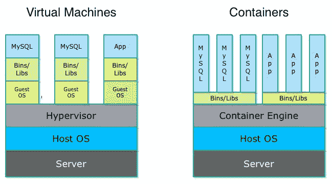

### 容器与虚拟机

根据上一节关于容器的内容，您可能认为容器只是比 VM 更好的虚拟化解决方案，但事实并非如此。

容器的目的是在一个隔离的环境中运行进程，为每个进程停靠每个容器。虚拟机是用来模拟整个机器的。现在只有 Linux 和 windows 容器存在，但是有各种各样的管理程序来模拟任何种类的操作系统。如果你愿意，你可以在 iPad 上运行 windows 10。这两者是不同的技术，它们不会相互竞争。

虚拟机更安全，因为容器直接对内核进行系统调用。这暴露了一系列的漏洞。

一些直接干扰内核的低级软件应该被放在虚拟机的沙箱中。

在生产环境中，您经常可以看到 docker 容器在虚拟机内部运行，因此虚拟机和容器实际上结合得非常好。

### Docker 图像和容器

Docker 引入了几个概念，它们简化了……或者我更愿意说是彻底改变了 Linux 容器的使用

docker 中的 Linux 容器是由称为“图像”的模板制成的。映像基本上是一个保存 Linux 机器状态的二进制文件(当然没有内核)。你可以画一个平行于 VM 的磁盘镜像如`.vdi`、`.vmdk`或`.vhd`文件。

Docker 处理映像的方法不同于 VM。在虚拟机中，您只需挂载一个磁盘映像，运行虚拟机，就可以拥有一个正在运行的机器实例。每当您在 VM 中修改文件系统、安装或删除任何东西时，所有这些都会反映在您已经挂载的映像上。镜像基本就是机器的硬盘。

在 docker 中，图像是只读的——您不直接运行图像，而是复制一个图像并运行它。图像的这个运行实例被称为容器。通过这样做，您可以让同一个 Linux 容器的几个实例同时运行，这些实例由同一个模板构成，它们是映像。容器发生的任何事情都不会影响它的形象。在硬件允许的情况下，您可以从映像中创建尽可能多的容器实例。

#### 通过联合装载合并图像

为了创建和存储图像，docker 使用 Union 文件系统。这是 Linux、FreeBSD 和 NetBSD 中的一个服务。Union 文件系统允许我们通过将多个不同的文件系统合并在一起来创建一个文件系统。具有相同路径的目录的
内容将一起出现在一个合并的目录中。合并的过程称为“联合安装”。

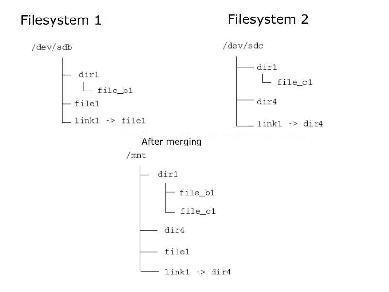

它大致是这样工作的:

有 3 层开始发挥作用:基础层，覆盖层和差异层。当合并两个文件系统时，这个过程看起来像这样(记住我在这里过于简化了):

我们有一个基本文件系统，我们想引入一些更改，添加文件/文件夹，删除文件/文件夹。

首先，我们将创建一个覆盖文件系统(此时为空)和 diff 文件系统(此时也为空)。然后，我们将使用 Linux 内置的联合文件系统服务联合挂载这些文件系统。当查看覆盖文件系统时，它会给我们基本文件系统的视图。我们可以向它添加内容，从中删除内容，因为实际的基本文件系统不会受到影响。相反，对覆盖文件系统的所有更改都将存储在 diff 文件系统中。diff 文件系统显示了基本文件系统和覆盖文件系统之间的差异。

编辑完覆盖文件系统后，我们将卸载它。最后，我们得到了覆盖层和基础层的合并文件系统，而实际的基础文件系统不受影响。

这正是 docker 图像相互“堆叠”的方式。Docker 使用这种技术来合并镜像文件系统。

为了在已经存在的图像上创建您的图像，您需要`touch Dockerfile`。这是一个文本文件，包含一组关于如何构建图像的说明。看看这个简单的例子。

在终端内运行:

`docker build <path of the folder with Dockerfile in` it >。

该命令将根据 Dockerfile 中给出的指令构建一个映像。

第一行:`FROM nodesource/trusty5.1`

这条线表示该图像的基础层是另一个名为`nodesource/trusty5.1`的图像。默认情况下，docker 将首先尝试在本地查找该图像。如果不存在，它将从 docker hub 或另一个 docker 图像注册中心获取该图像。因此，您只需要配置 docker 客户端，在另一个图像注册表中查找图像。

第二行:`WORKDIR /app`

这一行告诉 docker，通过 Dockerfile 中的`RUN`执行的所有后续命令将从`/app`开始执行。

第三行:`ADD . /app`

这一行告诉 docker 在构建时要合并哪些文件系统。在这个例子中，我们看到覆盖层是当前目录，相对于 Dockerfile，基础层是`nodesource/trusty5.1`(一个图像)里面的`/app`。
基本文件系统的子文件系统`/app`将与覆盖文件系统合并。如果基础层中不存在`/app`文件系统，它将被创建为一个空文件夹。

`RUN` command 通过默认 shell `/bin/sh`
`RUN <comma` nd > `; === /bin/sh <`在构建图像时执行图像内部的命令；命令>

命令将作为文档，让用户看到应用程序正在使用哪个端口。没必要。

`CMD`将在启动时从该映像构建的容器中运行命令。

在本例中，`nodesource/thrusty5.1`是一个安装了 nodeJs 5.1 的 Ubuntu 映像。在相对于 Dockerfile 的`./app`目录中，我们有一个 nodeJs 应用程序。当合并它们时，我们会在`/app`目录中得到一个安装了 nodeJs 5.1 的 Ubuntu 和我的应用程序的映像。

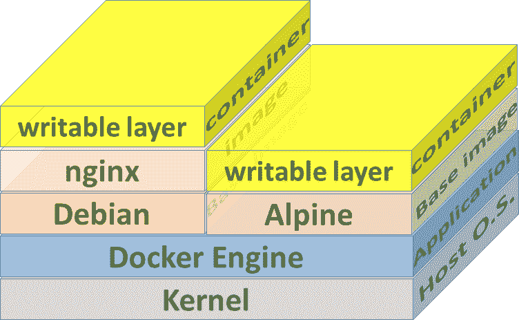

然后，我们可以从这个模板中旋转出尽可能多的容器。每个容器在启动时都会执行容器的`/app`目录下的`npm start`。

#### 码头集装箱

正如您已经知道的，Docker 容器正在运行图像的副本。docker 在从映像创建容器时做的另一件事是，它在映像的文件系统上添加了一个读写文件系统，因为映像的文件系统是只读的。

Docker 容器与普通的 Linux 容器有点不同。Docker 容器是专门为在 Linux 容器的隔离环境中运行单个进程而设计的。这就是为什么我们在 Dockerfile 中有`CMD`，它指示这将是哪个进程。一旦 Docker 容器中没有进程运行，它就会自动终止。

Docker 容器不应该维护任何状态，所以你不能 ssh 进入你的 docker 容器(技术上你可以，但是不要)。你不应该让它同时运行几个进程，比如数据库和使用它的应用程序。在这种情况下，您将使用两个独立的容器，并使它们相互通信。Docker 容器是 Linux 容器的一个特定用例，用于将松散耦合的无状态应用程序构建为服务。

#### 集装箱间通信

正如我上面提到的，每个容器应该只运行一个进程。因此，现在可能会出现一个自然的问题:*例如，如果我的应用程序在一个容器中运行，而数据库在另一个容器中运行，我如何从我的应用程序连接到在另一个容器中运行的数据库？在这种情况下，您无法连接到 localhost。*

Docker 为独立容器引入了网络。对网络使用情况的高度概括如下:您创建了一个新网络，它单独为该网络创建了一个子网。您启动一个容器并将其连接到该网络，所有连接到同一网络的容器将能够彼此 ping 通，就像它们在局域网上一样。然后，您可以从一个容器中运行的服务连接到另一个容器中运行的服务，只要它们在同一个网络上。

好了，它看起来怎么样？

跑`docker network create <some na`我>:

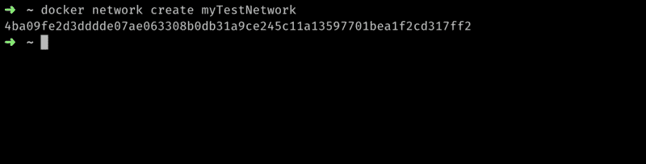

您可以通过运行`docker network list`列出所有可用的网络:

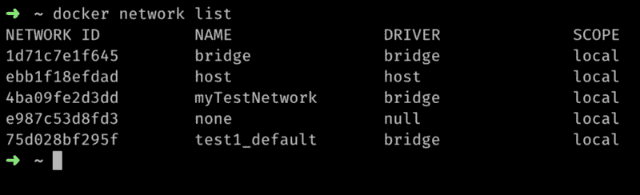

运行`docker network inspect <network id or na` me >查看网络子网以及当前连接到该子网的容器:

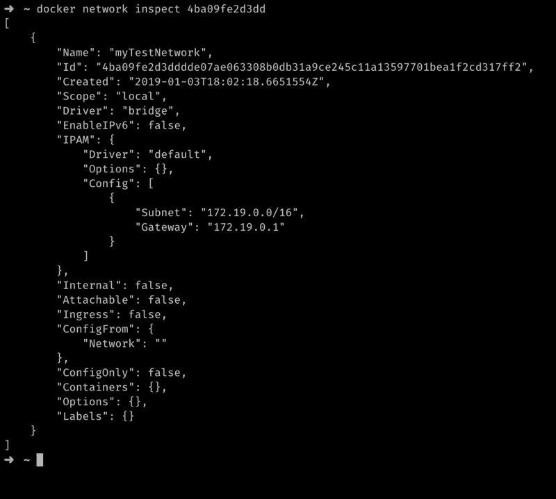

正如您所看到的，它显示了网络的子网，默认的逃逸，我们还看到没有容器连接到它。

现在我将从两个不同的图像创建两个容器，`nodejsapi`，`mongo`并运行它们。`--net`选项指示使用哪个网络:

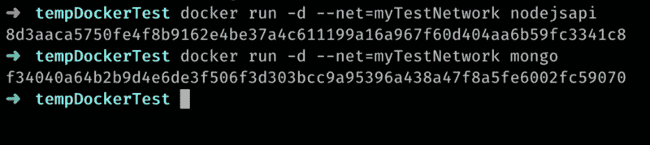

me 从图像中创建一个容器并启动它。现在，我将再次检查网络:

正如您现在看到的，2 个容器正在连接到该网络。我们还可以看到他们使用的 IP 地址，以及他们在同一个子网上运行。我现在应该可以从一个容器 ping 另一个容器了。

让我们获取一个正在运行的容器的 IP:

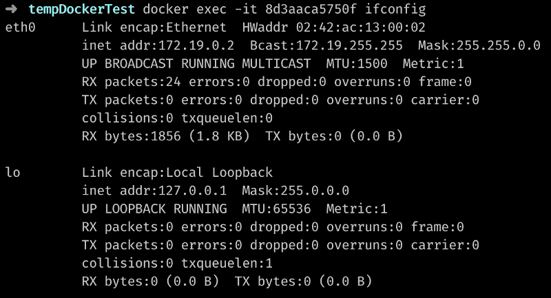

这里，我在 id 为`8d3aaca5750f`的容器中执行了`ifconfig`命令，并将输出重定向到我的终端。

IP 恰好是`172.19.0.2`。

从这个容器中，我应该能够 ping 通另一个 IP 为`172.19.0.3`的容器:

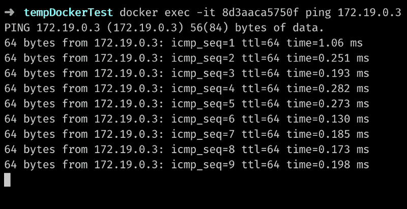

这只是 docker 网络的一个简单例子。还有更多，所以检查一下官方的[文档](https://docs.docker.com/network/network-tutorial-standalone/)。

#### 卷

正如我以前说过的，Docker 容器不应该维护任何状态。但是如果我们需要国家呢？事实上，有些进程本质上是有状态的，比如数据库。例如，数据库需要维护所有包含数据的文件，因为这是数据库的目的。如果我们将这些数据存储在一个容器中，当它消失时，数据也就消失了。此外，我们不能在容器的多个实例之间共享这些数据。

为了解决这个问题，docker 引入了卷。卷允许我们在主机上存储数据，或者在任何其他机器上存储数据，甚至在云上存储数据，并将容器(或者几个容器)链接到这个存储。

例如，以前您可以看到我如何从 MongoDB 映像创建一个容器，并使用以下命令运行它:

`docker run -d — net=myTestNetwork mongo`

运行这样的容器时，Mongo DB 会在这个 Linux 容器内部运行，并将数据库文件保存在容器内部的`/data/db`目录下。

现在考虑一下这个:

`docker run -d -v /folder-on-host-machine/data/db:/data/db — net=myTestNetwork mongo`。

`-v` 标志将一个卷装载到一个容器，因此现在主机文件夹的`/folder-on-host-machine/data/db`和容器的`/data/db`之间的数据将被同步。现在，我们可以运行 MongoDB 容器的几个实例，并将它们全部链接到主机上的这个卷。如果其中一个实例关闭，另一个实例仍然可用，并且数据不会丢失，因为数据存储在主机上，而不是容器中。容器本身是无状态的，这是应该的。

关于卷还有很多需要学习的，比如细节和用例，但是我们不会在本文中涉及它们。这里我只是解释了它们是什么以及我们为什么需要它们。

### 最后的话

简而言之，这就是 Docker！这是一项令人惊叹的技术，它彻底改变了我们开发、部署和扩展应用的方式。在这里，我们只是触及了表面，更多的是你去发现。

感谢任何建设性的反馈。

如果你做到了这一步，请给我一些“掌声”:)

