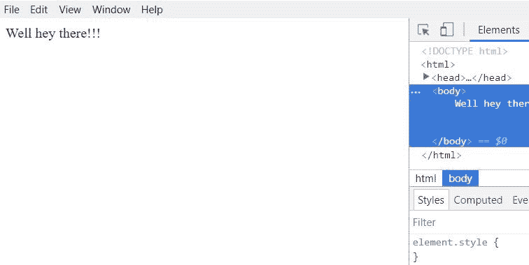
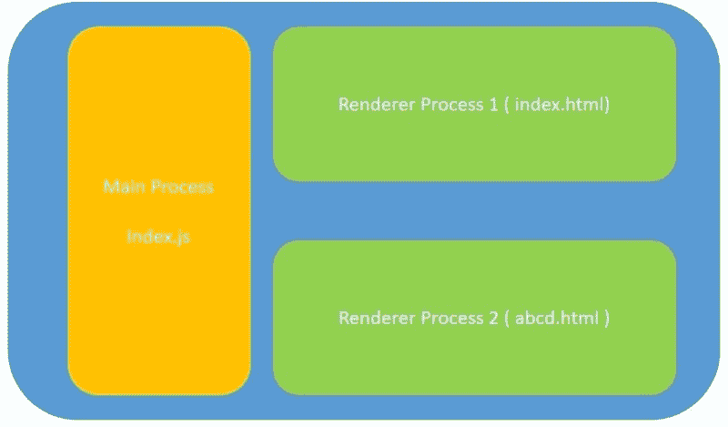
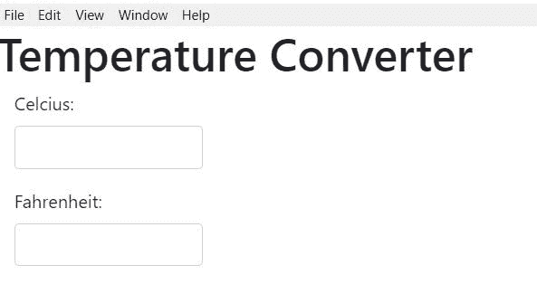

# 如何用 HTML、CSS 和 Javascript 轻松构建桌面应用

> 原文：<https://www.freecodecamp.org/news/how-to-easily-build-desktop-apps-with-html-css-and-javascript-d3e3f03f95a5/>

HTML、CSS 和 Javascript 真的可以用来构建桌面应用吗？

答案是肯定的。

在这篇文章中，我们将主要关注如何使用电子技术来创建带有 Web 技术的桌面应用程序，如 HTML、CSS 和 Javascript。

### 电子

[Electron](https://electronjs.org/) 可以用 HTML、CSS、Javascript 构建桌面应用。此外，这些应用程序适用于多种平台，如 Windows、Mac、Linux 等。

Electron 将 Chromium 和 NodeJS 合并到一个运行时中。这使我们能够将 HTML、CSS 和 Javascript 代码作为桌面应用程序运行。

### 电子锻造

如果直接使用 electronic，那么在构建应用程序之前需要进行一些手动设置。此外，如果你想使用 Angular，React，Vue 或任何其他框架或库，你将需要手动配置。

[电子锻造](https://electronforge.io/)让以上事情变得简单多了。

它为模板应用程序提供了 Angular、React、Vue 和其他框架，避免了额外的手动设置。

它还提供了一种构建和打包应用程序的简单方法。它还提供了许多其他功能，这些功能可以在他们的[文档](https://docs.electronforge.io/)中找到。

### 先决条件

确保您安装了 NodeJS。可以从[这里](https://nodejs.org/en/)安装。

使用以下命令全局安装 Electron Forge:

```
npm install -g electron-forge
```

### 让我们从应用程序开始

使用以下命令创建您的应用程序:

```
electron-forge init simple-desktop-app-electronjs
```

**simple-desktop-app-electron js**是应用的名称。

运行上述命令需要一些时间。

运行完成后，使用以下命令启动应用程序:

```
cd simple-desktop-app-electronjsnpm start
```

这将打开一个如下所示的窗口:



### 了解现有的文件夹结构和代码

该应用程序具有特定的文件夹结构。在这里，我将提到这个文件夹结构中的一些重要内容。

#### package.json

它包含关于您正在创建的应用程序、应用程序所需的所有依赖项以及一些脚本的信息。有些脚本已经预先配置好了，您也可以添加新的脚本。

**config.forge** 路径拥有所有特定于 ElectronJS 的配置。例如 **make-targets** 用于指定各种平台的目标 make 文件，如 Windows、Mac 或 Linux。

package.json 也有`"main": "src/index.js"`,表示 src/index.js 是应用程序的起点

#### src/index.js

根据 package.json 的说法， **index.js** 是主脚本。运行主脚本的进程被称为**主进程**。所以主进程运行 index.js 脚本。

主进程用于显示 GUI 元素。它通过创建网页来做到这一点。

创建的每个网页都在一个叫做**呈现器的进程中运行。**

#### 主进程和渲染器进程

**主进程**的目的是使用`BrowserWindow`实例创建网页。

`BrowserWindow`实例使用一个**渲染器进程**来运行每个网页。

每个应用程序只能有一个主进程，但可以有多个渲染器进程。

也可以在主进程和呈现器进程之间进行通信。然而，这将不在本文中讨论。



*Electron Architecture showing main and renderer process. The file names can vary.*

**abcd.html**在上述架构中显示为第二网页。但是在我们的代码中，我们不会有第二个网页。

#### src/index.html

index.js 将 index.html 文件加载到一个新的浏览器窗口实例中。

这基本上意味着 index.js 创建一个新的 GUI 窗口，并用 index.html 网页加载它。index.html 网页运行在自己的渲染器进程中。

#### index.js 中的代码解释

在 index.js 中创建的大多数代码都有很好的注释来解释它的作用。这里我将提到 index.js 中需要注意的几个要点:

```
mainWindow = new BrowserWindow({
    width: 800,
    height: 600,
  });

  // and load the index.html of the app.
  mainWindow.loadURL(`file://${__dirname}/index.html`);
```

上面的代码片段基本上创建了一个 **BrowserWindow** 实例并将【index.html】的**加载到 BrowserWindow 中。**

你会看到代码中经常用到的 **app** 。以下面的代码片段为例:

```
app.on('ready', createWindow);
```

**app** 用于控制应用的事件生命周期。

上面的代码片段说，当应用程序准备好了，加载第一个窗口。

同样， **app** 可以用来对各种事件执行其他动作。例如，它可以用来在应用程序关闭之前执行一些操作，等等。

### 让我们创建一个温度转换器桌面应用程序

让我们使用之前使用的相同应用程序，并对其稍加修改，以创建一个温度转换器应用程序。

首先，让我们使用以下命令安装引导程序:

```
npm install bootstrap --save
```

将以下代码复制到 src/index.html 中:

```
<!DOCTYPE html>
<html>
  <head>
    <meta charset="utf-8">
    <title>Temperature Converter</title>
    <link rel="stylesheet" type="text/css" href="../node_modules/bootstrap/dist/css/bootstrap.min.css">

  </head>
  <body>
    <h1>Temperature Converter</h1>
    <div class="form-group col-md-3">
      <label for="usr">Celcius:</label>
      <input type="text" class="form-control" id="celcius" onkeyup="celciusToFahrenheit()">
    </div>
    <div class="form-group col-md-3">
      <label for="pwd">Fahrenheit:</label>
      <input type="text" class="form-control" id="fahrenheit" onkeyup="fahrenheitToCelcius()">
    </div>
    <script src='./renderer.js'></script>
  </body>
  </body>
</html>
```

上述代码执行以下操作:

1.  创建一个 id 为**摄氏度**的文本框。每当在这个文本框中键入任何内容，就会调用 **celciusToFahrenheit()** 函数。
2.  创建一个 id 为**华氏**的文本框。每当在这个文本框中键入任何内容，就会调用**函数 fahrenheitToCelcius()** 。
3.  每当在摄氏文本框中键入新值时，华氏文本框中的值都会显示相同的华氏温度
4.  每当在华氏文本框中键入新值时，摄氏文本框中的值都会显示相同的摄氏温度

进行温度转换的两个函数出现在 **renderer.js.** 中

在 **src** 中创建一个名为 **renderer.js** 的文件。将以下代码复制到其中:

```
function celciusToFahrenheit(){
    let celcius = document.getElementById('celcius').value;
    let fahrenheit = (celcius* 9/5) + 32;
    document.getElementById('fahrenheit').value = fahrenheit;

}

function fahrenheitToCelcius(){
    let fahrenheit = document.getElementById('fahrenheit').value;
    let celcius = (fahrenheit - 32) * 5/9
    document.getElementById('celcius').value = celcius;
}
```

**celciusToFahrenheit()** 函数读取**摄氏度**文本框中的值，将其转换为华氏温度，并将新的温度写入**华氏温度**文本框中。

**fahrenheitToCelcius()** 函数的作用正好相反。

### 运行应用程序

使用以下命令运行应用程序:

```
npm start
```

这将显示以下窗口。尝试不同的值。



### 打包应用程序

打包应用程序的命令是:

```
npm run package
```

运行此命令需要一些时间。一旦完成，检查项目文件夹中的 **out** 文件夹。

我在 Windows 机器上进行了测试。这将在 **out** 文件夹中创建一个名为**simple-desktop-app-electron js-win32-x64**的文件夹

所以在**out/simple-desktop-app-electron js-win32-x64**文件夹中，该命令创建了一个**。exe** 文件。单击 exe 文件会自动启动桌面应用程序。

文件夹名**simple-desktop-app-electron js-win32-x64**可以分解为**appname-platform-architecture**其中

*   appname = simple-desktop-app-electron js
*   平台= win32
*   架构= x64

当您不带任何参数运行此命令时，默认情况下，它会针对您用于开发的平台进行打包。

假设您想要为不同的平台和架构打包。然后，您可以使用以下语法:

```
npm run package -- --platform=<platform> arch=<architecture>
```

例如，为了对 linux 进行打包，您可以使用以下命令:

```
npm run package -- --platform=linux --arch=x64
```

这将在 **out** 文件夹内创建一个名为**simple-desktop-app-electron js-Linux-x64**的文件夹。

### 创建 makefile

要为应用程序创建 make 文件或安装程序，请使用以下命令:

```
npm run make
```

运行此命令需要一些时间。一旦完成，检查项目文件夹中的 **out** 文件夹。

**out/make** 文件夹将有一个桌面应用程序的 Windows installer。

当您不带任何参数运行该命令时，默认情况下，它会为您用于开发的平台创建安装程序。

### 密码

这个桌面应用程序的代码可以在我的 GitHub repo:

[https://github . com/aditya-sridhar/simple-desktop-app-electron js](https://github.com/aditya-sridhar/simple-desktop-app-electronjs)

### 恭喜你。

现在你知道了如何使用 HTML、CSS 和 Javascript 创建桌面应用程序。

这篇文章介绍了电子和电子锻造的基本概念。

要了解更多关于它们的信息，您可以查看它们的文档。

### 关于作者

我热爱技术，关注该领域的进步。我也喜欢用我的技术知识帮助别人。

请随时通过我的 LinkedIn 账户与我联系[https://www.linkedin.com/in/aditya1811/](https://www.linkedin.com/in/aditya1811/)

你也可以在推特上关注我[https://twitter.com/adityasridhar18](https://twitter.com/adityasridhar18)

我的网站:[https://adityasridhar.com/](https://adityasridhar.com/)

在 adityasridhar.com 的博客上阅读更多我的文章。