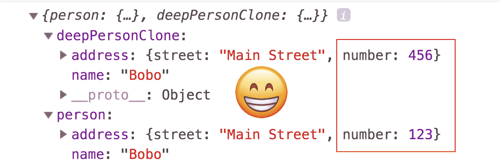

# JavaScript 中的纯函数是什么？

> 原文：<https://www.freecodecamp.org/news/what-is-a-pure-function-in-javascript-acb887375dfe/>

纯函数是函数式编程中的基本构件。它们因其简单性和可测试性而备受推崇。

这篇文章包含了一个快速的清单来判断一个函数是否是纯函数。


### 清单

一个函数必须通过两个测试才能被认为是“纯的”:

1.  相同的输入*总是*返回相同的输出
2.  没有副作用

让我们放大每一个。

### 1.相同输入= >相同输出

比较这个:

```
const add = (x, y) => x + y;

add(2, 4); // 6 
```

对此:

```
let x = 2;

const add = (y) => {
  x += y;
};

add(4); // x === 6 (the first time) 
```

#### 纯函数=一致的结果

第一个示例基于给定的参数返回值，而不管何时何地调用它。

如果你通过了`2`和`4`，你就会一直得到`6`。

其他任何东西都不会影响输出。

#### 不纯函数=不一致的结果

第二个示例不返回任何内容。它依靠**共享状态**来完成它的工作，在它自己的作用域之外增加一个变量。

这种模式是开发人员的噩梦。

**共享状态**引入了时间相关性。根据调用函数的时间不同，会得到不同的结果。第一次的结果是`6`，下一次是`10`，以此类推。

#### 哪个版本更容易推理？

哪一个不太可能滋生只在特定条件下发生的错误？

在一个时间依赖会破坏系统的多线程环境中，哪一个更有可能成功？

肯定是第一个。

### 2.没有副作用


这个测试本身就是一个检查表。副作用的几个例子是

1.  改变你的输入
2.  `console.log`
3.  HTTP 调用(AJAX/fetch)
4.  更改文件系统(fs)
5.  查询 DOM

基本上，函数执行的任何工作都与计算最终输出无关。

这是一个有副作用的不纯函数。

#### 还好的

```
const impureDouble = (x) => {
  console.log('doubling', x);

  return x * 2;
};

const result = impureDouble(4);
console.log({ result }); 
```

这是副作用，但实际上，它不会伤害我们。给定相同的输入，我们仍然会得到相同的输出。

*然而这个*可能会引发一个问题。

#### “不纯洁地”改变一个对象

```
const impureAssoc = (key, value, object) => {
  object[key] = value;
};

const person = {
  name: 'Bobo'
};

const result = impureAssoc('shoeSize', 400, person);

console.log({
  person,
  result
}); 
```

变量`person`已经被永远改变了，因为我们的函数引入了一个赋值语句。

共享状态意味着`impureAssoc`的影响不再明显。要了解它对系统的影响，现在需要追踪它接触过的每一个变量，并了解它们的历史。

> 共享状态=时序相关性。

我们可以通过简单地返回一个具有我们想要的属性的新对象来净化`impureAssoc`。

#### 净化它

```
const pureAssoc = (key, value, object) => ({
  ...object,
  [key]: value
});

const person = {
  name: 'Bobo'
};

const result = pureAssoc('shoeSize', 400, person);

console.log({
  person,
  result
}); 
```

现在`pureAssoc`返回一个可测试的结果，我们永远不会担心它是否在别处悄悄地改变了某些东西。

你甚至可以做到以下几点，并保持纯洁:

#### 另一种纯粹的方式

```
const pureAssoc = (key, value, object) => {
  const newObject = { ...object };

  newObject[key] = value;

  return newObject;
};

const person = {
  name: 'Bobo'
};

const result = pureAssoc('shoeSize', 400, person);

console.log({
  person,
  result
}); 
```

改变你的输入可能是危险的，但是改变它的副本是没有问题的。我们的最终结果仍然是一个可测试的、可预测的函数，无论您何时何地调用它，它都可以工作。

变异被限制在很小的范围内，你仍然会返回一个值。

### 深度克隆对象

抬头！使用扩展操作符`...`创建一个对象的*浅*副本。浅拷贝在嵌套突变中并不安全。

感谢 Rodrigo Fernández Díaz 让我注意到这一点！

#### 不安全嵌套变异

```
const person = {
  name: 'Bobo',
  address: { street: 'Main Street', number: 123 }
};

const shallowPersonClone = { ...person };
shallowPersonClone.address.number = 456;

console.log({ person, shallowPersonClone }); 
```


`person`和`shallowPersonClone`都变异了，因为他们的孩子共用同一个参照！

#### 安全嵌套突变

为了安全地改变嵌套属性，我们需要一个*深度的*克隆。

```
const person = {
  name: 'Bobo',
  address: { street: 'Main Street', number: 123 }
};

const deepPersonClone = JSON.parse(JSON.stringify(person));
deepPersonClone.address.number = 456;

console.log({ person, deepPersonClone }); 
```



现在你的安全得到了保证，因为他们是真正的两个独立的实体！

### 摘要


*   如果一个函数没有副作用，并且给定相同的输入，返回相同的输出，那么它就是纯函数。
*   副作用包括:输入突变、HTTP 调用、写入磁盘、打印到屏幕。
*   你可以放心地*克隆*、*然后*、*变异*，你的输入。不要动原来的那个。
*   传播语法(`…` syntax)是最简单的方式*浅显地*克隆对象。
*   `JSON.parse(JSON.stringify(object))`是最容易*深入*的克隆对象。再次感谢[罗德里戈·费尔南德斯·迪亚斯](https://medium.com/@rodrigo_98972)！

### 我的免费课程

这篇教程来自于我的完全免费的关于 Educative.io、[函数式编程模式的课程](https://www.educative.io/collection/5070627052453888/5738600293466112?authorName=Yazeed%20Bzadough)！

如果你喜欢这个内容，请考虑接受/分享它。

它充满了课程、图形、练习和可运行的代码示例，使用 RamdaJS 教你一个基本的函数式编程风格。

感谢阅读！下次见。