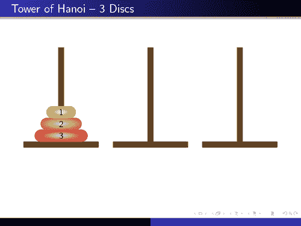

# 如何解决汉诺塔问题-图解算法指南

> 原文：<https://www.freecodecamp.org/news/analyzing-the-algorithm-to-solve-the-tower-of-hanoi-problem-686685f032e3/>

在开始之前，我们先说说什么是汉诺塔问题。这是一个有趣的益智游戏，目标是将一整叠磁盘从源位置移动到另一个位置。遵循三个简单的规则:

1.  一次只能移动一个磁盘。
2.  每次移动包括从一个堆栈中取出上面的磁盘，并将其放在另一个堆栈的顶部。换句话说，只有当磁盘是堆栈中最上面的磁盘时，才能移动它。
3.  不能将较大的磁盘放在较小的磁盘上。

现在，让我们试着想象一个场景。假设我们有三个磁盘的堆栈。我们的工作是将这个堆栈从**源 A** 移动到**目的地 C** 。我们如何做到这一点？

在我们到达那里之前，让我们想象有一个**中间点 B** 。



[Three disks](http://www.texample.net/tikz/examples/towers-of-hanoi/).

我们可以用 B 作为助手来完成这项工作。我们现在准备继续前进。让我们来看一下每个步骤:

1.  将第一个磁盘从 A 移动到 C
2.  将第一个磁盘从 A 移动到 B
3.  将第一个磁盘从 C 移动到 B
4.  将第一个磁盘从 A 移动到 C
5.  将第一个磁盘从 B 移动到 A
6.  将第一个磁盘从 B 移动到 C
7.  将第一个磁盘从 A 移动到 C

嘣！我们解决了我们的问题。


Tower of Hanoi for 3 disks. [**Wikipedia**](https://en.wikipedia.org/wiki/Tower_of_Hanoi)

为了更好的理解，你可以看看上面的动画。

现在，让我们试着建立算法来解决这个问题。等等，我们这里有个新词:“**算法**”。那是什么？知道吗？没问题，让我们看看。


Photo by [bruce mars](https://unsplash.com/@brucemars?utm_source=medium&utm_medium=referral) on [Unsplash](https://unsplash.com?utm_source=medium&utm_medium=referral)

### 什么是算法？

算法是软件开发者最重要的概念之一。事实上，我认为它不仅对软件开发或编程很重要，而且对每个人都很重要。算法影响着我们的日常生活。让我们看看怎么做。

假设你在办公室工作。所以每天早上你都要按顺序做一系列的事情:首先你醒来，然后你去洗手间，吃早餐，为去办公室做准备，离开家，然后你可以乘出租车或公交车，或者开始步行去办公室，过一段时间后，你到达你的办公室。你可以说所有这些步骤形成了一个**算法**。

简单来说，算法就是一组任务。我希望你没有忘记我们做的将三个磁盘堆栈从 A 移动到 c 的那些步骤，你也可以说那些步骤是解决汉诺塔问题的算法。

> 在数学和计算机科学中，算法是如何解决一类问题的明确规范。算法可以执行计算、数据处理和自动推理任务。——[维基百科](https://en.wikipedia.org/wiki/Algorithm)

如果您看一下这些步骤，您会发现我们正在多次执行同一任务—将磁盘从一个堆栈移动到另一个堆栈。我们可以将这些步骤称为步骤**内的递归**。

### 递归


Recursion — [giphy](https://giphy.com/gifs/homer-simpson-the-simpsons-3ov9jQX2Ow4bM5xxuM)

[**递归**](https://en.wikipedia.org/wiki/Recursion_(computer_science)) 就是从那个动作中调用同一个动作。就像上图一样。

所以做任何递归工作都有一个规则:必须有一个条件来停止动作的执行。我希望你了解递归的基本知识。

现在，让我们试着建立一个程序来帮助我们解决汉诺塔问题。我们试图使用伪代码**构建解决方案。**伪代码是一种使用英语编写计算机代码的方法。

```
tower(disk, source, intermediate, destination)
{

}
```

这是我们解决方案的框架。我们将磁盘总数作为一个参数。然后，我们需要传递来源、中间地点和目的地，以便我们可以理解我们将用来完成工作的地图。

现在我们需要找到一个**终端状态**。终端状态是我们不再调用这个函数的状态。

```
IF disk is equal 1
```

在我们的例子中，这将是我们的最终状态。因为当堆栈中有一个磁盘时，就很容易完成最后一步，然后我们的任务就完成了。如果你不清楚，不要担心。等到了最后，这个概念就更清晰了。

好了，我们已经找到了终端状态点，在这里我们将磁盘移动到目的地，如下所示:

```
move disk from source to destination
```

现在我们通过传递这些参数再次调用我们的函数。在这种情况下，我们将磁盘堆栈分成两部分。最大的磁盘(**第 n 个**磁盘)在一个部分中，所有其他(**第 n-1 个**磁盘)在第二部分中。在这里，我们对-(n-1)调用两次该方法。

```
tower(disk - 1, source, destination, intermediate)
```

如前所述，我们将**total _ disks _ on _ stack-1**作为参数传递。然后我们像这样移动我们的磁盘:

```
move disk from source to destination
```

此后，我们再次这样调用我们的方法:

```
tower(disk - 1, intermediate, source, destination)
```

让我们看看完整的伪代码:

```
tower(disk, source, inter, dest)

IF disk is equal 1, THEN
      move disk from source to destination
   ELSE
      tower(disk - 1, source, destination, intermediate)   // Step 1
      move disk from source to destination                 // Step 2
      tower(disk - 1, intermediate, source, destination)   // Step 3
   END IF

END
```

这是三个磁盘的树:


Tree of tower of hanoi (3 disks)

这是 Ruby 的完整代码:

```
def tower(disk_numbers, source, auxilary, destination)
  if disk_numbers == 1
    puts "#{source} -> #{destination}"
    return
  end
  tower(disk_numbers - 1, source, destination, auxilary)
  puts "#{source} -> #{destination}"
  tower(disk_numbers - 1, auxilary, source, destination)
  nil
end
```

呼叫`tower(3, 'source','aux','dest')`

输出:

```
source -> dest
source -> aux
dest -> aux
source -> dest
aux -> source
aux -> dest
source -> dest
```

三个磁盘需要七个步骤才能到达目的地。我们称之为**递归方法**。


Photo by [Aron Visuals](https://unsplash.com/@aronvisuals?utm_source=medium&utm_medium=referral) on [Unsplash](https://unsplash.com?utm_source=medium&utm_medium=referral)

### 时间复杂度和空间复杂度计算

#### [时间复杂度](https://www.techopedia.com/definition/22573/time-complexity)

当我们在机器上运行代码或应用程序时，它需要时间——CPU 周期。但并不是每台电脑都一样。例如，酷睿 i7 和双核处理器的处理时间是不同的。为了解决这个问题，计算机科学中有一个概念叫做时间复杂度。

> 时间复杂性是计算机科学中的一个概念，它将一组代码或算法处理或运行的时间量量化为输入量的函数。
> 
> 换句话说，时间复杂度本质上就是效率，或者说一个程序函数处理一个给定的输入需要多长时间。— [techopedia](https://www.techopedia.com/definition/22573/time-complexity)

算法的时间复杂度通常用大 O 符号表示。这是一个表示时间复杂度的渐近符号。

现在，移动 **n** 个圆盘所需的**时间**为 **T(n)。**对于( **n-1** )有两个递归调用。将磁盘从源移动到目的地有一个恒定的时间操作，假设这是 **m1** 。因此:

```
T(n) = 2T(n-1) + m1    ..... eq(1)
```

和

```
T(0) = m2, a constant   ...... eq(2)
From eq (1)
T(1) = 2T(1-1) + m1
     = 2T(0)+m1
     = 2m2 + m1 ..... eq(3) [From eq 2]
T(2) = 2T(2-1) + m1
     = 2T(1) + m1
     = 4m2 + 2m1 + m1 .... eq(4) [From eq(3)]
T(3) = 2T(3-1) + m1
     = 2T(2) + m1
     = 8m2 + 4m1 + 2m1 + m1  [From eq(4)]
```

从这些模式——等式(2)到最后一个——我们可以说这个算法的时间复杂度是 **O(2^n)** 或 **O(a^n)** 其中 **a** 是大于 1 的常数。所以它有指数级的时间复杂度。对于问题规模的单次增加，所需时间是前一次的两倍。这在计算上非常昂贵。大多数递归程序需要指数级的时间，这就是为什么很难迭代地编写它们。

#### [空间复杂度](https://www.cs.northwestern.edu/academics/courses/311/html/space-complexity.html)

在时间复杂度分析的解释之后，我想你现在可以猜到这是什么了…这是运行一个代码或应用程序所需的 ram 中的空间的计算。

在我们的例子中，每个调用的参数空间独立于 **n** ，**意味着它是常数。顺其自然 **J** 。当我们进行第二次递归调用时，第一次就结束了。这意味着我们可以在完成第一个后再利用空间。因此:**

```
T(n) = T(n-1) + k .... eq(1)
T(0) = k, [constant] .... eq(2)
T(1) = T(1-1) + k
     = T(0) + k
     = 2K
T(2) = 3k
T(3) = 4k
```

所以空间复杂度为 **O(n)** 。

通过这些分析，我们可以看出该算法的时间复杂度是指数级的，而空间复杂度是线性的。

### 结论

从这篇文章中，我希望你现在可以了解河内塔之谜以及如何解决它。另外，我试图给你一些关于**算法的基本理解，它们的重要性，递归，伪代码，时间复杂度，**和**空间复杂度。**如果你想详细了解这些主题，这里有一些著名的在线课程链接:

1.  [算法，第一部分](https://www.coursera.org/course/algs4partI)
2.  [算法，第二部分](https://www.coursera.org/course/algs4partII)
3.  [uda city 上的谷歌课程](https://www.udacity.com/course/data-structures-and-algorithms-in-python--ud513)
4.  [Javascript 算法和数据结构认证(300 小时)](https://learn.freecodecamp.org/)

你可以访问我的[数据结构和算法报告](https://github.com/dipto0321/datastructures-and-algorithm) 来看看我的其他问题解决方案。

我在[GitHub](https://github.com/dipto0321/)|[Twitter](https://twitter.com/Diptokmk47)|[LinkedIn](https://www.linkedin.com/in/diptokarmakar47/)