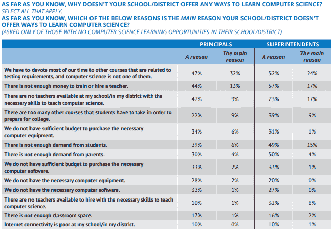

# 我们如何通过社区来普及教育

> 原文：<https://www.freecodecamp.org/news/how-we-can-make-education-accessible-through-community-ce3bf46cb00d/>

作者康纳·林赛

# 我们如何通过社区来普及教育

技术创新，如来自波士顿动力公司的技术创新，让我们得以一瞥在不久的将来令人兴奋的增长和变化！科学、技术、工程和数学(STEM)在许多方面都在发展。新技术推动传统行业的变革，刺激就业增长，并革新教育。

从高级研究到小学教室，随着技术变得越来越普遍，我们的世界正在发生变化。

Photo by [Frank Wang](https://unsplash.com/@nicetomeetyou?utm_source=medium&utm_medium=referral) on [Unsplash](https://unsplash.com?utm_source=medium&utm_medium=referral)

美国教育委员会(ECS)报告称，从 2017 年到 2027 年，STEM 相关行业的就业增长将达到 13%。在这一类别中，[计算机相关产业](http://vitalsigns.ecs.org/state/united-states/demand)将增长最快，达到 14%。相比之下，平均增长预计为 9%。

STEM 相关职业的平均时薪为 38.85 美元，而平均时薪为 19.30 美元。假设一周工作 40 小时，年收入相差超过 4 万美元。失业率也是平均值的一半(2.2%对 5.5%)。

这一切看起来棒极了！惊人的就业增长、高收入和低失业率。这场 STEM 游行面临的一个关键挑战是，这些职位中有许多可能在未来会空缺。仅在制造业，到 2025 年将需要 350 万个工作岗位，其中近 200 万个职位空缺。

Photo by [Louis Reed](https://unsplash.com/@_louisreed?utm_source=medium&utm_medium=referral) on [Unsplash](https://unsplash.com?utm_source=medium&utm_medium=referral)

这种差异最常被引用的原因是工人没有足够的资格来担任这些角色。这让我们想知道，我们能做些什么来让工人们为这些工作做好准备呢？

家长和学生对 STEM 教育的需求是理解的。90%的学生认为他们未来的工作需要一些计算机科学知识。85%的家长同意。来自低收入家庭(年收入 54，000 美元或更少)的父母认为计算机科学比必修课更重要的可能性是普通父母的两倍。

尽管来自行业、学生和家长的需求，47%的校长报告说他们的学校不提供编程课程。53%不提供机器人技术。44%的校长表示缺少教师是他们不提供计算机科学的原因。在这些校长中，40%的人表示他们学校有一名教师可以教授计算机科学。

参考下表，了解不提供计算机科学的其他原因:

Source: Google — Searching for Computer Science

传统教育在为学生未来做准备方面做了许多伟大的事情，但在许多方面都很挣扎。值得注意的是，过度强调测试是编码和其他 STEM 课程的障碍。我们可能不得不在教室外寻找解决方案。

社区驱动和开源运动已经彻底改变了许多行业。开源意味着软件、硬件或其他任何东西都可以免费获得，并且可以重新分发或修改。这使得所有人都可以分享信息。

许多开源项目都是由数百个人共同创造一个有用的工具而产生的。维基百科是我们大多数人都熟悉的一个例子。

许多公司通过对开源做出贡献来产生惊人的影响。以下是一些公司(以及他们的一些项目):

*   [GitHub](https://github.com/)
*   [谷歌](https://www.google.org/) ( [安卓](https://developer.android.com/)、 [TensorFlow](https://www.tensorflow.org/) 、[铬](https://www.chromium.org/)、[镖](https://www.dartlang.org/)、[围棋](https://golang.org/))
*   [Linux](https://www.linuxfoundation.org/)
*   [微软](https://www.microsoft.com/en-us/download/developer-tools.aspx) ( [Visual Studio 代号](https://code.visualstudio.com/)，[)。网络开发工具](https://www.microsoft.com/en-us/download/details.aspx?id=30653)、[打字稿](https://www.typescriptlang.org/)
*   自动化的——WordPress 的创造者

让我们分析两个通过社区和开源来教授 STEM 的组织。

### 自由代码营

[freeCodeCamp](https://www.freecodecamp.org/) 站在很多教编码的组织的最前沿。freeCodeCamp 由昆西·拉森(Quincy Larson)于 2014 年创立，经历了出色的增长。下面重点介绍了一些关键数据:

*   10 亿分钟的用户时间。那可是 2000 年啊！
*   访问量超过 CodeAcademy(估值 4700 万美元)
*   比 Udacity(估值 10 亿美元)的访客还多
*   54，500 名校友，其中数千人现在在计算机相关行业工作
*   课程被翻译成阿拉伯语、中文、葡萄牙语、俄语和西班牙语

很容易假设 freeCodeCamp 有数百名员工，并且资金雄厚！其实完全相反。截至 2018 年 12 月，freeCodeCamp 共有 5 名员工，运营预算为 20 万美元。这是一个 501(c)(3)非营利组织。

想了解更多关于 freeCodeCamp 的信息，请查看这篇文章。

5 个人怎么能做那么多？简单来说，他们没有。至少不是一个人。超过 650 名志愿者为这一增长做出了贡献！许多毕业生(和现在的学生)用他们新学到的知识来回馈社会。

通过[永久开源](https://www.freecodecamp.org/nonprofits/)，freeCodeCamp 还帮助他们的学生为其他开源或非盈利组织做贡献。

虽然大多数用户是成年人，但越来越多的教育工作者正在使用它。随着捐赠和志愿活动的增加，freeCodeCamp 正在为学习小组增加课堂模式和工具！

freeCodeCamp 正在教育成千上万的家庭和教室。人们学习，然后回馈，推动这个惊人的组织的病毒式增长。顺着这个模型，我们来看看可汗学院！

### 可汗学院

另一个由社区推动的变化的奇妙例子更广为人知:[可汗学院](https://www.khanacademy.org/)。

简单总结一下他们的故事，萨尔·汗开始辅导那些在科学和数学方面苦苦挣扎的家庭成员。随着越来越多的家人寻求他的帮助，他在 YouTube 上发布了视频。他还创建了一个网站，在那里他们可以做练习题。越来越多的人发现了他的资源。他很快就被比尔盖茨和谷歌注意到了。

在充满激情的社区的支持下，可汗学院开始接触到越来越多的人。通过志愿内容创作者和翻译者，他们现在接触到 100 多个国家的数十万学生。

根据萨尔·汗的说法，汗学院从来不是为了取代传统的课堂教育而设计的。它旨在通过为教师和学生提供工具来补充它。机器学习可以通过分析学生测验和可汗学院实践的数据来创建个性化的有效学习计划。教师，现在配备了这些计划，可以更好地集中精力在每个学生身上！

一些关于可汗学院的统计数据来自他们的网站:

*   在汗学院完成 60%的年级级数学的学生在 NWEA 地图测试(一种流行的评估测试)中经历了 1.8 倍的预期增长
*   64%的第一代大学生认为可汗学院对他们的教育有意义(164 名被调查者)

查看此 Google Talk，了解关于这个出色组织的更多信息！

通过可获得的资源赋予个人权力，可以实现真正的变革。随着社区围绕相似的信仰和目标发展，成千上万的人被教导，然后能够教导。

这个学习和回馈的过程是教育后代的关键。只要有合适的社区和资源，任何地方的任何人都有学习困难概念的潜力。

我们可以通过向这些社区捐款来帮助全球获得这些资源。捐款不一定是财务上的。通过贡献我们的时间、才能和精力，我们可以支持开源和社区驱动的组织，这些组织正在引起真正的全球变化。

我个人受到了这两个组织的影响。我主要通过 freeCodeCamp 学习编码。我现在喜欢做一份令人满意的 web 开发工作。我通过翻译西班牙语的资源来回报。我们都有独特而宝贵的技能，可以用来做出贡献！

感谢阅读！在业余时间，我写一些关于教育和酷科技的文章。我也为机器人开发教育资源。

在我的[网站](http://cyperionproject.com/)上查看它们，或者在[推特上关注我！](https://twitter.com/CyperionR)