# 揭露位屏蔽动态编程

> 原文：<https://www.freecodecamp.org/news/unmasking-bitmasked-dynamic-programming-25669312b77b/>

作者:Sachin Malhotra

# 揭露位屏蔽动态编程

#### 如何从害怕它到征服它！


> 这个世界上没有巧合。

> **—乌龟大师**

乌龟大师，无意冒犯，巧合是会发生的，我认为这只是上帝保持匿名的方式。不仅仅是我，阿尔伯特·爱因斯坦也相信这一点？。

111，那其实不是我的*幸运数字，*可以这么说。

然而，当我在第 111 期 [LeetCode](https://leetcode.com/contest/weekly-contest-111) 比赛的排名页面上看到这个数字作为我的排名时，我充满了喜悦和狂喜。

太巧了！

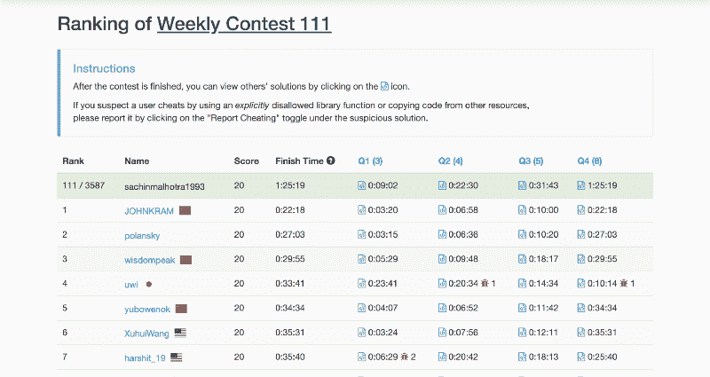

这是我迄今为止在平台上获得的每周比赛的最高排名。比赛号码和排名显然纯属巧合。

竞赛通常包括一个简单的问题，2 个中等水平的问题和一个困难的问题。

通常情况下，难题是需要大量算法知识和事先实践才能在竞赛中取得成功的事情。这场比赛的最终问题也不例外。

为什么我说很难呢？看看在比赛中有多少人能够解决这个问题。

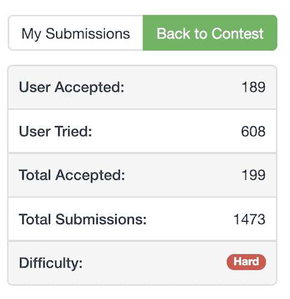

正如文章的标题所示，这个问题可以通过使用基于动态编程的位屏蔽来解决。

动态编程是最可怕的算法领域之一。开发基于动态编程的问题解决方案的直觉需要大量的实践。我一直认为这是对问题递归解决方案的增强。用外行人的话来说，动态编程背后的主要思想是:

> 通过缓存结果来避免重复计算。

作为计算机编程中的一个话题，位屏蔽是我很久以来一直担心的事情(我相信无数其他开发人员也是如此)。这是一个肯定会让你在面试中失去平衡并被拒绝的话题。

那里的程序员通常倾向于避免练习与这个主题相关的问题，仅仅是因为很难建立关于它的直觉。

与位操作相关的优化发生在最意想不到的地方。通过一些实践，我已经能够克服对基于位屏蔽的编程问题的恐惧。

在本文中，除了详细描述我上面提到的问题的解决方案之外，我还将详细介绍位屏蔽的一些基础知识和一些编程问题，在这些方面它会派上用场。

正如你学习的任何新事物一样，很难记住与位屏蔽相关的理论概念。通过练习，记忆力是最好的。这是本文的主要目的。在开始主要文章之前，让我们快速浏览一下目录。

### 吃一点热巧克力，准备好…

*   [0️⃣ 1️⃣什么是钻头操纵？0️⃣ 1️⃣](https://medium.com/p/25669312b77b#ea86)
*   [✍️基础知识](https://medium.com/p/25669312b77b#ee57)
*   [计数设置位的数量](https://medium.com/p/25669312b77b#c94f)
*   [屏蔽和取消屏蔽特定位](https://medium.com/p/25669312b77b#245e)
*   [？缺号？](https://medium.com/p/25669312b77b#927e)
*   [？□什么？数位？？？？](https://medium.com/p/25669312b77b#14da)
*   [⛩字长的最大乘积⛩](https://medium.com/p/25669312b77b#e86c)
*   [使用位屏蔽设置表示法](https://medium.com/p/25669312b77b#a050)
*   [？？将数组划分为 K 个等和子集？？](https://medium.com/p/25669312b77b#a510)
*   [？找到最短的超弦？](https://medium.com/p/25669312b77b#1c4c)
*   [结论？？](https://medium.com/p/25669312b77b#322f)
*   [参考文献？](https://medium.com/p/25669312b77b#0017)

### 0️⃣ 1️⃣什么是比特操纵？0️⃣ 1️⃣

> 比特对于计算机世界就像原子对于人类生活一样。

一位基本上是计算机中最小的存储单位。这是计算机唯一能理解的单位。

一个比特能存储的唯一信息来自两个不同的状态:0️⃣和 1️⃣.计算机执行的任何计算基本上都是某种形式的位操作。

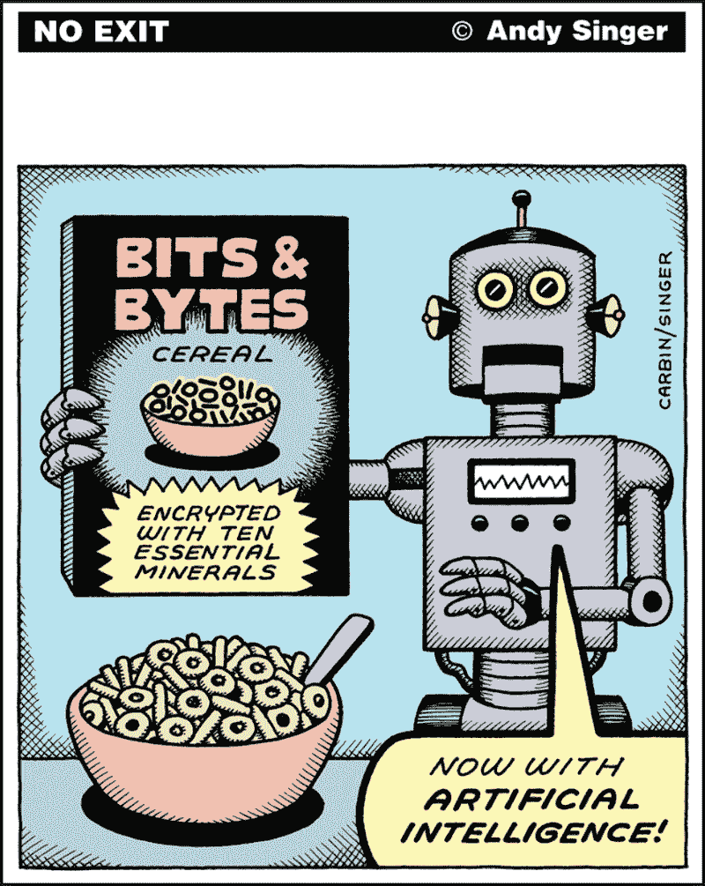

让我们来看一个 [*维基*](https://en.wikipedia.org/wiki/Bit_manipulation) 对于位操作的定义:

> 位操作是用算法操作比一个字短的位或其他数据的行为。需要位操作的计算机编程任务包括低级设备控制、错误检测和纠正算法、数据压缩、加密算法和优化。对于大多数其他任务，现代编程语言允许程序员直接处理抽象概念，而不是表示这些抽象概念的位。

就实现而言，对算法最有用和最有效的低级优化之一是位操作。

在某些情况下，位操作可以绕过数据结构的循环，并提高流形的速度。这种优化的唯一缺点是代码可读性和维护性。

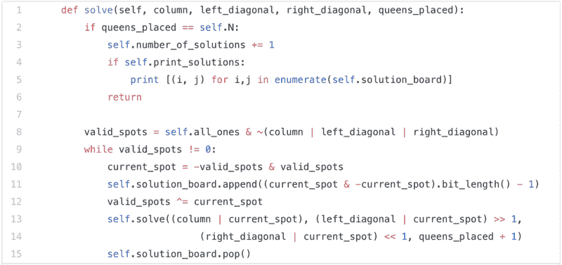

Who wrote this piece of shitty (read lightning fast) code?

这是☠[代码](https://medium.freecodecamp.org/lets-backtrack-and-save-some-queens-1f9ef6af5415)☠的一个可怕片段

### ✍️基础

位操作的核心是逐位运算符:

*   和(&)
*   或者(|)
*   不是(~)
*   异或(^)

这些是基本的操作符，我们可以用它们来执行一些复杂的位操作。因此，在学习一些更有趣的东西之前，温习一下这些运算符和它们的真值表是非常重要的。

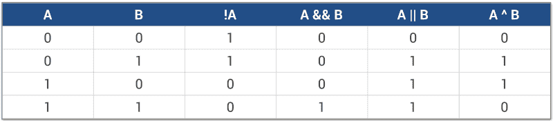

Source: [https://www.topcoder.com](https://www.topcoder.com)

真值表显示了这些运算符对由`A`和`B`表示的 2 位进行运算时的结果。计算机要处理的不仅仅是一位数据。

系统处理的数据通常以字节或千字节或更多为单位。这些运算符如何处理由表示的操作数，例如 8 位或 16 位操作数？在这种情况下，操作是相同的，只是它们对参数的每一位进行操作。让我们考虑一个简单的例子来阐明这一点。

```
A = 11101010B = 00110101
```

```
+-+-+-+-  AND  -+-+-+-+A & B = 00100000
```

```
+-+-+-+-  OR   -+-+-+-+A | B = 11111111
```

```
+-+-+-+-  NOT  -+-+-+-+~A    = 00010101
```

```
+-+-+-+-  XOR  -+-+-+-+A ^ B = 11011111
```

除了这 4 个基本运算符之外，还有另外两组按位运算符非常有用。几乎所有我们将在本文中探讨的问题都将利用它们来大幅提高计算速度。这些是左移`&l`t；<和右边的`sh` ift >和>操作员。

简单来说，左移运算符意味着将一个数乘以 2，右移运算符意味着将一个数除以 2。

让我们看一个简单的动画来说明为什么这些操作符分别被称为`left shift`和`right shift`。

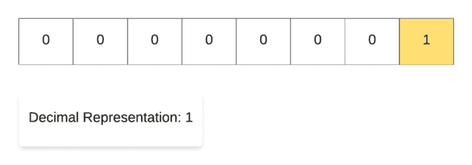

Left Shift Operation in Action.

为了演示左移操作，我们从十进制数`1`开始，然后反复将其乘以 2。正如您在结果数字的二进制表示中所看到的，表示中唯一的`1`一次左移一步。这就是为什么称之为*左*移*操作的原因。*

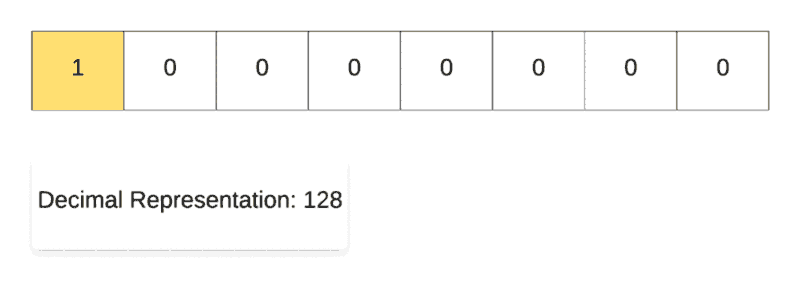

Right Shift Operation in Action.

同样，为了演示右移位操作，我们从十进制数`128`开始，然后反复除以 2。正如您在结果数字的二进制表示中所看到的，表示中唯一的`1`一次向右移动一步。这就是为什么它被称为*右*换档操作。

既然我们都精通了基本的二元操作符，让我们继续讨论这些操作符的一些简单用例。我们将在下面看几个例子。这些问题本身并不是编程问题，然而，它们在很多算法中被用作构建模块。

### 基本用例？

#### 计数设置位的数量

我们上面看到的运算符的一个基本实用程序是计算给定二进制表示中的位数。

这可能现在看起来不是一个重要的用例，但是我们将在以后得到更多的细节，然后它将开始看起来更有意义。现在，让我们尽可能有效地计算设置位的数量。


Source: [giphy](https://giphy.com/gifs/cRMgB2wjHhVN2tDD2z)

我们将为此研究的第一种方法是一个*位*直观。它利用了按位操作符`AND`。从最低有效位开始，我们简单地检查每个位置的位是否置位，并相应地递增计数器。

当两位都是`True`时，AND 运算符返回`True`。让我们看看这个的代码。

另一种方法是用`itself-1`对数字进行`ANDing`处理，直到数字变为零。达到 0 所采取的步骤数将是原始数中的设置位数。

这样做的原因是，每次我们用`itself-1`对数字进行`AND`处理时，数字就会被删除一位。这种情况一直持续到数字变为零。

#### 屏蔽和取消屏蔽特定位

假设我们希望*屏蔽二进制表示*中的特定*位。*这仅仅意味着关掉钻头或者改造一个`1 → 0`。在类似的行上， *unmasking* 简单地表示对特定位的反向操作。

您可能想知道这到底为什么有用。屏蔽(或取消屏蔽)一个位的最重要的用例之一是在集合相关操作中。

我们可以将一组项目表示为一个`X-bit`整数，`X`是集合中项目的数量。屏蔽一个位意味着从集合中删除该项目。对于这一点的实际应用，请耐心阅读？。


Source: [giphy](https://giphy.com/gifs/k-kindergarten-behTrfrYhb3iw)

XOR 是一个非常通用的运算符，它非常适合屏蔽和取消屏蔽操作。

```
1 ^ ? → 00 ^ ? → 1
```

> 当两位相反时，XOR 输出 1，当两位相同时，XOR 输出 0。

本质上，我们可以利用相同的*屏蔽*变量来实现对应于特定位的设置/取消设置操作(中的整数？被称为屏蔽变量)。

```
A ^ (1 << i)
```

上述操作将导致屏蔽索引`i`处的位，如果该位最初在`A`中被*置位*，并且相同的操作将导致解除屏蔽索引`i`处的位，如果该位最初在`A`中被*复位*。

当我们查看在给定的二进制表示中计数置位位数的方法时，我们已经看到了如何检测一个位是否置位。

这里需要注意的一件重要事情是索引。通常，对于高级编程语言中的数据结构，每当我们提到一个特定的索引时，我们指的是该数据结构中从左端开始的特定元素的索引。

我们在上面提到的索引是从*右*端开始的(二进制表示中的最低有效位的索引为 0)。

对于现在来说，这已经足够了。让我们来解决一些实际的编程问题。这将有助于巩固我们在本文中学到的知识，也有助于建立使用位操作解决问题的直觉。

### ？缺号？


Source: [LeetCode](https://leetcode.com/problems/missing-number/description/)

解决这个问题有多种方法。我们可以对给定的数字列表进行排序，然后从`0..n`开始迭代，很容易找到缺失的数字。这将给我们一个`O(NlogN)`解决方案。

解决这个问题的另一个方法是利用字典。我们只需将列表中的所有元素添加到字典中，然后就可以简单地搜索缺失的数字。这是一个线性时间解决方案，但它利用了额外的空间。

我们来看看如何才能像 boss 一样实现一个`O(1)`空间，`O(N)`时间解？通过使用位操作。

我们将在这里使用`XOR`属性来解决这个问题。如前所述，当输入位不同时，XOR 运算结果为`True`，当输入位相同时，XOR 运算结果为`False`。我们对后一种情况感兴趣。你认为下面的评价是什么？

```
A ^ A
```


Source: [tenor](https://tenor.com/view/bottaro-zero-nothing-trani-ok-gif-12693830)

一个数字本身等于 0。这是我们方法背后的主要思想。

我们要做的是，对列表中的所有数字进行异或运算。我们把这之后得到的值叫做`A`。

我们将对来自`0..n`的所有数字进行异或运算。姑且称这个值为`B`。

通过这样做，原始数组中的所有数字都将与它们的对应数字进行异或运算，结果为 0。最后剩下的唯一一个数字将会是缺失的数字。

```
A ^ B = missing number
```

### □什么？□什么？数位？？？？

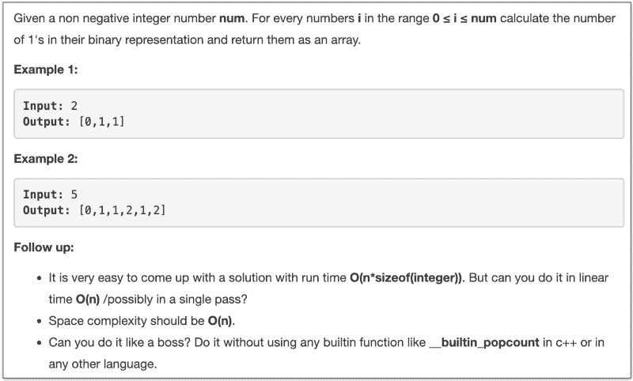

Source: [LeetCode](https://leetcode.com/problems/counting-bits/description/)

这是写下各种测试用例的答案并观察模式的结果非常有帮助的问题之一。所以，我们会这样做，并使用我们找到的模式直接得出最终的算法。

让我们看看前 16 个数字的二进制表示中 1 的个数。

```
0  1  2  3  4  5  6  7  8  9  10  11  12  13  14  15  160  1  1  2  1  2  2  3  1  2   2   3   2   3   3   4   1
```

上面形成的图案如下:

> 偶数 E 与 E / 2 的位数相同，奇数 O 比 O / 2 多一位

这就是上面的结果。这是完整的算法。我们所要做的就是从`0..n`开始迭代数字，并使用上面的两条规则，我们就像老板一样解决了问题？。

如果您关注了本文开始时讨论的动态编程的核心思想，您就会知道这在本质上是一个动态编程问题。

我们利用前一个子问题的结果(较小的数字)来计算当前子问题的答案(设置位数)。

从表面上看，我们不需要任何比特操作来解决这个问题。它可以通过简单的`if-else`子句和一个`for`循环来解决。

所以，这不是真正的位屏蔽+动态编程的问题。

让我们根据上面的想法来看一个简单的解决方案。

这是解决这个问题的一个非常好的方法。对于每个索引`i`，我们检查数字`i / 2`中的位数，如果当前数字是奇数，还加上`1`。

然而，我们可以用一种更古怪的方式来解决它，也就是说使用位操作。正在执行的两个操作是:

1.  除以 2 和
2.  检查数字是否是偶数。

我们已经看到了右移位运算符的使用。>，用于除以 2。

至于第二个操作，我们可以简单地检查是否设置了最低有效位。如果你注意到，所有奇数都有它们的最低有效位。而偶数没有。

我们已经看到了如何使用`AND`操作符检查特定位是否被置位。让我们看看一个极客？以上代码的版本。

如果你看看两个程序的运行时间，它们几乎是一样的。输出数组的构造消耗了大部分时间。

按位运算总是经过优化的，并且比其他高级编程结构更快。

### ⛩字长⛩的最大乘积

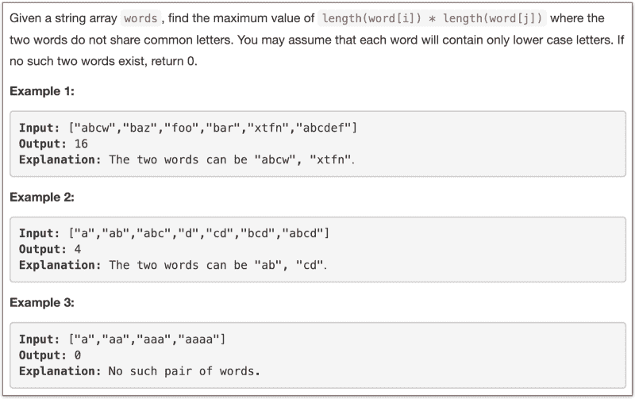

Source: [LeetCode](https://leetcode.com/problems/maximum-product-of-word-lengths/description/)

有好消息和坏消息。好消息是，暴力算法的一个稍微优化的版本将使您的代码在平台上被接受。

强力方法是检查所有的单词对，并且对于每一对，检查它们之间是否有任何共同的字符。对于没有任何共同字符的所有此类对，记录`len(word1) * len(word2)`的最大值。

坏消息是这个算法非常慢。让我们看看 LeetCode 上这个强力算法能够击败的解的百分比。

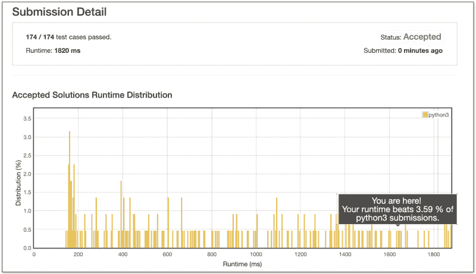

Source: [giphy](http://giphy.com)

你真可耻，沙钦！

这不是你想看到的提交数据。如果你只是想解决问题，那么你在这里的工作就完成了。没什么可做的了。但是，如果你像我一样，如果你想让这只狗停下来？，接着往下读！

让我们先看看这个强力算法的时间复杂度，然后再讨论一个使用位操作的更优化的解决方案。

我们考虑给定数组中所有可能的单词对。考虑到给定数组中有`N`个单词，我们将立刻得到`O(N²)`个复杂度。

除此之外，我们还有一个字典，包含字典中每个单词的字符集。考虑到字母表的大小为 26(仅小写字母)，每个集合的大小可能为`26`。

对于每一对单词，我们执行一个集合交集来检查这两个单词是否有任何共同的字符。集合交集需要线性时间，因此，该算法的总复杂度将为`O(26N²)`，本质上是`O(N²)`。

事实证明，我们无法摆脱必须考虑给定数组中每一对单词的部分。所以，我们不能去掉算法中的`O(N²)`部分。

然而，我们可以去掉的部分是我们比较两个单词，看它们是否有任何共同特征的部分。常数`26`大大降低了算法的速度。

这里需要注意的重要一点是，这个问题只关心常见的字符，而不是它们的频率或顺序。

> 如果我们简单地用一个位掩码来表示一个单词中的字符会怎么样？

我们在这里可以做的是用一个由 26 位组成的位掩码来表示属于一个特定单词的字符。让我们来看这样一个表象，用几句话来把事情说清楚。


Bitmaps for the three words: hello, algorithm, and tweet.

希望上面的图能清楚地说明我们所说的代表相应单词的位掩码是什么意思。一旦我们有了所有单词的位掩码，现在剩下的就是检查两个单词是否有共同的字符。

如果两个字有任何共同的字符，那么这些字符的相应位将在两个字的位掩码中设置。

因此，我们所要做的就是对代表两个单词的位掩码进行按位`AND`运算，并检查我们是否得到 0。如果我们最终得到一个 0，这将意味着没有交集，这正是我们所寻找的。

```
For e.g. Let's consider two words "hello" and "jack" 
```

```
The bitmask corresponding to "hello" will have the bits for 'h', 'e', 'l', and 'o' set.
```

```
The bitmask corresponding to "jack" will have the bits for 'j', 'a', 'c', and 'k' set. 
```

```
Since these words don't have any character in common, the bitwise AND of their bitmasks will give a 0\. 
```

```
Had there been any common characters between them, then both their bitmasks would have set bits at the same indexes (corresponding to the common letters) and hence we would get a non-zero bitwise AND.
```

让我们看看刚才讨论的算法中的修改代码。

位运算超级快。让我们看看这个算法在 LeetCode 平台上的性能，以证实位操作的快速性。

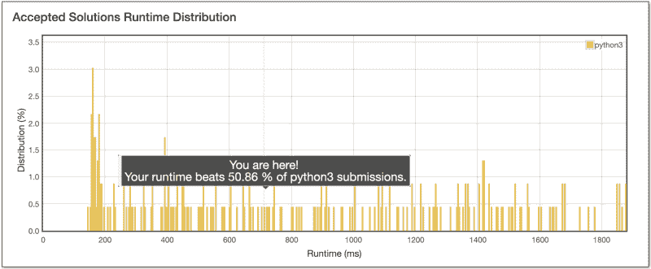

不错吧？我们改进了程序的运行时间，从之前的 1820 毫秒增加到现在的 712 毫秒。这是一个巨大的进步，不是吗？事实证明，我们可以进一步改进这个算法。

> 由于两个不同的字可以具有相同的位掩码，所以可以进行改进。

例如，`hello`和`llohhel`将具有相同的位掩码。我们可以为给定的位掩码存储最长的*字，因为我们关心的是最大化字长的乘积。*

让我们看看合并了这一改进后的代码。

通过这样的优化，运行时间减少到了 208 毫秒？？？


Source: [giphy](https://giphy.com/gifs/3o6ZtiLpjhjv9HVUti)

### **使用位屏蔽设置表示法**

我们在上一个问题中引入了一个想法，这个想法在我们将要讨论的下两个问题中至关重要。本质上，我们使用位屏蔽的思想来表示属于一个集合的元素。

在上一篇文章中，我们考虑了一组 26 个字母，我们使用包含 26 位的位掩码来表示。掩码中特定索引处的 0 表示集合排除，而 1 表示集合包含。

这个想法对于处理包含数字子集的子问题的动态规划问题非常重要。我们无法真正缓存数字的子集。集合不是可散列的数据结构。

**`For e.g. suppose we have an array of numbers [4, 3, 6]`**
**`Let's look at all possible subsets of this array.[]`**
**`[4]`**
**`[3]`**
**`[6]`**
**`[4, 3]`**
**`[4, 6]`**
**`[3, 6]`**
`[4, 3, 6]For dynamic programming problems where intermediate states are defined by these subsets, we need a memory efficient way of performing caching.`

在这种情况下，我们该怎么做？

这就是我们使用位掩码的地方。它们是表示元素子集的高效内存方式。让我们看看如何使用位掩码来表示上面的子集。

**`Since we have 3 elements in our given array, [4, 3, 6] we can make use a a 3-bit number for representing each of these elements. An empty subset would be represented by 000\. Let's look at each of the subsets along with their bit representations.000 -->> []`**
**`001 -->> [6]`**
**`010 -->> [3]`**
**`011 -->> [3, 6]`**
**`100 -->> [4]`**
**`101 -->> [4, 6]`**
**`110 -->> [4, 3]`**
**`111 -->> [4, 3, 6]``011 -->> [3, 6]`**

根据问题的限制，我们可以使用位掩码。例如，在前面的问题中，字母表被限制为大小 26。许多编程问题具有较小的数组大小，并涉及需要您对子集进行散列的动态编程，这通常是基于位屏蔽的方法的一个标志。

例如，在前面的问题中，26 位掩码本质上是一个整数，我们可以简单地将该整数缓存在字典中。这节省了算法的内存占用，并大大降低了算法的时间复杂度，因为位操作非常有效。通过屏蔽和取消屏蔽相应的位，我们可以很容易地在子集中包含和排除元素。

**在最后讨论本文的明星问题之前，我们先来看看基于这个思路的另一个问题。**

### **？？将数组划分为 K 个等和子集？？**

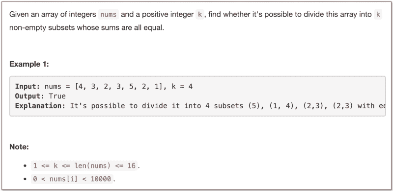

Source: [LeetCode](https://leetcode.com/problems/partition-to-k-equal-sum-subsets/description/)

这只是那些恳求你使用位屏蔽的问题之一。注意数组的大小。只有 16 种元素。如果我们考虑用一个位掩码来表示数组中的元素，那么我们手中就有一个 16 位的整数。

这意味着，为了表示一个给定数组的所有可能的子集，我们有 2 个⁶可能的整数。我们并不真的需要*实际的*子集。我们只需要一个位掩码，告诉我们属于那个子集的元素。基于这个想法，让我们看看基于动态编程的方法来解决上述问题。

问题陈述只问我们 k-等和分割是否可能。它没有要求我们返回*实际的*分区。这使得问题变得简单多了。

**我们不关心一个元素属于哪个分区，只要一个分区的总和是什么`total_sum / k`。**

正如我们在上面提到的，我们将使用一个位掩码来表示数组的元素。

**我们将使用掩码的各个位状态来识别哪些数字已经被分配了分区，哪些数字仍将被分配分区。我们只能给一个分区分配一个数，如果在把它加到那个分区之后，总数仍然是`<= total_sum` / k .**

**如果数组所有元素的总和`S`能被`k`整除，我们必须完成`k — 1`分区，因为最后一个分区会自动到位。如果总和不能被`k`整除，那么这样的等和分割是不可能的。**

#### **为什么要动态编程？**

在根据我们上面讨论的想法来看这个问题的代码之前，理解动态编程是如何适应这种情况是很重要的。我们已经看到了为什么位屏蔽会派上用场。但是动态编程到底适合什么呢？

**递归自然适合这个问题，因为我们已经得到了一组`N`元素，我们需要将它们分成`k`个不同的子集，所有子集的和都相等。**

因为我们不知道一个数字应该属于哪个分区，所以我们必须尝试所有的选项。这意味着，对于一个给定的分区，我们尝试递归地将所有可用的数字相加(在分区和的约束范围内),然后看看哪个选择会引导我们找到答案。

**递归将基于以下三个变量:**

1.  **剩余的`number of partitions`。**
2.  **`mask`表示原数组中哪些元素*未赋值。***
3.  **和当前`partition sum`。**

**众所周知，对于任何被归类为动态规划问题的问题，都应该具备以下两个性质:**

1.  ***最优子结构* ~简单来说就是原始问题必须分解成子问题，子问题的最优解应该可以用来找到主问题的最优解。**
2.  ***重叠子问题* ~这意味着对同一个子问题有多个递归调用，为了避免重复计算，我们可以 ***缓存*** 子问题的结果。**

让我们看看这个问题的递归树，以了解我们是否有任何重叠的子问题。我们已经满足了第一个属性。

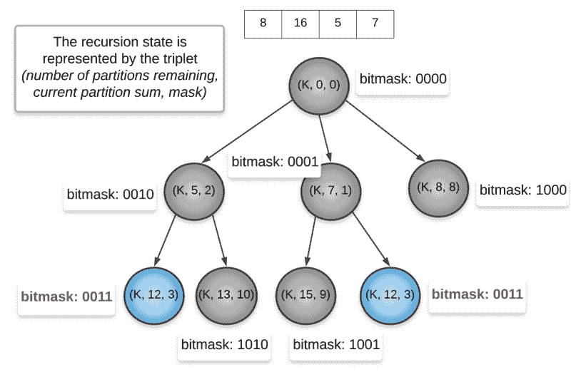

The tuple **(K, 12, 3)** is the recursion state that gets repeated. K is the number of remaining partitions which in our example is 2\. 12 is the current partition’s sum. 3 is the bitmask. If you consider the bitwise representation of 3, you will get 0011\. That implies the two elements 5 and 7 from the set [8, 16, 5, 7] and hence the sum 12.

在上面的递归树中，我们考虑 K = 2。这意味着我们需要 sum **18** 的两个分区。因为我们从未到达上面树中的 **18** ，所以 **K** 从未减少。这只是递归树的一部分，是完整的版本。

我们可以清楚地看到两个递归状态重复出现。我们得到同一个面具`0011`两次。我们可以简单地将结果存储一次，然后在以后重用它。

**现在让我们看看基于位屏蔽+动态编程的代码。**

**现在我们终于准备好来看看这篇文章的主要问题了。这个问题的位屏蔽应用不如当前问题和前一个问题简单。**

### **？找到最短的超弦？**


Source: [LeetCode](https://leetcode.com/problems/find-the-shortest-superstring/description/)

你认为组建超级巨星最简单的方法是什么？

你只需对给定的单词进行任意排列，所有这些排列都将是有效的超弦。

然而，这个问题并没有要求我们组成*任何*超弦。它要求我们形成覆盖所有单词的**最短超弦。**

**对于这个问题，我们就来探讨一下将 ***与*** 的词语串联起来的思路。直观地说，你可以把链接看作集合并。**

让我们考虑两个不同的元素集合，然后看看包含所有元素的集合，即并集。

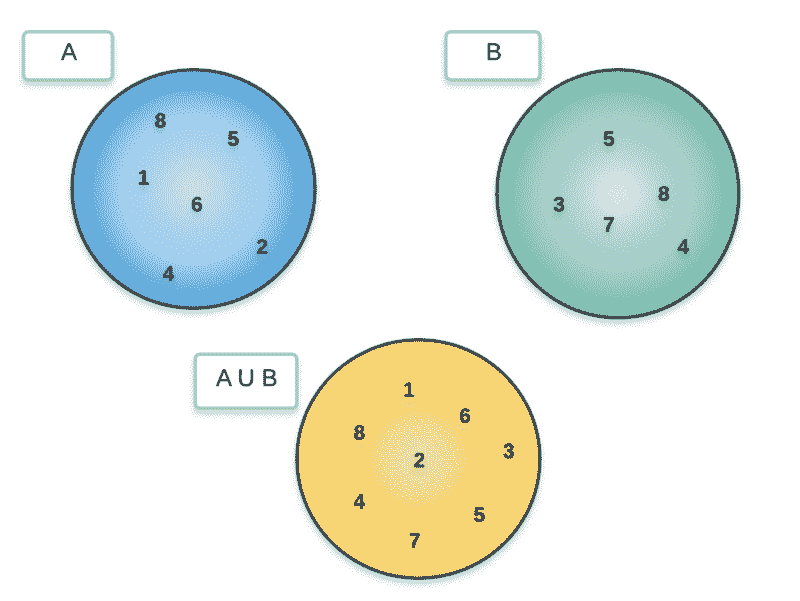

The repeated elements are only considered once in the union.

正如我们在上面看到的，每当我们对两个集合进行联合时，公共元素只出现一次。我们将采用类似的想法，将两个单词连接在一起。

**本质上，当将单词`A`和`B`链接在一起时，我们将只考虑 A 的 ***后缀和 B 的前缀之间的公共部分恰好一次。*** 让我们来看看两个单词链接的图示。**

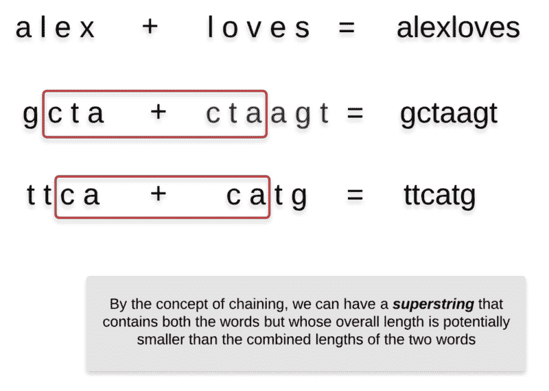

这是一个重要的概念，对解决这个问题很有用。为了避免重复计算找出被链接在一起的两个单词之间的*的公共部分，我们将做一些预处理。*

***我们将找出`A`的后缀与`B`的前缀重叠的长度，其中`A and B`被链接在一起。我们将对给定列表中的所有单词对都这样做。在 Python 中，给定一个字符串`S`，我们可以利用`S[i:]`获得所有的后缀，利用`S[:i]`获得所有的前缀。我们利用这一点进行下面的预处理。***

*既然链接的概念已经很清楚了，我们可以进入问题的下一部分，解释为什么这个问题可以递归解决。*

#### ***为什么要递归？***

*现在我们已经熟悉了链接的概念，我们知道每当我们将两个单词链接在一起时，形成的新单词可以比两个原始单词的长度总和还要短。*

*将这个想法扩展到给定列表中的所有单词，我们必须形成一个超级字符串，它将通过一个单词接一个单词的链接来形成，直到我们完成所有的单词。*

*这里重要的问题是，单词应该以什么顺序连接在一起？*

***对于三个单词`aabc`、`hjaa`和`chuj`，链接顺序`hjaa → aabc → chuj = hjaabchuj`优于`aabc → hjaa → chuj = aabchjaachuj`，因为前者给出长度为 9 的超弦，而后者的顺序为 12。***

*因此，链接顺序决定了形成的超弦的总长度。*

> ***我们将*使用给定的单词列表，尝试所有可能的超弦排列*，并选择最短的一个。***

#### *这似乎是合理的，但为什么是动态编程呢？？*

*我们不再依赖递归树来解释动态编程的必要性，而是看一个例子来解释同样的想法。*

***假设给我们一组 5 个单词`[A, B, C, D, E]`，我们要组成包含所有单词的最短的超弦。***

***我们已经知道我们正在递归地解决这个问题。假设在我们的递归过程中，我们已经决定了前三个单词的链接顺序。假设这个排序是`B → A → C`。现在，我们需要找出在 C 之后链接 **D 和 E 的最佳方式，以便整体超弦长度最小化。*****

***假设在我们的递归中，我们发现`C → E → D`是最好的链接顺序。我们还不知道通过`B → A → C → E → D`形成的超弦是不是最短的一个。然而，我们知道`C → E → D`是三个单词`C, D, and E`的最佳链接顺序。***

*

I know it’s gotten tiring, but keep reading ?* 

***假设现在我们在递归中稍微不同地排列了前三个单词(一个单独的递归路径),现在我们有了`A → B → C`,我们必须再次递归**,以找出`E and D`的最佳可能排列。然而，我们从上面已经知道最好的可能安排是`C → E → D`。为什么又要计算这个？这就是动态编程的用武之地。*****

*******就这样？继续吧。多解释一些。*******

***不，现在让我们看看将所有这些想法结合在一起的 Python 代码。***

*****啊哦！这一切中位屏蔽到底在哪里？*****

******

#### ***好了好了，让我们开始位屏蔽吧？***

***让我们以稍微不同的方式重新表述这个问题，这将使位屏蔽的要求变得非常清楚。***

*****给定一组`N`元素，我们需要为它们找到一个合适的排列，使某个度量最小化。由于我们依赖于动态编程，我们将*缓存子问题*的*结果。******

***我们的子问题将由这 N 个项目的子集来表示。正如我们在本文中看到的，特别是在前两个问题中，很难像现在这样缓存子集。***

***在问题约束较小的情况下，我们可以使用位掩码来表示列表的元素，并将其用于缓存目的。***

> ***毕竟，位掩码只是一个数字。***

***让我们最后来看看给定一组 N 个单词，寻找最短超弦的代码。***

*   *******第 3 行~** 初始掩码由全 1 组成。这意味着所有的单词都可以链接。如果掩码变为 0，这意味着没有字留下用于链接。所以，超弦的长度是 0。这是基本情况。*****
*   *******第 7 行~** 如果你注意到了前面包含 5 个单词`[A, B, C, D, E]`的例子，你就会知道，当 c .** ****后面的两个单词`D and E`被链接在一起时，缓存的机会就出现了。因此，我们需要知道 superstring 中的前一个单词，以便附加其余的单词。因此，除了掩码之外，代表超字符串中前一个单词的原始数组中的索引的`prev_i`也被用于缓存目的。*******
*   ********第 12 行，15 ~** 我们总是检查所有给定的单词集，并且只考虑那些在我们的递归中当前步骤的*选项，这些选项以前没有被使用过。为此，我们使用了位屏蔽。为了查看一个字是否已经被使用，我们简单地检查掩码中相应索引处的位是否为*未置位*。*******
*   *******第 18 行~** 利用了我们之前做的预处理。对于要链接/附加到索引`prev_i`处的单词，我们知道两者之间的重叠量。因此，如果我们决定将索引`i`处的单词作为递归中的下一个单词，那么它将增加到我们的超级字符串中的长度将是`len(A[i]) — overlap between the words A[prev_i] and A[i]`*****

***所有这些都很好，但是最初的问题不是问超弦本身，而不仅仅是最短超弦的长度吗？***

***我在逃避解决整个问题吗？当然不是！***

***

Source: [giphy](https://giphy.com/gifs/no-smh-scooby-doo-EriPNV1whwKac)*** 

*****函数`recurse`只是返回最短超弦的*长度*，而不是超弦本身。然而，问题陈述要求我们找出最短的超弦。*****

*****如果你仔细看代码，你会注意到一个`parent`字典。在递归的每一步，我们都有多个单词选项可以链接到当前的超级字符串(从而扩展它)。我们使用父字典来存储每一步给出最佳*答案(最短长度)的单词。******

******对于给定的掩码——它告诉我们哪些单词已经被链接在一起——和给定的前一个单词(`prev_i`),`parent`字典存储给出最佳答案的超弦中的下一个单词。******

******我们会用这个字典回溯，形成*最短超弦。*******

********

****最后，对于一个有竞争力的程序员来说，这是最好的视角之一，尤其是在限时比赛中解决难题的时候。****

### ******结论？？******

*   ****位上的操作是高效的，并且它们通常通过优化的系统级指令并行执行。****
*   ****编写干净、可理解的包含位操作的代码很困难，但并非不可能。****
*   ******`AND`、`OR`和`NOT`是三种基本的按位运算符。******
*   ******`left-shift &l`t；< an `d the right-sh` ift > >运算符用于乘以或除以 2。******
*   ******`XOR`操作符是一个多功能的操作符，可用于许多不同的编程问题。只有当两位相反时，它才返回`True`，否则返回`False`。******
*   ****基于动态编程的解决方案包括对子问题结果的某种缓存。子问题由一组变量表示。这些变量不一定是原始数据类型。****
*   ****当我们必须处理子集并且列表/数组很小时，位屏蔽在动态编程问题中非常有用。掩码(全为 0 或全为 1)可以表示集合的元素，设置或取消设置一个位可以表示包含和排除该集合。****
*   ******如果数组/列表/集合的大小大约是 20，那么你会有 2 个⁰ ***可能的*** 位掩码，也就是差不多一百万个。在一个测试用例中，并不总是会遇到所有这些位掩码。然而，这是可能的最大数量。******
*   ****我们必须小心何时使用位屏蔽。我们不能有一个 100 位的掩码，因为这在计算上是难以处理的。****
*   ****对于一个适合动态规划的解，它应该满足最优子结构和重叠子问题的性质。通常，通过一些实践，您可以开始识别手头的问题是否有基于 DP 的解决方案。****

### ******参考文献？******

*   ******[https://www . hackere earth . com/practice/notes/bit-manipulation/](https://www.hackerearth.com/practice/notes/bit-manipulation/)******
*   ******[https://blog . bitsrc . io/bit mask-there-is-space-at-bottom-5a 741d 18 C4 e 3](https://blog.bitsrc.io/bitmask-there-is-space-at-the-bottom-5a741d18c4e3)******
*   ******https://bit.ly/2QRTIpj******
*   ******https://bit.ly/2CCUCxn******
*   ******[https://www . geeks forgeeks . org/bit masking-and-dynamic-programming-set-1-count-ways-to-assign-unique-cap-to-every-person/](https://www.geeksforgeeks.org/bitmasking-and-dynamic-programming-set-1-count-ways-to-assign-unique-cap-to-every-person/)******
*   ******[https://www . geeks forgeeks . org/bit masking-dynamic-programming-set-2-tsp/](https://www.geeksforgeeks.org/bitmasking-dynamic-programming-set-2-tsp/)******
*   ******https://codeforces.com/blog/entry/17973******

****这是一篇很长的文章，也是我非常喜欢写的文章。如果你已经读到这里，那么你可能会发现这篇文章非常有帮助。尽可能多地分享爱来传播爱，摧毁那个按钮！？****

****哦，如果你想阅读更多这样的精彩文章，这些文章都配有动画和美丽的解释性图片，请查看我们新开业的 [**厨房**](https://github.com/DivyaGodayal/CoderChef-Kitchen/) 。****

****相信我，我们为你准备了一些令人咂舌的食谱，随着假期的临近，我相信你会喜欢的。****

****祝大家圣诞快乐，新年快乐！****