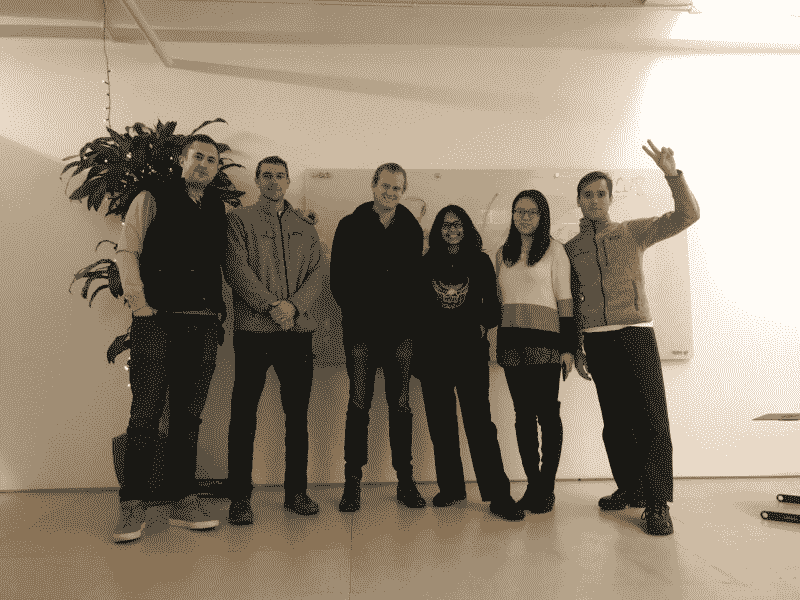
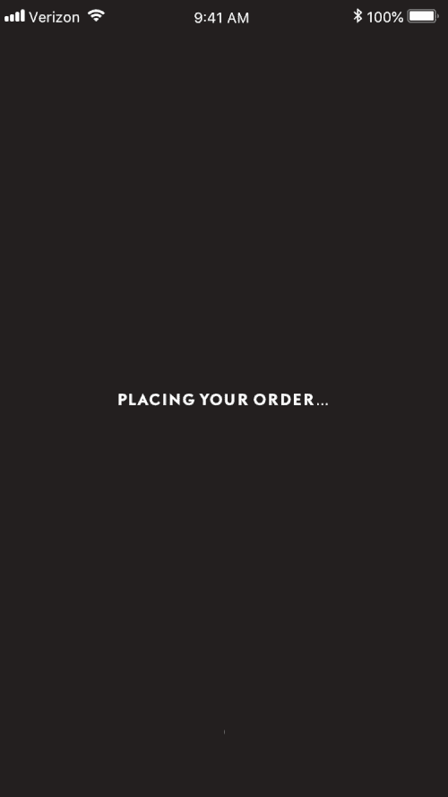
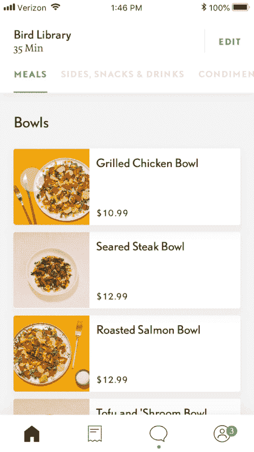
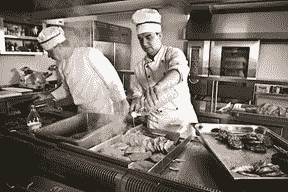
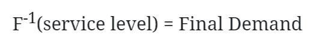
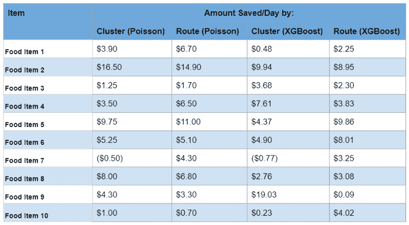

# 我们如何使用机器学习来减少食物浪费和节省资金

> 原文：<https://www.freecodecamp.org/news/how-we-reduced-food-wastage-and-saved-money-using-machine-learning-c462aa5a3b30/>

作者:Soundarya Balasubramani

# 我们如何使用机器学习来减少食物浪费和节省资金

欢迎来到五个简单学生的故事，他们都有一个大目标:减少食物浪费。仅在美国，每年就有超过 100 个帝国大厦的食物堆积起来。你可能会问，五个学生是如何梦想解决这个艰巨的任务的？这是我们善用数据的故事。

在[哥伦比亚商学院的*行动分析*](https://www8.gsb.columbia.edu/courses/mba/2017/fall/b8146-001) *，*中，我们与一家创新的食品配送初创公司合作，以最大限度地减少浪费和削减开支。该课程将 4-6 名学生组成的团队与真实的公司配对，通过分析解决问题。

我们多元化的团队由来自工程和应用科学学院的三名 MBA 和两名数据科学家组成。我们的背景包括金融、风险投资、工程和潜艇。我们与[好叔叔](https://www.gooduncle.com/)合作，这是一家创新的科技创业公司，它将全国最好的食物带到了全国的大学校园。

The Good Uncle app in action

### 问题是

好叔叔的所有食物准备工作都始于特拉华州的一个大型中央厨房，大约在顾客下单前一周。这种商业模式没有给公司留出时间来适应需求；简而言之，食物浪费对他们需求预测的准确性特别敏感。

其他食品企业监控他们的库存，并可以在餐厅用完之前订购补货。好叔叔需要在顾客想点披萨卷的几天前准确地点西红柿和马苏里拉奶酪。

*1\. Pre-cook the food at a central location, 2\. Deliver to a local market, 3\. Finish the cooking while in vehicle for delivery.*

### 我们的旅程

我们第一次见到[马特，好叔叔](https://www.linkedin.com/in/mattdoumar/)的创始人兼首席执行官，是在他位于曼哈顿中城的总部办公室。在讨论了业务的来龙去脉后，我们与雪城大学的【2018 年春季数据分道扬镳，戴上了我们的清洁手套。

我们添加了我们能想到的每一个外部特征，包括 DarkSky 的天气、StubHub 的事件，当然还有学校网站上的学术日历。有了大量的描述性特征，我们马上开始装配模型。很多模型。

我们的过程始于在最精细的层次上对需求建模的宏伟目标。当一个又一个模型悲惨地失败时，我们抑制住沮丧，向我们宝贵的教授和杰出的助教寻求帮助。我们意识到我们已经与一个强大的敌人展开了战斗:稀疏需求时间序列预测。

我们深入数据，寻找合理的方法将销售点组合在一起。我们需要通过在时空基础上汇总销售额来消除这种稀疏性。因为食品卡车一整天都在运送点穿梭，我们需要研究几种聚类方法。

随着建模技术和数据集群的两位数组合，我们转向基准测试，以便为好叔叔选择模型和最终产品。

尽管我们的目标一直是需求预测，但我们意识到我们的实际目标是底线。我们量化了菜单上给定项目订购过多或过少的货币价值，并以此设定目标方程。为了比较模型，我们针对利润进行了优化，发现 XGBoosted Trees 和 Poisson Regression 是明显的领先者。带着一些恢复的尊严和更多的自信，我们转向了实时数据。

大约在 2018 年秋季学期进行到一半的时候，我们从该公司获取了一个数据转储，并开始实时优化模型。结果在下一节中不言自明。

### 解决方案:**注意:前面有技术术语* *

我们在六种以上的建模技术之间进行斗争，随着新的数据和见解的出现，我们不断地进行转换。我们使用线性回归、自回归建模、泊松回归、随机森林、极端梯度提升决策树等等。最终，完美的模型不是一个，而是两个不同模型的组合。

我们意识到这不仅仅是一个涉及预测需求的问题，还涉及预测库存，因此我们将上述机器学习模型与用于库存管理的著名的 [*报童模型*](https://en.wikipedia.org/wiki/Newsvendor_model) 结合起来。

首先，我们将输入数据输入泊松广义线性模型(GLM)和梯度推进树模型。这两个模型的输出都作为报童模型的输入，将上述等式转换为:

最终输出给出了需求预测，通过训练模型并用不同的服务级别(从 0.1 到 0.99)进行验证，我们能够找到最佳的服务级别。

### 结果:

下面的图表显示了我们的模型如何优于当前的方法(姑且称之为顾的模型)。将我们的新方法与旧方法进行比较的最佳方式是找出未成年人(供小于求)和超龄人(供大于求)，如下图所示。

从这个图表中，我们可以看到两个主要的要点。

*   我们可以灵活地设置我们的未成年人和超龄水平，而这种灵活性对于顾的模型(它采用一个常量值)是不可能的。
*   对于 0.67 到 0.91 之间的服务级别，与好叔叔的模型相比，我们可以实现更小的超龄*和*未成年。

我们意识到，通过将最优服务水平设置为 0.68，我们的模型与 GU 的模型相比，对于每 10 天每条路线的单一食品，能够节省*~ 70 美元。但是我们想更进一步。因此，我们运行了路线和聚类中最常购买的 10 种食品的模型，并得到了如下所示的便利表格:*

Savings/day on the top ten most popular food items via routes and clusters

我们的模型能够在所有项目上省钱，除了一个(它就是不喜欢烧烤拉猪肉板！).最后，为了清楚地展示该模型的能力，我们通过在所有路线和前 10 项的聚类上运行该模型，将美元值外推至整个学期。

***我们观察到，在短短一个学期内，仅在一个校园内，所有投递点(路线方面)购买最多的 10 种食品就可能节省 29，256 美元。***

### 最后

这是我们任期内最大的学术机会，远远超出了教室的范围。我们和新朋友一起度过了一段美好的时光，我们从教授那里学到了很多东西，当然，还有好叔叔的优秀员工们。我们不仅喝了数据分析的水，还分享了一个创新、快速发展的创业公司的旅程，并向纽约市最优秀的企业家学习。

### 接缝

团队由 5 名成员组成:[鲍博文](https://www.linkedin.com/in/bowen-bao/)、[唐霍尔德](https://www.linkedin.com/in/don-holder-8b72a0122/)、[杰克·斯皮森](https://www.linkedin.com/in/jackspitsin/)、[尼古拉·穆欣](https://www.linkedin.com/in/nicolai-mouhin/)和你的真心。这篇文章是团队合作的成果。

******************************************************************

*如果你觉得这很有用，请点击 [**关注我**](https://medium.com/@poojabalasubramani) 获取更多文章。你知道你可以*吗？米*矿石比一次？试试吧！？我喜欢写关于社会问题、产品、技术领域以及我在美国读研究生的经历。这是我的个人博客。 **如果**你是一个每天都在寻找学习的好奇灵魂，这是我为你创造的一顶 Sl [**ack Group t**](https://poojabalasubramani.com/2018/12/18/exciting-news-an-update-to-the-slack-group/) 帽子。*

**和我联系的最好方式是通过 **[Instagram](https://www.instagram.com/thecuriousmaverick/)** 和 [**脸书**](https://www.facebook.com/pooja.balasubramani?ref=bookmarks) 。我在那里分享一些有趣的内容。想了解更多我的职业生活，可以查看我的 [**LinkedIn**](https://www.linkedin.com/in/soundarya-balasubramani/) 。快乐阅读！**