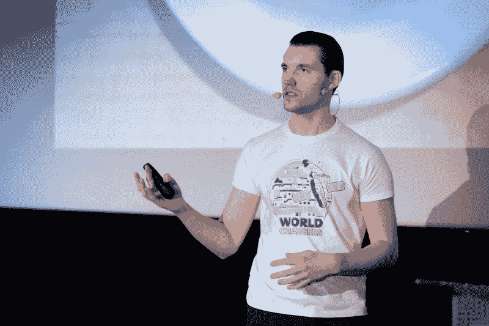
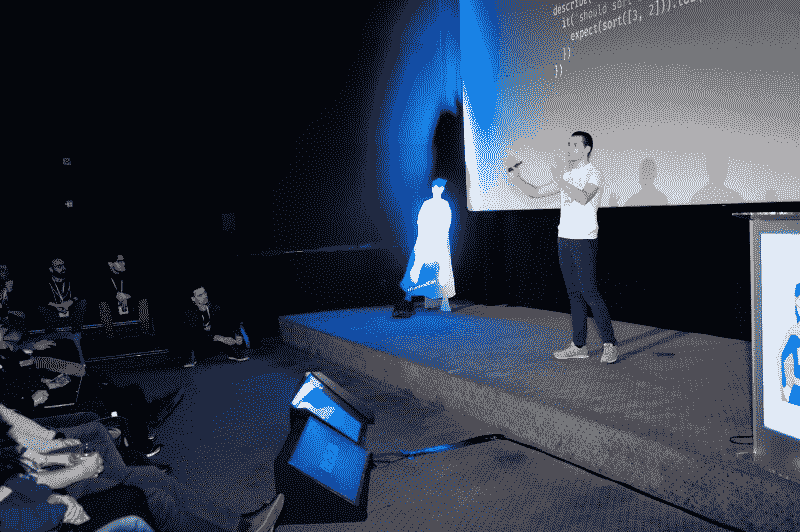
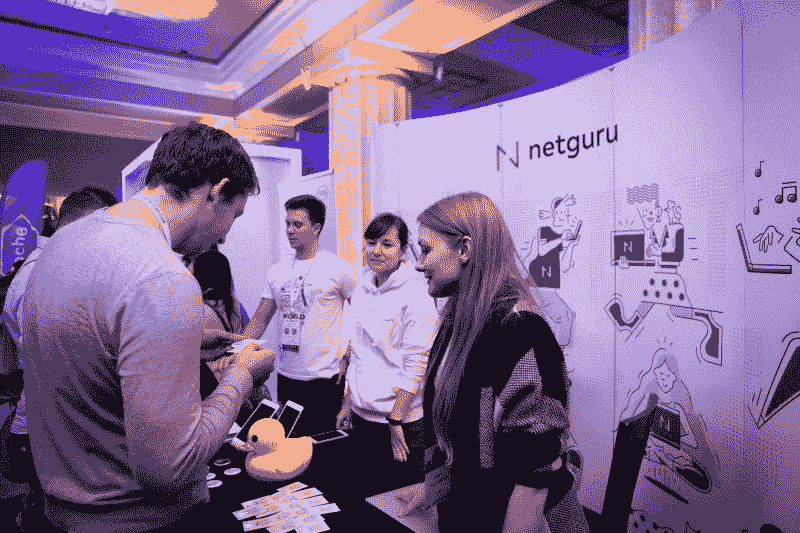
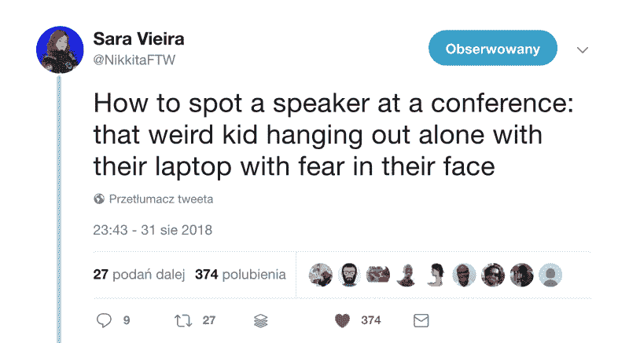
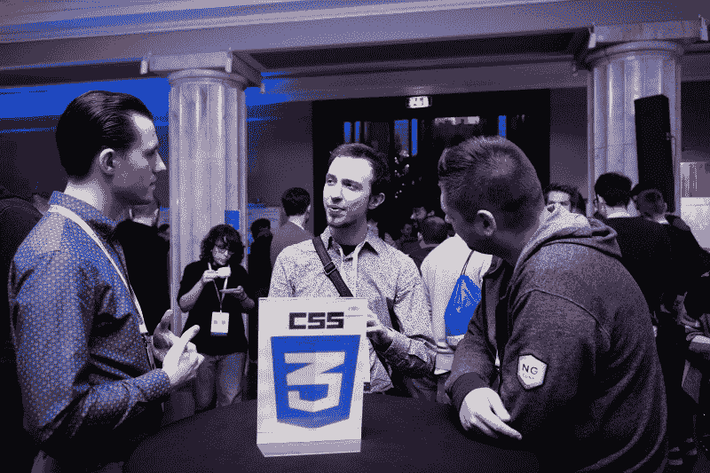
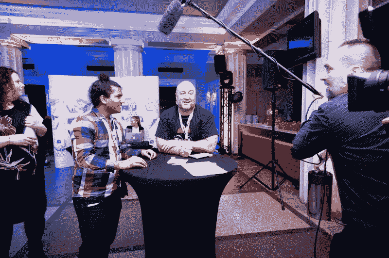
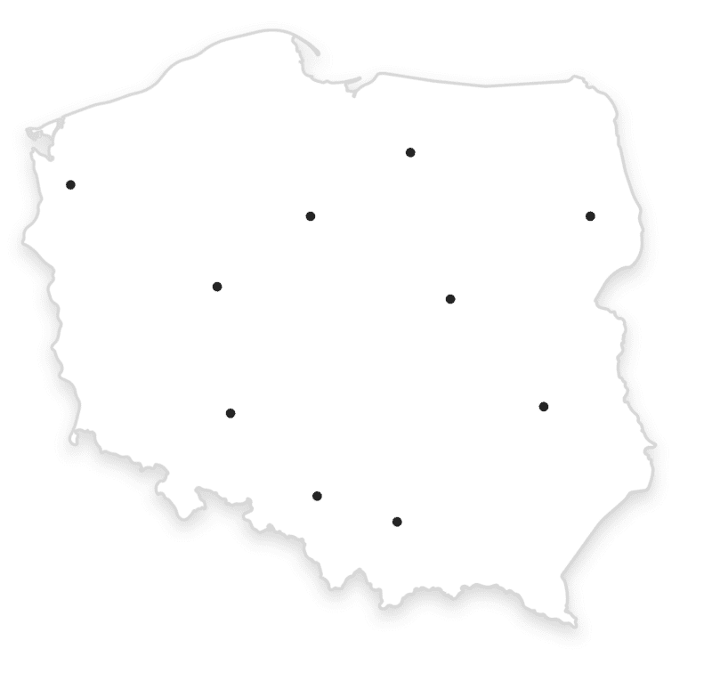
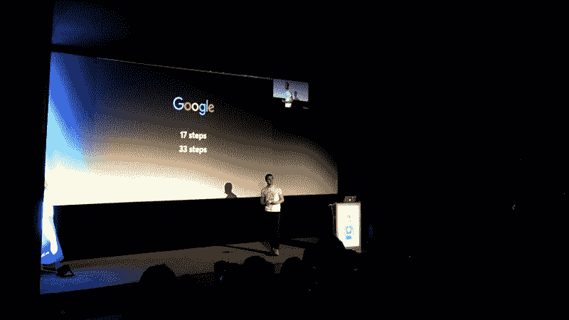

# 我在波兰(几乎)每一次集会上的演讲中学到的

> 原文：<https://www.freecodecamp.org/news/what-i-learned-speaking-at-almost-every-meetup-in-poland-c94ec04f29b1/>

为了狩猎

# 我在波兰(几乎)每一次集会上的演讲中学到的

我在 2018 年的任务是在波兰所有与前端相关的会议上发言。12 月，我甚至成功参加了我的第一次国际会议。一路上我学到了很多。即使你还没有公开发言，你如何从我的经历中获益？好吧，让我们来看看。

### 你可以说话

在我旅程的开始，我相信我必须成为一个知名的演讲者。或者说我必须用一些神奇的词语说服组织者，否则我不会被邀请。

令人惊讶的是，事实并非如此。几乎所有 meetup 的组织者后来都告诉我，他们愿意邀请第一次发言的人(尽管有些人承认他们只会让他们做一个简短的发言)。多酷啊。

这件事教会了我一些东西。有时候，局限只存在于我们的头脑中。

你现在头脑中有哪些局限，你还没有面对现实？

Me speaking at [Frontend Con 2018](https://frontend-con.io/).

### 题目不重要

一开始，我被这个话题吓坏了。我最大的借口是什么？我以为我没什么可说的。当我终于有了一份名单。我不知道我应该选择哪一个。

你看，参加许多不同的聚会给了我一个听很多演讲的机会。有些书名很有前途，但最后证明很无聊。其他的话题听起来一点也不令人兴奋，但是这个演讲非常吸引人。那么，秘密是什么？

送货。你可以谈论最新、最热、最令人兴奋的话题，但如果你的演讲很糟糕，听众将会经历一生中最长的 30 分钟。或者**你可以有一个相对无聊的话题比如 CSS 中的边框。你可以用一种令人兴奋的方式来表达，这样人们就不会意识到 30 分钟已经过去了。**

哦，等等。在选择演讲人的过程中，主题确实很重要。一个吸引人的演示标题很有帮助。但是一旦被邀请，话题就不重要了。不是你说什么，而是你怎么说。

[Michał](https://www.freecodecamp.org/news/what-i-learned-speaking-at-almost-every-meetup-in-poland-c94ec04f29b1/undefined), Joanna, and Marta talking to peeps at Frontend Con 2018.

### 提前准备

作为一名公众演说家，准备是我最大的弱点。这就是为什么我的幻灯片从来没有得到文案的校对或设计师的微调(尽管 [Netguru](https://netguru.co) 为员工免费提供这些服务！).真遗憾。

关于 FrontendCon 我最后悔。我花了太多时间研究我要讲的利基，以至于在我演讲的前一天我几乎没有幻灯片(这是我今年最重要的演讲！？).

这不仅给我造成了不必要的压力和不眠之夜。我没有和人们交谈，没有听精彩的演讲，没有和社区领袖交朋友，而是坐在演讲室里，头上戴着耳机准备我的演讲。多亏啊！

[Sara Vieira](https://www.freecodecamp.org/news/what-i-learned-speaking-at-almost-every-meetup-in-poland-c94ec04f29b1/undefined)’s tweet.

不要那样。提前准备你的演讲。让它被校对，被设计得超级棒。邀请人们来听你的排练，并向他们寻求诚实、彻底坦率的反馈。尽可能利用所有的支持。活动期间呢？为人们而存在。联系并结交新朋友。

### 记住演讲者的名字

> 一个人的名字对那个人来说，是任何语言中最甜美、最重要的声音

当你去参加会议时，大多数发言者都认识你并相互拥抱，但没有人认识你，这就够尴尬的了。相信我，我也经历过。在那些时刻，确保你至少了解他们。

说真的。花点时间记住每个演讲者的名字。这会有回报的。你会表现出对他们的尊重，让自己更讨人喜欢，并在活动中建立更深的联系。说到联系…

### 人脉很重要

等等，什么？就在上面几段，你告诉我，我可以很容易地被邀请参加任何聚会。确实如此。但会议却不是这样。

你可以接受征稿并被邀请，因为有些会议欢迎第一次发言的人。但是，如果你想在更受认可、更有声望的活动上发言，该怎么办呢？你最好有关系。

只要你认识合适的人，他们也认识、喜欢并推荐你，你几乎可以在任何地方演讲。不管你喜不喜欢，不管在你眼里公平与否，这就是我看到正在发生的事情。

人脉很重要。拥抱现实，交些朋友。

[Vitalii Bobrov](https://www.freecodecamp.org/news/what-i-learned-speaking-at-almost-every-meetup-in-poland-c94ec04f29b1/undefined) and I discussing CSS tricks with folks.

### 没有人什么都知道

你知道那些广为人知的人，他们在推特上有很多粉丝，诸如此类的？人们尊敬的领导者，在我们行业的大事件中发言的专家？当你想到他们的时候，你可能会觉得自己如此渺小。像个冒名顶替者，也许？你知道那种感觉，是吗？

嗯，我有机会和其中一些人聊了聊。你知道吗？典型的对话听起来是这样的:

我:那你说的是什么？
辨识度超高的独角兽专家:关于 x .你呢？
我:关于基于属性的测试。
辨识度超高的独角兽专家:哦，我没听说过。

看到了吗？你也是专家。你彻底研究了你的话题。你有自己的视角和经历。**珍视你自己**因为事实是每个人都不擅长某件事(或大多数事)，没有人知道所有的事情。

### 专注于重要的事情

我试图做很多事情来让自己在社区中被认可。

我试过 YouTube。这对我来说超级难，需要很多技能和时间，虽然我还没有完成，但它暂时超越了我。

我尝试了 Instagram Stories，主要是为了在镜头前舒服一点。你猜怎么着？我现在在镜头前很自在，但是没有人认识我。

你知道为什么那些东西不起作用吗？因为**我去错了地方**。活动组织者对你的 Instagram 账户一毛钱都不会给。也不是关于你的 YouTube 频道(除非它足够大)。那么关心的是什么*？*

**推特。毫无疑问，Twitter 是 IT 社区的首选平台(至少在国际上是这样)。如果你特别关注波兰，我会推荐脸书。实际上，组织者会去检查你的 Twitter 账户。你有很多追随者吗？如果不是，他们不会邀请你。**

**中等。**组织者正在在线检查您的出版物。你写了吗？多少钱？多久一次？你设法吸引了多少读者？虽然你可以尝试其他平台，比如 dev.to 或者流行的网站，比如 Smashing Magazine 或者 CSS Tricks。

过去谈话的录音。如果组织者有机会在 YouTube 上观看你过去的演讲，并感受到他们可以期待什么，他们会更愿意邀请你。如果你想在会议上发言，可以找一些会后在 YouTube 上发布演讲录音的聚会(dev.js Warsaw 甚至有专业摄影师！).

提示:通常在会议期间，我会建议用与会者的母语发言——这有助于吸引听众。但是如果你的讲话被录音，你最好选择英语。

[Vivek Patel](https://www.freecodecamp.org/news/what-i-learned-speaking-at-almost-every-meetup-in-poland-c94ec04f29b1/undefined) having fun in front of the camera.

### 有使命

我被邀请参加了 11 个不同城市的 14 次聚会(不包括 Netguru Tech Talks 和 FrontendCon)。

Cities in which I spoke in 2018

这意味着**我失败了**。2018 年，我没有在 T2 的每一次与前端相关的会议上发言。但这不是重点。

这个使命驱使我行动，给我方向，创造不确定性，让别人为我加油，帮助我。我的使命是向世界展示我的奉献精神和决心，我不会很快离开。任务是让我登上一个国际会议的舞台。这个任务足够大，这样我就可以释放我的全部潜力。

我会因为失败而哭泣吗？我该放弃不再尝试吗？不要！我宁愿在一个宏大的任务中失败，也不愿庆祝完成一个平庸的小目标。

听着，如果没有这个大任务，以上这些都不会发生。我就不会遇到那么多了不起的人，听那么多演讲，学那么多东西。我不会在 FrontendCon 上发言，你也不会读到这篇文章。

如果你将要失败，确保你做了值得你努力的事情。**有使命。问问你的任务够不够疯狂。做大。释放你的潜力** ✌️

Me explaining how Google used property-based testing to find a bug in LevelDB.