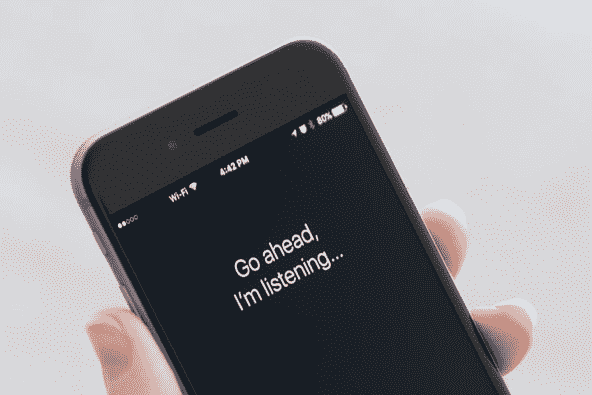
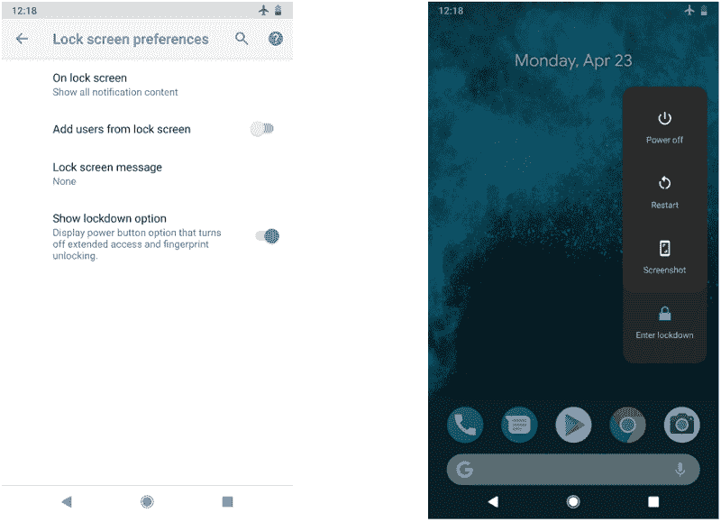

# Android Pie 中的新安全特性以及我为什么对它们感到兴奋

> 原文：<https://www.freecodecamp.org/news/the-new-security-features-in-android-pie-and-why-im-excited-about-them-4a2f45be61fe/>

由 Onur 金枪鱼

# Android Pie 中的新安全特性以及我为什么对它们感到兴奋

和每年一样，我在安卡拉的谷歌开发者小组 Devfest 18 上做了一个关于 Android 的演讲。很可能这是我关于 Android 的最后一次演讲。我谈到了 Android 最新版本的一个重大改进。对我来说，这是迄今为止最令人兴奋的 Android 改进。Android Pie 中有很多新的安全和功能更新，我想在这里简单介绍一下。

> 你可以在这里得到我的介绍。

#### 限制在后台使用麦克风或摄像头

应用程序将无法在 Android Pie 的后台使用您的麦克风或摄像头。这是新 Android 最重要的安全特性之一。

应用程序将只能使用你的麦克风或摄像头，如果他们正在屏幕上使用。如果你对某些 app 监听你有什么偏执的话，可以肯定的是，没有哪个 app 可以用安卓派偷偷监听你。

虽然这一举措阻止了应用程序监听你的对话，但谷歌仍能监听你的对话。好吧，谷歌。？

顺便说一句，除了麦克风和摄像头，任何应用程序都不能使用任何其他传感器。

#### 新锁定模式

指纹认证刚推出的时候，对大家都有帮助。你知道一个普通人一天认证手机多少次吗？是啊。太多了。

麻烦来了:有很多关于警察或心怀不轨的人如何强迫你用指纹解锁手机进行搜索的故事。任何人都可以强迫你用你的 face id 解锁手机，以进入你的数字生活(现在这是你的实际生活)。

您可以通过启用锁定模式来禁用 Android Pie 中的指纹和面部认证。启用后，只有您的 PIN、模式或密码才有效。但是，这个功能在你的休闲生活中是不需要的。对高风险的情况来说这是好事。

#### **HTTPS 是应用程序的默认设置**

今天，大多数人都知道有绿色锁定键的网站是足够安全的。您可以在浏览器中搜索该密钥。但是，您无法知道您使用的应用程序是否调用了 HTTPS 服务。

任何常规应用程序都通过互联网发送数据。除非加密，否则任何坏人都可能阅读您发送的数据。HTTPS 保证交易是加密的。Android 将迫使开发者通过 HTTPS 发送数据，以确保从你的手机发送的数据将被加密。

#### **恢复您的设备需要密码**

使用 Android Pie，您将使用您的 PIN 或模式或密码恢复您的设备。到目前为止，指纹或面部 id 已经足以恢复设备。然而，这种简单性也有一些弱点。引入了第二个身份验证层来更安全地恢复您的设备。请注意，如果您忘记了 PIN，您将无法恢复您的设备。

#### **通话录音时的提示音**

有许多应用程序可以记录通话。到目前为止，这是一个很大的漏洞。有两种情况:任何应用程序都可以记录你的通话，或者你与之交谈的人可以记录通话。

现在，如果你给一个电话录音，一个提示音会定期发送给你和你的通话对象。安卓派永久终结这种偏执。

我试图在这篇文章中介绍 Android Pie 的重大新改进。虽然还有很多增强，但这些是我认为最重要的。Android Pie 将是有史以来最安全的 Android 版本。