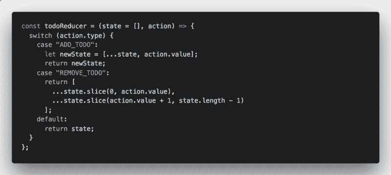
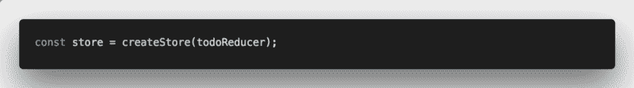
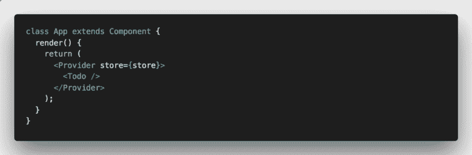
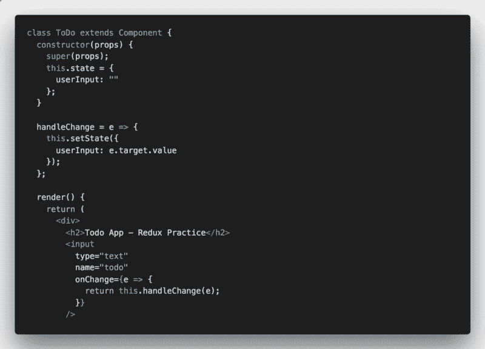
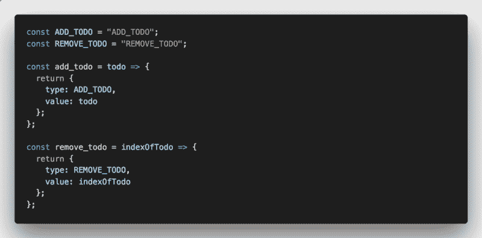
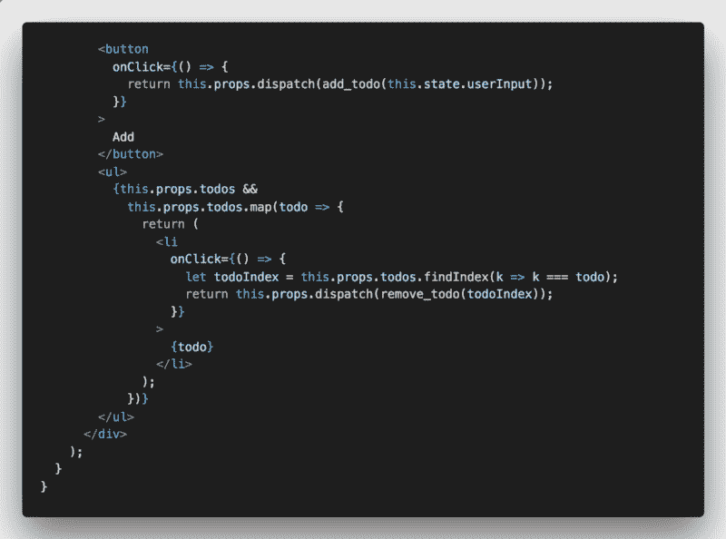
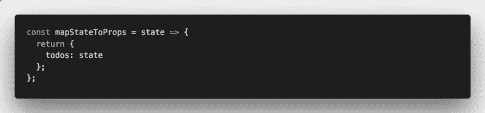
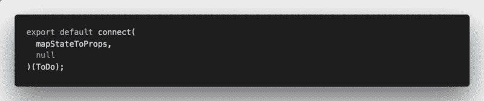
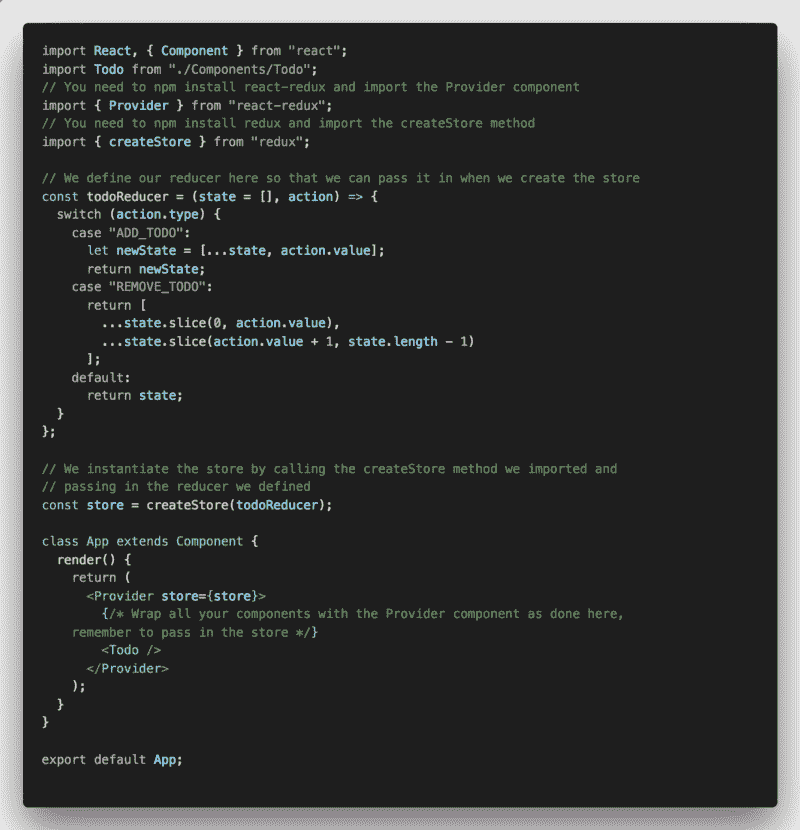
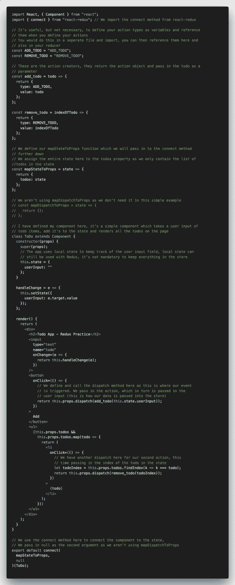

# Redux 初学者指南

> 原文：<https://www.freecodecamp.org/news/a-beginners-guide-to-redux-9f652cbdc519/>

作者:Safeer Hayat

作为初学者理解 Redux 可能会相当混乱。Redux 有大量的新术语和概念，它们通常很不直观。本指南提供了一个非常简化的 Redux 实现示例。我将以一种对完全初学者有意义的方式来定义每个步骤和术语。

这是一个揭开 Redux 元素神秘面纱的指南。它不包含技术上最准确的定义。它没有最好的实践。它有一些定义，可以帮助没有这些概念的人理解。有一个简单的实现，以免与不必要的细节混淆。

我们将在本指南中浏览的示例是一个简单的 todo 应用程序。该应用程序允许用户添加或删除待办事项，并看到它们显示在页面上。

我将一步一步地介绍 Redux 的每个元素，解释该元素是什么，以及如何用代码示例实现它。滚动到底部以查看完整的代码示例，该示例将展示如何将所有代码组合成一个完整的 React 应用程序。

### 步骤摘要

1.  编写减速器函数
2.  在根组件中实例化存储
3.  用<provider>组件包装组件，作为道具传入商店</provider>
4.  编写组件
5.  定义行动
6.  定义派单，将这些附加到将触发派单的位置(即事件监听器等)
7.  定义 mapStateToProps 函数
8.  导出 connect 函数，将 mapStateToProps 和 null 作为两个参数传入，并将组件名传入第二对括号中

### 步伐

#### 1.编写减速器函数

减压器功能是告诉商店如何响应行动的功能。每当调度一个动作时，该函数返回新的和更新的状态。状态是不可变的(不能改变),所以 reducer 总是返回一个新的状态。reducer 通常使用 spread 操作符将当前状态插入到一个新的对象/数组中，并附加到它上面。通常的做法是使用 switch/case 语句，并检查传入的操作的 type 属性。然后编写更新每种情况下的状态的代码。

我们首先编写 reducer 函数，因为在实例化存储时我们需要传递它。要理解正在发生的事情，需要一些关于动作和调度的知识。我们将在本指南中进一步讨论这一点。

现在我们知道，我们的 todo 应用程序需要以两种方式与商店进行交互:向状态添加一个新的 todo 项，以及从状态中删除一个 todo 项。因此，我们编写我们的函数，以便它响应两种情况的行动类型。它使用动作值在状态中添加或移除 todo 项。

reducer 被传递了两个参数:state(这是当前存储中的整个状态，如果 state 还不存在，我们给它一个默认值)和 action。我们在默认情况下返回状态。

Reducer function with 2 cases

#### 2.在根组件中实例化存储

存储实际上是包含状态的东西。这有点神奇，你真的不需要知道它的来龙去脉。你需要知道的是，你不能像正常的反应状态那样直接访问它。您可以访问它，并使用 reducers、actions 和 dispatch 对它进行更改。

关于商店需要知道的另一件重要的事情是它包含了一些有用的和重要的方法。主要方法是调度函数。它还包含一个 getState 方法(用于查看状态)和 subscribe 方法(每次调度操作时运行一个回调)。

商店通常在您的应用程序(例如 App.js)的根目录下实例化。它被存储为一个变量，并将缩减器作为一个参数传入。然后，存储作为 prop 传递给提供者组件。

我们实例化我们的存储对象，并传入我们刚刚创建的 reducer。

Store instantiated with reducer we created in the previous step

#### 3.用<provider>组件包装组件，作为道具传入商店</provider>

提供者是一个组件，创建它是为了更容易地将存储传递给所有组件。提供者组件包装了你的所有组件(例如，将你的组件作为提供者的子组件)。您只将商店作为道具传递给提供者。这意味着您不需要将存储作为道具传递给每个组件，因为每个组件都是从提供者那里获得的。然而，这并不意味着组件可以访问状态。您仍然需要使用 mapStateToProps(我们将在后面介绍)来在您的组件中访问状态。

我们用 Provider 组件包装将要制作的 Todo 组件。我们传入在上一步中创建的商店。

Components are wrapped with the Provider component with the store passed in

#### 4.编写组件

接下来，我们开始编写 todo 组件，它将呈现 Todo 项并与 Redux 存储交互。

该组件是一个有状态的组件，包含一个 state 元素来跟踪用户输入的内容。我们有一个函数叫做 handleChange。每当用户在输入中输入任何内容时，该函数都会更新状态。到目前为止，这就是我们要写的全部内容。在编写逻辑之前，我们需要更多地了解 Redux。该逻辑将向状态添加新的待办事项，并从状态中检索当前待办事项以呈现在页面上。

The beginning of the Todo component which allows a user to input new todo items

#### 5.定义行动

动作是一个简单的对象，包含一个名为“类型”的属性。这个对象被传递到调度函数中。它用于告诉存储刚刚发生了什么事件(通过读取 actions 类型属性)。它还告诉我们，作为响应，应该对状态进行什么样的更新(通过 reducer 函数)。该操作还可以包含您想要传递到 reducer 中的任何其他数据的其他属性。数据只能通过这里，所以任何需要的数据都需要在这里传递。

我们将使用动作创建者来定义我们的动作。动作创建者是一个返回动作对象的函数。它的目的是使动作更加可移植和可测试。它不会改变任何事物的工作方式。这是另一种书写和传递动作的方法。如果您想通过我们将要执行的操作发送数据，它还允许您传入参数。所以我们需要在这里使用动作创建器。

如果你还记得，我们的 reducer 响应了两种动作类型——“添加 _ 待办事项”和“移除 _ 待办事项”。我们将与我们的动作创建者一起定义那些动作。在我们的 add_todo 操作中，将返回“ADD_todo”作为类型，以及我们要添加到存储中的 TODO 项作为值(我们需要存储将此 TODO 项添加到状态中，以便它在此处被传递)。在 remove_todo 中，我们返回“REMOVE_todo”作为类型，并返回存储中 TODO 项的索引作为值。我们需要这个把它从待办事项列表中删除。

We define our 2 actions here in action creators. These are what our reducer reads when it is triggered to update the state.

如果你回到我们的 reducer 函数定义，希望它现在更有意义。通过读取 action.type，reducer 知道它是否需要向状态添加一个 todo 或从中删除一个 todo。它在 add_todo 中传递了 todo 项。它使用 spread 运算符追加到当前状态。在 remove_todo 中，它使用 spread 操作符创建一个新的数组，将当前状态追加两次，第一次使用要删除的状态之前的所有元素，第二次使用要删除的状态之后的所有元素，从而创建删除了 todo 项的新状态对象。

The reducer function that we defined earlier on

然而，这仍然不是一个完整的画面。我们还没有介绍如何在正确的动作中调用和传递 reducer。为此，我们需要继续定义我们的调度功能。

#### 6.定义派单，将这些附加到将触发派单的位置(即事件监听器等)

分派功能是商店的一种方法，用于触发状态的改变。任何需要更新状态的事件或事物都必须调用 dispatch 方法来更新状态。这是触发状态改变/更新的唯一方式。调用 Dispatch 并传入 action 对象(或 action creator，如果使用的话)。一旦调度被触发，存储就调用 reducer 函数并传递调度提供的更新状态的动作，正如我们前面看到的。

下面我们定义组件渲染方法的下半部分。我们创建包含事件处理程序的按钮。在其中，我们将定义我们的调度功能。

第一个按钮是一个简单的 add 按钮。该按钮将把 add_todo 操作分派到存储区。它将当前用户输入作为值传入(这是 reducer 附加到新状态的 todo 项)。请注意，我们将 dispatch 称为`this.props.dispatch`。理解如何以及为什么将它作为一个道具传递给组件超出了本指南的范围。所以只要知道它确实存在，我们就可以这样称呼它。

第二个事件处理程序被编写为呈现的 todo 项上的 onClick。通过单击页面上的任何 todo 项，它会触发一个事件处理程序。事件处理程序搜索待办事项列表，并在列表中找到该待办事项的索引。然后，它调度 remove_todo 操作并传入索引。

The bottom half of our component definition including our event handlers which call the dispatch function

现在已经完全定义了如何更新 Redux 存储中的状态的循环。我们知道，任何时候想要改变状态，我们都需要调用 dispatch 方法，传入适当的动作，并确保我们的 reducer 处理这些动作，并使用我们通过动作传入的任何值返回新状态。

现在唯一缺少的难题是我们如何从 Redux 存储中获取状态。您可能已经注意到，在前一个例子中，我映射了一个名为`this.props.todos`的列表。你可能想知道这是从哪里来的。您可能还记得，在本指南的开头，我提到过将 store 传递给 Provider 组件并不足以访问存储中的状态。这将在接下来的 2 个步骤中解决，因为我们定义了 mapStateToProps 函数并将其传递给 connect 函数。

#### 7.定义 mapStateToProps 函数

当你想让你的组件访问状态时，你必须显式地指定组件将访问状态中的什么。没有它，您组件将无法访问状态。

mapStateToProps 是一个函数，它简单地返回一个对象，该对象通过将状态中的值赋给在该对象中定义的属性来定义应该将什么状态传递到组件中。本质上，您在 mapStateToProps 中返回的对象就是您的 Props 在组件中的内容。mapStateToProps 函数作为第一个参数传递给 connect 方法。

mapStateToProps 将整个状态作为一个参数，您只需从中获取您需要的内容。尽管这里我们的州只包含 todos 列表。我们需要 ToDo 组件中的列表，我们将返回整个状态作为一个名为 todos 的属性。

Our mapStateToProps definition which simply assigns the entire state to a prop called todos

正如你现在所看到的，我们可以通过`this.props.todos`访问道具中的整个待办事项列表。这就是我们在前面的例子中通过映射来呈现所有待办事项的方法。

最后，我们需要将这个函数传递到我们的 connect 方法中，以便将所有东西连接在一起。

#### 8.导出 connect 函数，将 mapStateToProps 和 null 作为两个参数传入，并将组件名传入第二对括号中

Connect 是一种将 mapStateToProps 和 mapDispatchToProps(见下文)函数挂接到组件的方法，这样存储就可以读取这些函数，并确保您在其中定义的内容作为 Props 传递到组件中。该方法有一个特殊的语法，如下所示:

`connect(mapStateToProps, MapDispatchToProps)(YourComponent)`

将 2 个`map...ToProps`函数传递给 connect，然后在第二对括号中传递组件的名称。一个典型的模式是，当您在文件末尾导出组件时，导出 connect 方法而不是组件。例如:

`export default connect(mapStateToProps, MapDispatchToProps)(YourComponent)`

除了状态和派单将作为道具传入之外，这与正常导出的方式相同。mapStateToProps 和 mapDispatchToProps 实际上是可选的连接参数。如果您不想传递其中一个或两个，就用 null 代替它们。

您可能想知道这个 mapDispatchToProps 函数是从哪里来的，为什么我们以前没有在这里提到过它。嗯，由于本指南是 Redux store 的最简化示例，并且 mapDispatchToProps 不是严格强制的，所以我没有在我们的示例中包含它。如果您没有传递 mapDispatchToProps，而是传递 null，那么您仍然可以访问您的组件中的调度函数，就像我们前面的`this.props.dispatch`一样。

因此，为了结束我们的示例应用程序，我们所要做的就是导出我们的组件，用 connect 函数包装它，并传入我们刚刚定义的 mapStateToProps。

We export our component by wrapping it with the connect method and passing in our mapStateToProps function

就是这样！这是一个 Redux 存储的完整实现。下面是我们实现的工作示例。

### 完整的注释代码示例

> **App.js**

Full code for the App.js file

> **Todo.js**

Full code for the Todo.js file

我希望这个指南可以简化 Redux 的一些奇怪的、有时令人困惑的细节。这不是 Redux 的完整指南，因为肯定有更多的元素和模式需要理解。但是如果你能理解这个指南，那么你就能在你的应用中使用和安装 Redux 了。