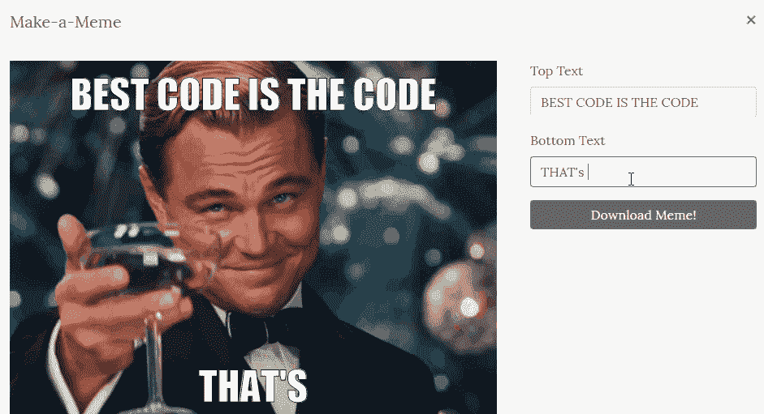
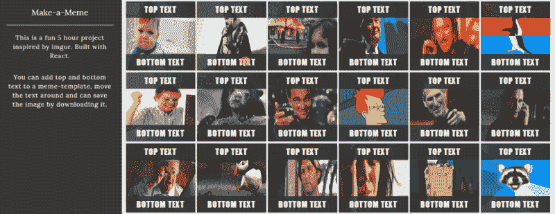
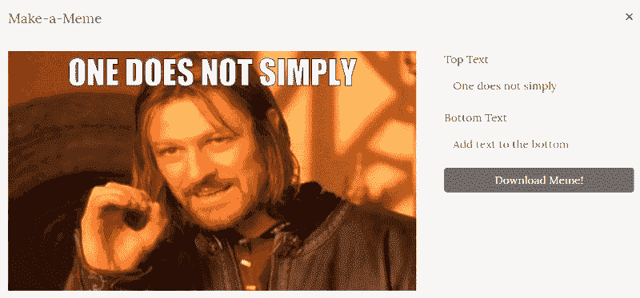
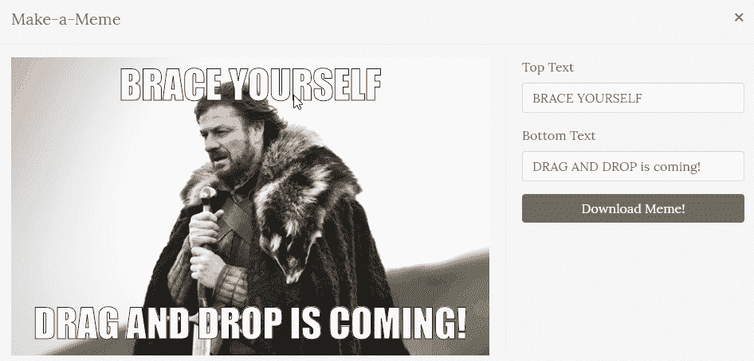
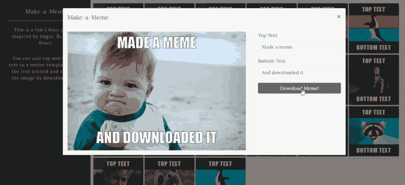

# 如何用 React 构建一个模因生成器:初学者指南

> 原文：<https://www.freecodecamp.org/news/react-for-beginners-building-a-meme-maker-with-react-7164d3d3e55f/>

作者:Avanthika Meenakshi

# 如何用 React 构建一个模因生成器:初学者指南

如果你正在学习 React，你可能已经学习了很多关于如何建立待办事项列表的教程。在某些时候，你会寻找不同的想法去尝试和学习，但是你会不断地碰到不同版本的默认待办事项列表。

这篇文章中的另一个想法是给好奇的你的。[代码库](https://github.com/AvanthikaMeenakshi/SpecialProject)可以在我的 GitHub 中找到，它是从 [create-react-app](https://github.com/facebook/create-react-app) 引导而来的。我从谷歌和其他来源收集了迷因模板。 [Impact](https://www.wfonts.com/font/impact) 字体可以让任何图像成为迷因，所以我们别无选择，只能添加它。



这是一个很好的边做边学的项目。我们将处理许多事件监听器/用户交互和状态突变。

### 建造画廊

最初，我们将建立一个图片库，让用户选择一个模因模板。我已经将我收集的图像存储为一个数组，并且我正在用它构建一个简单的图库。

在下面的代码中，

1.  我们映射照片数组，在 img 标签中显示每个 meme 模板，并显示一个图库。
2.  我们通过 img 标签上的 [onClick](https://developer.mozilla.org/en-US/docs/Web/API/GlobalEventHandlers/onclick) 来确定当前选中的图像。
3.  我们有一个 initialState 对象，包含标题及其位置的初始设置。顶部和底部文本的位置、内容和拖动状态稍后可以通过触发状态突变来修改。

正如你可以破译，画廊中的每张图片都有自己的 onClick 事件。它找到当前选中的图像，将其转换为[数据 URI](https://developer.mozilla.org/en-US/docs/Web/API/HTMLCanvasElement/toDataURL) ，并打开一个[反应陷阱模式](https://reactstrap.github.io/components/modals/)。模型将成为创造迷因的工作站。



Gallery of meme-templates and the modal work-station.

#### 迷因制造者工作站

我们在模态内部使用 [svg](https://developer.mozilla.org/en-US/docs/Web/SVG/Element/svg) 、[图像](https://developer.mozilla.org/en-US/docs/Web/SVG/Element/image)和[文本](https://developer.mozilla.org/en-US/docs/Web/SVG/Element/text)标签来保存图像和迷因标题。我们更喜欢 SVG，因为你可以随心所欲地放大和缩小，它永远不会失去清晰度。在导出迷因的同时将 SVG 转换成 PNG 是相对简单的任务。

集合中的每个图像都有不同的高度和宽度。为了避免拉伸和压缩图像，我正在做一个小的解决办法来固定纵横比。我将宽度固定为 600，并根据宽高比计算高度。我将计算出的高度和宽度提供给 SVG。

SVG 内部的整体结构非常简单。它保存图像和标题。

```
<svg width={newWidth} height={newHeight} ...otherAttributes&gt;  <image xlinkHref="image-path" />  <text x="top-x-position" y="top-y-position">    {this.state.toptext}  </text>  <text x="bottom-x-position" y="bottom-y-position">    {this.state.bottomtext}  </text>  // And we will have event listeners attached to the <text /> tags to move them around. We'll see it in later part of the article.</svg>
```

顶部和底部 *<文本* / >标签的 x 和 y 坐标保持在状态中(参考 MemeMaker 组件中的 initialState 对象)。当用户拖动并定位文本标签时，X 和 Y 坐标会发生变化。

***注意:*** *图片标签的 xlinkHref 会嵌入(base64)路径。下载时，原始 src URLs 不能转换为 png。*

下面是整个代码的样子:

除了 SVG，我们还有两个/>*；*标签，允许用户输入他们的顶部和底部标题的模因[。on ](https://developer.mozilla.org/en-US/docs/Web/API/GlobalEventHandlers/onchange) Change 事件捕获顶部标题和底部标题，并在我们改变它时设置它们的状态。



? We have the text modification working!

#### 拖着文字到处跑！

现在让我们尝试重新定位顶部和底部标题。文本标签的拖放交互与事件侦听器相关联。

1.  鼠标按下— [onMouseDown](https://developer.mozilla.org/en-US/docs/Web/API/GlobalEventHandlers/onmousedown) —找到选定的文本标签，确定当前的 X 和 Y 位置，并将“mousemove”事件监听器附加到它上面。
2.  鼠标移动— [onMouseMove](https://developer.mozilla.org/en-US/docs/Web/API/GlobalEventHandlers/onmousemove) —当鼠标被按住并移动时，查找文本标签的当前位置(x 和 y)。
3.  鼠标释放— [onMouseUp](https://developer.mozilla.org/en-US/docs/Web/API/GlobalEventHandlers/onmouseup) —找到放下位置或释放位置。确定文本放置的 X 和 Y 位置。从元素中移除“mousemove”事件侦听器，并终止拖放。

要跟踪鼠标按下，按住并拖动。我们在文本标签中包含了以下事件监听器。

```
onMouseDown={event => this.handleMouseDown(event, ‘top’)}onMouseUp={event => this.handleMouseUp(event, ‘top’)}
```

然后，我们附加“mousemove”事件侦听器来跟踪“mousedown”上的鼠标移动。一旦文本标签被删除，我们就删除“mouseup”中附加的鼠标移动事件监听器。

代码是这样做的:

现在拖放操作已经完成，你可以移动你的文本，并把它重新放置在任何你想要的地方。



Event listeners to the rescue! ?

#### 下载迷因

当用户点击下载按钮时，我们将 SVG 转换为 XML 序列化字符串，并在 [HTML5 画布](https://www.w3schools.com/html/html5_canvas.asp)中绘制它。我们使用 html canvas 的 toDataUrl()方法(生成一个 base64 图像 URI)来生成一个“image/png”mime 类型的图像！



Yaayyyy!

随着您了解的越来越多，您可以对这个小项目做更多的事情。

1.  您可以尝试从开源 API 获取图像，并构建一个图库。
2.  你可以尝试在 facebook、whatsapp 和 twitter 中添加分享条款。
3.  你可以试着让用户上传他们自己的图片，缩放图片并创造一个迷因。
4.  您可以尝试调整字体大小。

您可以做更多的事情来改进项目，最终提高您的编码技能。？编码快乐！？