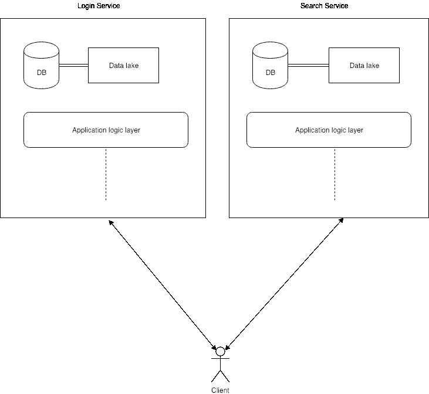
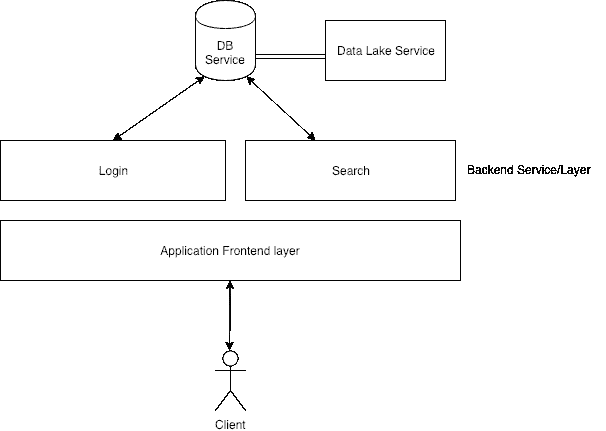

# 服务和面向微服务的体系结构介绍

> 原文：<https://www.freecodecamp.org/news/service-and-micro-service-oriented-architectures-explained-2f8d5da0ecdd/>

普尔基特·库马尔

# 服务和面向微服务的体系结构介绍

Photo by [Cameron Venti](https://unsplash.com/@cmventi20?utm_source=medium&utm_medium=referral) on [Unsplash](https://unsplash.com?utm_source=medium&utm_medium=referral)

我们已经从传统的三层整体架构走了很长的路。为了实现快速、健壮和可伸缩的开发模型，您可能会尝试将您的应用程序架构与某些哲学和开发模式结合起来，希望这可以使管理团队和开发时间表变得更容易。

但是当你发现有如此多的开发模式，以至于你不能决定选择任何一种，因为其他的似乎都更好，你可能想读读这篇文章。

让我们从基础开始，弄清楚一些术语。

### 什么是面向微服务的架构？

除了微服务是个流行语，从微服务的设计原则来说，可以简单定义为:

> 高度内聚、单一目的和分散的服务。

也就是说，这种服务只有一个目的，而且是自给自足的。

符合定义中提到的属性的任何服务都可以称为微服务。提到的设计原则是:

1.  *单一目的*:服务应该专注于一个且只有一个目的。服务应该以领域和目标为中心。例如，微服务可以只关注登录机制。
2.  *高内聚*:在领域需求和领域基础设施方面，服务应该是自给自足的。该服务应该具有为单一目的服务所需的所有特性。例如，登录微服务可以有自己的数据库。
3.  *分散化*:从逻辑角度来看，服务应该从其他服务和基础设施中分散开来，这样，微服务中需要的任何更改都不应该涉及任何其他微服务中的更改。例如，登录微服务应该有自己的一套基础设施组件，登录微服务中所需的更改不应该涉及任何其他微服务中的更改。

使用微服务架构模式，您可以将您的应用程序团队分成关注微服务的多个团队*。例如，搜索微服务可以有自己的团队，登录微服务可以有自己的团队。考虑到两个微服务都可以拥有自己的数据库、前端和后端，两个团队都可以包含具有相同领域(如数据库、前端和后端)专业知识的人员。*

使用面向微服务的架构的优势包括:

*   团队可以围绕产品中的特性/组件来安排。

特征/组件的改变只需要改变该特定集合。

*   Bug 定位和本地化很容易。
*   领域的交响乐能带来创新的解决方案。
*   管理该功能变得很容易。
*   如果需要添加一些推送，可以添加特定功能的更多资源。

使用面向微服务的架构的缺点包括:

*   微服务网格可能是一项管理开销。
*   就开发人员而言，资源可能很昂贵。
*   团队可能会像应用程序中的组件/特性一样成长。
*   如果团队之间不经常共享知识，解决方案的本地化可能会发生。
*   不同微服务的代码质量是不同的。

### 什么是面向服务的架构？

> 在面向服务的体系结构中，服务是根据它们在应用层中的角色来划分的。

例如，数据库服务、前端服务、后端服务等是服务的逻辑分离。这些服务由应用程序的各种组件使用。

当应用程序没有包含各种特性/组件的非常大的生态系统，并且组件可以逻辑地共享服务时，面向服务的架构可能是更好的选择。

使用面向服务的架构模式，团队可以根据他们的领域专长很容易地划分*。*

比如团队可以简单分为后端、devops、数据库、移动等。如果任何组件需要服务，客户端(开发组件)将联系服务团队，因此，关于服务的所有核心信息都由服务团队*本地化*。

使用面向服务的体系结构的优点包括:

*   代码质量在整个领域都是一致的。
*   领域内的知识共享很容易。
*   错误不会重复，因为领域团队知道以前的失败。
*   如果需要的话，更多的资源可以投入使用。

使用面向服务的架构的缺点包括:

*   一个服务中的错误/中断会影响多个服务/层。
*   缺少领域的和谐，这可能是因为缺乏创新。
*   如果管理不当，团队可能最终只在一层工作。
*   管理多个特性是困难的，因为它可能涉及跨多个服务的变化。
*   一项服务最终可能会改变很多。

### 两者的共同点是什么？

这两种开发模式在很大程度上不同于传统的整体开发模式。

> 但是两者都需要团队和组件专注于一件事情。

隔离和本地化概念是这两种模式的核心。这两种模式通常都与 DevOps 的理念相一致，以在团队间实现快速增长。

### 结论

由于 monolith 不能满足现代敏捷开发的需求，您可能希望将您的开发实践以及您的团队与这两种方法中的一种结合起来。

微服务是当今的热门词汇，但这并不意味着它是解决您问题的最佳方案。

如果您的应用程序要求基于专业领域(如数据库、前端、后端、数据科学等)的团队分离，那么面向服务的方法可能最适合您。

如果您的应用需要许多不同的插件功能，这些功能需要自己的资源，如自己的数据库、前端、后端等，您可能希望采用面向微服务的架构，并让团队专注于特定的功能集。

但是，您也可以使用混合方法。当您构建一个包含多个应用程序的平台时，混合方法可能会很有用。

例如，如果你想建立一个内部应用商店，开发平台的团队(app-store/平台团队)可以以面向服务的模式进一步划分；而构建应用的团队(app-teams)可以专注于并划分为微服务。

[注册我的时事通讯](http://eepurl.com/gcFOaX)以获得*免费访问*软件咨询、课程、文章、每周文摘和独家优惠。