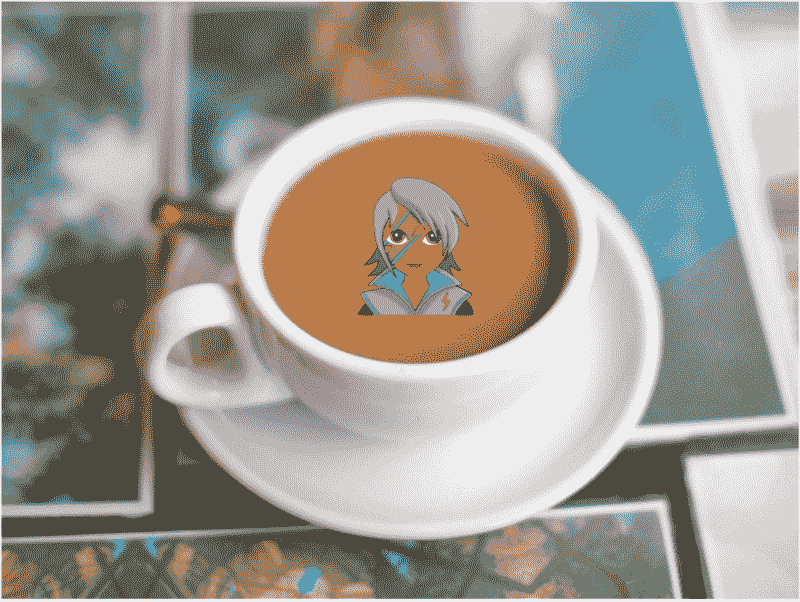
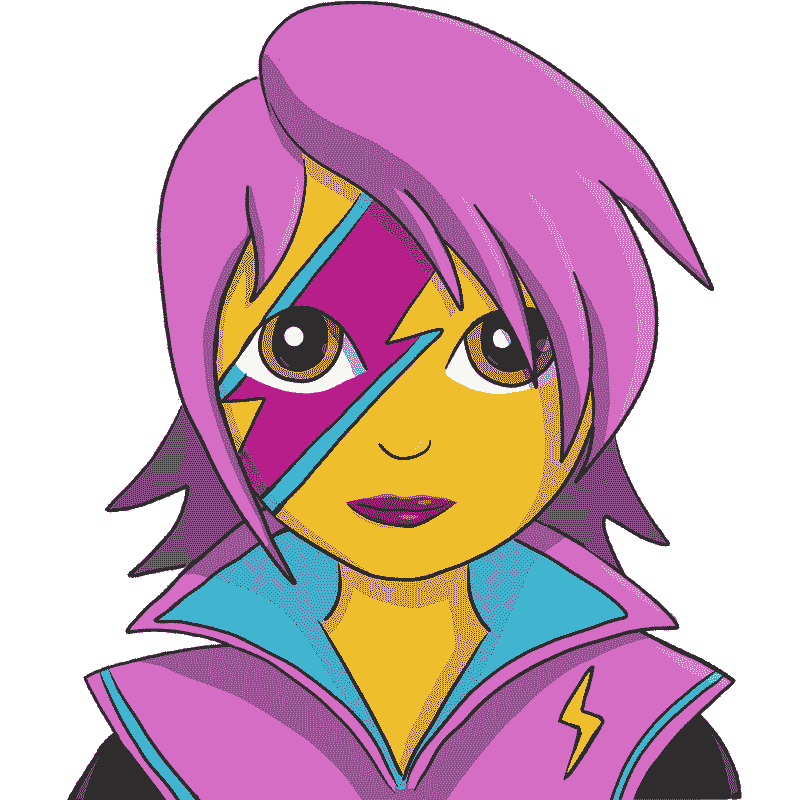
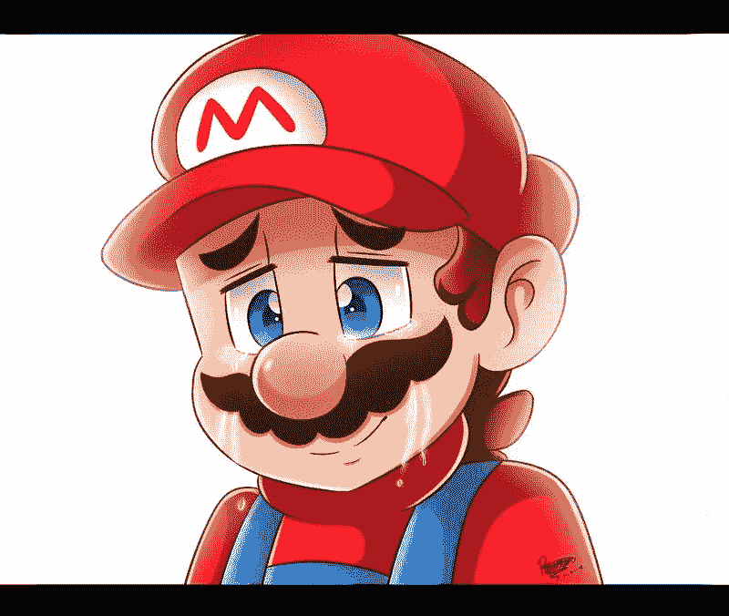

# 在喝咖啡的时候学习情绪

> 原文：<https://www.freecodecamp.org/news/learn-emotionjs-during-your-morning-coffee-its-that-easy-2bc60213aca7/>

作者:沙哈尔·泰特

# 在喝早茶的时候学习情绪——就这么简单。

EmotionJS 是一个 CSS-in-JavaScript 库，具有不可思议的功能。让我们看看 CSS 的世界是如何发展到这种解决方案的，然后深入研究您现在可以用它做什么。

#### CSS 之战(综述)

在过去的几年里，我们已经看到了向不同类型的样式方法的转变，所有这些都是基于 CSS 的。以下是按时间顺序排列的要点:

#### **普通老式 CSS**

这是应用 CSS 的经典而简单的方式。我们在 index.html 中引用了一个 CSS 文件，并通过 CSS 的经典规则将其应用到我们的 HTML 文件中。

这种方法在大规模应用时存在问题，因为 CSS 是基于特殊性的，如果我们想防止 CSS 冲突，就需要小心处理。

在浏览器中检查时也很难调试。很难理解 CSS 属性的哪种组合最终影响了我们在 HTML 标签上看到的样式。

#### **CSS 预处理程序**

普通的旧 CSS 有一些限制，产生了一些 CSS 的扩展，如 Less 和 Sass。这些语言扩展允许我们用功能更强的语言来编写。示例包括 CSS 选择器嵌套、函数等等。我们的构建工具将这些文件编译成简单的 CSS 文件，并以普通方式应用它们。

#### **CSS 模块**

一旦 web 开发开始将 web 页面视为组件树，就引入了这种方法。CSS-modules 就是独立地设计一个组件的样式，不影响 UI 的其他部分，也不受它们的影响。

在我们的项目中引入 CSS 模块后，每个组件都引用一个带有普通或预处理 CSS 的 CSS 文件。在构建过程中，我们的构建系统(比如 webpack)获取每个 CSS 类，在它的前面加上组件的名称，在它的后面加上一个惟一的标识符，这样这个类就是惟一的。

这种方法很棒，因为它很容易实现 CSS 隔离。此外，很容易理解哪些 CSS 规则应用于我们的 HTML 元素以及它们的来源。在 EmotionJS 发布之前，我一直大力提倡这种方法。

#### **CSS-in-JS**

这种方法挑战了将 CSS 隔离到 CSS 文件中的做法。它允许我们将 JavaScript 代码中的 CSS 规则声明为 JS 对象。

React 等一些框架内置了对这种方法的支持。一些库的出现是因为需要提供一个更加独立和可扩展的解决方案。顶级库是样式组件和情绪。

下面就来阐述一下这些。

### 风格化组件对情绪！

样式组件首先出现，EmotionJS 不可否认地受到了它的严重影响。

样式组件是简单的小 React 组件。它们将 HTML 标签及其样式定义为组件属性的函数。

这将 HTML 和 CSS 语义与我们功能更多的 React 组件隔离开来。这反过来又提供了更具可读性和可维护性的开发体验。

样式组件示例:

我们在这里看到的是一个带有一些 CSS 道具的 HTML 按钮。

`color`和`background` CSS 属性被确定为传递(或不传递)给组件的`primary`属性的函数。

请注意，JSX 非常简单且富有语义，CSS 和 HTML 部分被隔离到样式化的组件中。

现在我们来看看 EmotionJS。

EmotionJS 采用了风格化组件的力量，并添加了一些更有用的功能(也是有史以来最酷的标志)。

让我们用情感来展示我认为印象最深刻的事情。

到目前为止，我最讨厌的一件事是维护 CSS 媒体查询。

每个断点的 CSS 规则位于 CSS 文件的不同区域。很难看到和处理重叠的属性。

在 EmotionJS 中，我们可以借助 Facepaint 库创建一个保存断点宽度的常量。

然后我们可以引用这个常量，在一个地方声明每个断点的 CSS 属性值。

让我们来分解一下这个例子:

*   第 4-9 行:我们在应用程序的一个地方定义了断点宽度
*   第 13–23 行:我们定义了一个按钮组件，它是一个带有一些 CSS 属性的 div 标签。它的`width`和`height`值被定义为一个值数组，每个值对应一个断点。注意我们不需要指定`px`单位。它们是自动添加的。还要注意`background-color`属性依赖于提供给按钮组件的`primary`属性。这类似于样式化组件的例子。
*   第 26–33 行:在我们的 React 组件中，我们引用了我们的 EmotionJS 按钮，并将其用作 JSX 标签

#### 情绪的其他特征

EmotionJS 有更多的方法来实现这些功能:

*   CSS prop——我们可以为 React 组件提供一个 CSS prop，它是一个 JavaScript 对象或字符串，定义了我们的 CSS 属性。

*   媒体查询也可以使用 CSS prop 方法

### 总结一下:好的、坏的和情绪化的

**优点:**

*   易于集成和替换其他 CSS 解决方案。
*   与其他解决方案相比，易于识别和删除死代码。
*   更容易处理媒体查询，值被收集在一起。
*   随着 HTML 和 CSS 的分离，React 组件变得更加语义化。

**缺点:**

*   使用 CSS-modules，在浏览器中检查时，很容易准确理解 CSS 规则的来源。这是因为类名是用 React 组件名前缀生成的。有了 EmotionJS，这种情况就不会发生了。
*   如果我们为一个媒体查询定义了一个 CSS 属性，我们也需要为其余的媒体查询定义它，因为我们提供了一个值数组。在很多情况下，我们只想解决一两个媒体查询，而将其他的作为默认值。

### 判决

EmotionJS 是正确方向上的下一步，处理 CSS 的陷阱。它提供了一个隔离的、可维护的环境，使我们的主要组件保持逻辑中心和语义。

我花了 10 分钟来学习和整合它，这是这个领域的一个重大进步。

如果你喜欢这个，别忘了鼓掌，在推特上关注我:[https://twitter.com/shahar_taite](https://twitter.com/shahar_taite)