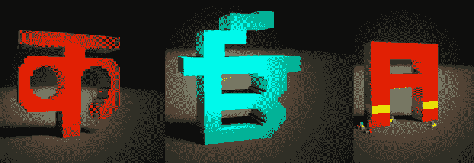
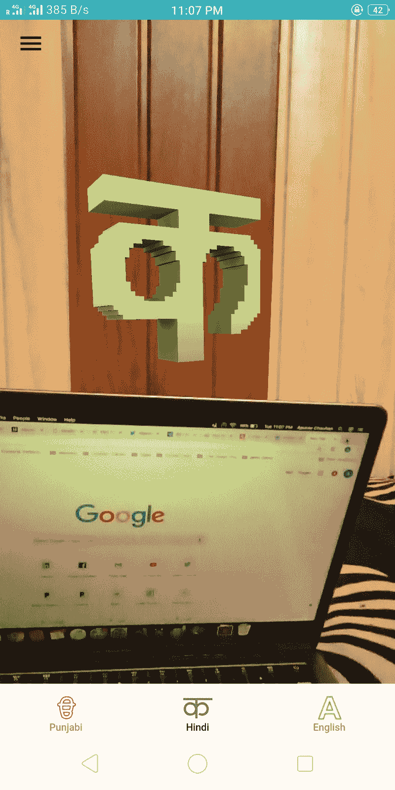
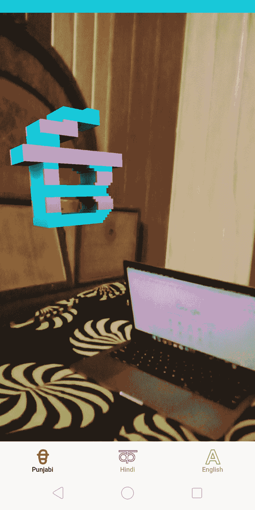
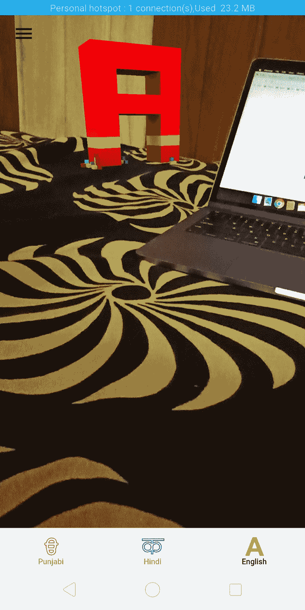
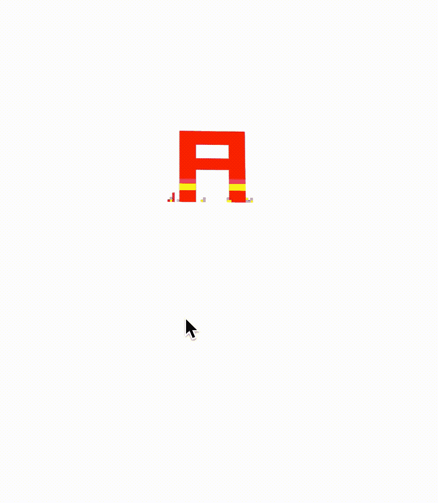
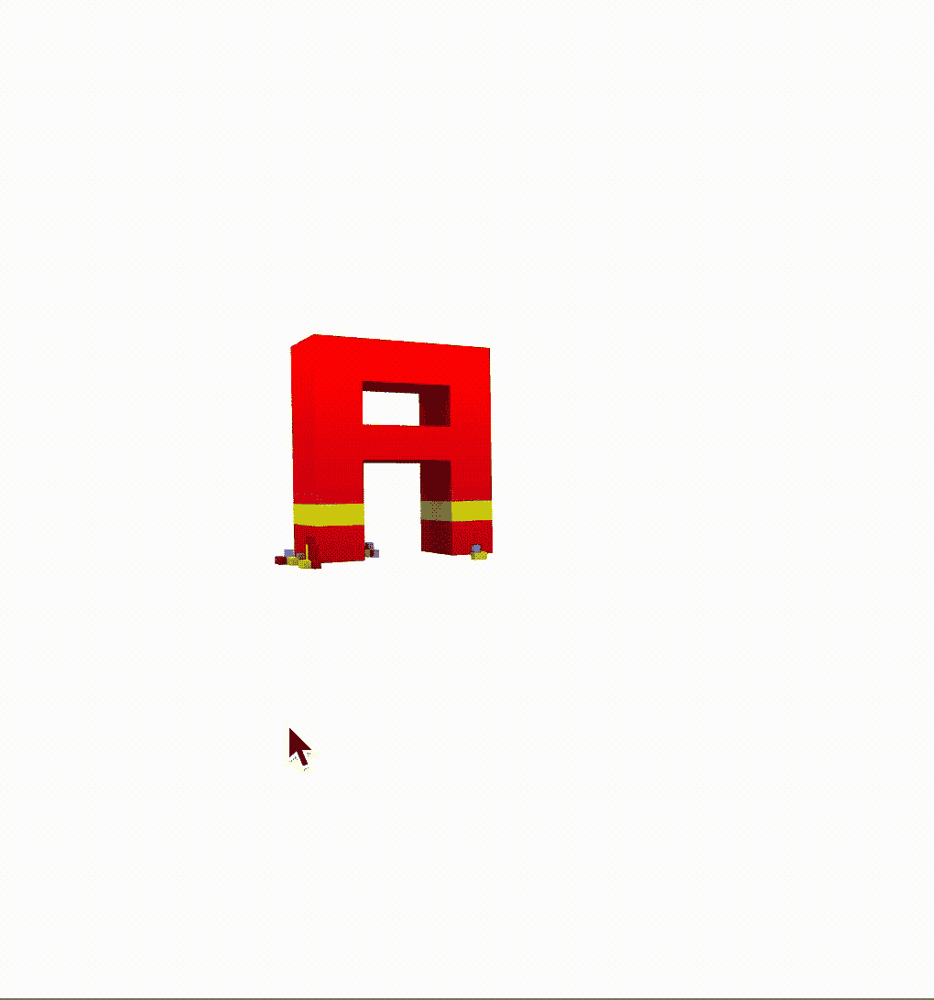
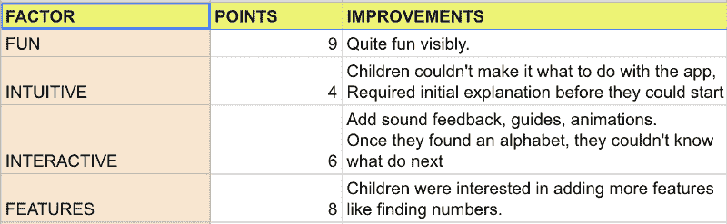

# 如何通过 JavaScript 使用增强现实——案例研究

> 原文：<https://www.freecodecamp.org/news/augmented-reality-with-javascript-a-case-study-c9cffaadcf07/>

作者:阿普拉夫·肖汉

# 如何通过 JavaScript 使用增强现实——案例研究

在这个实验中，我谈论了如何使用带有 JS 的增强现实来使学习更加有趣和互动。案例研究将讨论设计过程、实施和 2 至 10 岁年龄组儿童的反馈。



Education and Interactive Alphabets learning using Augmented Reality and Javascript

增强现实(AR)一直吸引着我，在这个实验中，我试图创建一个实用的 AR 应用。我们将涉及的用例是小学教育，我们将看到如何使学习变得有趣和互动。我们将制作一个应用程序来学习三种语言的字母:旁遮普语，印地语和英语。

*Javascript 增强现实应用目前没有平面检测。为了简单起见，我们只是用 3d 运动跟踪将我们的对象叠加在视口上。*

#### 最终目标

下面是我们 Javascript AR 实验的演示。这里可以下载玩 app [。](https://play.google.com/store/apps/details?id=com.webilm.games.arlearning&hl=en)

完整的代码出于学习目的已经开源，可以在[这里](https://github.com/apuravchauhan/augmented-reality-javascript)获得。



Alphabets in augmented reality and javascript to make education more fun and engaging

### 设计过程

为了让学习变得有趣和轻松，我依靠以下几点:

1.  儿童的积极参与
2.  孩子的身体活动，而不是坐在一个地方
3.  在寻找字母表上花了点功夫。
4.  直观的 UX/用户界面。

该应用的核心主题将与著名的 Pokemon Go 增强现实应用非常相似。只涉及两个主要组件:摄像机视窗**和**字母表**。**

#### 用于增强现实游戏的字母 UX

*迭代 1*


2d Alphabets in English, Hindi and Punjabi for our JS Augmented Reality Game

在我们的第一次迭代中，我们有 2d 字母，我们将尝试在我们的相机视口中合并。增强现实(AR)应用的想法是让孩子们在他们周围的房间或空间中找到这些字母。将空间与 2d 字母合并后的原型将如下所示:



AR Motion sensor with 2d object

正如你在上面看到的，2d 模型缺少沉浸式体验，因为人眼看到的是 3d。

*迭代 2*

让我们尝试创建一个 3d 模型，看看我们是否可以改善基于 Javascript 的增强现实游戏的体验:


3D Alphabets in English, Hindi and Punjabi for our AR project

下面是 2d 和 3d 字母模型的运动传感器体验对比。正如你所看到的，当谈到增强现实时，3D 自然会给你带来更身临其境的体验。



2d vs 3d AR motion experience

### AR 实施流程

为了实现上述 AR 概念，我将使用以下工具和技术:

1.  [Ionic 框架](https://ionicframework.com):用于构建混合应用
2.  Aframe :为我们的应用带来虚拟现实(VR)和增强现实(AR)体验
3.  [magic voxel](https://ephtracy.github.io/):用于创建我们的 3D 模型

基本的应用程序构建过程非常简单。你可以关注我之前的帖子，了解如何使用 Ionic 框架[在这里](https://codeburst.io/part-1-simple-ionic-tutorial-from-scratch-from-0-to-live-app-9a79db510a90)构建和部署一个应用。

一旦你按照上面的教程创建了一个简单的应用程序，是时候集成一个 Aframe 来将我们的 3D 字母和运动传感器集成到我们的应用程序中了。

只需在 ionic 的项目 index.html 文件中加载以下 Aframe 核心和 Aframe 加载程序库:

```
<script src="https://aframe.io/releases/0.8.2/aframe.min.js"></script>
```

```
<script src="https://rawgit.com/donmccurdy/aframe-extras/v2.1.1/dist/aframe-extras.loaders.min.js"></script>
```

有了这些，我们就可以在 Javascript 代码库中施展 AR/VR 魔法了。

现在，在您的家庭组件的 home.html 中，让我们包括从 magicavoxel 导出的 3D 模型:

这将使 3D 场景准备好与所有运动传感器进行交互:


Final 3D Virtual Reality scene ready with 3D alphabets

#### 添加增强现实效果

这个实验的最后一部分是在我们基于 Javascript 的混合应用程序中添加增强现实(AR)感觉。如前所述，增强现实是指在相机视口上方叠加 3D 模型或其他物体。所以唯一缺少的是场景后面的摄影机视口。

为此，我们使用相机预览插件，如这里的所解释的[。以下是集成相机预览插件后的完整要点:](https://ionicframework.com/docs/native/camera-preview/)

我们还需要确保我们的背景是透明的，以便在手机上可以看到相机预览。这是非常重要的，否则你可能会觉得这个插件不起作用。下面是启用了透明 css 的 home.scss 文件:

**这是它最终的样子:**

#### 用户对我们增强现实 JS 游戏的反应

衡量你的概念是否成功的最后一步是真正的用户验证——在我们的例子中，是孩子:)，下面是他们的实时反馈记录。

很明显，他们每个人都喜欢这个游戏，我们在有趣的部分得到了满分。然而，最初我不得不告诉他们在空间中移动手机来找到这些字母。直觉方面的失分:(



Points scored out of 10

#### 增强现实 JS 游戏的用户反馈

### 最后的想法

这是一个令人兴奋的项目，我可以看到增强现实在学习和教育方面的巨大潜力。孩子们真的很喜欢它，这无疑给教育增加了缺失的乐趣，尤其是在我们单调的教育系统中。

请随意评论并分享您的反馈。

### 下载

这款应用的代码可以在 [github](https://github.com/apuravchauhan/augmented-reality-javascript) 中找到。随意发挥，推新功能在里面。我很乐意在产品上发布更新。

你可以在这里下载安卓[的应用。](https://play.google.com/store/apps/details?id=com.webilm.games.arlearning&hl=en)