# 面向所有人的 Nextjs 具备 React 的一些基础知识

> 原文：<https://www.freecodecamp.org/news/an-introduction-to-next-js-for-everyone-507d2d90ab54/>

#### 有了一些基本的 React 和 JavaScript 知识，您就可以上路了

**Next.js** 是由 [Zeit](https://zeit.co/) 创建的 JavaScript 框架。它允许您使用 React 构建服务器端呈现和静态 web 应用程序。这是建立你下一个网站的好工具。它有许多很棒的特性和优点，可以让 Nextjs 成为构建下一个 web 应用程序的首选。

开始使用 Next.js 不需要任何 webpack 或类似的配置，它自带配置。你所需要的就是运行`npm run dev`并开始构建你的应用程序。。

在这篇文章中，我们将探索 Next.js 的强大功能和技巧，以及如何用它开始构建你的下一个网站。

这篇文章假设你对 React 和 JavaScript 有一些基本的了解。

以下是一些用 Next.js 构建的优秀网站:

*   [syntax . FM](https://syntax.fm/)
*   [npmjs](https://www.npmjs.com/)
*   [material-ui.io](https://material-ui.com/)
*   [世博 io](https://expo.io/)
*   [co menitor . io](https://www.codementor.io/)

我甚至用 Nextjs 建立了我的个人网站[saidhayani . me](https://www.saidhayani.me/)——你可以在 GitHub [这里](https://github.com/hayanisaid/said-hayani-nextjs)获得源代码。

### Next.js 入门

从 Next.js 开始，你需要在你的机器上安装 node.js，就这样。Next.js 就像任何其他 node.js 应用程序一样——需要 npm 或 Yarn 来安装依赖项。

让我们开始创建一个 Next.js 项目。

首先，我们需要创建一个文件夹，并给它起一个我们自己选择的名字。我要把它命名为`nextjs-app`。

您可以使用以下命令行轻松做到这一点:

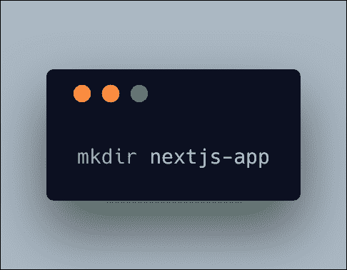

```
mkdir nextjs-app
```

创建 nextjs-app 文件夹后，在终端上打开它。运行`npm init` 来创建`package.json` 文件。

接下来，我们必须安装我们的依赖项。

安装 Next.js

*   使用纱线，类型

```
yarn add next
```

*   使用 npm，键入:

```
npm i next --save
```

然后我们必须安装 React，因为 Next.js 使用 React。下面的第一条线使用纱线进行安装。

```
yarn add react react-dom
```

```
// with npm
```

```
npm i react react-dom --save
```

之后，你必须创建两个必要的文件夹:`pages`和`static`。没有它们 Next.js 就不行！！


```
mkdir pages static
```

在运行这些命令后，您**必须**拥有这个结构:

```
nextjs-app  -pages  -static  -package.json
```

然后只需运行`npm next dev`，然后在浏览器中打开`[http://localhost:3000/](http://localhost:3000/)` 。

页面将会出现，因为我们还没有任何页面！

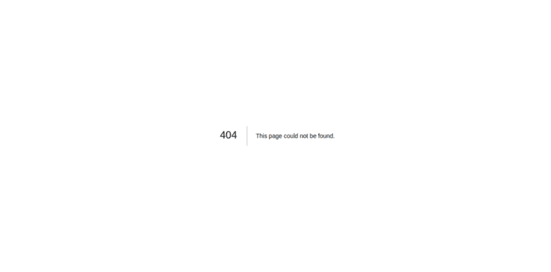

所以让我们创建一个`home`页面和一个入口点`index.js`。

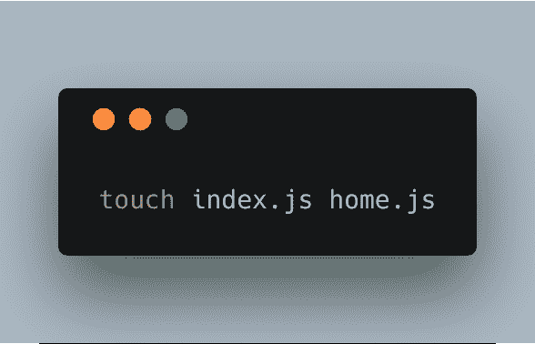

```
touch index.js home.js
```

然后你可以写一个普通的 React 组件。我上面说过，Next.js 是用来构建 React 应用的。

这是我们的`home.js`的样子:

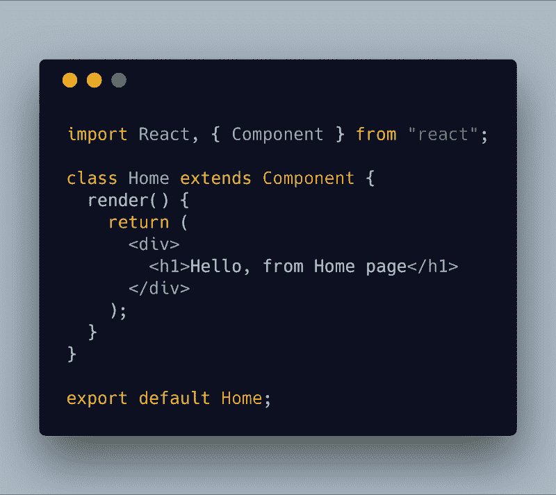

这是我们的`index.js`文件:

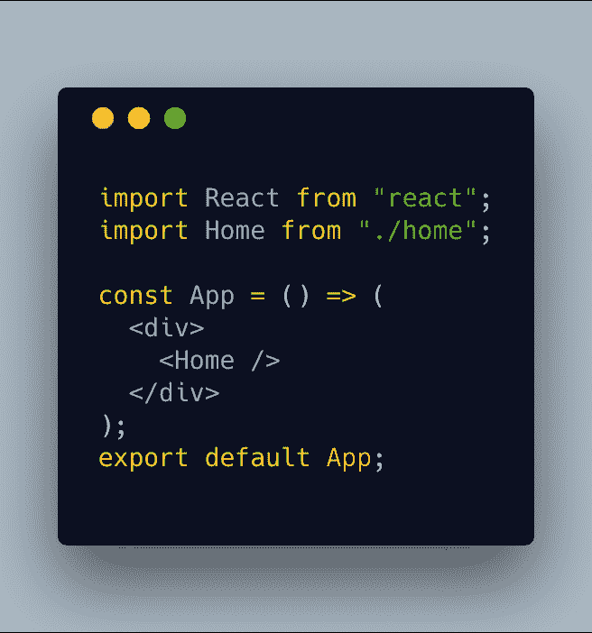

Next.js 有一个实时重载特性。你需要做的只是更改并保存，Next.js 会自动为你编译并重新加载应用。

**注意** : Next.js 就像任何其他服务器端渲染工具一样，我们需要定义应用程序的默认页面，在我们的例子中是`index.js`。

运行`npm next dev`后，您将在浏览器中看到这一变化:

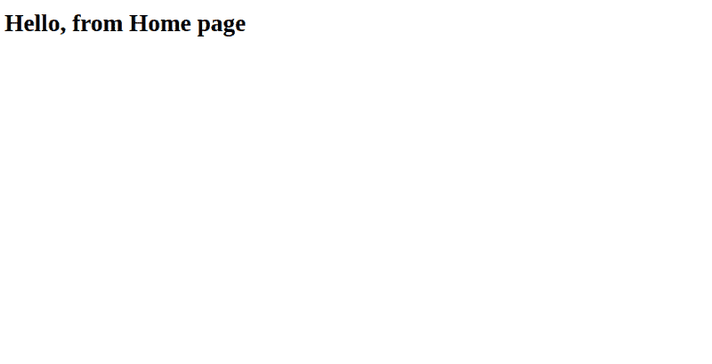

恭喜你！我们刚刚用几个简单的步骤创建了一个 Next.js 应用程序。创建 Next.js 应用程序的这些说明在 Next.js 的[官方文档中有描述。](https://nextjs.org/learn/basics/getting-started/first-page)

#### 我的选择

我一般不用这种方式。我使用 [create-next-app](http://import React from ) CLI 来代替，它将在一行中为我完成所有这些工作。

```
npx create-next-app my-app
```


你可以在这里查看文档[来探索更多的特性。](https://github.com/segmentio/create-next-app)

### 为 Next.js 创建自定义配置

有时，您可能希望向 Next.js 应用程序添加一些额外的依赖项或包。

Next.js 为您提供了使用`next-config.js`文件定制配置的选项。

例如，您可能希望在您的应用程序中添加 sass 支持。在这种情况下，您必须使用 [next-sass](https://github.com/zeit/next-plugins/tree/master/packages/next-sass) 包**和**，您必须将它添加到`next-config.js`文件中，如下例所示:

首先，安装`next-sass`:

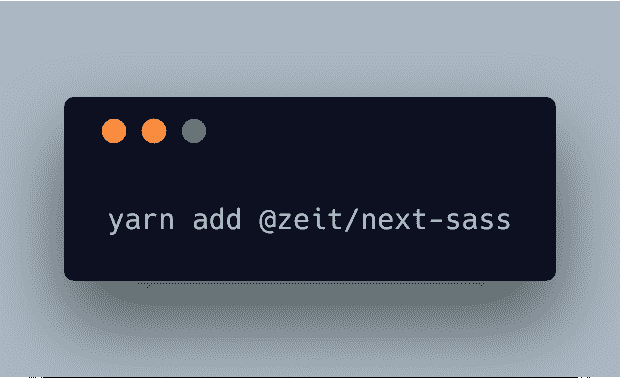

```
yarn add @zeit/next-sass
```

然后将它包含在`next-config.js`文件中:

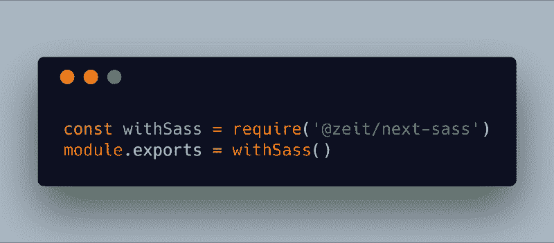

然后您可以编写您的 sass 代码并将其导入到您的组件中:

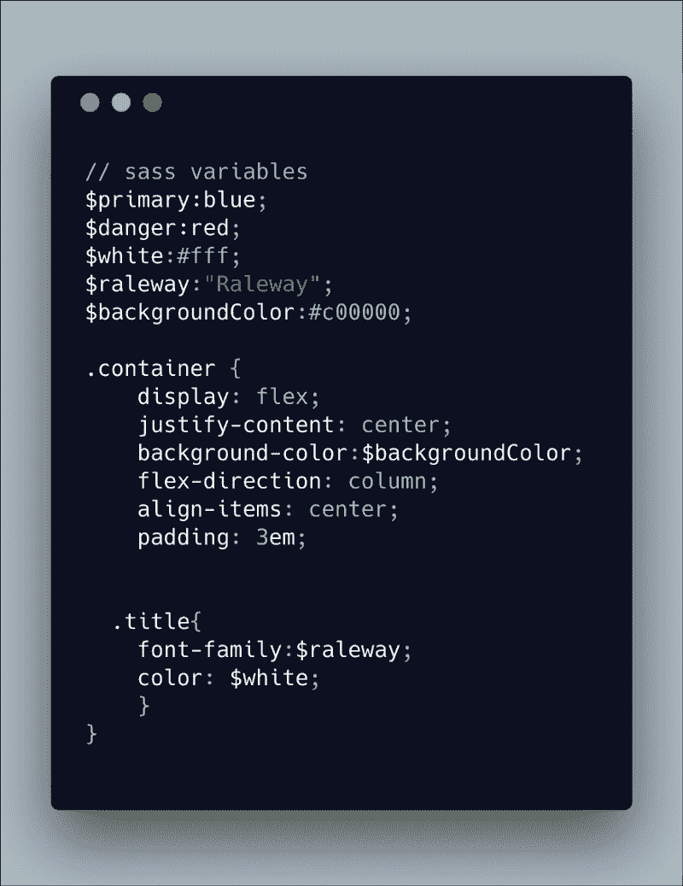

在我们的组件中导入 sass 文件:

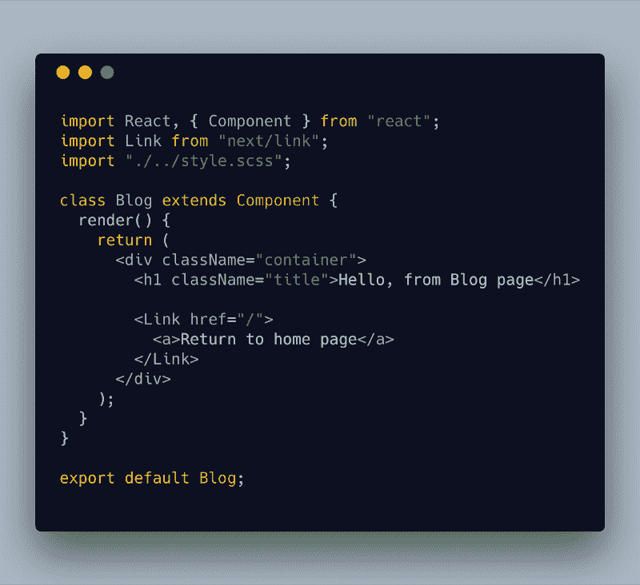

这是结果:


哇，给 out Next.js 应用程序添加 sass 支持不是很简单吗？

至此，我们已经讨论了安装和配置部分。现在来说说 Next.js 的特点！

### 功能

Next.js 附带了很多很棒的特性，比如服务器端渲染、路由器和延迟加载。

#### 服务器端渲染

默认情况下，Next.js 执行服务器端呈现。这使得您的应用程序针对搜索引擎进行了优化。还有，你可以集成任何中间件比如 [express.js](https://expressjs.com/) 或者 [Hapi.js](https://hapijs.com/) ，你可以运行任何数据库比如 MongoDB 或者 MySQL。

说到搜索引擎优化，Next.js 自带了一个`Head`组件，可以让你添加和制作动态元标签。这是我最喜欢的功能——你可以定制动态的元标签。这些使得你的网站能够被像谷歌这样的搜索引擎索引。下面是一个`Head`组件的例子:

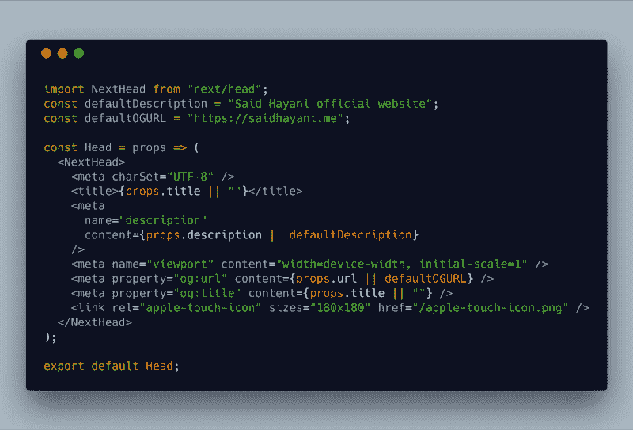

并且您可以在任何其他页面中导入和使用`Head`组件:

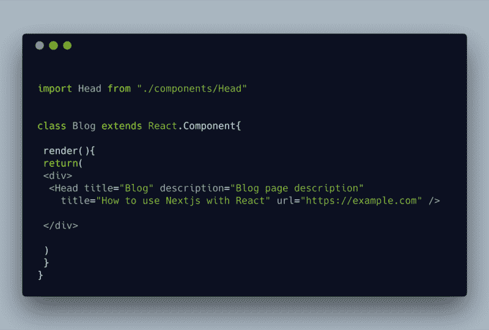

厉害！

**注意**:使用 Next.js，你**不需要**导入 React，因为 Next.js 会为你做这些。

#### 用 Next.js 生成静态网站

除了服务器端渲染，您还可以将应用程序编译并导出为 HTML 静态网站，并将其部署在 GitHub 页面或 [netlify](https://www.netlify.com/) 等静态网站上。你可以在官方文档中了解更多关于如何用 Next.js [制作静态网站的信息。](https://nextjs.org/learn/excel/static-html-export/setup)

#### 路由器

这是 Next.js 的另一大特色，当你使用 [create-react-app](https://github.com/facebook/create-react-app) 时，通常需要安装 [react-router](https://github.com/ReactTraining/react-router) 并创建其自定义配置。

Next.js 自带路由器，零配置。您不需要对路由器进行任何额外的配置。只需在`pages`文件夹中创建您的页面，Next.js 将负责所有路由配置。

让我们继续创建一个自定义导航，让一切变得清晰！

为了在页面之间导航，Next.js 使用了`Link`方法来管理导航。

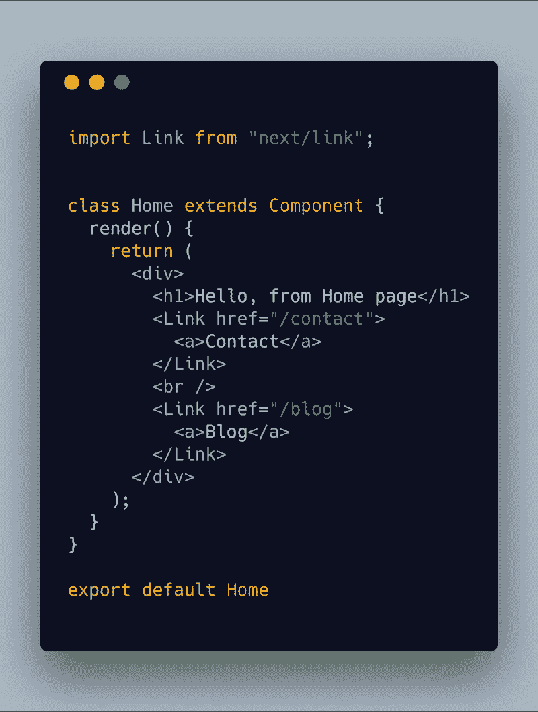

让我们创建`blog.js`和`contact.js`页面:

`blog.js`

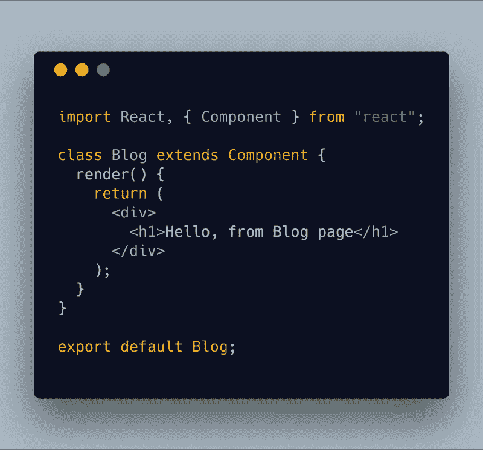

这是第`contact.js`页:

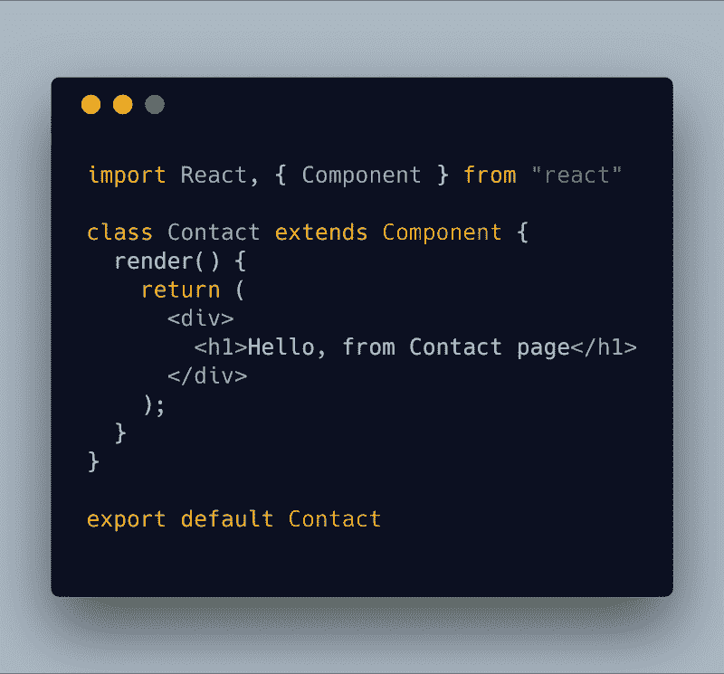

现在我们必须能够在这些页面之间导航？

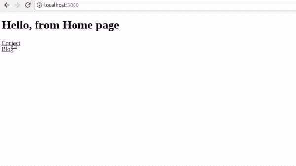

哇，这么简单，超级棒。

#### 惰性装载

延迟加载使你的应用程序提供更好的用户体验。有时页面可能需要一些时间来加载。如果加载时间超过 30 秒，用户可能会放弃你的应用。

避免这种情况的方法是使用一些技巧向用户表明页面正在加载，例如通过显示一个微调器。延迟加载或代码分割是允许您处理和控制缓慢加载的特性之一，因此您只需在页面中加载必要的代码。

Next.js 自带代码拆分方法。它为我们提供了一个名为`dynamic`的方法来加载我们的组件，如下例所示:


你可以在 [GitHub](https://github.com/hayanisaid/nextjs-intro-example) 上找到这些例子的源代码

仅此而已。我希望这就足够了，我希望这篇文章能让你对 Next.js 及其特性有一个清晰的了解。您可以在[官方文档](https://nextjs.org/docs/)中了解更多其他功能。

如果你对这个帖子有任何其他的补充，你可以在下面留下评论，如果你喜欢这个帖子，请点击拍手？和分享。

讨论

> 顺便说一下，我最近和一个强大的软件工程师团队合作开发了一个移动应用程序。这个组织非常棒，产品交付得非常快，比我合作过的其他公司和自由职业者快得多，我想我可以诚实地向他们推荐其他项目。如果你想联系我，请发邮件给我—[said@devsdata.com](mailto:said@devsdata.com)。