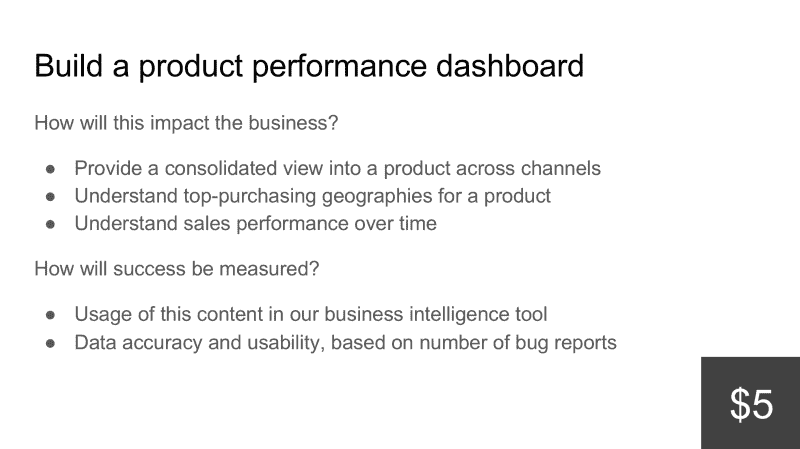

# 我尝试了潘多拉卓越的功能优先化方法。以下是我学到的。

> 原文：<https://www.freecodecamp.org/news/i-tried-pandoras-brilliant-method-for-feature-prioritization-c5fb586ad317/>

乔希·坦普尔

# 我尝试了潘多拉卓越的功能优先化方法。以下是我学到的。

#### 潘多拉的方法和一包 3 美元的便利贴如何让利益相关者管理变得轻而易举。

Sticky notes: $3\. Stakeholder buy-in? Priceless.

#### 一个人的军队

像许多中小型公司的数据专业人员一样，我是 [Milk Bar](https://milkbarstore.com/?utm_source=medium&utm_campaign=jt_feature_priorities) 的一名数据团队成员。作为第一个数据雇员，我有幸从头开始构建我们的数据堆栈。我在这里的头几个月构建了数据加载器，在 BigQuery 和 [dbt](https://www.getdbt.com/) 中建模我们的数据，并在 [Looker](https://looker.com/) 上部署和培训我们的团队。既然我们的数据堆栈已经正常工作，是时候为下一季度做计划了。

商业智能和分析的价值在 [Milk Bar](https://milkbarstore.com/?utm_source=medium&utm_campaign=jt_feature_priorities) 迅速显现，越来越多的人向我提出功能需求。我积压的工作比我完成功能的速度还要快，我需要确保我下个季度处理的项目对业务来说是真正必要的。几个月前，我读到了 Pandora 的产品优先级流程，我认为它非常出色，尤其是对于资源紧张的小型团队来说，所以我决定尝试一下。

#### 潘多拉方法

这个系统的功劳要归功于汤姆·康拉德，他在潘多拉公司做了 10 年的首席技术官，是他开发了这个方法。我鼓励你阅读[来自第一轮评估的这篇文章](https://firstround.com/review/This-Product-Prioritization-System-Nabbed-Pandora-More-Than-70-Million-Active-Monthly-Users-with-Just-40-Engineers/)，它详细描述了潘多拉的过程，但我将在这里总结一下:

1.  团队领导从整个公司收集“无需动脑”的功能创意。这些不应该是华而不实的、R&D 式的项目——它们应该是公司在下一季度不会处理的愚蠢想法。
2.  每个想法都浓缩在一张幻灯片中，描述了对业务的影响以及如何衡量成功。
3.  每一个想法还会被分配一个美元金额的成本，这是基于构建它所需的工程时间的估计量。潘多拉决定 5 美元相当于一个工程师一个月的时间。由于我的团队要小得多，我的核心开发时间一天的成本比率是 5 美元。
4.  团队领导与相关决策者召开会议。康拉德建议，你应该选择那些不太局限于一个职能部门、了解整个公司优先事项的领导人，比如首席执行官和首席财务官。
5.  团队领导详细介绍了每项功能并回答了问题，然后将每张幻灯片的打印结果贴在墙上。团队领导以便笺的形式将团队时间的总“预算”分配给决策者，每张便笺代表 5 美元。
6.  在第一轮中，决策者通过将他们的 5 美元便利贴放在他们希望获得资助的专题幻灯片上进行投票。之后，他们可以在第二轮中讨论、协商和转移他们的美元。
7.  经过一些调整后，仍然得到资助的特性是工程团队负责在下一个季度构建的特性。

该方法类似于[基于能力的计划](https://www.mountaingoatsoftware.com/blog/capacity-driven-sprint-planning)，并借鉴了敏捷原则，如[故事点](https://www.atlassian.com/agile/project-management/estimation)和权重。它旨在解决一个基本问题，即技术团队经常被要求构建比他们有时间做的更多的功能。基于容量的规划并不是一个新概念，但这种方法很特别，因为它迫使具有竞争优先级的利益相关者在一组最适合整个业务的功能上保持一致。

#### 我期望和希望发生的事情

为了在 [Milk Bar](https://milkbarstore.com/?utm_source=medium&utm_campaign=jt_feature_priorities) 使用这种方法，我需要确定我在功能开发上的总可用预算。从历史上看，我花了大约 20%的时间处理临时请求，20%的时间用于基础设施和可靠性升级，60%的时间用于核心开发。2019 年第一季度有 61 个工作日，这意味着我将有大约 37 天的时间进行核心开发。使用我的核心开发每天 5 美元的成本比率，我计算出总预算为 185 美元。

我从整个公司和我的待办事项中收集了大约 15 个数据产品特性请求。从简单的仪表板构建(5 美元，或我一天的时间)到需要大量 ETL 和建模的全新数据源(65 美元，或我几乎三周的时间)。所有功能的总成本超过了 400 美元，超过了我下一季度核心开发时间的两倍。这确实让我明白了这一点。我讨厌说不，但我肯定**没有足够的时间来建造我被要求建造的一切**，即使我想！我希望清楚地表明需求和能力之间的差距会给我提供弹药，要求我的团队增加人手。

接下来，我将每个功能请求缩减为一张简洁的幻灯片，描述对业务的影响和成功的衡量标准。我不认为有什么特别的方法可以做到这一点，但是当你的决策者需要通读其中的 50 张时，这张幻灯片足够简洁以便快速理解是很重要的。这是我们专题幻灯片中的一个例子:

An example of a feature slide for a product performance dashboard.

在编辑完所有的专题幻灯片后，我意识到最有可能的结果是决策团队将围绕几个高影响力、高成本的专题进行联合。我将这些称为基础数据特征。它们是像新的 API 集成或数据源、新的 Looker explores 和其他类似的复杂构建这样的项目。我认为我们的决策团队最终会留下许多我认为“最好拥有”的中等成本的功能请求，而没有资金支持。

我知道，如果不拒绝一些较小的功能请求，我将无法构建基础数据功能，我希望这个过程能够帮助我们的决策团队自己实现这一目标。对每个人来说，一起决定比告诉我们的一些领导他们的需求没有另一个团队的需求重要要容易得多。

#### 结果

我与我们的团队领导、战略经理和首席运营官会面了大约一个小时。我展示了每一张功能幻灯片，并回答了关于功能的重要性或为什么以某种方式定价的问题。提醒大家，目的是选择最适合 [*奶吧*](https://milkbarstore.com/?utm_source=medium&utm_campaign=jt_feature_priorities) *整体*的功能，我让他们自由讨论，协商，花他们的预算。让我们的首席运营官和战略经理在房间里当然有帮助，因为他们不依赖于一个功能，能够调解和解决关于优先事项的分歧。

尘埃落定后，15 部原创电影中只有 5 部仍有资金支持。我认为这太棒了，因为与我一起工作的团队领导在我们单独的会议上强烈主张每个功能。

[康拉德总结了](https://firstround.com/review/This-Product-Prioritization-System-Nabbed-Pandora-More-Than-70-Million-Active-Monthly-Users-with-Just-40-Engineers/)我对结果的想法…

> 这太不可思议了，因为某个非常聪明的人一度认为，“我们不做这件事是绝对愚蠢的。”但实际上，当考虑到所有的商业机会时，人们认为重要的事情中有一半会立即消失。

那正是所发生的事情。

我们的决策者团队在几个影响最大的功能上保持一致，选择不资助一些已经提出的较小的“有好处”的项目。有些功能一票未得。

对我来说，这是一个绝佳的机会，如果我们愿意再雇用一名数据工程师，我们将拥有几乎两倍的新功能。在经历了削减仍然重要的功能的艰难过程后，我们的领导清楚地理解了增加员工的必要性，甚至要求我加快招聘时间。我想不出更好的方式来要求更多的资源。

总的来说，在我第一次使用这种方法时，我观察到了一些显著的好处…

*   我的所有利益相关者都**清楚地了解我下个季度**要做什么，每个项目有多耗时，以及每个项目相对于其他项目的优先级。
*   我们只挑选那些*真的真的*需要做的事情。利益相关者愿意接受现状，只要能为他们不想失去的功能节省预算就够了。
*   我获得了更多的支持来雇佣更多的数据工程师和分析师。
*   利益相关者看到了他们的需求相对于公司其他需求的重要性。他们愿意放弃对他们的团队来说更具体的特性，以支持影响更大的特性。
*   拒绝一个特性请求有时会让涉众觉得他们没有被重视。在这种情况下，每个人都享受这个过程。既省时又有趣。有人说这个想法是“天才”，我们的首席运营官告诉我这是一次“出色的会议和卓越的方法”

#### 采用这种方法的建议

我绝对推荐这个方法，我迫不及待地想在下个季度末再做一次。以下是我对使用这种方法的建议。

*   规划是关键。花时间与利益相关者会面，了解他们想要的功能。你想对你的利益相关者在下一个季度需要你做什么有一个完整的了解，问他们比猜测更好。
*   准备好简明扼要地解释每项功能。你需要能够很好地理解每个特性的动机和计划执行，以便快速清晰地描述它。在最终决策会议之前，用不到一分钟的时间练习描述每张功能幻灯片是值得的。
*   准备好解释为什么有些功能比其他功能更贵。我们的一些团队领导最初很沮丧地发现，他们要求的功能的成本超过了他们全部的预算。确保你可以用合理的工作估算来证明成本的合理性，并且可以解释你的估算。
*   保持轻松，但要坚持自己的立场。作为主持人，试着保持气氛愉快，并在紧张或分歧出现时帮助化解。同时，坚定你对工作的估计。最终，你一天只有这么多时间，所以不要害怕提醒你的利益相关者你不能创造更多的时间。如果他们拒绝，你就有一个绝佳的机会为你的团队提议增加人手。

如果你已经使用了潘多拉方法，有兴趣尝试一下，或者有关于如何改进这个过程的建议，请在评论中告诉我！

如果你喜欢这篇文章，请在下面给它一些掌声(1-50 分)!关注我[这里](https://medium.com/@josh.temple)了解更多关于中小型公司数据工程和分析的内容。