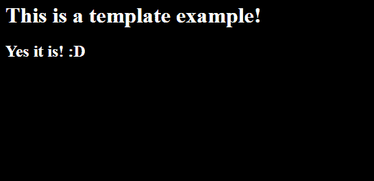
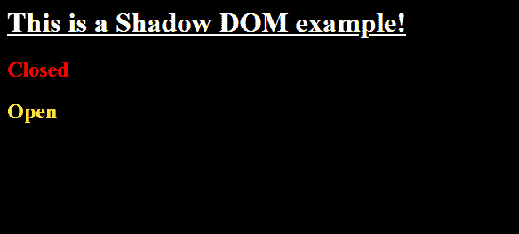
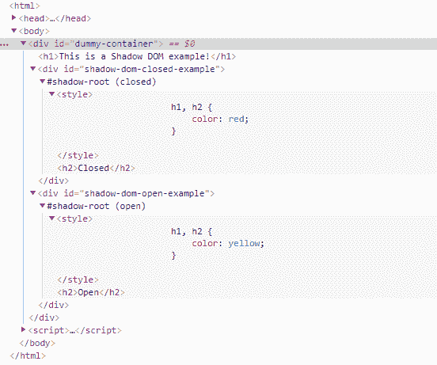
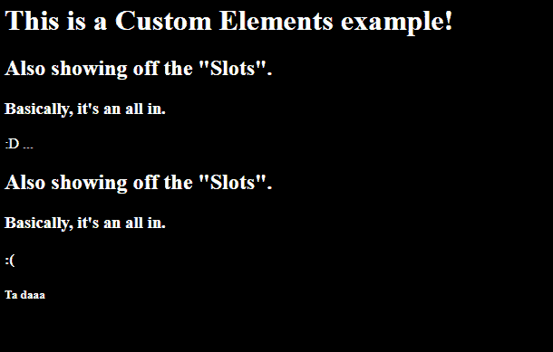
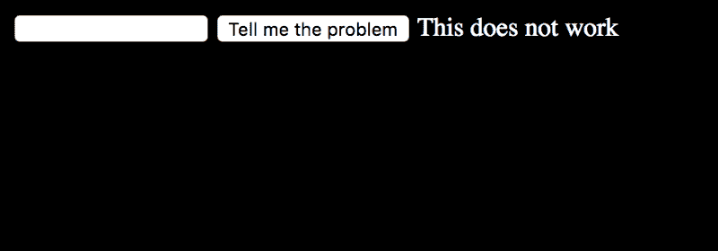
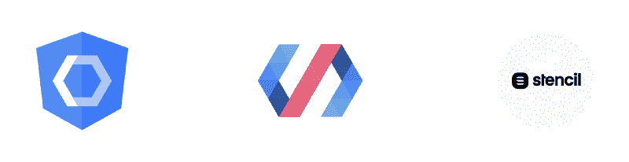

# 如何设计可访问性:一种 Web 组件方法

> 原文：<https://www.freecodecamp.org/news/styling-accessibility-a-web-components-approach-dc2aa8123eb2/>

克里斯蒂亚诺·科雷亚

### **a11y 和新的网络标准**

新的网络标准发展很快，有时很难真正了解主题海洋中某个特定主题的当前状态。我经常意识到，绝大多数 web 项目在开始时都没有考虑到可访问性(a11y ),回过头来修复它会变得令人生畏。

由于仍有许多 Web 组件项目尚未诞生，我决定收集关于这些特定主题的 101 个，并指导第一次在这些海洋中航行的任何人。所以在这篇文章中，你会发现:

*   关于可访问性的基础知识
*   关于 Web 组件的基础知识
*   CSS 的新特性
*   如何让你的 Web 组件更容易访问

我们开船吧。

### 基础知识#1。什么是网页可访问性？

> 易访问性通常被认为是让你的网站在屏幕阅读器上工作。事实上，网页可访问性是用户体验(UX)的一个子集，专注于让尽可能多的人使用您的网站，包括残疾人。”

上面的引用(来自 Dave Ruppert 关于“[神话:可访问性是‘盲人’](https://a11yproject.com/posts/myth-accessibility-is-blind-people/)”a11y 项目)反映了关于 Web 可访问性的最大挑战:确切地知道它是什么。

网页可访问性本质上是一种让所有潜在用户访问你的产品的方式。

要考虑的 **5 类可访问性**是:

*   视力(如失明、近视、色盲等。)
*   听众
*   发动机
*   认知的
*   暂时残疾的用户(例如单手电话用户)

如果我们需要**将这些转化为产品**，这通常意味着要关注:

*   语义学
*   键盘输入
*   替代文本
*   色对比度

为了在开发产品时将**考虑在内，您应该:**

*   确保你不仅通过颜色，还通过形式来传达意思
*   确保你的产品是可调整大小的
*   确保你的内容主题是可区分的
*   确保你总体上遵循了 W3C 的[指南](https://www.w3.org/TR/WCAG20/)

…不要忘记**可访问性树！**它是

> *“由与 DOM 并行运行的平台可访问性 API 产生的结构，它将可访问性信息公开给辅助技术，如屏幕阅读器”* ( [来源](https://egghead.io/lessons/html-5-what-is-the-accessibility-tree))。

### 基础知识# 2:Web 组件的简史

从本质上来说，Web 组件实际上“什么都不是”:Web 组件是一组新的 Web 标准，帮助我们实现一种本地方式来制作 T2 组件。概括地说，我将 Web 组件定义为:

> **一种本地方式**通过一系列**浏览器标准**实现一套**小型且可重用的**逻辑、行为和界面元素。

那么，Web 组件的构造块是什么呢？

*   HTML 模板
*   阴影 DOM
*   自定义元素
*   …和 HTML 导入(-ish)

#### HTML 模板

HTML 模板是一种重用 HTML 片段的形式，无需在页面上呈现原始的“模板”。

它的工作原理如下:

这将呈现类似这样的内容:

您可以在这个[can use 页面](https://caniuse.com/#feat=template)上查看浏览器当前如何支持 HTML 模板。

#### 阴影 DOM

影子 DOM 是实现 CSS 作用域、DOM 封装和组合的一种方式，使得构建独立的组件更加容易。

实现阴影 DOM 有两种模式:“封闭”和“开放”。不同的是，当实例化`element.shadowRoot`时，“打开”模式返回 HTML 节点，“关闭”模式返回`null`。当您试图查询 DOM 时，这两种模式都返回`null`。请记住，您必须设置一个模式来使用阴影 DOM，因为它没有默认值。

它的工作原理如下:

这将呈现类似这样的内容:

DOM 树看起来会像这样:

你可以在这个[can use 页面](https://caniuse.com/#feat=shadowdomv1)上查看当前浏览器如何支持 Shadow DOM。

#### 自定义元素

定制元素是实现完全可重用的封装逻辑的一种方式，并且具有影子 DOM 和 HTML 模板的优点，包括**槽**。

所有这些都可以通过以下方式实现:

这将呈现类似这样的内容:

You can see the Template “Slots” being replaced accordingly

您可以在此[can use 页面](https://caniuse.com/#feat=custom-elementsv1)上查看浏览器当前如何支持自定义元素。

#### …还有一点:HTML 导入与 ES 模块

HTML 导入是 Web 组件标准的一大部分，但是它们已经不再被支持，也不再列在 Web 组件页面上(被 **ES 模块**所取代)。在 Web 组件历史的这一点上，它们只不过是一个脚注。正如火狐操作系统团队[的 Wilson Page 所说](https://hacks.mozilla.org/2015/06/the-state-of-web-components/):

> *“我们已经在 Firefox OS 中使用 Web 组件一年多了，我们发现使用现有的模块语法(AMD 或 Common JS)来解析依赖关系树，注册元素，使用普通的<脚本>标签加载似乎足以完成事情*。”

如果你想知道更多关于 HTML 导入 vs. ES 模块的状态，你可以查看这个[页面](https://github.com/w3c/webcomponents/blob/gh-pages/proposals/HTML-Imports-and-ES-Modules.md)。

Web 组件远不止这些。请确保您继续搜索关于他们的更多信息，特别是关于*自定义事件*、*观察属性*、*测试*和*性能*。

### 奖励回合:新的 CSS“理论”

如果您回头看看本文的代码片段，您已经看到了 CSS 的一些新功能:

*   范围 CSS (通过影子 DOM)解决了 CSS 最大的问题之一，即“过度统治”
*   使用 **:host** 我们可以选择样式一个影子主机
*   还有 **:host()** 和 **:host-context()** —第一个目标是在括号内传递的主机(例如:host(。某些自定义元素))而第二个目标是影子主机的内容(例如:主机上下文(h2)目标是影子主机内的 h2)

#### 你不应该使用的“理论”

因为 Web 组件是不断发展的标准，所以有一些东西来了又去(就像已经提到的 HTML 导入)。CSS 的各个方面也是如此，对于**阴影穿透组合子、**来说更是如此，它们是阴影元素的样式形式。如果你遇到这些，请避开它们:)它们是:

*   *影子
*   /深/
*   >>>

#### 但是等等，CSS 变量！

…是的。样式隐藏元素有几种适当的形式:CSS 变量。您可以在 Web 组件内部(实际上是外部)重用通用样式。让我们看看如何:

shadowRoot 里面的`h2`会渲染成`— main-text-color`的内容，如果存在的话。如果它不存在，它将被渲染为蓝色。结果是这样的:

In this case, the content of the — main-text-color variable is yellow.

你可以在这个[can use 页面](https://caniuse.com/#feat=css-variables,css-grid)上查看当前浏览器是如何支持 CSS 变量的。

#### *部分()和::主题()

* part()和::theme()是对 CSS 的最新提议，它们作为样式阴影元素的替代方案来帮助我们。我不会试图解释它们，而是将你重新引向 Monica Dinculescu 的这篇文章，这篇文章非常精彩。它们是 CSS 的最新提案，所以当你阅读这篇文章时，你的浏览器很可能仍然不支持它们。

### 那么，我们如何使我们的组件可访问呢？

首先…

#### 基础，基础，#3。关于可访问性的基础知识:

我们可以从头开始对我们的产品做一些事情，这将极大地帮助我们的用户使用我们的产品。

需要记住的一件事是蓝莓理论(一个从莫尼卡·邓克斯库的演讲中偷来的想法，来自 T2)。

Photo by [Kaitlyn Chow](https://unsplash.com/@kaitlynraeann?utm_source=medium&utm_medium=referral) on [Unsplash](https://unsplash.com?utm_source=medium&utm_medium=referral)

做蓝莓松饼不是在现有的松饼中加入蓝莓，而是从头开始烹饪蓝莓松饼。让一个产品具有可访问性并不是在它建成后添加一些角色和 ARIA 标签，而是从一开始就考虑到可访问性。

所以…

#### 作用

角色是告诉新元素表现为不同元素的一种方式。快速示例:

#### tab 键索引

TabIndex 是使元素可聚焦的一种方式(对于屏幕阅读器来说是必不可少的)。如果将它设置为 0，它可以按正确的顺序获得焦点，如果设置为-1，它可以不按正常顺序获得焦点(就像在中一样，您可以以编程方式触发元素的焦点)。如果将它设置为任何其他正数，就会改变焦点的实际顺序(高度可避免)。快速示例:

#### 焦点指示器

焦点指示器(通常)是浏览器自带的，作为当前元素聚焦的视觉辅助。例如，如果你曾经认为*的设计并不完美*，请不要用 CSS 上的`{ outline: none; }`移除它(例如，在 Chrome 上，你可能会看到它在输入周围发出橙色或蓝色的光)。它对每个使用屏幕阅读器的人都非常有用——如果你想重新设计它，请确保你遵循了可访问性指南。

#### 咏叹调

Aria 是一种改进组件标签的方法。它们有很多，所以我不会用一个庞大的列表来打扰你:)—你可以在这里找到它们——只是一个简单的例子:

如果没有 ARIA 标签，屏幕阅读器会将输入理解为“5，slider ”,但是如果有了 ARIA 标签，它会理解为“ARIA:大量的问题”。5，滑块。最小值:0，最大值:10”。

这里有一个关于如何标记自定义元素的优秀(快速)教程:

#### 键盘输入

就像我在文章开头提到的，将行为绑定到键盘上是非常重要的。HTML 的原生元素应该包括这一点，但是如果你写一个自定义元素，不要忘记`onkeydown`、`onkeypress`和`onkeyup`事件是你最好的朋友。

### 那么，有什么新的东西呢？

#### 简短的回答是:

扩展 HTML 界面。

#### 冗长的回答:

扩展 HTML 接口:)

让我解释一下。

虽然本机元素应该是完全可访问的，但它可能不会提供您需要的确切功能或您想要的外观。我们当然可以写一些适合我们实际需求的东西，但是我们必须考虑所有的可访问性需求，因为自定义元素没有隐含的语义或键盘支持。…那么，为什么我们不能**扩展**原生元素的功能呢？现在我们可以了。或者“可以”。

#### 元素接口

[这里是现有 HTML 界面的列表](https://html.spec.whatwg.org/multipage/indices.html#element-interfaces)。有了它们，您可以扩展本机行为。我们可以重温一下自定义元素的例子，并扩展`HTMLButtonElement`来添加我们自己的行为。方法如下:

如果您还记得前面的例子，我添加了(*以获得戏剧性效果:)*)一个 CSS 规则，即所有文本都是白色的。这违背了按钮的固有外观，使其不可读。当扩展文本为黑色的普通元素时，我们使它更容易访问(另外，我在它上面添加了一个额外的标签)。

这里的区别是:

*   `extends HTMLButtonElement`而不是`HTMLElement`
*   当我们定义 customElement 时，我们将作为第三个参数传递一个扩展元素的对象(在本例中为“button”)
*   我们通过引用带有`is="accessible-button"`的本地按钮元素来使用它。

这使得类似于:

第一个按钮没有扩展，所以它仍然是白色的；第二个被扩展了，所以现在它的颜色是黑色的(加上一个 ARIA 标签),而第三个不能用了……为什么？因为扩展 HTML 接口需要通过`is`属性来完成，而不是通过普通的定制元素标记来引用。

**当心**:如果你查看谷歌的“[扩展定制 HTML 元素](https://developers.google.com/web/fundamentals/web-components/customelements#extendhtml)”页面，有一条非常重要的提示:

> 目前只有 Chrome 67 支持定制内置元素([状态](https://www.chromestatus.com/feature/4670146924773376))。Edge 和 Firefox 会实现，但 Safari 选择了不实现。这对于可访问性和渐进增强来说是不幸的。如果你认为扩展原生 HTML 元素是有用的，在 Github 上说出你对 [509](https://github.com/w3c/webcomponents/issues/509) 和 [662](https://github.com/w3c/webcomponents/issues/662) 的想法。

这还不是最安全的特性，所以在使用本文中提到的任何特性之前，一定要检查你的产品应该用在什么地方，特别是这个。

### 所以如果 Web 组件还不被到处支持，我该怎么办？

有一个中间状态:)

#### 多填充物

首先也是最重要的，有 polyfills。[点击这里查看](https://www.webcomponents.org/polyfills)。

#### 让你的生活更轻松的图书馆

[Angular Elements](https://angular.io/guide/elements) 、 [Polymer](https://www.polymer-project.org/) 和 [Stencil](https://stenciljs.com/) 只是几个例子，这些库可以帮助你使用多种浏览器支持的定制元素。

From left to right: Angular Elements, Polymer and Stencil

#### 工具

有很多工具可以帮助你让你的组件更容易访问。我最喜欢的是 Google Accessibility 提供的 [Accessibility 开发者工具](https://chrome.google.com/webstore/detail/accessibility-developer-t/fpkknkljclfencbdbgkenhalefipecmb/related?hl=en)。这是一个很好的 Chrome 扩展。

还有很多 *linters* 在关注你(例如，我目前正在做的项目是 React 项目，所以我使用 **eslint- plugin-jsx-a11y** 来关注我)。

### TL；速度三角形定位法(dead reckoning)

可访问性的基本要素是:

*   语义学
*   键盘输入
*   替代文本
*   色对比度

Web 组件的构造块包括:

*   HTML 模板
*   阴影 DOM
*   自定义元素
*   …还有更多

我们代码可访问性的基础是:

*   使用角色模型
*   使我们的元素可聚焦
*   为聚焦的元素传递视觉帮助
*   使用 ARIA 标签
*   将事件绑定到键盘

还有一种方法可以通过扩展 HTML 接口来扩展元素的本机行为。

### 最后，很多人知道的比我多…

关于 Web 组件的可访问性:

*   Rob Dodson 的《定制元素可访问性的未来》
*   [网络组件的可访问性](https://marcysutton.github.io/accessibility-of-web-components/slides.html#/slide5)，作者 Marcy Sutton
*   Artem Tabalin 的[如何使 Web 组件具有可访问性](https://www.sitepoint.com/accessible-web-components/)
*   [让 Web 组件可访问](https://www.grapecity.com/en/blogs/making-web-components-accessible)，作者 Bernardo de Castilho

关于一般的无障碍环境:

*   是的，无障碍——让我们创造美好的未来
*   [神话:无障碍是“盲人”](https://a11yproject.com/posts/myth-accessibility-is-blind-people/)，作者戴夫·鲁伯特
*   [Addy Osmani 的网络辅助用户界面组件](https://medium.com/@addyosmani/accessible-ui-components-for-the-web-39e727101a67)
*   Meggin Kearney，Dave Gash 和 Alice Boxhall 的可访问性树

关于一般的 Web 组件:

*   Monica Dinculescu，一年来构建 web 组件的实践经验
*   Rob Dodson 的《可访问性是我最喜欢的平台部分》
*   聚合物:让 Web 组件变得可访问，由 Google 开发者开发(虽然有点老了，但仍然很有意义)

### …还有演示。

*这篇文章基于 2018 年 12 月 5 日的一次聚会上的首次演讲。你可以在这里找到演示文稿[。](http://cristianocorreia.com/styling-accessibility/)*

感谢阅读，下次见。