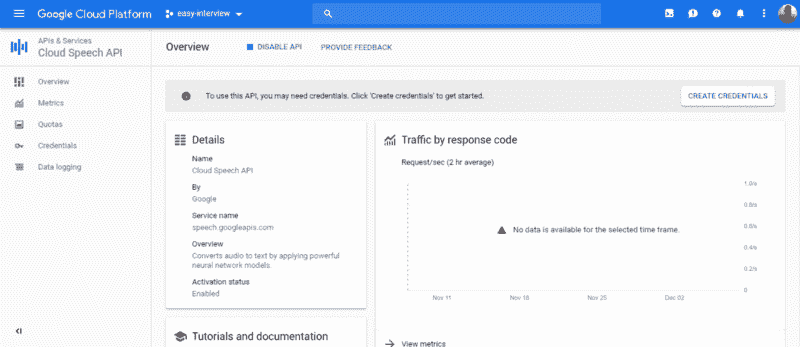
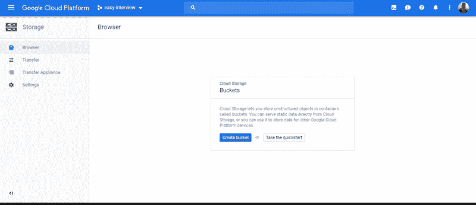
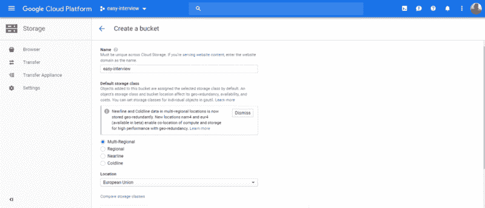

# 语音备忘录的 BFF——如何通过机器学习让 Speech2Text 变得简单

> 原文：<https://www.freecodecamp.org/news/the-voice-memos-bff-speech-to-text-powered-by-machine-learning-1dbc7a6c65f1/>

拉斐尔·贝尔彻尔

# 语音备忘录的 BFF——如何通过机器学习让 Speech2Text 变得简单

你觉得录语音备忘录不方便是因为要转录吗？你会因为从不写下来而浪费宝贵的语音备忘录吗？你觉得你没有释放你所记录的全部潜力吗？

是啊，真糟糕。？


Write, write, write.

我是一名计算机科学硕士研究生。因为我认为只工作不玩耍，我会变傻，所以我决定花些时间做些不同的事情。在哪里？在我所属的、[的](http://www.gce-neiist.org/articles)[学生群中，通过采访一位教授。](http://www.gce-neiist.org)

我与 Rui Henriques 教授、助教@ Técnico Lisboa 和研究员@ INESC-ID 进行了交谈。他是数据挖掘和生物信息学方面的专家。20 分钟的采访变成了将近一个小时的谈话。

芮不仅是一个优秀的学者，而且是一个诚实、开朗、随和的人，这使他很容易就能做到。我从和他的谈话中学到了很多，我相信你也可以。采访很快就会在网上发布。？

总之，我有一个问题和需求。我想节省时间，不必抄写整个采访。我们的想法是只投入 20 到 60 分钟，就可以在转录时大幅提升性能。这当然不仅限于面试。你可以转录从几个来源获取的音频笔记，如课堂、笔记、想法、购物清单或最具哲学意义的文章。

### 那么，我们该怎么做呢？

我还将讲授 [*It 基础设施管理和行政*](https://fenix.tecnico.ulisboa.pt/disciplinas/AGISIT/2018-2019/1-semestre)*@[técnico Lisboa](https://tecnico.ulisboa.pt/en/)。*在课堂上，我们已经使用了谷歌云引擎。我想起了一项名为[谷歌语音转文本](https://cloud.google.com/speech-to-text/´)的服务，我们可以在这种情况下使用。不，[谷歌](https://www.freecodecamp.org/news/the-voice-memos-bff-speech-to-text-powered-by-machine-learning-1dbc7a6c65f1/undefined)没有付钱让我写这个？

那么，如何把 55 分钟的采访变成容易编辑的文字呢？如何减少我们的努力，专注于重要的事情？？

？顺便说一下，为了充分利用这种方法，请减少噪音，尽量用响亮清晰的声音录制。？

### 步骤 1:安装所需的软件

我用流浪者来管理虚拟机。这样做的好处是，要使用这个环境，您需要实例化语音转文本服务。在本文中，我一步一步地展示如何配置这些工具(一直读到“实验”一节)。如果您喜欢在本地机器上这样做，请直接转到第三步。

### 步骤 2:启动虚拟机

现在，打开您的控制台并运行:

```
$ vagrant up --provision && vagrant ssh
```

虚拟机正在启动，安装所有必需的依赖项。这可能需要一段时间。

稍等一下。完成了。很好。向你致敬？

### 步骤 3:获取支持文件

[派生这个包含支持文件](https://github.com/RafaelAPB/gce-speech2text)的库，然后将其克隆到您的计算机上。将它放在正在与您的客户机同步的文件夹中。

### 第四步:在谷歌云引擎上创建一个账户

你可以[要求免费资助(300 美元)](https://cloud.google.com/free/)进行这项实验？创建帐户后，进入 G [oogle 控制台。](https://goo.gl/jo2qQL)创建一个项目。如果你足够自信，你可以把它命名为“简单面试”。您应该会看到类似这样的内容:


之后，转到“APIs &服务”，为了激活我们需要完成工作的 API。



点击“创建凭证”。选择“云语音 API”。关于“您计划将此 API 用于应用引擎还是计算引擎？”说“不”。在第 2 步，“创建服务帐户”，将服务命名为“转录”。角色是项目= >所有者。密钥类型:JSON。

现在，您应该已经下载了一个名为“file.txt”的文件。它包含使用服务所需的凭据。将该文件重命名为“terraform-credentials.json”。将其复制到包含支持文件的文件夹中。当该文件夹与您的虚拟机同步时，您将可以从来宾机访问这些文件。现在，运行:

```
$ gcloud auth login
```

按照说明操作。按照显示的链接验证您的身份。现在，分析 request.json 文件:

```
{  "config": {      "encoding":"FLAC",      "sampleRateHertz": 16000,      "languageCode": "en-US",      "enableWordTimeOffsets": false  },  "audio": {      "uri":"gs://cloud-samples-tests/speech/brooklyn.flac"  }}
```

确保调整参数以适合您的情况。请注意，您可以使用的编码是有限制的。如果你的文件格式不同于 *flac* 或 *wav* ，你将需要转换它。你可以用免费的开源音频软件 [Audacity](https://www.audacityteam.org/) 转换音频文件。转换完音频后，你得把它上传到谷歌存储器。为此，[您必须创建一个 bucket](https://console.cloud.google.com/storage/) 。



这些设置可以是:



之后，将您的文件上传到 bucket。在存储桶菜单上，您应该能够访问与您的文件相关联的 URI。格式为 *gs://BUCKET/FILE。分机*。把那个 URI 放到文件 *my-request.json* 上。

您的文件应该如下所示:

```
{  "config": {      "encoding":"FLAC",      "sampleRateHertz": 16000,      "languageCode": "pt-PT",      "enableWordTimeOffsets": false  },  "audio": {      "uri":"gs://easy-interview/interview.flac"  }}
```

在使用 API 之前，我们需要加载凭证。运行脚本 load-credentials.sh 来加载它们:

```
$ source load-credentials.sh
```

这已经设置了 GOOGLE_APPLICATION_CREDENTIAL 环境变量。接下来，要测试连接是否成功，运行:

```
$ curl -s -H "Content-Type: application/json" \    -H "Authorization: Bearer "$(gcloud auth application-default print-access-token) \    https://speech.googleapis.com/v1/speech:recognize \    -d @test-request.json
```

您应该能够看到带有一些转录文本的响应。注意，我们运行了 *test-request.json，*，这只是为了测试目的。现在，用你的数据打这个电话，运行:

```
$ curl -s -H "Content-Type: application/json" \    -H "Authorization: Bearer "$(gcloud auth application-default print-access-token) \    https://speech.googleapis.com/v1/speech:longrunningrecognize \    -d @my-request.json >> name.out
```

如果您运行 *more name.out，*您将看到响应包含一个名为 name 的字段。该名称对应于为满足请求而创建的操作名称。现在，您必须等待一段时间，直到操作完成。运行(用您的操作名称替换名称):

```
$ curl -H "Authorization: Bearer "$(gcloud auth application-default print-access-token) \     -H "Content-Type: application/json; charset=utf-8" \     "https://speech.googleapis.com/v1/operations/NAME" >> result.out
```

当操作没有完成时，您的 *result.out* 将具有类似如下的内容:

{
" name ":" 8254262642733152416 "，
" metadata ":{
"[@ type](http://twitter.com/type)":" type . Google APIs . com/Google . cloud . speech . v1 . longrunningrecognizemetadata "，
"progressPercent": 33，
" start time ":" 2018–12–08t 01:15:08.969852 z "，

对于一个 60mb 的文件，用 *flac* 编码，大约需要 12 分钟。你会有一个名为*的文件，里面有你的珍贵内容。它也将存在于您的主机中。我已经编写了一个非常简单的 Python 脚本来解析 *results.out.* 该脚本将输出重定向到一个名为 *results-parsed.out* 的文件。要执行它，请运行:*

```
$ python parse.py
```

如果您不喜欢结果，请调整参数并重试。

享受您的内容！你说完了吗？要完成本实验，请退出机器:

```
$ gcemgmt: exit
```

现在，停止虚拟机:

```
$ vagrant halt
```

不要忘记删除你上传到谷歌云的文件。

干得好！？

好吧，这花了我几个小时来写，但至少我不用转录整个采访。？

### 结果

首先，我想❤️to 听听你的意见！你录了很多语音备忘录吗？你觉得这个程序有用吗？你有不同的吗？

如果你**喜欢这篇文章**，请点击？左边的按钮。D **你有朋友或家人会从这个解决方案中受益吗？分享这篇文章！**

*继续摇*？

创业[？](https://emojipedia.org/fire/)

[**我在欧洲创新学院 2017 年学到的前 8 课**](https://blog.startuppulse.net/top-8-lessons-ive-learned-in-european-innovation-academy-2017-50eeb82d74b4)
[*想象你在每个层面都看到了提升自己的机会。你会接受吗？*blog.startuppulse.net](https://blog.startuppulse.net/top-8-lessons-ive-learned-in-european-innovation-academy-2017-50eeb82d74b4)

☄️

[**DevOps101 —改善您的工作流程！踏上流浪**](https://hackernoon.com/devops101-vagrant-6737c8c29904)
[*的第一步，让客户和开发者更开心。*hackernoon.com](https://hackernoon.com/devops101-vagrant-6737c8c29904)[**devo PS 101—基础设施作为代码，带有流浪者**](https://hackernoon.com/devops101-itinfrastructure-54337d6a148b)
[*并部署一个简单的 IT 基础设施(两台 LAMP web 服务器和一台客户机)。*hackernoon.com](https://hackernoon.com/devops101-itinfrastructure-54337d6a148b)

⛓️学生区块链

[**学生区块链 101-基础知识(上)**](https://hackernoon.com/blockchain-for-students-101-the-basics-part-1-f39b8201a7d5)
[*你准备好深入挖掘这项改变生活的技术了吗？*hackernoon.com](https://hackernoon.com/blockchain-for-students-101-the-basics-part-1-f39b8201a7d5)