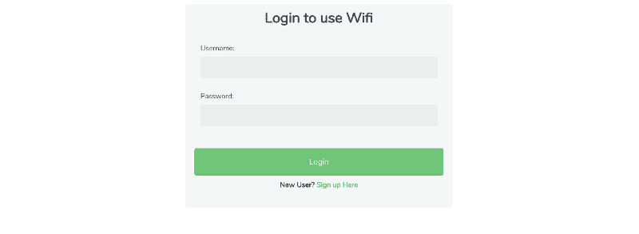
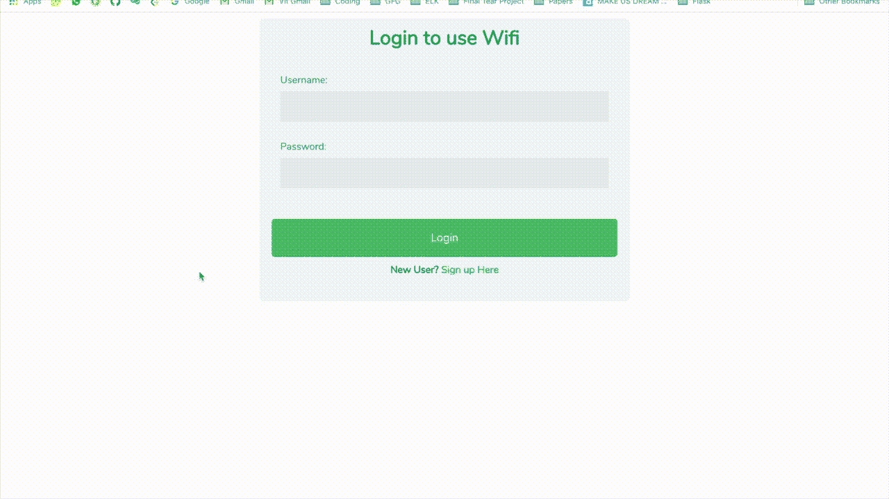
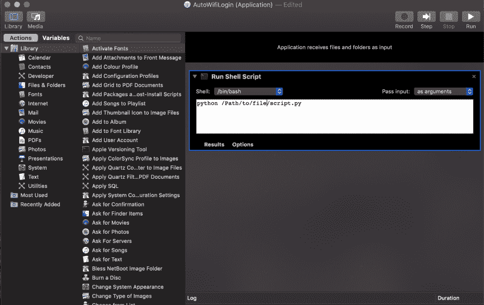

# 我如何创建一个 Python 机器人来自动登录强制网络门户

> 原文：<https://www.freecodecamp.org/news/how-i-created-a-python-bot-to-automatically-log-into-a-captive-portal-3d4ba04dee9f/>

作者:里特维克·卡纳

# 我如何创建一个 Python 机器人来自动登录强制网络门户

#### 构建登录机器人的一步一步的 Python 教程

Photo by [rawpixel](https://unsplash.com/photos/wbu4q8xk2Kc?utm_source=unsplash&utm_medium=referral&utm_content=creditCopyText) on [Unsplash](https://unsplash.com/search/photos/bot?utm_source=unsplash&utm_medium=referral&utm_content=creditCopyText)

如今，互联网不是特权，而是必需品。无论我们走到哪里，我们都需要使用 Wi-Fi 或基于移动数据的网络持续连接到互联网。

想象一下，我们加入了一所新的大学或组织，通过 Wi-Fi 为我们提供互联网。该组织可能会实现一个非常常见的登录页面来验证他们的用户，该页面被称为**(也称为**围墙花园**)。**

**使用强制网络门户有多种原因。**

*   **大学和组织使用它们来限制从一个帐户/个人连接到 Wi-Fi 网络的设备数量。**
*   **实现它们是为了提供对服务的访问，这些服务需要身份验证、支付或服务提供者和用户都同意遵守的其他有效凭证。**

**使用强制网络门户有很多理由和[的好处](https://www.teldat.com/blog/en/wi-fi-captive-portal-benefits/)，但这不是这篇文章的主题。**

**

Example of a Captive Portal** 

**我的公司实施了一个强制门户，用户需要登录才能访问互联网。在我连接到无线网络后，我的浏览器会打开强制网络门户页面，我需要输入用户名和密码，然后才能访问互联网。但是有一个问题。**

**尽管实施强制网络门户有利于防范未经授权的互联网访问、流量识别和用户管理，但它对每个设备的连接都是受控的，以确保所有用户都有足够的访问权限。强制网络门户可以，**

*   **控制每个用户的终端数量**
*   **控制带宽消耗和/或每个会话的下载速度**
*   **限制允许的流量类型，甚至指定会话超时持续时间**

**由于这些限制，如果我让系统进入睡眠状态或者闲置超过几分钟，我的系统就会从网络上注销。所以，超过空闲时间后，我不得不重新登录。**

**作为一名软件开发人员，我的系统需要持续、不间断地连接到互联网，我不得不一次又一次地输入我的用户名和密码，这非常麻烦。**

**如果在注销后，我只需点击系统上的按钮/图标即可登录强制网络门户，那会怎么样？**

**这应该是可行的！不需要输入用户名和密码，在大多数情况下应该是 8 个字符长，至少有一个大写字母等等等等。让我们看看我们能做些什么。**

#### **履行**

**即使你是编程新手，这也应该很容易。我用 Python 编程语言对此进行了编码。Python 可以在这里[下载，我们还需要](https://www.python.org/downloads/)这里[可以下载的 Selenium。也可以`pip install selenium`(推荐)。](https://www.seleniumhq.org/download/)**

**现在让我们看一下代码。**

**导入必要的库后，我们需要在代码中指定以下变量。**

**现在让我解释一下，**

*   ***网站*链接只不过是登录页面链接或强制网络门户链接，用户将根据这些链接进行身份验证**
*   **u *用户名*和*密码*是你登录时输入的**
*   ***用户名元素、密码元素、提交元素*是登录页面的 HTML 代码中的元素名称**

**让我告诉你如何找到这些。**

****

**如上图所示，**

*   **根据您的浏览器打开*检查元素*。**
*   **搜索 HTML 元素并复制输入标签的名称(在上面的例子中是它的*用户名*)。**
*   **做同样的事情来找出密码和*提交按钮*的 HTML 元素。**
*   **这些字符串将是您的*元素 _ 用户名、元素 _ 密码、元素 _ 提交的值。***

**大部分工作都完成了！**

> ****注意:**我在 macOS 上工作，所以我将为 Safari 实现这个机器人。对于 Chrome 等，通过 chromedriver 使用 Chrome。**

**将这段代码与其余代码一起复制，并保存为 Python(。py 文件)。使用`python script.py` *运行文件。*你会看到浏览器自动打开登录页面，输入详细信息并提交。你甚至不用再输入用户名和密码了。是不是很酷？**

> ****注:**完整代码可在 [GitHub](https://github.com/ritvikkhanna09/AutoLoginBot) 上获得。**

#### **在 macOS 中使用 Automator 创建应用程序(可选)**

****

**在 macOS 中，您可以创建一个应用程序，该应用程序可以遵循一组特定的工作流程来执行任何重复完成的任务。**

**在这一节中，我将解释如何将上述 Python 脚本制作成 automator 应用程序。这将使用户能够登录到强制网络门户，只需单击 automator 应用程序文件。**

**现在，让我们来看看实现这一点的步骤:**

**第一步:打开**自动机**。创建一个**新服务**或**文件**&g**t；**新**新>服务****

**第二步:添加一个“**运行 Shell 脚本**动作，设置 **Shell:** 为 **/bin/bash** 和**传递输入:**为**作为参数**。**

**步骤 3:现在添加 bash 代码，如下所示。将文件保存在桌面上。**

**第四步:点击文件，瞧！**

****

**像重复输入登录凭证这样简单的问题，很容易找到解决方案。一旦你知道问题陈述是什么，找到解决方案就更容易了。我希望这篇文章能让你了解 Selenium 和 Python 是如何工作的，以及创建一个 Python bot 是多么容易。**