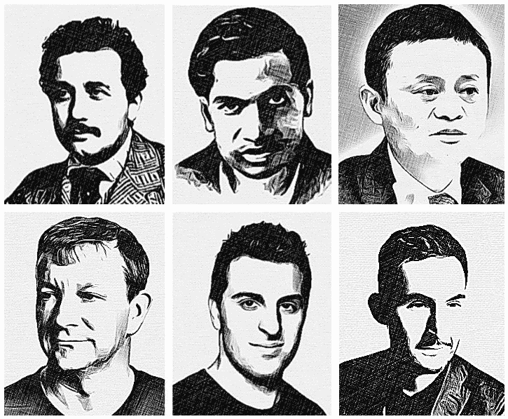
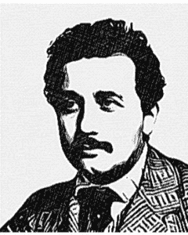
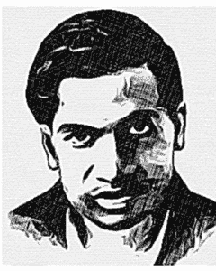
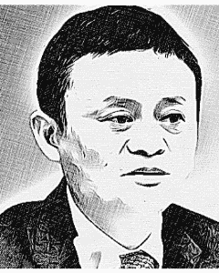
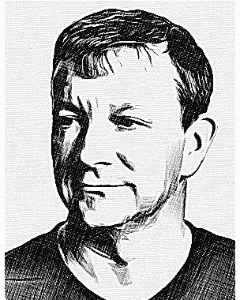
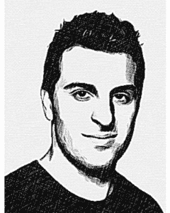
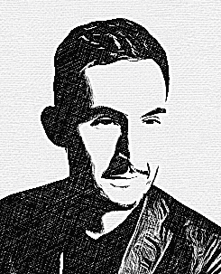

# 被拒？从科技巨头的故事中获得灵感

> 原文：<https://www.freecodecamp.org/news/rejected-get-inspired-by-the-stories-of-science-tech-giants-76c1b007d63a/>

奈扎·阿萨维尔

# 被拒？从科技巨头的故事中获得灵感

接到拒绝电话或电子邮件并不令人愉快。你感到失望、悲伤、困惑或流泪。在得到这么多拒绝后，或者当你知道自己客观上是这份工作的优秀候选人时，这尤其困难。你开始怀疑自己，想知道自己错过了什么。

虽然你这边总有改进的空间，但另一边也总有犯错的空间。这些错误可能是他们职业生涯中最糟糕的错误，也是你最大的机会。对待每一次拒绝——这可能是你遇到的最好的事情。

当你因为多次被拒而产生怀疑时，请记住，一些最伟大的科学家和企业家也被拒绝了很多次。这些拒绝导致了更好的结果。这里有一些拒绝的故事，激励我面对拒绝继续前进。

### [人名]阿尔伯特·爱因斯坦(犹太裔理论物理学家)

1900 年获得数学和物理学学位毕业后，阿尔伯特·爱因斯坦找不到人雇用他。他申请教学或研究职位的所有学校和学院都拒绝了他。

他为了找工作苦苦挣扎，以至于考虑转行卖保险！他的父亲写信给他的朋友，没有告诉爱因斯坦，问他们是否可以为他的儿子找到一份工作，没有成功。

失业近两年后，绝望的爱因斯坦搬到了瑞士首都伯尔尼，在那里，他一个朋友的父亲给他找了一份初级专利审查员的工作。他在那里工作到 1909 年。

爱因斯坦过去常常很快地完成他的任务，并利用剩余的时间从事他感兴趣的科学研究。在此期间，特别是 1905 年，他发表了四篇有史以来最重要的科学论文。这些论文在空间、时间、质量和能量方面奠定了现代物理学的基础。

### 斯里尼瓦瑟·拉马努金

尽管一生大部分时间生活在贫困之中，几乎没有接受过正规教育，32 岁就去世了，但斯里尼瓦瑟·拉马努金在数学领域做出了巨大贡献。

Ramanujan 获得了上大学的奖学金。然而，他对数学的浓厚兴趣分散了他的注意力，因此他其他科目都不及格，并被取消了奖学金。他后来进入了另一所大学，其他科目再次不及格。

没有大学学位，他独立从事数学研究。他生活贫困，正挨家挨户寻找一份文职工作。他会向未来的雇主展示他的工作，并给数学家和大学写信，详述他提出的高级定理。

有些人没有回应他，有些人认为他是个骗子，有些人对他展示的作品印象深刻，但怀疑这是他的作品。然而，也有人给他写了介绍其他著名数学家的介绍信。

他的突破来自于剑桥大学数学家 g·哈代的回复和赞助，他承认这是一个天才的工作。Ramanujan 前往英国与 Hardy 一起工作，并成为历史上最年轻的皇家学会会员之一，时年 31 岁。

### 马云

阿里巴巴创始人、全球商业领袖马云也遭到了不少拒绝。从家乡中国杭州大学毕业后，他申请了 30 份工作，但都被拒绝了。他申请当警察。五个申请者中，他是唯一被拒绝的。

他甚至被肯德基拒绝。当他们来到他的家乡时，他试图和他们一起找份工作。他说，在 24 名申请人中，他是唯一被拒绝的人。

后来，拒绝并没有停止！马十次试图进入哈佛商学院，但每次都被拒绝了。当他 2001 年来美国筹集 500 万美元投资时，被拒绝了。“……我们(将)回来筹集更多一点的资金，”他说。

马云将自己作为企业家的韧性和成功部分归因于一路上遭遇的拒绝。

### 布莱恩·阿克顿

WhatsApp 的联合创始人布莱恩·阿克顿(Brian Acton)也遭到了“发生在我身上最好的事情”的拒绝。2009 年，阿克顿——一名在雅虎和苹果有多年工作经验的软件工程师——先后被推特和脸书拒绝。

由于他渴望加入的其他公司都不会聘用他，他走上了创业之路，与另一位雅虎校友简·库姆一起创办了 WhatsApp。

五年后，阿克顿共同创立的基于云的信息公司改变了世界各地人们发短信的方式。早先拒绝他的公司——脸书——想要他。这一次，他们不得不支付 190 亿美元收购他的公司并重新雇用他。

### 布莱恩·切斯基

2008 年，Airbnb 的联合创始人兼首席执行官布莱恩·切斯基(Brian Chesky)是一个“无名小卒”的企业家，希望有人相信他、他的小团队和他们的想法。

切斯基和他的团队正在为 Airbnb 的 10%寻求 15 万美元的投资。他的一个朋友给他介绍了七个潜在的投资者。其中五个拒绝了他，另外两个甚至懒得回复他。

十年后的 2018 年，Airbnb 是全球最大的酒店公司。在 Airbnb 估值达到 300 亿美元的情况下，拒绝 Chesky 10%的报价对这些投资者来说是一个 30 亿美元的错误。

### 凯文·斯特罗姆

Instagram 的联合创始人 Systrom 从斯坦福大学毕业后就加入了谷歌。

他曾与谷歌高管萨拉尔·卡曼加共事，后者对 Systrom 印象深刻，并希望将他调到谷歌的助理产品经理(APM)项目。

APM 计划是谷歌的一个精英轮换计划，在这个计划中，少数人被挑选出来，并在真正有影响力的项目中担任重要角色。

Systrom 被拒是因为该项目只接受拥有计算机科学学位的候选人。尽管萨拉尔·卡曼加努力说服他的高管同事接受 Systrom，但这种情况还是发生了。syst rom“是一位出色的自学成才的程序员，有着与工程师密切合作以交付产品的历史”。

由于被拒，凯文离开了谷歌，后来在 2010 年共同创立了 Instagram，并在两年后以 10 亿美元的价格将其出售给脸书。

### 教训

虽然拒绝在短期内是一种挫折，但从长期来看，这是潜在重大成果的必要步骤，没有拒绝就不可能发生。

我们有一个选择。我们可以选择对收到的拒绝感到沮丧，因为“我们不够好”。或者，我们可以选择相信，我们未来的日子希望我们成为优等生，而不是劣等生。我选择后者，我相信你也一样！

### 来源

[1]爱因斯坦:[维基百科](https://en.wikipedia.org/wiki/Albert_Einstein)，[爱因斯坦的非凡天才](https://www.youtube.com/watch?v=Uvpw6Jh1WGQ)。

[2]斯里尼瓦瑟·拉马努金:[维基百科](https://en.wikipedia.org/wiki/Srinivasa_Ramanujan)，【Ramanujan 是谁？

[3]马云:[维基](https://en.wikipedia.org/wiki/Jack_Ma)，[拒绝——马云](https://www.youtube.com/watch?v=2baJreTbMvs)。

[4]布莱恩·阿克顿:[维基百科](https://en.wikipedia.org/wiki/Brian_Acton)，[福布斯](https://www.forbes.com/sites/georgeanders/2014/02/19/he-wanted-a-job-facebook-said-no-in-a-3-billion-mistake/#bdd2cf852441)。

[5]布莱恩·切斯基:[维基百科](https://en.wikipedia.org/wiki/Brian_Chesky)，[布莱恩·切斯基培养基](https://medium.com/@bchesky/7-rejections-7d894cbaa084)

[6]凯文·斯特罗姆:[维基百科](https://en.wikipedia.org/wiki/Kevin_Systrom)，[谷歌如何运作](https://books.google.ca/books?id=fEJ0AwAAQBAJ&printsec=frontcover&source=gbs_ge_summary_r&cad=0#v=onepage&q&f=false)