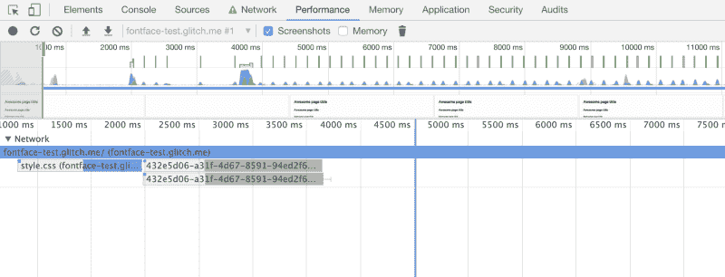
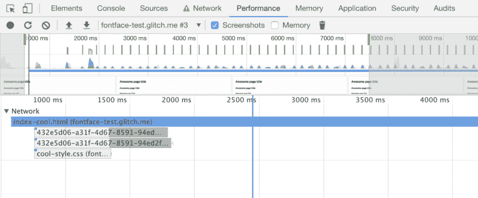

# 如何加载 web 字体以避免性能问题并加快页面加载速度

> 原文：<https://www.freecodecamp.org/news/web-fonts-in-2018-f191a48367e8/>

作者马蒂亚·阿斯托里诺

世界各地都在使用定制的网络字体，但是许多(哦，太多了)网站没有正确加载它们。这给页面加载带来了很多问题，比如性能问题、加载时间慢、渲染受阻和导航时字体交换。

我看到许多开发人员忽略了这些问题，或者可能一次又一次地犯同样的错误，只是因为“他们总是这样做”，但是作为 web 开发人员，我们需要能够适应不断变化的环境。

是时候打破这个循环，在 2019 年开始做正确的事情了。加载自定义 web 字体时，只需考虑四个步骤:

*   使用正确的字体格式
*   预加载字体
*   使用正确的字体声明
*   在字体加载过程中避免不可见的文本。

让我们一次一个地分解这些要点。

### 使用正确的字体格式

网页上可以使用的字体格式有很多，但如果不是必须支持 IE 8 或更低版本，真正需要的只有两种格式: [**woff**](https://caniuse.com/#search=woff) 和 [**woff2**](https://caniuse.com/#search=woff2) 。这是您应该使用的唯一两种文件类型，因为它们默认情况下是以 gzip 格式压缩的(因此非常小)，针对 web 进行了优化，并且完全受 IE 9+和所有其他 evergreen 浏览器的支持。

### 预加载字体

当使用自定义字体时，你应该告诉浏览器使用合适的`rel=""`标签和属性来预加载它们:

```
<link rel="preload" as="font" href="/fonts/custom-font.woff2" type="font/woff2" crossorigin="anonymous">
```

```
<link rel="preload" as="font" href="/fonts/custom-font.woff" type="font/woff2" crossorigin="anonymous">
```

*注意这里 crossorigin 的用法是`important`；如果没有此属性，浏览器将忽略预加载的字体，并进行新的提取。这是因为浏览器会匿名提取字体，只有使用 This 属性才能匿名请求预加载。*

在上面的例子中，`rel="preload" as="font"`属性将要求浏览器尽快开始下载*所需的*资源。它们还告诉浏览器这是一种字体，因此它可以在其资源队列中适当地对其进行优先排序。使用[预加载提示](https://developers.google.com/web/fundamentals/performance/resource-prioritization?hl=en#preload)将对网页字体性能和初始页面加载产生巨大影响。支持预加载和预取提示的浏览器会在看到 HTML 文件中的提示后立即开始下载 web 字体，而不再需要等待 CSS。

相反，您可以使用`rel="prefetch"`属性来告诉浏览器准备下载稍后在页面加载或用户操作期间可能需要的资源，这样它将为这些资源分配一个低优先级。

**注意:**
如果你使用的是像谷歌字体这样的 CDN，确保你预加载的字体文件与 CSS 中的相匹配。字体也可以定期更新，如果你在使用 CSS 下载新版本的同时预加载旧版本，你可能会下载相同字体的两个版本，浪费用户的带宽。考虑用`[<link rel="preconnec](https://developers.google.com/web/fundamentals/performance/resource-prioritization?hl=en#preconnect)` [t" >？](https://developers.google.com/web/fundamentals/performance/resource-prioritization?hl=en#preconnect)？‍?而不是为了更容易维护。

### 正确的字体声明

声明一个字体系列非常简单，但是当我们这样做的时候，我们必须注意某些事情。下面是一个声明自定义字体系列的正确示例:

```
@font-face {  font-family: 'Custom Font';  font-weight: 400;  font-style: normal;  font-display: swap; /* Read next point */  unicode-range: U+000-5FF; /* Download only latin glyphs */  src: local('Custom Font'),       url('/fonts/custom-font.woff2') format('woff2'),        url('/fonts/custom-font.woff') format('woff');}
```

这是谷歌网络基础的 Unicode 范围。

正如你所看到的，我们只使用优化的字体( **woff** 和 **woff2** )，我们告诉浏览器**只加载**所需的字形范围(从`U+000`到`U+5FF`)，*，但是这个属性并不阻止浏览器下载整个字体*。还有两件事需要注意，`local()`函数和字体声明顺序。

`local()`功能允许用户使用字体的本地副本(如 Android 上预装的 Roboto 字体),而不是下载。

字体声明顺序也很重要，因为浏览器将按照声明顺序开始获取资源。如果它支持 woff2 格式，它将下载字体，或者如果它不能识别资源格式，它将继续下一个，等等。

*如果你真的想使用`eot`和`ttf`字体，请确保将它们添加在`src`声明的末尾。*

#### 资源

*   [字形范围生成器](https://codepen.io/elifitch/pen/Ljqway)由 Eli Fitch 提供
*   [现代字体生成器](https://transfonter.org/)

### 字体加载过程中避免不可见文本

字体通常是很大的文件，即使进行了 gzipped 压缩，也需要一段时间才能加载。为了解决这个问题，一些浏览器在字体加载之前隐藏文本(“隐藏文本的闪光”)。您可以避免“闪烁”,一开始使用系统字体，然后替换它，立即向用户显示内容。

在前面的`@font-face`示例中，您会注意到`[font-display](https://developer.mozilla.org/en-US/docs/Web/CSS/@font-face/font-display)`声明。`swap`值告诉浏览器使用该字体的文本应该立即用系统字体显示。一旦自定义字体准备就绪，系统字体就会被换出。

如果[浏览器不支持](https://caniuse.com/#search=font-display) `font-display`，它会继续遵循默认的加载字体行为。

#### 如果字体未准备好，浏览器默认行为:

**Edge** 使用系统字体，直到自定义字体准备好，然后换出字体。

Chrome 将隐藏文本长达 3 秒。如果文本仍未准备好，它将使用系统字体，直到自定义字体准备好。

Firefox 将隐藏文本长达 3 秒。如果文本仍未准备好，它将使用系统字体，直到自定义字体准备好。

**Safari** 隐藏文本，直到自定义字体准备就绪。

### 测试

以下链接针对优化版本测试“标准版本”:

*   [标准](https://fontface-test.glitch.me/)
*   [优化](https://fontface-test.glitch.me/index-cool.html)

#### 结果



Default



Optimised behaviour

### 结论

考虑这样的基本优化将提高你的数字产品的总体 UX。我们必须考虑连接速度不是最佳的情况，或者当你的应用程序/网站完全加载并可导航时，人们没有时间等待几秒钟。

这样的改进，特别是对于大型项目，对于改善整体用户体验是强制性的，它们真的不需要太多的努力。

我们必须一起努力修复网络。

#### 关注我的博客:

[**马蒂亚·阿斯托里诺**](https://equinsuocha.io/)
[*网页开发者，蒙扎的 CSS/HTML 忍者。开源设计的成员。* equinsuocha.io](https://equinsuocha.io/)