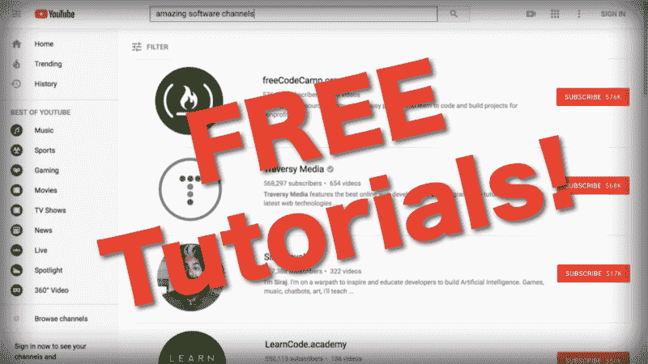

# 想要惊人的免费编码教程？订阅这些 YouTube 频道。

> 原文：<https://www.freecodecamp.org/news/want-amazing-free-coding-tutorials-subscribe-to-these-youtube-channels-b91f154db543/>

作者博·卡恩斯

# 想要优秀的免费编码教程？订阅这些 YouTube 频道。

YouTube 上有很多非常棒的免费软件教程和课程！

我运营免费的无广告 YouTube 频道。我们有很多流行编程语言和框架的完整视频课程和教程(包括 [JavaScript](https://www.youtube.com/watch?v=PkZNo7MFNFg) 、 [Python](https://www.youtube.com/watch?v=rfscVS0vtbw) 、 [Java](https://www.youtube.com/watch?v=grEKMHGYyns) 、 [Ruby](https://www.youtube.com/watch?v=t_ispmWmdjY) 、 [C](https://www.youtube.com/watch?v=KJgsSFOSQv0) 、 [C++](https://www.youtube.com/watch?v=vLnPwxZdW4Y) 、 [Angular](https://www.youtube.com/watch?v=2OHbjep_WjQ) 和 [more](https://www.youtube.com/playlist?list=PLWKjhJtqVAbnupwRFOq9zGOWjdvPRtCmO) )。

我也遇到过许多其他 YouTube 频道，它们提供令人惊叹的免费编程教程。这些频道上的免费教程和你付费的一样好，甚至更好。

在这篇文章中，我列出了十个 YouTube 频道，如果你想提高你的编码技能，你应该订阅这些频道。这些没有特定的顺序。

观看来自不同创作者的相同主题的教程会非常有帮助。从多个角度学习可以帮助你更深入地理解概念。

有很多很棒的频道，我在这个列表中没有足够的空间。在评论区让人们知道他们应该查看免费编程教程的其他渠道。

### 编码序列

[**编码列车**](https://www.youtube.com/channel/UCvjgXvBlbQiydffZU7m1_aw)
[*在这个 YouTube 频道我每周都会发布“创意编码”视频教程。涵盖的主题范围从基础…*www.youtube.com](https://www.youtube.com/channel/UCvjgXvBlbQiydffZU7m1_aw)

在没有编辑的情况下现场录制高质量的教程需要很多技巧。但这正是编码培训的丹尼尔·希夫曼所做的。他用一种有趣的方式教授复杂的话题，这种方式对初学者来说很容易理解。一旦你看到频道的介绍视频，你就会知道为什么你需要立即订阅。

### 旅行媒体

[**Traversy Media**](https://www.youtube.com/channel/UC29ju8bIPH5as8OGnQzwJyA)
[*Traversy Media 为所有最新的 web 提供最好的在线 web 开发和编程教程…*www.youtube.com](https://www.youtube.com/channel/UC29ju8bIPH5as8OGnQzwJyA)

Brad Traversy 对卓越的热情在他的视频中得到了充分的展示。他的风格是友好和务实的。他似乎完全明白自学成才的程序员需要知道什么。他的频道主要介绍各种 web 开发框架和语言的教程。

### 德里克·巴纳斯

[**德里克巴纳斯**](https://www.youtube.com/channel/UCwRXb5dUK4cvsHbx-rGzSgw)
[*我根据你的要求制作教程。我会涵盖你能想到的任何话题。我在……*www.youtube.com](https://www.youtube.com/channel/UCwRXb5dUK4cvsHbx-rGzSgw)上传新的编程视频

德里克·巴纳斯是真正的多面手程序员。他有几乎所有流行的(和一些不太流行的)编程语言的专业级教程。他目前拥有的订户比这个名单上的任何人都多，这是完全应该的。如果你想学习一门编程语言，他的频道是一个很好的第一个地方。

### LearnCode .学院

[**learn code . academy**](https://www.youtube.com/channel/UCVTlvUkGslCV_h-nSAId8Sw)
[*100%免费网页开发教程、网站设计教程等。包括但不限于:HTML，CSS…*www.youtube.com](https://www.youtube.com/channel/UCVTlvUkGslCV_h-nSAId8Sw)

来自 LeanCode.academy 的 Will Stern 在他的教程中加入了近 20 年的 web 开发经验。他有一个惊人的完整的课程，涵盖了你成为一名网站开发者所需要知道的一切。

### 开发技巧/ FunFunFunction

[**dev tips**](https://www.youtube.com/channel/UCyIe-61Y8C4_o-zZCtO4ETQ)
[*dev tips 是为想获得灵感的你而设的每周节目？还有学习？关于编程。由大卫和 MPJ 主持…ww*w.youtube.com](https://www.youtube.com/channel/UCyIe-61Y8C4_o-zZCtO4ETQ)

Dev Tips 已经存在了一段时间，但最近被大卫和 MPJ 接管。MPJ 还经营着有趣有趣的功能频道。这两个频道都非常有用，但是 Dev Tips 比 FunFunFunction 有更多的教程。如果你想要 JavaScript 框架的教程，DevTips 是一个很好的渠道。

### LevelUpTuts

[**LevelUpTuts**](https://www.youtube.com/channel/UCyU5wkjgQYGRB0hIHMwm2Sg)
[*TLDR；840+免费视频教程创建，录制，编辑，出版和维护斯科特托林斯基。故事级别…*www.youtube.com](https://www.youtube.com/channel/UCyU5wkjgQYGRB0hIHMwm2Sg)

LevelUpTuts 拥有比大多数其他节目频道更多的教程视频。这是学习 web 开发最佳实践的绝佳渠道。重点是前端框架。来自 LevelUpTuts 的 Scott Tolinski 也主持了一个最好的网络开发播客，[语法](https://syntax.fm/)。

### 网络忍者

[**网络忍者**](https://www.youtube.com/channel/UCW5YeuERMmlnqo4oq8vwUpg)
[*黑带拓展技能。关于 Node.js、JavaScript、CSS、HTML、Vue.js、React 和更多内容的教程…*www.youtube.com](https://www.youtube.com/channel/UCW5YeuERMmlnqo4oq8vwUpg)

当《网络忍者》的肖恩说他将帮助你获得黑带开发技能时，他不是在开玩笑。这些都是涵盖全栈 web 开发的高质量教程。每个人都喜欢英国口音，对吗？

### sentdex

[**send ex**](https://www.youtube.com/channel/UCfzlCWGWYyIQ0aLC5w48gBQ)
[*Python 编程教程，比基础知识更进一步。了解机器学习、金融、数据分析……*www.youtube.com](https://www.youtube.com/channel/UCfzlCWGWYyIQ0aLC5w48gBQ)

这是高级 Python 教程的主要渠道。虽然他以初学者可以理解的方式解释事情，但他涵盖了其他频道没有涵盖的更高级的主题。他有一些很棒的机器学习教程，甚至展示了如何编程一辆自动驾驶汽车玩 GTA5。

### CS 道场

 **[*大家好！我的名字叫 YK，我在这里制作的视频大多是关于编程和计算机科学的。我也有一个频道……*www.youtube.com](https://www.youtube.com/channel/UCxX9wt5FWQUAAz4UrysqK9A)**

**CS Dojo 是 YouTube 上增长最快的软件频道之一。原因很明显:CS Dojo 有着一贯的高质量教程。该频道关注 Python、数据结构和算法。**