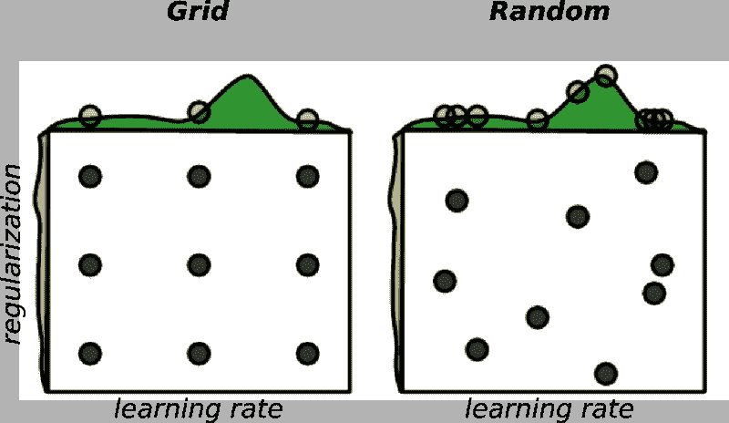
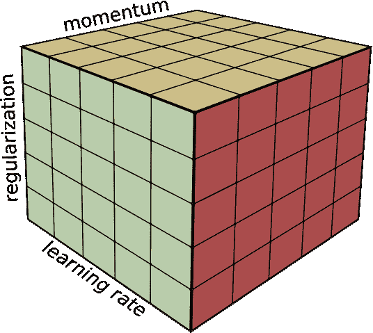
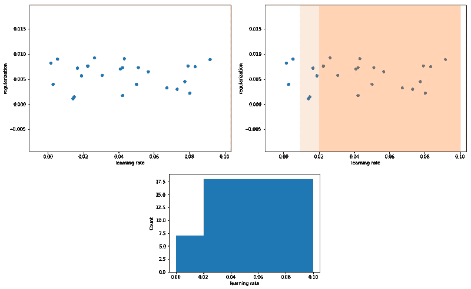

# 高维超参数调谐简介

> 原文：<https://www.freecodecamp.org/news/an-introduction-to-high-dimensional-hyper-parameter-tuning-df5c0106e5a4/>

泰勒·席尔瓦

# 高维超参数调谐简介

#### 优化 ML 模型的最佳实践


如果你曾经纠结于调整机器学习(ML)模型，那么你读对了。

**超参数调整**指的是为学习算法找到一组最佳参数值的问题。

通常，选择这些值的过程是一项耗时的任务。

即使对于像线性回归这样的简单算法，找到超参数的最佳集合也是困难的。有了深度学习，事情变得更糟。

优化神经网络(nn)时要调整的一些参数包括:

*   学习率
*   动力
*   正规化
*   退出概率
*   批量标准化

在这篇短文中，我们将讨论优化 ML 模型的最佳实践。这些实践主要在要优化的参数数量超过两个或三个时出现。

#### 网格搜索的问题是

当我们有少量参数需要优化时，网格搜索通常是一个不错的选择。对于两个甚至三个不同的参数，这可能是正确的方法。

对于每个超参数，我们定义一组候选值进行研究。

然后，想法是详尽地尝试单个参数值的每个可能的组合。

对于每个组合，我们训练和评估不同的模型。

最后，我们保留泛化误差最小的那个。

网格搜索的主要问题是它是一种指数时间算法。它的成本随着参数的数量成指数增长。

换句话说，如果我们需要优化 *p* 参数，并且每个参数最多取 *v* 值，那么它在 [O(vᵖ)时间](https://guide.freecodecamp.org/computer-science/notation/big-o-notation/)内运行。

此外，网格搜索在探索超参数空间方面并不像我们想象的那样有效。

再看一下上面的代码。使用这个设置，我们将训练总共 256 个不同的模型。请注意，如果我们决定再添加一个参数，实验次数将增加到 1024 次。

但是，该设置只研究每个超参数的四个不同值。也就是说，我们训练 256 个模型，只探索学习率、正则化等四个值。

此外，网格搜索通常需要重复尝试。以上面代码中的`learning_rate_search`值为例。

```
learning_rate_search = [0.1, 0.01, 0.001, 0.0001]
```

假设在我们第一次运行(256 次模型试验)之后，我们得到了学习率值为 0.01 的最佳模型。

在这种情况下，我们应该通过“放大”0.01 附近的网格来优化我们的搜索值，希望找到一个更好的值。

为此，我们可以设置新的网格搜索并重新定义学习率搜索范围，例如:

```
learning_rate_search = [0.006, 0.008, 0.01, 0.04, 0.06]
```

但是如果我们得到学习率值为 0.0001 的最佳模型呢？

由于该值位于初始搜索范围的最边缘，我们应该移动这些值，并使用不同的集合重试，例如:

```
learning_rate_search = [0.0001, 0.00006, 0.00002]
```

并且在找到一个好的候选人之后，可能尝试改进范围。

所有这些细节只是强调了超参数搜索是多么耗时。

### 一种更好的方法——随机搜索

随机选择我们的超参数候选值怎么样？虽然看起来不太直观，但这个想法几乎总是比网格搜索要好。

#### 一点点直觉

请注意，一些超参数比其他参数更重要。

例如，学习率和动量因子比所有其他因素更值得调整。

然而，除了上面的例外，很难知道哪一个在优化过程中起主要作用。事实上，我认为对于不同的模型架构和数据集，每个参数的重要性可能会有所不同。

假设我们正在优化两个超参数——学习率和正则化强度。此外，考虑到只有学习率对这个问题很重要。

在网格搜索的情况下，我们将运行九个不同的实验，但只尝试三个候选的学习率。



Image Credit: [Random Search for Hyper-Parameter Optimization](http://www.jmlr.org/papers/volume13/bergstra12a/bergstra12a.pdf), James Bergstra, Yoshua Bengio.

现在，看看如果我们对候选人进行均匀随机抽样会发生什么。在这个场景中，我们实际上在探索每个参数的九个不同值。

如果你还不相信，假设我们正在优化三个超参数。例如，学习速率、正则化强度和动量。



Optimizing over 3 hyper-parameters using Grid Search.

对于网格搜索，我们将运行 125 次训练运行，但只探索每个参数的五个不同值。

另一方面，使用随机搜索，我们将探索 125 个不同的值。

#### 怎么做

如果我们想要尝试学习率的值，比如说在 0.1 到 0.0001 的范围内，我们可以:

请注意，我们是在对数标度上从**均匀分布中采样值。**

您可以将值-1 和-4(用于学习率)视为区间[10e-1，10e-4]中的指数。

如果我们不使用对数标度，在给定的范围内取样将是不均匀的。换句话说，您不应该尝试对以下值进行采样:

在这种情况下，大多数值不会从“有效”区域中采样。实际上，考虑到本例中的学习率样本， **72%的值**将落在区间[0.02，0.1]内。

此外，88%的采样值将来自区间[0.01，0.1]。也就是说，只有 12%的学习率候选值，即 3 个值，将从区间[0.0004，0.01]中被采样。不要那样做。

在下图中，我们从范围[0.1，0.0004]中抽取了 25 个随机值。左上角的图显示了原始值。

在右上角，注意 72%的采样值在区间[0.02，0.1]内。88%的值位于范围[0.01，0.1]内。

底部的图显示了值的分布。只有 12%的值在区间[0.0004，0.01]内。要解决这个问题，请从对数标度的均匀分布中对值进行采样。



正则化参数也会发生类似的行为。

另外，请注意，与网格搜索一样，您需要考虑我们上面提到的两种情况。

如果最佳候选落在非常接近边缘的位置，您的范围可能会偏离，应该进行移位和重新采样。此外，在选择了第一个好的候选值后，尝试重新采样到更精细的值范围。

总之，这些是关键要点。

*   如果您有两个或三个以上的超参数需要优化，请选择随机搜索。它比网格搜索更快/更容易实现并且收敛得更快。
*   使用适当的尺度来选择你的值。对数空间中均匀分布的样本。这将允许您在参数范围内对均匀分布的值进行采样。
*   不管随机还是网格搜索，注意你选择的候选人。确保参数的范围设置正确，并尽可能细化最佳候选值。

感谢阅读！要了解更多关于深度学习的酷东西，请查看我以前的一些文章:

[**如何使用 TensorFlow 训练自己的 FaceID ConvNet 热切执行**](https://medium.freecodecamp.org/how-to-train-your-own-faceid-cnn-using-tensorflow-eager-execution-6905afe4fd5a)
[*人脸无处不在——从社交媒体网站上的照片和视频，到像…*medium.freecodecamp.org](https://medium.freecodecamp.org/how-to-train-your-own-faceid-cnn-using-tensorflow-eager-execution-6905afe4fd5a)[**机器学习 101:梯度下降的直观介绍**](https://towardsdatascience.com/machine-learning-101-an-intuitive-introduction-to-gradient-descent-366b77b52645)
[*梯度下降无疑是大多数机器学习(ML)算法的核心和灵魂。我绝对相信……*towardsdatascience.com](https://towardsdatascience.com/machine-learning-101-an-intuitive-introduction-to-gradient-descent-366b77b52645)