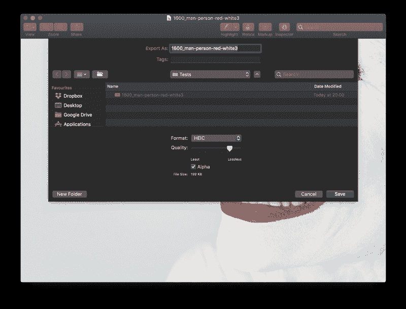

# 最好的网络图像格式:JPEG、WEBP、HEIC 还是 AVIF？

> 原文：<https://www.freecodecamp.org/news/best-image-format-for-web-in-2019-jpeg-webp-heic-avif-41ba0c1b2789/>

在 JPEG 占据了几十年无与伦比的统治地位之后，近年来出现了新的格式——WebP 和 HEIC——挑战这一地位。

web 浏览器和移动操作系统中的主要玩家只部分支持这些，但支持力度很大。

另一种新的图像格式——AVIF——预计将在 2019 年出现，并有望席卷整个网络。

在本文中，我们将从经典格式的简短修订开始，然后描述 WebP 和 HEIC/HEIF。然后，我们将继续探索 AVIF，并在总结中总结所有要点。

在开发和部署用于电子商务工作流程中图像优化管道的[工具的过程中，对优点和缺点的评论建立在对可用权威报告的审查和第一手观察的基础上。](https://abraia.me/)

### 具有普遍支持的网络经典图像格式

让我们按照时间顺序提醒自己，网络图像的三种最重要的经典格式。

#### **GIF**

GIF 支持 LZW 无损压缩和多帧，使我们能够制作简单的动画。

这种格式的主要限制是它被限制为 256 色。当它在 80 年代后期被创造出来时，这是合理的，因为同样的限制也适用于现有的显示器。然而，随着显示技术的改进，很明显，它不适合再现任何平滑的颜色梯度，就像在摄影图像中发现的那样。我们可以很容易地发现它产生的色带。

然而，GIF 允许轻量级动画具有普遍的支持。直到今天，在对质量问题不敏感的用例中，这个特性一直保持着这种格式，最典型的是很少或没有颜色的小动画图像。

#### **JPEG**

web 图像格式之王是为支持数字摄影工作流程而开发的。

由于通常为 24 位深度，它提供的色彩分辨率(不要与范围或色域混淆)远远超过人眼的分辨能力。它通过利用人类视觉的已知机制来支持有损压缩。

我们的眼睛对中等尺度比对细微细节更敏感。因此，JPEG 允许我们丢弃精细的细节(高空间频率)，丢弃量由质量因子控制。质量越低意味着保留的细节越少。此外，我们对高亮度对比度的细节比对只有色度对比度的细节更敏感。

因此，JPEG 在一个亮度和两个色度通道中对 RGB(红色、绿色和蓝色)图像进行内部重新编码。这允许我们使用色度二次采样来仅丢弃色度通道中的更多细节。值得注意的是，JPEG 将图像编码成 8x8 像素的块。

随着我们降低质量因子和/或应用更积极的色度二次采样，我们开始出现越来越多的振铃、光晕、方块或模糊现象。JPEG 的一个问题是，根据图像内容的不同，伪像可能以不同的质量因子值出现。当比较自然摄影和艺术作品的效果时，最大的差异出现了。因为艺术品(形状、字体)通常依赖于锐利的边缘，所以即使是少量的细节被丢弃，它们也会产生伪像。

对于照片，与无损压缩相比，JPEG 可以轻松地将文件重量减少 10 倍，几乎没有明显的伪像。

#### **PNG**

开发这种无损图形格式是为了取代 GIF，解决其色带(和许可)问题。对于包含大量艺术作品的图像来说，这是必需的，因为 JPEG 即使以最小的压缩率也会产生大量的伪像。

与 GIF 相比，它支持透明性和改进的压缩。由于它不丢弃信息，PNG 不会产生伪像。当然，与有损压缩相比，这是以在存在许多不同颜色梯度的情况下图像权重较重为代价的。

它成功地利用了艺术作品的一个常见特征:与摄影不同，摄影的特点是颜色连续变化细微，艺术作品图片通常很少有明确定义的颜色。

因此，PNG 通过将大量像素映射到一个简单的离散调色板来压缩图像，结果节省了大量比特。与 GIF 相比，它通常以更少的字节提供更高的质量。

### 部分支持的新人:基于 HEVC 的 WEBP 和 HEIC

视频编解码器用来压缩流的机制可以分为两种主要类型:帧间和帧内。第一种机制利用了时间上的冗余，而帧内机制专注于减少给定帧内的冗余，而不依赖于其他帧。这种压缩机制可以应用于静止图像。

以移动网络为核心的视频共享的爆炸式增长和显示分辨率的稳步提高推动了新编码标准的努力，以实现最高的压缩效率。

因此，新的图像格式正在作为新的视频编码标准的衍生物出现。这些新的图像格式提供了比 JPEG 更大的功能集，并承诺在提高视觉质量的同时节省文件重量。

#### **WEBP**

Google 开发这种格式的目的是提供一种单一的支持 web 的图像格式来处理所有典型的用例。

重要的是，它试图获得比 JPEG 更亮的图像，而不会影响视觉质量。它使用更复杂的操作，如块预测，是 VP8 视频编解码器的衍生物。它支持无损压缩，与 JPEG 不同，它允许透明和动画，可以结合无损和有损压缩编码的图像。

原则上，它应该作为 JPEG、PNG 和 GIF 的替代品。一个重要的缺点是缺乏普遍支持。直到最近，WebP 还仅限于谷歌支持的软件，如 Chrome 浏览器和 Android 原生应用程序。

然而，随着[宣布【Edge 和 Firefox(不包括 iOS Firefox)将在 2019 年引入 WebP 支持，它显然正在获得牵引力。同样值得注意的是，苹果的 Safari 和 iOS 还不支持 WebP。](https://www.zdnet.com/article/firefox-and-edge-add-support-for-googles-webp-image-format/)

#### **黑克/HEIF**

这种格式在两个不同的方面带来了重大的发展。

首先，[文件容器支持现有图像格式](http://nokiatech.github.io/heif/technical.html)中最大的特性集。例如，它支持多帧压缩的多帧图像，这是高效 HDR、多焦点或多视图图像的关键特性。

其次，它支持多种类型的非图像数据，具有显著的灵活性。目前，使用此容器的大多数图像都是用 H265/HEVC 视频编解码器的衍生图像进行压缩的，该编解码器旨在有效应对最新一代显示器所具有的 4k 和 8k 分辨率。与 JPEG 相比，HEVC 编码涉及更复杂的操作，限制更少。它以略微增加编码时间为代价实现了更高的压缩效率——这在 web 工作流中根本不是问题。

和 H265 一样，基于 HEVC 的 HEIC 有苹果做后盾。它在 iOS 和 macOS 中有原生支持，但主要是由于专利和许可问题，它不被其他平台(Android、Windows)支持。即使在 macOS 中，Safari 也不支持。iOS 应用似乎是 HEIC 在网络中唯一可行的用例。

因此，一个大问题出现了:我们应该提供 WEBP/HEIC 替代品和 JPEG，并以 PNG 版本作为后备吗？

让我们来看看每个案例...

### 我应该提供 WEBP 衍生品吗？

谷歌声称，这种格式产生的图像比质量相当的 JPEG 要亮得多。然而，独立测试指出，这一结果[在不同的质量测量](https://research.mozilla.org/2013/10/17/studying-lossy-image-compression-efficiency/)中并不一致，在大多数情况下，重量的减少通过增加模糊度来平衡。

在我们自己对电子商务图像的测试中，我们看到了 WebP 的文件节省，但代价是更多的模糊和更少的细节。尽管如此，我们也看到了更少的振铃和阻塞伪影的风险，我们认为这比模糊更令人讨厌。

由于 WebP 缺乏苹果浏览器和操作系统的支持，我们*一般不*推荐提供与 JPEG 有竞争的 WebP 衍生产品。这些举措会增加媒体管理的复杂性，但好处有限。

如果苹果开始支持 WebP，这种情况将会改变。

如果是这种情况，那么 WebP 的扩展功能集和生成的更亮的图像可能值得使用，从而有效地简化图像管理工作流。

要自己尝试 WebP，像 [ImageMagick](https://www.imagemagick.org/script/index.php) 这样的经典工具是个不错的选择。它使得 WebP 和 JPEG 的不同质量和分辨率设置的图像版本易于比较。结果可以用 Chrome 查看。

```
# Convert to WEBP quality 60
convert input.jpg -quality 60 output_60.webp
# Convert to JPEG quality 60
convert input.jpg -quality 60 output_60.jpg
# Convert to WEBP quality 60 and width 450px
convert input.jpg -resize 450 -quality 60 output_450_60.webp
```

质量和分辨率的不同组合在每种情况下都会产生不同的效果，因为压缩算法的工作方式不同。因此，检查几个图像上的相关文件大小，以了解潜在的节省和给定用例的最佳设置。

### 我应该提供 HEIC 衍生品吗？

HEIC(相对于 JPEG)的优势显而易见。重量减轻一直很显著，大约 50%，而不损失视觉质量。支持的特性集简直令人惊叹。

问题还是在于浏览器和操作系统的支持。

考虑到 HEVC 的专利问题和相关的高额版税，我们可以预计支持仍然局限于苹果世界。因为 JPEG 压缩图像的效率已经很高了，所以 50%的小东西可能不值得为我们的图像处理工作流程增加复杂性。

在某些情况下，使用大图像，对视觉质量非常感兴趣，并且用户群中有很大比例的 Apple 设备，应该考虑使用这种格式。

在 Mac 上使用 HEIC 进行测试非常容易。预览允许我们以不同的质量值和不同的分辨率将图像导出为 HEIC 和 JPEG。您不需要运行许多测试来查看它们之间的清晰和系统的差异。



Export to HEIC in Preview

如果你想尝试一些更灵活的东西，可以集成到网络图像处理工作流程中， [GPAC](https://gpac.wp.imt.fr/2017/06/09/gpac-support-for-heif/) 值得一看。

### AVIF 怎么样？

AVIF 是我们最后的竞争者。

像基于 HEVC 的 WebP 和 HEIC 一样，AVIF 是视频标准最新成果的衍生物。它还使用 HEIF 容器，因此支持完整的特性集，包括所有可用的主要格式。它继承了 AV1 帧内编码机制的使用，带来了更高的压缩效率。这些优势使得这种形式引人注目。

另一个显著的优势来自于开放媒体联盟，这是一个支持其开发的大型联盟，作为一个完全开放的方法，拥有开放的许可，免版税。像谷歌、网飞、Adobe、Mozilla、微软、脸书和亚马逊这样的大玩家——网络图形和视频领域的主要参与者——正在支持这种新格式，并为软件和硬件的快速和广泛采用提供理由。虽然流格式已于 2018 年 3 月冻结[，并提供了参考代码](https://aomedia.googlesource.com/aom/+/master/av1)，但首批支持 AV1 的硬件设备预计将于 2019 年底推出。

在撰写本文时，可用的 AV1 开源实现可能仍被认为是实验性的，不适合生产。

### **总结**

JPEG 仍将是 2019 年网络通用图像的主要格式，PNG 仍将是带有重要插图的图像的默认选项。

原因？普遍支持。

任何打开图像的东西都会在 2019 年打开 JPEG 或者 PNG，就像前几年几十年一样！因此，毫无疑问，这些通用格式仍将存在一段时间。

WebP 的好处仍然存在争议。WebP 的一个明显优势是它还能够取代 PNG，从而可能简化图像处理工作流程。然而，如果没有普遍的支持，这一优势就会消失。只有当苹果公司改变主意，WebP 最终被普遍采用，这种情况才会改变，然后它可以被用来替代所有的 JPEG、PNG 和 GIF 图像。相比之下，基于 HEVC 的 HEIC 图像确实提供了明显的优势，尤其是对于大分辨率。如果 iOS 用户的流量与一个拥有大量图片的网站相关，那么可能值得考虑为他们提供 HEIC 替代服务，这可能会改善 UX，特别是对于慢速移动连接。除了加快速度，HEIC 还保证了质量，几乎没有恼人的阻塞和振铃现象，这些现象困扰着激进的 JPEG 政策。

尽管 AVIF 预计将于 2019 年推出，但支持和采纳仍需要时间。但可以肯定的是，在不久的将来，这是一种需要注意的图像格式。

当然，使用云服务——通过一个[图像优化 API](https://abraia.me/docs/api/) 或一个[图像优化插件](https://medium.com/abraia/best-image-optimization-plugins-for-wordpress-benchmarked-20508f9a0a57)——将永远是完成工作的一个简单明了的选择。