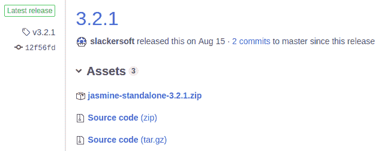
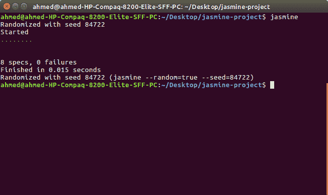
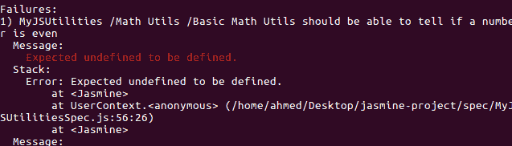
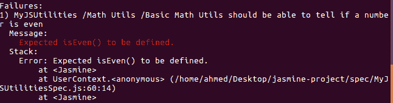
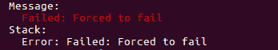
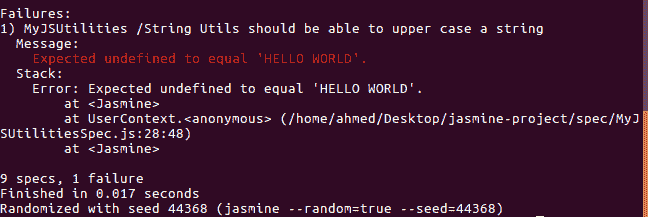
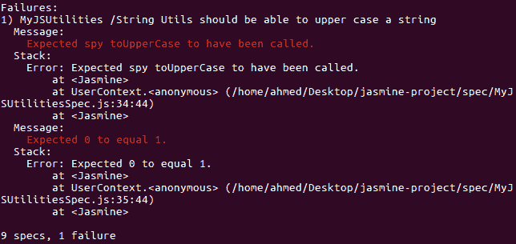

# Jasmine 单元测试简介

> 原文：<https://www.freecodecamp.org/news/jasmine-unit-testing-tutorial-4e757c2cbf42/>

Jasmine 是用于单元测试 web 应用程序的最流行的 JS 库。在这篇为初学者设计的教程中，我们将为您提供一个快速完整的 Jasmine 测试指南。

您将了解 Jasmine，这是一个流行的 JavaScript 行为驱动测试框架。我们还将看到一个关于如何用 Jasmine 编写单元测试的简单实例，它可以帮助您轻松地检查代码中的错误。

简而言之，我们将看到如何编写测试套件、规范和期望，以及如何应用内置的 Jasmine 匹配器或构建自己的定制匹配器

我们还将看到如何对套件进行分组，以便为更复杂的代码库组织测试。

### 介绍茉莉

[Jasmine](http://jasmine.github.io/) 是一个非常流行的 JavaScript 行为驱动开发(在 BDD 中，你在写实际代码之前先写测试)框架，用于单元测试 JavaScript 应用。它提供了可用于运行同步和异步代码的自动化测试的实用程序。

茉莉有很多特点，比如:

*   它速度快，开销低，没有外部依赖性。
*   这是一个包含电池的库，提供测试代码所需的一切。
*   它对节点和浏览器都可用。
*   它可以和其他语言一起使用，比如 Python 和 Ruby。
*   它不需要 DOM。
*   它提供了一个清晰易懂的语法和一个丰富而简单的 API。
*   我们可以用自然语言来描述测试和预期的结果。

Jasmine 是一个开源工具，在许可的 MIT 许可下可以获得。在撰写本文时，最新的主要版本是 Jasmine 3.0，它提供了新的特性和一些突破性的变化。Jasmine 的 *2.99* 版本将为在 *3.0* 版本中有不同行为的套件提供不同的反对警告，这将使开发者更容易迁移到新版本。

您可以从本[文档](https://github.com/jasmine/jasmine/blob/v3.0.0/release_notes/3.0.md)中了解新特性和突破性变化。

### 使用茉莉

您可以用许多不同的方式使用 Jasmine:

*   通过使用一个`<scri` pt >标签来包含 Jasmine 核心和您的测试文件，
*   作为使用 Node.js 的 CLI 工具，
*   作为 Node.js 中的库，
*   作为构建系统的一部分，如 Gulp.js 或 Grunt.js，通过 [grunt-contrib-jasmine](https://github.com/gruntjs/grunt-contrib-jasmine) 和 [gulp-jasmine-browser](https://github.com/jasmine/gulp-jasmine-browser)

您还可以使用 Jasmine 通过 [jasmine-py](https://github.com/jasmine/jasmine-py) 来测试您的 Python 代码，jasmine-py 可以使用`pip install jasmine`命令从 PyPI 安装。这个包包含一个为您的项目提供和执行 Jasmine 套件的 web 服务器，以及一个用于运行测试和持续集成的 CLI 脚本。

Jasmine 也可以通过 [jasmine-gem](https://github.com/jasmine/jasmine-gem) 用于 Ruby 项目，可以通过将`gem 'jasmine'`添加到你的 gem 文件并运行`bundle install`来安装。它包括一个用于服务和运行测试的服务器、一个 CLI 脚本以及 Ruby on Rails 项目的生成器。

现在让我们来关注如何将 Jasmine 与 JavaScript 一起使用:

### 使用独立的 Jasmine

首先从[发布](https://github.com/jasmine/jasmine/releases)页面下载 Jasmine 的最新版本。



然后只需提取 zip 文件，最好是在您想要测试的项目的一个文件夹中。

该文件夹将包含一组默认文件和文件夹:

`/src`:包含您要测试的源文件。如果您已经有了项目的文件夹设置，这可能会被删除，或者也可以在适当的时候用于托管您的源代码。

`/lib`:包含核心 Jasmine 文件。

包含您将要编写的测试。

`SpecRunner.html`:该文件被用作测试运行程序。您只需启动这个文件就可以运行您的规范。

这是默认`SpecRunner.html`文件的内容:

```
<!DOCTYPE html>
<html>
<head>
  <meta charset="utf-8">
  <title>Jasmine Spec Runner v3.2.1</title>

  <link rel="shortcut icon" type="image/png" href="lib/jasmine-3.2.1/jasmine_favicon.png">
  <link rel="stylesheet" href="lib/jasmine-3.2.1/jasmine.css">

  <script src="lib/jasmine-3.2.1/jasmine.js"></script>
  <script src="lib/jasmine-3.2.1/jasmine-html.js"></script>
  <script src="lib/jasmine-3.2.1/boot.js"></script>

  <!-- include source files here... -->
  <script src="src/Player.js"></script>
  <script src="src/Song.js"></script>

  <!-- include spec files here... -->
  <script src="spec/SpecHelper.js"></script>
  <script src="spec/PlayerSpec.js"></script>

</head>
<body>
</body>
</html>
```

请记住，您需要更改包含在`/src`和`/spec`文件夹中的文件，以包含您实际的源文件和测试文件。

### 将 Jasmine 用作图书馆

您还可以在项目中使用 Jasmine 作为库。例如，下面的代码导入并执行 Jasmine:

```
var Jasmine = require('jasmine');
var jasmine = new Jasmine();

jasmine.loadConfigFile('spec/support/jasmine.json');

jasmine.execute();
```

首先我们需要/导入 Jasmine，我们使用`loadConfigFile()`方法从`spec/support/jasmine.json`路径加载配置文件，然后最后我们执行 Jasmine。

### 通过 CLI 使用 Jasmine

您还可以从 CLI 使用 Jasmine，这允许您轻松地运行 Jasmine 测试，并在默认情况下在终端中输出结果。

我们将按照这种方法来运行本指南中的示例测试，所以首先运行以下命令来全局安装 Jasmine:

```
npm install -g jasmine
```

> 根据您的 [npm 配置](https://docs.npmjs.com/getting-started/fixing-npm-permissions)，您可能需要运行 **sudo** 来全局安装 npm 软件包。

现在，为您的项目创建一个文件夹，并在其中导航:

```
$ mkdir jasmine-project $ cd jasmine-project
```

接下来，运行以下命令为 Jasmine 初始化您的项目:

这个命令只是创建一个 spec 文件夹和一个 JSON 配置文件。这是`dir`命令的输出:

```
.
└── spec
    └── support
        └── jasmine.json

2 directories, 1 file
```

这是默认`jasmine.json`文件的内容:

```
{
  "spec_dir": "spec",
  "spec_files": [
    "**/*[sS]pec.js"
  ],
  "helpers": [
    "helpers/**/*.js"
  ],
  "stopSpecOnExpectationFailure": false,
  "random": true
}
```

*   `spec_dir`:指定 Jasmine 在哪里寻找测试文件。
*   `spec_files`:指定测试文件的模式，默认为所有以 **Spec** 或 **spec** 字符串结尾的 JS 文件。
*   `helpers`:指定 Jasmine 在哪里寻找帮助文件。帮助文件在规范之前执行，可以用来定义自定义匹配器。
*   `stopSpecOnExpectationFailure`:设置为 true 时，将在预期第一次失败时立即停止规范(可通过`--stop-on-failure`用作 CLI 选项)。
*   `random`:当设置为 true 时，Jasmine 将伪随机地运行测试用例(可以通过`--random`用作 CLI 选项)。

`spec_files`和`helpers`数组还可以包含用于指定文件路径的 [Glob](https://en.wikipedia.org/wiki/Glob_(programming)) 模式(多亏了 [node-glob](https://github.com/isaacs/node-glob) 包)，这些模式是您在 Bash 中工作时通常用来指定一组文件的模式(例如`ls *.js`)。

如果您不使用默认的`jasmine.json`配置文件位置，您只需通过`jasmine --config`选项指定自定义位置。

你可以从官方的[文档](https://jasmine.github.io/setup/nodejs.html)中找到更多的 CLI 选项。

### 了解茉莉

在这一部分，我们将了解 Jasmine 测试的基本要素，如套件、规格、期望、匹配器和间谍等。

在项目的文件夹中，运行以下命令来初始化新的节点模块:

这将创建一个带有默认信息的`package.json`文件:

```
{
  "name": "jasmine-project",
  "version": "1.0.0",
  "description": "",
  "main": "index.js",
  "scripts": {
    "test": "echo \"Error: no test specified\" && exit 1"
  },
  "keywords": [],
  "author": "",
  "license": "ISC"
}
```

接下来，创建一个`index.js`文件并添加以下代码:

```
function fibonacci(n){

    if (n === 1) {
        return [0, 1];
    }
    else {
        var s = fibonacci(n - 1);
        s.push(s[s.length - 1] + s[s.length - 2]);
        return s;
    }
}
function isPrime(num){
    for (let i = 2; i < num; i++)
        if (num % i === 0) return false;
    return num !== 1 && num !== 0;
}
function isEven(n) {
    return n % 2 == 0;
}
function isOdd(n) {
    return Math.abs(n % 2) == 1;
}

function toLowerCase(str){
    return str.toLowerCase();
}
function toUpperCase(str){
    return str.toUpperCase();
}
function contains(str, substring, fromIndex){
    return str.indexOf(substring, fromIndex) !== -1;
}
function repeat(str, n){
    return (new Array(n + 1)).join(str);
}

module.exports = {
    fibonacci: fibonacci,
    isPrime: isPrime,
    isEven: isEven,
    isOdd: isOdd,
    toLowerCase: toLowerCase,
    toUpperCase: toUpperCase,   
    contains: contains,
    repeat: repeat
};
```

### 套房

一个套件集合了一组规格或测试用例。它用于测试通常由对象/类或函数封装的 JavaScript 代码的特定行为。它是使用 Jasmine 全局函数`describe()`创建的，该函数有两个参数，一个是测试套件的标题，另一个是实现测试套件实际代码的函数。

让我们从创建我们的第一个测试套件开始。在`spec`文件夹中创建一个`MyJSUtilitiesSpec.js`文件，并添加:

```
describe("MyJSUtilities", function() { /* ... */ });
```

MyJSUtilities 是这个顶级测试套件的名称。

#### 如何分组和嵌套套件

为了更好地组织和准确描述我们的测试集，我们可以在顶层套件中嵌套套件。例如，让我们向 *MyJSUtilities* 套件添加两个套件:

```
describe("String Utils", function() { /*...*/});describe("Math Utils", function() { /*...*/});
```

在*数学工具*套件中，我们还可以添加两个嵌套套件:

```
describe("Basic Math Utils", function() {   /* ... */ }); describe("Advanced Math Utils", function() {   /* ... */ });
```

我们将相关测试分组为针对*字符串实用程序*、*基础数学实用程序*和*高级数学实用程序*的测试，并将它们嵌套在顶级测试套件 *MyJSUtilities* 中。这将把你的规范组成类似于文件夹结构的树。

嵌套结构将显示在报告中，这使您很容易找到失败的测试。

#### 如何排除套房

您可以使用`xdescribe()`功能暂时禁用套件。它与一个`describe()`函数具有相同的签名(参数),这意味着您可以通过简单地向函数添加一个`x`来快速禁用您现有的套件。

在报告中，`xdescribe()`函数中的规范将被标记为待定，不会被执行。

### 规范

规范声明了一个属于测试套件的测试用例。这是通过调用 Jasmine 全局函数`it()`来完成的，它有两个参数，规范的标题(描述了我们想要测试的逻辑)和一个实现实际测试用例的函数。

一个规范可能包含一个或多个期望。每个期望只是一个可以返回`true`或`false`的断言。对于要通过的规范，所有属于该规范的期望都必须是`true`，否则该规范将失败。

在我们的*字符串实用程序*套件中，添加这些规范:

```
describe("String Utils", function() {  it("should be able to lower case a string",function() {    /*...*/  });  it("should be able to upper case a string",function() {    /*...*/  });  it("should be able to confirm if a string contains a substring",function() {    /*...*/  });  it("should be able repeat a string multiple times",function() {    /*...*/  });});
```

在我们的*基本数学工具*套件中，让我们添加一些规格:

```
describe("Basic Math Utils", function() {  it("should be able to tell if a number is even",function() {    /*...*/  });     it("should be able to tell if a number is odd",function() {    /*...*/  });     });
```

对于*高级数学工具*，让我们添加规格:

```
describe("Advanced Math Utils", function() {  it("should be able to tell if a number is prime",function() {    /*...*/  });   it("should be able to calculate the fibonacci of a number",function() {    /*...*/  }); });
```

#### 如何排除规格

就像套件一样，您也可以使用`xit()`函数排除单个规范，该函数会临时禁用`it()`规范并将该规范标记为待定。

### 预期

使用`expect()`函数创建期望值，该函数采用一个名为**实际值**的值(可以是值、表达式、变量、函数或对象等)。).期望构成了规范，并与匹配器函数(通过链接)一起使用，以定义开发人员期望从特定的代码单元执行什么。

匹配器函数比较**实际**值(传递给与之链接的`expect()`函数)和**预期**值(直接作为参数传递给匹配器)，并返回**真**或**假**，其中**通过**或**未通过**规范。

你可以用多个匹配器链接`expect()`函数。要否定/反转任何匹配器的布尔结果，可以在调用匹配器之前使用`not`关键字。

让我们实现示例的规格。现在我们将使用`expect()`和`nothing()`匹配器，后者是内置匹配器的一部分，我们稍后会看到。这将通过所有规格，因为我们不期待在这一点上。

```
describe("MyJSUtilities", function() {describe(">String Utils", function() {  it("should be able to lower case a string",function() {    expect().nothing();  });  it("should be able to upper case a string",function() {    expect().nothing();  });  it("should be able to confirm if a string contains a substring",function() {    expect().nothing();  });  it("should be able repeat a string multiple times",function() {    expect().nothing();  });     });describe("Math Utils", function() { describe("Basic Math Utils", function() {  it("should be able to tell if a number is even",function() {    expect().nothing();  });     it("should be able to tell if a number is odd",function() {    expect().nothing();  });    }); describe("Advanced Math Utils", function() {  it("should be able to tell if a number is prime",function() {    expect().nothing();  });   it("should be able to calculate the fibonacci of a number",function() {    expect().nothing();  });     }); });});
```

这是此时的结果截图:



我们有八个通过规范，零个失败。

您可以使用内置的匹配器，也可以根据您的特定需求创建自己的自定义匹配器。

### 内置匹配器

Jasmine 提供了丰富的内置匹配器。让我们来看一些重要的例子:

*   `toBe()`对于身份测试，
*   `toBeNull()`用于测试`null`，
*   `toBeUndefined()/toBeDefined()`用于测试`undefined`/非`undefined`，
*   `toBeNaN()`用于测试 NaN(非数字)
*   为了测试相等性，
*   用于测试虚假/真实等。

您可以从[文档](https://jasmine.github.io/api/edge/matchers.html)中找到匹配器的完整列表。

现在，让我们在适当的时候用这些匹配器来实现我们的规范。首先在我们的`MyJSUtilitiesSpec.js`文件中导入我们正在测试的函数:

```
const utils = require("../index.js");
```

接下来，从*字符串实用程序*套件开始，用适当的期望值修改`expect().nothing()`。

例如，对于第一个规范，我们希望首先定义`toLowerCase()`方法，然后返回小写字符串，即:

```
it("should be able to lower case a string",function() {        expect(utils.toLowerCase).toBeDefined();        expect(utils.toLowerCase("HELLO WORLD")).toEqual("hello world");  });
```

这是该套件的完整代码:

```
describe(">String Utils", function() {  it("should be able to lower case a string",function() {    expect(utils.toLowerCase).toBeDefined();    expect(utils.toLowerCase("HELLO WORLD")).toEqual("hello world");  });  it("should be able to upper case a string",function() {    expect(utils.toUpperCase).toBeDefined();    expect(utils.toUpperCase("hello world")).toEqual("HELLO WORLD");  });  it("should be able to confirm if a string contains a substring",function() {    expect(utils.contains).toBeDefined();    expect(utils.contains("hello world","hello",0)).toBeTruthy();  });  it("should be able repeat a string multiple times",function() {    expect(utils.repeat).toBeDefined();    expect(utils.repeat("hello", 3)).toEqual("hellohellohello");  });     });
```

### 自定义匹配器

Jasmine 提供了编写[自定义匹配器](https://jasmine.github.io/tutorials/custom_matcher.html)的能力，用于实现内置匹配器没有涵盖的断言，或者只是为了使测试更具描述性和可读性。

例如，让我们看看下面的规格:

```
it("should be able to tell if a number is even",function() {    expect(utils.isEven).toBeDefined();    expect(utils.isEven(2)).toBeTruthy();    expect(utils.isEven(1)).toBeFalsy();  });
```

让我们假设没有实现`isEven()`方法。如果我们运行测试，我们将得到如下截图所示的消息:



我们得到的失败消息说*期望未定义的被定义*，这给了我们发生什么的线索。因此，让我们在代码域的上下文中让这条消息更有意义(这对复杂的代码库更有用)。对于这个问题，让我们创建一个自定义匹配器。

我们使用`addMatchers()`方法创建自定义匹配器，该方法接受一个由一个或多个属性组成的对象，这些属性将被添加为匹配器。每个属性应该提供一个带两个参数的工厂函数:`util`，它有一组供匹配器使用的实用函数(参见:`[matchersUtil.js](https://github.com/pivotal/jasmine/blob/master/src/core/matchers/matchersUtil.js)`)和`customEqualityTesters`，如果调用`util.equals`需要传入这些函数，并且应该返回一个带有`compare`函数的对象，该函数将被调用来检查期望值。

在使用`beforeEach()`方法执行每个规范之前，我们需要注册自定义匹配器:

```
describe("/Basic Math Utils", function () {beforeEach(function () {jasmine.addMatchers({hasEvenMethod:  function (util, customEqualityTesters) {return {compare:  function (actual, expected) {var  result  = { pass:  utils.isEven  !==  undefined };if (result.pass) {result.message  =  "Expected isEven() to be not defined."}else {result.message  =  "Expected isEven() to be defined."}return  result;}}}});});/*...*/});
```

然后我们可以使用自定义匹配器来代替`expect(utils.isEven).toBeDefined()`:

```
expect().hasEvenMethod();
```

这将给我们一个更好的失败消息:



### 使用 beforeEach()和 afterEach()

为了初始化和清理您的规范，Jasmine 提供了两个全局函数，`beforeEach()`和`afterEach()`:

*   `beforeEach`函数在调用它的套件中的每个规范之前被调用一次。
*   `afterEach`函数在调用它的套件中的每个规范之后被调用一次。

例如，如果您需要在测试套件中使用任何变量，您可以简单地在`describe()`函数的开头声明它们，并将任何初始化或实例化代码放在`beforeEach()`函数中。最后，您可以使用`afterEach()`函数在每个规范之后重置变量，这样您就可以进行纯粹的单元测试，而不需要为每个规范重复初始化和清理代码。

`beforeEach()`函数也与许多 Jasmine APIs 完美结合，比如用`addMatchers()`方法创建自定义匹配器，或者用`done()`函数在继续测试之前等待异步操作。

### 考试不及格

您可以使用 Jasmine 中可用的全局`fail()`方法强制测试失败。例如:

```
it("should explicitly fail", function () { fail('Forced to fail'); });
```

您应该会看到以下错误:



### 异常测试

当您对代码进行单元测试时，可能会抛出错误和异常，因此您可能需要针对这些场景进行测试。Jasmine 提供了`toThrow()`和`toThrowError()`匹配器，分别测试何时抛出异常或测试特定的异常。

例如，如果我们有一个抛出`TypeError`异常的函数:

```
function throwsError() { throw new TypeError("A type error"); }
```

您可以编写一个规范来测试是否抛出了异常:

```
it('it should throw an exception', function () { expect(throwsError).toThrow(); });
```

或者您也可以对特定的`TypeError`异常使用 test:

```
it('it should throw a TypeError', function () { expect(throwsError).toThrowError(TypeError); });
```

### 了解间谍

通常情况下，方法依赖于其他方法。这意味着当你测试一个方法的时候，你也可能最终测试它的依赖项。在测试中不推荐这样做，也就是说，你需要确保通过隔离方法来测试纯函数，并观察它在给定一组输入的情况下是如何表现的。

Jasmine 提供了 [spies](http://jasmine.github.io/2.0/introduction.html#section-Spies) ,可以用来监视/监听对象上的方法调用，并报告方法是否被调用以及调用的上下文和参数。

Jasmine 提供了两种监视方法调用的方式:使用`spyOn()`或`createSpy()`方法。

当方法已经存在于对象上时，可以使用`spyOn()`，否则需要使用返回新函数的`jasmine.createSpy()`。

默认情况下，spy 只会报告调用是否完成，而没有调用被 spy 的函数(即函数将停止执行)，但是您可以使用以下方法更改默认行为:

*   `and.callThrough()`:通过原函数调用，
*   `and.returnValue(value)`:返回指定值，
*   `and.callFake(fn)`:调用假函数代替原来的函数，
*   `and.throwError(err)`:抛出错误，
*   `and.stub()`:重置默认存根行为。

您可以使用 spy 来收集被监视函数的运行时统计数据，例如，如果您想知道您的函数被调用了多少次。

假设我们想确保我们的`toUpperCase()`方法正在利用内置的`String.toUpperCase()`方法，我们需要简单地监视`String.toUpperCase()`,使用:

```
it("should be able to upper case a string", function () { 
```

```
var spytoUpperCase = spyOn(String.prototype, 'toUpperCase') 
```

```
expect(utils.toUpperCase).toBeDefined(); expect(utils.toUpperCase("hello world")).toEqual("HELLO WORLD"); expect(String.prototype.toUpperCase).toHaveBeenCalled(); expect(spytoUpperCase.calls.count()).toEqual(1); });
```



测试因第二个预期而失败，因为`utils.toUpperCase("hello world")`返回未定义，而不是预期的 *HELLO WORLD。*那是因为，正如我们之前提到的，在`toUpperCase()`上创造了间谍之后，这个方法并没有被执行。我们需要通过调用`callThrough()`来改变这种默认行为:

> *请注意，默认情况下,`spy`函数用一个存根替换被窥探的函数。如果你需要调用原来的函数，你可以添加`.and.callThrough()`到你的`spy`对象中。*

```
var spytoUpperCase = spyOn(String.prototype, 'toUpperCase').and.callThrough();
```

现在所有的期望都过去了。

你也可以使用`and.callFake()`或`and.returnValue()`来伪造被窥探的函数，或者如果你不想调用实际的函数，只伪造返回值:

```
var spytoUpperCase = spyOn(String.prototype, 'toUpperCase').and.returnValue("HELLO WORLD"); 
```

```
var spytoUpperCase = spyOn(String.prototype, 'toUpperCase').and.callFake(function(){ return "HELLO WORLD"; });
```

现在，如果我们最终没有在我们自己的`utils.toUpperCase()`实现中使用内置的`String.toUpperCase()`，我们将会得到这些失败:



两个期望`expect(String.prototype.toUpperCase).toHaveBeenCalled()` `expect(spytoUpperCase.calls.count()).toEqual(1)`都落空了。

### 如何处理 Jasmine 中的异步

如果您正在测试的代码包含异步操作，您需要一种方法让 Jasmine 知道异步操作何时完成。

默认情况下，Jasmine 会等待任何由回调、promise 或`async`关键字定义的异步操作完成。如果 Jasmine 在这些函数之一中找到了 callback、promise 或 async 关键字:`beforeEach`、`afterEach`、`beforeAll`、`afterAll`和`it`，它将在继续下一个操作之前等待异步完成。

### 使用`done()`与`beforeEach()` / `it()`..

让我们以使用`setTimeout()`模拟异步操作的例子`simulateAsyncOp()`为例。在现实世界中，这可能是一个 Ajax 请求或任何类似的异步发生的事情:

```
function simulateAsyncOp(callback){ 
```

```
setTimeout(function () { callback(); }, 2000); }
```

为了测试这个函数，我们可以使用带有特殊`done()`回调的`beforeEach()`函数。我们的代码需要调用`done()`来告诉 Jasmine 异步操作已经完成:

```
describe("/Async Op", function () {var  asyncOpCompleted  =  false;beforeEach(function (done) {utils.simulateAsyncOp(function(){  asyncOpCompleted  =  true;  done();});});it("should be able to tell if the async call has completed", function () {  expect(asyncOpCompleted).toEqual(true);});});
```

我们可以很快注意到这个方法的缺点，所以我们需要编写代码来接受`done()`回调。在我们的例子中，我们没有在我们的`simulateAsyncOp(fn)`中硬编码`done()`方法，但是我们提供了一个回调参数以便能够调用`done()`。

### 利用承诺

如果您不想创建依赖于您如何编写测试的代码，您可以使用一个承诺来代替，并在承诺解决后调用`done()`回调。或者更好的是，在 Jasmine 2.7+中，如果你的代码返回一个`Promise`，Jasmine 会等到它被解析或拒绝后再执行下一个代码。

### 使用异步/等待

Jasmine 2.7+支持 specs 中的`async`和`await`调用。这使您不必将断言放在`.then()`或`.catch()`块中。

```
it("should work with async/await", async () => { let completed = false; completed = await utils.simulateAsyncOp(); expect(completed).toEqual(true); });
```

这是`simulateAsyncOp`的实现:

```
function simulateAsyncOp() { 
```

```
return new Promise(resolve => { setTimeout(() => { resolve(true); }, 1000); }); }
```

### 使用茉莉花钟

Jasmine 时钟用于测试依赖于时间函数的异步代码，比如`setTimeout()`，就像我们用定制方法模拟基于时间的 API 来测试同步代码一样。这样，您可以通过控制或手动提前时钟来同步执行测试的功能。

您可以通过调用您的规范或套件中的`jasmine.clock().install`函数来安装 Jasmine 时钟。

使用完时钟后，需要卸载它才能恢复原来的功能。

有了 Jasmine clock，你可以控制 JavaScript 的`setTimeout`或`setInterval`函数，通过使用`jasmine.clock().tick`函数来计时，这需要你移动的毫秒数。

你也可以用茉莉花钟来模拟当前的日期。

```
beforeEach(function () {jasmine.clock().install();});afterEach(function() {jasmine.clock().uninstall();});it("should call the asynchronous operation synchronously", function() {var  completed  =  false;utils.simulateAsyncOp(function(){completed  =  true;});expect(completed).toEqual(false);jasmine.clock().tick(1001);expect(completed).toEqual(true);});
```

这是`simulateAsyncOp`功能:

```
function simulateAsyncOp(callback){ 
```

```
setTimeout(function () { callback(); }, 1000); }
```

> *如果您没有为`mockDate`功能指定时间，它将使用当前日期。*

### 处理错误

如果您的异步代码由于某种错误而失败，您希望您的规范正确地失败。从 Jasmine 2.6+开始，任何未处理的错误都会被发送到当前执行的规范中。

Jasmine 还提供了一种方法，如果您需要明确地使您的规格不合格，您可以使用这种方法:

*   通过调用`done.fail(err)`方法对`beforeEach()`使用`done()`回调，
*   简单地将一个错误传递给`done(err)`回调函数(Jasmine 3+)，
*   调用一个`Promise`的`reject()`方法。

### 结论

在本指南中，我们介绍了 Jasmine，并了解了如何开始使用 Jasmine 对您的 JavaScript 代码进行单元测试。感谢阅读！

这篇[文章](https://www.techiediaries.com/jasmine-testing-tutorial/)最初发表在[技术刊物](https://www.techiediaries.com/)上。