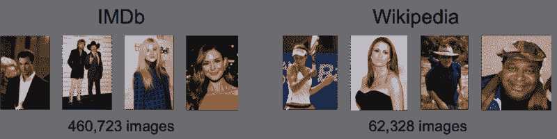
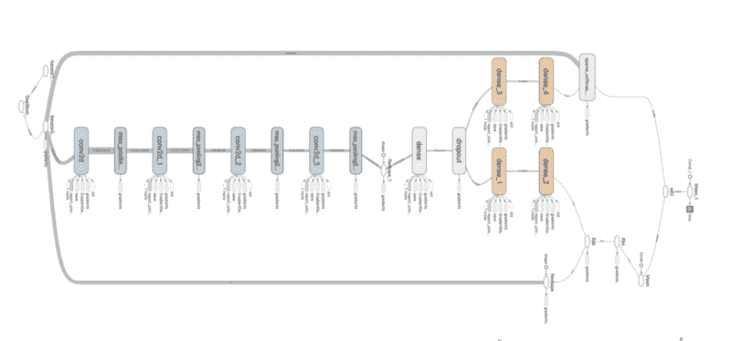
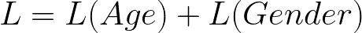

# 如何在 TensorFlow 中用深度学习构建年龄性别多任务预测器

> 原文：<https://www.freecodecamp.org/news/how-to-build-an-age-and-gender-multi-task-predictor-with-deep-learning-in-tensorflow-20c28a1bd447/>

科尔·默里

在我的上一个教程中，你学习了如何结合卷积神经网络和长短期记忆(LTSM)来创建给定图像的字幕。在本教程中，您将学习如何构建和训练多任务机器学习模型，以预测图像中主体的年龄和性别。

### **概述**

*   年龄和性别模型简介
*   构建多任务张量流估计器
*   培养

### 先决条件

*   卷积神经网络(CNN)的基本理解
*   对张量流的基本理解
*   GPU(可选)

### 年龄和性别模型简介

2015 年，来自 D-ITET 计算机视觉实验室的研究人员发表了一篇论文 [DEX](https://www.cv-foundation.org/openaccess/content_iccv_2015_workshops/w11/papers/Rothe_DEX_Deep_EXpectation_ICCV_2015_paper.pdf) ，并公开了他们的 [IMDB-WIKI](https://data.vision.ee.ethz.ch/cvl/rrothe/imdb-wiki/) ，由 500K+张带有年龄和性别标签的人脸图像组成。



IMDB-WIKI Dataset source: [https://data.vision.ee.ethz.ch/cvl/rrothe/imdb-wiki/](https://data.vision.ee.ethz.ch/cvl/rrothe/imdb-wiki/)

DEX 概述了一个神经网络架构，涉及一个预训练的 imagenet vgg16 模型，该模型估计面部图像中的表观年龄。DEX 在 2015 年 ChaLearn LAP 中获得第一名，这是一项关于识别图像中的人的比赛，超过了人类参考。

#### **年龄作为一个分类问题**

处理以图像作为输入的年龄估计问题的传统方法是使用基于回归的模型，以均方误差作为损失函数。DEX 将这个问题建模为一个分类任务，使用 softmax 分类器，每个年龄表示为一个从 1 到 101 的唯一类别，交叉熵作为损失函数。

#### **多任务学习**

多任务学习是一种通过共享架构进行多任务训练的技术。网络开始处的层将学习联合的通用表示，防止过度适应可能包含噪声的特定任务。

通过用多任务网络训练，网络可以在两个任务上并行训练。这将基础设施的复杂性降低到只有一个培训管道。此外，由于同时训练两个任务，训练所需的计算量减少。



Multi-task CNN source: https://murraycole.com

### 在 TensorFlow 中构建多任务网络

下面，您将使用 TensorFlow 的估算器抽象来创建模型。该模型将根据原始图像输入进行训练，以预测人脸图像的年龄和性别。

#### **项目结构**

```
.├── Dockerfile├── age_gender_estimation_tutorial│   ├── cnn_estimator.py│   ├── cnn_model.py│   └── dataset.py├── bin│   ├── download-imdb.sh│   ├── predict.py│   ├── preprocess_imdb.py│   └── train.py├── requirements.txt
```

#### **环境**

对于环境，您将使用 [Docker](https://www.docker.com/) 来安装依赖项。为了方便起见，还提供了 GPU 版本。

```
docker build -t colemurray/age-gender-estimation-tutorial -f Dockerfile .
```

#### 数据

为了训练这个模型，您将使用 IMDB-WIKI 数据集，它由 500，000+个图像组成。为简单起见，您将下载预先裁剪的 imdb 图像(7GB)。运行下面的脚本来下载数据。

```
chmod +x bin/download-imdb-crop.sh
```

```
./bin/download-imdb-crop.sh
```

**预处理**

现在，您将处理数据集以清除低质量的图像，并将输入裁剪为固定的图像大小。此外，您将数据格式化为 CSV 格式，以简化 TensorFlow 的读取。

```
docker run -v $PWD:/opt/app \-e PYTHONPATH=$PYTHONPATH:/opt/app \-it colemurray/age-gender-estimation-tutorial \python3 /opt/app/bin/preprocess_imdb.py \--db-path /opt/app/data/imdb_crop/imdb.mat \--photo-dir /opt/app/data/imdb_crop \--output-dir /opt/app/var \--min-score 1.0 \--img-size 224
```

大约 20 分钟后，您将拥有一个经过处理的数据集。

接下来，您将使用 TensorFlow 的数据管道模块 [`tf.data`](https://www.tensorflow.org/api_docs/python/tf/data) 向估计器提供数据。`Tf.data`是并行读取和操作数据集的抽象，利用 C++线程提高性能。

在这里，您将利用 TensorFlow 的 CSV 阅读器来解析数据、预处理图像、创建批处理和洗牌。

#### 模型

下面，您将创建一个基本的 CNN 模型。该模型由三个卷积和两个完全连接的层组成，每个任务有一个 softmax 分类器头。

#### 联合损失函数

对于训练操作，您将使用 Adam 优化器。对于损失函数，您将平均每个头部的交叉熵误差，在头部之间创建一个共享损失函数。



age and gender joint loss function

#### 张量流估计量

张量流估计器为图形创建和运行时处理提供了一个简单的抽象。TensorFlow 已经指定了一个接口`model_fn`，可以用来创建定制的估算器。

下面，您将利用上面创建的网络，创建训练、评估和预测。TensorFlow 的估计器类将使用这些规范来改变图形的行为。

### 火车

既然您已经预处理了数据并创建了模型架构和数据管道，那么您将开始训练模型。

```
docker run -v $PWD:/opt/app \-e PYTHONPATH=$PYTHONPATH:/opt/app \-it colemurray/age-gender-estimation-tutorial:gpu \python3 /opt/app/bin/train.py \--img-dir /opt/app/var/crop \--train-csv /opt/app/var/train.csv \--val-csv /opt/app/var/val.csv \--model-dir /opt/app/var/cnn-model \--img-size 224 \--num-steps 200000
```

### 预测

下面，您将加载您的年龄和性别张量流模型。该模型将从磁盘加载，并在提供的图像上进行预测。

```
# Update the model path below with your modeldocker run -v $PWD:/opt/app \-e PYTHONPATH=$PYTHONPATH:/opt/app \-it colemurray/age-gender-estimation-tutorial \python3 /opt/app/bin/predict.py \--image-path /opt/app/var/crop/25/nm0000325_rm2755562752_1956-1-7_2002.jpg \--model-dir /opt/app/var/cnn-model-3/serving/<TIMESTAMP>
```


Predicted: M/46 Actual: M/46

### 结论

在本教程中，您学习了如何构建和训练一个多任务网络来预测对象的年龄和形象。通过使用共享架构，可以同时训练和预测两个目标。

后续步骤:

*   在您自己的数据集上评估
*   尝试不同的网络架构
*   使用不同的超参数进行实验

疑问/问题？在 GitHub 上打开一个问题

此处完成代码[。](https://github.com/ColeMurray/age-gender-estimation-tutorial)

### 行动呼吁

如果你喜欢这个教程，请关注并推荐！

有兴趣了解更多关于深度学习/机器学习的知识吗？查看我的其他教程:

[-在 Tensorflow 中构建深度学习的图像字幕生成器](https://medium.freecodecamp.org/building-an-image-caption-generator-with-deep-learning-in-tensorflow-a142722e9b1f)

[-在 Tensorflow 中用深度学习构建面部识别管道](https://hackernoon.com/building-a-facial-recognition-pipeline-with-deep-learning-in-tensorflow-66e7645015b8)

[-深度学习 CNN 的 Tensorflow 与 GPU](https://medium.com/p/cba6efe0acc2)

[-在谷歌计算引擎上使用 Keras 进行深度学习](https://medium.com/google-cloud/keras-inception-v3-on-google-compute-engine-a54918b0058)

[-在谷歌计算引擎上使用 Apache Spark 的推荐系统](https://medium.com/google-cloud/recommendation-systems-with-spark-on-google-dataproc-bbb276c0dafd)

你可以在其他地方找到我:

[**【科尔穆雷(@ _ 科尔穆雷)|推特**](https://twitter.com/@_colemurray)
[*科尔穆雷的最新推文(@ _ 科尔穆雷)。兴趣:机器学习、大数据、Android、React/flux…*twitter.com](https://twitter.com/@_colemurray)