# 如何将你的 Xcode 插件转换成 Xcode 扩展

> 原文：<https://www.freecodecamp.org/news/how-to-convert-your-xcode-plugins-to-xcode-extensions-ac90f32ae0e3/>

作者 Khoa Pham

# 如何将你的 Xcode 插件转换成 Xcode 扩展


Source: [Imgur](https://imgur.com/gallery/QnzcZ)

Xcode 是 iOS 和 macOS 开发者不可或缺的 IDE。从早期开始，构建和安装定制插件的能力极大地提高了我们的生产力。没过多久，苹果出于隐私考虑推出了 Xcode 扩展。

我已经构建了一些 Xcode 插件和扩展，如 [XcodeWay](https://github.com/onmyway133/XcodeWay) 、 [XcodeColorSense](https://github.com/onmyway133/XcodeColorSense) 、 [XcodeColorSense2](https://github.com/onmyway133/XcodeColorSense2) 和 [Xmas](https://github.com/onmyway133/Xmas) 。这是一次有益的经历。我学到了很多，收获的生产力也很可观。在这篇文章中，我演示了如何将我的 Xcode 插件转换成扩展，以及我在转换过程中的经历。

### 我的第一个 Xcode 插件:XcodeWay

> 我选择一个懒惰的人去做艰苦的工作。因为一个懒惰的人会找到一个简单的方法去做

我很喜欢比尔·盖茨的上述[语录。我尽量避免重复和无聊的任务。每当我发现自己又在做同样的任务时，我就会编写脚本和工具来实现自动化。这样做需要一些时间，但在不久的将来，我会变得更懒。](https://www.goodreads.com/quotes/568877-i-choose-a-lazy-person-to-do-a-hard-job)

除了对构建开源框架和工具感兴趣之外，我还喜欢扩展我正在使用的 IDE——主要是 Xcode。

2014 年第一次开始 iOS 开发。我想要一种快速的方法，通过当前项目的上下文直接从 Xcode 导航到许多地方。有很多次我们想:

*   在“Finder”中打开当前项目文件夹以更改一些文件
*   打开终端运行一些命令
*   在 GitHub 中打开当前文件，快速将链接给同事
*   或者打开其他文件夹，如主题、插件、代码片段、设备日志。

我们每天节省的每一点时间都很重要。

我认为写一个 Xcode 插件是一个很酷的想法，我们可以在 Xcode 里面做上面所有的事情。我没有等待其他人来做，而是卷起袖子写了我的第一个 Xcode 插件——[Xcode way](https://github.com/onmyway133/XcodeWay)——并作为开源共享。

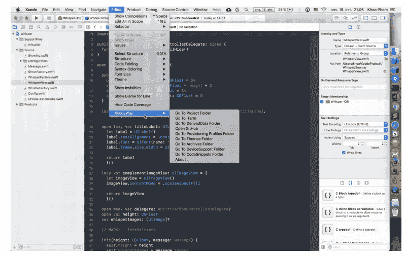

XcodeWay works by creating a menu under `Editor` with lots of options to navigate to other places right from Xcode. It looks simple but there was some hard work required.

### 什么是 Xcode 插件？

Xcode 插件不是 Xcode 官方支持的，也不是 Apple 推荐的。没有关于他们的文件。我们可以通过现有插件的源代码和一些教程来了解它们。

Xcode 插件只是一个类型为`xcplugin`的包，放在`~/Library/Application Support/Developer/Shared/Xcode/Plug-ins`处。Xcode 启动时，会载入此文件夹中的所有 Xcode 插件。插件和 Xcode 运行在同一个进程中，所以可以像 Xcode 一样做任何事情。任何插件中的错误都可能导致 Xcode 崩溃。

要制作一个 Xcode 插件，创建一个包含一个从`NSObject`扩展而来的类的`macOS Bundle`，并有一个接受`NSBundle`的初始化器，例如在 [Xmas](https://github.com/onmyway133/Xmas/blob/master/Xmas/Xmas.swift) 中:

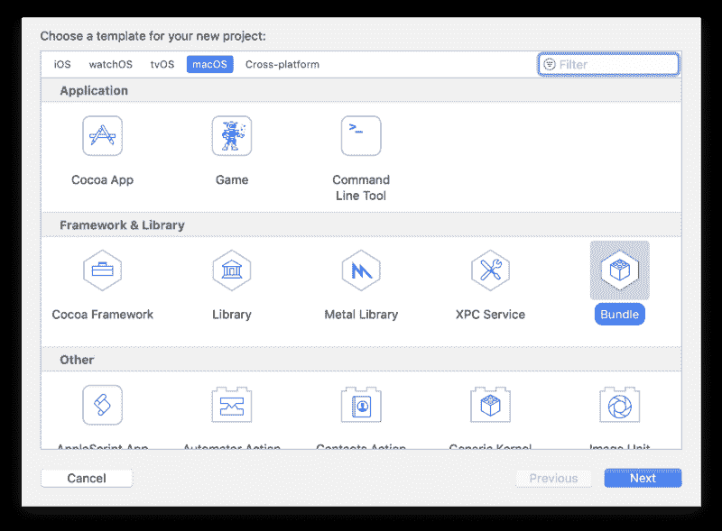

```
class Xmas: NSObject {
```

```
 var bundle: NSBundle
```

```
 init(bundle: NSBundle) {    self.bundle = bundle    super.init()  }}
```

在`Info.plist`中，我们需要:

*   将这个类声明为插件的主入口类，并且
*   这个包没有 UI，因为我们在运行时创建 UI 控件并添加到 Xcode 接口

```
<key>NSPrincipalClass</key><string>Xmas</string><key>XCPluginHasUI</key><false/>
```

Xcode 插件的另一个问题是我们必须不断更新`DVTPluginCompatibilityUUIDs`。每次 Xcode 的新版本出来，这种情况都会改变。如果没有更新，Xcode 将拒绝加载插件。

### Xcode 插件能做什么

许多开发人员构建 Xcode 插件，因为他们缺少其他 ide 中的特定功能，如 Sublime Text、AppCode 或 Atom。

由于 Xcode 插件是在与 Xcode 相同的进程中加载的，它们可以做 Xcode 能做的一切。唯一的限制是我们的想象力。我们可以利用 Objective C Runtime 来发现私有框架和函数。然后，LLDB 和符号断点可以进一步用于检查正在运行的代码并改变它们的行为。我们还可以使用 swizzling 来改变任何正在运行的代码的实现。编写 Xcode 插件很难——需要很多猜测，有时需要很好的汇编知识。

在插件的黄金时代，有一个流行的插件管理器，它本身就是一个插件，叫做[阿卡特兹](https://github.com/alcatraz/Alcatraz)。它可以安装其他插件，这些插件基本上只是下载`xcplugin`文件并将其移动到`Plug Ins`文件夹。


为了了解插件能做什么，我们来看看一些流行的插件。

#### Xvim

列表中的第一个是 [Xvim](https://github.com/XVimProject/XVim) ，它在 Xcode 中添加了 vim 键绑定。它几乎支持我们以前在终端中使用的所有按键绑定。

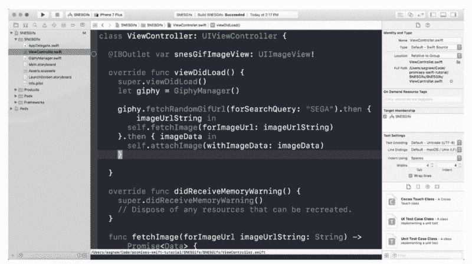

#### SCXcodeMiniMap

如果你在 Sublime 文本中错过了 MiniMap 模式，你可以使用 [SCXcodeMiniMap](https://github.com/stefanceriu/SCXcodeMiniMap) 在 Xcode 编辑器中添加一个右边的地图面板。

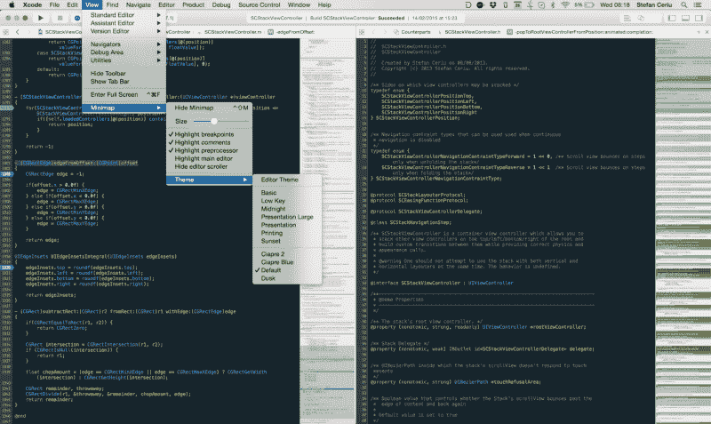

#### 模糊自动完成插件

在版本 9 之前，Xcode 没有适当的自动完成功能，它只是基于前缀。这就是模糊自动完成插件的闪光点。它根据 Xcode 中隐藏的`IDEOpenQuicklyPattern`特性执行模糊自动补全。

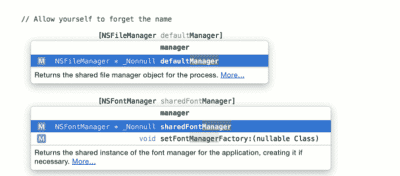

#### KSImageNamed-Xcode

为了在`UIImageView`中显示一个包图像，我们经常使用`imageNamed`方法。但是准确记住图像文件的名称是困难的。 [KSImageNamed-Xcode](https://github.com/ksuther/KSImageNamed-Xcode) 来帮忙了。当您开始键入时，您将获得一个自动建议的图像名称列表。

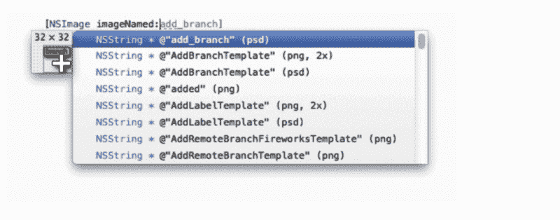

#### Xcode 的颜色感知

开发过程中的另一个难题是使用`UIColor`，它使用了 RGBA 色彩空间。我们没有得到我们指定的颜色的视觉指示器，并且手动执行检查可能很耗时。幸运的是有 [ColorSense-for-Xcode](https://github.com/omz/ColorSense-for-Xcode) 显示正在使用的颜色和颜色选择器面板来轻松选择正确的颜色。

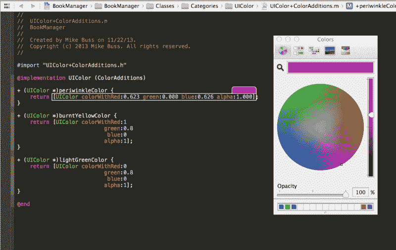

#### 链接控制台

在 AppCode 中，我们可以跳转到控制台中记录的文件中的特定行。如果你在 Xcode 中错过了这个功能，可以使用 [LinkedConsole](https://github.com/krzysztofzablocki/LinkedConsole) 。这将启用 Xcode 控制台中的可点击链接，这样我们就可以立即跳转到该文件。


### Xcode 插件背后的辛勤工作

制作一个 Xcode 插件并不容易。我们不仅需要了解 macOS 编程，还需要深入研究 Xcode 视图层次结构。为了注入我们想要的特性，我们需要探索私有框架和 API。

关于如何制作插件的教程很少，但是幸运的是，大多数插件都是开源的，所以我们可以理解它们是如何工作的。既然我做了几个插件，我可以给出一些关于它们的技术细节。

Xcode 插件通常用两个私有框架来完成:`DVTKit`和`IDEKit`。系统框架在`/System/Library/PrivateFrameworks`，但是 Xcode 专用的框架在`/Applications/Xcode.app/Contents/`下面，在那里你可以找到`Frameworks`、`OtherFrameworks`和`SharedFrameworks`。

有一个工具 [class-dump](https://github.com/nygard/class-dump) 可以从 Xcode app bundle 生成头。有了类名和方法，您可以调用`NSClassFromString`从名称中获取类。

#### 在 Xmas 中重组 DVTBezelAlertPanel 框架

圣诞节一直给我一种特别的感觉，所以我决定制作 [Xmas](https://github.com/onmyway133/Xmas) ，它显示的是随机的圣诞节图片，而不是默认的警报视图。用于呈现该视图的类是 DVTKit 框架内的 [DVTBezelAlertPanel](https://github.com/luisobo/Xcode-RuntimeHeaders/blob/master/DVTKit/DVTBezelAlertPanel.h) 。[我关于构建这个插件的文章在这里。](https://medium.com/fantageek/xmas-9522c2c88db3)

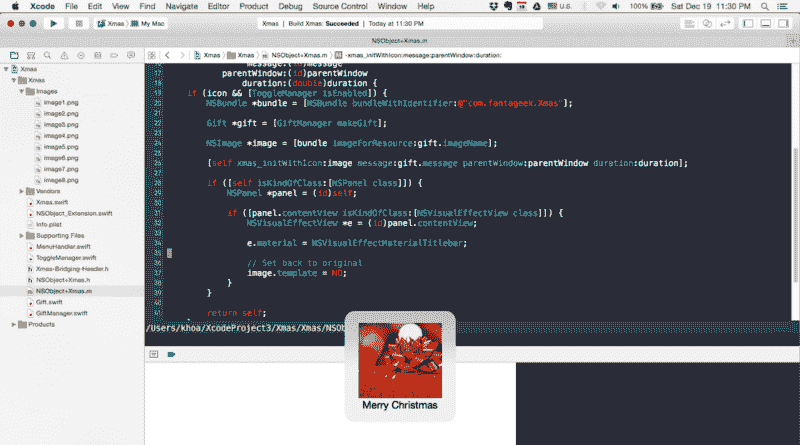

在 Objective C Runtime 中，有一种技术叫做 swizzling，它可以改变和切换任何正在运行的类和方法的实现和方法签名。

这里，为了改变警报视图的内容，我们需要用我们自己的方法交换[初始化器](https://github.com/onmyway133/Xmas/blob/master/Xmas/Xmas.swift) `initWithIcon:message:parentWindow:duration:`。我们在早期通过监听`NSApplicationDidFinishLaunchingNotification`来做到这一点，当一个 macOS 插件(在这里是 Xcode)启动时，它会得到通知。

```
class func swizzleMethods() {    guard let originalClass = NSClassFromString("DVTBezelAlertPanel") as? NSObject.Type else {        return    }
```

```
do {        try originalClass.jr_swizzleMethod("initWithIcon:message:parentWindow:duration:",            withMethod: "xmas_initWithIcon:message:parentWindow:duration:")    }    catch {        Swift.print("Swizzling failed")    }}
```

我最初喜欢用 Swift 做任何事情。但是在 Swift 中使用 s [wizzle init 方法很棘手，所以最快的方法是在](https://stackoverflow.com/questions/34317766/how-to-swizzle-init-in-swift)[object C](https://github.com/onmyway133/xmas/blob/master/Xmas/NSObject%2BXmas.m)中使用。然后我们简单地遍历视图层次结构，找到`NSPanel`中的`NSVisualEffectView`来更新图像。

#### 在 XcodeColorSense 中与 DVTSourceTextView 交互

我主要使用十六进制颜色，我想要一种快速的方法来查看颜色。所以我构建了 XcodeColorSense——它支持十六进制颜色、RGBA 和命名颜色。

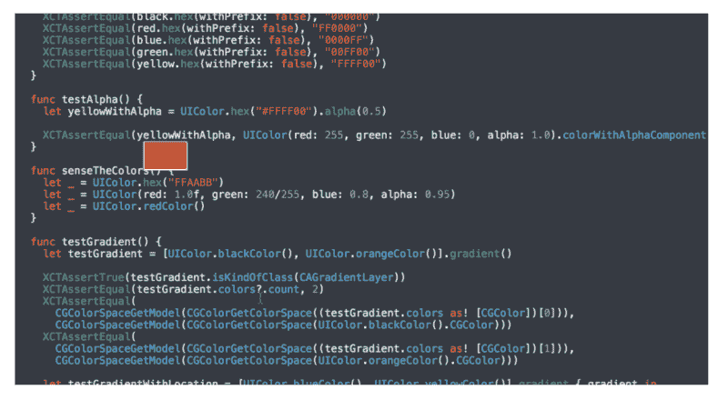

这个想法很简单。解析该字符串，查看用户是否正在键入与`UIColor`相关的内容，并显示一个以该颜色为背景的小覆盖视图。Xcode 使用的文本视图属于`DVTKit`框架中的`DVTSourceTextView`类型。我们还需要监听任何`NSTextView`内容被[改变](https://github.com/onmyway133/XcodeColorSense/blob/master/XcodeColorSense/XcodeColorSense.swift)时触发的`NSTextViewDidChangeSelectionNotification`。

```
func listenNotification() {  NSNotificationCenter.defaultCenter().addObserver(self, selector: #selector(handleSelectionChange(_:)), name: NSTextViewDidChangeSelectionNotification, object: nil)}
```

```
func handleSelectionChange(note: NSNotification) {  guard let DVTSourceTextView = NSClassFromString("DVTSourceTextView") as? NSObject.Type,    object = note.object where object.isKindOfClass(DVTSourceTextView.self),    let textView = object as? NSTextView  else { return }
```

```
self.textView = textView}
```

我有一个匹配器架构，所以我们可以检测不同种类的`UIColor`结构——例如`[HexMatcher](https://github.com/onmyway133/XcodeColorSense/blob/master/XcodeColorSense/Matcher/HexMatcher.swift)`。

```
public struct HexMatcher: Matcher {
```

```
func check(line: String, selectedText: String) -> (color: NSColor, range: NSRange)? {    let pattern1 = "\"#?[A-Fa-f0-9]{6}\""    let pattern2 = "0x[A-Fa-f0-9]{6}"
```

```
let ranges = [pattern1, pattern2].flatMap {      return Regex.check(line, pattern: $0)    }
```

```
guard let range = ranges.first      else { return nil }
```

```
let text = (line as NSString).substringWithRange(range).replace("0x", with: "").replace("\"", with: "")    let color = NSColor.hex(text)
```

```
return (color: color, range: range)  }}
```

为了渲染覆盖图，我们使用`NSColorWell`,这有利于显示带有背景的视图。通过调用`firstRectForCharacterRange`和用`convertRectFromScreen`和`convertRect`进行一些点转换来确定位置。

#### 在 XcodeWay 中使用 NSTask 和 IDEWorkspaceWindowController

最后是我心爱的 [XcodeWay](https://github.com/onmyway133/XcodeWay/tree/1.0) 。

我发现自己需要带着当前项目的上下文从 Xcode 转到不同的地方。所以我构建了 XcodeWay 插件，在`Window`下添加了许多方便的菜单选项。

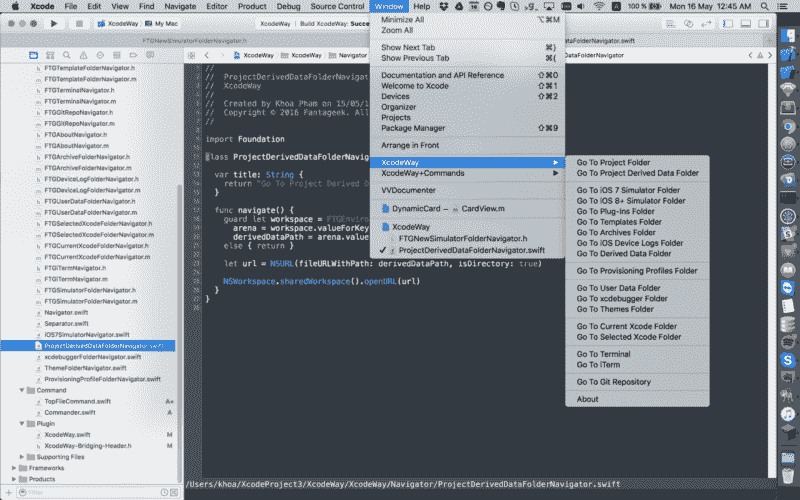

由于插件运行在同一个 Xcode 进程中，它可以访问主菜单`NSApp.mainMenu?.itemWithTitle(“Window”)`。在那里我们可以改变菜单。XcodeWay 旨在通过其[导航器](https://github.com/onmyway133/XcodeWay/blob/1.0/XcodeWay/Navigator/Navigator.swift)协议轻松扩展功能。

```
@objc protocol Navigator: NSObjectProtocol {  func navigate()  var title: String { get }}
```

对于带有静态路径的文件夹，比如配置文件`~/Library/MobileDevice/Provisioning Profiles`或用户数据`Developer/Xcode/UserData`，我们可以构造`URL`并调用`NSWorkspace.sharedWorkspace().openURL`。对于根据当前项目而变化的动态文件夹，需要做更多的工作。

我们如何在 Finder 中打开当前项目的文件夹？当前项目路径的信息保存在`IDEWorkspaceWindowController`中。这是一个在 Xcode 中管理工作空间窗口的类。看一下[环境管理器](https://github.com/onmyway133/XcodeWay/blob/1.0/XcodeWay/Helper/FTGEnvironmentManager.m)，在这里我们使用 [objc_getClass](https://developer.apple.com/documentation/objectivec/1418952-objc_getclass?language=objc) 从字符串中获取类定义。

```
self.IDEWorkspaceWindowControllerClass = objc_getClass("IDEWorkspaceWindowController");
```

```
NSArray *workspaceWindowControllers = [self.IDEWorkspaceWindowControllerClass valueForKey:@"workspaceWindowControllers"];
```

```
id workSpace = nil;
```

```
for (id controller in workspaceWindowControllers) {  if ([[controller valueForKey:@"window"] isEqual:[NSApp keyWindow]]) {    workSpace = [controller valueForKey:@"_workspace"];  }}
```

```
NSString * path = [[workSpace valueForKey:@"representingFilePath"] valueForKey:@"_pathString"];
```

最后，我们可以利用`valueForKey`来获得我们认为存在的任何财产的价值。这样，我们不仅得到了[项目路径](https://github.com/onmyway133/XcodeWay/blob/1.0/XcodeWay/Navigator/FTGProjectFolderNavigator.m)，还得到打开文件的路径。因此，我们可以调用`NSWorkspace`上的`activateFileViewerSelectingURLs`来打开 Finder 并选中该文件。这很方便，因为用户不需要在 Finder 中查找该文件。

很多时候，我们希望在当前项目文件夹中执行一些终端命令。为了实现这一点，我们可以使用带有发射台`/usr/bin/open`和参数`[@”-a”, @”Terminal”, projectFolderPath]`的`NSTask`。iTerm，如果配置的话，可能会在一个新的标签页中打开它。

iOS 7 应用程序的文档放在应用程序支持内部的固定位置`iPhone Simulator`。但是，从 iOS 8 开始，每个应用都有一个独特的 UUID，它们的[文件夹](https://github.com/onmyway133/XcodeWay/blob/1.0/XcodeWay/Navigator/FTGSimulatorFolderNavigator.m)很难预测。

```
~/Library/Developer/CoreSimulator/Devices/1A2FF360-B0A6-8127-95F3-68A6AB0BCC78/data/Container/Data/Application/
```

我们可以构建一个映射并执行跟踪来查找为当前项目生成的 ID，或者检查每个文件夹中的 plist 来比较包标识符。

我想到的快速解决方案是搜索最近更新的文件夹。每次我们构建项目，或在应用程序中进行更改，他们的文档文件夹都会更新。这就是我们可以利用`NSFileModificationDate`找到当前项目的文件夹的地方。

使用 Xcode 插件时会遇到很多麻烦，但结果是值得的。我们每天节省的每几分钟最终会节省大量的时间。

### 安全和自由

权力越大，责任越大。插件可以为所欲为的事实敲响了安全警钟。2015 年末，出现了一次恶意软件攻击，通过分发 Xcode 的修改版本，名为 [XcodeGhost](https://en.wikipedia.org/wiki/XcodeGhost) ，将恶意代码注入任何用 XcodeGhost 构建的应用。该恶意软件被认为使用了插件机制。

就像我们从 Appstore 下载的 iOS 应用程序一样，当我们从 Mac Appstore 或通过苹果官方下载链接下载时，Xcode 等 macOS 应用程序都是由苹果公司[签署](https://developer.apple.com/support/code-signing/)的。

**代码签名您的应用**向用户保证它来自已知的来源，并且该应用自上次签名后未被修改过。在您的应用程序可以集成应用程序服务、安装在设备上或提交到应用程序商店之前，它必须使用苹果颁发的[证书](https://developer.apple.com/support/technical/certificates/)进行签名

为了避免这种潜在的恶意软件，在 WWDC 2016 上，苹果宣布将 [Xcode 源代码编辑器扩展](https://developer.apple.com/videos/play/wwdc2016/414/)作为将第三方扩展加载到 Xcode 的唯一方式。这意味着，从 Xcode 8 开始，插件无法加载。

#### 源代码编辑器扩展

[扩展](https://developer.apple.com/app-extensions/)是以受限方式安全添加功能的推荐方法。

应用程序扩展让用户可以在整个 iOS 和 macOS 中访问您的应用程序的功能和内容。例如，您的应用程序现在可以作为一个小部件出现在“今日”屏幕上，在操作表单中添加新按钮，在照片应用程序中提供照片过滤器，或者显示新的系统范围的自定义键盘。

目前，Xcode 的唯一扩展是 Source Editor，它允许我们读取和修改源文件的内容，以及读取和修改编辑器中的当前文本选择。

Extension 是一个新的目标，运行在与 Xcode 不同的进程中。这很好，因为它不能以任何方式改变 Xcode，只能按照`XCSourceEditorCommand`修改当前文档内容。

```
protocol XCSourceEditorCommand {
```

```
 func perform(with invocation: XCSourceEditorCommandInvocation, completionHandler: @escaping (Error?) -&gt; Void)}
```


Xcode 8 有很多改进，比如新的代码完成功能、Swift 图像和颜色文字以及代码片段。这导致了许多 Xcode 插件被弃用。对于 XVim 这样一些不可或缺的插件来说，这是有些人无法承受的。一些老的插件特性是目前的源码编辑器扩展系统无法实现的。

#### 除非你辞职 Xcode

绕过 Xcode 8 对插件的限制的一个解决方法是用一种叫做[辞职](https://github.com/XVimProject/XVim2/blob/master/SIGNING_Xcode.md)的技术替换现有的 Xcode 签名。重新签名非常简单——我们只需要创建一个自签名证书并调用`codesign`命令。在这之后，Xcode 应该可以加载插件了。

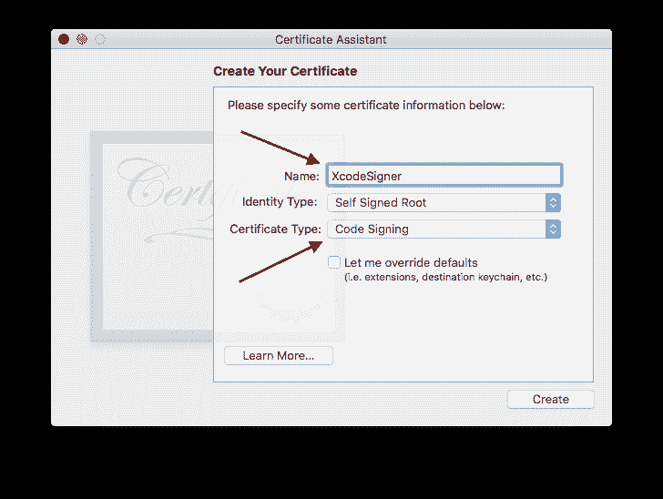

```
codesign -f -s MySelfSignedCertificate /Applications/Xcode.app
```

然而，**不可能**提交用废弃 Xcode 构建的应用程序，因为签名与 Xcode 的官方版本不匹配。一种方法是使用两个 Xcodes:一个官员用于分配，一个辞职用于开发。

### 移动到 Xcode 扩展

Xcode 扩展是正确的选择，所以我开始将我的插件转移到 extension。对于 Xmas，因为它修改了视图层次结构，所以它不能成为扩展。

#### XcodeColorSense2 中的颜色文字

为了色彩感，我从头开始重写了扩展，并将其命名为 [XcodeColorSense2](https://github.com/onmyway133/XcodeColorSense2) 。当然，这不能显示当前编辑器视图的覆盖图。所以我选择利用 Xcode 8+中的新`Color literal`。

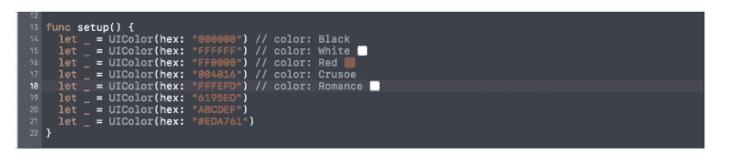

颜色显示在一个小盒子里。可能很难区分相似的颜色，所以这就是为什么我也包括名称。代码只是检查`selections`并解析以找到颜色声明。

```
func perform(with invocation: XCSourceEditorCommandInvocation, completionHandler: @escaping (Error?) -> Void ) -> Void {    guard let selection = invocation.buffer.selections.firstObject as? XCSourceTextRange else {      completionHandler(nil)      return    }
```

```
let lineNumber = selection.start.line
```

```
guard lineNumber < invocation.buffer.lines.count,      let line = invocation.buffer.lines[lineNumber] as? String else {      completionHandler(nil)      return    }
```

```
guard let hex = findHex(string: line) else {      completionHandler(nil)      return    }
```

```
let newLine = process(line: line, hex: hex)
```

```
invocation.buffer.lines.replaceObject(at: lineNumber, with: newLine)
```

```
completionHandler(nil)  }}
```

大多数功能都嵌入在我的框架 [Farge](https://github.com/onmyway133/Farge) 中，但是我找不到在 Xcode 扩展中使用[框架的方法。](https://stackoverflow.com/questions/43673353/how-to-use-framework-in-xcode-source-editor-extension)

由于扩展特性只能通过编辑器菜单访问，我们可以定制一个键绑定来调用这个菜单项。例如，我选择`Cmd+Ctrl+S`来显示和隐藏颜色信息。

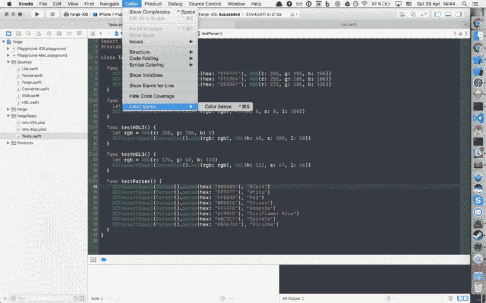

当然，与最初的插件相比，这并不直观，但总比没有好。

#### 如何调试 Xcode 扩展

工作和调试扩展非常简单。我们可以用 Xcode 来调试 Xcode。Xcode 的调试版本有一个灰色图标。

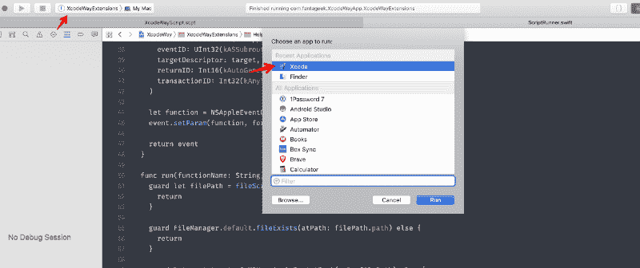

#### 如何安装 Xcode 扩展

扩展必须有一个附带的 macOS 应用程序。这可以分发到 Mac Appstore 或者自签名。我已经写了一篇关于如何做到这一点的文章。

应用程序的所有扩展都需要通过“系统偏好设置”明确启用。

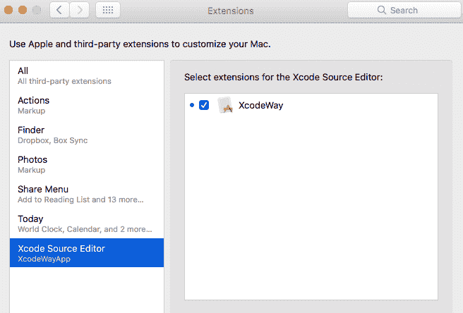

Xcode 扩展目前只适用于编辑器，所以我们必须打开一个源文件让`Editor`菜单生效。

### XcodeWay 中的 AppleScript

在 Xcode 扩展中，`NSWorkspace`、`NSTask`和私有类构造不再起作用。由于我已经在 [FinderGo](https://github.com/onmyway133/FinderGo) 中使用了 Finder Sync 扩展，我想我可以为 Xcode 扩展尝试相同的 AppleScript 脚本。

[AppleScript](https://developer.apple.com/library/archive/documentation/AppleScript/Conceptual/AppleScriptLangGuide/introduction/ASLR_intro.html) 是苹果公司创造的脚本语言。它允许用户直接控制可脚本化的 Macintosh 应用程序，以及部分 macOS 本身。您可以创建脚本(一组书面说明)来自动执行重复性任务，组合多个可脚本化应用程序的功能，并创建复杂的工作流程。

要尝试 AppleScript，可以使用 macOS 内置的 app Script 编辑器编写原型函数。函数声明以`on`开始，以`end`结束。为了避免与系统函数的潜在冲突，我通常使用`my`作为前缀。下面是我如何依靠系统事件来获取主目录。

[用户界面脚本](https://developer.apple.com/library/archive/documentation/LanguagesUtilities/Conceptual/MacAutomationScriptingGuide/AutomatetheUserInterface.html)术语可在“系统事件”脚本字典的“进程套件”中找到。该套件包括与大多数类型的用户界面元素交互的术语，包括:

*   窗子
*   按钮
*   复选框
*   菜单
*   单选按钮
*   文本字段。

在系统事件中，`process`类代表一个正在运行的应用。

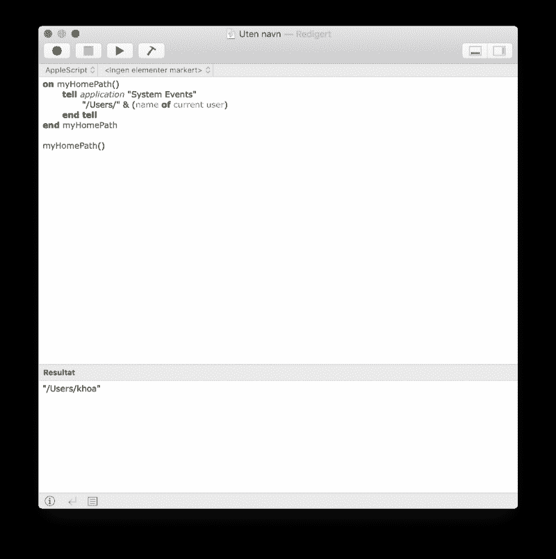

许多好公民应用程序通过公开它们的一些功能来支持 AppleScript，因此这些功能可以被其他应用程序使用。以下是我如何从 Spotify 获得当前歌曲的歌词。

```
tell application "Spotify"  set trackId to id of current track as string  set trackName to name of current track as string  set artworkUrl to artwork url of current track as string  set artistName to artist of current track as string  set albumName to album of current track as string  return trackId & "---" & trackName & "---" & artworkUrl & "---" & artistName & "---" & albumNameend tell
```

为了获得某个应用程序所有可能的命令，我们可以在脚本编辑器中打开字典。在那里，我们可以了解支持哪些函数和参数。


如果你觉得目标 C 难，AppleScript 难多了。语法冗长且容易出错。供您参考，这里是为 XcodeWay 提供动力的[完整脚本文件](https://github.com/onmyway133/XcodeWay/blob/master/XcodeWayExtensions/Script/XcodeWayScript.scpt)。

要打开某个文件夹，用`POSIX file`告诉`Finder`。为了更好地重用代码，我将每个功能都重构为函数。

```
on myOpenFolder(myPath)tell application "Finder"activateopen myPath as POSIX fileend tellend myOpenFolder
```

然后，要在 macOS 应用程序或扩展中运行 AppleScript，我们需要用正确的进程序列号和事件标识符构建一个 [AppleScript 描述符](https://github.com/onmyway133/XcodeWay/blob/master/XcodeWayExtensions/Helper/ScriptRunner.swift)。

```
func eventDescriptior(functionName: String) -> NSAppleEventDescriptor {  var psn = ProcessSerialNumber(highLongOfPSN: 0, lowLongOfPSN: UInt32(kCurrentProcess))  let target = NSAppleEventDescriptor(    descriptorType: typeProcessSerialNumber,    bytes: &psn,    length: MemoryLayout<ProcessSerialNumber>.size  )
```

```
let event = NSAppleEventDescriptor(    eventClass: UInt32(kASAppleScriptSuite),    eventID: UInt32(kASSubroutineEvent),    targetDescriptor: target,    returnID: Int16(kAutoGenerateReturnID),    transactionID: Int32(kAnyTransactionID)  )
```

```
let function = NSAppleEventDescriptor(string: functionName)  event.setParam(function, forKeyword: AEKeyword(keyASSubroutineName))
```

```
return event}
```

其他任务，比如检查当前的 Git 遥控器，要稍微复杂一些。很多时候我想把我正在调试的文件的链接分享给我的远程队友，这样他们就知道我引用的是什么文件。这可以通过在`AppleScript`中使用`shell script`来实现。

```
on myGitHubURL()set myPath to myProjectPath()set myConsoleOutput to (do shell script "cd " & quoted form of myPath & "; git remote -v")set myRemote to myGetRemote(myConsoleOutput)set myUrl to (do shell script "cd " & quoted form of myPath & "; git config --get remote." & quoted form of myRemote & ".url")set myUrlWithOutDotGit to myRemoveSubString(myUrl, ".git")end myGitHubURL
```

我们可以使用`quoted`和字符串串联来形成字符串。幸运的是，我们可以公开`Foundation`框架和某些类。下面是我如何暴露`NSString`来利用所有现有的功能。使用普通的 AppleScript 从头开始编写字符串操作会花费很多时间。

```
use scripting additionsuse framework "Foundation"property NSString : a reference to current application's NSString
```

有了这个，我们就可以构建其他的字符串处理函数了。

```
on myRemoveLastPath(myPath)set myString to NSString's stringWithString:myPathset removedLastPathString to myString's stringByDeletingLastPathComponentremovedLastPathString as textend myRemoveLastPath
```

XcodeWay 支持的一个很酷的功能是能够在模拟器中进入当前应用程序的文档目录。当我们需要检查文档以检查保存或缓存的数据时，这很方便。这个目录是动态的，所以很难被发现。但是，我们可以对目录进行排序，查找最近更新的内容。下面是我们如何链接多个`shell scripts`命令来找到文件夹。

```
on myOpenDocument()set command1 to "cd ~/Library/Developer/CoreSimulator/Devices/;"set command2 to "cd `ls -t | head -n 1`/data/Containers/Data/Application;"set command3 to "cd `ls -t | head -n 1`/Documents;"set command4 to "open ."do shell script command1 & command2 & command3 & command4end myOpenDocument
```

在开发 [Gallery](https://github.com/hyperoslo/Gallery) 来检查视频和下载的图片是否保存在正确的位置时，这个功能帮了我很大的忙。

然而，这些脚本似乎都不起作用。自 1993 年以来，脚本一直是 macOS 的一部分。但是，随着 Mac Appstore 的出现和安全问题，AppleScript 终于在 2012 年年中受到限制。那是应用沙盒被强制执行的时候。

#### 应用程序沙箱

App Sandbox 是 macOS 中提供的一种访问控制技术，在内核级强制执行。它旨在当应用程序受到威胁时，控制对系统和用户数据的损害。通过 Mac App Store 分发的应用必须采用[应用沙箱](https://www.objc.io/issues/14-mac/sandbox-scripting/)。

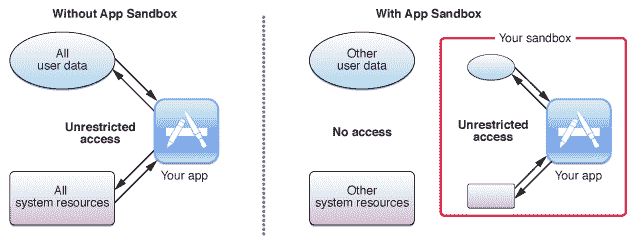

对于要由 Xcode 加载的 Xcode 扩展，它还必须支持应用程序沙盒。

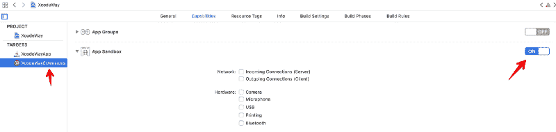

在应用程序沙盒实施的开始，我们可以使用[应用程序沙盒临时异常](https://developer.apple.com/library/archive/documentation/Miscellaneous/Reference/EntitlementKeyReference/Chapters/AppSandboxTemporaryExceptionEntitlements.html)来临时授权我们的应用程序访问 Apple Script。

现在这是不可能的。

AppleScript 运行的唯一方式是它驻留在`~/Library/Application Scripts`文件夹中。

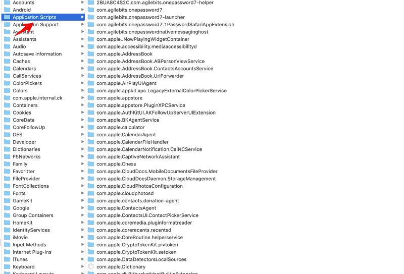

#### 如何安装自定义脚本

macOS 应用或扩展不能只是自己把脚本安装到应用脚本中。他们需要用户同意。

一种可能的方法是启用`Read/Write`并使用`NSOpenPanel`显示一个对话框，要求用户选择安装我们脚本的文件夹。

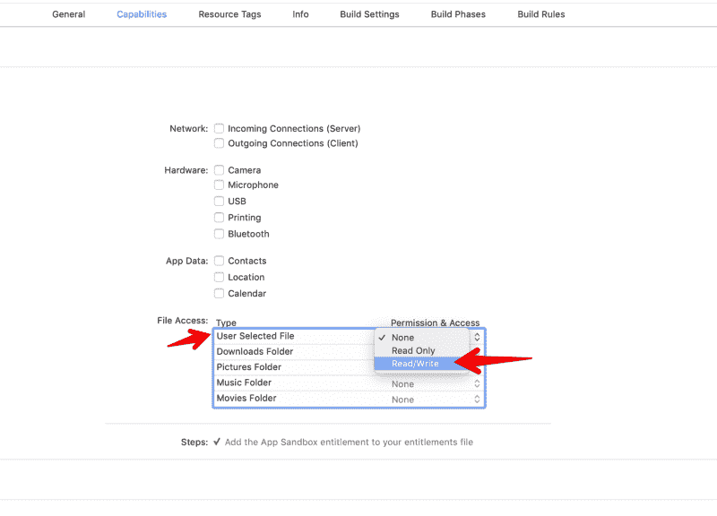

对于 XcodeWay，我选择提供一个[安装 shell 脚本](https://github.com/onmyway133/XcodeWay/blob/master/install.sh),这样用户可以快速安装脚本。

```
#!/bin/bash
```

```
set -euo pipefail
```

```
DOWNLOAD_URL=https://raw.githubusercontent.com/onmyway133/XcodeWay/master/XcodeWayExtensions/Script/XcodeWayScript.scptSCRIPT_DIR="${HOME}/Library/Application Scripts/com.fantageek.XcodeWayApp.XcodeWayExtensions"
```

```
mkdir -p "${SCRIPT_DIR}"curl $DOWNLOAD_URL -o "${SCRIPT_DIR}/XcodeWayScript.scpt"
```

AppleScript 非常强大。所有这些都是显式的，因此用户可以完全控制哪些事情可以完成。

像扩展一样，脚本在不同的进程中异步完成，使用 [XPC](https://www.objc.io/issues/14-mac/xpc/) 进行进程间通信。这增强了安全性，因为脚本无法访问我们的应用程序或扩展的地址空间。

### 马科斯莫哈韦的安全性更高

今年，在 WWDC 2018 上，苹果推出了 macOS Mojave，它专注于许多安全增强。在[您的应用和 macOS 安全的未来](https://developer.apple.com/videos/play/wwdc2018/702/)中，我们可以了解更多关于 macOS 应用的新安全要求。其中之一是 AppleEvents 的用法描述。

> 无法加载 info.plist 异常(egpu 覆盖)

我们曾经为 iOS 中的许多权限声明用法描述，比如照片库、相机和推送通知。现在我们需要声明 AppleEvents 的用法描述。

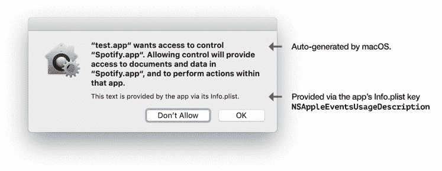

Source: [https://www.felix-schwarz.org/blog/2018/08/new-apple-event-apis-in-macos-mojave](https://www.felix-schwarz.org/blog/2018/08/new-apple-event-apis-in-macos-mojave)

我们的扩展第一次尝试执行一些 AppleScript 命令时，上面的对话框显示为请求用户同意。用户可以授予或拒绝权限，但对于 Xcode 请说是？

我们的解决方案是在我们的应用目标中声明`NSAppleEventsUsageDescription`。我们只需要在 app 目标中声明，不需要在扩展目标中声明。

```
<key>NSAppleEventsUsageDescription</key><string>Use AppleScript to open folders</string>
```

### 从这里去哪里

呼呼呼。谢谢你跟随了这么长的旅程。制作框架和工具需要很多时间，尤其是插件和扩展——我们必须不断地改变以适应新的操作系统和安全需求。但这是一个有益的过程，因为我们学到了更多，并有一些工具来节省我们的宝贵时间。

供你参考，这里是我的完全开源的扩展。

*   [XcodeWay](https://github.com/onmyway133/XcodeWay)
*   [XcodeColorSense2](https://github.com/onmyway133/XcodeColorSense2)

希望你能在帖子里找到有用的东西。以下是一些有助于进一步探索 Xcode 扩展的资源:

*   NSHipster 的 Xcode 插件
*   [在 Swift 中编写 Xcode 插件](http://merowing.info/2015/12/writing-xcode-plugin-in-swift/)
*   [Xcode 8 插件(阿卡特兹)——一个时代的终结](https://medium.com/rocknnull/xcode-8-plugins-alcatraz-the-end-of-an-era-ea6e63617d14)
*   [使用和扩展 Xcode 源代码编辑器](https://developer.apple.com/videos/play/wwdc2016/414/)
*   [为什么我需要退出 Xcode 才能使用 XVim2](https://github.com/XVimProject/XVim2/blob/master/why_resign_xcode.md)

如果你喜欢这个帖子，可以考虑访问[我的其他文章](https://github.com/onmyway133/blog/issues/165)和[应用](https://onmyway133.github.io/)？