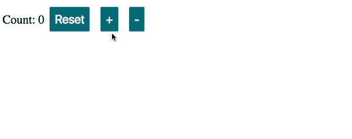
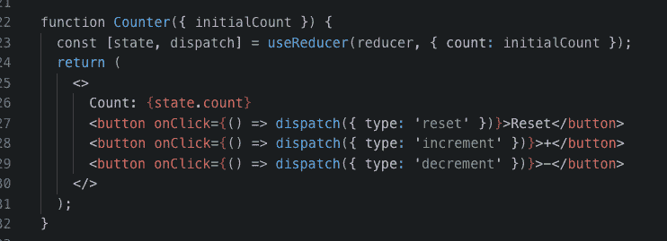
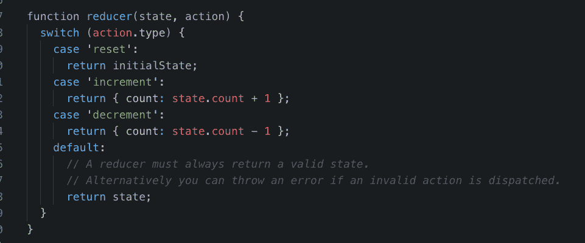
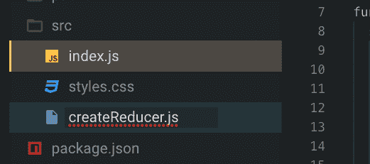
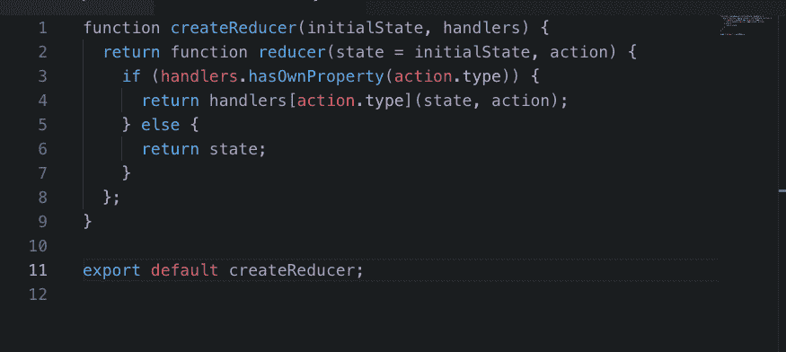
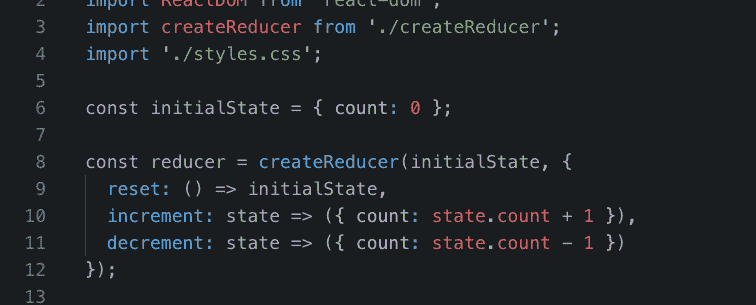

# 你知道吗——create reducer 与 React 挂钩一起工作。以下是方法。

> 原文：<https://www.freecodecamp.org/news/did-you-know-createreducer-works-with-react-hooks-heres-how-b324c558e12f/>

#### 暂时不要在生产中使用钩子

在撰写本文时， **Hooks 处于 alpha。他们的 API 可以随时更改。**

我建议你尝试，享受乐趣，在你的副业项目中使用钩子，但是不要在产品代码中使用，直到它们稳定下来。

### 源代码和演示

这里有 [GitHub](https://github.com/yazeedb/react-createReducer-demo/) 和 [Codesandbox](https://codesandbox.io/s/github/yazeedb/react-createReducer-demo/tree/master/) 链接。

### useReducer

[React 文档](https://reactjs.org/docs/hooks-reference.html#usereducer)有一个展示`useReducer`钩子的计数器应用程序示例。

出于演示的目的，我对它做了一点设计。



#### 组件代码



JSX 很简单:它用 3 个按钮显示当前的`count`。

`Counter`组件用一个缩减器和初始状态调用`useReducer`，返回一个带有当前`state`和一个`dispatch`函数的数组。

点击任何一个按钮调用带有动作对象的`dispatch`。

#### 初始状态


#### 减速器代码

reducer 根据现有的状态和它接收到的动作对象来决定状态应该如何改变。

如果你使用过 Redux，你应该知道这个设置。



我们看到它支持三个动作:`reset`、`increment`和`decrement`。

`reset`:将`count`设置为 0。

`increment`:将`count`增加 1。

`decrement`:将`count`减 1。

任何其他动作都会导致减速器返回其给定的`state`。

### 创建缩减器

你可能也知道`createReducer`。

```
function createReducer(initialState, handlers) {
  return function reducer(state = initialState, action) {
    if (handlers.hasOwnProperty(action.type)) {
      return handlers[action.type](state, action);
    } else {
      return state;
    }
  };
} 
```

它是 Redux docs 中的一个助手函数[，让您将 reducers 描述为从动作类型到处理程序的映射。](https://redux.js.org/recipes/reducingboilerplate)

#### 不再有开关盒

代替`switch`的情况，我们可以为每一种动作类型使用函数。

一个额外的好处是，如果给定的动作不匹配，`createReducer`通过返回`state`来处理`default`的情况。

#### 使用 useReducer

由于`useReducer`基于相同的原理，它们完全兼容！

我将创建一个新的项目文件`createReducer.js`。



并从中导出助手函数:



然后像这样使用它:



#### 清洁还原剂

在我看来，这样更好。

只需给它一个初始状态，以及一个将动作类型映射到相应功能的对象。

您可以访问这些函数中的`state`和`action`，这样您就拥有了您需要的所有信息！


功能一点都没变。

### 仍然只是一个减速器

这是因为`useReducer`不关心*你如何*创建一个减速器。

无论是`switch`、`if/else`，还是`createReducer`、*，只要确保你的最终结果是一个减速器*就行了。

我希望你喜欢这个简短的作品！